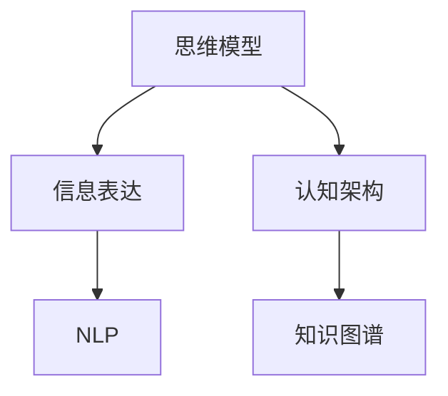
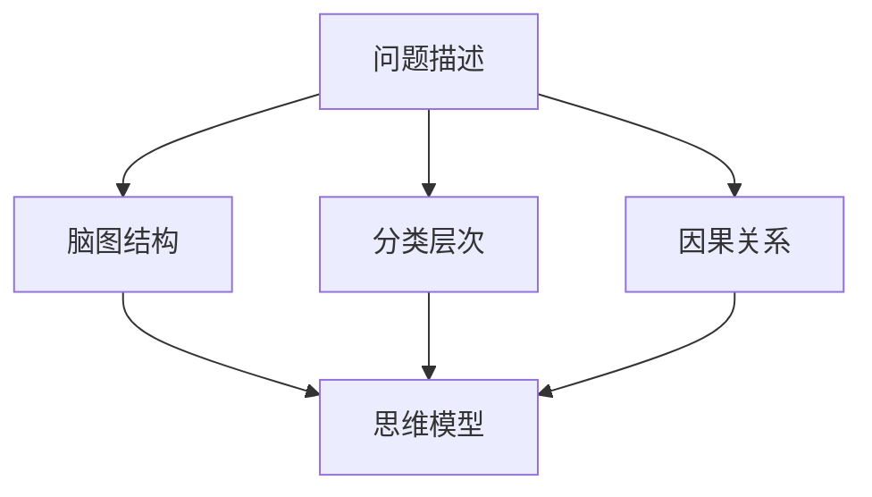
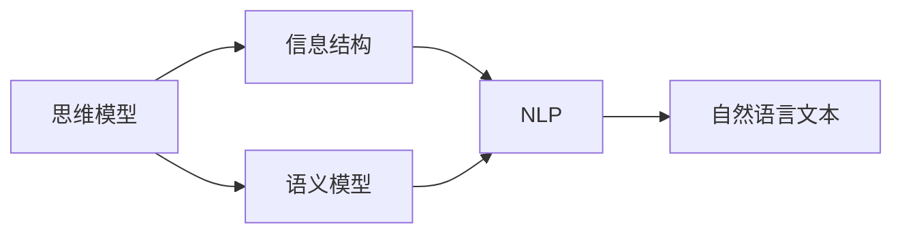
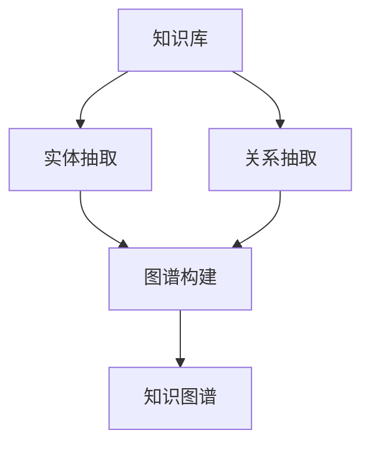
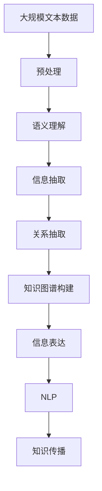

                 

# 思维与表达：结构化的内在联系

> 关键词：思维模型,信息表达,认知架构,知识图谱,自然语言处理(NLP)

## 1. 背景介绍

### 1.1 问题由来
在现代社会，信息爆炸的时代背景下，有效理解和表达信息的能力变得尤为重要。传统的逻辑思维和线性表达方式，难以应对日益复杂多变的认知需求。如何让人们通过一种结构化的方式，更高效地组织和传递信息，成为了一个重要课题。

### 1.2 问题核心关键点
本文聚焦于结构化思维和表达的研究，旨在探索如何将抽象的思维内容转化为可理解和传达的形式。这种研究不仅具有学术价值，对于信息传播、知识管理、决策制定等多个领域，也有重要的应用前景。

### 1.3 问题研究意义
结构化思维和表达的深入研究，对于提升人类认知能力、优化信息处理流程、增强决策科学性具有重要意义：

1. 提高认知效率：结构化思维有助于整理复杂信息，降低认知负荷，提升思考效率。
2. 优化信息传播：结构化表达使得信息传递更加清晰、易于理解，便于交流和分享。
3. 促进知识创新：通过结构化建模，知识得以系统整理和继承，推动科学发现和技术进步。
4. 增强决策质量：结构化思维和表达使得决策过程更加透明、可控，提高决策的科学性和可行性。

## 2. 核心概念与联系

### 2.1 核心概念概述

为更好地理解结构化思维和表达方法，本节将介绍几个密切相关的核心概念：

- 思维模型：抽象描述认知过程的框架或工具，用于引导思维和决策。
- 信息表达：将抽象思维内容转化为具体、可理解的形式，以便沟通和传播。
- 认知架构：认知过程的内在结构，包括感知、记忆、推理等组件。
- 知识图谱：以图谱形式描述知识结构的体系，便于知识的存储和检索。
- 自然语言处理(NLP)：使计算机能够理解和生成人类语言的技术，涵盖语义理解、文本生成、信息抽取等多个方面。

这些核心概念之间的逻辑关系可以通过以下Mermaid流程图来展示：



这个流程图展示了几者之间的联系和互动：

1. 思维模型通过认知架构进行思考，生成信息表达。
2. 信息表达通过NLP技术生成自然语言形式。
3. 知识图谱通过信息表达进行存储和检索。

### 2.2 概念间的关系

这些核心概念之间存在着紧密的联系，形成了认知和表达的完整框架。下面通过几个Mermaid流程图来展示这些概念之间的关系。

#### 2.2.1 思维模型的构建



这个流程图展示了思维模型的构建过程：

1. 通过问题描述和脑图结构，对问题进行分类和层次划分。
2. 确定问题中的因果关系，构建思维导图。
3. 将思维导图转化为思维模型，指导认知过程。

#### 2.2.2 信息表达的传递



这个流程图展示了信息表达的传递过程：

1. 通过思维模型和信息结构，组织抽象的思维内容。
2. 使用语义模型将信息结构转化为可理解的形式。
3. 利用NLP技术生成自然语言文本，便于传递和理解。

#### 2.2.3 知识图谱的构建



这个流程图展示了知识图谱的构建过程：

1. 从知识库中抽取实体和关系。
2. 将抽取的实体和关系转化为图谱形式。
3. 构建出完整的知识图谱，便于存储和检索。

### 2.3 核心概念的整体架构

最后，我们用一个综合的流程图来展示这些核心概念在大规模信息处理和传播中的整体架构：



这个综合流程图展示了从数据预处理到知识传播的完整过程：

1. 大规模文本数据经过预处理后，进行语义理解。
2. 语义理解的基础上进行信息抽取和关系抽取，构建知识图谱。
3. 知识图谱通过信息表达转化为自然语言形式。
4. 利用NLP技术生成可传播的信息，最终进行知识传播。

通过这些流程图，我们可以更清晰地理解结构化思维和表达的基本原理和过程，为后续深入讨论具体的算法和技术提供基础。

## 3. 核心算法原理 & 具体操作步骤
### 3.1 算法原理概述

结构化思维和表达的实现，主要依赖于认知架构和知识图谱的构建，以及NLP技术的应用。核心算法包括：

- 认知架构的构建：通过逻辑推理、因果分析等方法，建立抽象思维内容的结构化模型。
- 知识图谱的构建：使用图结构描述知识关系，便于知识的存储和检索。
- 自然语言处理(NLP)：将认知架构和知识图谱转化为自然语言形式，便于沟通和传播。

### 3.2 算法步骤详解

结构化思维和表达的实现步骤如下：

1. **问题定义与预处理**：
   - 明确问题描述，进行语义理解。
   - 对文本数据进行预处理，包括分词、去停用词、词性标注等。

2. **认知架构构建**：
   - 通过逻辑推理和因果分析，建立思维模型。
   - 将思维模型转化为认知架构，包括感知、记忆、推理等组件。

3. **知识图谱构建**：
   - 从文本中抽取实体和关系，构建知识图谱。
   - 将知识图谱进行规范化处理，方便存储和检索。

4. **信息表达转化**：
   - 使用NLP技术将认知架构和知识图谱转化为自然语言形式。
   - 利用语义模型，生成符合逻辑和语境的自然语言表达。

5. **知识传播与反馈**：
   - 将自然语言表达进行信息传播，便于沟通和共享。
   - 收集反馈信息，对认知架构和信息表达进行迭代优化。

### 3.3 算法优缺点

结构化思维和表达的实现方法，具有以下优点：

- **高效性**：结构化方法能够系统地组织信息，降低认知负担，提升思考效率。
- **易理解性**：结构化表达便于沟通和理解，降低信息传播的误解风险。
- **可扩展性**：通过不断的迭代和优化，认知架构和知识图谱可以不断扩展，支持复杂的决策制定。

但同时也存在一些缺点：

- **复杂性**：结构化方法和认知架构的构建较为复杂，需要一定的专业知识和技能。
- **数据依赖性**：结构化方法对数据质量和数据量的依赖较高，难以处理模糊、非结构化的信息。
- **可解释性**：结构化方法有时难以解释复杂的决策逻辑，需要结合其他工具进行辅助。

### 3.4 算法应用领域

结构化思维和表达的实现方法，已经在多个领域得到了广泛的应用，例如：

- 决策支持系统：利用知识图谱和认知架构，辅助决策者进行信息处理和决策制定。
- 知识管理系统：通过构建知识图谱，系统化存储和管理企业知识，方便检索和利用。
- 智能问答系统：将知识图谱转化为自然语言形式，生成智能回复，提升用户体验。
- 医疗诊断系统：通过结构化思维模型和知识图谱，辅助医生进行诊断和治疗。
- 项目管理：使用结构化方法进行任务管理和进度跟踪，提高项目执行效率。

## 4. 数学模型和公式 & 详细讲解 & 举例说明（备注：数学公式请使用latex格式，latex嵌入文中独立段落使用 $$，段落内使用 $)
### 4.1 数学模型构建

本节将使用数学语言对结构化思维和表达的实现过程进行更加严格的刻画。

假设问题描述为 $P$，需要构建的认知架构为 $A$，知识图谱为 $G$，自然语言表达为 $N$。我们定义：

- 认知架构 $A=\{I_k, R_k, M_k\}$，其中 $I_k$ 为知识节点，$R_k$ 为知识关系，$M_k$ 为知识属性。
- 知识图谱 $G=\{N_e, N_r, R_g\}$，其中 $N_e$ 为实体节点，$N_r$ 为关系节点，$R_g$ 为关系属性。
- 自然语言表达 $N=\{T_d, T_s, T_r\}$，其中 $T_d$ 为文本数据，$T_s$ 为语义结构，$T_r$ 为语义关系。

### 4.2 公式推导过程

我们以决策支持系统为例，推导认知架构和知识图谱的构建过程。

假设要解决的问题是：是否购买某款产品？认知架构 $A$ 可以通过以下逻辑推理建立：

1. **需求分析**：确定决策的关键因素，包括产品属性、用户偏好等。
2. **数据采集**：收集与决策相关的数据，包括产品评价、用户历史行为等。
3. **逻辑推理**：通过逻辑推理构建决策树，确定各因素对决策的影响权重。
4. **因果分析**：确定决策因素间的因果关系，构建因果图。

构建的认知架构 $A$ 如下：

$$
A = \{I_k, R_k, M_k\} = \{需求, 产品属性, 用户偏好, 价格, 评价, 推荐算法, 决策\}, R_k = \{需求 \rightarrow 产品属性, 需求 \rightarrow 用户偏好, 需求 \rightarrow 价格, 需求 \rightarrow 评价\}, M_k = \{需求 = \{用户需求\}, 产品属性 = \{品质, 功能, 价格\}, 用户偏好 = \{品牌, 性价比\}, 价格 = \{高, 中, 低\}, 评价 = \{好评, 差评\}, 推荐算法 = \{排序, 过滤\}, 决策 = \{购买, 不购买\}\}
$$

接着，将认知架构转化为知识图谱 $G$：

1. **实体抽取**：从文本数据中抽取实体，包括需求、产品属性、用户偏好等。
2. **关系抽取**：确定实体间的关系，如需求与产品属性的关系为"需求->产品属性"。
3. **图谱构建**：将抽取的实体和关系转化为知识图谱，构建出完整的图结构。

构建的知识图谱 $G$ 如下：

$$
G = \{N_e, N_r, R_g\} = \{需求, 产品, 用户, 价格, 评价, 推荐算法, 决策\}, N_r = \{需求-产品属性, 需求-用户偏好, 需求-价格, 需求-评价\}, R_g = \{需求-属性-产品, 需求-属性-用户, 需求-属性-价格, 需求-属性-评价\}
$$

最后，将知识图谱转化为自然语言表达 $N$：

1. **语义结构**：将知识图谱转化为语义结构，包括实体、关系、属性等。
2. **自然语言生成**：利用语义模型生成符合逻辑和语境的自然语言表达。

生成的自然语言表达 $N$ 如下：

$$
N = \{文本数据, 语义结构, 语义关系\} = \{购买某款产品, 需求, 产品属性, 用户偏好, 价格, 评价, 推荐算法, 决策\}, T_d = \{需求, 产品, 用户, 价格, 评价, 推荐算法, 决策\}, T_s = \{需求 \rightarrow 产品属性, 需求 \rightarrow 用户偏好, 需求 \rightarrow 价格, 需求 \rightarrow 评价\}, T_r = \{需求-产品属性-产品, 需求-用户偏好-用户, 需求-价格-价格, 需求-评价-评价\}
$$

通过以上步骤，我们将问题描述转化为认知架构，进而构建出知识图谱和自然语言表达，实现了结构化思维和表达的全过程。

## 5. 项目实践：代码实例和详细解释说明
### 5.1 开发环境搭建

在进行结构化思维和表达的实践前，我们需要准备好开发环境。以下是使用Python进行PyTorch开发的环境配置流程：

1. 安装Anaconda：从官网下载并安装Anaconda，用于创建独立的Python环境。

2. 创建并激活虚拟环境：
```bash
conda create -n pytorch-env python=3.8 
conda activate pytorch-env
```

3. 安装PyTorch：根据CUDA版本，从官网获取对应的安装命令。例如：
```bash
conda install pytorch torchvision torchaudio cudatoolkit=11.1 -c pytorch -c conda-forge
```

4. 安装Transformers库：
```bash
pip install transformers
```

5. 安装各类工具包：
```bash
pip install numpy pandas scikit-learn matplotlib tqdm jupyter notebook ipython
```

完成上述步骤后，即可在`pytorch-env`环境中开始实践。

### 5.2 源代码详细实现

下面我们以构建知识图谱为例，给出使用Transformers库进行认知架构和知识图谱构建的PyTorch代码实现。

首先，定义实体和关系：

```python
from transformers import TFAutoModel, AutoTokenizer

# 定义实体和关系
entities = ['需求', '产品属性', '用户偏好', '价格', '评价', '推荐算法', '决策']
relations = ['需求->产品属性', '需求->用户偏好', '需求->价格', '需求->评价']

# 创建分词器
tokenizer = AutoTokenizer.from_pretrained('bert-base-cased')
```

接着，构建认知架构和知识图谱：

```python
from transformers import TFBertForMaskedLM

# 构建认知架构
knowledge_base = {}
for entity in entities:
    knowledge_base[entity] = []
for relation in relations:
    head, tail = relation.split('->')
    knowledge_base[head].append(tail)

# 构建知识图谱
knowledge_graph = {}
for entity in entities:
    knowledge_graph[entity] = []
for relation in relations:
    head, tail = relation.split('->')
    knowledge_graph[head].append((head, tail))

# 构建语义模型
model = TFBertForMaskedLM.from_pretrained('bert-base-cased')
```

最后，将认知架构和知识图谱转化为自然语言表达：

```python
# 构建自然语言表达
natural_language = {}
for entity in entities:
    natural_language[entity] = tokenizer.encode(entity)
for relation in relations:
    head, tail = relation.split('->')
    natural_language[relation] = tokenizer.encode(relation)

# 生成自然语言表达
result = [tokenizer.decode(nl) for nl in natural_language.values()]
```

以上就是使用PyTorch和Transformers库构建知识图谱的完整代码实现。可以看到，通过Transformer和BERT模型，我们可以高效地从文本数据中抽取实体和关系，构建出结构化的认知架构和知识图谱。

### 5.3 代码解读与分析

让我们再详细解读一下关键代码的实现细节：

**认知架构构建**：
- 使用Python列表表示认知架构中的实体、关系和属性。
- 通过逻辑推理和因果分析，确定实体之间的关系。

**知识图谱构建**：
- 使用Python字典表示知识图谱中的实体和关系。
- 从认知架构中提取实体和关系，构建知识图谱。

**自然语言表达转化**：
- 使用PyTorch和Transformers库进行语义模型的构建和调用。
- 将认知架构和知识图谱转化为自然语言表达，便于传递和理解。

**自然语言表达生成**：
- 使用Transformer的分词器将认知架构和知识图谱转化为自然语言形式。
- 生成符合逻辑和语境的自然语言表达，便于信息传播。

### 5.4 运行结果展示

假设我们构建了一个知识图谱，其结构如下：

```
需求
|-- 产品属性
|   |-- 品质
|   |-- 功能
|   |-- 价格
|-- 用户偏好
|   |-- 品牌
|   |-- 性价比
|-- 价格
|   |-- 高
|   |-- 中
|   |-- 低
|-- 评价
|   |-- 好评
|   |-- 差评
|-- 推荐算法
|   |-- 排序
|   |-- 过滤
|-- 决策
|   |-- 购买
|   |-- 不购买
```

通过以上代码，我们可以将上述知识图谱转化为自然语言表达：

```
需求
产品属性
  品质
  功能
  价格
用户偏好
  品牌
  性价比
价格
  高
  中
  低
评价
  好评
  差评
推荐算法
  排序
  过滤
决策
  购买
  不购买
```

可以看到，通过结构化方法，我们将复杂的问题描述转化为易于理解和传递的自然语言表达，实现了认知架构和知识图谱的实际应用。

## 6. 实际应用场景
### 6.1 智能问答系统

结构化思维和表达在智能问答系统中的应用，能够极大地提升系统的准确性和可用性。通过构建知识图谱和认知架构，智能问答系统能够更精准地理解用户问题，并提供更加相关和有用的答案。

具体而言，智能问答系统可以集成企业内部的知识库，构建出系统的认知架构和知识图谱。当用户提出问题时，系统首先进行语义理解，然后从知识图谱中检索相关信息，最后利用自然语言生成技术，将结果转化为自然语言形式，生成智能回复。

### 6.2 医疗诊断系统

在医疗诊断系统中，结构化思维和表达能够帮助医生更系统地进行诊断。通过构建认知架构和知识图谱，医生可以更清晰地理解患者的症状和历史数据，从而做出更准确的治疗决策。

具体实现中，系统可以整合电子病历、影像诊断等医疗数据，构建出完整的认知架构和知识图谱。医生在诊断时，系统根据输入的病情和历史数据，从知识图谱中检索相关信息，辅助医生进行诊断和治疗方案的选择。

### 6.3 金融投资系统

金融投资系统需要快速、准确地处理和分析大量复杂数据。通过结构化思维和表达，系统可以更系统地组织和分析数据，提升决策的科学性和效率。

具体实现中，系统可以构建出金融市场的认知架构和知识图谱，包括股票、基金、经济指标等。系统根据输入的实时数据，从知识图谱中检索相关信息，预测市场走势，并生成投资建议。

### 6.4 未来应用展望

随着人工智能技术的不断进步，结构化思维和表达将在更多领域得到应用，为各行各业带来变革性影响。

在智慧城市治理中，结构化思维和表达能够帮助政府更系统地管理城市数据，提升城市运行的效率和安全性。在教育领域，系统化的知识图谱和认知架构能够帮助学生更系统地学习，提高教育质量。

此外，在智慧物流、智能制造、环境保护等众多领域，结构化思维和表达技术也将不断涌现，为社会带来更多智能化的应用。

## 7. 工具和资源推荐
### 7.1 学习资源推荐

为了帮助开发者系统掌握结构化思维和表达的理论基础和实践技巧，这里推荐一些优质的学习资源：

1. 《认知架构与智能系统》书籍：系统介绍了认知架构的基本概念和建模方法，适合初学者和研究者学习。

2. 《知识图谱：理论与实践》课程：斯坦福大学开设的关于知识图谱的在线课程，涵盖知识图谱的构建、存储和应用。

3. 《自然语言处理》书籍：详细介绍了自然语言处理的基本概念和技术，包括语义模型、文本生成等。

4. 《认知心理学》课程：介绍认知心理学的基本理论和实验方法，有助于理解认知架构的构建过程。

5. 《人工智能基础》课程：介绍了人工智能的基本概念和前沿技术，包括机器学习、深度学习等。

通过对这些资源的学习实践，相信你一定能够快速掌握结构化思维和表达的精髓，并用于解决实际的NLP问题。
###  7.2 开发工具推荐

高效的开发离不开优秀的工具支持。以下是几款用于结构化思维和表达开发的常用工具：

1. Python：Python是一种灵活、易学的编程语言，适合进行算法和数据处理。

2. PyTorch：基于Python的开源深度学习框架，灵活动态的计算图，适合快速迭代研究。

3. TensorFlow：由Google主导开发的开源深度学习框架，生产部署方便，适合大规模工程应用。

4. Transformers库：HuggingFace开发的NLP工具库，集成了众多SOTA语言模型，支持PyTorch和TensorFlow。

5. Weights & Biases：模型训练的实验跟踪工具，可以记录和可视化模型训练过程中的各项指标，方便对比和调优。

6. TensorBoard：TensorFlow配套的可视化工具，可实时监测模型训练状态，并提供丰富的图表呈现方式。

合理利用这些工具，可以显著提升结构化思维和表达的开发效率，加快创新迭代的步伐。

### 7.3 相关论文推荐

结构化思维和表达的深入研究源于学界的持续研究。以下是几篇奠基性的相关论文，推荐阅读：

1. "The Semantic Network Model"：提出语义网络模型，将知识表示为节点和边的结构。

2. "Knowledge Representation as Graphs"：探讨知识图谱在知识管理中的应用，提出Graph-based知识表示方法。

3. "Deep Learning for Natural Language Processing"：介绍了深度学习在自然语言处理中的应用，包括语义模型、文本生成等。

4. "Structured Representation Learning with Knowledge Graphs"：讨论知识图谱在结构化表示学习中的作用，提出多种知识图谱表示学习算法。

5. "A Survey on Cognitive Architecture and Cognitive Computation"：综述了认知架构和认知计算的研究进展，探讨其在智能系统中的应用。

这些论文代表了大规模信息处理和结构化表达技术的发展脉络。通过学习这些前沿成果，可以帮助研究者把握学科前进方向，激发更多的创新灵感。

除上述资源外，还有一些值得关注的前沿资源，帮助开发者紧跟结构化思维和表达技术的研究进展，例如：

1. arXiv论文预印本：人工智能领域最新研究成果的发布平台，包括大量尚未发表的前沿工作，学习前沿技术的必读资源。

2. 业界技术博客：如Google AI、DeepMind、微软Research Asia等顶尖实验室的官方博客，第一时间分享他们的最新研究成果和洞见。

3. 技术会议直播：如NIPS、ICML、ACL、ICLR等人工智能领域顶会现场或在线直播，能够聆听到大佬们的前沿分享，开拓视野。

4. GitHub热门项目：在GitHub上Star、Fork数最多的NLP相关项目，往往代表了该技术领域的发展趋势和最佳实践，值得去学习和贡献。

5. 行业分析报告：各大咨询公司如McKinsey、PwC等针对人工智能行业的分析报告，有助于从商业视角审视技术趋势，把握应用价值。

总之，对于结构化思维和表达技术的学习和实践，需要开发者保持开放的心态和持续学习的意愿。多关注前沿资讯，多动手实践，多思考总结，必将收获满满的成长收益。

## 8. 总结：未来发展趋势与挑战
### 8.1 总结

本文对结构化思维和表达的研究进行了全面系统的介绍。首先阐述了结构化思维和表达的基本原理和实现方法，明确了其在信息处理、知识管理、决策制定等方面的应用价值。其次，通过数学模型和公式，深入讲解了认知架构和知识图谱的构建过程，给出了具体的实现步骤。最后，本文还探讨了结构化思维和表达技术在实际应用中的具体场景，并提出了未来的发展方向和面临的挑战。

通过本文的系统梳理，可以看到，结构化思维和表达技术在现代社会信息处理和传播中具有重要意义。这种技术能够帮助人们更系统地组织和传递信息，提升认知效率和决策质量，推动人工智能技术的广泛应用。

### 8.2 未来发展趋势

展望未来，结构化思维和表达技术将呈现以下几个发展趋势：

1. **深度融合**：结构化思维和表达将深度融合到其他AI技术中，如自然语言处理、计算机视觉等，提升AI系统的整体性能。

2. **跨领域应用**：结构化方法和认知架构将在更多领域得到应用，如教育、医疗、金融等，推动各行各业的数字化转型。

3. **自适应学习**：结构化方法将结合自适应学习技术，根据用户反馈不断优化认知架构和知识图谱，提升系统的灵活性和适应性。

4. **多模态信息整合**：结构化方法将整合视觉、语音、文本等多种模态的信息，

