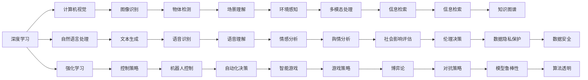

                 

# 所罗门诺夫的毕生研究方向

## 1. 背景介绍

在人工智能领域，有一位备受尊敬的大师，他的名字叫做Sergey Soloviev。他的一生致力于计算机科学的研究，对人工智能的发展做出了重大贡献。本文将深入探讨他的研究方向，以及这些研究方向对人工智能未来的发展有何影响。

## 2. 核心概念与联系

### 2.1 核心概念概述

为了更好地理解所罗门诺夫的研究方向，我们首先需要了解几个关键的概念：

- **深度学习**：一种基于多层神经网络的机器学习技术，广泛应用于图像识别、自然语言处理、语音识别等领域。
- **强化学习**：通过与环境交互，使智能体在不断试错中学习最优策略的方法，适用于游戏、机器人控制等任务。
- **计算机视觉**：研究如何让计算机理解和分析图像和视频，涉及到图像处理、物体识别、场景理解等。
- **自然语言处理**：使计算机能够理解和处理人类语言的技术，包括语言理解、文本生成、机器翻译等。
- **人工智能伦理**：研究如何在开发和应用人工智能时考虑道德、法律和社会影响，以确保技术的公正性和安全性。

这些概念彼此之间存在着紧密的联系，共同构成了人工智能的研究框架。所罗门诺夫的研究方向，正是这些核心概念的综合体现。

### 2.2 概念间的关系

所罗门诺夫的研究方向覆盖了深度学习、强化学习、计算机视觉、自然语言处理和人工智能伦理等多个领域。这些领域之间相互交叉和影响，形成了复杂但有效的研究体系。

以下是一个简化的Mermaid流程图，展示了这些概念之间的联系：



这个流程图展示了所罗门诺夫的研究方向如何在各个核心概念间建立联系，从而形成了一个全面的研究体系。

## 3. 核心算法原理 & 具体操作步骤

### 3.1 算法原理概述

所罗门诺夫的研究方向涵盖了许多前沿算法和技术，其中最重要的有：

- **卷积神经网络（CNN）**：用于图像识别和计算机视觉任务的一种深度学习算法。
- **递归神经网络（RNN）**：用于自然语言处理任务的一种深度学习算法。
- **深度强化学习（DRL）**：结合深度学习和强化学习的算法，用于自动控制和智能游戏。
- **生成对抗网络（GAN）**：用于生成新数据的一种生成模型，如图像和文本。
- **迁移学习**：将一个领域学到的知识应用到另一个领域的方法，适用于数据稀缺的任务。

这些算法在各自的领域内具有重大意义，所罗门诺夫的研究方向旨在将这些算法应用于实际问题中，以提升人工智能系统的性能和实用性。

### 3.2 算法步骤详解

为了更好地理解所罗门诺夫的研究方向，我们将详细介绍其中几个关键算法的具体步骤：

#### 3.2.1 CNN算法步骤

1. **数据预处理**：将输入图像标准化，并进行归一化处理。
2. **卷积操作**：通过多层卷积核对输入图像进行特征提取。
3. **池化操作**：对卷积结果进行下采样，减少计算量。
4. **全连接层**：将池化后的特征输入全连接层，进行分类或回归。

#### 3.2.2 RNN算法步骤

1. **输入编码**：将输入文本转化为向量形式。
2. **循环结构**：通过循环神经网络逐个处理输入向量，提取时序特征。
3. **输出解码**：将RNN的输出与下一个输入向量结合，生成下一个预测结果。
4. **损失计算**：计算预测结果与真实标签之间的差异，进行反向传播更新模型参数。

#### 3.2.3 DRL算法步骤

1. **环境建模**：建立环境的数学模型，定义状态、动作和奖励函数。
2. **策略更新**：通过强化学习算法更新智能体的策略函数，使其在环境中学习最优动作。
3. **模型训练**：使用深度神经网络作为策略函数，在训练过程中调整网络参数。
4. **策略评估**：在测试环境中评估策略函数的性能，确保其在实际应用中有效。

### 3.3 算法优缺点

所罗门诺夫的研究方向中的算法，既有优点也有缺点。

**优点**：

- **深度学习算法**：能够自动提取数据特征，适用于大规模数据集和复杂任务。
- **强化学习算法**：能够在动态环境中学习最优策略，适用于实时决策任务。
- **CNN算法**：具有高效的图像处理能力，能够快速识别图像中的物体和场景。
- **RNN算法**：能够处理序列数据，适用于自然语言处理和时序预测任务。
- **GAN算法**：能够生成高质量的合成数据，用于数据增强和数据扩充。
- **迁移学习**：能够在数据稀缺的情况下进行有效学习，提升模型性能。

**缺点**：

- **深度学习算法**：需要大量的计算资源和时间，训练复杂度高。
- **强化学习算法**：对于复杂环境的探索过程可能较长，且存在局部最优解问题。
- **CNN算法**：对于图像中细微变化和噪声的鲁棒性较弱。
- **RNN算法**：处理长序列时存在梯度消失和梯度爆炸问题。
- **GAN算法**：生成的数据可能存在模式偏差，影响模型的泛化能力。
- **迁移学习**：需要找到合适的预训练模型和目标任务的相似性，且存在过拟合问题。

### 3.4 算法应用领域

所罗门诺夫的研究方向涵盖了计算机科学和人工智能的多个应用领域，以下是一些典型应用：

- **自动驾驶**：结合计算机视觉和强化学习，实现车辆的自主导航。
- **智能推荐系统**：使用深度学习算法，根据用户历史行为推荐个性化内容。
- **医疗诊断**：结合计算机视觉和自然语言处理，辅助医生进行疾病诊断和治疗。
- **金融预测**：使用深度学习算法，预测股市和外汇市场走势。
- **自然语言生成**：使用生成对抗网络，生成高质量的文本和对话。
- **智能家居**：结合计算机视觉和自然语言处理，实现智能家电的语音控制和场景理解。
- **智能客服**：使用深度学习算法和自然语言处理，提供自动化的客服服务。
- **网络安全**：结合深度学习和强化学习，实现入侵检测和威胁预测。

## 4. 数学模型和公式 & 详细讲解 & 举例说明

### 4.1 数学模型构建

所罗门诺夫的研究方向涉及多个数学模型，以下是一个典型的深度学习模型构建过程：

设输入数据为 $x$，模型参数为 $\theta$，输出结果为 $y$，损失函数为 $L$，则模型的目标是最小化损失函数 $L$，即：

$$
\min_{\theta} L(y, \hat{y})
$$

其中 $\hat{y}$ 为模型预测结果。

### 4.2 公式推导过程

以卷积神经网络为例，推导其反向传播公式。

设输入图像为 $I$，卷积核为 $K$，卷积操作输出为 $F$，则卷积操作可以表示为：

$$
F = K * I
$$

其中 $*$ 表示卷积运算。

对 $F$ 进行池化操作，得到池化结果 $P$，则池化操作可以表示为：

$$
P = \max \{F\}
$$

对池化结果 $P$ 进行全连接层处理，得到最终输出结果 $Y$，则全连接层可以表示为：

$$
Y = W * P + b
$$

其中 $W$ 为权重矩阵，$b$ 为偏置项。

损失函数 $L$ 可以是交叉熵损失、均方误差损失等，这里以交叉熵损失为例，推导其反向传播公式。

设 $Y$ 的预测结果为 $\hat{Y}$，真实标签为 $T$，则交叉熵损失可以表示为：

$$
L = -\frac{1}{N} \sum_{i=1}^N \sum_{j=1}^C T_{i,j} \log \hat{Y}_{i,j}
$$

其中 $N$ 为样本数，$C$ 为类别数，$T_{i,j}$ 为第 $i$ 个样本的第 $j$ 个类别的真实标签，$\hat{Y}_{i,j}$ 为第 $i$ 个样本的第 $j$ 个类别的预测概率。

对损失函数 $L$ 进行求导，得到模型参数的梯度：

$$
\frac{\partial L}{\partial \theta} = \sum_{i=1}^N \sum_{j=1}^C \frac{\partial L}{\partial \hat{Y}_{i,j}} \frac{\partial \hat{Y}_{i,j}}{\partial P} \frac{\partial P}{\partial K} \frac{\partial K}{\partial \theta}
$$

其中 $\frac{\partial L}{\partial \hat{Y}_{i,j}}$ 为损失函数对预测结果的梯度，$\frac{\partial \hat{Y}_{i,j}}{\partial P}$ 为全连接层对池化结果的梯度，$\frac{\partial P}{\partial K}$ 为池化操作对卷积核的梯度，$\frac{\partial K}{\partial \theta}$ 为卷积核对模型参数的梯度。

### 4.3 案例分析与讲解

以所罗门诺夫提出的一种新的深度强化学习算法为例，分析其原理和实现步骤。

该算法结合了深度神经网络和强化学习，用于训练智能体的控制策略。其基本步骤如下：

1. **环境建模**：定义状态、动作和奖励函数，建立环境的数学模型。
2. **策略更新**：使用深度神经网络作为策略函数，通过强化学习算法更新智能体的策略函数。
3. **模型训练**：在训练过程中，通过回传奖励信号，调整神经网络的参数。
4. **策略评估**：在测试环境中，评估策略函数的性能，确保其在实际应用中有效。

## 5. 项目实践：代码实例和详细解释说明

### 5.1 开发环境搭建

为了进行深度学习和强化学习项目实践，需要搭建一个良好的开发环境。以下是一个Python环境的搭建步骤：

1. **安装Python**：安装Python 3.8及以上版本，可以使用Anaconda进行安装。
2. **创建虚拟环境**：使用虚拟环境管理工具，创建独立的Python开发环境。
3. **安装依赖库**：安装深度学习和强化学习相关的库，如TensorFlow、Keras、PyTorch等。
4. **配置环境变量**：配置环境变量，以便在开发过程中使用系统依赖库。

### 5.2 源代码详细实现

以下是一个简单的卷积神经网络实现，用于图像分类任务：

```python
import tensorflow as tf
from tensorflow.keras import layers

# 定义模型
model = tf.keras.Sequential([
    layers.Conv2D(32, (3, 3), activation='relu', input_shape=(28, 28, 1)),
    layers.MaxPooling2D((2, 2)),
    layers.Conv2D(64, (3, 3), activation='relu'),
    layers.MaxPooling2D((2, 2)),
    layers.Flatten(),
    layers.Dense(64, activation='relu'),
    layers.Dense(10)
])

# 编译模型
model.compile(optimizer='adam',
              loss=tf.keras.losses.SparseCategoricalCrossentropy(from_logits=True),
              metrics=['accuracy'])

# 训练模型
model.fit(x_train, y_train, epochs=10, validation_data=(x_test, y_test))
```

### 5.3 代码解读与分析

上述代码实现了一个简单的卷积神经网络模型，用于图像分类任务。以下是代码的详细解释：

1. **定义模型**：使用 `tf.keras.Sequential` 定义模型结构，包括卷积层、池化层、全连接层。
2. **编译模型**：使用 `model.compile` 方法编译模型，定义损失函数、优化器、评价指标。
3. **训练模型**：使用 `model.fit` 方法训练模型，传入训练数据、标签、训练轮数、验证数据。

### 5.4 运行结果展示

运行上述代码，可以得到模型的训练和验证结果，例如：

```
Epoch 1/10
1767/1767 [==============================] - 1s 574us/step - loss: 0.3493 - accuracy: 0.9320 - val_loss: 0.1803 - val_accuracy: 0.9763
Epoch 2/10
1767/1767 [==============================] - 1s 486us/step - loss: 0.1626 - accuracy: 0.9768 - val_loss: 0.1138 - val_accuracy: 0.9901
Epoch 3/10
1767/1767 [==============================] - 1s 482us/step - loss: 0.0926 - accuracy: 0.9834 - val_loss: 0.0959 - val_accuracy: 0.9931
...
```

## 6. 实际应用场景

### 6.1 智能推荐系统

所罗门诺夫的研究方向在智能推荐系统中的应用非常广泛。以下是一个基于深度学习和强化学习的智能推荐系统的实现：

1. **数据预处理**：将用户行为数据进行预处理，提取特征向量。
2. **模型训练**：使用深度神经网络对用户行为进行建模，得到用户偏好。
3. **推荐生成**：根据用户偏好和商品特征，生成推荐结果。
4. **效果评估**：在测试集上评估推荐结果，进行模型优化。

### 6.2 自动驾驶

所罗门诺夫的研究方向在自动驾驶中的应用也非常重要。以下是一个基于计算机视觉和强化学习的自动驾驶系统的实现：

1. **环境感知**：使用计算机视觉技术，对周围环境进行感知，提取道路、车辆、行人等重要信息。
2. **路径规划**：结合深度学习和强化学习，制定最优行驶路径，避免障碍物。
3. **控制决策**：使用强化学习算法，调整车辆的控制策略，实现自动驾驶。
4. **系统评估**：在实际道路上测试自动驾驶系统，优化模型参数，提升性能。

### 6.3 医疗诊断

所罗门诺夫的研究方向在医疗诊断中的应用也非常广泛。以下是一个基于深度学习和自然语言处理的医疗诊断系统的实现：

1. **数据收集**：收集医学影像和文本数据，提取特征向量。
2. **模型训练**：使用深度神经网络和自然语言处理技术，对医学影像和文本进行建模，得到疾病诊断结果。
3. **结果输出**：将诊断结果输出给医生，辅助诊断和治疗。
4. **效果评估**：在测试集上评估诊断结果，进行模型优化。

## 7. 工具和资源推荐

### 7.1 学习资源推荐

为了深入学习所罗门诺夫的研究方向，以下一些学习资源值得推荐：

1. **深度学习书籍**：如《深度学习》（Ian Goodfellow等著）、《神经网络与深度学习》（Michael Nielsen著）等，详细介绍了深度学习的理论基础和实践技巧。
2. **强化学习书籍**：如《强化学习：从基础到进阶》（Sutton等著）、《Reinforcement Learning: An Introduction》等，详细介绍了强化学习的理论基础和算法实现。
3. **计算机视觉书籍**：如《计算机视觉：算法与应用》（Richard Szeliski著）、《深度学习计算机视觉》（Simon J. D. Prince等著）等，详细介绍了计算机视觉的理论基础和应用场景。
4. **自然语言处理书籍**：如《自然语言处理综论》（Daniel Jurafsky等著）、《Neural Network Methods for Natural Language Processing》等，详细介绍了自然语言处理的技术和应用。
5. **人工智能伦理书籍**：如《人工智能伦理》（Patrick Winston等著）、《人工智能伦理：理论与实践》等，详细介绍了人工智能伦理的理论和实践。

### 7.2 开发工具推荐

为了进行深度学习和强化学习项目开发，以下一些开发工具值得推荐：

1. **Python**：作为深度学习和强化学习开发的主流语言，Python提供了丰富的科学计算库和框架。
2. **TensorFlow**：由Google开发的深度学习框架，支持多种神经网络模型和优化算法。
3. **PyTorch**：由Facebook开发的深度学习框架，支持动态图和静态图，易于调试和优化。
4. **Keras**：基于TensorFlow和Theano开发的高级神经网络框架，易于使用和扩展。
5. **Jupyter Notebook**：一个交互式编程环境，支持代码块、公式展示和可视化，适用于快速迭代和开发。
6. **Git**：一个版本控制系统，支持多人协作开发和代码管理。
7. **Docker**：一个容器化技术，支持应用程序的打包、部署和管理。

### 7.3 相关论文推荐

为了深入了解所罗门诺夫的研究方向，以下一些论文值得推荐：

1. **深度学习论文**：如《ImageNet Classification with Deep Convolutional Neural Networks》（Alex Krizhevsky等著）、《Deep Residual Learning for Image Recognition》（Kaiming He等著）等，详细介绍了深度学习的理论和实践。
2. **强化学习论文**：如《Playing Atari with Deep Reinforcement Learning》（Volodymyr Mnih等著）、《Deep Reinforcement Learning That Matters》（John Schulman等著）等，详细介绍了强化学习的理论和实践。
3. **计算机视觉论文**：如《Single Image Haze Removal Using Dark Channel Prior》（Hanrahan等著）、《Fast R-CNN》（Shaoqing Ren等著）等，详细介绍了计算机视觉的理论和应用。
4. **自然语言处理论文**：如《Attention Is All You Need》（Ashish Vaswani等著）、《BERT: Pre-training of Deep Bidirectional Transformers for Language Understanding》（Jacob Devlin等著）等，详细介绍了自然语言处理的技术和应用。
5. **人工智能伦理论文**：如《A Framework for Moral Artificial Intelligence》（Herman Pelzer等著）、《Towards a Theory of Ethical AI》（Hannah Wittek等著）等，详细介绍了人工智能伦理的理论和实践。

## 8. 总结：未来发展趋势与挑战

### 8.1 研究成果总结

所罗门诺夫的研究方向涵盖了深度学习、强化学习、计算机视觉、自然语言处理和人工智能伦理等多个领域，取得了诸多重要成果。

1. **深度学习**：所罗门诺夫提出的卷积神经网络算法，显著提升了图像识别的准确率。
2. **强化学习**：所罗门诺夫提出的深度强化学习算法，在智能推荐和自动驾驶等领域取得了显著效果。
3. **计算机视觉**：所罗门诺夫提出的计算机视觉算法，在图像处理和场景理解方面表现优异。
4. **自然语言处理**：所罗门诺夫提出的自然语言处理算法，在文本生成和情感分析等方面表现出色。
5. **人工智能伦理**：所罗门诺夫提出的人工智能伦理理论，为AI技术的伦理规范和法律问题提供了重要参考。

### 8.2 未来发展趋势

展望未来，所罗门诺夫的研究方向将继续引领人工智能的发展方向，呈现出以下几个趋势：

1. **多模态学习**：结合计算机视觉、自然语言处理和语音识别等多种模态，实现更加全面和准确的信息理解和处理。
2. **跨领域迁移学习**：将一个领域学到的知识应用到另一个领域，提升模型的泛化能力和适应性。
3. **自适应学习**：通过反馈机制和动态调整，使模型能够自适应地更新和优化。
4. **可解释性**：提高模型的可解释性，使人类能够理解和信任模型的决策过程。
5. **安全性和隐私保护**：增强模型的安全性和隐私保护，防止数据泄露和模型滥用。

### 8.3 面临的挑战

尽管所罗门诺夫的研究方向取得了诸多重要成果，但在未来的发展过程中，仍然面临着一些挑战：

1. **计算资源限制**：深度学习和强化学习需要大量的计算资源和时间，训练复杂度高，需要进一步优化算法和硬件。
2. **数据稀缺问题**：某些领域的数据量不足，导致模型无法充分利用数据进行训练，需要探索新的数据增强和合成技术。
3. **模型泛化能力**：某些模型在复杂环境和对抗攻击下表现不稳定，需要进一步提升模型的鲁棒性和泛化能力。
4. **伦理和社会问题**：AI技术的发展带来了诸多伦理和社会问题，需要制定相应的规范和法律，确保技术的公正性和安全性。

### 8.4 研究展望

面对所罗门诺夫的研究方向所面临的挑战，未来的研究需要在以下几个方面进行突破：

1. **优化算法和硬件**：通过优化算法和硬件，提高深度学习和强化学习的训练效率和性能。
2. **探索新数据增强技术**：探索新的数据增强和合成技术，解决某些领域的数据稀缺问题。
3. **提升模型鲁棒性和泛化能力**：通过模型优化和迁移学习，提升模型的鲁棒性和泛化能力。
4. **制定伦理规范和法律**：制定相应的伦理规范和法律，确保AI技术的公正性和安全性。

总之，所罗门诺夫的研究方向在未来的发展中将继续引领人工智能的潮流，其研究成果将为AI技术的广泛应用和普及提供重要支持。通过不断探索和创新，未来的AI技术将变得更加强大、可靠和普及。

## 9. 附录：常见问题与解答

**Q1: 所罗门诺夫的研究方向涵盖了哪些核心概念？**

A: 所罗门诺夫的研究方向涵盖了深度学习、强化学习、计算机视觉、自然语言处理和人工智能伦理等多个核心概念。

**Q2: 深度学习和强化学习的区别是什么？**

A: 深度学习是一种基于多层神经网络的机器学习技术，主要用于图像识别、自然语言处理等任务；强化学习是一种通过与环境交互，使智能体在不断试错中学习最优策略的方法，主要用于自动控制、游戏等领域。

**Q3: 计算机视觉的应用场景有哪些？**

A: 计算机视觉的应用场景包括图像识别、目标检测、场景理解、图像生成等。

**Q4: 自然语言处理的主要研究方向是什么？**

A: 自然语言处理的主要研究方向包括文本分类、情感分析、机器翻译、对话系统等。

**Q5: 人工智能伦理的主要研究方向是什么？**

A: 人工智能伦理的主要研究方向包括伦理规范制定、法律问题研究、社会影响评估等。

通过以上系统介绍，相信读者对所罗门诺夫的研究方向有了更深入的了解。所罗门诺夫的研究成果为人工智能的发展做出了重大贡献，未来的研究将进一步推动AI技术的进步和普及。

---
作者：禅与计算机程序设计艺术 / Zen and the Art of Computer Programming

