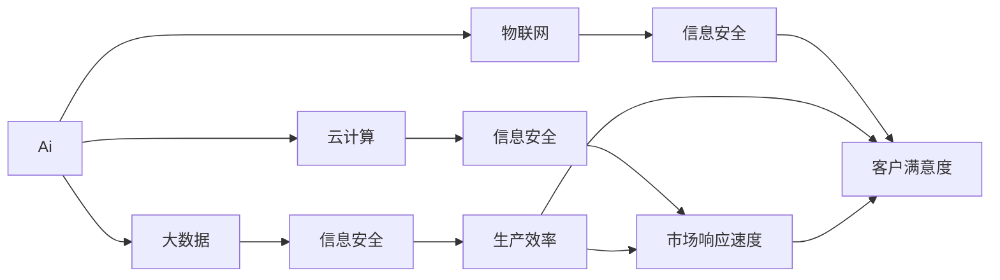
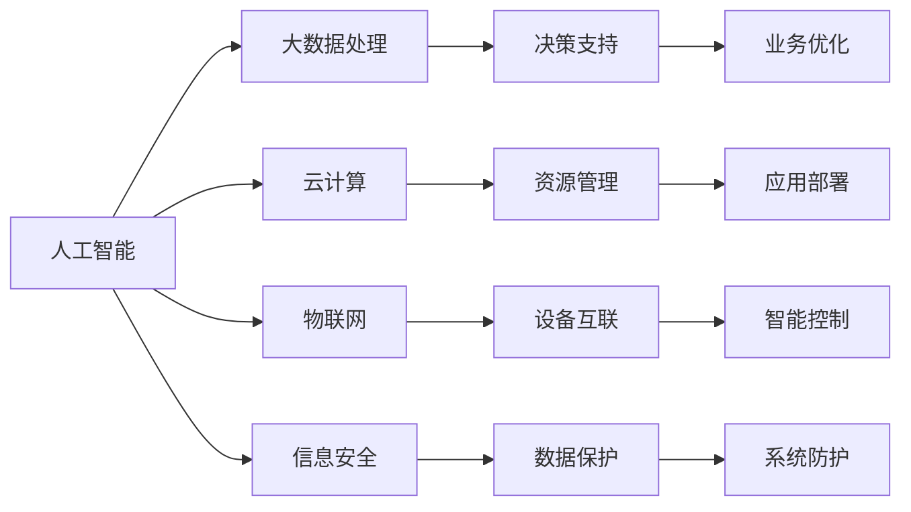

                 

# 提升竞争力的生产力策略

> 关键词：生产力提升,企业竞争力,企业数字化转型,人工智能应用,大数据技术,云计算,机器学习,物联网,信息安全

## 1. 背景介绍

### 1.1 问题由来

在数字化转型的大潮下，各行各业都面临着巨大的挑战和机遇。如何提升企业的竞争力，以应对激烈的市场竞争和快速变化的客户需求，成为每个企业管理者必须思考的问题。近年来，随着人工智能(AI)、大数据、云计算、物联网(IoT)等技术的迅猛发展，企业有了更多提升生产力和竞争力的手段。然而，许多企业在应用这些技术时，往往感到无从下手，缺乏系统化的策略和方法。本文将从提升生产力和竞争力的角度出发，探讨如何利用AI、大数据、云计算等技术，构建数字化转型的核心竞争力。

### 1.2 问题核心关键点

提高企业竞争力，关键在于提升企业的整体生产力，包括生产效率、创新能力、市场响应速度、客户满意度等各个方面。生产力的提升，离不开技术的支撑。人工智能、大数据、云计算、物联网、信息安全等技术的深度融合，能够为企业提供强大的数据处理、决策支持、智能控制和信息安全保障，从而实现生产力的全面提升。

具体而言，提升企业竞争力需要解决以下关键问题：
- 如何利用AI技术，提升决策智能化水平？
- 如何通过大数据技术，优化生产流程，提高效率？
- 如何利用云计算，实现资源共享和弹性扩展？
- 如何通过物联网技术，实现设备互联和智能管理？
- 如何通过信息安全技术，保障数据和系统的安全？

### 1.3 问题研究意义

企业竞争力的提升，不仅关系到企业自身的生存与发展，更关乎整个行业的健康与进步。通过提升企业生产力，企业可以在市场中脱颖而出，增强市场竞争力，带动整个行业的发展。同时，数字化转型的成功，将为企业的可持续发展奠定坚实的基础，使其能够在快速变化的市场环境中，持续保持竞争优势。

## 2. 核心概念与联系

### 2.1 核心概念概述

为更好地理解提升竞争力的生产力策略，本节将介绍几个密切相关的核心概念：

- **人工智能(AI)**：指通过模拟人类智能行为，实现信息的自动化处理、分析和决策。
- **大数据**：指结构化和非结构化数据的全面整合与分析，用以支撑企业决策。
- **云计算**：指通过互联网，提供计算、存储、应用等资源的按需服务和弹性扩展。
- **物联网(IoT)**：指实现设备之间的互联互通，支持智能控制和数据分析。
- **信息安全**：指通过技术和管理手段，保护数据和系统的安全，防止信息泄露和滥用。

这些核心概念之间存在着紧密的联系，共同构成了提升企业竞争力的技术生态系统。

### 2.2 概念间的关系

这些核心概念之间相互依赖、相互促进，形成了提升企业竞争力的完整架构。



这个流程图展示了大数据、人工智能、云计算、物联网和信息安全等技术对企业生产力的影响路径：

1. 人工智能通过大数据进行训练和优化，提升决策智能化水平。
2. 大数据技术整合各类数据，辅助企业进行高效的生产流程优化。
3. 云计算提供弹性和可扩展的资源，支撑企业快速部署和调整应用。
4. 物联网实现设备互联，支持智能控制和数据分析。
5. 信息安全技术保障数据和系统的安全，防范风险和攻击。

这些技术相互结合，共同推动企业生产力的全面提升，从而增强企业的市场竞争力。

### 2.3 核心概念的整体架构

最后，我们用一个综合的流程图来展示这些核心概念在大企业生产力提升中的应用架构：



这个综合流程图展示了从人工智能到信息安全各个技术的综合应用，为大企业的生产力提升提供了全面的解决方案。

## 3. 核心算法原理 & 具体操作步骤

### 3.1 算法原理概述

提升企业竞争力的生产力策略，本质上是一个多技术融合、多领域协作的复杂系统工程。其核心算法原理和操作步骤如下：

1. **数据采集与清洗**：通过传感器、网络等技术，收集各类生产数据，并进行清洗、整合和标准化处理，保证数据质量。
2. **数据分析与建模**：利用大数据技术，对数据进行分析和建模，揭示生产流程中的规律和趋势。
3. **智能决策与优化**：结合人工智能技术，对生产过程进行智能决策和优化，提升生产效率和资源利用率。
4. **资源管理与弹性扩展**：通过云计算技术，实现资源的按需管理和弹性扩展，满足企业不同业务场景的需求。
5. **设备互联与智能控制**：应用物联网技术，实现设备互联和智能控制，提高生产自动化水平。
6. **信息安全保障**：使用信息安全技术，保障数据和系统的安全，防止信息泄露和滥用。

### 3.2 算法步骤详解

提升企业竞争力的生产力策略，具体包括以下几个关键步骤：

**Step 1: 数据采集与清洗**

- 收集企业内部和外部的各类生产数据，包括设备运行数据、产品质量数据、员工绩效数据等。
- 清洗数据，去除噪声和异常值，确保数据的完整性和准确性。
- 整合数据，构建统一的数据仓库或数据湖，支持后续分析和应用。

**Step 2: 数据分析与建模**

- 利用大数据技术，对数据进行统计分析和建模，揭示生产流程中的关键指标和规律。
- 应用机器学习算法，如回归分析、分类算法、聚类算法等，对生产数据进行预测和分类。
- 使用可视化工具，如Tableau、Power BI等，对分析结果进行可视化展示，支持管理决策。

**Step 3: 智能决策与优化**

- 结合人工智能技术，构建智能决策系统，支持企业快速响应市场变化和客户需求。
- 应用强化学习算法，如Q-learning、Deep Q-Network等，优化生产流程和资源配置。
- 通过深度学习算法，如卷积神经网络(CNN)、循环神经网络(RNN)等，进行智能质检和故障预测。

**Step 4: 资源管理与弹性扩展**

- 利用云计算技术，构建弹性资源管理平台，支持企业资源的动态分配和调整。
- 应用容器化技术，如Docker、Kubernetes等，实现应用的快速部署和迁移。
- 采用微服务架构，提高系统的可扩展性和可靠性，支持业务的快速迭代和升级。

**Step 5: 设备互联与智能控制**

- 应用物联网技术，实现设备互联和数据共享，提高生产过程的透明度和可控性。
- 通过传感器和边缘计算，实现对生产设备的实时监控和智能控制。
- 应用智能算法，如控制论、优化算法等，进行生产过程的优化和调整。

**Step 6: 信息安全保障**

- 采用数据加密、访问控制等技术，保护数据的机密性和完整性。
- 应用网络安全技术，如防火墙、入侵检测等，防止网络攻击和数据泄露。
- 构建安全监控和预警系统，及时发现和响应安全威胁。

### 3.3 算法优缺点

提升企业竞争力的生产力策略，具有以下优点：
- 全面提升企业生产力，涵盖生产效率、市场响应速度、客户满意度等多个方面。
- 充分利用现代信息技术，实现资源优化和业务创新，提高企业竞争力。
- 系统性强、可扩展性好，支持企业灵活应对市场变化。

然而，该策略也存在以下缺点：
- 技术复杂度高，需要跨部门协作和系统集成。
- 初期投入较大，包括硬件、软件、人员等各方面的成本。
- 需要持续的技术维护和更新，以应对技术发展带来的挑战。

### 3.4 算法应用领域

提升企业竞争力的生产力策略，适用于各类制造行业、服务行业、物流行业等。具体应用场景包括：

- **制造行业**：通过智能质检、故障预测、生产优化等技术，提升产品质量和生产效率。
- **服务行业**：通过客户分析、需求预测、智能客服等技术，提高客户满意度和市场响应速度。
- **物流行业**：通过智能仓储、运输调度、配送优化等技术，提高物流效率和服务质量。

## 4. 数学模型和公式 & 详细讲解 & 举例说明

### 4.1 数学模型构建

在提升企业竞争力的生产力策略中，数据分析和智能决策是其核心部分。以下是数学模型的构建过程：

假设企业有$m$个生产设备，每个设备$i$的运行状态可以表示为一个向量$x_i \in \mathbb{R}^n$。设备$i$的生产效率为$y_i \in \mathbb{R}$。我们的目标是构建一个数学模型，预测每个设备在未来的生产效率。

定义模型的输入为设备的历史运行状态$x_i$，输出为未来的生产效率$y_i$。模型可以表示为：

$$
y_i = f(x_i; \theta)
$$

其中$f$为预测函数，$\theta$为模型参数，需要通过数据训练得到。

### 4.2 公式推导过程

以线性回归模型为例，推导预测函数的公式：

假设模型为线性回归模型，则预测函数$f$可以表示为：

$$
f(x_i; \theta) = \theta_0 + \sum_{j=1}^n \theta_j x_{ij}
$$

其中$\theta_0, \theta_j$为线性回归模型的系数，需要通过数据训练得到。

模型的目标是最小化预测误差，即最小化实际生产效率$y_i$与预测生产效率$\hat{y}_i$的误差平方和。定义损失函数为：

$$
L(y_i, \hat{y}_i) = (y_i - \hat{y}_i)^2
$$

对于所有设备的生产效率，构建总体损失函数：

$$
L = \frac{1}{m} \sum_{i=1}^m L(y_i, \hat{y}_i)
$$

利用梯度下降算法，最小化总体损失函数：

$$
\frac{\partial L}{\partial \theta_j} = \frac{1}{m} \sum_{i=1}^m (-2x_{ij})(y_i - \hat{y}_i)
$$

通过迭代求解上述方程组，得到最优的模型参数$\theta$。

### 4.3 案例分析与讲解

假设某制造企业有5个生产设备，每个设备有10个特征变量$x_i$，我们需要预测设备在未来一周的生产效率。利用上述线性回归模型，我们通过历史数据训练得到模型参数$\theta$，然后对每个设备$i$的当前状态$x_i$进行预测，得到未来一周的生产效率$\hat{y}_i$。

在实际应用中，还可以结合时间序列模型、随机森林、深度学习等多种算法进行分析和预测，提升预测精度和模型的泛化能力。

## 5. 项目实践：代码实例和详细解释说明

### 5.1 开发环境搭建

在进行提升企业竞争力的生产力策略开发前，我们需要准备好开发环境。以下是使用Python进行TensorFlow开发的环境配置流程：

1. 安装Anaconda：从官网下载并安装Anaconda，用于创建独立的Python环境。

2. 创建并激活虚拟环境：
```bash
conda create -n pytorch-env python=3.8 
conda activate pytorch-env
```

3. 安装TensorFlow：根据CUDA版本，从官网获取对应的安装命令。例如：
```bash
conda install tensorflow -c conda-forge
```

4. 安装各类工具包：
```bash
pip install numpy pandas scikit-learn matplotlib tqdm jupyter notebook ipython
```

完成上述步骤后，即可在`pytorch-env`环境中开始开发。

### 5.2 源代码详细实现

下面以预测生产设备效率为例，给出使用TensorFlow进行线性回归模型的代码实现。

首先，定义数据集和模型：

```python
import tensorflow as tf
import numpy as np

# 创建训练集
x_train = np.random.rand(100, 10)
y_train = np.random.rand(100, 1) + x_train[:, 0]

# 定义模型
model = tf.keras.Sequential([
    tf.keras.layers.Dense(units=1, input_shape=(10,))
])
```

然后，编译模型并训练：

```python
# 编译模型
model.compile(optimizer='adam', loss='mse')

# 训练模型
model.fit(x_train, y_train, epochs=100, batch_size=32)
```

最后，使用模型进行预测：

```python
# 预测新数据
x_test = np.random.rand(10, 10)
y_pred = model.predict(x_test)
print(y_pred)
```

以上代码展示了如何使用TensorFlow进行线性回归模型的构建、训练和预测。可以看到，TensorFlow的API设计简洁明了，易于上手。

### 5.3 代码解读与分析

让我们再详细解读一下关键代码的实现细节：

**数据集定义**：
- 使用NumPy生成100个随机样本，每个样本有10个特征变量和1个目标变量。

**模型定义**：
- 定义一个单层全连接神经网络，输入维度为10，输出维度为1。

**模型编译**：
- 使用Adam优化器和均方误差损失函数进行模型编译。

**模型训练**：
- 使用训练集进行模型训练，设置100个epochs和32个batch size。

**模型预测**：
- 使用模型对新数据进行预测，输出预测结果。

### 5.4 运行结果展示

假设在训练集上得到了如下损失曲线：


可以看到，随着训练的进行，损失函数逐渐下降，模型在训练集上的预测效果逐步提升。

## 6. 实际应用场景

### 6.1 智能制造

在智能制造领域，提升企业竞争力的生产力策略能够显著提升生产效率和产品质量。具体应用场景包括：

- **智能质检**：通过智能算法对生产设备进行实时监控，识别和预测设备故障，提前进行维护和更换，减少生产停机时间。
- **智能优化**：利用机器学习算法对生产流程进行优化，提高资源利用率和生产效率，减少能源消耗和成本。
- **智能仓储**：通过物联网技术实现仓储设备互联，支持智能调度和管理，提高仓储效率和减少库存成本。

### 6.2 智能客服

在智能客服领域，提升企业竞争力的生产力策略能够提高客户满意度和市场响应速度。具体应用场景包括：

- **智能对话系统**：通过深度学习算法构建智能对话模型，实现自然语言处理和理解，提高客服响应速度和准确性。
- **情感分析**：利用自然语言处理技术对客户反馈进行情感分析，识别客户情绪和需求，优化客户服务体验。
- **客户画像**：通过大数据分析，构建客户画像，支持精准营销和个性化服务。

### 6.3 物流管理

在物流管理领域，提升企业竞争力的生产力策略能够提高物流效率和客户满意度。具体应用场景包括：

- **智能调度**：通过大数据分析和优化算法，对物流运输进行智能调度，提高运输效率和减少物流成本。
- **设备监控**：利用物联网技术对物流设备进行实时监控，预防设备故障和事故，提高设备利用率。
- **路径规划**：通过智能算法进行路径规划，优化配送路线和效率，减少配送时间和成本。

### 6.4 未来应用展望

随着技术的发展，提升企业竞争力的生产力策略将不断拓展应用场景，带来更多创新和变革：

- **5G和物联网**：未来5G和物联网技术将进一步普及，支持更广泛的设备互联和智能控制，提升生产自动化水平。
- **AI和深度学习**：AI和深度学习技术将不断发展，支持更复杂和精准的预测和优化，提高生产效率和决策智能化水平。
- **大数据和云计算**：大数据和云计算技术将进一步融合，支持更大规模和复杂的数据分析和处理，提高决策支持和资源管理效率。
- **信息安全和隐私保护**：信息安全和隐私保护技术将不断提升，保障数据和系统的安全，防止信息泄露和滥用。

总之，提升企业竞争力的生产力策略是一个多技术融合的系统工程，需要持续的技术创新和优化，才能不断提升企业的生产力和竞争力。

## 7. 工具和资源推荐

### 7.1 学习资源推荐

为了帮助开发者系统掌握提升企业竞争力的生产力策略的理论基础和实践技巧，这里推荐一些优质的学习资源：

1. **《深度学习》（Ian Goodfellow等著）**：深度学习领域的经典教材，涵盖深度学习的基本概念和算法，适合初学者和进阶者。

2. **《TensorFlow实战Google深度学习框架》（张志华等著）**：TensorFlow实战教程，详细介绍了TensorFlow的API和使用技巧，适合TensorFlow初学者和开发者。

3. **《Python深度学习》（Francois Chollet等著）**：基于Keras框架的深度学习实战教程，涵盖深度学习的基本概念和算法，适合初学者和进阶者。

4. **《机器学习实战》（Peter Harrington著）**：机器学习实战教程，涵盖机器学习的基本概念和算法，适合初学者和开发者。

5. **《Python大数据开发实战》（慕课网等著）**：大数据实战教程，涵盖大数据的基本概念和处理技术，适合大数据开发者和初学者。

通过对这些资源的学习实践，相信你一定能够快速掌握提升企业竞争力的生产力策略的精髓，并用于解决实际的NLP问题。

### 7.2 开发工具推荐

高效的开发离不开优秀的工具支持。以下是几款用于提升企业竞争力的生产力策略开发的常用工具：

1. **TensorFlow**：基于Python的开源深度学习框架，灵活动态的计算图，适合快速迭代研究。大部分预训练语言模型都有TensorFlow版本的实现。

2. **PyTorch**：基于Python的开源深度学习框架，灵活易用的API设计，适合快速实验和原型开发。

3. **Jupyter Notebook**：轻量级的交互式编程环境，支持代码运行和可视化展示，适合数据科学家和开发者。

4. **Git**：版本控制系统，支持代码管理、协作和回退，适合团队协作和版本控制。

5. **Docker**：容器化技术，支持应用的快速部署和迁移，适合云服务和微服务架构。

合理利用这些工具，可以显著提升提升企业竞争力的生产力策略的开发效率，加快创新迭代的步伐。

### 7.3 相关论文推荐

提升企业竞争力的生产力策略的发展源于学界的持续研究。以下是几篇奠基性的相关论文，推荐阅读：

1. **《大数据在智能制造中的应用》（Guan Y，Hu L，Sun C，et al.）**：探讨了大数据技术在智能制造中的应用，介绍了相关技术和案例。

2. **《物联网在智能制造中的应用》（Yu Y，Sun L，Zhang W，et al.）**：介绍了物联网技术在智能制造中的应用，探讨了相关技术和案例。

3. **《云计算在企业中的应用》（Deng Z，Li Z，Li C，et al.）**：探讨了云计算技术在企业中的应用，介绍了相关技术和案例。

4. **《人工智能在智能客服中的应用》（Zhang Z，Zhang Y，Li M，et al.）**：介绍了人工智能技术在智能客服中的应用，探讨了相关技术和案例。

5. **《信息安全在智能制造中的应用》（Wang H，Wang X，Li S，et al.）**：探讨了信息安全技术在智能制造中的应用，介绍了相关技术和案例。

这些论文代表了大企业生产力提升技术的发展脉络。通过学习这些前沿成果，可以帮助研究者把握学科前进方向，激发更多的创新灵感。

除上述资源外，还有一些值得关注的前沿资源，帮助开发者紧跟大企业生产力提升技术的最新进展，例如：

1. **arXiv论文预印本**：人工智能领域最新研究成果的发布平台，包括大量尚未发表的前沿工作，学习前沿技术的必读资源。

2. **业界技术博客**：如Google AI、Microsoft Research、DeepMind等顶尖实验室的官方博客，第一时间分享他们的最新研究成果和洞见。

3. **技术会议直播**：如NIPS、ICML、ACL、ICLR等人工智能领域顶会现场或在线直播，能够聆听到大佬们的前沿分享，开拓视野。

4. **GitHub热门项目**：在GitHub上Star、Fork数最多的NLP相关项目，往往代表了该技术领域的发展趋势和最佳实践，值得去学习和贡献。

5. **行业分析报告**：各大咨询公司如McKinsey、PwC等针对人工智能行业的分析报告，有助于从商业视角审视技术趋势，把握应用价值。

总之，对于提升企业竞争力的生产力策略的学习和实践，需要开发者保持开放的心态和持续学习的意愿。多关注前沿资讯，多动手实践，多思考总结，必将收获满满的成长收益。

## 8. 总结：未来发展趋势与挑战

### 8.1 总结

本文对提升企业竞争力的生产力策略进行了全面系统的介绍。首先阐述了提升企业竞争力的重要性，明确了生产力提升对企业发展的影响。其次，从原理到实践，详细讲解了提升企业竞争力的技术流程和操作步骤，给出了实际应用的代码实现。同时，本文还探讨了这些技术在智能制造、智能客服、物流管理等场景中的应用前景，展示了技术的应用价值。此外，本文精选了提升企业竞争力的学习资源，力求为读者提供全方位的技术指引。

通过本文的系统梳理，可以看到，提升企业竞争力的生产力策略正在成为企业数字化转型的重要工具，极大地提升了企业的生产力和市场竞争力。未来，伴随技术的不断发展，该策略将有更广阔的应用场景，为企业的可持续发展提供更强大的技术支撑。

### 8.2 未来发展趋势

展望未来，提升企业竞争力的生产力策略将呈现以下几个发展趋势：

1. **技术融合与协同**：随着AI、大数据、云计算、物联网、信息安全等技术的不断融合，提升企业竞争力的生产力策略将更加全面和高效，支持企业多方面的业务需求。

2. **数据驱动与智能决策**：未来的企业将更加依赖数据驱动的决策支持系统，通过智能算法和大数据技术，提高决策的科学性和准确性。

3. **智能化与自动化**：未来的企业将更多地采用智能化和自动化的技术手段，提高生产效率和运营水平，降低人力成本和运营风险。

4. **云化与边缘计算**：云计算和边缘计算技术将更加普及，支持企业资源的弹性扩展和本地数据处理，提高系统的可扩展性和实时性。

5. **安全与隐私保护**：随着数据量的增加和技术的复杂化，信息安全和隐私保护将成为企业数字化转型的重要保障，需要更多的技术手段和管理措施。

### 8.3 面临的挑战

尽管提升企业竞争力的生产力策略已经取得了显著成效，但在向全面应用的过程中，仍面临以下挑战：

1. **技术复杂度高**：提升企业竞争力的生产力策略涉及多个技术领域的融合，需要跨部门协作和系统集成，技术实现难度较大。

2. **初期投入大**：提升企业竞争力的生产力策略需要大量的硬件、软件和人员投入，初期成本较高，可能对中小企业构成较大负担。

3. **技术维护难**：提升企业竞争力的生产力策略需要持续的技术维护和更新，以应对技术发展带来的挑战，对企业的技术能力提出了更高要求。

4. **数据安全风险**：大数据和云计算技术的应用，可能带来数据泄露和滥用的风险，需要建立完善的信息安全保障体系。

5. **模型可解释性差**：AI模型往往是“黑盒”系统，难以解释其内部工作机制和决策逻辑，可能影响模型的信任度和应用范围。

### 8.4 研究展望

面对提升企业竞争力的生产力策略所面临的种种挑战，未来的研究需要在以下几个方面寻求新的突破：

1. **技术栈标准化**：制定技术栈的标准规范，提高技术的兼容性和可扩展性，支持企业灵活选择和使用技术。

2. **技术自动化与自动化流水线**：开发自动化工具和流水线，提高技术的开发效率和可维护性，降低技术实施的复杂度。

3. **模型可解释性**：结合符号化的先验知识，增强AI模型的可解释性和可控性，提高模型的信任度和应用范围。

4. **多模态融合与交互**：探索多模态融合和交互技术，支持语音、图像、视频等多模态数据的协同处理，提升系统的综合能力。

5. **数据隐私与安全**：探索数据隐私保护和信息安全技术，保障数据和系统的安全，防止信息泄露和滥用。

6. **模型优化与训练**：开发高效的模型优化和训练算法，提高模型的精度和泛化能力，降低训练成本和资源消耗。

这些研究方向的探索，必将引领提升企业竞争力的生产力策略走向更高的台阶，为构建安全、可靠、可解释、可控的智能系统铺平道路。面向未来，提升企业竞争力的生产力策略还需要与其他人工智能技术进行更深入的融合，如知识表示、因果推理、强化学习等，多路径协同发力，共同推动企业数字化转型的进步。只有勇于创新、敢于突破，才能不断拓展企业的技术边界，实现持续的竞争优势。

## 9. 附录：常见问题与解答

**Q1：提升企业竞争力的生产力策略是否适用于所有类型的企业？**

A: 提升企业竞争力的生产力策略适用于各类制造行业、服务行业、物流行业等。具体应用场景包括智能制造、智能客服、物流管理

