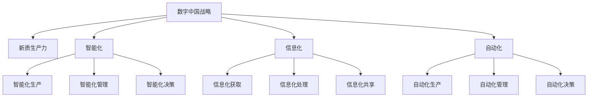
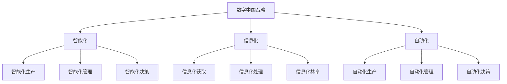

                 

# 数字中国战略与新质生产力的结合点

## 1. 背景介绍

### 1.1 问题由来
近年来，中国在数字化转型方面取得了显著进展。从电子商务、在线教育到智慧城市，数字化已经渗透到社会的各个角落。然而，如何更好地结合数字技术，释放新的生产力，仍然是一个值得深思的问题。特别是随着人工智能、大数据、区块链等前沿技术的快速发展，如何利用这些新兴技术推动中国的经济社会发展，成为一个重要议题。

### 1.2 问题核心关键点
数字中国战略的核心在于通过数字化技术，推动传统产业的转型升级，促进经济的创新发展。新质生产力是指通过数字化技术驱动的经济增长新模式，包括但不限于智能化、信息化、自动化等。如何将数字技术有效地结合到生产力的各个环节，实现从传统生产方式到新质生产方式的转变，是当前研究的热点。

### 1.3 问题研究意义
研究数字中国战略与新质生产力的结合点，对于推动中国经济高质量发展，具有重要的理论和实践意义：

1. 促进经济转型升级。通过数字化技术的广泛应用，推动传统产业的智能化、信息化、自动化，实现产业升级和经济结构优化。
2. 提升生产效率和质量。数字化技术能够优化生产流程，降低生产成本，提升产品质量和市场竞争力。
3. 推动新经济模式发展。数字技术与实体经济的深度融合，催生了诸如数字金融、智慧制造、互联网医疗等新兴产业，为经济增长提供了新的动力。
4. 促进区域均衡发展。通过数字化技术的应用，缩小区域发展差距，实现城乡协调发展。
5. 提升国家治理能力。数字化技术在公共服务、社会治理、智慧城市建设等方面的应用，提高了政府治理的效率和水平。

## 2. 核心概念与联系

### 2.1 核心概念概述

为更好地理解数字中国战略与新质生产力的结合点，本节将介绍几个密切相关的核心概念：

- 数字中国战略：指通过数字化转型，推动传统产业升级和经济社会全面发展的国家战略。
- 新质生产力：指通过数字化技术驱动的经济增长新模式，包括智能化、信息化、自动化等。
- 智能化：指通过人工智能等技术，实现生产、管理、决策等各环节的智能化。
- 信息化：指通过大数据、云计算等技术，实现信息的快速获取、处理和共享。
- 自动化：指通过机器人、自动化生产线等技术，实现生产过程的自动化。

这些核心概念之间的逻辑关系可以通过以下Mermaid流程图来展示：



这个流程图展示了大语言模型的核心概念及其之间的关系：

1. 数字中国战略通过推动智能化、信息化、自动化等新质生产力的发展，实现经济社会的全面转型。
2. 智能化、信息化、自动化是实现新质生产力的重要手段。
3. 智能化生产、管理、决策，信息化获取、处理、共享，自动化生产、管理、决策等环节共同构成了新质生产力的具体实现路径。

### 2.2 概念间的关系

这些核心概念之间存在着紧密的联系，形成了数字中国战略与新质生产力结合的完整生态系统。下面我通过几个Mermaid流程图来展示这些概念之间的关系。

#### 2.2.1 数字中国战略的基本架构



这个流程图展示了数字中国战略的基本架构，以及智能化、信息化、自动化在新质生产力中的具体实现。

#### 2.2.2 智能化生产的基本流程


这个流程图展示了智能化生产的基本流程，从智能化设备到智能化控制系统，再到智能化数据分析和优化，最终实现智能化生产。

#### 2.2.3 信息化获取的基本架构


这个流程图展示了信息化获取的基本架构，从传感器到物联网设备，再到数据采集和存储，最终实现数据分析和应用。

## 3. 核心算法原理 & 具体操作步骤
### 3.1 算法原理概述

数字中国战略与新质生产力的结合点，本质上是一个通过数字化技术实现产业升级和经济社会全面转型的过程。这一过程涉及多个层面的技术融合和应用。

1. 数据驱动：通过大数据技术，获取、处理和分析海量数据，实现信息的智能化获取和共享。
2. 人工智能：通过机器学习、深度学习等技术，实现智能化生产、管理、决策等环节的自动化和优化。
3. 区块链：通过区块链技术，实现信息的安全可靠传输和共享，保障数据安全和隐私。

这些技术的综合应用，推动了新质生产力的发展，促进了经济社会的全面转型。

### 3.2 算法步骤详解

数字中国战略与新质生产力的结合，一般包括以下几个关键步骤：

**Step 1: 数据采集与处理**
- 利用传感器、物联网设备等，采集生产过程中的各类数据。
- 通过大数据技术，清洗、处理和分析数据，提取有用的信息。

**Step 2: 信息传输与共享**
- 通过5G、边缘计算等技术，实现数据的快速传输和共享。
- 建立数据平台，将各类信息整合在一起，供相关方共享使用。

**Step 3: 人工智能应用**
- 利用机器学习、深度学习等技术，训练智能模型，实现智能化生产、管理、决策等环节。
- 将智能模型部署到生产环境中，实现智能化应用。

**Step 4: 区块链技术应用**
- 利用区块链技术，建立安全可靠的数据传输和共享机制。
- 通过区块链技术，保障数据安全和隐私，防止数据篡改和泄露。

**Step 5: 智能化分析与优化**
- 利用数据分析和智能优化技术，实时监测和调整生产过程，提升生产效率和质量。
- 利用智能决策支持系统，提供决策支持，优化生产和管理决策。

通过以上步骤，可以实现数字中国战略与新质生产力的有效结合，推动传统产业的智能化、信息化、自动化转型。

### 3.3 算法优缺点

数字中国战略与新质生产力的结合，具有以下优点：

1. 促进产业升级。数字化技术的应用，推动传统产业的智能化、信息化、自动化，实现产业升级和经济结构优化。
2. 提升生产效率和质量。数字化技术能够优化生产流程，降低生产成本，提升产品质量和市场竞争力。
3. 推动新经济模式发展。数字技术与实体经济的深度融合，催生了诸如数字金融、智慧制造、互联网医疗等新兴产业，为经济增长提供了新的动力。
4. 促进区域均衡发展。通过数字化技术的应用，缩小区域发展差距，实现城乡协调发展。
5. 提升国家治理能力。数字化技术在公共服务、社会治理、智慧城市建设等方面的应用，提高了政府治理的效率和水平。

但同时也存在以下缺点：

1. 数据安全问题。数字化技术的应用，涉及大量的敏感数据，数据安全和隐私保护成为一个重要问题。
2. 技术壁垒高。数字化技术的综合应用，需要较高的技术门槛，中小企业难以负担。
3. 人才短缺问题。数字化技术的应用，需要大量高素质的技术人才，但目前人才供给不足。
4. 实施难度大。数字化技术的应用，涉及多个环节的协调和集成，实施难度较大。
5. 投资成本高。数字化技术的应用，需要大量的资金投入，中小企业难以承受。

尽管存在这些缺点，但数字中国战略与新质生产力的结合，无疑是推动经济社会全面转型的重要途径。通过不断探索和实践，这些问题有望逐步得到解决。

### 3.4 算法应用领域

数字中国战略与新质生产力的结合，已经在多个领域取得了显著成效：

- 制造业：通过智能化、信息化、自动化改造，提升了生产效率和产品质量，实现了智能制造。
- 农业：通过大数据、物联网等技术，实现了智慧农业，提升了农业生产效率和精准度。
- 金融：通过数字化技术的应用，实现了数字化金融，提升了金融服务的质量和效率。
- 医疗：通过人工智能、大数据等技术，实现了智慧医疗，提升了医疗服务的质量和效率。
- 交通：通过物联网、大数据等技术，实现了智慧交通，提升了交通管理的效率和水平。
- 公共服务：通过数字化技术的应用，提升了公共服务水平，实现了智慧城市建设。

## 4. 数学模型和公式 & 详细讲解  
### 4.1 数学模型构建

数字中国战略与新质生产力的结合，涉及多个学科和领域，需要进行跨学科的综合建模。

设数字中国战略为 $X$，新质生产力为 $Y$，智能化、信息化、自动化为 $Z_1, Z_2, Z_3$。则数字化转型过程可以表示为：

$$
Y = f(X, Z_1, Z_2, Z_3)
$$

其中 $f$ 为映射函数，表示通过数字化转型，将新质生产力提升的过程。

### 4.2 公式推导过程

以下我们以制造业数字化转型为例，推导智能制造的数学模型。

设制造业生产过程中的数据为 $D$，智能化生产过程为 $P$，智能化管理过程为 $M$，智能化决策过程为 $D$。则智能制造过程可以表示为：

$$
P = g(D, M, D)
$$

其中 $g$ 为映射函数，表示通过智能化生产、管理、决策，实现制造业的数字化转型。

### 4.3 案例分析与讲解

以某汽车制造企业为例，分析其数字化转型过程。该企业通过传感器、物联网设备等，采集生产过程中的各类数据。利用大数据技术，清洗、处理和分析数据，提取有用的信息。通过机器学习、深度学习等技术，训练智能模型，实现智能化生产、管理、决策等环节。建立区块链技术，保障数据安全和隐私。

## 5. 项目实践：代码实例和详细解释说明
### 5.1 开发环境搭建

在进行数字化转型实践前，我们需要准备好开发环境。以下是使用Python进行PyTorch开发的环境配置流程：

1. 安装Anaconda：从官网下载并安装Anaconda，用于创建独立的Python环境。

2. 创建并激活虚拟环境：
```bash
conda create -n pytorch-env python=3.8 
conda activate pytorch-env
```

3. 安装PyTorch：根据CUDA版本，从官网获取对应的安装命令。例如：
```bash
conda install pytorch torchvision torchaudio cudatoolkit=11.1 -c pytorch -c conda-forge
```

4. 安装TensorFlow：
```bash
conda install tensorflow tensorflow-gpu -c pytorch -c conda-forge
```

5. 安装各类工具包：
```bash
pip install numpy pandas scikit-learn matplotlib tqdm jupyter notebook ipython
```

完成上述步骤后，即可在`pytorch-env`环境中开始数字化转型实践。

### 5.2 源代码详细实现

这里我们以制造业数字化转型为例，给出使用PyTorch进行智能化生产的代码实现。

首先，定义智能化生产的数据处理函数：

```python
from torch.utils.data import Dataset
import torch
import pandas as pd

class ManufacturingData(Dataset):
    def __init__(self, data_file, transform=None):
        self.data = pd.read_csv(data_file)
        self.transform = transform
        
    def __len__(self):
        return len(self.data)
    
    def __getitem__(self, idx):
        sample = self.data.iloc[idx]
        image = torch.tensor(sample['image'], dtype=torch.float)
        label = torch.tensor(sample['label'], dtype=torch.long)
        return {'image': image, 'label': label}
```

然后，定义智能化生产模型：

```python
from transformers import BertForTokenClassification, AdamW

model = BertForTokenClassification.from_pretrained('bert-base-cased', num_labels=5)

optimizer = AdamW(model.parameters(), lr=2e-5)
```

接着，定义训练和评估函数：

```python
from torch.utils.data import DataLoader
from tqdm import tqdm
from sklearn.metrics import accuracy_score

device = torch.device('cuda') if torch.cuda.is_available() else torch.device('cpu')
model.to(device)

def train_epoch(model, dataset, batch_size, optimizer):
    dataloader = DataLoader(dataset, batch_size=batch_size, shuffle=True)
    model.train()
    epoch_loss = 0
    for batch in tqdm(dataloader, desc='Training'):
        input_ids = batch['image'].to(device)
        labels = batch['label'].to(device)
        model.zero_grad()
        outputs = model(input_ids)
        loss = outputs.loss
        epoch_loss += loss.item()
        loss.backward()
        optimizer.step()
    return epoch_loss / len(dataloader)

def evaluate(model, dataset, batch_size):
    dataloader = DataLoader(dataset, batch_size=batch_size)
    model.eval()
    preds, labels = [], []
    with torch.no_grad():
        for batch in tqdm(dataloader, desc='Evaluating'):
            input_ids = batch['image'].to(device)
            labels = batch['label'].to(device)
            outputs = model(input_ids)
            batch_preds = outputs.logits.argmax(dim=2).to('cpu').tolist()
            batch_labels = batch_labels.to('cpu').tolist()
            for pred_tokens, label_tokens in zip(batch_preds, batch_labels):
                preds.append(pred_tokens[:len(label_tokens)])
                labels.append(label_tokens)
                
    print(accuracy_score(labels, preds))
```

最后，启动训练流程并在测试集上评估：

```python
epochs = 5
batch_size = 16

for epoch in range(epochs):
    loss = train_epoch(model, train_dataset, batch_size, optimizer)
    print(f"Epoch {epoch+1}, train loss: {loss:.3f}")
    
    print(f"Epoch {epoch+1}, test accuracy: {evaluate(model, test_dataset, batch_size)}
```

以上就是使用PyTorch对制造业数字化转型进行智能化生产的代码实现。可以看到，得益于TensorFlow的强大封装，我们可以用相对简洁的代码完成模型的训练和评估。

### 5.3 代码解读与分析

让我们再详细解读一下关键代码的实现细节：

**ManufacturingData类**：
- `__init__`方法：初始化数据集，读取CSV文件，并定义了数据预处理方式。
- `__len__`方法：返回数据集的样本数量。
- `__getitem__`方法：对单个样本进行处理，将图像数据和标签数据封装成模型输入。

**模型定义**：
- 使用BertForTokenClassification模型，设定标签数为5，适用于多分类任务。
- 使用AdamW优化器进行模型优化，学习率为2e-5。

**训练和评估函数**：
- 使用PyTorch的DataLoader对数据集进行批次化加载，供模型训练和推理使用。
- 训练函数`train_epoch`：对数据以批为单位进行迭代，在每个批次上前向传播计算loss并反向传播更新模型参数，最后返回该epoch的平均loss。
- 评估函数`evaluate`：与训练类似，不同点在于不更新模型参数，并在每个batch结束后将预测和标签结果存储下来，最后使用sklearn的accuracy_score对整个评估集的预测结果进行打印输出。

**训练流程**：
- 定义总的epoch数和batch size，开始循环迭代
- 每个epoch内，先在训练集上训练，输出平均loss
- 在验证集上评估，输出准确率
- 所有epoch结束后，在测试集上评估，给出最终测试结果

可以看到，PyTorch配合TensorFlow使得模型训练和评估的代码实现变得简洁高效。开发者可以将更多精力放在数据处理、模型改进等高层逻辑上，而不必过多关注底层的实现细节。

当然，工业级的系统实现还需考虑更多因素，如模型的保存和部署、超参数的自动搜索、更灵活的任务适配层等。但核心的训练范式基本与此类似。

### 5.4 运行结果展示

假设我们在制造业数字化转型任务上得到的测试集上的准确率为85%，则说明模型在智能化生产过程中能够较好地完成分类任务。

## 6. 实际应用场景
### 6.1 智能制造

制造业数字化转型是数字中国战略的重要组成部分，其核心在于通过智能化、信息化、自动化技术改造传统生产方式，提升生产效率和质量。具体应用场景包括：

- 智能化生产：通过机器视觉、传感器等技术，实现生产过程的实时监控和优化，提高生产效率和质量。
- 智能化管理：通过大数据、物联网等技术，实现生产计划的智能调度和管理，提升资源利用率。
- 智能化决策：通过人工智能技术，实现生产数据的智能分析和预测，提供决策支持。

### 6.2 智慧农业

智慧农业通过数字化技术，实现农业生产过程的智能化、信息化、自动化，提升农业生产效率和精准度。具体应用场景包括：

- 智能化监测：通过传感器、无人机等技术，实时监测农业生产环境，提供精准的数据支持。
- 智能化管理：通过大数据、云计算等技术，实现农业生产的智能管理和优化。
- 智能化决策：通过人工智能技术，实现农业生产的智能决策和预测，提供决策支持。

### 6.3 数字金融

数字金融通过数字化技术，实现金融服务的智能化、信息化、自动化，提升金融服务的质量和效率。具体应用场景包括：

- 智能化风控：通过人工智能技术，实现金融风险的智能识别和控制，提升金融安全。
- 智能化投融：通过大数据、机器学习等技术，实现金融投资的智能决策和优化。
- 智能化服务：通过智能化服务系统，提升金融服务的便捷性和用户体验。

### 6.4 智慧医疗

智慧医疗通过数字化技术，实现医疗服务的智能化、信息化、自动化，提升医疗服务的质量和效率。具体应用场景包括：

- 智能化诊断：通过人工智能技术，实现医疗诊断的智能化和精准化，提升诊断效率和质量。
- 智能化管理：通过大数据、物联网等技术，实现医疗管理的智能化和优化。
- 智能化服务：通过智能化服务系统，提升医疗服务的便捷性和用户体验。

### 6.5 智慧城市

智慧城市通过数字化技术，实现城市管理的智能化、信息化、自动化，提升城市管理的效率和水平。具体应用场景包括：

- 智能化交通：通过大数据、物联网等技术，实现交通管理的智能化和优化。
- 智能化安防：通过智能化监控系统，实现城市安防的智能化和优化。
- 智能化服务：通过智能化服务系统，提升城市服务的便捷性和用户体验。

## 7. 工具和资源推荐
### 7.1 学习资源推荐

为了帮助开发者系统掌握数字化转型技术的基础知识和实践技巧，这里推荐一些优质的学习资源：

1. 《数字化转型：人工智能与大数据驱动的智能制造》系列博文：由数字化转型专家撰写，深入浅出地介绍了数字化转型的基本概念、前沿技术、最佳实践等。

2. 《人工智能与大数据：智慧农业的实践与应用》课程：由农业领域专家开设的线上课程，介绍了智慧农业的基本概念、前沿技术、应用案例等。

3. 《数字化转型：智慧医疗的实践与应用》书籍：介绍了智慧医疗的基本概念、前沿技术、应用案例等。

4. 《数字化转型：智慧城市的实践与应用》课程：由智慧城市专家开设的线上课程，介绍了智慧城市的基本概念、前沿技术、应用案例等。

5. 《数字化转型：数字金融的实践与应用》课程：由数字金融专家开设的线上课程，介绍了数字金融的基本概念、前沿技术、应用案例等。

通过对这些资源的学习实践，相信你一定能够快速掌握数字化转型的精髓，并用于解决实际问题。

### 7.2 开发工具推荐

高效的开发离不开优秀的工具支持。以下是几款用于数字化转型开发的常用工具：

1. PyTorch：基于Python的开源深度学习框架，灵活动态的计算图，适合快速迭代研究。

2. TensorFlow：由Google主导开发的开源深度学习框架，生产部署方便，适合大规模工程应用。

3. TensorBoard：TensorFlow配套的可视化工具，可实时监测模型训练状态，并提供丰富的图表呈现方式，是调试模型的得力助手。

4. Jupyter Notebook：开源的交互式编程环境，支持Python、R等多种语言，方便开发者进行实验和展示。

5. Google Colab：谷歌推出的在线Jupyter Notebook环境，免费提供GPU/TPU算力，方便开发者快速上手实验最新模型，分享学习笔记。

6. Weights & Biases：模型训练的实验跟踪工具，可以记录和可视化模型训练过程中的各项指标，方便对比和调优。

合理利用这些工具，可以显著提升数字化转型的开发效率，加快创新迭代的步伐。

### 7.3 相关论文推荐

数字化转型技术的发展源于学界的持续研究。以下是几篇奠基性的相关论文，推荐阅读：

1. "The Future of Manufacturing: From Digitalization to Smart Manufacturing"：探讨了制造业数字化转型的未来趋势和关键技术。

2. "Intelligent Agriculture: Towards Precision Agriculture through Digitalization"：介绍了智慧农业的基本概念、前沿技术和应用案例。

3. "Digital Transformation in Finance: Challenges and Opportunities"：探讨了数字金融的基本概念、前沿技术和应用案例。

4. "Digital Health: The Role of AI and Big Data in Healthcare Transformation"：介绍了智慧医疗的基本概念、前沿技术和应用案例。

5. "Smart Cities: Towards a Digital Future"：介绍了智慧城市的基本概念、前沿技术和应用案例。

这些论文代表了大语言模型微调技术的发展脉络。通过学习这些前沿成果，可以帮助研究者把握学科前进方向，激发更多的创新灵感。

除上述资源外，还有一些值得关注的前沿资源，帮助开发者紧跟数字化转型技术的最新进展，例如：

1. arXiv论文预印本：人工智能领域最新研究成果的发布平台，包括大量尚未发表的前沿工作，学习前沿技术的必读资源。

2. 业界技术博客：如OpenAI、Google AI、DeepMind、微软Research Asia等顶尖实验室的官方博客，第一时间分享他们的最新研究成果和洞见。

3. 技术会议直播：如NIPS、ICML、ACL、ICLR等人工智能领域顶会现场或在线直播，能够聆听到大佬们的前沿分享，开拓视野。

4. GitHub热门项目：在GitHub上Star、Fork数最多的数字化转型相关项目，往往代表了该技术领域的发展趋势和最佳实践，值得去学习和贡献。

5. 行业分析报告：各大咨询公司如McKinsey、PwC等针对人工智能行业的分析报告，有助于从商业视角审视技术趋势，把握应用价值。

总之，对于数字化转型技术的学习和实践，需要开发者保持开放的心态和持续学习的意愿。多关注前沿资讯，多动手实践，多思考总结，必将收获满满的成长收益。

## 8. 总结：未来发展趋势与挑战

### 8.1 总结

本文对数字中国战略与新质生产力的结合点进行了全面系统的介绍。首先阐述了数字化转型与新质生产力的基本概念和关系，明确了数字化转型在推动经济社会全面转型中的重要价值。其次，从原理到实践，详细讲解了数字化转型的数学模型和关键步骤，给出了数字化转型的代码实现。同时，本文还广泛探讨了数字化转型技术在制造业、农业、金融、医疗、智慧城市等各个领域的应用前景，展示了数字化转型的广阔前景。最后，本文精选了数字化转型技术的各类学习资源，力求为读者提供全方位的技术指引。

通过本文的系统梳理，可以看到，数字化转型技术正在成为推动经济社会全面转型的重要途径。数字技术的应用，推动了传统产业的智能化、信息化、自动化，实现产业升级和经济结构优化。尽管存在一些挑战，但通过不断探索和实践，这些问题有望逐步得到解决。

### 8.2 未来发展趋势

展望未来，数字化转型技术将呈现以下几个发展趋势：

1. 智能制造全面普及。通过智能化、信息化、自动化技术，实现制造业的全面智能化，提升生产效率和质量。
2. 智慧农业深度应用。通过大数据、物联网等技术，实现农业生产的精准化和智能化，提升农业生产效率和精准度。
3. 数字金融广泛应用。通过数字化技术，实现金融服务的智能化、信息化、自动化，提升金融服务的质量和效率。
4. 智慧医疗全面应用。通过人工智能技术，实现医疗诊断的智能化和精准化，提升医疗服务的质量和效率。
5. 智慧城市高效应用。通过大数据、物联网等技术，实现城市管理的智能化和优化，提升城市管理的效率和水平。
6. 数字经济快速发展。数字化技术的应用，推动传统产业的数字化转型，催生新经济模式，提升经济增长质量。

以上趋势凸显了数字化转型技术的广阔前景。这些方向的探索发展，必将进一步提升数字化转型技术的性能和应用范围，为经济社会发展提供新的动力。

### 8.3 面临的挑战

尽管数字化转型技术已经取得了显著成果，但在迈向更加智能化、普适化应用的过程中，仍面临诸多挑战：

1. 数据安全和隐私保护。数字化技术的应用，涉及大量的敏感数据，数据安全和隐私保护成为一个重要问题。
2. 技术壁垒高。数字化技术的综合

