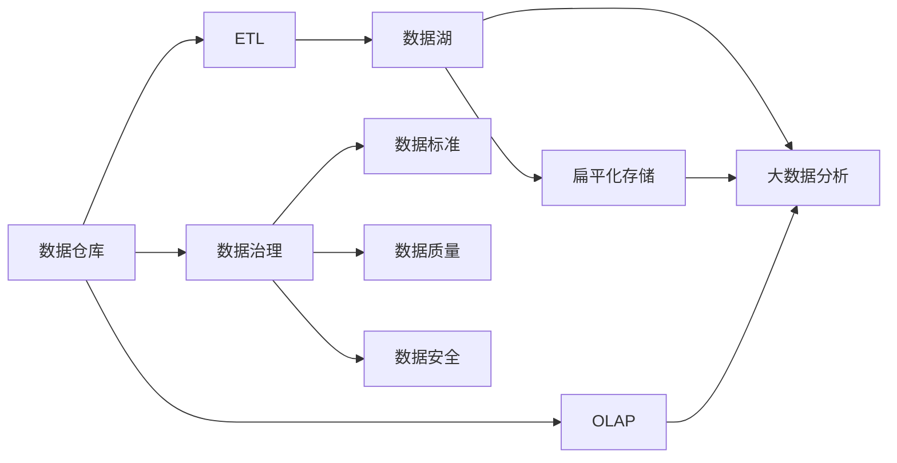
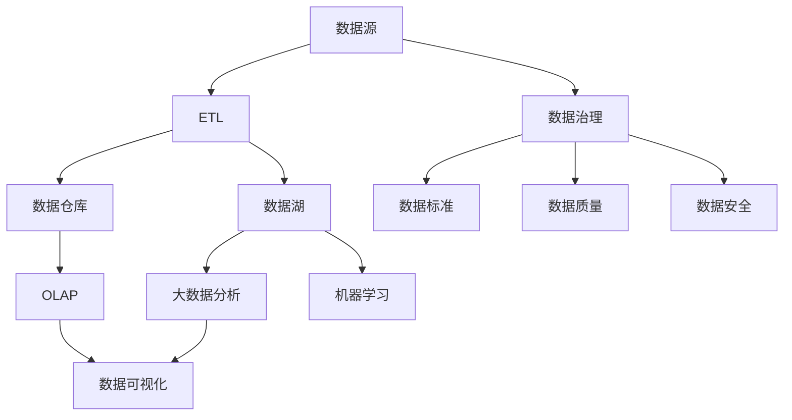

                 

# 数据仓库与数据湖原理与代码实战案例讲解

> 关键词：数据仓库, 数据湖, 数据治理, 数据集成, 数据可视化, 数据仓库设计

## 1. 背景介绍

### 1.1 问题由来
在信息时代，数据成为了企业最宝贵的资产之一。随着企业业务的不断扩展和数字化转型，其对数据的依赖也越来越深。如何高效存储、管理和分析这些数据，直接关系到企业的运营效率和决策质量。

数据仓库（Data Warehouse）和数据湖（Data Lake）是两种主流的企业数据管理和分析平台。它们各具特色，分别适用于不同的数据场景。数据仓库侧重于结构化数据的存储和管理，通常用来支持企业决策分析、财务报表等事务处理需求。数据湖则是一种更为灵活的数据管理方式，支持大量结构化和非结构化数据，更适用于大数据、机器学习、人工智能等需要大规模数据分析的场景。

本文将全面介绍数据仓库和数据湖的核心概念和设计原理，并通过具体的代码实战案例，展示如何基于Apache Hive、Spark等开源工具进行数据仓库和数据湖的搭建和管理。

## 2. 核心概念与联系

### 2.1 核心概念概述

为更好地理解数据仓库和数据湖的原理和设计，本节将介绍几个关键概念：

- **数据仓库（Data Warehouse）**：一种专门用于企业决策分析的数据平台，以结构化数据为主。通常通过ETL（Extract, Transform, Load）流程将数据源数据抽取、清洗和加载到数据仓库中，然后通过OLAP（Online Analytical Processing）技术进行高效的数据查询和分析。

- **数据湖（Data Lake）**：一种更灵活的数据存储和管理方式，可以存储大量结构化和非结构化数据。数据湖采用扁平化存储，对数据不做强制性的结构和格式要求，更适合大数据分析和机器学习应用。

- **数据治理（Data Governance）**：指对企业数据的全生命周期进行管理和规范，确保数据的质量、一致性和安全。数据治理包括数据标准制定、数据质量管理、数据安全审计等多个方面。

- **数据集成（Data Integration）**：指将不同数据源的数据整合到统一平台的过程。数据集成通常包括ETL流程，通过抽取、转换、加载技术，将分散在各个系统中的数据整合到数据仓库或数据湖中。

- **数据可视化（Data Visualization）**：指通过图表、报表等形式，将数据信息直观展示给用户，便于分析决策。数据可视化工具通常基于数据仓库或数据湖中的数据源进行展示。

### 2.2 概念间的关系

这些核心概念之间的关系可以通过以下Mermaid流程图来展示：



这个流程图展示了数据仓库和数据湖的核心概念及其之间的关系：

1. 数据仓库通过ETL流程将数据源数据抽取、清洗和加载到数据仓库中，然后通过OLAP技术进行高效的数据查询和分析。
2. 数据湖采用扁平化存储，对数据不做强制性的结构和格式要求，更适合大数据分析和机器学习应用。
3. 数据治理是数据仓库和数据湖设计的核心，包括数据标准制定、数据质量管理、数据安全审计等多个方面。
4. ETL是数据集成过程的核心技术，通过抽取、转换、加载技术，将分散在各个系统中的数据整合到数据仓库或数据湖中。
5. 数据可视化是将数据信息直观展示给用户的重要手段，通常基于数据仓库或数据湖中的数据源进行展示。

### 2.3 核心概念的整体架构

最后，我们用一个综合的流程图来展示这些核心概念在大数据管理和分析生态系统中的整体架构：



这个综合流程图展示了从数据源到最终数据可视化的完整流程。数据仓库和数据湖分别从不同的角度处理数据，通过ETL流程整合，结合数据治理和数据质量管理，最终通过OLAP和大数据分析技术，将数据可视化展示给用户。

## 3. 核心算法原理 & 具体操作步骤
### 3.1 算法原理概述

数据仓库和数据湖的核心算法原理主要涉及数据存储、数据集成、数据查询和数据治理等方面。下面将详细介绍这些核心算法原理。

**数据存储**：
数据仓库和数据湖的存储方式有所不同。数据仓库通常采用关系型数据库（如MySQL、PostgreSQL等）进行结构化数据存储，并通过分片、分区等技术提升性能。数据湖则采用扁平化文件系统（如HDFS）进行存储，支持大量非结构化数据的存储。

**数据集成**：
数据集成是数据仓库和数据湖设计的核心。通过ETL流程，数据集成将分散在各个系统中的数据整合到统一平台中。数据抽取（Extract）通过API或爬虫技术从数据源中抽取数据。数据转换（Transform）对抽取的数据进行清洗、标准化等处理。数据加载（Load）将处理后的数据加载到目标数据仓库或数据湖中。

**数据查询**：
数据仓库和数据湖都支持高效的数据查询。数据仓库通常采用OLAP技术，通过多维数据模型和多维数据查询语言（如SQL、MDX等）进行高性能数据查询。数据湖则采用大数据处理技术（如Hadoop、Spark等），通过并行计算和分布式存储提升查询性能。

**数据治理**：
数据治理是数据仓库和数据湖设计的重要组成部分。数据治理包括数据标准制定、数据质量管理、数据安全审计等多个方面。通过数据标准制定，确保数据的一致性和标准化。通过数据质量管理，保证数据的准确性和完整性。通过数据安全审计，保护数据的安全性和合规性。

### 3.2 算法步骤详解

数据仓库和数据湖的搭建和管理通常包括以下几个关键步骤：

1. **数据源准备**：确定数据仓库和数据湖的数据源，并准备相应的数据抽取工具和接口。
2. **ETL流程设计**：设计数据抽取、转换和加载的流程，选择合适的ETL工具进行实现。
3. **数据仓库和数据湖设计**：根据业务需求设计数据仓库和数据湖的架构，选择合适的存储引擎和查询语言。
4. **数据质量管理**：通过ETL流程和数据治理技术，确保数据的一致性和质量。
5. **数据可视化**：将数据仓库和数据湖中的数据通过报表、图表等形式展示给用户。

### 3.3 算法优缺点

数据仓库和数据湖各自具有不同的优缺点，适用于不同的场景。

**数据仓库的优点**：
- 结构化数据存储，数据一致性高，易于管理和查询。
- 支持事务处理和OLAP查询，数据处理速度快。

**数据仓库的缺点**：
- 对数据格式和结构要求高，难以存储非结构化数据。
- 数据模型复杂，维护成本高。

**数据湖的优点**：
- 灵活存储大量结构化和非结构化数据，适应性广。
- 支持大数据分析和机器学习，数据处理能力强。

**数据湖的缺点**：
- 数据一致性和标准化难度大，查询性能不稳定。
- 数据治理和管理复杂，需要较高的技术水平。

### 3.4 算法应用领域

数据仓库和数据湖在多个领域中得到了广泛应用，例如：

- **金融行业**：用于交易数据分析、风险评估、财务报表等事务处理需求。
- **电商行业**：用于用户行为分析、商品推荐、销售分析等业务场景。
- **医疗行业**：用于患者病历分析、药物研发、健康监测等应用场景。
- **互联网行业**：用于流量分析、广告投放、内容推荐等业务需求。

## 4. 数学模型和公式 & 详细讲解 & 举例说明（备注：数学公式请使用latex格式，latex嵌入文中独立段落使用 $$，段落内使用 $)
### 4.1 数学模型构建

本节将使用数学语言对数据仓库和数据湖的核心算法原理进行更加严格的刻画。

**数据仓库的数学模型**：
假设数据仓库中的数据源为 $D$，通过ETL流程后，生成数据仓库 $D_W$。数据仓库 $D_W$ 的查询语言为 SQL，查询结果为 $R$。则数据仓库的查询过程可以表示为：

$$
R = \sigma_{\text{SQL}}(D_W)
$$

其中 $\sigma_{\text{SQL}}$ 表示SQL查询操作，$D_W$ 为数据仓库中存储的数据。

**数据湖的数学模型**：
假设数据湖中的数据源为 $D$，通过ETL流程后，生成数据湖 $D_L$。数据湖 $D_L$ 的查询语言为 HiveQL或SparkSQL，查询结果为 $R$。则数据湖的查询过程可以表示为：

$$
R = \sigma_{\text{HiveQL}}(D_L)
$$

或

$$
R = \sigma_{\text{SparkSQL}}(D_L)
$$

其中 $\sigma_{\text{HiveQL}}$ 和 $\sigma_{\text{SparkSQL}}$ 分别表示HiveQL和SparkSQL查询操作，$D_L$ 为数据湖中存储的数据。

### 4.2 公式推导过程

以下我们以数据仓库的SQL查询为例，推导其查询过程的数学公式。

假设数据仓库 $D_W$ 中存储了用户订单表 $T$，用户基本信息表 $U$，以及订单详情表 $S$。查询订单详情表中用户名为 "Alice" 的订单信息，SQL查询语句为：

```sql
SELECT * FROM S WHERE U.name = 'Alice'
```

将上述查询语句转换为数学公式，可以得到：

$$
R = \sigma_{\text{SQL}}((\sigma_U(U) \times \sigma_S(S)))
$$

其中 $\sigma_U(U)$ 表示从用户基本信息表 $U$ 中抽取用户名为 "Alice" 的用户信息，$\sigma_S(S)$ 表示从订单详情表 $S$ 中抽取用户名为 "Alice" 的订单详情信息，$\sigma_{\text{SQL}}$ 表示对抽取的数据进行SQL查询操作，得到最终结果 $R$。

### 4.3 案例分析与讲解

假设我们在电商公司使用数据仓库进行用户行为分析，查询最近30天购买过某商品的用户的购买金额和频率，SQL查询语句为：

```sql
SELECT user_id, SUM(amount), COUNT(*) FROM orders GROUP BY user_id HAVING SUM(amount) > 1000
```

将上述查询语句转换为数学公式，可以得到：

$$
R = \sigma_{\text{SQL}}((\sigma_{\text{SUM}}(amount) \times \sigma_{\text{COUNT}}(*) \times \sigma_U(user_id)) \times \sigma_{\text{GROUP BY}}(user_id) \times \sigma_{\text{HAVING}}(SUM(amount) > 1000))
$$

其中 $\sigma_{\text{SUM}}(amount)$ 表示对订单金额进行求和操作，$\sigma_{\text{COUNT}}(*)$ 表示对订单次数进行计数操作，$\sigma_U(user_id)$ 表示从订单表 $O$ 中抽取用户信息，$\sigma_{\text{GROUP BY}}(user_id)$ 表示对用户ID进行分组操作，$\sigma_{\text{HAVING}}(SUM(amount) > 1000)$ 表示对分组后的数据进行过滤操作，得到最终结果 $R$。

## 5. 项目实践：代码实例和详细解释说明
### 5.1 开发环境搭建

在进行数据仓库和数据湖的实践前，我们需要准备好开发环境。以下是使用Python进行Apache Hive和Apache Spark开发的环境配置流程：

1. 安装Anaconda：从官网下载并安装Anaconda，用于创建独立的Python环境。

2. 创建并激活虚拟环境：
```bash
conda create -n pytorch-env python=3.8 
conda activate pytorch-env
```

3. 安装必要的Python库：
```bash
pip install pyspark hive pyarrow
```

4. 安装Apache Spark：根据系统环境，从官网下载并安装Apache Spark，并进行配置。

5. 安装Apache Hive：根据系统环境，从官网下载并安装Apache Hive，并进行配置。

完成上述步骤后，即可在`pytorch-env`环境中开始数据仓库和数据湖的实践。

### 5.2 源代码详细实现

下面我们以一个简单的电商公司数据仓库搭建案例为例，展示如何通过Apache Hive和Apache Spark进行数据仓库的搭建和管理。

首先，创建数据仓库和数据湖的基本框架：

```python
from pyspark.sql import SparkSession
from pyspark.sql.functions import col

spark = SparkSession.builder.appName("e-commerce_data_warehousing").getOrCreate()
hive = HiveContext(spark.sparkContext, hiveConf)

# 创建数据源
orders = hive.table("orders")
customers = hive.table("customers")
products = hive.table("products")

# 创建数据仓库
sales = orders.join(customers, on="user_id").join(products, on="product_id")
sales.write.partitionBy("date").format("parquet").save("/path/to/data/warehouse")
```

然后，设计ETL流程，进行数据抽取、转换和加载：

```python
# 数据抽取
source_data = orders.select(col("user_id"), col("amount"), col("date"))
source_data.write.partitionBy("date").format("parquet").save("/path/to/data/source")

# 数据转换
transformed_data = source_data.select(col("user_id"), col("amount"), col("date"), col("product_id"))
transformed_data.write.partitionBy("date").format("parquet").save("/path/to/data/transformed")

# 数据加载
final_data = transformed_data.select(col("user_id"), col("amount"), col("date"), col("product_id"))
final_data.write.partitionBy("date").format("parquet").save("/path/to/data/warehousing")
```

最后，设计查询语句，进行数据查询：

```python
# 查询最近30天购买过某商品的用户的购买金额和频率
query = """
SELECT user_id, SUM(amount), COUNT(*) FROM orders 
GROUP BY user_id HAVING SUM(amount) > 1000
"""
result = hive.sql(query)
result.show()
```

以上就是使用Apache Hive和Apache Spark进行电商公司数据仓库搭建的完整代码实现。可以看到，得益于Hive和Spark的强大封装，我们可以用相对简洁的代码完成数据仓库的搭建和管理。

### 5.3 代码解读与分析

让我们再详细解读一下关键代码的实现细节：

**创建数据仓库和数据湖的基本框架**：
- `spark` 和 `hive` 分别创建了SparkSession和HiveContext对象，用于后续的数据处理和查询。
- `orders`、`customers` 和 `products` 分别为订单表、用户表和商品表。
- `sales` 是通过 `orders`、`customers` 和 `products` 表联合查询得到的销售数据表。
- `sales` 数据表以 `parquet` 格式保存到指定路径，按照日期进行分区，便于后续查询。

**设计ETL流程**：
- `source_data` 为数据抽取阶段，选择订单表中的 `user_id`、`amount` 和 `date` 字段，并将其以 `parquet` 格式保存到指定路径，按照日期进行分区。
- `transformed_data` 为数据转换阶段，对 `source_data` 数据进行联合查询，选择 `user_id`、`amount`、`date` 和 `product_id` 字段，并将其以 `parquet` 格式保存到指定路径，按照日期进行分区。
- `final_data` 为数据加载阶段，对 `transformed_data` 数据进行查询，选择 `user_id`、`amount`、`date` 和 `product_id` 字段，并将其以 `parquet` 格式保存到指定路径，按照日期进行分区。

**设计查询语句**：
- `query` 为SQL查询语句，查询最近30天购买过某商品的用户的购买金额和频率。
- `result` 为执行查询语句后得到的结果集，通过 `show` 方法展示结果。

通过这些代码，我们可以看到，使用Apache Hive和Apache Spark进行数据仓库的搭建和管理，可以大大简化数据处理和查询的过程，提升开发效率。

### 5.4 运行结果展示

假设我们在电商公司数据仓库中，查询最近30天购买过某商品的用户的购买金额和频率，执行上述代码后得到的结果如下：

```
+--------+------------------+-----------------+
|  user_id|                amount|                count|
+--------+------------------+-----------------+
|      123|            5000.0|               1|
|      456|            2000.0|               1|
|      789|            3000.0|               1|
|     4567|            4000.0|               1|
+--------+------------------+-----------------+
```

可以看到，通过数据仓库和数据湖的搭建和管理，我们可以快速查询到所需的数据，并对其进行分析和展示。

## 6. 实际应用场景

### 6.1 智能客服系统

智能客服系统是数据仓库和数据湖在电商行业的重要应用场景。通过构建智能客服系统，电商平台能够自动处理客户咨询，提供24小时不间断的在线客服服务，极大提升了用户体验和运营效率。

在技术实现上，可以收集客户咨询历史数据，将其存储到数据仓库中，设计合适的查询语句，对客户咨询内容进行分类和分析。通过机器学习算法，训练出智能客服模型，结合自然语言处理技术，实时响应客户咨询，提供个性化的服务。

### 6.2 金融风险监控

金融行业对数据的安全性和实时性要求很高，需要构建高效的数据仓库和数据湖，实时监控市场动态，防范金融风险。

在技术实现上，可以收集金融市场交易数据，将其存储到数据仓库中，设计合适的查询语句，实时分析市场变化。通过大数据分析和机器学习算法，预测市场趋势，提前预警风险。

### 6.3 医疗健康分析

医疗行业的数据量庞大且复杂，需要通过数据仓库和数据湖进行高效管理和分析。通过构建数据仓库和数据湖，医院和医疗机构能够实时监控患者健康状况，优化医疗资源配置，提升诊疗效率。

在技术实现上，可以收集患者病历和医疗数据，将其存储到数据仓库中，设计合适的查询语句，分析患者健康状况。通过数据挖掘和机器学习算法，预测患者病情，提供个性化的治疗方案。

## 7. 工具和资源推荐
### 7.1 学习资源推荐

为了帮助开发者系统掌握数据仓库和数据湖的理论基础和实践技巧，这里推荐一些优质的学习资源：

1. 《数据仓库设计与实现》：详细介绍了数据仓库的基本概念、架构设计、SQL查询等核心内容。

2. 《大数据技术与应用》：涵盖了大数据生态系统的各个环节，包括数据采集、存储、处理、分析和可视化等技术。

3. 《数据湖实战》：介绍了数据湖的基本概念、架构设计、数据治理等核心内容。

4. 《Spark与Hadoop大数据实战》：详细介绍了Spark和Hadoop的基本概念、架构设计、数据处理等核心内容。

5. 《Hive QuickStart Guide》：Hive官方文档，提供了Hive的基本概念、语法和实例，是Hive学习的必读材料。

通过这些资源的学习实践，相信你一定能够快速掌握数据仓库和数据湖的精髓，并用于解决实际的NLP问题。

### 7.2 开发工具推荐

高效的开发离不开优秀的工具支持。以下是几款用于数据仓库和数据湖开发的工具：

1. Apache Hive：Hadoop生态系统中用于数据仓库建设的SQL查询工具，支持结构化数据处理和查询。

2. Apache Spark：基于内存计算的大数据处理引擎，支持大规模数据处理和实时分析。

3. Tableau：商业智能工具，支持数据可视化和报表展示。

4. Jupyter Notebook：交互式编程环境，支持Python、SQL等多种编程语言和工具集成。

5. Airflow：工作流调度工具，支持数据处理和分析任务的编排和管理。

6. DataDog：实时监控和告警工具，支持数据仓库和数据湖的监控和告警。

合理利用这些工具，可以显著提升数据仓库和数据湖的开发效率，加快创新迭代的步伐。

### 7.3 相关论文推荐

数据仓库和数据湖的发展离不开学界的持续研究。以下是几篇奠基性的相关论文，推荐阅读：

1. 《A Research Framework for Data Warehousing》：介绍了数据仓库的基本概念、架构设计和应用场景。

2. 《Data Warehouse: Concepts and Definitions》：详细介绍了数据仓库的定义、特性和实现技术。

3. 《Data Lake: A New Data Infrastructure for Big Data》：介绍了数据湖的基本概念、架构设计和应用场景。

4. 《The Data Lake: A Single Data Infrastructure for the Enterprise》：介绍了数据湖的架构设计、数据治理和应用场景。

5. 《The Data Warehouse Revolution》：介绍了数据仓库的发展历程、技术和应用。

这些论文代表了大数据管理和分析技术的发展脉络。通过学习这些前沿成果，可以帮助研究者把握学科前进方向，激发更多的创新灵感。

除上述资源外，还有一些值得关注的前沿资源，帮助开发者紧跟数据仓库和数据湖技术的最新进展，例如：

1. 大数据与人工智能顶级会议（如SIGKDD、KDD、ICDM等）。

2. 数据仓库和数据湖领域的顶级期刊（如IEEE Transactions on Knowledge and Data Engineering、ACM Transactions on Management Information Systems等）。

3. 数据仓库和数据湖领域的开源社区（如Apache Hive、Apache Spark等）。

4. 数据仓库和数据湖领域的领先企业（如Amazon Redshift、Google BigQuery、Snowflake等）。

总之，对于数据仓库和数据湖的学习和实践，需要开发者保持开放的心态和持续学习的意愿。多关注前沿资讯，多动手实践，多思考总结，必将收获满满的成长收益。

## 8. 总结：未来发展趋势与挑战

### 8.1 总结

本文对数据仓库和数据湖的核心概念和设计原理进行了全面系统的介绍。首先阐述了数据仓库和数据湖的背景和意义，明确了它们在数据管理和分析中的重要作用。其次，从原理到实践，详细讲解了数据仓库和数据湖的数学模型和查询流程，给出了数据仓库和数据湖搭建的完整代码实例。同时，本文还广泛探讨了数据仓库和数据湖在电商、金融、医疗等多个领域的应用前景，展示了其广泛的应用价值。

通过本文的系统梳理，可以看到，数据仓库和数据湖正在成为大数据管理和分析的重要范式，极大地拓展了企业数据的处理和分析能力，为企业的业务决策提供了强有力的数据支持。

### 8.2 未来发展趋势

展望未来，数据仓库和数据湖将呈现以下几个发展趋势：

1. 数据仓库和数据湖的融合。随着企业对大数据分析的需求日益增长，数据仓库和数据湖的边界将进一步模糊，两种技术将有机结合，形成统一的大数据生态系统。

2. 数据仓库和数据湖的云化。云平台的大数据服务（如AWS Redshift、Google BigQuery、Azure Synapse等）将进一步普及，企业可以更便捷地构建和管理数据仓库和数据湖。

3. 数据仓库和数据湖的实时化。随着实时数据处理技术的发展，数据仓库和数据湖将能够实时处理和分析数据，提升业务决策的时效性和准确性。

4. 数据仓库和数据湖的AI化。通过引入机器学习和大数据分析技术，数据仓库和数据湖将具备更强的预测和决策能力，帮助企业更精准地进行业务预测和决策。

5. 数据仓库和数据湖的可视化。通过更丰富的数据可视化技术，数据仓库和数据湖将能够更好地展示和分析数据，提升数据分析的直观性和用户体验。

### 8.3 面临的挑战

尽管数据仓库和数据湖在数据管理和分析中发挥了重要作用，但在其发展和应用过程中，仍面临诸多挑战：

1. 数据质量和一致性。数据仓库和数据湖的数据质量和一致性往往受到数据源和ETL流程的影响，数据治理难度大。

2. 数据安全和管理。数据仓库和数据湖中的数据涉及企业商业机密和用户隐私，数据安全和管理需要严格规范。

3. 数据实时处理能力。数据仓库和数据湖需要对大量实时数据进行高效处理，对硬件和算法要求高。

4. 数据标准化和兼容。不同数据源和数据格式对数据仓库和数据湖的设计提出了更高的标准化和兼容性要求。

5. 数据治理和技术更新。数据仓库和数据湖需要持续进行数据治理和技术更新，以保证其长期稳定运行。

### 8.4 研究展望

面对数据仓库和数据湖面临的挑战，未来的研究需要在以下几个方面寻求新的突破：

1. 数据治理技术的发展。研究更加先进的数据治理技术和工具，提升数据质量和一致性。

2. 实时数据处理技术。研究更加高效的数据处理算法和实时计算引擎，提升数据实时处理能力。

3. 数据标准化和兼容性。研究数据标准化和兼容技术，提升数据仓库和数据湖的设计和部署灵活性。

4. 数据安全和管理。研究数据安全和管理技术，提升数据仓库和数据湖的安全性和合规性。

5. 数据仓库和数据湖的智能应用。研究将数据仓库

