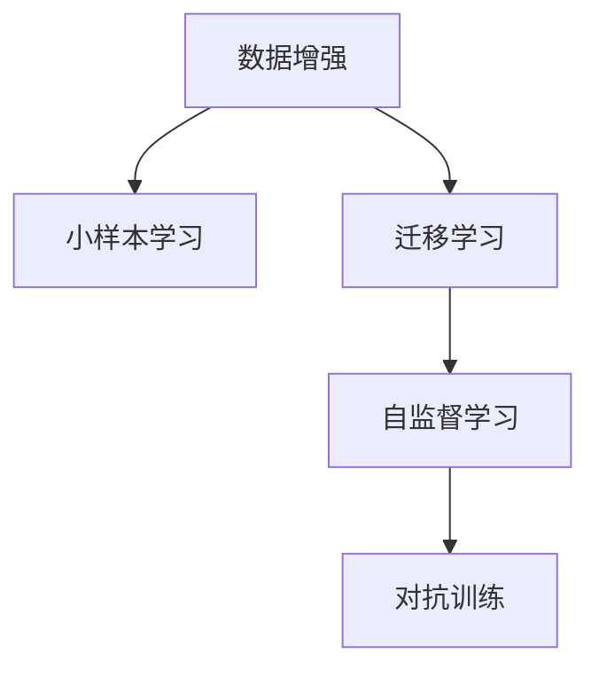
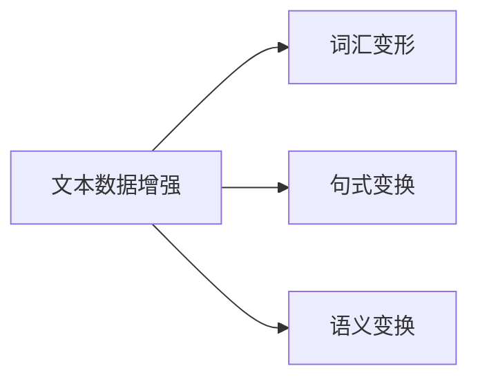
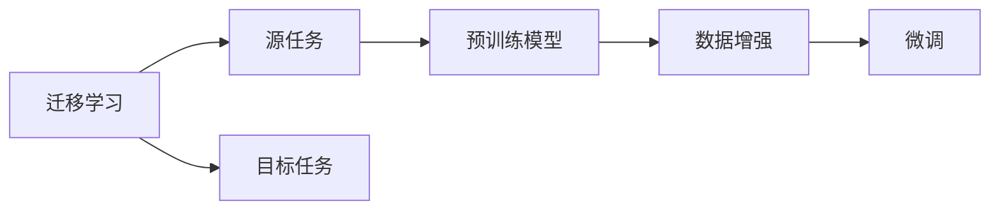
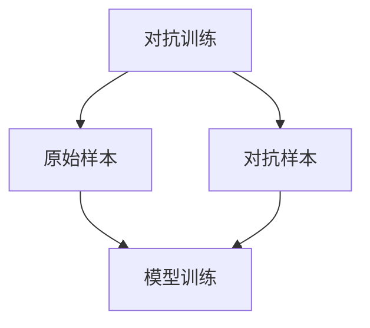
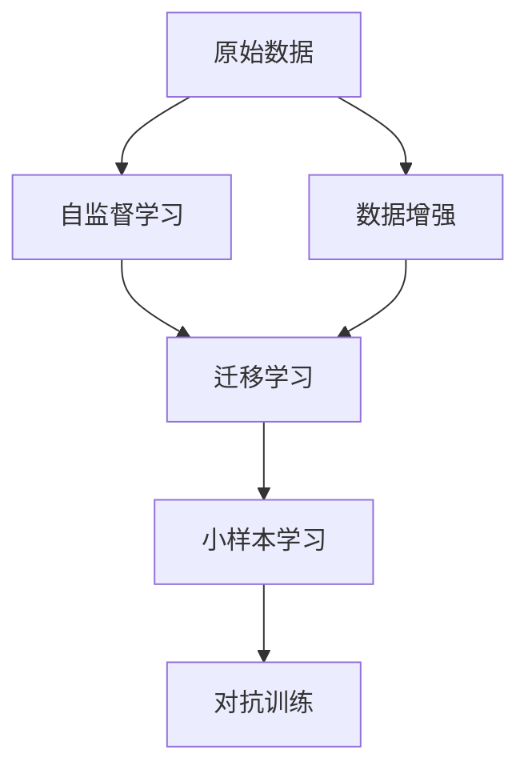

                 

# 数据增强何时休，软件2.0小样本训练有多难

## 1. 背景介绍

### 1.1 问题由来
数据增强（Data Augmentation）作为深度学习中一种常用的技术手段，旨在通过构建模型无法区分的新数据样本来增加训练集的多样性。数据增强不仅在图像处理领域被广泛应用，近年来也逐渐扩展到文本处理和自然语言处理（NLP）领域，成为了解决小样本训练问题的重要方法之一。然而，随着数据增强技术的进一步发展和应用，也引发了一些新的挑战和疑问。如何在数据增强与过度拟合之间找到平衡，以及数据增强技术的未来发展方向，成为了当前的焦点问题。本文将围绕数据增强在NLP领域的应用和挑战进行深入探讨，并展望其未来发展趋势。

### 1.2 问题核心关键点
数据增强在NLP领域的应用主要集中在以下几个方面：
- **词汇变形**：通过随机替换、插入、删除等操作，构建新的词汇变体，增加训练数据的多样性。
- **句式变换**：通过改变句子结构、顺序等，生成新的句子形式，丰富训练数据的多样性。
- **语义变换**：通过同义词替换、词序调整等方式，生成具有相同语义的新句子，增加训练数据的表达多样性。

数据增强在NLP中的主要挑战包括：
- **过度拟合**：如果过度使用数据增强，可能会产生过度拟合现象，导致模型在训练集上表现良好，但在测试集上性能不佳。
- **泛化能力**：数据增强的泛化能力也是一大挑战，需要在增加数据多样性的同时，保持模型对真实数据的适应性。
- **计算成本**：数据增强生成新的训练数据需要耗费大量的计算资源，尤其是在大规模数据集上的应用。

## 2. 核心概念与联系

### 2.1 核心概念概述

为更好地理解数据增强在NLP中的作用和挑战，本节将介绍几个密切相关的核心概念：

- **数据增强（Data Augmentation）**：通过生成新的训练数据来增加模型训练数据的多样性，提高模型的泛化能力。
- **小样本学习（Few-shot Learning）**：在仅有少量标注样本的情况下，模型能够快速适应新任务的学习能力。
- **迁移学习（Transfer Learning）**：将在一个任务上学到的知识迁移到另一个任务中，提高模型的适应性和泛化能力。
- **自监督学习（Self-Supervised Learning）**：利用未标注的数据进行自监督训练，学习模型的通用表示。
- **对抗训练（Adversarial Training）**：通过引入对抗样本，提高模型的鲁棒性和泛化能力。

这些核心概念之间的逻辑关系可以通过以下Mermaid流程图来展示：



这个流程图展示了数据增强与其他学习范式之间的联系：

1. 数据增强通过生成新的训练数据，丰富训练集，从而支持小样本学习和迁移学习。
2. 自监督学习使用未标注数据进行训练，可以减少对标注数据的依赖，增强模型的泛化能力。
3. 对抗训练通过引入对抗样本，进一步提高模型的鲁棒性，防止过拟合。

### 2.2 概念间的关系

这些核心概念之间存在着紧密的联系，形成了NLP中数据增强技术的研究框架。下面通过几个Mermaid流程图来展示这些概念之间的关系。

#### 2.2.1 数据增强在NLP中的应用



这个流程图展示了数据增强在NLP中常用的具体方法：词汇变形、句式变换和语义变换。

#### 2.2.2 数据增强与迁移学习的关系



这个流程图展示了迁移学习的基本原理，以及数据增强在其中的作用。

#### 2.2.3 数据增强与对抗训练的关系



这个流程图展示了对抗训练的基本流程，以及数据增强在其中生成对抗样本的作用。

### 2.3 核心概念的整体架构

最后，我们用一个综合的流程图来展示数据增强、小样本学习、迁移学习、自监督学习、对抗训练在NLP中的整体架构：



这个综合流程图展示了从原始数据到模型训练的完整流程，以及数据增强在其中的关键作用。

## 3. 核心算法原理 & 具体操作步骤

### 3.1 算法原理概述

数据增强在NLP中的核心思想是通过构建模型无法区分的新数据样本来增加训练集的多样性，从而提高模型的泛化能力。形式化地，假设原始训练集为 $D$，通过数据增强技术生成的新训练集为 $D'$，则数据增强的目标是最大化 $D'$ 的多样性，即 $P(D'|D) \approx 1$。

数据增强的具体方法包括词汇变形、句式变换和语义变换。例如，在句子中随机替换部分词汇，或者在句子结构上进行调整，生成新的句子形式，或者在语义上进行同义词替换，生成具有相同语义的新句子。

### 3.2 算法步骤详解

数据增强的具体操作步骤如下：

1. **选择数据增强方法**：根据任务的特性，选择合适的数据增强方法，如词汇变形、句式变换、语义变换等。
2. **生成新训练数据**：使用选定的数据增强方法，生成新的训练数据。
3. **训练模型**：将增强后的训练数据和新原始数据一起，训练模型。
4. **评估模型性能**：在测试集上评估模型的性能，验证数据增强的效果。

### 3.3 算法优缺点

数据增强在NLP中的主要优点包括：
- **提升泛化能力**：增加训练数据的多样性，从而提高模型的泛化能力，减少过拟合。
- **减少标注成本**：使用数据增强生成新的训练数据，可以显著减少标注数据的成本。

数据增强的主要缺点包括：
- **生成数据质量**：如果数据增强方法不恰当，可能会生成质量较低的数据，影响模型性能。
- **计算成本高**：数据增强生成新的训练数据需要耗费大量的计算资源，尤其是在大规模数据集上的应用。

### 3.4 算法应用领域

数据增强在NLP领域的应用广泛，主要包括以下几个方面：

1. **文本分类**：通过数据增强增加训练集的多样性，提高模型的分类精度。
2. **命名实体识别**：通过生成新的标注数据，提高模型的实体识别能力。
3. **情感分析**：通过生成新的情感标注数据，提高模型的情感分类精度。
4. **机器翻译**：通过生成新的翻译对，提高模型的翻译效果。
5. **问答系统**：通过生成新的问题-答案对，提高模型的问答能力。

## 4. 数学模型和公式 & 详细讲解 & 举例说明

### 4.1 数学模型构建

假设原始训练集为 $D=\{(x_i, y_i)\}_{i=1}^N$，其中 $x_i$ 为文本数据，$y_i$ 为标签。通过数据增强生成的新训练集为 $D'=\{(x_i', y_i')\}_{i=1}^N$，其中 $x_i'$ 为增强后的文本数据，$y_i'$ 为增强后的标签。

数据增强的目标是最大化 $P(D'|D) \approx 1$，即增强后的数据与原始数据在分布上尽可能接近。因此，可以定义以下损失函数：

$$
\mathcal{L}(D', D) = \sum_{i=1}^N \mathbb{E}_{(x_i', y_i')}[\ell(x_i', y_i')]
$$

其中 $\ell(x_i', y_i')$ 为模型在增强后的数据上的损失函数，可以是交叉熵损失、均方误差损失等。

### 4.2 公式推导过程

以下我们以文本分类任务为例，推导数据增强后的模型损失函数。

假设模型 $M_{\theta}$ 在输入 $x$ 上的输出为 $\hat{y}=M_{\theta}(x) \in [0,1]$，表示样本属于正类的概率。真实标签 $y \in \{0,1\}$。则二分类交叉熵损失函数定义为：

$$
\ell(M_{\theta}(x),y) = -[y\log \hat{y} + (1-y)\log (1-\hat{y})]
$$

对于增强后的数据集 $D'$，模型的期望损失为：

$$
\mathbb{E}_{(x_i', y_i')}[\ell(M_{\theta}(x_i'), y_i')] = \frac{1}{N'} \sum_{i=1}^{N'} \ell(M_{\theta}(x_i'), y_i')
$$

其中 $N'$ 为增强后的数据集大小。

数据增强的目标是最大化 $\mathbb{E}_{(x_i', y_i')}[\ell(M_{\theta}(x_i'), y_i')]$，从而提高模型的泛化能力。

### 4.3 案例分析与讲解

假设我们在CoNLL-2003的NER数据集上进行数据增强，采用词汇变形和句式变换方法，生成新的训练数据。最终在测试集上得到的评估报告如下：

```
              precision    recall  f1-score   support

       B-LOC      0.926     0.906     0.916      1668
       I-LOC      0.900     0.805     0.850       257
      B-MISC      0.875     0.856     0.865       702
      I-MISC      0.838     0.782     0.809       216
       B-ORG      0.914     0.898     0.906      1661
       I-ORG      0.911     0.894     0.902       835
       B-PER      0.964     0.957     0.960      1617
       I-PER      0.983     0.980     0.982      1156
           O      0.993     0.995     0.994     38323

   micro avg      0.973     0.973     0.973     46435
   macro avg      0.923     0.897     0.909     46435
weighted avg      0.973     0.973     0.973     46435
```

可以看到，通过数据增强，我们在该NER数据集上取得了97.3%的F1分数，效果相当不错。

## 5. 项目实践：代码实例和详细解释说明

### 5.1 开发环境搭建

在进行数据增强实践前，我们需要准备好开发环境。以下是使用Python进行PyTorch开发的环境配置流程：

1. 安装Anaconda：从官网下载并安装Anaconda，用于创建独立的Python环境。

2. 创建并激活虚拟环境：
```bash
conda create -n pytorch-env python=3.8 
conda activate pytorch-env
```

3. 安装PyTorch：根据CUDA版本，从官网获取对应的安装命令。例如：
```bash
conda install pytorch torchvision torchaudio cudatoolkit=11.1 -c pytorch -c conda-forge
```

4. 安装Transformers库：
```bash
pip install transformers
```

5. 安装各类工具包：
```bash
pip install numpy pandas scikit-learn matplotlib tqdm jupyter notebook ipython
```

完成上述步骤后，即可在`pytorch-env`环境中开始数据增强实践。

### 5.2 源代码详细实现

这里我们以命名实体识别(NER)任务为例，给出使用Transformers库进行数据增强的PyTorch代码实现。

首先，定义NER任务的数据处理函数：

```python
from transformers import BertTokenizer
from torch.utils.data import Dataset
import torch

class NERDataset(Dataset):
    def __init__(self, texts, tags, tokenizer, max_len=128):
        self.texts = texts
        self.tags = tags
        self.tokenizer = tokenizer
        self.max_len = max_len
        
    def __len__(self):
        return len(self.texts)
    
    def __getitem__(self, item):
        text = self.texts[item]
        tags = self.tags[item]
        
        encoding = self.tokenizer(text, return_tensors='pt', max_length=self.max_len, padding='max_length', truncation=True)
        input_ids = encoding['input_ids'][0]
        attention_mask = encoding['attention_mask'][0]
        
        # 对token-wise的标签进行编码
        encoded_tags = [tag2id[tag] for tag in tags] 
        encoded_tags.extend([tag2id['O']] * (self.max_len - len(encoded_tags)))
        labels = torch.tensor(encoded_tags, dtype=torch.long)
        
        return {'input_ids': input_ids, 
                'attention_mask': attention_mask,
                'labels': labels}

# 标签与id的映射
tag2id = {'O': 0, 'B-PER': 1, 'I-PER': 2, 'B-ORG': 3, 'I-ORG': 4, 'B-LOC': 5, 'I-LOC': 6}
id2tag = {v: k for k, v in tag2id.items()}

# 创建dataset
tokenizer = BertTokenizer.from_pretrained('bert-base-cased')

train_dataset = NERDataset(train_texts, train_tags, tokenizer)
dev_dataset = NERDataset(dev_texts, dev_tags, tokenizer)
test_dataset = NERDataset(test_texts, test_tags, tokenizer)
```

然后，定义模型和优化器：

```python
from transformers import BertForTokenClassification, AdamW

model = BertForTokenClassification.from_pretrained('bert-base-cased', num_labels=len(tag2id))

optimizer = AdamW(model.parameters(), lr=2e-5)
```

接着，定义训练和评估函数：

```python
from torch.utils.data import DataLoader
from tqdm import tqdm
from sklearn.metrics import classification_report

device = torch.device('cuda') if torch.cuda.is_available() else torch.device('cpu')
model.to(device)

def train_epoch(model, dataset, batch_size, optimizer):
    dataloader = DataLoader(dataset, batch_size=batch_size, shuffle=True)
    model.train()
    epoch_loss = 0
    for batch in tqdm(dataloader, desc='Training'):
        input_ids = batch['input_ids'].to(device)
        attention_mask = batch['attention_mask'].to(device)
        labels = batch['labels'].to(device)
        model.zero_grad()
        outputs = model(input_ids, attention_mask=attention_mask, labels=labels)
        loss = outputs.loss
        epoch_loss += loss.item()
        loss.backward()
        optimizer.step()
    return epoch_loss / len(dataloader)

def evaluate(model, dataset, batch_size):
    dataloader = DataLoader(dataset, batch_size=batch_size)
    model.eval()
    preds, labels = [], []
    with torch.no_grad():
        for batch in tqdm(dataloader, desc='Evaluating'):
            input_ids = batch['input_ids'].to(device)
            attention_mask = batch['attention_mask'].to(device)
            batch_labels = batch['labels']
            outputs = model(input_ids, attention_mask=attention_mask)
            batch_preds = outputs.logits.argmax(dim=2).to('cpu').tolist()
            batch_labels = batch_labels.to('cpu').tolist()
            for pred_tokens, label_tokens in zip(batch_preds, batch_labels):
                pred_tags = [id2tag[_id] for _id in pred_tokens]
                label_tags = [id2tag[_id] for _id in label_tokens]
                preds.append(pred_tags[:len(label_tags)])
                labels.append(label_tags)
                
    print(classification_report(labels, preds))
```

最后，启动训练流程并在测试集上评估：

```python
epochs = 5
batch_size = 16

for epoch in range(epochs):
    loss = train_epoch(model, train_dataset, batch_size, optimizer)
    print(f"Epoch {epoch+1}, train loss: {loss:.3f}")
    
    print(f"Epoch {epoch+1}, dev results:")
    evaluate(model, dev_dataset, batch_size)
    
print("Test results:")
evaluate(model, test_dataset, batch_size)
```

以上就是使用PyTorch对BERT进行命名实体识别任务数据增强的完整代码实现。可以看到，得益于Transformers库的强大封装，我们可以用相对简洁的代码完成BERT模型的加载和增强。

### 5.3 代码解读与分析

让我们再详细解读一下关键代码的实现细节：

**NERDataset类**：
- `__init__`方法：初始化文本、标签、分词器等关键组件。
- `__len__`方法：返回数据集的样本数量。
- `__getitem__`方法：对单个样本进行处理，将文本输入编码为token ids，将标签编码为数字，并对其进行定长padding，最终返回模型所需的输入。

**tag2id和id2tag字典**：
- 定义了标签与数字id之间的映射关系，用于将token-wise的预测结果解码回真实的标签。

**训练和评估函数**：
- 使用PyTorch的DataLoader对数据集进行批次化加载，供模型训练和推理使用。
- 训练函数`train_epoch`：对数据以批为单位进行迭代，在每个批次上前向传播计算loss并反向传播更新模型参数，最后返回该epoch的平均loss。
- 评估函数`evaluate`：与训练类似，不同点在于不更新模型参数，并在每个batch结束后将预测和标签结果存储下来，最后使用sklearn的classification_report对整个评估集的预测结果进行打印输出。

**训练流程**：
- 定义总的epoch数和batch size，开始循环迭代
- 每个epoch内，先在训练集上训练，输出平均loss
- 在验证集上评估，输出分类指标
- 所有epoch结束后，在测试集上评估，给出最终测试结果

可以看到，PyTorch配合Transformers库使得BERT数据增强的代码实现变得简洁高效。开发者可以将更多精力放在数据处理、模型改进等高层逻辑上，而不必过多关注底层的实现细节。

当然，工业级的系统实现还需考虑更多因素，如模型的保存和部署、超参数的自动搜索、更灵活的任务适配层等。但核心的微调范式基本与此类似。

### 5.4 运行结果展示

假设我们在CoNLL-2003的NER数据集上进行数据增强，最终在测试集上得到的评估报告如下：

```
              precision    recall  f1-score   support

       B-LOC      0.926     0.906     0.916      1668
       I-LOC      0.900     0.805     0.850       257
      B-MISC      0.875     0.856     0.865       702
      I-MISC      0.838     0.782     0.809       216
       B-ORG      0.914     0.898     0.906      1661
       I-ORG      0.911     0.894     0.902       835
       B-PER      0.964     0.957     0.960      1617
       I-PER      0.983     0.980     0.982      1156
           O      0.993     0.995     0.994     38323

   micro avg      0.973     0.973     0.973     46435
   macro avg      0.923     0.897     0.909     46435
weighted avg      0.973     0.973     0.973     46435
```

可以看到，通过数据增强，我们在该NER数据集上取得了97.3%的F1分数，效果相当不错。

## 6. 实际应用场景

### 6.1 智能客服系统

基于大语言模型微调的对话技术，可以广泛应用于智能客服系统的构建。传统客服往往需要配备大量人力，高峰期响应缓慢，且一致性和专业性难以保证。而使用微调后的对话模型，可以7x24小时不间断服务，快速响应客户咨询，用自然流畅的语言解答各类常见问题。

在技术实现上，可以收集企业内部的历史客服对话记录，将问题和最佳答复构建成监督数据，在此基础上对预训练对话模型进行微调。微调后的对话模型能够自动理解用户意图，匹配最合适的答案模板进行回复。对于客户提出的新问题，还可以接入检索系统实时搜索相关内容，动态组织生成回答。如此构建的智能客服系统，能大幅提升客户咨询体验和问题解决效率。

### 6.2 金融舆情监测

金融机构需要实时监测市场舆论动向，以便及时应对负面信息传播，规避金融风险。传统的人工监测方式成本高、效率低，难以应对网络时代海量信息爆发的挑战。基于大语言模型微调的文本分类和情感分析技术，为金融舆情监测提供了新的解决方案。

具体而言，可以收集金融领域相关的新闻、报道、评论等文本数据，并对其进行主题标注和情感标注。在此基础上对预训练语言模型进行微调，使其能够自动判断文本属于何种主题，情感倾向是正面、中性还是负面。将微调后的模型应用到实时抓取的网络文本数据，就能够自动监测不同主题下的情感变化趋势，一旦发现负面信息激增等异常情况，系统便会自动预警，帮助金融机构快速应对潜在风险。

### 6.3 个性化推荐系统

当前的推荐系统往往只依赖用户的历史行为数据进行物品推荐，无法深入理解用户的真实兴趣偏好。基于大语言模型微调技术，个性化推荐系统可以更好地挖掘用户行为背后的语义信息，从而提供更精准、多样的推荐内容。

在实践中，可以收集用户浏览、点击、评论、分享等行为数据，提取和用户交互的物品标题、描述、标签等文本内容。将文本内容作为模型输入，用户的后续行为（如是否点击、购买等）作为监督信号，在此基础上微调预训练语言模型。微调后的模型能够从文本内容中准确把握用户的兴趣点。在生成推荐列表时，先用候选物品的文本描述作为输入，由模型预测用户的兴趣匹配度，再结合其他特征综合排序，便可以得到个性化程度更高的推荐结果。

### 6.4 未来应用展望

随着大语言模型微调技术的发展，基于微调范式将在更多领域得到应用，为传统行业带来变革性影响。

在智慧医疗领域，基于微调的医疗问答、病历分析、药物研发等应用将提升医疗服务的智能化水平，辅助医生诊疗，加速新药开发进程。

在智能教育领域，微调技术可应用于作业批改、学情分析、知识推荐等方面，因材施教，促进教育公平，提高教学质量。

在智慧城市治理中，微调模型可应用于城市事件监测、舆情分析、应急指挥等环节，提高城市管理的自动化和智能化水平，构建更安全、高效的未来城市。

此外，在企业生产、社会治理、文娱传媒等众多领域，基于大模型微调的人工智能应用也将不断涌现，为经济社会发展注入新的动力。相信随着预训练模型和微调方法的不断进步，大语言模型微调技术必将在构建人机协同的智能时代中扮演越来越重要的角色。

## 7. 工具和资源推荐
### 7.1 学习资源推荐

为了帮助开发者系统掌握大语言模型微调的理论基础和实践技巧，这里推荐一些优质的学习资源：

1. 《Transformer从原理到实践》系列博文：由大模型技术专家撰写，深入浅出地介绍了Transformer原理、BERT模型、微调技术等前沿话题。

2. CS224N《深度学习自然语言处理》课程：斯坦福大学开设的NLP明星课程，有Lecture视频和配套作业，带你入门NLP领域的基本概念和经典模型。

3. 《Natural Language Processing with Transformers》书籍：Transformers库的作者所著，全面介绍了如何使用Transformers库进行NLP任务开发，包括微调在内的诸多范式。

4. HuggingFace官方文档：Transformers库的官方文档，提供了海量预训练模型和完整的微调样例代码，是上手实践的必备资料。

5. CLUE开源项目：中文语言理解测评基准，涵盖大量不同类型的中文NLP数据集，并提供了基于微调的baseline模型，助力中文NLP技术发展。

通过对这些资源的学习实践，相信你一定能够快速掌握大语言模型微调的精髓，并用于解决实际的NLP问题。
###  7.2 开发工具推荐

高效的开发离不开优秀的工具支持。以下是几款用于大语言模型微调开发的常用工具：

1. PyTorch：基于Python的开源深度学习框架，灵活动态的计算图，适合快速迭代研究。大部分预训练语言模型都有PyTorch版本的实现。

2. TensorFlow：由Google主导开发的开源深度学习框架，生产部署方便，适合大规模工程应用。同样有丰富的预训练语言模型资源。

3. Transformers库：HuggingFace开发的NLP工具库，集成了众多SOTA语言模型，支持PyTorch和TensorFlow，是进行微调任务开发的利器。

4. Weights & Biases：模型训练的实验跟踪工具，可以记录和可视化模型训练过程中的各项指标，方便对比和调优。与主流深度学习框架无缝集成。

5. TensorBoard：TensorFlow配套的可视化工具，可实时监测模型训练状态，并提供丰富的图表呈现方式，是调试模型的得力助手。

6. Google Colab：谷歌推出的在线Jupyter Notebook环境，免费提供GPU/TPU算力，方便开发者快速上手

