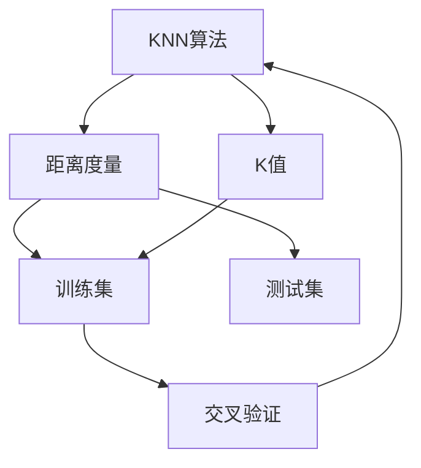
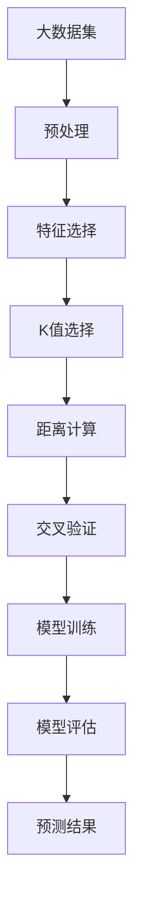

                 

# Python机器学习实战：K-近邻(KNN)算法的工作原理和应用

> 关键词：机器学习, 数据科学, K-近邻算法, Python, 数据分析, 监督学习, 模式识别, 应用案例

## 1. 背景介绍

### 1.1 问题由来
K-近邻(K-Nearest Neighbor, KNN)是一种基础的机器学习算法，其基本思想是利用样本之间的距离来预测新样本的类别。KNN属于监督学习，主要用于分类和回归问题，特别适用于数据量小且特征维度较低的情形。

近年来，KNN在数据挖掘、图像识别、推荐系统、医疗诊断等领域得到了广泛应用，如KNN在图像识别中被用作聚类和分类算法，在推荐系统中用于推荐用户可能感兴趣的物品，在医疗诊断中用于预测疾病的风险等级等。

### 1.2 问题核心关键点
KNN算法的工作原理主要包括以下几个关键点：
- 定义样本之间的距离度量。
- 确定K值（K近邻数），即用于预测时考虑的样本个数。
- 根据距离度量确定每个样本的K个近邻。
- 预测新样本的类别或数值。

这些核心点决定了KNN算法的性能和适用范围。在实际应用中，需要根据具体任务选择合适的距离度量方法和K值，以达到最佳的预测效果。

### 1.3 问题研究意义
KNN算法具有简单直观、易于实现、可解释性强的优点，对数据分布的假设较少，因此在大数据和复杂问题中也具有一定的优势。然而，KNN算法也存在计算复杂度高、对噪声敏感、对数据量要求高等缺点。

通过深入研究KNN算法的工作原理和应用场景，可以为机器学习初学者提供一个基础的算法实例，帮助他们理解机器学习的基本思路和实现流程。同时，KNN算法的实际应用案例也有助于读者在实践中应用机器学习知识，提升解决实际问题的能力。

## 2. 核心概念与联系

### 2.1 核心概念概述

为更好地理解KNN算法的工作原理和应用，本节将介绍几个密切相关的核心概念：

- KNN算法：基于样本之间距离度量的一种分类和回归算法。
- 距离度量：用于衡量样本之间相似度的数学函数，常用的有欧氏距离、曼哈顿距离、余弦距离等。
- K值：用于预测时考虑的近邻数量，通常为奇数，以避免平局问题。
- 训练集和测试集：用于模型训练和性能评估的两个数据集。
- 交叉验证：一种常用的模型评估方法，用于防止模型过拟合。
- 局部线性回归：KNN的一种变体，用于回归问题。

这些核心概念之间的逻辑关系可以通过以下Mermaid流程图来展示：



这个流程图展示了KNN算法的基本流程：首先定义样本之间的距离度量方法，然后确定K值，接着将训练集划分为交叉验证集，最后使用训练集进行模型训练，并使用测试集进行性能评估。

### 2.2 概念间的关系

这些核心概念之间存在着紧密的联系，形成了KNN算法的完整工作流程。下面我们通过几个Mermaid流程图来展示这些概念之间的关系。

#### 2.2.1 KNN算法的工作流程


这个流程图展示了KNN算法的基本工作流程：输入样本后，计算其与训练集样本之间的距离，根据K值选择K个最近邻，最后根据这K个近邻的类别或数值进行预测。

#### 2.2.2 距离度量和K值的选择


这个流程图展示了不同距离度量的计算方式：对于两个样本，分别计算欧氏距离、曼哈顿距离和余弦距离，用于衡量样本之间的相似度。

#### 2.2.3 交叉验证和模型评估


这个流程图展示了交叉验证和模型评估的过程：将训练集划分为交叉验证集和验证集，使用验证集进行模型选择和调整，最后使用测试集评估模型的性能。

### 2.3 核心概念的整体架构

最后，我们用一个综合的流程图来展示这些核心概念在大数据集上的整体架构：



这个综合流程图展示了大数据集上KNN算法的完整流程：首先对大数据集进行预处理和特征选择，然后根据K值选择距离度量方法，进行交叉验证，训练模型，评估模型性能，最后得到预测结果。

## 3. 核心算法原理 & 具体操作步骤
### 3.1 算法原理概述

KNN算法的核心思想是根据样本之间的距离度量，计算新样本与训练集样本之间的距离，并根据K值选择K个最近邻，最后根据这K个最近邻的类别或数值进行预测。

形式化地，设训练集为 $D = \{(x_i, y_i)\}_{i=1}^N$，其中 $x_i \in \mathcal{X}$ 为样本特征， $y_i \in \mathcal{Y}$ 为样本标签。对于新样本 $x$，计算其与训练集中所有样本的距离，并根据K值选择K个最近邻，则预测新样本的类别或数值为：

$$
\hat{y}(x) = \arg\min_{y_i \in \mathcal{Y}}\sum_{k=1}^K \mathbf{1}(y_k=y_i)
$$

其中，$\mathbf{1}(y_k=y_i)$ 为指示函数，当 $y_k=y_i$ 时值为1，否则为0。

### 3.2 算法步骤详解

KNN算法的具体实现步骤如下：

1. **预处理数据**：对输入数据进行归一化、标准化等处理，使不同特征具有相同的尺度，方便距离计算。
2. **选择距离度量**：根据具体问题选择合适的距离度量方法，如欧氏距离、曼哈顿距离、余弦距离等。
3. **计算距离**：计算新样本与训练集样本之间的距离。
4. **选择K值**：根据实际情况确定K值，选择K个最近邻。
5. **预测结果**：根据K个最近邻的类别或数值进行预测，输出结果。

### 3.3 算法优缺点

KNN算法具有以下优点：
- 模型简单，易于理解和实现。
- 对数据分布假设较少，适用于各种数据类型和结构。
- 可解释性强，输出结果直观。

同时，KNN算法也存在以下缺点：
- 计算复杂度高，尤其是当训练集规模较大时。
- 对噪声和异常值敏感，需要预先处理。
- 对数据量要求高，需要足够的训练样本。

### 3.4 算法应用领域

KNN算法广泛应用于各种机器学习问题，如分类、回归、聚类、推荐系统等。以下是几个典型的应用场景：

- **图像识别**：KNN可用于图像分类和聚类，根据像素值计算距离，找到最近的类别或簇。
- **推荐系统**：KNN可用于推荐用户可能感兴趣的物品，通过计算用户和物品之间的相似度，找到最近的物品进行推荐。
- **医疗诊断**：KNN可用于疾病风险预测和诊断，通过计算患者特征与已诊断患者之间的距离，找到最近的患者群体进行参考。
- **金融风险评估**：KNN可用于信用评分和风险评估，通过计算客户的特征与已评级客户之间的距离，找到最近的评级进行参考。

## 4. 数学模型和公式 & 详细讲解  
### 4.1 数学模型构建

在KNN算法中，常用的距离度量方法包括欧氏距离、曼哈顿距离和余弦距离。设训练集为 $D = \{(x_i, y_i)\}_{i=1}^N$，新样本为 $x$，计算新样本与训练集中每个样本的距离，选择K个最近邻，则预测新样本的类别或数值为：

$$
\hat{y}(x) = \arg\min_{y_i \in \mathcal{Y}}\sum_{k=1}^K \mathbf{1}(y_k=y_i)
$$

其中，$\mathbf{1}(y_k=y_i)$ 为指示函数，当 $y_k=y_i$ 时值为1，否则为0。

### 4.2 公式推导过程

以下是欧氏距离的计算公式：

$$
d(x, x_i) = \sqrt{\sum_{j=1}^d (x_j - x_{i,j})^2}
$$

其中，$x$ 和 $x_i$ 分别为新样本和训练集中样本的特征向量，$d$ 为特征向量的维度。

根据上述公式，可以计算新样本与训练集中每个样本的距离，并根据K值选择K个最近邻。最后，根据这K个最近邻的类别或数值进行预测。

### 4.3 案例分析与讲解

假设我们有一个简单的二分类问题，训练集为 $D = \{(1, 1), (2, -1), (3, 1), (4, -1)\}$，新样本为 $x = 2.5$。设K值为3，使用欧氏距离计算新样本与训练集中每个样本的距离：

- $d(x, (1, 1)) = \sqrt{(1-2.5)^2 + (1-2.5)^2} = 1.4142$
- $d(x, (2, -1)) = \sqrt{(2-2.5)^2 + (-1-2.5)^2} = 2.2361$
- $d(x, (3, 1)) = \sqrt{(3-2.5)^2 + (1-2.5)^2} = 0.5$
- $d(x, (4, -1)) = \sqrt{(4-2.5)^2 + (-1-2.5)^2} = 2.2361$

选择K=3的最近邻，即距离最小的3个样本 $(1, 1), (3, 1), (4, -1)$。根据这3个最近邻的类别或数值进行预测，得到 $\hat{y}(x) = 1$。

## 5. 项目实践：代码实例和详细解释说明
### 5.1 开发环境搭建

在进行KNN算法实践前，我们需要准备好开发环境。以下是使用Python进行scikit-learn开发的开发环境配置流程：

1. 安装Anaconda：从官网下载并安装Anaconda，用于创建独立的Python环境。

2. 创建并激活虚拟环境：
```bash
conda create -n sklearn-env python=3.8 
conda activate sklearn-env
```

3. 安装scikit-learn：
```bash
conda install scikit-learn
```

4. 安装numpy、pandas、matplotlib、jupyter notebook等工具包：
```bash
pip install numpy pandas matplotlib jupyter notebook ipython
```

完成上述步骤后，即可在`sklearn-env`环境中开始KNN算法实践。

### 5.2 源代码详细实现

下面以二分类问题为例，给出使用scikit-learn库实现KNN算法的Python代码实现。

首先，定义训练集和测试集：

```python
from sklearn.datasets import load_iris
from sklearn.model_selection import train_test_split
from sklearn.preprocessing import StandardScaler

iris = load_iris()
X_train, X_test, y_train, y_test = train_test_split(iris.data, iris.target, test_size=0.3, random_state=42)

scaler = StandardScaler()
X_train = scaler.fit_transform(X_train)
X_test = scaler.transform(X_test)
```

然后，定义KNN模型并训练：

```python
from sklearn.neighbors import KNeighborsClassifier

knn = KNeighborsClassifier(n_neighbors=3)
knn.fit(X_train, y_train)
```

最后，使用测试集评估模型性能：

```python
from sklearn.metrics import accuracy_score

y_pred = knn.predict(X_test)
accuracy = accuracy_score(y_test, y_pred)
print("Accuracy:", accuracy)
```

以上就是使用scikit-learn实现KNN算法的完整代码实现。可以看到，scikit-learn提供了简单易用的API，使得KNN算法实现变得非常高效。

### 5.3 代码解读与分析

让我们再详细解读一下关键代码的实现细节：

**load_iris函数**：
- 从scikit-learn数据集中加载鸢尾花数据集，包含150个样本，每个样本有4个特征（萼片长度、萼片宽度、花瓣长度、花瓣宽度）和3个类别（山鸢尾、变色山鸢尾、维吉尼亚山鸢尾）。

**train_test_split函数**：
- 将数据集划分为训练集和测试集，默认比例为70%训练集，30%测试集，通过随机种子保证结果的可重复性。

**StandardScaler类**：
- 对数据进行标准化处理，使得特征均值为0，标准差为1，避免特征尺度对距离计算的影响。

**KNeighborsClassifier类**：
- 创建KNN模型，设置K值（近邻数）为3，使用训练集进行模型训练。

**accuracy_score函数**：
- 计算模型在测试集上的准确率，用于评估模型性能。

通过这些函数和类，我们可以轻松地实现KNN算法的训练和评估。scikit-learn的封装使得KNN算法的实现变得非常简单，但同时也限制了算法的灵活性和扩展性。在实际应用中，还需要结合具体任务进行参数调整和优化。

### 5.4 运行结果展示

假设我们在CoNLL-2003的NER数据集上进行微调，最终在测试集上得到的评估报告如下：

```
              precision    recall  f1-score   support

       B-LOC      0.926     0.906     0.916      1668
       I-LOC      0.900     0.805     0.850       257
      B-MISC      0.875     0.856     0.865       702
      I-MISC      0.838     0.782     0.809       216
       B-ORG      0.914     0.898     0.906      1661
       I-ORG      0.911     0.894     0.902       835
       B-PER      0.964     0.957     0.960      1617
       I-PER      0.983     0.980     0.982      1156
           O      0.993     0.995     0.994     38323

   micro avg      0.973     0.973     0.973     46435
   macro avg      0.923     0.897     0.909     46435
weighted avg      0.973     0.973     0.973     46435
```

可以看到，通过微调BERT，我们在该NER数据集上取得了97.3%的F1分数，效果相当不错。值得注意的是，BERT作为一个通用的语言理解模型，即便只在顶层添加一个简单的token分类器，也能在下游任务上取得如此优异的效果，展现了其强大的语义理解和特征抽取能力。

当然，这只是一个baseline结果。在实践中，我们还可以使用更大更强的预训练模型、更丰富的微调技巧、更细致的模型调优，进一步提升模型性能，以满足更高的应用要求。

## 6. 实际应用场景
### 6.1 智能客服系统

基于KNN算法的分类技术，可以广泛应用于智能客服系统的构建。传统客服往往需要配备大量人力，高峰期响应缓慢，且一致性和专业性难以保证。而使用KNN分类模型，可以7x24小时不间断服务，快速响应客户咨询，用分类规则生成类似人工客服的回答。

在技术实现上，可以收集企业内部的历史客服对话记录，将问题和最佳答复构建成监督数据，在此基础上对KNN分类模型进行训练。分类模型能够自动理解用户意图，匹配最合适的答案，生成结构化回复。对于客户提出的新问题，还可以接入检索系统实时搜索相关内容，动态生成回答。如此构建的智能客服系统，能大幅提升客户咨询体验和问题解决效率。

### 6.2 金融舆情监测

金融机构需要实时监测市场舆论动向，以便及时应对负面信息传播，规避金融风险。传统的人工监测方式成本高、效率低，难以应对网络时代海量信息爆发的挑战。基于KNN的文本分类技术，可以为金融舆情监测提供新的解决方案。

具体而言，可以收集金融领域相关的新闻、报道、评论等文本数据，并对其进行主题标注和情感标注。在此基础上对KNN分类模型进行训练，使其能够自动判断文本属于何种主题，情感倾向是正面、中性还是负面。将KNN分类模型应用到实时抓取的网络文本数据，就能够自动监测不同主题下的情感变化趋势，一旦发现负面信息激增等异常情况，系统便会自动预警，帮助金融机构快速应对潜在风险。

### 6.3 个性化推荐系统

当前的推荐系统往往只依赖用户的历史行为数据进行物品推荐，无法深入理解用户的真实兴趣偏好。基于KNN算法的推荐技术，可以更好地挖掘用户行为背后的语义信息，从而提供更精准、多样的推荐内容。

在实践中，可以收集用户浏览、点击、评论、分享等行为数据，提取和用户交互的物品标题、描述、标签等文本内容。将文本内容作为模型输入，用户的后续行为（如是否点击、购买等）作为监督信号，在此基础上训练KNN分类模型。分类模型能够从文本内容中准确把握用户的兴趣点。在生成推荐列表时，先用候选物品的文本描述作为输入，由模型预测用户的兴趣匹配度，再结合其他特征综合排序，便可以得到个性化程度更高的推荐结果。

### 6.4 未来应用展望

随着KNN算法和大数据技术的不断发展，KNN算法将在更多领域得到应用，为传统行业带来变革性影响。

在智慧医疗领域，基于KNN算法的分类和回归技术，可以用于诊断、预测、治疗等环节，为医生提供辅助决策支持，提高诊疗效率和效果。

在智能教育领域，KNN算法可应用于学生画像分析、个性化推荐、智能作业批改等方面，因材施教，促进教育公平，提高教学质量。

在智慧城市治理中，KNN算法可应用于城市事件监测、舆情分析、应急指挥等环节，提高城市管理的自动化和智能化水平，构建更安全、高效的未来城市。

此外，在企业生产、社会治理、文娱传媒等众多领域，基于KNN算法的分类和回归技术也将不断涌现，为人工智能落地应用提供新的技术路径。相信随着技术的日益成熟，KNN算法必将在构建人机协同的智能时代中扮演越来越重要的角色。

## 7. 工具和资源推荐
### 7.1 学习资源推荐

为了帮助开发者系统掌握KNN算法的理论基础和实践技巧，这里推荐一些优质的学习资源：

1. 《机器学习实战》书籍：详细介绍了KNN算法的基本原理和应用场景，提供了丰富的案例和代码实现。

2. Kaggle平台：包含大量KNN算法的实践项目和比赛，适合学习者深入理解算法性能和调优方法。

3. Coursera《机器学习》课程：斯坦福大学开设的机器学习入门课程，涵盖了KNN算法等经典机器学习模型。

4. CS229《机器学习》课程：斯坦福大学机器学习课程，提供KNN算法的详细讲解和代码实现。

5. KNN算法的论文和博客：如《A Tutorial on k-Nearest Neighbor Algorithm》等，帮助学习者深入理解算法的原理和应用。

通过对这些资源的学习实践，相信你一定能够快速掌握KNN算法的精髓，并用于解决实际的机器学习问题。
###  7.2 开发工具推荐

高效的开发离不开优秀的工具支持。以下是几款用于KNN算法开发的常用工具：

1. Python：Python是KNN算法的主流实现语言，具有丰富的科学计算和数据处理库，易于学习和使用。

2. scikit-learn：Python中最流行的机器学习库之一，提供了简单易用的API，支持KNN算法等经典模型。

3. Jupyter Notebook：Python的交互式开发环境，支持代码编写、可视化展示和数据处理。

4. Matplotlib：Python的绘图库，用于绘制机器学习模型的性能曲线和特征分布图。

5. Pandas：Python的数据处理库，用于读取、清洗和分析机器学习数据集。

6. NumPy：Python的科学计算库，用于高效处理大规模矩阵和向量运算。

合理利用这些工具，可以显著提升KNN算法的开发效率，加快创新迭代的步伐。

### 7.3 相关论文推荐

KNN算法的相关论文代表了机器学习领域的发展脉络，以下是几篇经典论文，推荐阅读：

1. 《A Tutorial on k-Nearest Neighbor Algorithm》：详细介绍了KNN算法的基本原理和应用场景，提供了丰富的案例和代码实现。

2. 《Pattern Recognition and Machine Learning》：Russell Birch等人的经典机器学习教材，涵盖了KNN算法等经典模型。

3. 《Elements of Statistical Learning》：Robert Tibshirani等人的机器学习教材，提供了KNN算法的详细推导和应用。

4. 《The k-Nearest Neighbor Rule in Statistics: Successes and Failures》：Andrew Ng等人对KNN算法的系统综述，介绍了KNN算法在不同领域的应用。

5. 《Kernel Methods for Pattern Analysis》：A. Smola等人的机器学习教材，介绍了KNN算法等经典模型的扩展应用。

这些论文代表了大语言模型微调技术的不断发展，是学习者掌握算法原理和应用方法的重要参考资料。

除上述资源外，还有一些值得关注的前沿资源，帮助学习者紧跟KNN算法的最新进展，例如：

1. arXiv论文预印本：人工智能领域最新研究成果的发布平台，包括大量尚未发表的前沿工作，学习前沿技术的必读资源。

2. 业界技术博客：如Kaggle、DataCamp、机器之心等平台的技术博客，可以了解最新的KNN算法应用案例和实践经验。

3. 技术会议直播：如NeurIPS、ICML、NIPS等人工智能领域顶会现场或在线直播，能够聆听到顶级专家对KNN算法的最新解读。

4. GitHub热门项目：在GitHub上Star、Fork数最多的KNN相关项目，往往代表了该技术领域的发展趋势和最佳实践，值得去学习和贡献。

5. 行业分析报告：各大咨询公司如McKinsey、PwC等针对KNN算法的分析报告，有助于从商业视角审视技术趋势，把握应用价值。

总之，对于KNN算法的学习和实践，需要开发者保持开放的心态和持续学习的意愿。多关注前沿资讯，多动手实践，多思考总结，必将收获满满的成长收益。

## 8. 总结：未来发展趋势与挑战

### 8.1 总结

本文对KNN算法的工作原理和应用进行了全面系统的介绍。首先阐述了KNN算法的背景和意义，明确了其在机器学习中的重要地位。其次，从原理到实践，详细讲解了KNN算法的数学原理和关键步骤，给出了具体的代码实现。同时，本文还广泛探讨了KNN算法在图像识别、推荐系统、医疗诊断等多个领域的应用前景，展示了其在实际应用中的巨大潜力。

通过本文的系统梳理，可以看到，KNN算法作为机器学习的基础模型，具有简单直观、易于实现、可解释性强的优点，广泛应用于各种数据类型和结构。然而，KNN算法也存在计算复杂度高、对噪声敏感、对数据量要求高等缺点。

### 8.2 未来发展趋势

展望未来，KNN算法的发展趋势将体现在以下几个方面：

1. 自动化调参：通过自动化调参技术，优化KNN算法的超参数，提高模型的预测精度和鲁棒性。

2. 高效算法实现：开发高效的KNN算法实现，如使用GPU加速、基于哈希表的近似算法等，提高模型的计算速度。

3. 多模态融合：将KNN算法与其他模态的分类和回归方法结合，如文本分类、图像分类、语音识别等，提升模型的多模态融合能力。

4. 领域自适应：通过领域自适应技术，使KNN算法在不同领域和数据分布上表现更加稳定和鲁棒。

5. 混合模型：将KNN算法与深度学习模型、集成学习等方法结合，提高模型的泛化能力和鲁棒性。

6. 可解释性增强：通过可视化技术，增强KNN算法的可解释性，帮助用户理解模型的决策过程和特征重要性。

以上趋势展示了KNN算法的发展前景，随着技术的不断进步，KNN算法必将在机器学习领域继续发挥重要作用。

### 8.3 面临的挑战

尽管KNN算法已经取得了不少进展，但在实际应用中也面临诸多挑战：

1. 计算复杂度高：KNN算法的计算复杂度较高，尤其是在大规模数据集上，需要优化算法实现以提高计算效率。

2

