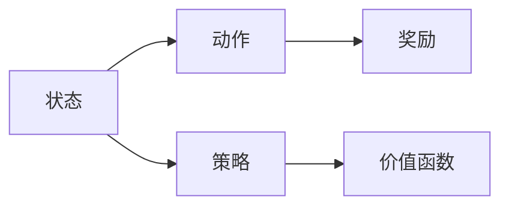
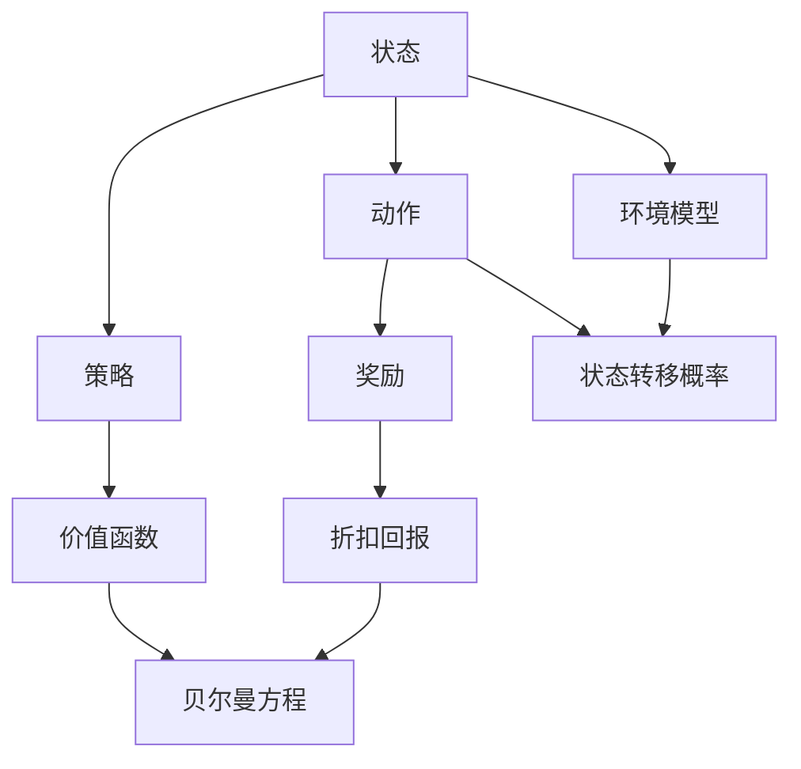

                 

## 1. 背景介绍

### 1.1 问题由来

强化学习（Reinforcement Learning, RL）作为一种机器学习技术，近年来在智能决策和控制问题上取得了显著进展。相较于传统的监督学习和无监督学习，强化学习通过试错机制，使智能体（agent）在复杂环境中学习到有效的策略。这种策略不需要显式的标签信息，而是通过智能体与环境的互动，逐步优化其行为。

强化学习的背景源于马尔可夫决策过程（Markov Decision Processes, MDPs）。在MDPs中，环境通过状态转移、奖励信号等与智能体交互，智能体需要根据当前状态，选择最优的动作，最大化长期奖励。该框架能够描述许多自然和社会的复杂决策过程，如机器人导航、游戏策略、经济系统等。

### 1.2 问题核心关键点

强化学习的核心在于通过试错机制优化智能体的策略。具体步骤如下：

1. **环境模型**：定义环境的状态空间和动作空间，构建状态转移概率和奖励模型。
2. **智能体**：定义智能体的策略函数，并选择合适的算法进行搜索优化。
3. **学习**：通过环境反馈，智能体不断调整策略，最大化累积奖励。
4. **评价**：评估策略的性能，并利用探索-利用平衡（exploration-exploitation trade-off）进行策略优化。

强化学习在智能决策领域的应用非常广泛，从机器人控制到自动驾驶，从游戏AI到金融预测，都展示了其强大的能力。但是，由于强化学习算法的复杂性和挑战性，其实际应用仍面临许多难题。

### 1.3 问题研究意义

研究强化学习算法，对于构建智能决策系统，提高机器的自主性和适应性，具有重要意义：

1. 提高决策质量：强化学习通过试错机制不断优化决策策略，能够在复杂环境中做出更优秀的决策。
2. 增强自主性：智能体能够在没有明确指令的情况下，自主探索和适应环境，提升系统的灵活性和鲁棒性。
3. 解决复杂问题：强化学习能够处理不确定性和动态变化的环境，应对复杂的优化和控制问题。
4. 应用前景广阔：强化学习在自动驾驶、机器人、游戏AI等领域有着广泛的应用前景，能够推动相关技术的产业化进程。
5. 技术创新：强化学习催生了如深度强化学习（Deep RL）、模型基强化学习（Model-Based RL）等前沿研究方向，拓展了机器学习研究的边界。

## 2. 核心概念与联系

### 2.1 核心概念概述

为了深入理解强化学习的核心思想和算法，本节将介绍几个关键概念：

- **状态（State）**：环境在某一时刻的状态，可以是连续值、离散值或组合状态。
- **动作（Action）**：智能体可以采取的行为，通常是一个动作空间，可以是离散的、连续的或混合的。
- **奖励（Reward）**：智能体在某一时刻执行动作后得到的反馈，通常是一个标量值，用于指导智能体的决策。
- **策略（Policy）**：智能体选择动作的概率分布，可以表示为条件概率$p(a_t|s_t)$，即在状态$s_t$下，采取动作$a_t$的概率。
- **价值函数（Value Function）**：估计状态或动作的价值，用于指导智能体的决策。

### 2.2 概念间的关系

强化学习的核心概念之间存在紧密联系，形成了完整的决策过程。这里以一个简单的智能体在环境中移动的例子来说明：



从上述流程图中可以看出，智能体根据当前状态选择动作，执行后得到奖励，并通过策略和价值函数指导下一次决策。这种反馈机制使得智能体逐步学习到最优策略。

### 2.3 核心概念的整体架构

强化学习的核心概念构成了完整的决策框架，包括以下几个主要部分：



这个综合流程图展示了从状态到动作的决策过程，以及价值函数的计算和环境模型的构建。状态转移概率、折扣回报和贝尔曼方程都是关键组成部分。

## 3. 核心算法原理 & 具体操作步骤
### 3.1 算法原理概述

强化学习的核心在于通过试错机制优化智能体的策略。其基本思想是：智能体在环境中执行动作，根据环境的反馈（奖励和状态转移），逐步优化其策略，最大化长期累积奖励。这一过程通常包含四个关键步骤：

1. **环境模拟**：定义环境的状态空间、动作空间、奖励函数等，构建环境模型。
2. **智能体选择**：定义智能体的策略函数，选择合适的算法进行策略搜索。
3. **策略评估**：通过价值函数和贝尔曼方程，评估策略的性能，并进行优化。
4. **学习更新**：通过环境反馈，智能体不断调整策略，更新模型参数，优化决策过程。

### 3.2 算法步骤详解

以下详细介绍强化学习的核心算法步骤：

#### 3.2.1 定义环境模型

环境模型是强化学习的核心，定义了环境的状态空间、动作空间、状态转移概率和奖励函数。以一个简单的推箱问题为例，状态$s_t$可以是位置$(x, y)$，动作$a_t$可以是向上、向下、向左或向右，奖励$r_t$可以是每次执行动作时的常数奖励。

#### 3.2.2 定义智能体策略

智能体的策略函数$p(a_t|s_t)$定义了在状态$s_t$下采取动作$a_t$的概率。常用的策略包括贪心策略、ε-贪心策略、softmax策略等。其中，softmax策略通过softmax函数将动作概率进行归一化，使得所有动作的概率之和为1。

#### 3.2.3 策略评估

策略评估通常通过价值函数$v(s_t)$或动作价值函数$Q(s_t, a_t)$进行。价值函数$v(s_t)$估计状态$s_t$的价值，动作价值函数$Q(s_t, a_t)$估计在状态$s_t$下采取动作$a_t$的价值。常用的价值函数有状态价值函数、动作价值函数、蒙特卡洛价值函数、时序差分（Temporal Difference, TD）价值函数等。

#### 3.2.4 学习更新

学习更新通过环境反馈，智能体不断调整策略，更新模型参数。常用的学习算法包括蒙特卡洛方法、时序差分方法、深度强化学习等。

- **蒙特卡洛方法**：通过多步遍历整个环境，计算状态价值函数或动作价值函数。
- **时序差分方法**：通过当前状态和动作，估计下一状态的价值，并根据折扣回报进行更新。
- **深度强化学习**：通过神经网络逼近策略函数或价值函数，提高模型的表示能力。

### 3.3 算法优缺点

强化学习具有以下优点：

1. **自适应能力强**：强化学习不需要显式的标签信息，能够通过环境反馈逐步优化策略，适应复杂环境。
2. **通用性强**：强化学习可以应用于各种决策问题，如机器人控制、游戏策略、金融预测等。
3. **效率高**：强化学习可以通过环境模拟进行离线训练，节省计算资源。

同时，强化学习也存在一些缺点：

1. **策略优化困难**：强化学习需要找到全局最优策略，通常面临多维度搜索空间和高维状态空间的挑战。
2. **样本效率低**：强化学习通常需要大量的环境样本进行训练，导致样本效率低。
3. **过拟合风险**：强化学习容易陷入局部最优解，需要进行探索与利用平衡。
4. **稳定性差**：强化学习的性能容易受到环境变化的影响，需要稳定性较高的算法。

### 3.4 算法应用领域

强化学习的应用领域非常广泛，涵盖了智能决策、控制优化、游戏AI、自动驾驶等多个方向。以下是几个典型的应用场景：

- **机器人控制**：通过强化学习，使机器人能够自主导航、抓取物体、执行复杂任务。
- **游戏AI**：通过强化学习，使游戏中的智能体能够学习到最优策略，击败人类对手。
- **自动驾驶**：通过强化学习，使自动驾驶汽车能够在复杂环境中做出安全、高效的决策。
- **金融预测**：通过强化学习，预测股票价格、交易策略，进行投资决策。
- **自然语言处理**：通过强化学习，训练语言模型，提高自然语言理解和生成能力。

## 4. 数学模型和公式 & 详细讲解 & 举例说明

### 4.1 数学模型构建

强化学习的数学模型通常建立在马尔可夫决策过程（MDPs）之上。MDPs由状态空间$\mathcal{S}$、动作空间$\mathcal{A}$、状态转移概率$p(s_{t+1}|s_t, a_t)$和奖励函数$r(s_t, a_t)$构成。

状态转移概率$p(s_{t+1}|s_t, a_t)$描述了在状态$s_t$下，采取动作$a_t$后，转移到状态$s_{t+1}$的概率。奖励函数$r(s_t, a_t)$描述了在状态$s_t$下，采取动作$a_t$后，获得的奖励。

### 4.2 公式推导过程

强化学习的核心在于通过试错机制优化策略。常用的算法包括蒙特卡洛方法、时序差分方法、深度强化学习等。以下以蒙特卡洛方法和时序差分方法为例，推导它们的数学公式。

#### 蒙特卡洛方法

蒙特卡洛方法通过多步遍历整个环境，计算状态价值函数或动作价值函数。以蒙特卡洛方法计算状态价值函数为例：

$$
v(s_t) = \frac{1}{n} \sum_{t'=t}^{t+n-1} r_{t'} + \gamma \sum_{t'=t+1}^{t+n-1} v(s_{t'})
$$

其中，$n$为遍历步数，$\gamma$为折扣因子。该公式的含义是，从状态$s_t$开始，沿着某一路径遍历环境，计算出该路径上的累积奖励和状态价值函数的加权和，作为状态价值函数$v(s_t)$的估计。

#### 时序差分方法

时序差分方法通过当前状态和动作，估计下一状态的价值，并根据折扣回报进行更新。以时序差分方法更新动作价值函数$Q(s_t, a_t)$为例：

$$
Q(s_t, a_t) = r_t + \gamma \max_{a_{t+1}} Q(s_{t+1}, a_{t+1})
$$

该公式的含义是，在状态$s_t$下采取动作$a_t$后，获得当前奖励$r_t$，并根据下一状态的最大动作价值$Q(s_{t+1}, a_{t+1})$，乘以折扣因子$\gamma$，得到状态动作价值$Q(s_t, a_t)$。

### 4.3 案例分析与讲解

以下以一个简单的推箱问题为例，展示强化学习的应用。

**问题描述**：在一个网格中，有一个推箱机人和一个箱子，目标是将箱子推到格子10。推箱机器人可以向上、向下、向左或向右移动。每次移动后，若箱子位置发生变化，则获得1个奖励，否则没有奖励。

**解法**：
1. **定义环境模型**：状态$s_t$可以是位置$(x, y)$，动作$a_t$可以是向上、向下、向左或向右，奖励$r_t$可以是每次执行动作时的常数奖励。
2. **定义智能体策略**：使用softmax策略，在每个状态$s_t$下，采取动作$a_t$的概率为$p(a_t|s_t) = \frac{exp(Q(s_t, a_t))}{\sum_{a'} exp(Q(s_t, a'))}$。
3. **策略评估**：使用蒙特卡洛方法或时序差分方法，计算状态价值函数或动作价值函数。
4. **学习更新**：根据状态价值函数或动作价值函数，选择最优动作，进行学习更新。

通过上述过程，推箱机器人能够逐步学习到最优策略，成功将箱子推到格子10。

## 5. 项目实践：代码实例和详细解释说明

### 5.1 开发环境搭建

要进行强化学习项目开发，需要安装相应的开发环境和工具。以下是常用的开发环境和工具：

1. **Python**：Python是强化学习的主要编程语言，安装Python 3.8及以上版本。
2. **PyTorch**：PyTorch是一个深度学习框架，支持动态计算图，适合强化学习模型的开发。
3. **OpenAI Gym**：OpenAI Gym是一个开源的环境库，包含多种常见的环境，用于测试和评估强化学习算法。
4. **Jupyter Notebook**：Jupyter Notebook是一个交互式编程环境，适合编写和运行强化学习算法。

### 5.2 源代码详细实现

以下展示一个简单的强化学习项目，使用PyTorch和OpenAI Gym库实现推箱问题。

**代码实现**：

```python
import gym
import torch
import torch.nn as nn
import torch.optim as optim
import numpy as np

# 定义环境
env = gym.make('FrozenLake-v1')

# 定义模型
class Policy(nn.Module):
    def __init__(self, state_size, action_size):
        super(Policy, self).__init__()
        self.fc1 = nn.Linear(state_size, 24)
        self.fc2 = nn.Linear(24, action_size)
        self.softmax = nn.Softmax(dim=1)

    def forward(self, x):
        x = torch.flatten(x, 1)
        x = self.fc1(x)
        x = self.fc2(x)
        return self.softmax(x)

# 定义策略
def select_action(state, model, epsilon):
    if np.random.rand() < epsilon:
        return env.action_space.sample()
    else:
        state = torch.tensor(state, dtype=torch.float32).unsqueeze(0)
        with torch.no_grad():
            action_probs = model(state)
        return np.argmax(action_probs[0])

# 训练模型
def train_model(model, optimizer, env, episodes, epsilon):
    for episode in range(episodes):
        state = env.reset()
        done = False
        total_reward = 0
        while not done:
            action = select_action(state, model, epsilon)
            next_state, reward, done, _ = env.step(action)
            total_reward += reward
            state = next_state
        print(f'Episode {episode+1}, Reward: {total_reward}')

    print(f'Total Reward: {total_reward}')
```

**代码解读**：

1. **定义环境**：使用OpenAI Gym库，定义一个Frozen Lake环境，其中状态空间为4个格子，动作空间为4个方向。
2. **定义模型**：定义一个神经网络模型，包含两个全连接层和一个softmax层，用于估计动作概率。
3. **定义策略**：定义策略函数，使用ε-贪心策略选择动作。
4. **训练模型**：通过OpenAI Gym库的train_model函数，训练模型在Frozen Lake环境上的表现。

### 5.3 代码解读与分析

上述代码展示了强化学习项目的基本实现过程。通过PyTorch和OpenAI Gym库，可以方便地构建环境、定义模型和策略，并进行训练。

**代码关键点**：
1. **环境定义**：使用OpenAI Gym库定义环境，设置状态空间、动作空间、奖励函数等。
2. **模型定义**：使用PyTorch定义神经网络模型，包含输入层、隐藏层和输出层。
3. **策略定义**：定义策略函数，使用ε-贪心策略选择动作。
4. **训练函数**：使用OpenAI Gym库的train_model函数，训练模型在环境上的表现。

## 6. 实际应用场景

### 6.1 智能机器人

强化学习在智能机器人控制中具有广泛应用。通过强化学习，机器人能够自主导航、抓取物体、执行复杂任务。例如，使用强化学习训练机器人学习避障、开门、拿起物品等操作，可以提高机器人的自主性和适应性。

### 6.2 游戏AI

游戏AI是强化学习的重要应用领域。通过强化学习，游戏中的智能体能够学习到最优策略，击败人类对手。例如，DeepMind的AlphaGo使用强化学习训练围棋AI，能够战胜顶尖人类棋手。

### 6.3 自动驾驶

自动驾驶是强化学习的另一重要应用。通过强化学习，自动驾驶汽车能够在复杂环境中做出安全、高效的决策。例如，Waymo的自动驾驶汽车使用强化学习训练车辆控制策略，能够在交通拥堵、天气恶劣等复杂场景下保持安全行驶。

### 6.4 金融预测

金融预测是强化学习在经济领域的应用。通过强化学习，预测股票价格、交易策略，进行投资决策。例如，AlphaSense使用强化学习预测股票价格走势，指导投资决策。

### 6.5 自然语言处理

自然语言处理是强化学习在NLP领域的应用。通过强化学习，训练语言模型，提高自然语言理解和生成能力。例如，Google的BERT模型使用强化学习方法进行预训练，获得了优异的NLP效果。

## 7. 工具和资源推荐

### 7.1 学习资源推荐

要深入学习强化学习，可以参考以下学习资源：

1. 《Reinforcement Learning: An Introduction》：Sutton和Barto的经典教材，全面介绍了强化学习的基本概念和算法。
2. 《Deep Reinforcement Learning with PyTorch》：Hendrycks的深度强化学习教程，详细介绍了使用PyTorch进行强化学习开发的方法。
3. Coursera上的Reinforcement Learning课程：由UC Berkeley教授开设，涵盖强化学习的理论基础和实际应用。
4. Udacity的Reinforcement Learning Nanodegree：提供系统化的强化学习学习路径，涵盖多种实际项目。

### 7.2 开发工具推荐

要高效开发强化学习项目，可以使用以下开发工具：

1. PyTorch：深度学习框架，支持动态计算图，适合强化学习模型的开发。
2. OpenAI Gym：开源的环境库，包含多种常见的环境，用于测试和评估强化学习算法。
3. Jupyter Notebook：交互式编程环境，适合编写和运行强化学习算法。
4. TensorBoard：可视化工具，实时监测模型训练状态，并提供丰富的图表呈现方式。

### 7.3 相关论文推荐

要跟踪强化学习的研究进展，可以参考以下论文：

1. "Reinforcement Learning" by Sutton and Barto：经典强化学习理论论文。
2. "Playing Atari with Deep Reinforcement Learning" by Mnih et al.：使用深度学习训练强化学习模型，实现玩Atari游戏的突破。
3. "Continuous Control with Deep Reinforcement Learning" by Mnih et al.：使用深度强化学习训练连续控制任务。
4. "Policy Distillation" by Arjovsky et al.：通过政策蒸馏提高强化学习模型的可解释性。

## 8. 总结：未来发展趋势与挑战

### 8.1 总结

本文对强化学习的基本概念和算法进行了详细介绍。首先，阐述了强化学习的背景和意义，明确了强化学习在智能决策和控制问题上的重要性。其次，从原理到实践，详细讲解了强化学习的基本步骤和数学模型，并给出了完整的代码实现。最后，探讨了强化学习的实际应用场景，并推荐了相关的学习资源和工具。

通过本文的系统梳理，可以看到，强化学习在智能决策领域的应用前景广阔，能够通过试错机制不断优化决策策略，适应复杂环境。但是，强化学习也面临着一些挑战，如策略优化困难、样本效率低、过拟合风险等。未来，需要不断探索和优化强化学习算法，提高其性能和稳定性。

### 8.2 未来发展趋势

展望未来，强化学习将呈现以下几个发展趋势：

1. **深度强化学习**：深度学习与强化学习的结合，将使得模型具有更强的表示能力和泛化能力，适用于更加复杂的决策问题。
2. **模型基强化学习**：通过构建环境模型，优化策略搜索过程，提高强化学习的效率和稳定性。
3. **多智能体强化学习**：多智能体系统能够解决更复杂、更丰富的决策问题，如社交机器人、分布式控制等。
4. **元强化学习**：元强化学习能够通过学习学习策略，适应不同环境，提升模型的通用性和适应性。
5. **强化学习与其它AI技术结合**：强化学习与自然语言处理、计算机视觉、知识表示等技术的结合，拓展了强化学习的应用场景。

以上趋势凸显了强化学习技术的广泛应用前景和潜力，为未来的智能决策和控制问题提供了新的解决方案。

### 8.3 面临的挑战

尽管强化学习在近年来取得了显著进展，但在实际应用中仍面临诸多挑战：

1. **策略优化困难**：强化学习需要找到全局最优策略，通常面临多维度搜索空间和高维状态空间的挑战。
2. **样本效率低**：强化学习通常需要大量的环境样本进行训练，导致样本效率低。
3. **过拟合风险**：强化学习容易陷入局部最优解，需要进行探索与利用平衡。
4. **稳定性差**：强化学习的性能容易受到环境变化的影响，需要稳定性较高的算法。

这些挑战需要在未来的研究中进一步解决，才能更好地推动强化学习技术的发展和应用。

### 8.4 研究展望

要应对上述挑战，未来的研究需要在以下几个方面进行探索：

1. **多维度搜索**：探索多维度搜索算法，提高策略优化的效率和效果。
2. **强化学习框架**：构建更高效的强化学习框架，支持大规模、高维环境的训练。
3. **探索与利用平衡**：通过改进算法设计，实现更好的探索与利用平衡，提高样本效率。
4. **模型基强化学习**：构建更准确的模型基强化学习算法，提高算法的稳定性和鲁棒性。
5. **可解释强化学习**：提高强化学习的可解释性，增强模型的可信度和安全性。

这些研究方向的探索，必将推动强化学习技术向更高效、更稳定、更可解释的方向发展，为构建更智能、更灵活的决策系统提供支持。

## 9. 附录：常见问题与解答

**Q1：强化学习与监督学习和无监督学习的区别是什么？**

A: 强化学习与监督学习和无监督学习的区别在于，强化学习通过环境反馈进行决策，不需要显式的标签信息。监督学习需要显式的标签信息进行训练，无监督学习则通过数据自发的统计特性进行学习。

**Q2：强化学习与深度学习的区别是什么？**

A: 强化学习与深度学习的区别在于，强化学习需要通过试错机制进行决策，而深度学习则是通过大量标签数据进行监督学习。强化学习通常用于控制、优化等需要实时决策的问题，深度学习则用于图像识别、语音识别等需要大量数据进行标注的问题。

**Q3：强化学习需要哪些步骤？**

A: 强化学习的核心步骤包括定义环境模型、定义智能体策略、策略评估、学习更新等。这些步骤通过不断优化策略，使得智能体逐步适应复杂环境，做出最优决策。

**Q4：强化学习有哪些常见的挑战？**

A: 强化学习的挑战包括策略优化困难、样本效率低、过拟合风险、稳定性差等。这些挑战需要通过多维度搜索、模型基强化学习、探索与利用平衡等技术进行克服。

**Q5：强化学习有哪些应用场景？**

A: 强化学习的应用场景包括智能机器人、游戏AI、自动驾驶、金融预测、自然语言处理等。这些领域需要复杂决策和实时响应，强化学习通过试错机制，能够逐步优化决策策略。

