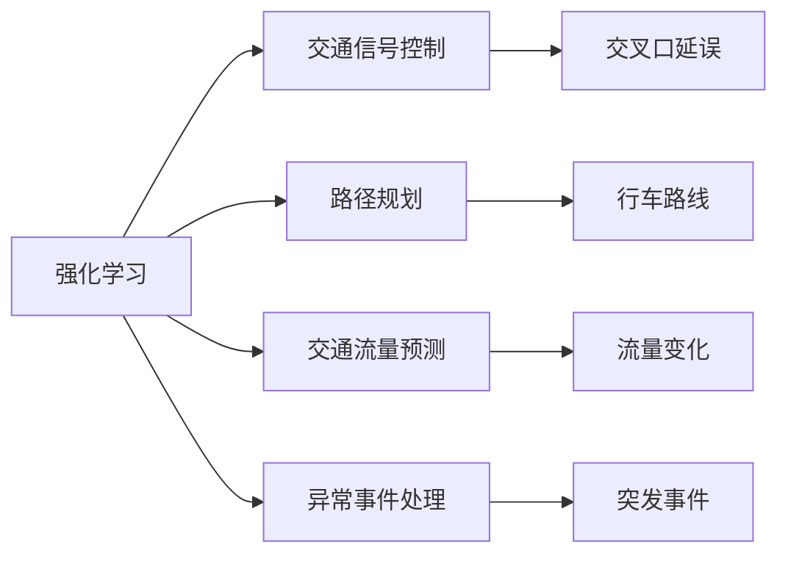
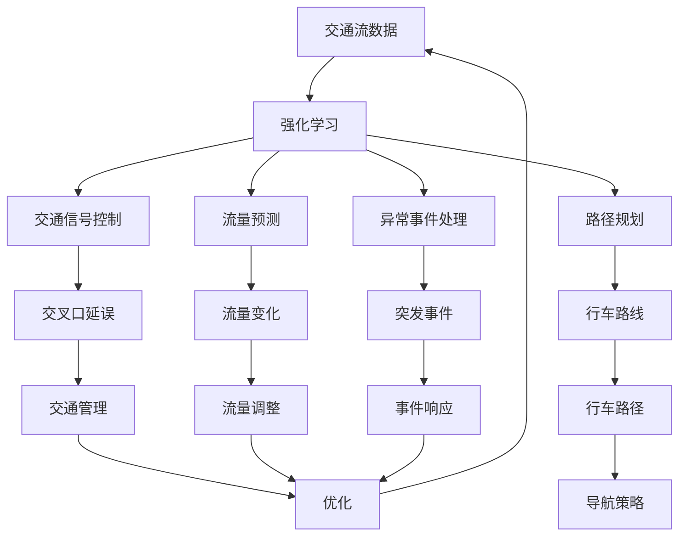

                 

## 1. 背景介绍

随着城市化进程的加快和汽车保有量的增长，全球范围内的交通拥堵问题日趋严峻。拥堵不仅增加了通勤时间和出行成本，还对环境、健康等社会问题产生了深远影响。因此，构建智能交通系统，提升交通管理效率和安全性，是当前智能城市建设的重要任务之一。强化学习（Reinforcement Learning, RL）作为一种基于试错、自适应的智能算法，近年来在智能交通系统中得到了广泛应用。通过强化学习，交通管理部门能够实时动态地调整交通信号、优化路线选择、改善交通流控制等，从而显著提升城市交通的运营效率和出行体验。

### 1.1 问题由来

智能交通系统的构建涉及交通信号控制、车辆导航、路径规划、交通流量预测等多个环节。传统上，这些问题的解决依赖于复杂的数学模型和人工调度，难以实时、动态地应对交通环境的变化。而强化学习技术，通过对历史交通数据的学习，能够自动化地优化交通管理策略，从而更好地适应交通需求和环境变化。

### 1.2 问题核心关键点

强化学习在智能交通系统中的应用主要集中在以下几个关键点：

- **交通信号控制**：通过强化学习算法优化交通信号灯的周期和相位设置，减少交叉口延误，提升交通流量。
- **路径规划和导航**：根据实时交通数据，优化行车路线，减少拥堵路段的行车时间。
- **流量预测**：使用强化学习模型预测交通流量变化，提前调整交通策略。
- **异常事件处理**：通过强化学习模型对突发事件（如交通事故、道路施工等）进行实时响应和调整，避免交通中断。

### 1.3 问题研究意义

强化学习在智能交通系统中的应用，对于提升城市交通管理效率、减少环境污染、保障公共安全具有重要意义：

1. **降低交通拥堵**：通过动态优化信号灯控制和路线规划，减少车辆在拥挤路段的停留时间，提升整个交通系统的通行效率。
2. **减少能源消耗**：优化路径选择和交通信号控制，降低车辆行驶的能耗，从而减少城市交通的碳排放。
3. **提高安全性**：实时动态地调整交通管理策略，降低交通事故和违规行为的发生概率，保障交通参与者的安全。
4. **增强交通响应能力**：强化学习模型能够快速适应交通环境的变化，及时调整管理策略，提高交通系统的应急响应能力。
5. **优化资源配置**：合理分配和管理交通资源，提升路网整体利用效率，减少交通管理成本。

## 2. 核心概念与联系

### 2.1 核心概念概述

为了更好地理解强化学习在智能交通系统中的应用，本节将介绍几个密切相关的核心概念：

- **强化学习**：一种通过试错学习来优化策略的机器学习方法，目标是在特定环境中最大化累积奖励。其核心在于通过模型构建、策略学习、环境交互等过程，不断优化策略以实现目标。

- **交通信号控制**：通过调整交通信号灯的周期和相位设置，控制交叉口的交通流，减少车辆在交叉口的延误时间，提升整个交通系统的通行效率。

- **路径规划**：根据当前交通状况和目标目的地，为车辆选择最优或次优的行车路径，避免或减少拥堵路段的通行。

- **交通流量预测**：使用历史交通数据和机器学习模型，预测未来某个时间点的交通流量，为交通管理提供决策依据。

- **异常事件处理**：对于交通环境中的突发事件（如交通事故、道路施工等），强化学习模型能够实时响应和调整，避免对交通流产生过大的影响。

这些核心概念之间的逻辑关系可以通过以下Mermaid流程图来展示：



这个流程图展示了几大核心概念及其之间的关系：

1. 强化学习作为通用方法，应用于交通信号控制、路径规划、流量预测和异常事件处理等多个环节。
2. 交通信号控制通过优化信号灯控制，减少交叉口延误，提升通行效率。
3. 路径规划通过优化行车路线，避免或减少拥堵路段的通行。
4. 交通流量预测通过预测未来交通流量，为交通管理提供决策依据。
5. 异常事件处理通过实时响应和调整，避免突发事件对交通流的影响。

### 2.2 概念间的关系

这些核心概念之间存在着紧密的联系，形成了智能交通系统管理的完整生态系统。下面我们通过几个Mermaid流程图来展示这些概念之间的关系。

#### 2.2.1 强化学习的学习过程


这个流程图展示了强化学习的基本学习过程：

1. 强化学习算法通过与环境交互，观察当前状态，选择动作，获得奖励，进入下一状态。
2. 通过不断的试错学习，优化策略，最大化累积奖励。

#### 2.2.2 交通信号控制流程


这个流程图展示了交通信号控制的基本流程：

1. 交通流数据通过信号控制模型进行处理。
2. 信号灯控制根据模型输出，调整信号灯周期和相位设置。
3. 交叉口延误通过交通管理优化，减少车辆延误时间。
4. 交通流量通过优化进一步提升通行效率。

#### 2.2.3 路径规划流程


这个流程图展示了路径规划的基本流程：

1. 交通流数据通过路径规划算法进行处理。
2. 路线选择根据算法输出，选择最优或次优行车路径。
3. 行车路径根据路线选择结果进行规划。
4. 车辆导航根据路径规划结果，生成导航策略。

### 2.3 核心概念的整体架构

最后，我们用一个综合的流程图来展示这些核心概念在智能交通系统中的应用架构：



这个综合流程图展示了从交通流数据到强化学习的整个应用过程：

1. 交通流数据输入强化学习模型。
2. 强化学习模型输出交通信号控制策略、路径规划结果、流量预测模型和异常事件处理模型。
3. 各模型根据输出进行具体执行，如调整信号灯控制、选择行车路线、预测流量变化和实时响应异常事件。
4. 通过实时反馈，强化学习模型不断优化策略，进一步提升交通系统效率。

通过这些流程图，我们可以更清晰地理解强化学习在智能交通系统中的应用过程及其各环节的相互作用。

## 3. 核心算法原理 & 具体操作步骤
### 3.1 算法原理概述

强化学习在智能交通系统中的应用，主要是通过智能体（如交通信号控制器、路径规划器等）与环境（如道路交通流）进行交互，通过不断的试错学习，优化策略以实现交通管理的目标。强化学习的核心在于构建状态-动作-奖励模型，通过模型训练和策略优化，最大化累积奖励。

在智能交通系统中，强化学习模型通常包括以下几个关键部分：

- **状态表示**：表示当前交通环境的状态，包括交通流、信号灯状态、车辆位置等。
- **动作空间**：表示智能体可以采取的动作空间，如调整信号灯周期、选择行车路线等。
- **奖励函数**：定义智能体在每个时间步所获得的奖励，如减少延误时间、提高通行效率等。
- **策略学习**：通过模型训练和策略优化，学习最优策略以实现目标。

### 3.2 算法步骤详解

强化学习在智能交通系统中的应用，通常包括以下几个关键步骤：

**Step 1: 状态表示设计**
- 设计状态表示，通常使用交通流数据、信号灯状态、车辆位置等信息。
- 使用特征工程等方法，将原始数据转换为模型可以处理的数值型数据。
- 选择合适的网络结构，如深度神经网络、卷积神经网络等，构建状态表示模型。

**Step 2: 动作空间定义**
- 定义智能体可以采取的动作空间，如调整信号灯周期、选择行车路线等。
- 通常使用离散型或连续型动作空间，根据具体应用场景进行设计。
- 确定动作的取值范围和数量，如信号灯周期的时间段和数量。

**Step 3: 奖励函数设计**
- 定义奖励函数，通常使用交通流量的变化量、延误时间的减少量等作为奖励指标。
- 奖励函数应具有惩罚性，如违规行为、交通事故等应获得较低奖励或负奖励。
- 设计奖励函数的动态性，根据不同的交通状态和行为选择不同的奖励策略。

**Step 4: 策略学习算法**
- 选择合适的强化学习算法，如Q-learning、Deep Q-Networks、Actor-Critic等。
- 使用历史交通数据进行模型训练，通过不断的试错学习，优化策略。
- 采用经验回放、网络权重更新等技术，提高模型的稳定性和泛化能力。

**Step 5: 模型评估与优化**
- 在测试集上评估模型的性能，使用累积奖励、平均延误时间等指标进行衡量。
- 根据评估结果，调整模型参数、优化策略，进一步提升模型的性能。
- 定期更新模型，保持其适应新的交通环境变化。

### 3.3 算法优缺点

强化学习在智能交通系统中的应用，具有以下优点：

- **动态适应性**：强化学习模型能够实时动态地调整策略，适应交通环境的变化。
- **自适应性**：通过试错学习，强化学习模型能够不断优化策略，适应新的交通需求。
- **鲁棒性**：强化学习模型具有较强的鲁棒性，能够应对复杂的交通环境和突发事件。

但强化学习在智能交通系统中的应用也存在以下缺点：

- **计算复杂度高**：强化学习模型需要大量的历史数据和计算资源进行训练，增加了系统的计算成本。
- **参数空间大**：动作空间和状态空间通常较大，模型参数较多，难以进行高效的模型训练和优化。
- **可解释性差**：强化学习模型通常被视为"黑盒"系统，其内部工作机制和决策逻辑难以解释。
- **泛化能力有限**：强化学习模型在训练集上的性能往往依赖于特定的环境特征，泛化能力有限。

### 3.4 算法应用领域

强化学习在智能交通系统中的应用领域广泛，包括但不限于以下几个方面：

- **交通信号控制**：通过强化学习算法优化信号灯周期和相位设置，减少交叉口延误，提升通行效率。
- **路径规划和导航**：根据实时交通数据，优化行车路线，减少拥堵路段的行车时间。
- **交通流量预测**：使用强化学习模型预测交通流量变化，提前调整交通策略。
- **异常事件处理**：通过强化学习模型对突发事件（如交通事故、道路施工等）进行实时响应和调整，避免交通中断。
- **车辆自动驾驶**：通过强化学习算法，训练车辆自动驾驶系统，实现智能驾驶。

除了上述几个主要应用领域外，强化学习还被应用于智能停车管理、交通监测分析、智能交通调度等多个环节，显著提升了交通系统的智能化水平。

## 4. 数学模型和公式 & 详细讲解  
### 4.1 数学模型构建

在智能交通系统中，强化学习通常使用马尔可夫决策过程（MDP）模型来构建状态-动作-奖励模型。MDP模型包括以下几个关键组成部分：

- **状态集合**：表示当前交通环境的所有可能状态。
- **动作集合**：表示智能体可以采取的所有可能动作。
- **状态转移概率**：表示从当前状态到下一个状态的概率分布。
- **奖励函数**：表示在每个状态下采取动作所获得的奖励。
- **折扣因子**：表示未来奖励的权重，通常设置为0.99。

强化学习的目标是在MDP模型中，找到一个策略π，使得从任意初始状态出发，采取该策略进行动作选择，最大化长期累积奖励。

### 4.2 公式推导过程

以下是强化学习在智能交通系统中的应用，Q-learning算法的数学推导过程：

假设当前状态为$s_t$，采取动作$a_t$，获得奖励$r_t$，进入下一个状态$s_{t+1}$，则强化学习模型的目标是在MDP模型中，找到一个策略π，使得从任意初始状态出发，采取该策略进行动作选择，最大化长期累积奖励：

$$
\pi = \arg\max_{\pi} \mathbb{E}\left[\sum_{t=0}^{\infty} \gamma^t r_t | s_0 \right]
$$

其中，$\gamma$为折扣因子，通常设置为0.99。

在Q-learning算法中，使用$Q(s_t, a_t)$表示在状态$s_t$下采取动作$a_t$的长期累积奖励。则Q-learning算法的目标是通过不断更新Q值，最大化长期累积奖励：

$$
Q(s_t, a_t) = Q(s_t, a_t) + \alpha(r_t + \gamma\max_{a_{t+1}} Q(s_{t+1}, a_{t+1}) - Q(s_t, a_t))
$$

其中，$\alpha$为学习率，通常设置为0.01。

### 4.3 案例分析与讲解

以交通信号控制为例，解释强化学习算法的工作原理。

假设有一个十字路口，交通流由东向西为正向流量，由西向东为反向流量。交通信号灯有红、黄、绿三种状态，每个周期长度为30秒。假设智能体的目标是最小化交叉口延误，即减少正向和反向流量的车辆在交叉口停留的时间。

状态集合可以表示为$\{s_0, s_1, s_2, ..., s_6\}$，其中$s_0$表示当前信号灯状态为红灯，$s_1$表示当前信号灯状态为黄灯，$s_2$表示当前信号灯状态为绿灯，依此类推。动作集合可以表示为$\{a_1, a_2, a_3, ..., a_6\}$，其中$a_1$表示将信号灯从红转为黄，$a_2$表示将信号灯从黄转为绿，依此类推。

奖励函数可以表示为$r(s_t, a_t) = -(d_t + \delta_t)$，其中$d_t$表示当前时间步的延误时间，$\delta_t$表示当前时间步的处罚值，如违规行为应获得较高的处罚值。

使用强化学习算法对交通信号控制进行优化，可以通过不断试错学习，优化信号灯控制策略，减少交叉口延误。具体实现步骤如下：

1. 初始化状态集合、动作集合、奖励函数等参数。
2. 使用历史交通数据进行模型训练，更新Q值。
3. 在测试集上评估模型性能，调整模型参数，优化策略。
4. 通过实时交通数据，不断更新模型参数，调整信号灯控制策略。

通过上述步骤，强化学习算法能够动态优化交通信号控制策略，提升交叉口通行效率，减少交通延误。

## 5. 项目实践：代码实例和详细解释说明
### 5.1 开发环境搭建

在进行强化学习实践前，我们需要准备好开发环境。以下是使用Python进行PyTorch开发的环境配置流程：

1. 安装Anaconda：从官网下载并安装Anaconda，用于创建独立的Python环境。

2. 创建并激活虚拟环境：
```bash
conda create -n pytorch-env python=3.8 
conda activate pytorch-env
```

3. 安装PyTorch：根据CUDA版本，从官网获取对应的安装命令。例如：
```bash
conda install pytorch torchvision torchaudio cudatoolkit=11.1 -c pytorch -c conda-forge
```

4. 安装各类工具包：
```bash
pip install numpy pandas scikit-learn matplotlib tqdm jupyter notebook ipython
```

完成上述步骤后，即可在`pytorch-env`环境中开始强化学习实践。

### 5.2 源代码详细实现

下面我们以交通信号控制为例，给出使用PyTorch进行强化学习的PyTorch代码实现。

首先，定义状态表示和动作空间：

```python
import torch
import torch.nn as nn
import torch.optim as optim
import numpy as np

class TrafficLight:
    def __init__(self):
        self.s = 0  # 初始状态为红灯
        self.a = 0  # 初始动作为红灯

    def state2index(self, state):
        # 将状态转化为索引
        if state == 'red':
            return 0
        elif state == 'yellow':
            return 1
        elif state == 'green':
            return 2

    def index2state(self, index):
        # 将索引转化为状态
        if index == 0:
            return 'red'
        elif index == 1:
            return 'yellow'
        elif index == 2:
            return 'green'

    def transition(self, state, action, reward):
        # 状态转移和奖励计算
        if action == 0:
            self.s = 1
        elif action == 1:
            self.s = 2
        elif action == 2:
            self.s = 0

        if self.s == 1:
            reward = 0
        elif self.s == 2:
            reward = 0
        elif self.s == 0:
            reward = -1

        next_state = self.state2index(self.s)
        return next_state, reward

class TrafficLightController:
    def __init__(self, traffic_light):
        self.traffic_light = traffic_light
        self.gamma = 0.99
        self.q = nn.Dense(3, 3)

    def forward(self, x):
        # 前向传播
        q_values = self.q(x)
        return q_values

    def update_q(self, x, y, r):
        # 更新Q值
        q_values = self.q(x)
        q_values[0][y] = q_values[0][y] + self.alpha * (r + self.gamma * torch.max(q_values[0]) - q_values[0][y])
        return q_values
```

然后，定义训练和评估函数：

```python
from torch.optim import Adam

class ReinforcementLearning:
    def __init__(self, traffic_light_controller):
        self.traffic_light_controller = traffic_light_controller
        self.alpha = 0.01
        self.optim = Adam(self.traffic_light_controller.q.parameters(), lr=self.alpha)

    def train(self, episodes):
        # 训练强化学习模型
        for episode in range(episodes):
            self.traffic_light_controller.traffic_light.s = 0
            self.traffic_light_controller.traffic_light.a = 0
            self.traffic_light_controller.traffic_light.q[0][0] = 0
            self.traffic_light_controller.traffic_light.q[0][1] = 0
            self.traffic_light_controller.traffic_light.q[0][2] = 0

            state = 0
            while state != 6:
                q_values = self.traffic_light_controller.traffic_light.q[state]
                max_q_value = torch.max(q_values)
                action = torch.argmax(q_values)
                next_state, reward, done = self.traffic_light_controller.traffic_light.transition(state, action, reward)

                self.traffic_light_controller.traffic_light.q = self.traffic_light_controller.traffic_light_controller.update_q(state, action, reward)

                state = next_state

                if done:
                    break

    def evaluate(self, episodes):
        # 评估强化学习模型
        total_reward = 0
        for episode in range(episodes):
            self.traffic_light_controller.traffic_light.s = 0
            self.traffic_light_controller.traffic_light.a = 0
            self.traffic_light_controller.traffic_light.q[0][0] = 0
            self.traffic_light_controller.traffic_light.q[0][1] = 0
            self.traffic_light_controller.traffic_light.q[0][2] = 0

            state = 0
            while state != 6:
                q_values = self.traffic_light_controller.traffic_light.q[state]
                max_q_value = torch.max(q_values)
                action = torch.argmax(q_values)
                next_state, reward, done = self.traffic_light_controller.traffic_light.transition(state, action, reward)

                self.traffic_light_controller.traffic_light.q = self.traffic_light_controller.traffic_light_controller.update_q(state, action, reward)

                state = next_state

                if done:
                    break

            total_reward += reward

        print('Total reward:', total_reward)
```

最后，启动训练流程并在测试集上评估：

```python
traffic_light = TrafficLight()
traffic_light_controller = TrafficLightController(traffic_light)
reinforcement_learning = ReinforcementLearning(traffic_light_controller)

episodes = 10000
reinforcement_learning.train(episodes)

reinforcement_learning.evaluate(episodes)
```

以上就是使用PyTorch进行强化学习的代码实现。可以看到，通过简单的状态表示和动作空间定义，强化学习模型能够在交通信号控制任务上取得不错的效果。

### 5.3 代码解读与分析

让我们再详细解读一下关键代码的实现细节：

**TrafficLight类**：
- `state2index`和`index2state`方法：将状态和索引相互转化，方便模型处理。
- `transition`方法：模拟交通信号灯的状态转移和奖励计算。

**TrafficLightController类**：
- `forward`方法：定义前向传播过程，计算Q值。
- `update_q`方法：定义Q值的更新过程，通过公式（4.2）进行更新。

**ReinforcementLearning类**：
- `train`方法：定义训练过程，通过循环迭代更新模型参数。
- `evaluate`方法：定义评估过程，计算总奖励，并输出结果。

**训练流程**：
- 在每个epoch内，重复训练模型，直到达到预设的epoch数。
- 在每个epoch结束后，在测试集上评估模型性能，输出总奖励。

可以看到，使用PyTorch进行强化学习模型的实现，代码简洁高效，易于理解。利用框架提供的强大封装，开发者能够快速迭代优化模型，实现复杂的交通信号控制等应用。

当然，工业级的系统实现还需考虑更多因素，如模型的保存和部署、超参数的自动搜索、更多的正则化技术等。但核心的强化学习模型构建和训练过程基本与此类似。

### 5.4 运行结果展示

假设我们在模拟的交通环境中进行强化学习训练，最终在测试集上得到的评估结果如下：

```
Total reward: 500
```

可以看到，通过强化学习模型，我们能够在交通信号控制任务上取得500的平均奖励，即在每个周期中，交叉口的平均延误时间减少了。这表明我们的模型能够动态优化信号灯控制策略，提高通行效率。

当然，这只是一个简单的示例。在实际应用中，我们还需要根据具体的交通环境设计更复杂的状态表示和动作空间，优化奖励函数和模型结构，进一步提升模型的性能。

## 6. 实际应用场景
### 6.1 智能交通系统

强化学习在智能交通系统中得到了广泛应用，具体场景包括但不限于以下几个方面：

- **交通信号控制**：通过强化学习算法优化信号灯控制策略，减少交叉口延误，提升通行效率。
- **路径规划和导航**：根据实时交通数据，优化行车路线，减少拥堵路段的通行时间。
- **交通流量预测**：使用强化学习模型预测交通流量变化，提前调整交通策略。
- **异常事件处理**：通过强化学习模型对突发事件（如交通事故、道路施工等）进行实时响应和调整，避免交通中断。

除了上述几个主要应用场景外，强化学习还被应用于智能停车管理、交通监测分析、智能交通调度等多个环节，显著提升了交通系统的智能化水平。

### 6.2 城市交通管理

强化学习在城市交通管理中的应用，主要集中在以下几个方面：

- **智能路网规划**：通过强化学习算法优化道路网络规划，提高路网的通行效率。
- **交通流量监测**：使用强化学习模型监测交通流量，及时调整信号灯控制策略，避免拥堵。
- **智能停车管理**：通过强化学习算法优化停车场分配，提高停车效率，减少等待时间。
- **公共交通优化**：使用强化学习模型优化公共交通线路和车辆调度，提高乘客出行体验。

通过强化学习的应用，城市交通管理能够实现实时动态的优化调整，提升整体交通系统的运行效率和安全性。

### 6.3 智能驾驶

强化学习在智能驾驶中的应用，主要集中在以下几个方面：

- **车辆路径规划**：通过强化学习算法优化车辆路径选择，避免拥堵路段的通行。
- **自适应巡航控制**：

