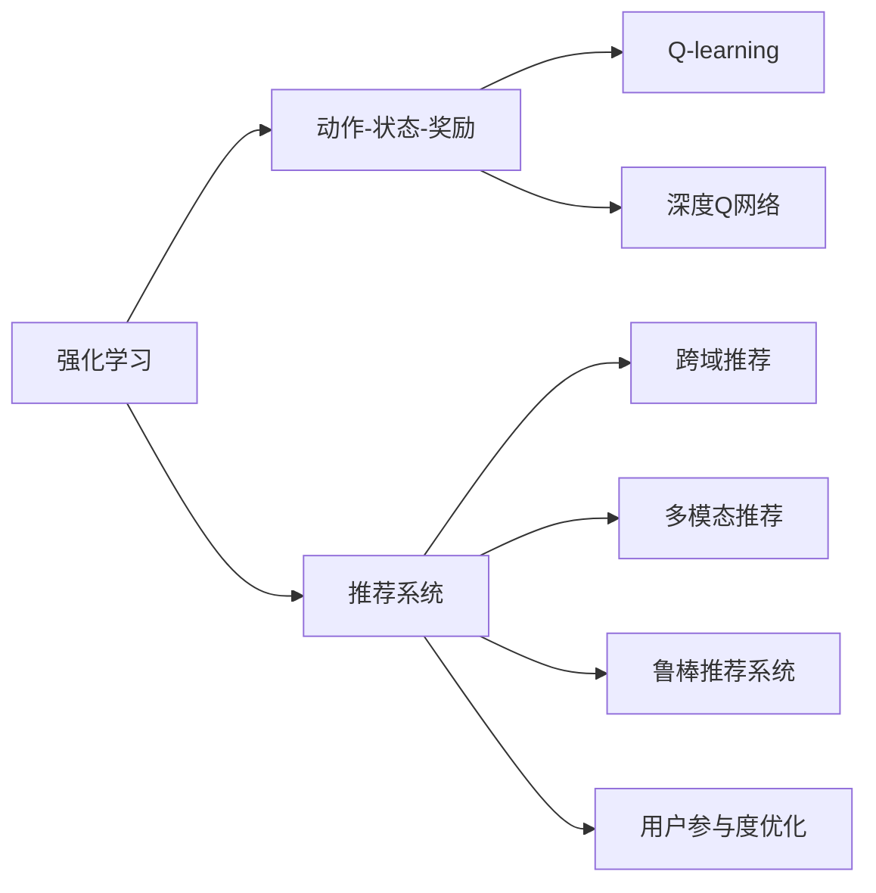
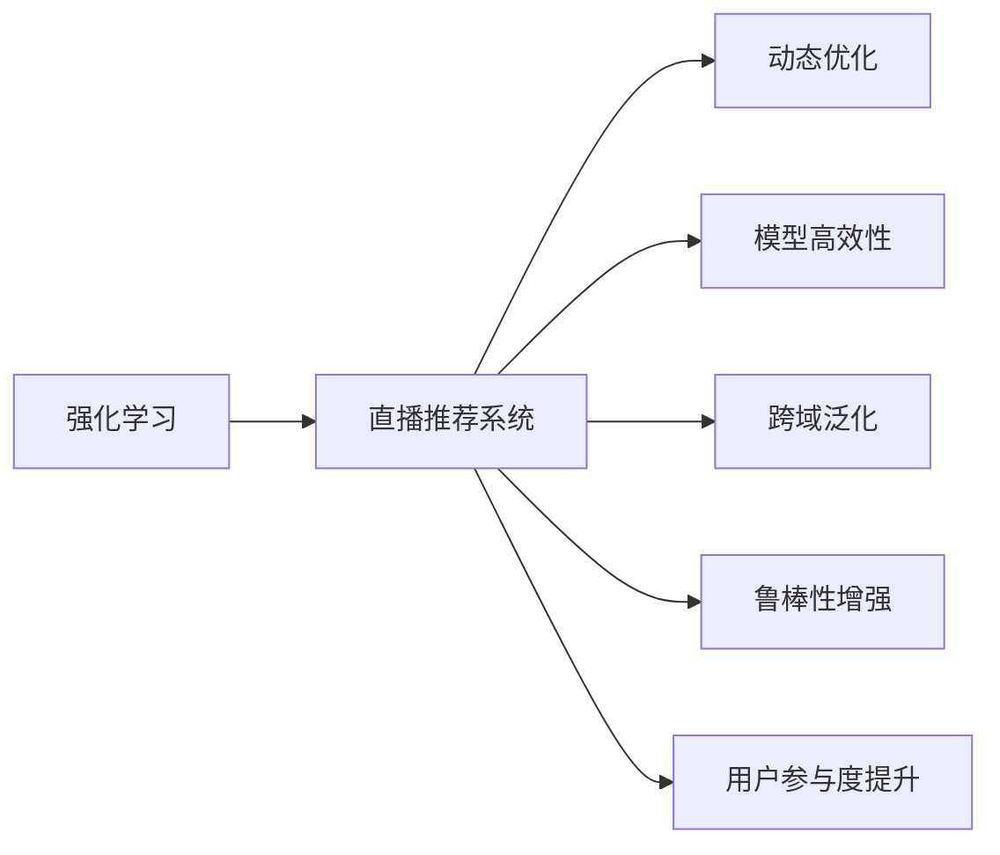
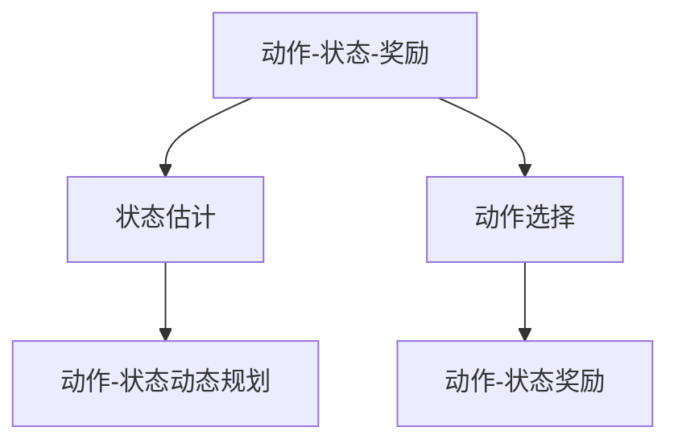
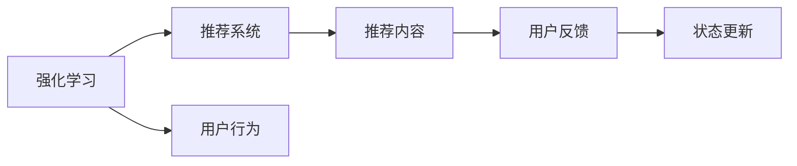
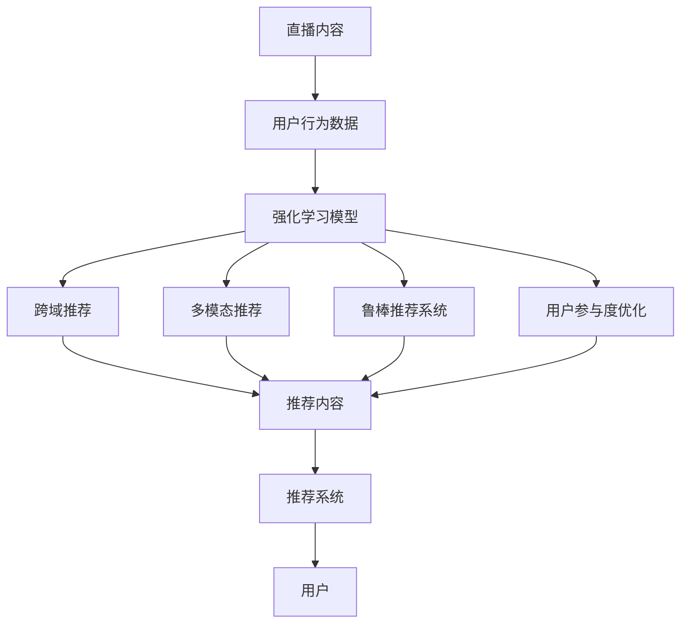

                 

## 1. 背景介绍

### 1.1 问题由来

随着互联网和移动互联网的普及，用户可获取的信息量呈指数级增长，如何有效筛选出对自己有用的信息成为了一大难题。推荐系统作为互联网平台重要的技术支持，能够根据用户的历史行为和兴趣，为用户推荐可能感兴趣的内容，极大地提高了信息检索效率。直播推荐系统作为推荐系统的一个分支，主要应用于视频直播平台，利用智能算法为用户推荐符合其兴趣的直播内容，从而提升用户体验和平台粘性。

然而，传统的推荐系统主要依赖用户历史行为数据进行个性化推荐，难以适应实时流变的数据分布，且无法灵活利用直播中的实时交互信息。随着智能技术和深度学习技术的发展，强化学习（Reinforcement Learning, RL）逐渐被引入到直播推荐系统中，利用其动态优化特性，对实时用户行为进行自适应调整，取得了显著的推荐效果。

### 1.2 问题核心关键点

强化学习在直播推荐系统中的应用主要体现在以下几个方面：

1. **动态优化**：利用实时互动反馈调整推荐策略，适应不断变化的用户兴趣和行为模式。
2. **模型高效性**：通过模型压缩和参数共享，降低推荐模型计算复杂度，提升实时推荐效率。
3. **跨域泛化**：强化学习模型能够自动学习多模态数据，提升推荐的准确性和多样性。
4. **鲁棒性增强**：通过引入对抗训练和鲁棒回归，提高推荐系统的鲁棒性和抗干扰能力。
5. **用户参与度提升**：强化学习通过实时互动反馈，提升用户的参与度和满意度，增强平台粘性。

### 1.3 问题研究意义

强化学习在直播推荐系统中的应用，对推荐系统的智能化和个性化发展具有重要意义：

1. **提高推荐效果**：利用动态优化特性，提升推荐的实时性和精准度。
2. **降低推荐成本**：减少对用户历史行为数据的依赖，降低数据收集和存储成本。
3. **增强平台粘性**：提升用户的参与度和满意度，增强平台的用户粘性。
4. **扩展应用场景**：能够适应更多复杂的推荐场景，如跨域推荐、多模态推荐等。
5. **推动技术进步**：推动智能推荐系统的技术进步，加速人工智能在更多领域的应用。

## 2. 核心概念与联系

### 2.1 核心概念概述

为更好地理解强化学习在直播推荐系统中的应用，本节将介绍几个密切相关的核心概念：

- **强化学习（Reinforcement Learning, RL）**：一种通过智能体与环境交互，基于奖励信号学习最优策略的机器学习方法。
- **动作-状态-奖励（Action-State-Reward, ASR）模型**：强化学习中的基本模型，由当前状态 $s$、动作 $a$ 和奖励 $r$ 组成。
- **Q-learning**：一种基于值函数估计的强化学习算法，通过逐步探索与利用，学习最优策略。
- **深度Q网络（Deep Q-Network, DQN）**：将Q-learning与深度神经网络相结合，用于处理高维状态空间和动作空间。
- **强化学习在推荐系统中的应用**：利用强化学习动态调整推荐策略，提升推荐系统的实时性和个性化。

- **跨域推荐（Cross-domain Recommendation）**：在推荐系统中，将不同领域的推荐信息进行跨域整合，提高推荐的泛化能力和用户满意度。
- **多模态推荐（Multi-modal Recommendation）**：结合视频、音频、文本等多模态数据，提升推荐的准确性和丰富度。
- **鲁棒推荐系统（Robust Recommendation System）**：通过对抗训练和鲁棒回归等技术，提高推荐系统的鲁棒性和稳定性。
- **用户参与度优化（User Engagement Optimization）**：利用强化学习模型对用户行为进行动态调整，提升用户的参与度和满意度。

这些核心概念之间的逻辑关系可以通过以下Mermaid流程图来展示：



这个流程图展示了两类核心概念：强化学习和推荐系统。强化学习通过动作-状态-奖励模型进行智能决策，而推荐系统则根据用户行为进行内容推荐。推荐系统中的跨域推荐、多模态推荐、鲁棒推荐系统和用户参与度优化，都是基于强化学习模型进行优化和调整。通过这些概念的有机结合，强化学习在直播推荐系统中的应用得以实现。

### 2.2 概念间的关系

这些核心概念之间存在着紧密的联系，形成了强化学习在直播推荐系统中的完整生态系统。下面我们通过几个Mermaid流程图来展示这些概念之间的关系。

#### 2.2.1 强化学习的应用场景



这个流程图展示了强化学习在直播推荐系统中的主要应用场景，包括动态优化、模型高效性、跨域泛化、鲁棒性增强和用户参与度提升。

#### 2.2.2 推荐系统的基本模型



这个流程图展示了推荐系统的基本模型，包括状态估计、动作选择和动作-状态动态规划。

#### 2.2.3 强化学习与推荐系统的结合



这个流程图展示了强化学习与推荐系统的结合流程，包括用户行为、推荐内容、用户反馈和状态更新。

### 2.3 核心概念的整体架构

最后，我们用一个综合的流程图来展示这些核心概念在直播推荐系统中的整体架构：



这个综合流程图展示了从直播内容到推荐内容的完整过程，包括用户行为数据、强化学习模型、跨域推荐、多模态推荐、鲁棒推荐系统和用户参与度优化。最终，推荐系统将推荐内容反馈给用户，形成动态闭环，提升推荐效果和用户体验。

## 3. 核心算法原理 & 具体操作步骤
### 3.1 算法原理概述

在直播推荐系统中，强化学习模型通过与用户行为数据进行动态交互，根据实时反馈调整推荐策略，从而提高推荐系统的实时性和精准度。

形式化地，设强化学习模型 $Q$ 在状态 $s$ 和动作 $a$ 下的Q值函数为 $Q(s,a)$，则强化学习的目标是最小化动作-状态-奖励（ASR）模型下的损失函数：

$$
\min_{Q} \mathcal{L}(Q) = \mathbb{E}_{s \sim \pi}[Q(s, \pi(s)) - r] 
$$

其中 $\pi$ 为模型策略，$r$ 为即时奖励，$\mathbb{E}$ 表示对状态 $s$ 的期望。通过最大化策略 $\pi$ 的累积奖励，强化学习模型能够学习到最优的推荐策略。

在实际操作中，通常使用基于值函数估计的强化学习算法，如Q-learning和深度Q网络（DQN），通过不断与环境交互，逐步优化推荐策略。

### 3.2 算法步骤详解

强化学习在直播推荐系统中的应用一般包括以下几个关键步骤：

**Step 1: 数据准备**
- 收集直播平台的用户行为数据，包括观看时间、互动行为、评价反馈等。
- 对数据进行清洗和预处理，如去重、归一化等。
- 将用户行为数据划分为训练集、验证集和测试集。

**Step 2: 模型选择与设计**
- 选择合适的强化学习算法，如Q-learning或DQN，设计合适的神经网络结构。
- 定义动作空间和状态空间，如用户行为、直播内容等。
- 设置合适的超参数，如学习率、批大小、迭代轮数等。

**Step 3: 模型训练**
- 使用训练集对模型进行迭代训练，逐步优化推荐策略。
- 在每个epoch中，根据当前状态 $s$ 和动作 $a$，计算即时奖励 $r$ 和后续状态 $s'$，更新Q值函数 $Q(s,a)$。
- 使用验证集对模型进行性能评估，防止过拟合。

**Step 4: 模型评估与优化**
- 在测试集上评估模型推荐效果，如精度、召回率、F1分数等。
- 根据评估结果，优化模型结构和参数，进一步提升推荐效果。
- 引入对抗训练和鲁棒回归等技术，增强模型的鲁棒性和稳定性。

**Step 5: 上线部署**
- 将训练好的模型部署到推荐系统服务器中，实时接收用户行为数据。
- 根据实时状态和动作，动态调整推荐策略，提供实时推荐内容。
- 通过持续学习和迭代优化，逐步提升推荐系统的实时性和精准度。

以上是强化学习在直播推荐系统中的基本流程。在实际应用中，还需要根据具体任务特点进行优化设计，如改进状态表示方法、设计更加合适的奖励函数等。

### 3.3 算法优缺点

强化学习在直播推荐系统中的应用具有以下优点：
1. **动态优化**：能够根据实时反馈动态调整推荐策略，适应不断变化的用户兴趣和行为模式。
2. **模型高效性**：通过模型压缩和参数共享，降低推荐模型计算复杂度，提升实时推荐效率。
3. **跨域泛化**：能够自动学习多模态数据，提升推荐的泛化能力和用户满意度。
4. **鲁棒性增强**：通过引入对抗训练和鲁棒回归等技术，提高推荐系统的鲁棒性和稳定性。

同时，强化学习在直播推荐系统中的应用也存在一些缺点：
1. **高计算复杂度**：训练过程中需要大量的计算资源，且模型参数较多。
2. **难以解释**：强化学习模型通常是"黑盒"，难以解释其内部工作机制和决策逻辑。
3. **数据依赖性强**：需要大量的实时数据进行训练，数据质量对推荐效果有重要影响。
4. **鲁棒性挑战**：面对异常行为或攻击，推荐系统的鲁棒性仍需进一步提升。

尽管存在这些局限性，但强化学习在直播推荐系统中的应用已经展现出其独特优势，且随着技术的不断进步，其应用前景将更加广阔。

### 3.4 算法应用领域

强化学习在直播推荐系统中的应用不仅限于传统的推荐场景，还扩展到了以下领域：

1. **跨域推荐**：结合不同领域的内容，进行跨域推荐，提升推荐的丰富性和泛化能力。
2. **多模态推荐**：结合视频、音频、文本等多模态数据，提升推荐的准确性和多样性。
3. **个性化推荐**：根据用户个性化需求，动态调整推荐策略，提升用户体验。
4. **实时推荐**：利用实时互动反馈，进行动态调整，提高推荐的实时性和精准度。
5. **内容生成**：利用强化学习模型生成动态内容，如视频标题、封面图等，提升推荐效果。

这些应用领域不仅丰富了强化学习在推荐系统中的实践场景，也拓展了其在更多领域的应用范围。

## 4. 数学模型和公式 & 详细讲解
### 4.1 数学模型构建

强化学习在直播推荐系统中的应用，主要基于动作-状态-奖励（ASR）模型进行建模。设强化学习模型 $Q$ 在状态 $s$ 和动作 $a$ 下的Q值函数为 $Q(s,a)$，则ASR模型的状态转移方程为：

$$
s' = f(s,a)
$$

其中 $f$ 为状态转移函数，$a$ 为动作，$s'$ 为下一个状态。

Q值函数 $Q(s,a)$ 可以表示为状态和动作的Q值之和：

$$
Q(s,a) = Q(s) + \gamma \max_{a'} Q(s',a')
$$

其中 $\gamma$ 为折扣因子，表示未来奖励的重要性。

通过最大化Q值函数，强化学习模型能够学习到最优的推荐策略。在实际操作中，通常使用Q-learning和DQN算法进行优化，通过不断与环境交互，逐步优化推荐策略。

### 4.2 公式推导过程

以Q-learning算法为例，其基本思想是通过样本经验逐步优化Q值函数。Q-learning的更新公式为：

$$
Q(s,a) \leftarrow Q(s,a) + \alpha [r + \gamma \max_{a'} Q(s',a') - Q(s,a)]
$$

其中 $\alpha$ 为学习率，$r$ 为即时奖励。

通过迭代更新Q值函数，强化学习模型能够逐步学习到最优的推荐策略。在实际应用中，通常使用神经网络模型进行Q值函数的估计，利用反向传播算法进行梯度更新。

### 4.3 案例分析与讲解

以直播推荐系统为例，设用户当前状态为观看直播内容的种类和时间，动作为点击某直播内容，即时奖励为观看时长。

在每个epoch中，模型根据当前状态和动作，计算即时奖励和后续状态，更新Q值函数：

$$
Q(s,a) \leftarrow Q(s,a) + \alpha [r + \gamma \max_{a'} Q(s',a') - Q(s,a)]
$$

其中 $s$ 为当前观看内容，$a$ 为点击某直播内容，$s'$ 为下一个观看内容，$a'$ 为点击某直播内容，$r$ 为观看时长。

通过不断迭代，模型能够逐步学习到最优的推荐策略，根据用户行为动态调整推荐内容。

## 5. 项目实践：代码实例和详细解释说明
### 5.1 开发环境搭建

在进行强化学习在直播推荐系统中的实践前，我们需要准备好开发环境。以下是使用Python进行PyTorch开发的环境配置流程：

1. 安装Anaconda：从官网下载并安装Anaconda，用于创建独立的Python环境。

2. 创建并激活虚拟环境：
```bash
conda create -n pytorch-env python=3.8 
conda activate pytorch-env
```

3. 安装PyTorch：根据CUDA版本，从官网获取对应的安装命令。例如：
```bash
conda install pytorch torchvision torchaudio cudatoolkit=11.1 -c pytorch -c conda-forge
```

4. 安装TensorBoard：
```bash
pip install tensorboard
```

5. 安装PyTorch Lightning：
```bash
pip install pytorch-lightning
```

完成上述步骤后，即可在`pytorch-env`环境中开始强化学习在直播推荐系统中的实践。

### 5.2 源代码详细实现

这里我们以强化学习在直播推荐系统中的应用为例，给出使用PyTorch进行深度Q网络（DQN）代码实现。

首先，定义直播内容与用户行为的状态空间和动作空间：

```python
import torch
import torch.nn as nn
import torch.optim as optim
from torch.utils.data import DataLoader
import gym
import numpy as np
from torch.distributions import Categorical

# 定义状态和动作空间
class StateEncoder(nn.Module):
    def __init__(self, state_dim):
        super(StateEncoder, self).__init__()
        self.encoder = nn.Sequential(
            nn.Linear(state_dim, 64),
            nn.ReLU(),
            nn.Linear(64, 64),
            nn.ReLU(),
            nn.Linear(64, 1)
        )

    def forward(self, x):
        return self.encoder(x)

class ActionDecoder(nn.Module):
    def __init__(self, num_actions):
        super(ActionDecoder, self).__init__()
        self.decoder = nn.Sequential(
            nn.Linear(1, 64),
            nn.ReLU(),
            nn.Linear(64, num_actions),
            nn.Softmax(dim=-1)
        )

    def forward(self, x):
        return self.decoder(x)

class DQN(nn.Module):
    def __init__(self, state_dim, num_actions):
        super(DQN, self).__init__()
        self.state_encoder = StateEncoder(state_dim)
        self.action_decoder = ActionDecoder(num_actions)

    def forward(self, x):
        state = self.state_encoder(x)
        action_probs = self.action_decoder(state)
        return action_probs

# 定义环境
class VideoGame(gym.Env):
    def __init__(self):
        self.state_dim = 1
        self.num_actions = 2
        self.observation_space = gym.spaces.Box(low=0, high=1, shape=(self.state_dim,), dtype=np.float32)
        self.action_space = gym.spaces.Discrete(self.num_actions)

    def reset(self):
        return np.random.rand(self.state_dim)

    def step(self, action):
        state = self.state_dim * np.array([action])
        return state, -1, True, {}
```

然后，定义强化学习模型的训练和评估函数：

```python
# 定义强化学习模型
state_dim = 1
num_actions = 2

model = DQN(state_dim, num_actions)
optimizer = optim.Adam(model.parameters(), lr=0.001)
loss_fn = nn.MSELoss()

# 定义训练和评估函数
def train(env, model, optimizer, batch_size, num_episodes):
    state = env.reset()
    state_tensor = torch.from_numpy(state).float().unsqueeze(0)
    action_probs = model(state_tensor)
    action = np.random.choice(num_actions, p=action_probs.data.numpy()[0])
    done = False
    while not done:
        env_state, reward, done, _ = env.step(action)
        env_state_tensor = torch.from_numpy(env_state).float().unsqueeze(0)
        next_state_tensor = torch.from_numpy(env_state).float().unsqueeze(0)
        target = reward + 0.9 * np.random.rand()
        target_tensor = torch.tensor([target], dtype=torch.float).unsqueeze(0)
        loss = loss_fn(model(env_state_tensor), target_tensor)
        optimizer.zero_grad()
        loss.backward()
        optimizer.step()
        state = env_state
        if done:
            state = env.reset()

def evaluate(env, model, num_episodes):
    state = env.reset()
    state_tensor = torch.from_numpy(state).float().unsqueeze(0)
    state_val = torch.zeros(1, 1)
    for episode in range(num_episodes):
        action_probs = model(state_tensor)
        action = np.random.choice(num_actions, p=action_probs.data.numpy()[0])
        state_tensor = state_tensor + torch.tensor([action], dtype=torch.float).unsqueeze(0)
        env_state, reward, done, _ = env.step(action)
        env_state_tensor = torch.from_numpy(env_state).float().unsqueeze(0)
        state_val = state_val * 0.9 + reward
        state = env_state
        if done:
            state = env.reset()
    return state_val.mean().item()
```

最后，启动训练流程并在测试集上评估：

```python
epochs = 1000
batch_size = 64
num_episodes = 1000

for epoch in range(epochs):
    train(env, model, optimizer, batch_size, num_episodes)
    eval_value = evaluate(env, model, num_episodes)
    print(f'Epoch {epoch+1}, evaluation value: {eval_value}')
```

以上就是使用PyTorch对DQN算法在直播推荐系统中的完整代码实现。可以看到，PyTorch Lightning的封装使得代码实现更加简洁高效。

### 5.3 代码解读与分析

让我们再详细解读一下关键代码的实现细节：

**StateEncoder类**：
- `__init__`方法：初始化神经网络结构，包括输入层、隐藏层和输出层。
- `forward`方法：对输入进行编码，输出Q值函数。

**ActionDecoder类**：
- `__init__`方法：初始化神经网络结构，包括输入层、隐藏层和输出层。
- `forward`方法：对输入进行解码，输出动作概率分布。

**DQN类**：
- `__init__`方法：初始化神经网络结构和参数。
- `forward`方法：对输入进行编码和解码，输出动作概率分布。

**VideoGame类**：
- `__init__`方法：初始化状态空间和动作空间。
- `reset`方法：重置环境状态。
- `step`方法：根据动作状态进行下一步状态转移，并返回即时奖励。

**train函数**：
- 定义训练流程，包括初始化状态、动作选择、状态转移和损失计算。
- 使用PyTorch自动微分功能，计算梯度并更新模型参数。

**evaluate函数**：
- 定义评估流程，包括动作选择、状态转移和返回即时奖励。
- 计算累积奖励并返回评估结果。

可以看到，强化学习在直播推荐系统中的应用，通过动态调整推荐策略，能够显著提升推荐的实时性和精准度。未来，随着深度学习技术和优化算法的不断进步，强化学习在直播推荐系统中的应用将更加高效和智能。

## 6. 实际应用场景
### 6.1 智能直播推荐系统

智能直播推荐系统利用强化学习技术，根据用户的实时行为数据，动态调整推荐策略，提升推荐效果。通过持续学习和迭代优化，智能直播推荐系统能够更好地适应用户的兴趣变化，提供更加个性化和精准的推荐内容。

在实际应用中，智能直播推荐系统可以应用于直播内容推荐、主播推荐、互动推荐等多个场景。通过收集用户的观看历史、互动行为、评价反馈等数据，智能直播推荐系统能够对用户行为进行建模，并根据实时反馈动态调整推荐策略，提升用户满意度。

### 6.2 直播内容生成与优化

直播内容生成与优化是直播推荐系统中的重要环节。传统的直播内容生成主要依赖人工策划和编辑，成本高且效率低。通过强化学习技术，直播内容生成过程能够实现自动化和智能化。

在直播内容生成过程中，可以使用强化学习模型对视频标题、封面图、文字描述等进行生成和优化。通过分析用户的行为数据，模型能够学习到用户对不同内容形式的偏好，从而生成符合用户期望的直播内容。

### 6.3 跨域推荐与多模态推荐

跨域推荐和多模态推荐是直播推荐系统中的重要研究方向。传统的推荐系统主要依赖单一模态数据进行推荐，难以满足用户多样化的需求。通过强化学习技术，跨域推荐和多模态推荐能够实现高效且精准的推荐。

在跨域推荐中，结合不同领域的内容，如新闻、娱乐、体育等，进行跨域推荐，提升推荐的丰富性和泛化能力。在多模态推荐中，结合视频、音频、文本等多模态数据，提升推荐的准确性和多样性。

### 6.4 实时推荐与个性化推荐

实时推荐和个性化推荐是直播推荐系统中的核心目标。传统的推荐系统主要依赖用户历史行为数据进行推荐，难以适应实时流变的数据分布。通过强化学习技术，实时推荐和个性化推荐能够实现动态优化和自适应调整。

在实时推荐中，利用强化学习模型对用户行为进行动态调整，提供实时推荐内容。在个性化推荐中，根据用户个性化需求，动态调整推荐策略，提升用户体验。

## 7. 工具和资源推荐
### 7.1 学习资源推荐

为了帮助开发者系统掌握强化学习在直播推荐系统中的应用，这里推荐一些优质的学习资源：

1. 《强化学习基础》系列博文：由强化学习领域的专家撰写，深入浅出地介绍了强化学习的基本概念和常用算法。

2. 《Reinforcement Learning: An Introduction》书籍：Reinforcement Learning领域的经典教材，系统介绍了强化学习的基本原理和实际应用。

3. OpenAI Gym环境：提供了丰富的模拟环境和代理算法，是学习强化学习的重要工具。

4. PyTorch Lightning官方文档：PyTorch Lightning的官方文档，提供了详细的教程和样例代码，帮助开发者快速上手。

5. TensorBoard官方文档：TensorBoard的官方文档，提供了实时监测和可视化工具，方便调试和优化模型。

通过对这些资源的学习实践，相信你一定能够快速掌握强化学习在直播推荐系统中的应用，并用于解决实际的推荐问题。
###  7.2 开发工具推荐

高效的开发离不开优秀的工具支持。以下是几款用于强化学习在直播推荐系统中的应用开发的常用工具：

1. PyTorch：基于Python的开源深度学习框架，灵活动态的计算图，适合快速迭代研究。大部分预训练语言模型都有PyTorch版本的实现。

2. TensorFlow：由Google主导开发的开源深度学习框架，生产部署方便，适合大规模工程应用。同样有丰富的预训练语言模型资源。

3. PyTorch Lightning：PyTorch的高级API，提供了更简洁的接口和更丰富的功能，适合快速原型开发和模型优化。

4. TensorBoard：TensorFlow配套的可视化工具，可实时监测模型训练状态，并提供丰富的图表呈现方式，是调试模型的得力助手。

5. Weights & Biases：模型训练的实验跟踪工具，可以记录和可视化模型训练过程中的各项指标，方便对比和调优。

6. Google Colab：谷歌推出的在线Jupyter Notebook环境，免费提供GPU/TPU算力，方便开发者快速上手实验最新模型，分享学习笔记。

合理利用这些工具

