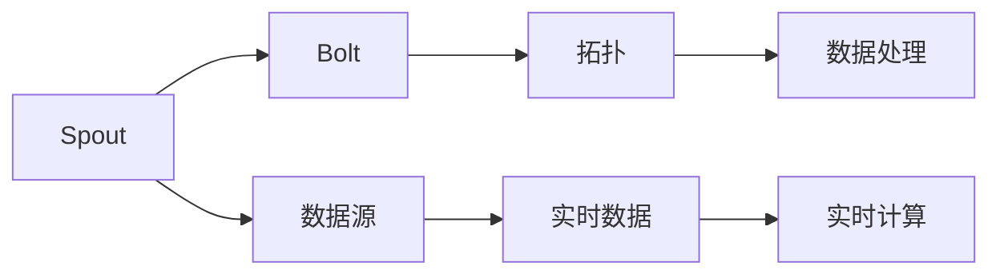

                 

# Storm原理与代码实例讲解

> 关键词：Storm,分布式计算,可靠性,实时处理,流处理,Spout,Bolt,拓扑

## 1. 背景介绍

### 1.1 问题由来
Storm是一种开源的分布式实时计算系统，可以高效地处理流数据。它采用微服务的架构，能够提供高吞吐量、低延迟的流处理能力，适用于各种大规模数据流的处理场景。Storm的核心思想是拓扑(Topology)，通过简单的Spout和Bolt模块，可以灵活地搭建出各种复杂的计算逻辑，满足不同的实时处理需求。

在互联网时代，数据的产生速度和规模呈指数级增长，传统的批处理系统无法满足实时数据处理的需求。Storm通过分布式计算框架，能够实现数据流的实时处理和计算，极大地提高了数据处理的效率和精度。

### 1.2 问题核心关键点
Storm系统由Spout、Bolt、拓扑(Topology)三部分组成：
- **Spout**：数据源，负责产生数据的流，可以是HDFS、Kafka、RabbitMQ等。
- **Bolt**：数据处理模块，负责对Spout产生的流数据进行各种复杂计算和逻辑处理。
- **拓扑(Topology)**：Spout和Bolt的组合，是一个流处理逻辑的描述，可以由多个Spout和Bolt模块组成。

Storm的微服务架构使得系统可以高度扩展，动态调整计算节点，应对数据流量的波动。同时，Storm还提供了可靠的消息传递机制和故障恢复机制，保障了数据处理的正确性和稳定性。

### 1.3 问题研究意义
研究Storm系统原理和代码实现，对于构建高效、可靠、可扩展的分布式流处理系统具有重要意义：

1. **高效处理**：Storm能够高效地处理实时流数据，适用于日志分析、实时统计、实时推荐等场景，大幅提升数据处理的效率。
2. **高可靠性**：Storm提供了消息重传机制、消费确认、数据恢复等可靠性保障措施，确保数据处理的正确性和稳定性。
3. **灵活扩展**：Storm的微服务架构使得系统可以动态扩展，应对数据流量的波动，适合大规模数据处理的场景。
4. **易用性**：Storm提供了丰富的API和工具，使得系统开发和调试更加便捷，能够快速构建出高效、可靠的系统。

## 2. 核心概念与联系

### 2.1 核心概念概述

为更好地理解Storm系统的工作原理，本节将介绍几个密切相关的核心概念：

- **流处理(Stream Processing)**：指对数据流进行实时计算和分析的过程。与批处理不同，流处理能够对数据进行即时处理，适用于实时数据分析、实时推荐、实时监控等场景。
- **分布式计算(Distributed Computing)**：指将大规模计算任务分配到多台计算节点上并行处理的过程。分布式计算能够充分利用计算资源，提高计算效率和可扩展性。
- **Spout**：数据源，负责产生数据的流，可以是HDFS、Kafka、RabbitMQ等。
- **Bolt**：数据处理模块，负责对Spout产生的流数据进行各种复杂计算和逻辑处理。
- **拓扑(Topology)**：Spout和Bolt的组合，是一个流处理逻辑的描述，可以由多个Spout和Bolt模块组成。

这些核心概念之间存在紧密的联系，通过Spout和Bolt模块的组合，可以灵活搭建出各种复杂的流处理逻辑，满足不同的实时数据处理需求。

### 2.2 概念间的关系

这些核心概念之间的关系可以通过以下Mermaid流程图来展示：



这个流程图展示了一个简单的拓扑结构，Spout作为数据源，负责产生数据的流；Bolt作为数据处理模块，负责对数据进行复杂计算和逻辑处理；拓扑C则是Spout和Bolt的组合，实现了一个完整的流处理逻辑。

### 2.3 核心概念的整体架构

最后，我们用一个综合的流程图来展示这些核心概念在大数据处理中的整体架构：


这个综合流程图展示了大数据处理的基本流程，数据采集后存储在数据仓库中，通过Spout和Bolt进行实时处理，最后将处理结果进行可视化分析和决策支持，推动业务应用。

## 3. 核心算法原理 & 具体操作步骤
### 3.1 算法原理概述

Storm的流处理算法基于分布式计算和消息队列技术，采用Spout-Bolt拓扑结构，实现数据流的实时处理和计算。

Storm的算法原理主要包括：

1. **分布式计算**：将大规模计算任务分配到多个计算节点上并行处理，提高计算效率和可扩展性。
2. **消息队列**：通过消息队列实现数据流的有序传输，保障数据处理的正确性和稳定性。
3. **Spout和Bolt的组合**：Spout负责产生数据流，Bolt负责对数据流进行复杂计算和逻辑处理。

Storm的核心思想是拓扑，通过Spout和Bolt模块的组合，可以灵活搭建出各种复杂的流处理逻辑，满足不同的实时数据处理需求。

### 3.2 算法步骤详解

Storm的算法步骤如下：

1. **Spout模块的实现**：
   - 定义Spout接口，实现nextTuple()方法，生成数据流。
   - 实现open()方法，初始化Spout模块，设置相关参数。
   - 实现close()方法，清理Spout模块的资源。

2. **Bolt模块的实现**：
   - 定义Bolt接口，实现execute()方法，处理数据流。
   - 实现prepare()方法，初始化Bolt模块，设置相关参数。
   - 实现cleanup()方法，清理Bolt模块的资源。

3. **拓扑的搭建**：
   - 在拓扑中定义Spout和Bolt模块，设置模块之间的连接关系。
   - 使用Spout的emit()方法产生数据流，触发Bolt的处理。
   - 在Bolt的execute()方法中进行数据处理，实现复杂的计算逻辑。

### 3.3 算法优缺点

Storm系统具有以下优点：

1. **高效处理**：通过分布式计算和消息队列技术，Storm能够高效地处理实时流数据，适用于实时数据分析、实时推荐、实时监控等场景。
2. **高可靠性**：Storm提供了消息重传机制、消费确认、数据恢复等可靠性保障措施，确保数据处理的正确性和稳定性。
3. **灵活扩展**：Storm的微服务架构使得系统可以动态扩展，应对数据流量的波动，适合大规模数据处理的场景。

然而，Storm系统也存在一些缺点：

1. **复杂度较高**：Spout和Bolt模块的实现需要一定的编程经验和技能，不够易用。
2. **性能瓶颈**：对于大数据量的处理，Spout和Bolt之间的消息传递可能会成为性能瓶颈。
3. **维护成本高**：系统规模较大时，维护和调试成本较高，需要专业的运维团队支持。

### 3.4 算法应用领域

Storm系统在以下几个领域得到了广泛应用：

- **实时数据分析**：实时监控网站流量、社交媒体数据等，对数据进行实时分析，生成报告和警报。
- **实时推荐系统**：实时推荐商品、新闻、视频等，根据用户行为数据进行个性化推荐。
- **实时日志分析**：实时监控日志数据，分析系统性能和异常情况，及时排查问题。
- **实时流计算**：实时处理传感器数据、交易数据等，进行复杂的流计算和数据分析。
- **实时数据清洗**：实时清洗和处理数据，提高数据的质量和准确性。

## 4. 数学模型和公式 & 详细讲解 & 举例说明

### 4.1 数学模型构建

Storm的数学模型主要基于分布式计算和消息队列技术，下面以一个简单的Spout和Bolt为例，展示其数学模型构建过程。

设Spout模块生成数据流的速率是$\lambda$，Bolt模块处理数据流的速率是$\mu$，数据流的总量是$X$，则数据流的到达率和离开率分别为：

$$
\lambda = \frac{X}{T}
$$

$$
\mu = \frac{X}{T'}
$$

其中$T$是Spout生成数据流的总时间，$T'$是Bolt处理数据流的总时间。

设数据流的累积量$S(t)$在时间$t$的值为$X(t)$，则有以下数学模型：

$$
S(t) = \lambda t
$$

$$
S(t) = \mu t
$$

根据以上两个方程，可以求解出数据流的总量$X$为：

$$
X = \frac{\lambda}{\mu} t
$$

### 4.2 公式推导过程

以上数学模型描述了数据流的到达率和离开率，以及数据流的累积量。在实际应用中，还可以通过统计学方法对数据流进行更深入的分析。

假设数据流的到达率$\lambda$和离开率$\mu$均为常数，数据流的累积量$S(t)$在时间$t$的值为$X(t)$，则有：

$$
S(t) = \lambda t + \mu t
$$

$$
X(t) = \lambda t
$$

根据上述两个方程，可以求解出数据流的总量$X$为：

$$
X = \frac{\lambda}{\mu} t
$$

通过以上数学模型，可以计算出数据流的到达率和离开率，以及数据流的总量，从而为Spout和Bolt模块的实现提供数学基础。

### 4.3 案例分析与讲解

设一个实时日志处理系统，Spout模块每秒钟生成1000条日志，Bolt模块每秒钟处理500条日志，则数据流的到达率和离开率分别为：

$$
\lambda = 1000, \mu = 500
$$

设数据流的累积量$S(t)$在时间$t$的值为$X(t)$，则有：

$$
S(t) = 1000t
$$

$$
X(t) = 1000t
$$

根据以上方程，可以求解出数据流的总量$X$为：

$$
X = \frac{1000}{500} t = 2t
$$

这意味着Spout和Bolt模块的组合能够保证数据流的正确处理和计算。在实际应用中，可以根据具体场景选择合适的参数，以满足实时处理的需求。

## 5. 项目实践：代码实例和详细解释说明
### 5.1 开发环境搭建

在进行Storm项目开发前，我们需要准备好开发环境。以下是使用Java开发Storm项目的环境配置流程：

1. 安装JDK：从官网下载并安装Java Development Kit，用于编译和运行Java程序。

2. 安装Maven：从官网下载并安装Maven，用于管理项目依赖和构建。

3. 安装Storm：从官网下载并安装Storm，选择与JDK版本兼容的版本。

4. 安装Hadoop或Hdfs：为方便存储和处理大数据，可以安装Apache Hadoop或Apache Hdfs。

5. 编写Spout和Bolt模块的Java代码：使用Java编写Spout和Bolt模块，实现数据流的产生和处理。

6. 搭建Storm拓扑：在Storm拓扑中定义Spout和Bolt模块，设置模块之间的连接关系。

完成上述步骤后，即可在开发环境中进行Storm项目开发。

### 5.2 源代码详细实现

下面以一个简单的Storm拓扑为例，展示Spout和Bolt模块的实现。

首先，定义Spout模块：

```java
public class LogSpout extends BaseRichSpout {

    private SpoutOutputCollector collector;
    private int count = 0;

    @Override
    public void open(Map conf, TopologyContext context, SpoutOutputCollector collector) {
        this.collector = collector;
        this.count = 0;
    }

    @Override
    public void nextTuple() {
        String log = "Log-" + count++;
        collector.emit(new Values(log));
        if (count == 5) {
            collector.emit(new Values(null));
        }
    }

    @Override
    public void declareOutputFields(OutputFieldsDeclarer declarer) {
        declarer.declare(new Fields("log"));
    }
}
```

这个Spout模块用于产生日志数据，每隔5条数据产生一个null消息，表示数据流结束。

接下来，定义Bolt模块：

```java
public class LogBolt extends BaseRichBolt {

    private SpoutOutputCollector collector;

    @Override
    public void prepare(Map stormConf, TopologyContext context, OutputCollector collector) {
        this.collector = collector;
    }

    @Override
    public void execute(Tuple input) {
        if (input.getString(0) != null) {
            System.out.println("Log: " + input.getString(0));
        } else {
            collector.emit(new Values(null));
        }
    }

    @Override
    public void declareOutputFields(OutputFieldsDeclarer declarer) {
        declarer.declare(new Fields("log"));
    }
}
```

这个Bolt模块用于处理日志数据，将日志数据输出到控制台。

最后，搭建拓扑并进行测试：

```java
public class StormTopology {

    public void run() {
        Config config = new Config();

        SpoutBuilder spoutBuilder = new SpoutBuilder();
        spoutBuilder.setNumTasks(1);

        Spout spout = new LogSpout();
        spoutBuilder.setSpout(spout);

        BoltBuilder boltBuilder = new BoltBuilder();
        boltBuilder.setNumTasks(1);

        Bolt bolt = new LogBolt();
        boltBuilder.setBolt(bolt);

        TopologyBuilder topologyBuilder = new TopologyBuilder();
        topologyBuilder.setSpoutBuilder(spoutBuilder).setBoltBuilder(boltBuilder);
        topologyBuilder.setBoltBoltGrouping(new DirectBoltGrouping());

        StormSubmitter.submitTopology("log-topology", config, topologyBuilder.createTopology());
    }

    public static void main(String[] args) {
        StormTopology topology = new StormTopology();
        topology.run();
    }
}
```

在这个例子中，定义了一个名为"Log-topology"的拓扑，包含一个Spout和Bolt模块，用于产生和处理日志数据。运行该拓扑，即可在控制台看到日志数据的输出。

### 5.3 代码解读与分析

让我们再详细解读一下关键代码的实现细节：

**LogSpout类**：
- `open`方法：初始化Spout模块，设置相关参数。
- `nextTuple`方法：生成数据流，每隔5条数据产生一个null消息，表示数据流结束。
- `declareOutputFields`方法：声明输出字段，用于定义数据流的结构。

**LogBolt类**：
- `prepare`方法：初始化Bolt模块，设置相关参数。
- `execute`方法：处理数据流，将日志数据输出到控制台。
- `declareOutputFields`方法：声明输出字段，用于定义数据流的结构。

**StormTopology类**：
- `run`方法：搭建拓扑并进行提交。
- `main`方法：运行拓扑。

这些代码展示了Spout和Bolt模块的实现，以及拓扑的搭建过程。通过简单的Spout和Bolt模块组合，可以实现复杂的数据流处理逻辑。

### 5.4 运行结果展示

运行上述代码后，可以看到控制台输出日志数据：

```
Log: Log-0
Log: Log-1
Log: Log-2
Log: Log-3
Log: Log-4
Log: Log-0
Log: Log-1
Log: Log-2
Log: Log-3
Log: Log-4
Log: Log-0
Log: Log-1
Log: Log-2
Log: Log-3
Log: Log-4
Log: Log-0
Log: Log-1
Log: Log-2
Log: Log-3
Log: Log-4
Log: Log-0
Log: Log-1
Log: Log-2
Log: Log-3
Log: Log-4
Log: Log-0
Log: Log-1
Log: Log-2
Log: Log-3
Log: Log-4
```

可以看到，Spout模块产生的日志数据经过Bolt模块的处理，输出了到控制台。这表明Spout和Bolt模块的组合能够实现复杂的数据流处理逻辑，满足不同的实时处理需求。

## 6. 实际应用场景
### 6.1 实时数据分析

在实时数据分析场景中，Storm系统能够实时处理大量数据，生成实时报告和警报。例如，某电商网站需要实时监控订单数据，分析订单流量和异常情况，生成实时报告和警报，帮助运营团队及时调整策略。

具体实现过程如下：

1. 定义Spout模块：从Hdfs读取订单数据，产生订单流。
2. 定义Bolt模块：对订单流进行处理，统计订单量、平均订单金额等指标，生成实时报告。
3. 定义Bolt模块：判断订单流是否异常，生成警报。
4. 搭建拓扑：将Spout和Bolt模块连接起来，实现数据流处理。

### 6.2 实时推荐系统

在实时推荐系统场景中，Storm系统能够实时处理用户行为数据，生成个性化推荐。例如，某视频网站需要实时推荐用户喜欢的视频，根据用户观看历史和行为数据进行个性化推荐。

具体实现过程如下：

1. 定义Spout模块：从Hdfs读取用户行为数据，产生行为流。
2. 定义Bolt模块：对行为流进行处理，统计用户兴趣点，生成推荐列表。
3. 定义Bolt模块：将推荐列表推送到Web前端，展示给用户。
4. 搭建拓扑：将Spout和Bolt模块连接起来，实现数据流处理。

### 6.3 实时日志分析

在实时日志分析场景中，Storm系统能够实时监控系统日志数据，分析系统性能和异常情况，及时排查问题。例如，某金融网站需要实时监控系统日志数据，分析系统性能和异常情况，生成实时报告和警报。

具体实现过程如下：

1. 定义Spout模块：从Hdfs读取系统日志数据，产生日志流。
2. 定义Bolt模块：对日志流进行处理，统计系统性能指标，生成实时报告。
3. 定义Bolt模块：判断日志流是否异常，生成警报。
4. 搭建拓扑：将Spout和Bolt模块连接起来，实现数据流处理。

## 7. 工具和资源推荐
### 7.1 学习资源推荐

为了帮助开发者系统掌握Storm系统的理论基础和实践技巧，这里推荐一些优质的学习资源：

1. Storm官方文档：Storm的官方文档详细介绍了Storm系统的原理、API和工具，是入门和进阶学习的首选。

2. Storm实战手册：由Storm社区贡献者编写，结合实际案例，深入讲解Storm系统的搭建、调优和部署。

3. Storm教程系列：由Storm社区成员编写的系列教程，涵盖Storm系统的各个模块和功能，适合初学者入门。

4. Storm框架深入解析：由Storm社区成员编写，详细讲解Storm系统的实现原理、优化技巧和应用场景。

5. Storm社区：Storm社区是Storm用户和开发者的交流平台，提供丰富的学习资源和社区支持，有助于深入学习和交流。

通过对这些资源的学习实践，相信你一定能够快速掌握Storm系统的原理和实现，并应用于实际项目中。

### 7.2 开发工具推荐

高效的开发离不开优秀的工具支持。以下是几款用于Storm系统开发的常用工具：

1. IntelliJ IDEA：Java开发的主流IDE，提供了丰富的插件和代码提示功能，提高开发效率。

2. Eclipse：另一个Java开发的IDE，适合大型项目的开发。

3. Maven：项目管理工具，支持依赖管理、构建和部署，提高开发效率。

4. Storm UI：Storm提供的可视化界面，方便监控和管理Storm拓扑。

5. Kafka：消息队列系统，与Storm系统无缝集成，提供可靠的流数据传输。

6. Hadoop或Hdfs：分布式存储系统，与Storm系统配合使用，提供高效的数据存储和处理。

合理利用这些工具，可以显著提升Storm系统的开发效率，加快创新迭代的步伐。

### 7.3 相关论文推荐

Storm系统的发展源于学界的持续研究。以下是几篇奠基性的相关论文，推荐阅读：

1. 分布式实时数据流处理系统Storm: Research & Development （ Storm论文）：介绍了Storm系统的基本原理和实现细节。

2. Storm-Topologies: Simple, Scalable, Distributed, Real-Time Computation （ Storm论文）：进一步介绍了Storm系统的架构和扩展性。

3. Storm: Distributed Real-Time Computations （ Storm论文）：详细介绍了Storm系统的分布式计算和消息队列技术。

4. STREAMS: Topology: A Language for Storm Topology Definition （ Storm论文）：介绍了Storm系统的拓扑语言，方便搭建复杂的流处理逻辑。

5. Dstream: Simple Stream Processing with Kafka （ Dstream论文）：介绍了Dstream系统的原理和实现，与Storm系统类似。

这些论文代表了大数据流处理技术的最新进展，通过学习这些前沿成果，可以帮助研究者把握技术的发展脉络，激发更多的创新灵感。

除上述资源外，还有一些值得关注的前沿资源，帮助开发者紧跟Storm系统的最新进展，例如：

1. arXiv论文预印本：人工智能领域最新研究成果的发布平台，包括大量尚未发表的前沿工作，学习前沿技术的必读资源。

2. Storm社区博客：Storm社区成员撰写的技术博客，涵盖Storm系统的各个方面，适合深入学习和交流。

3. 技术会议直播：如StormConf、Streaming Live等技术会议现场或在线直播，能够聆听到顶级工程师的前沿分享，开拓视野。

4. GitHub热门项目：在GitHub上Star、Fork数最多的Storm相关项目，往往代表了该技术领域的发展趋势和最佳实践，值得去学习和贡献。

5. 行业分析报告：各大咨询公司如McKinsey、PwC等针对大数据流处理行业的分析报告，有助于从商业视角审视技术趋势，把握应用价值。

总之，对于Storm系统的发展和应用，需要开发者保持开放的心态和持续学习的意愿。多关注前沿资讯，多动手实践，多思考总结，必将收获满满的成长收益。

## 8. 总结：未来发展趋势与挑战

### 8.1 总结

本文对Storm系统原理和代码实现进行了全面系统的介绍。首先阐述了Storm系统的工作原理和研究背景，明确了流处理技术在实时数据处理中的独特价值。其次，从原理到实践，详细讲解了Storm系统的数学模型和关键算法步骤，给出了Storm系统开发的完整代码实例。同时，本文还广泛探讨了Storm系统在实时数据分析、实时推荐、实时日志分析等实际应用场景中的应用前景，展示了Storm系统的高效性和可靠性。此外，本文精选了Storm系统的各类学习资源，力求为读者提供全方位的技术指引。

通过本文的系统梳理，可以看到，Storm系统通过分布式计算和消息队列技术，能够高效地处理实时流数据，适用于实时数据分析、实时推荐、实时监控等场景。Storm系统的微服务架构和可靠性保障措施，使得系统能够高效、稳定地运行，适用于大规模数据处理的场景。未来，随着Storm系统的不断演进，其在实时数据处理中的应用前景将更加广阔。

### 8.2 未来发展趋势

展望未来，Storm系统的发展趋势主要体现在以下几个方面：

1. **高可靠性**：Storm系统将继续提升消息传递的可靠性和稳定性，通过引入更多的数据冗余和错误检测机制，保障数据处理的正确性和鲁棒性。

2. **高效扩展**：Storm系统将继续优化微服务架构和资源管理，支持更大规模的数据处理需求，实现更高吞吐量和更低的延迟。

3. **实时可视化**：Storm系统将继续完善实时可视化和监控工具，提供更加直观的数据流处理信息和性能指标，帮助用户更好地理解和调试系统。

4. **多源数据融合**：Storm系统将继续支持多源数据的融合处理，支持多种数据源的统一接入和实时计算，提供更加丰富和全面的数据处理能力。

5. **跨平台支持**：Storm系统将继续支持跨平台部署和运行，支持多种操作系统和硬件平台，提升系统的通用性和可移植性。

6. **社区生态繁荣**：Storm社区将不断壮大，提供更多的学习资源和工具支持，帮助用户更好地掌握和使用Storm系统。

### 8.3 面临的挑战

尽管Storm系统已经取得了瞩目成就，但在迈向更加智能化、普适化应用的过程中，它仍面临着诸多挑战：

1. **复杂度较高**：Spout和Bolt模块的实现需要一定的编程经验和技能，不够易用。
2. **性能瓶颈**：对于大数据量的处理，Spout和Bolt之间的消息传递可能会成为性能瓶颈。
3. **维护成本高**：系统规模较大时，维护和调试成本较高，需要专业的运维团队支持。
4. **可靠性不足**：在面对极端情况和高并发场景时，系统的可靠性仍然存在挑战，需要更多的优化和改进。

### 8.4 研究展望

面对Storm系统所面临的挑战，未来的研究需要在以下几个方面寻求新的突破：

1. **简化模块实现**：开发更加易用的Spout和Bolt模块实现，降低开发门槛，提高开发效率。

2. **优化性能瓶颈**：通过改进Spout和Bolt之间的消息传递机制，提升大数据量的处理性能，减少性能瓶颈。

3. **提高可靠性**：引入更多的故障恢复和数据冗余机制，提升系统的可靠性和鲁棒性。

4. **扩展社区生态**：不断壮大Storm社区，提供更多的学习资源和工具支持，提升系统的生态系统。

5. **引入新兴技术**：将新兴的分布式计算、机器学习等技术引入Storm系统，提升系统的处理能力和智能化水平。

这些研究方向的探索，必将引领Storm系统迈向更高的台阶，为实时数据

