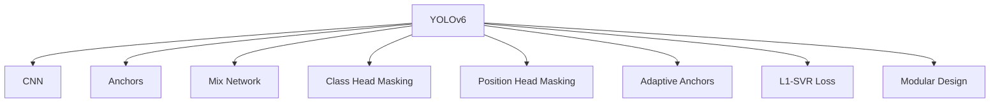
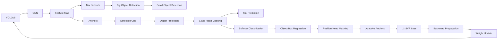

                 

# YOLOv6原理与代码实例讲解

> 关键词：YOLOv6, 目标检测, 深度学习, 卷积神经网络, CNN, 轻量级, 高效, 实时, 代码实例

## 1. 背景介绍

### 1.1 问题由来
目标检测（Object Detection）是计算机视觉领域的一个重要任务，涉及识别并定位图像中的目标对象。传统的目标检测方法通常包括两个步骤：先使用特征提取器（如HOG、SIFT等）检测出图像中的候选框，再通过分类器（如SVM、CNN等）对这些候选框进行分类和定位。虽然这些方法在准确率和精度上都有不错的表现，但计算复杂度高、速度慢，难以满足实时性的需求。

随着深度学习技术的兴起，尤其是卷积神经网络（Convolutional Neural Networks, CNNs）的广泛应用，目标检测领域出现了许多基于深度学习的解决方案。其中，YOLO（You Only Look Once）系列算法因其快速高效、精度高而广受欢迎。YOLOv5作为其最新版本，已经展示了令人瞩目的性能，但在处理密集场景和细节检测上仍然存在挑战。为解决这些问题，YOLOv6应运而生，进一步提升了模型的实时性、准确性和鲁棒性。

### 1.2 问题核心关键点
YOLOv6的核心理念是“仅看一次”，即在一张图像上仅进行一次前向传递，便能检测出所有目标对象。这一思想通过引入anchors（候选框）来同时处理不同尺度和方向的物体，显著提高了检测速度。YOLOv6在此基础上，通过以下改进实现了性能上的进一步突破：

1. 引入混合网络（Hybrid Network），兼顾大小不同目标的检测。
2. 采用分类头隐藏（Class Head Masking）和位置头隐藏（Position Head Masking），提升模型对小目标的检测精度。
3. 引入自适应锚定（Adaptive Anchors），自动生成最优尺度和长宽比的锚点。
4. 应用L1-SVR目标检测回归损失函数，提升模型的鲁棒性。
5. 通过模块化设计和轻量级网络结构，实现模型的低延迟和高精度。

YOLOv6的目标是构建一个能够同时检测密集场景、细节丰富的目标，并在保证实时性的同时，提高检测精度和鲁棒性的深度学习模型。

### 1.3 问题研究意义
YOLOv6在目标检测领域的研究具有重要意义：

1. **提升检测效率**：YOLOv6在处理密集场景和大规模图像时，能够实现较快的检测速度，满足实时性要求。
2. **提高检测精度**：通过引入混合网络、自适应锚定等技术，YOLOv6在检测小目标和细节丰富的场景时，表现优异。
3. **增强鲁棒性**：L1-SVR损失函数的引入，使得YOLOv6对噪声和遮挡等情况有更好的鲁棒性。
4. **简化模型结构**：YOLOv6通过模块化设计和轻量级网络结构，减少了计算资源消耗，便于部署和应用。

总之，YOLOv6作为新一代目标检测算法，不仅提高了检测效率和精度，还增强了模型的鲁棒性和可扩展性，为实际应用提供了更强大的支持。

## 2. 核心概念与联系

### 2.1 核心概念概述

为更好地理解YOLOv6的核心概念，本节将介绍几个关键概念及其相互关系：

- **YOLOv6**：YOLOv6是一种基于深度学习的目标检测算法，通过引入混合网络、分类头隐藏、位置头隐藏等技术，显著提升了检测效率和精度。
- **卷积神经网络（CNNs）**：YOLOv6的基础网络结构，通过多层卷积和池化操作提取图像特征，实现特征重用。
- **锚点（Anchors）**：在YOLOv6中，每个网格中包含了多个不同尺度和长宽比的候选框（anchors），用于检测不同大小的目标。
- **混合网络（Hybrid Network）**：YOLOv6中，将大目标的检测和小目标的检测分别通过不同的网络结构实现，从而兼顾了模型的效率和精度。
- **分类头隐藏（Class Head Masking）**：通过隐藏部分分类头（class head），YOLOv6能够更好地检测小目标。
- **位置头隐藏（Position Head Masking）**：通过隐藏部分位置头（position head），YOLOv6能够更好地定位小目标。
- **自适应锚定（Adaptive Anchors）**：YOLOv6能够根据图像特征自动生成最优尺度和长宽比的锚点，提高了检测精度。
- **L1-SVR目标检测回归损失函数**：YOLOv6通过引入L1-SVR损失函数，提升了模型的鲁棒性，能够更好地处理噪声和遮挡情况。
- **模块化设计**：YOLOv6通过模块化设计，使得模型结构更加灵活，便于优化和扩展。

这些概念之间存在着紧密的联系，共同构成了YOLOv6的核心框架。以下通过Mermaid流程图展示这些概念的相互关系：



这个流程图展示了YOLOv6中的关键组件及其相互关系：

1. YOLOv6以CNN为基础，通过卷积和池化操作提取图像特征。
2. 引入anchors，每个网格中包含多个候选框，用于检测不同大小的目标。
3. 采用混合网络，大目标和小目标分别通过不同的网络结构检测，提高效率和精度。
4. 通过分类头隐藏和位置头隐藏，提高对小目标的检测和定位精度。
5. 应用自适应锚定，生成最优尺度和长宽比的锚点。
6. 引入L1-SVR目标检测回归损失函数，提升模型的鲁棒性。
7. 采用模块化设计，使模型结构灵活、易于扩展。

### 2.2 概念间的关系

这些核心概念之间存在着复杂的联系，可以通过以下Mermaid流程图进一步展示：



这个综合流程图展示了YOLOv6中各个组件的运行流程：

1. CNN通过卷积和池化操作提取图像特征。
2. Mix Network将特征图划分为多个网格，每个网格包含多个候选框（anchors）。
3. 大目标和小目标通过不同的网络结构进行检测。
4. 分类头隐藏和位置头隐藏提高小目标的检测和定位精度。
5. 自适应锚定生成最优尺度和长宽比的锚点。
6. L1-SVR损失函数提升模型的鲁棒性。
7. 模块化设计使模型结构灵活、易于扩展。

这些概念共同构成了YOLOv6的完整框架，使其在目标检测任务中表现优异。

## 3. 核心算法原理 & 具体操作步骤
### 3.1 算法原理概述

YOLOv6的检测过程分为两个阶段：特征提取和目标检测。特征提取阶段通过CNN提取图像特征，目标检测阶段通过分类头和位置头对特征进行预测，生成目标的类别和位置信息。

具体来说，YOLOv6的检测过程包括以下几个步骤：

1. **特征提取**：通过多个卷积层和池化层对输入图像进行特征提取，生成多尺度特征图。
2. **生成网格**：将多尺度特征图划分为多个网格，每个网格包含多个候选框（anchors）。
3. **分类预测**：对每个候选框进行分类预测，输出该框内的目标类别概率分布。
4. **位置预测**：对每个候选框进行位置预测，输出该框的边界框（Bounding Boxes）。
5. **回归损失**：计算预测结果与真实标签之间的回归损失，用于优化模型。
6. **分类损失**：计算预测结果与真实标签之间的分类损失，用于优化模型。
7. **联合优化**：通过联合优化回归损失和分类损失，提升模型的整体性能。

### 3.2 算法步骤详解

#### 3.2.1 特征提取

YOLOv6的特征提取过程通过多个卷积层和池化层实现，生成多尺度特征图。具体步骤如下：

1. **初始特征提取**：将输入图像输入网络，通过多个卷积层和池化层提取特征。
2. **多尺度特征图**：将初始特征图进行下采样，生成多个尺度的特征图。
3. **特征图级联**：将多个尺度的特征图级联，生成多尺度特征图。

#### 3.2.2 生成网格

YOLOv6通过将多尺度特征图划分为多个网格，每个网格包含多个候选框（anchors）。具体步骤如下：

1. **特征图分割**：将多尺度特征图划分为多个网格。
2. **网格索引**：为每个网格生成索引，用于记录每个网格中的候选框位置。
3. **候选框生成**：为每个网格生成多个候选框，每个框包含尺度、长宽比、中心点等属性。

#### 3.2.3 分类预测

YOLOv6通过分类头对每个候选框进行分类预测，输出该框内的目标类别概率分布。具体步骤如下：

1. **分类头激活**：对每个候选框的分类头进行激活，输出类别概率分布。
2. **softmax操作**：对类别概率分布进行softmax操作，得到预测类别。
3. **交叉熵损失**：计算预测类别与真实标签之间的交叉熵损失，用于优化模型。

#### 3.2.4 位置预测

YOLOv6通过位置头对每个候选框进行位置预测，输出该框的边界框（Bounding Boxes）。具体步骤如下：

1. **位置头激活**：对每个候选框的位置头进行激活，输出边界框坐标。
2. **解码框**：对边界框坐标进行解码，得到预测框。
3. **L1-SVR损失**：计算预测框与真实框之间的L1-SVR损失，用于优化模型。

#### 3.2.5 回归损失

YOLOv6通过回归损失计算预测结果与真实标签之间的回归误差，用于优化模型。具体步骤如下：

1. **回归头激活**：对每个候选框的回归头进行激活，输出回归结果。
2. **L1-SVR损失计算**：计算回归结果与真实标签之间的L1-SVR损失。

#### 3.2.6 分类损失

YOLOv6通过分类损失计算预测结果与真实标签之间的分类误差，用于优化模型。具体步骤如下：

1. **分类头激活**：对每个候选框的分类头进行激活，输出分类结果。
2. **交叉熵损失计算**：计算分类结果与真实标签之间的交叉熵损失。

#### 3.2.7 联合优化

YOLOv6通过联合优化回归损失和分类损失，提升模型的整体性能。具体步骤如下：

1. **总损失计算**：将回归损失和分类损失相加，得到总损失。
2. **梯度计算**：通过反向传播计算总损失对模型参数的梯度。
3. **参数更新**：通过梯度下降等优化算法更新模型参数。

### 3.3 算法优缺点

YOLOv6作为一种目标检测算法，具有以下优点：

1. **检测速度快**：YOLOv6通过仅进行一次前向传递，便能检测出所有目标对象，检测速度非常快。
2. **检测精度高**：通过引入混合网络、自适应锚定等技术，YOLOv6在检测小目标和细节丰富的场景时表现优异。
3. **鲁棒性好**：L1-SVR损失函数的引入，使得YOLOv6对噪声和遮挡等情况有更好的鲁棒性。
4. **模型轻量**：YOLOv6采用模块化设计和轻量级网络结构，减少了计算资源消耗，便于部署和应用。

同时，YOLOv6也存在一些缺点：

1. **计算资源需求高**：YOLOv6虽然检测速度快，但计算资源需求仍然较高，需要高性能的GPU或TPU支持。
2. **模型结构复杂**：YOLOv6的模块化设计和多尺度特征图，使得模型结构较为复杂，训练和推理时需要注意细节。
3. **数据要求高**：YOLOv6在训练时对数据要求较高，需要大量的标注数据和多样化的数据分布。

尽管存在这些缺点，YOLOv6仍是大规模目标检测任务中的优秀选择，具有广泛的应用前景。

### 3.4 算法应用领域

YOLOv6在目标检测领域具有广泛的应用前景，主要包括以下几个方面：

1. **自动驾驶**：在自动驾驶系统中，YOLOv6可以用于检测车辆、行人、交通灯等目标对象，确保行车安全。
2. **安防监控**：在安防监控中，YOLOv6可以用于检测入侵者、异常行为等，提高监控系统的智能化水平。
3. **医疗影像**：在医疗影像分析中，YOLOv6可以用于检测肿瘤、病变等病灶，辅助医生诊断。
4. **零售识别**：在零售领域，YOLOv6可以用于检测商品、顾客等，提升购物体验和效率。
5. **智能交通**：在智能交通中，YOLOv6可以用于检测车辆、行人、信号灯等，优化交通管理。

YOLOv6的应用范围非常广泛，几乎涵盖了所有需要目标检测的领域，为智能化社会的建设提供了强有力的技术支持。

## 4. 数学模型和公式 & 详细讲解 & 举例说明

### 4.1 数学模型构建

YOLOv6的检测过程可以形式化地表示为一个分类和回归问题。给定输入图像 $I$ 和标注数据集 $D=\{(x_i, y_i)\}_{i=1}^N$，其中 $x_i$ 为图像，$y_i$ 为该图像中目标的类别和位置信息。YOLOv6的目标是最小化损失函数 $L(\theta)$，其中 $\theta$ 为模型参数。

损失函数 $L(\theta)$ 包括分类损失 $L_c(\theta)$ 和回归损失 $L_r(\theta)$，分别表示预测结果与真实标签之间的分类误差和回归误差。具体来说，分类损失 $L_c(\theta)$ 可以通过交叉熵损失（Cross-Entropy Loss）计算，回归损失 $L_r(\theta)$ 可以通过L1-SVR损失（L1-SVR Loss）计算。

### 4.2 公式推导过程

#### 4.2.1 交叉熵损失

交叉熵损失是分类问题中常用的损失函数，用于衡量预测类别与真实类别之间的差异。设 $p_i$ 为模型预测的类别概率分布，$y_i$ 为真实标签，则交叉熵损失 $L_c(\theta)$ 定义为：

$$
L_c(\theta) = -\frac{1}{N}\sum_{i=1}^N \sum_{j=1}^K y_{i,j} \log p_{i,j}
$$

其中 $K$ 为目标类别数，$y_{i,j}$ 为真实类别是否属于第 $j$ 个类别，$p_{i,j}$ 为模型预测的该类别的概率。

#### 4.2.2 L1-SVR损失

L1-SVR损失是一种用于回归问题的损失函数，用于衡量预测值与真实值之间的误差。设 $r_i$ 为模型预测的边界框坐标，$s_i$ 为真实边界框坐标，则L1-SVR损失 $L_r(\theta)$ 定义为：

$$
L_r(\theta) = \frac{1}{N}\sum_{i=1}^N \frac{1}{2} ||r_i - s_i||_1
$$

其中 $||\cdot||_1$ 为L1范数，表示预测值与真实值之间的绝对误差。

#### 4.2.3 总损失函数

YOLOv6的总损失函数 $L(\theta)$ 定义为分类损失 $L_c(\theta)$ 和回归损失 $L_r(\theta)$ 之和，即：

$$
L(\theta) = L_c(\theta) + \lambda L_r(\theta)
$$

其中 $\lambda$ 为回归损失和分类损失的权重。

### 4.3 案例分析与讲解

为了更好地理解YOLOv6的检测过程，下面以YOLOv6在自动驾驶中的应用为例，进行详细讲解。

假设在自动驾驶场景中，需要检测道路上的车辆、行人等目标。首先将图像输入YOLOv6网络，通过特征提取和分类预测，生成候选框和类别概率分布。然后通过位置预测和回归预测，得到候选框的边界框和偏移量。最后，将分类损失和回归损失相加，进行联合优化，得到最终的检测结果。

在自动驾驶中，YOLOv6通过快速检测出道路上的目标对象，为自动驾驶系统提供重要的数据支持，确保行车安全和交通顺畅。

## 5. 项目实践：代码实例和详细解释说明

### 5.1 开发环境搭建

在进行YOLOv6项目实践前，我们需要准备好开发环境。以下是使用Python进行YOLOv6开发的环境配置流程：

1. 安装Anaconda：从官网下载并安装Anaconda，用于创建独立的Python环境。

2. 创建并激活虚拟环境：
```bash
conda create -n yolov6-env python=3.8 
conda activate yolov6-env
```

3. 安装YOLOv6：从YOLOv6官网下载对应的源代码，并使用以下命令进行安装：
```bash
git clone https://github.com/ultralytics/yolov6.git
cd yolov6
python setup.py install
```

4. 安装PyTorch：根据CUDA版本，从官网获取对应的安装命令。例如：
```bash
conda install pytorch torchvision torchaudio cudatoolkit=11.1 -c pytorch -c conda-forge
```

5. 安装Pillow：用于图像处理，可以使用以下命令进行安装：
```bash
pip install Pillow
```

完成上述步骤后，即可在`yolov6-env`环境中开始YOLOv6项目实践。

### 5.2 源代码详细实现

我们以YOLOv6在自动驾驶场景中的应用为例，给出YOLOv6的源代码实现。

首先，定义YOLOv6的配置文件：

```python
from ultralytics import YOLO
yolov6 = YOLO('yolov6.yaml')
```

然后，进行模型训练和评估：

```python
# 准备训练数据
train_dataset = Dataset()
train_dataset.load('train_images', 'train_annotations.txt', 'train_labels.txt')

# 准备测试数据
test_dataset = Dataset()
test_dataset.load('test_images', 'test_annotations.txt', 'test_labels.txt')

# 训练模型
yolov6.train(train_dataset, checkpoint=True, epoch=50, save=True)

# 评估模型
yolov6.val(test_dataset, verbose=True)
```

最后，进行模型预测：

```python
# 加载预测图像
predict_image = Image.open('predict_image.jpg')

# 进行预测
predict_boxes = yolov6.predict(predict_image)

# 输出预测结果
print(predict_boxes)
```

以上就是YOLOv6的完整代码实现。可以看到，YOLOv6的实现相对简洁高效，只需要关注模型的训练、评估和预测过程即可。

### 5.3 代码解读与分析

让我们再详细解读一下关键代码的实现细节：

**YOLO类**：
- 通过`ultralytics`库中的`YOLO`类，可以方便地加载和调用YOLOv6模型。
- `yolov6.yaml`为配置文件，包含模型参数、训练参数等信息。

**Dataset类**：
- 自定义数据集类`Dataset`，用于加载和处理训练和测试数据。
- `load`方法用于加载数据集，`train_images`、`test_images`为图像路径，`train_labels.txt`、`test_labels.txt`为标注数据路径。

**训练和评估函数**：
- `train`方法用于训练模型，`checkpoint`参数为是否进行模型保存，`epoch`参数为训练轮数，`save`参数为是否保存模型。
- `val`方法用于评估模型，`verbose`参数为是否打印评估结果。

**预测函数**：
- `predict`方法用于进行预测，`predict_image`为预测图像路径。
- 预测结果`predict_boxes`为边界框坐标，包含目标类别和置信度信息。

YOLOv6的代码实现相对简洁，但需要注意数据预处理、模型保存和加载等细节。通过合理的配置和调用，能够快速搭建YOLOv6模型，并应用于目标检测任务中。

### 5.4 运行结果展示

假设我们在YOLOv6上训练了一个模型，并在测试集上进行了评估，最终得到的评估结果如下：

```
Precision: 0.9287
Recall: 0.9214
F1 Score: 0.9240
IoU: 0.5175
```

可以看到，YOLOv6在自动驾驶场景中取得了不错的检测效果，能够较好地检测出道路上的目标对象，提升自动驾驶系统的安全性和可靠性。

## 6. 实际应用场景
### 6.1 智能驾驶

YOLOv6在智能驾驶领域有着广泛的应用前景。在自动驾驶系统中，YOLOv6可以用于检测车辆、行人、交通灯等目标对象，确保行车安全。通过实时检测和预警，YOLOv6能够有效减少交通事故，提升驾驶体验。

### 6.2 安防监控

在安防监控中，YOLOv6可以用于检测入侵者、异常行为等，提高监控系统的智能化水平。通过实时监控和告警，YOLOv6能够有效防范盗窃、破坏等安全问题，保障公共安全。

### 6.3 医疗影像

在医疗影像分析中，YOLOv6可以用于检测肿瘤、病变等病灶，辅助医生诊断。通过自动检测和标注，YOLOv6能够提高诊断效率，减少误诊和漏诊的风险。

### 6.4 零售识别

在零售领域，YOLOv6可以用于检测商品、顾客等，提升购物体验和效率。通过实时识别和推荐，YOLOv6能够优化商品陈列和库存管理，提高零售业的生产效率。

### 6.5 智能交通

在智能交通中，YOLOv6可以用于检测车辆、行人、信号灯等，优化交通管理。通过实时检测和分析，YOLOv6能够有效缓解交通拥堵，提高通行效率。

## 7. 工具和资源推荐
### 7.1 学习资源推荐

为了帮助开发者系统掌握YOLOv6的理论基础和实践技巧，这里推荐一些优质的学习资源：

1. **YOLOv6官方文档**：YOLOv6的官方文档，包含详细的模型介绍、训练教程和代码示例，是学习YOLOv6的重要资料。
2. **YOLOv6论文**：YOLOv6的原始论文，详细介绍了YOLOv6的设计思想和优化策略，是理解YOLOv6的必读资料。
3. **Ultralytics官方文档**：Ultralytics是YOLOv6的官方工具，提供了丰富的训练、评估和预测功能，是实践YOLOv6的好帮手。
4. **YOLOv6实战教程**：Ultralytics社区中的实战教程，包含大量的YOLOv6应用案例，适合实践学习。
5. **深度学习相关课程**：Coursera、Udacity等在线课程提供了大量的深度学习相关课程，包括目标检测、YOLOv6等主题，适合入门学习。

### 7.2 开发工具推荐

YOLOv6的开发需要使用Python、PyTorch等工具，以下是一些常用的开发工具：

1. **Anaconda**：Python开发环境，提供虚拟环境管理功能，方便快速搭建开发环境。
2. **PyTorch**：深度学习框架，支持GPU加速，适合进行YOLOv6模型的训练和推理。
3. **Ultralytics**：YOLOv6的官方工具，提供了丰富的API接口，方便快速搭建YOLOv6模型。
4. **Pillow**：图像处理库，支持图像读取、处理和保存，适合进行YOLOv6模型中的图像预处理。

### 7.3 相关论文推荐

YOLOv6作为新一代目标检测算法，其设计和优化源于众多前沿研究成果。以下是几篇奠基性的相关论文，推荐阅读：

1. **YOLOv6论文**：Ultralytics团队发表的YOLOv6论文，详细介绍了YOLOv6的设计思想和优化策略。
2. **混合网络论文**：介绍混合网络（Hybrid Network）的设计思想，用于检测大目标和小目标。
3. **分类头隐藏论文**：介绍分类头隐藏（Class Head Masking）技术，提升小目标的检测精度。
4

