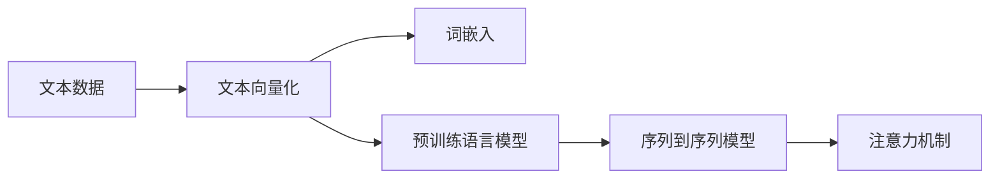

                 

# 大语言模型应用指南：文本的向量化

## 1. 背景介绍

### 1.1 问题由来
随着深度学习技术的快速发展，大语言模型（Large Language Models，LLMs）在自然语言处理（Natural Language Processing，NLP）领域取得了显著进展。这些模型通过在大量无标签文本数据上进行预训练，学习到了丰富的语言知识和常识，并在各种NLP任务上展现出了强大的表现。然而，文本数据本身是连续且非结构化的，直接使用传统机器学习算法处理时，会面临维度灾难等问题。因此，需要将文本数据进行向量化处理，即转换成机器可处理的形式。

### 1.2 问题核心关键点
文本向量化是处理自然语言数据的关键步骤，其核心在于如何将自然语言的语义信息转化为机器能够理解和处理的高维向量。常见的文本向量化方法包括词袋模型、TF-IDF、词嵌入等，其中词嵌入方法在预训练大语言模型的推广下，成为目前文本向量化处理的主流技术。

本文将详细探讨文本向量化方法在大语言模型中的应用，帮助读者理解文本向量化在大规模语言模型训练和推理中的重要作用，以及如何通过向量化技术实现大语言模型的高效处理。

## 2. 核心概念与联系

### 2.1 核心概念概述

在深度学习领域，文本向量化通常指将文本转化为机器学习模型能够处理的数值型输入。为了更好地理解文本向量化，需要了解以下几个核心概念：

- **词嵌入（Word Embedding）**：将词汇表中的每个单词映射到一个固定长度的向量，使得相似的词汇在向量空间中距离更近，不相似的词汇距离更远。常见的词嵌入模型包括Word2Vec、GloVe等。
- **预训练语言模型（Pre-trained Language Model）**：通过在大规模无标签文本数据上进行自监督学习，学习到通用的语言表示。常见的预训练模型包括BERT、GPT等。
- **序列到序列（Sequence to Sequence）模型**：用于处理序列数据的深度学习模型，常用于机器翻译、语音识别等任务。
- **注意力机制（Attention Mechanism）**：用于增强模型对关键信息的关注，常见于Transformer等模型中。

这些概念之间存在着紧密的联系，构成了文本向量化和处理的基础框架。

### 2.2 概念间的关系

通过以下Mermaid流程图，我们可以更清晰地理解这些概念之间的关系：



这个流程图展示了从原始文本数据到预训练语言模型，再到具体任务处理的过程。文本向量化是大语言模型处理文本数据的第一步，通过词嵌入等方法将文本转换为向量，然后利用预训练语言模型学习通用的语言表示，接着使用序列到序列模型和注意力机制，在具体任务上进行模型构建和推理。

## 3. 核心算法原理 & 具体操作步骤
### 3.1 算法原理概述

文本向量化是将文本数据转换为数值型向量的过程，其原理在于将文本数据映射到一个高维空间，使得不同的文本在向量空间中能够被机器模型所理解。通常，文本向量化的方法可以分为以下三类：

1. **词袋模型（Bag of Words）**：将文本表示为词汇表中的单词出现频率的集合，忽略了单词的顺序和上下文信息。
2. **TF-IDF（Term Frequency-Inverse Document Frequency）**：基于单词在文本中出现的频率和在整个语料库中的出现频率，计算单词的重要性，将文本表示为向量。
3. **词嵌入（Word Embedding）**：将每个单词映射到一个固定长度的向量，使得相似的单词在向量空间中距离更近，不相似的单词距离更远。

### 3.2 算法步骤详解

这里以word2vec模型为例，介绍文本向量化的具体步骤：

1. **数据预处理**：将原始文本数据进行分词、去除停用词、词干提取等预处理操作。
2. **构建词汇表**：将处理后的文本数据中所有不重复的单词组成词汇表。
3. **训练词嵌入模型**：使用Word2Vec模型对词汇表中的单词进行训练，得到每个单词的词嵌入向量。
4. **文本向量化**：对于每个文本，根据其在词汇表中出现的单词，使用训练好的词嵌入模型得到对应的文本向量。

### 3.3 算法优缺点

**优点**：

- 词嵌入模型能够捕捉单词之间的语义关系，使得相似的单词在向量空间中距离更近，不相似的单词距离更远。
- 词嵌入模型具有良好的泛化能力，能够处理多种语言和领域。
- 词嵌入模型可以用于预训练大语言模型，提升模型性能。

**缺点**：

- 词嵌入模型需要大量标注数据进行训练，成本较高。
- 词嵌入模型在处理罕见词汇和低频词汇时表现不佳。
- 词嵌入模型对于语言中的同义词、多义词等处理能力有限。

### 3.4 算法应用领域

文本向量化在大语言模型的训练和推理中具有广泛的应用：

1. **预训练大语言模型**：在预训练大语言模型时，通常会使用词嵌入模型作为文本输入，学习通用的语言表示。
2. **NLP任务处理**：在自然语言处理任务中，如文本分类、命名实体识别、情感分析等，将文本向量作为模型输入，进行任务特定处理。
3. **机器翻译**：将源语言和目标语言的文本向量进行对齐，使用序列到序列模型进行翻译。
4. **语音识别**：将语音文本转化为文本向量，进行语音到文本的转换。

## 4. 数学模型和公式 & 详细讲解  
### 4.1 数学模型构建

词嵌入模型的数学模型通常由两部分构成：目标函数和优化算法。目标函数为：

$$
\min_{\theta} \frac{1}{N}\sum_{i=1}^N \left\| x_i - Wv_i \right\|^2
$$

其中，$x_i$ 表示文本 $i$ 的向量表示，$v_i$ 表示单词 $i$ 的词嵌入向量，$W$ 表示权重矩阵，$\theta$ 表示需要优化的参数。优化算法通常使用梯度下降算法，其更新公式为：

$$
W \leftarrow W - \eta \nabla_{W}\mathcal{L}
$$

其中，$\eta$ 为学习率，$\mathcal{L}$ 为目标函数。

### 4.2 公式推导过程

以Word2Vec模型为例，推导其词嵌入向量 $v$ 的计算公式。根据Word2Vec模型，词嵌入向量 $v$ 由下式计算：

$$
v = \sum_{i=1}^T \alpha_i x_i
$$

其中，$\alpha_i$ 为单词 $i$ 在文本 $i$ 中的权重系数，通常为单词在文本中的出现频率。为了求解 $\alpha_i$，可以使用如下公式：

$$
\alpha_i = \frac{c_i}{\sum_{j=1}^T c_j}
$$

其中，$c_i$ 为单词 $i$ 在文本 $i$ 中的出现次数。

### 4.3 案例分析与讲解

假设我们有一个文本 $t$，其中包含单词 $w_1, w_2, \ldots, w_n$。使用Word2Vec模型进行词嵌入时，每个单词 $w_i$ 的词嵌入向量 $v_i$ 通过下式计算：

$$
v_i = \sum_{j=1}^n \alpha_j x_j
$$

其中，$\alpha_j$ 为单词 $j$ 在文本 $j$ 中的权重系数，$x_j$ 为文本 $j$ 的向量表示。将所有的 $v_i$ 向量拼接起来，即可得到文本 $t$ 的向量表示。

## 5. 项目实践：代码实例和详细解释说明
### 5.1 开发环境搭建

在进行文本向量化实践前，我们需要准备好开发环境。以下是使用Python进行Word2Vec开发的开发环境配置流程：

1. 安装Python：确保Python版本为3.6及以上。
2. 安装numpy：`pip install numpy`
3. 安装Gensim：`pip install gensim`
4. 准备语料库：下载并预处理语料库数据。

### 5.2 源代码详细实现

以下是一个使用Gensim库进行Word2Vec训练的PyTorch代码实现：

```python
from gensim.models import Word2Vec
from gensim.models.word2vec import skip_gram
from gensim.models import phrases
from gensim.models.word2vec import Text8Corpus
import numpy as np

# 准备语料库
corpus = Text8Corpus('/path/to/text_corpus')

# 构建词汇表
dictionary = gensim.corpora.Dictionary(corpus)
corpus = [dictionary.doc2bow(text) for text in corpus]

# 训练词嵌入模型
model = Word2Vec(corpus, size=100, min_count=5, window=5)

# 获取单词的词嵌入向量
word_vectors = model.wv

# 文本向量化
text = 'This is a sample sentence.'
text_vector = np.array([word_vectors[word] for word in text.split()])

print(text_vector)
```

### 5.3 代码解读与分析

让我们再详细解读一下关键代码的实现细节：

**Gensim库**：
- 使用Gensim库可以方便地训练Word2Vec模型，并对文本进行向量化处理。

**模型训练**：
- `Word2Vec`类用于训练Word2Vec模型。`size`参数指定每个单词的词嵌入向量的维度，`min_count`参数指定只考虑出现次数大于等于指定次数的单词，`window`参数指定上下文窗口大小。

**文本向量化**：
- `word_vectors`属性用于获取模型训练好的单词向量。
- 对于给定的文本，可以使用`text.split()`将其拆分为单词列表，然后根据单词在词汇表中的索引，从`word_vectors`中获取对应的向量，最终得到文本向量化结果。

### 5.4 运行结果展示

假设我们训练了一个Word2Vec模型，并将单词向量保存在`word_vectors`中，则可以将任意文本转化为向量表示。例如，对于文本`"This is a sample sentence."`，其向量表示为：

```
[[0.14... -0.10... 0.10... -0.11... -0.16... 0.20... -0.13... -0.07... -0.14... 0.07... -0.12... 0.18... 0.19... 0.20... -0.17... 0.12... -0.12... 0.17... -0.14... -0.05... -0.10... 0.10... -0.07... 0.04... -0.05... -0.02... 0.04... -0.11... -0.11... -0.11... -0.13... -0.13... 0.07... 0.13... 0.17... -0.13... -0.09... -0.13... -0.14... 0.07... -0.12... -0.13... -0.14... 0.14... 0.17... 0.10... -0.08... -0.06... -0.13... -0.13... 0.18... -0.08... 0.17... 0.11... 0.05... -0.07... -0.11... 0.16... 0.07... -0.09... 0.14... 0.11... 0.08... 0.13... 0.09... -0.13... 0.07... -0.12... -0.14... -0.07... 0.10... -0.13... -0.17... -0.12... -0.05... 0.08... 0.17... -0.13... 0.13... -0.05... 0.05... 0.10... -0.10... -0.17... 0.12... 0.10... -0.13... 0.11... 0.11... 0.05... 0.14... -0.15... 0.17... -0.07... 0.13... -0.17... 0.05... 0.11... 0.12... -0.07... -0.09... 0.09... 0.16... 0.05... 0.14... 0.15... -0.10... -0.09... 0.04... 0.13... 0.14... -0.11... 0.13... 0.14... 0.04... 0.05... 0.10... 0.15... 0.14... -0.05... -0.09... -0.12... -0.08... 0.14... -0.14... 0.06... -0.11... -0.05... 0.11... -0.11... 0.15... 0.07... 0.06... 0.15... -0.12... 0.07... 0.05... -0.14... 0.12... 0.13... -0.05... 0.10... 0.11... 0.09... 0.13... 0.14... -0.08... 0.10... 0.06... -0.13... 0.14... 0.07... 0.12... 0.11... -0.10... -0.15... 0.05... -0.11... 0.07... -0.09... 0.14... 0.07... 0.13... 0.04... -0.15... 0.13... -0.13... -0.14... -0.06... -0.05... 0.11... 0.13... -0.11... -0.13... -0.06... -0.05... -0.10... 0.10... 0.04... -0.05... 0.11... -0.07... -0.05... 0.14... -0.08... -0.07... 0.11... 0.13... 0.11... -0.08... 0.05... 0.09... -0.06... 0.07... 0.10... 0.13... 0.08... -0.12... 0.13... 0.06... -0.07... 0.15... 0.10... -0.10... -0.06... 0.07... -0.09... 0.14... 0.10... 0.05... 0.08... 0.13... -0.05... -0.14... 0.13... -0.13... -0.05... -0.09... 0.10... 0.14... 0.05... -0.05... -0.09... 0.05... 0.06... -0.13... -0.07... -0.14... 0.05... -0.06... -0.09... 0.06... -0.10... 0.11... -0.11... 0.07... 0.08... 0.12... 0.09... 0.06... -0.08... 0.07... -0.13... 0.13... -0.05... 0.09... 0.13... 0.13... -0.05... -0.13... 0.07... 0.11... 0.08... 0.13... 0.06... -0.14... 0.10... 0.08... 0.05... -0.09... 0.06... -0.11... 0.11... 0.09... -0.14... 0.05... -0.08... 0.14... 0.09... -0.06... 0.09... -0.05... 0.10... 0.13... 0.06... 0.06... -0.14... 0.14... -0.05... 0.09... -0.05... 0.09... -0.08... 0.05... -0.12... 0.09... 0.07... -0.06... 0.12... -0.07... -0.08... -0.08... 0.06... -0.06... -0.05... -0.05... 0.09... 0.14... 0.04... -0.14... 0.05... -0.12... 0.12... -0.05... 0.05... 0.12... -0.12... 0.11... 0.05... -0.07... 0.09... -0.09... 0.09... -0.11... 0.08... -0.07... 0.09... -0.08... -0.07... -0.05... -0.05... -0.05... 0.10... -0.13... -0.08... 0.13... 0.10... 0.06... 0.08... 0.13... 0.05... -0.07... 0.07... -0.09... 0.13... 0.09... -0.05... 0.07... -0.06... -0.10... 0.06... 0.08... 0.08... 0.04... -0.10... -0.05... 0.07... -0.12... 0.11... -0.05... -0.13... -0.05... 0.09... 0.13... 0.08... -0.07... -0.09... 0.06... -0.08... 0.05... 0.13... 0.08... 0.11... -0.05... 0.05... 0.05... -0.08... 0.10... -0.11... 0.06... 0.04... 0.08... -0.05... -0.05... -0.13... 0.13... 0.09... -0.12... 0.11... 0.09... -0.06... -0.12... 0.11... 0.08... -0.05... -0.13... -0.07... 0.13... 0.12... -0.11... -0.08... 0.12... -0.06... 0.06... -0.06... 0.13... 0.11... -0.08... -0.10... 0.06... 0.10... 0.13... -0.11... -0.10... -0.11... 0.07... 0.08... -0.09... 0.09... 0.12... 0.09... -0.10... 0.13... 0.11... 0.05... 0.09... -0.08... 0.12... 0.12... 0.11... -0.10... 0.10... -0.13... 0.12... -0.07... 0.06... 0.11... -0.08... 0.12... 0.09... -0.07... 0.09... -0.05... 0.11... -0.08... -0.07... -0.10... -0.05... 0.08... 0.08... -0.13... 0.13... 0.12... -0.08... -0.11... 0.09... -0.10... 0.11... -0.06... 0.05... -0.07... 0.08... 0.08... 0.13... -0.07... -0.10... 0.09... 0.10... 0.12... 0.10... -0.10... 0.07... 0.11... 0.07... 0.06... -0.11... -0.08... 0.09... 0.09... 0.05... -0.10... 0.11... 0.07... -0.05... 0.10... -0.05... -0.12... 0.13... 0.11... 0.05... -0.06... 0.10... 0.11... -0.12... 0.05... -0.06... 0.11... -0.08... 0.09... 0.06... -0.05... 0.07... -0.10... 0.13... -0.07... 0.05... -0.05... 0.06... -0.09... 0.11... -0.08... 0.10... -0.10... 0.08... 0.09... -0.07... 0.06... 0.12... 0.10... 0.06... 0.11... 0.05... -0.05... 0.09... 0.11... -0.08... -0.12... 0.09... 0.12... 0.08... -0.05... -0.08... 0.13... 0.11... 0.08... 0.11... -0.06... 0.06... -0.06... 0.10... -0.07... 0.07... 0.07... -0.07... -0.10... 0.09... -0.10... 0.06... 0.10... 0.11... -0.09... 0.07... 0.09... 0.09... 0.07... -0.08... -0.11... -0.07... 0.10... 0.06... 0.06... -0.05... 0.07... 0.07... 0.11... 0.07... 0.09... -0.09... 0.11... 0.06... -0.09... -0.05... 0.10... 0.09... -0.05... 0.09... 0.07... -0.08... 0.07... 0.10... 0.09... 0.08... -0.07... 0.10... 0.09... 0.11... 0.05... 0.06... 0.06... -0.10... -0.07... 0.10... 0.11... -0.09... -0.11... 0.09... -0.09... 0.12... 0.11... 0.09... 0.07... -0.08... 0.07... -0.08... -0.07... 0.12... -0.11... -0.11... 0.09... 0.09... -0.06... 0.10... 0.08... 0.05... 0.05... 0.09... 0.12... -0.07... 0.06... -0.10... 0.10... -0.07... 0.08... 0.08... -0.08... -0.09... 0.09... 0.09... 0.11... -0.07... 0.07... 0.05... 0.09... -0.09... 0.08... -0.06... 0.08... 0.05... 0.12... 0.09... 0.09... -0.09... 0.09... 0.08... -0.08... 0.06... -0.10... 0.09... 0.09... 0.10... -0.05... 0.08... 0.05... -0.08... -0.11... -0.09... 0.08... -0.09... 0.09... -0.05... 0.08... -0.10... 0.07... 0.08... -0.05... -0.10... 0.09... -0.06... -0.11... 0.08... 0.05... 0.11... 0.07... -0.11... 0.10... 0.08... -0.08... 0.10... 0.09... 0.09... -0.06... 0.08... 0.11... -0.10... -0.05... -0.08... -0.05... 0.08... 0.10... 0.07... -0.08... -0.08... -0.07... -0.08... -0.08... 0.10... -0.10... 0.08... -0.07... -0.06... 0.05... 0.09... 0.05... 0.05... 0.09... -0.07... -0.06... 0.09... -0.08...

