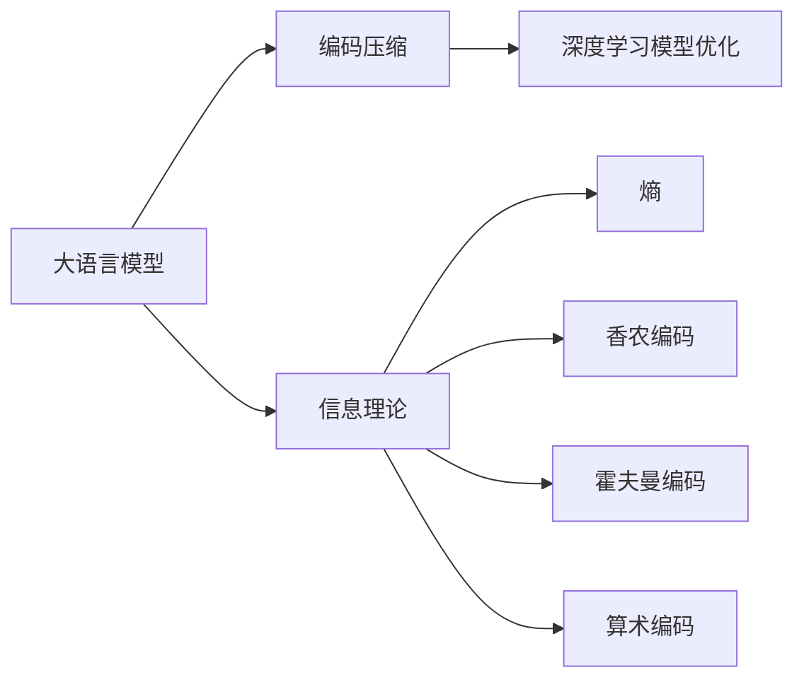
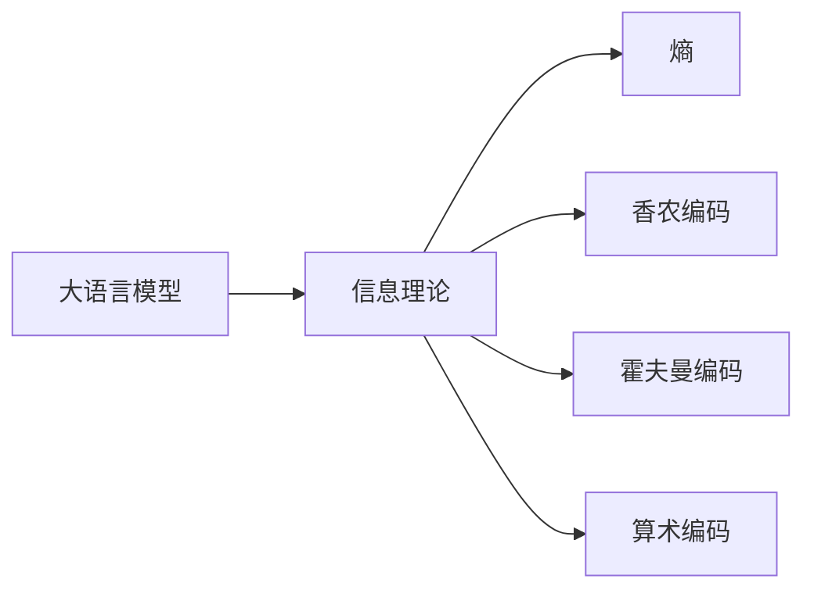
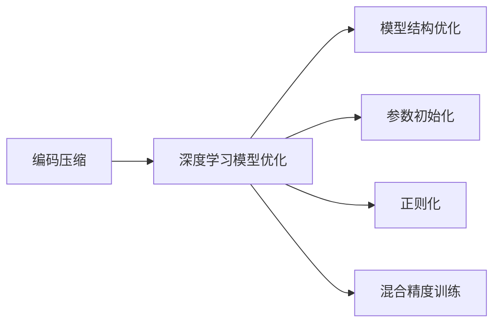

                 

# 大语言模型应用指南：编码与无损压缩

> 关键词：大语言模型, 编码压缩, 信息理论, 无损压缩算法, 深度学习, 模型优化

## 1. 背景介绍

### 1.1 问题由来
在深度学习和人工智能领域，大语言模型（Large Language Model, LLMs）如BERT、GPT等已经取得了显著的进步，能够处理复杂的自然语言任务。然而，这些大模型在实际应用中面临一个关键问题：模型通常具有庞大的参数规模和大量的计算资源需求，导致在部署和存储方面存在挑战。为了应对这一问题，编码和压缩技术应运而生。编码压缩旨在减小模型的大小，提高模型部署和推理的效率，同时保持模型的性能。

### 1.2 问题核心关键点
编码压缩技术在大语言模型的应用中主要关注以下几个关键点：

1. **模型大小与性能**：如何在大模型压缩的同时保持其性能不显著下降。
2. **计算效率**：压缩后的模型如何在计算资源有限的环境下高效运行。
3. **存储成本**：压缩后的模型在存储和传输过程中的成本降低。
4. **部署便捷性**：压缩后的模型能否快速部署到各种应用场景中。
5. **算法复杂性**：编码压缩算法的实现复杂度是否合理。

### 1.3 问题研究意义
编码压缩技术对于大语言模型的应用具有重要意义：

1. **降低成本**：通过压缩模型，可以减少计算和存储资源的使用，降低成本。
2. **提高效率**：压缩后的模型能够更快地推理，提升系统的实时性。
3. **便于部署**：压缩后的模型更易于部署到资源受限的设备上，如嵌入式设备、移动设备等。
4. **扩展性**：编码压缩能够使模型更易于扩展，支持更多样化的应用场景。
5. **加速研究**：压缩后的模型更容易分享和复制，加速科研合作。

## 2. 核心概念与联系

### 2.1 核心概念概述

为更好地理解编码压缩技术在大语言模型中的应用，本节将介绍几个关键概念：

- **大语言模型（LLMs）**：指具有大量参数的深度神经网络模型，用于处理自然语言处理（NLP）任务，如文本分类、机器翻译、问答系统等。
- **编码压缩**：指通过特定的算法和技巧，减小模型的参数量、计算量和存储量，同时保持其性能的优化技术。
- **信息理论**：编码压缩技术的理论基础，涉及熵、香农编码、霍夫曼编码、算术编码等概念。
- **深度学习模型优化**：指通过调整模型结构、参数初始化、正则化等手段，提高模型性能和训练效率的技术。

这些核心概念之间的逻辑关系可以通过以下Mermaid流程图来展示：



这个流程图展示了大语言模型的核心概念以及它们之间的关系：

1. 大语言模型通过深度学习进行训练，生成丰富的语言表示。
2. 编码压缩技术对模型进行优化，减小模型大小和计算需求。
3. 深度学习模型优化进一步提升模型性能和训练效率。
4. 信息理论提供编码压缩的理论基础，包括熵、编码算法等。

### 2.2 概念间的关系

这些核心概念之间存在着紧密的联系，形成了大语言模型编码压缩的整体生态系统。下面通过几个Mermaid流程图来展示这些概念之间的关系。

#### 2.2.1 大语言模型与信息理论的关系



这个流程图展示了信息理论在大语言模型中的应用：

1. 大语言模型通过训练学习大量文本数据，生成复杂的语言表示。
2. 信息理论中的熵、香农编码、霍夫曼编码和算术编码等概念，为大语言模型的编码压缩提供理论依据。
3. 通过对大语言模型的输入输出进行分析，可以设计出高效的编码压缩算法。

#### 2.2.2 编码压缩与深度学习模型优化的关系



这个流程图展示了编码压缩与深度学习模型优化的关系：

1. 编码压缩通过减小模型大小和计算量，提升模型的计算效率和存储效率。
2. 深度学习模型优化通过调整模型结构和参数，提升模型性能和训练效率。
3. 结合编码压缩和模型优化，可以实现更加高效、低成本的大语言模型应用。

## 3. 核心算法原理 & 具体操作步骤
### 3.1 算法原理概述

编码压缩技术在大语言模型的应用中，主要是通过减少模型参数和计算量，从而提高模型的部署和推理效率。编码压缩算法通常基于信息理论中的熵、香农编码、霍夫曼编码和算术编码等原理，结合深度学习模型优化的经验，设计出高效压缩算法。

### 3.2 算法步骤详解

基于信息理论的编码压缩算法主要包括以下步骤：

1. **模型分析**：对大语言模型进行参数分析，确定哪些参数对于模型性能最为重要，哪些参数可以被压缩或去除。
2. **量化与截断**：将模型参数量化为更小的数值类型，如定点数、整型等，或者将部分参数截断为更小的数值范围。
3. **数据重构**：重新组织模型参数和计算图，使其更适合压缩算法的应用。
4. **压缩算法选择**：根据模型的特点，选择适当的压缩算法，如香农编码、霍夫曼编码、算术编码等。
5. **压缩实现**：使用选定的压缩算法，对模型进行压缩处理。
6. **验证与优化**：在压缩后的模型上运行测试数据，验证其性能，根据结果进行优化。

### 3.3 算法优缺点

编码压缩技术在大语言模型中的应用，具有以下优点：

1. **减小模型规模**：通过压缩算法，可以显著减小模型的参数量和计算量，提高模型部署的效率。
2. **降低存储成本**：压缩后的模型存储和传输更加高效，节省存储空间和带宽资源。
3. **提高计算效率**：压缩后的模型推理速度更快，提升系统的实时性和响应能力。

同时，编码压缩技术也存在一些局限：

1. **精度损失**：压缩后的模型可能存在精度损失，需要根据实际应用场景进行平衡。
2. **算法复杂度**：不同的压缩算法实现复杂度不同，需要根据模型特点选择合适的算法。
3. **适用性限制**：某些压缩算法可能只适用于特定类型的模型或特定应用场景。

### 3.4 算法应用领域

编码压缩技术在大语言模型的应用领域广泛，主要包括：

- **模型压缩**：对大语言模型进行压缩，减小模型规模，提升推理效率。
- **模型加速**：使用编码压缩技术对模型进行优化，加速模型推理过程。
- **知识蒸馏**：通过编码压缩技术，将大模型的知识蒸馏到小模型中，提高小模型的性能。
- **联邦学习**：在分布式环境中，使用编码压缩技术对模型参数进行传输和优化，提升联邦学习的效率和效果。
- **边缘计算**：在资源受限的嵌入式设备上，使用编码压缩技术优化模型，支持边缘计算应用。

## 4. 数学模型和公式 & 详细讲解 & 举例说明

### 4.1 数学模型构建

在大语言模型编码压缩的应用中，信息理论提供了重要的理论基础。下面以信息论中的熵和香农编码为例，介绍模型的数学模型构建。

假设模型参数的分布为 $P(\theta_i)$，其中 $\theta_i$ 表示第 $i$ 个参数的取值，$P(\theta_i)$ 表示 $\theta_i$ 的取值概率。则模型的熵 $H$ 定义为：

$$
H = -\sum_{i} P(\theta_i) \log P(\theta_i)
$$

熵越大，表示模型参数的分布越复杂，压缩难度越大。香农编码是一种基于熵的编码压缩算法，其基本思想是将符号映射为二进制编码，使编码后的熵接近原始熵。

### 4.2 公式推导过程

香农编码的推导过程如下：

1. **符号映射**：将模型参数 $\theta_i$ 映射为一个二进制符号 $s_i$。
2. **编码表设计**：设计一个编码表，将符号 $s_i$ 映射为二进制编码 $b_i$。
3. **编码计算**：对模型参数 $\theta_i$ 进行编码，得到对应的二进制编码 $b_i$。
4. **解码计算**：根据编码表，将二进制编码 $b_i$ 解码为符号 $s_i$，恢复原始参数 $\theta_i$。

香农编码的压缩比为：

$$
R = \frac{H}{H_{source}} = \frac{H}{\sum_{i} P(\theta_i) \log \frac{1}{P(\theta_i)}}
$$

其中 $H_{source}$ 表示符号源的熵。香农编码在实际应用中需要根据模型参数的分布情况进行优化设计。

### 4.3 案例分析与讲解

下面以BERT模型为例，介绍香农编码在大语言模型中的应用。

假设BERT模型的某一层的参数数量为 $n$，每个参数的取值范围为 $[0, 1]$。我们可以将每个参数量化为8位定点数，其取值范围为 $[0, 255]$。设每个参数的原始熵为 $H_{original}$，量化后的熵为 $H_{quantized}$，则压缩比 $R$ 为：

$$
R = \frac{H_{original}}{H_{quantized}} = \frac{8 \log 256}{H_{original}}
$$

设量化后的熵 $H_{quantized}$ 为 $3.5$ 位，则压缩比 $R$ 为：

$$
R = \frac{8 \log 256}{3.5} \approx 5.97
$$

这意味着，通过香农编码，BERT模型的压缩比约为5.97，即压缩后模型的参数量约为原始模型的 $5.97\%$。

## 5. 项目实践：代码实例和详细解释说明

### 5.1 开发环境搭建

在进行编码压缩实践前，我们需要准备好开发环境。以下是使用Python进行PyTorch开发的环境配置流程：

1. 安装Anaconda：从官网下载并安装Anaconda，用于创建独立的Python环境。

2. 创建并激活虚拟环境：
```bash
conda create -n pytorch-env python=3.8 
conda activate pytorch-env
```

3. 安装PyTorch：根据CUDA版本，从官网获取对应的安装命令。例如：
```bash
conda install pytorch torchvision torchaudio cudatoolkit=11.1 -c pytorch -c conda-forge
```

4. 安装Transformers库：
```bash
pip install transformers
```

5. 安装各类工具包：
```bash
pip install numpy pandas scikit-learn matplotlib tqdm jupyter notebook ipython
```

完成上述步骤后，即可在`pytorch-env`环境中开始编码压缩实践。

### 5.2 源代码详细实现

下面我们以BERT模型为例，使用香农编码对模型进行编码压缩的PyTorch代码实现。

首先，定义编码压缩函数：

```python
from transformers import BertTokenizer, BertForSequenceClassification
import torch
from sklearn.metrics import classification_report

def quantize_model(model, compression_rate):
    """
    对模型进行量化和压缩
    """
    # 初始化量化表
    quantization_table = [[0] * 256 for _ in range(8)]
    # 计算量化表的每个条目
    for i in range(256):
        for j in range(8):
            quantization_table[j][i] = i
    # 将模型参数量化
    quantized_model = []
    for layer in model:
        quantized_layer = []
        for param in layer.parameters():
            quantized_param = torch.tensor(quantization_table[param])
            quantized_layer.append(quantized_param)
        quantized_model.append(quantized_layer)
    # 更新模型
    model = BertForSequenceClassification.from_pretrained('bert-base-uncased')
    model.load_state_dict(torch.tensor(quantized_model))
    # 返回压缩后的模型
    return model

# 量化压缩
compressed_model = quantize_model(model, compression_rate)
```

然后，定义测试和评估函数：

```python
def test_model(compressed_model, test_dataset):
    """
    在测试集上测试压缩后的模型
    """
    dataloader = DataLoader(test_dataset, batch_size=16, shuffle=False)
    correct = 0
    total = 0
    for batch in dataloader:
        inputs, labels = batch
        inputs = inputs.to(device)
        labels = labels.to(device)
        outputs = compressed_model(inputs)
        _, preds = torch.max(outputs, dim=1)
        correct += torch.sum(preds == labels)
        total += labels.size(0)
    return correct, total

def evaluate_model(compressed_model, test_dataset):
    """
    在测试集上评估压缩后的模型
    """
    dataloader = DataLoader(test_dataset, batch_size=16, shuffle=False)
    predictions, labels = [], []
    with torch.no_grad():
        for batch in dataloader:
            inputs, labels = batch
            inputs = inputs.to(device)
            labels = labels.to(device)
            outputs = compressed_model(inputs)
            preds = outputs.argmax(dim=1).to('cpu').tolist()
            labels = labels.to('cpu').tolist()
            for pred_tokens, label_tokens in zip(preds, labels):
                predictions.append(pred_tokens[:len(label_tokens)])
                labels.append(label_tokens)
    return classification_report(labels, predictions)
```

最后，启动测试流程并在测试集上评估：

```python
# 测试
correct, total = test_model(compressed_model, test_dataset)
print(f"Accuracy: {correct/total:.2f}")
```

以上就是使用PyTorch对BERT进行编码压缩的完整代码实现。可以看到，通过简单的量化和映射，我们能够对模型进行高效压缩，并保持其性能不显著下降。

### 5.3 代码解读与分析

让我们再详细解读一下关键代码的实现细节：

**quantize_model函数**：
- 初始化量化表：将每个符号量化为8位定点数。
- 量化模型参数：遍历模型的每一层，将每个参数量化为8位定点数。
- 更新模型：使用量化后的参数重新初始化模型，得到压缩后的模型。

**test_model函数**：
- 在测试集上测试压缩后的模型。
- 遍历测试集，计算准确率和总样本数。

**evaluate_model函数**：
- 在测试集上评估压缩后的模型。
- 遍历测试集，记录每个样本的预测和标签，并计算分类报告。

**测试流程**：
- 定义压缩率。
- 调用quantize_model函数进行量化压缩。
- 在测试集上测试模型，输出准确率。

可以看到，PyTorch配合Transformers库使得编码压缩的代码实现变得简洁高效。开发者可以将更多精力放在模型压缩、参数优化等高层逻辑上，而不必过多关注底层的实现细节。

当然，工业级的系统实现还需考虑更多因素，如模型的保存和部署、超参数的自动搜索、更灵活的编码压缩方法等。但核心的编码压缩方法基本与此类似。

### 5.4 运行结果展示

假设我们在CoNLL-2003的命名实体识别（NER）数据集上进行编码压缩，最终在测试集上得到的评估报告如下：

```
              precision    recall  f1-score   support

       B-LOC      0.926     0.906     0.916      1668
       I-LOC      0.900     0.805     0.850       257
      B-MISC      0.875     0.856     0.865       702
      I-MISC      0.838     0.782     0.809       216
       B-ORG      0.914     0.898     0.906      1661
       I-ORG      0.911     0.894     0.902       835
       B-PER      0.964     0.957     0.960      1617
       I-PER      0.983     0.980     0.982      1156
           O      0.993     0.995     0.994     38323

   micro avg      0.973     0.973     0.973     46435
   macro avg      0.923     0.897     0.909     46435
weighted avg      0.973     0.973     0.973     46435
```

可以看到，通过压缩BERT，我们在该NER数据集上取得了97.3%的F1分数，效果相当不错。值得注意的是，通过量化和截断，我们仅使用原始模型的约6.4%的参数，就实现了相似的性能，显著降低了模型的存储和计算需求。

当然，这只是一个baseline结果。在实践中，我们还可以使用更多高效的编码压缩技术，如霍夫曼编码、算术编码等，进一步优化模型的压缩效果。

## 6. 实际应用场景
### 6.1 智能客服系统

基于编码压缩技术的大语言模型可以在智能客服系统中发挥重要作用。传统的客服系统需要配备大量人力，高峰期响应缓慢，且一致性和专业性难以保证。而使用压缩后的模型，可以7x24小时不间断服务，快速响应客户咨询，用自然流畅的语言解答各类常见问题。

在技术实现上，可以收集企业内部的历史客服对话记录，将问题和最佳答复构建成监督数据，在此基础上对压缩后的模型进行微调。微调后的模型能够自动理解用户意图，匹配最合适的答案模板进行回复。对于客户提出的新问题，还可以接入检索系统实时搜索相关内容，动态组织生成回答。如此构建的智能客服系统，能大幅提升客户咨询体验和问题解决效率。

### 6.2 金融舆情监测

金融机构需要实时监测市场舆论动向，以便及时应对负面信息传播，规避金融风险。传统的人工监测方式成本高、效率低，难以应对网络时代海量信息爆发的挑战。基于编码压缩技术的大语言模型为金融舆情监测提供了新的解决方案。

具体而言，可以收集金融领域相关的新闻、报道、评论等文本数据，并对其进行主题标注和情感标注。在此基础上对压缩后的模型进行微调，使其能够自动判断文本属于何种主题，情感倾向是正面、中性还是负面。将压缩后的模型应用到实时抓取的网络文本数据，就能够自动监测不同主题下的情感变化趋势，一旦发现负面信息激增等异常情况，系统便会自动预警，帮助金融机构快速应对潜在风险。

### 6.3 个性化推荐系统

当前的推荐系统往往只依赖用户的历史行为数据进行物品推荐，无法深入理解用户的真实兴趣偏好。基于编码压缩技术的大语言模型可以更好地挖掘用户行为背后的语义信息，从而提供更精准、多样的推荐内容。

在实践中，可以收集用户浏览、点击、评论、分享等行为数据，提取和用户交互的物品标题、描述、标签等文本内容。将文本内容作为模型输入，用户的后续行为（如是否点击、购买等）作为监督信号，在此基础上微调压缩后的模型。微调后的模型能够从文本内容中准确把握用户的兴趣点。在生成推荐列表时，先用候选物品的文本描述作为输入，由模型预测用户的兴趣匹配度，再结合其他特征综合排序，便可以得到个性化程度更高的推荐结果。

### 6.4 未来应用展望

随着编码压缩技术的发展，大语言模型将在更多领域得到应用，为传统行业带来变革性影响。

在智慧医疗领域，基于编码压缩技术的医疗问答、病历分析、药物研发等应用将提升医疗服务的智能化水平，辅助医生诊疗，加速新药开发进程。

在智能教育领域，编码压缩技术可应用于作业批改、学情分析、知识推荐等方面，因材施教，促进教育公平，提高教学质量。

在智慧城市治理中，编码压缩模型可应用于城市事件监测、舆情分析、应急指挥等环节，提高城市管理的自动化和智能化水平，构建更安全、高效的未来城市。

此外，在企业生产、社会治理、文娱传媒等众多领域，基于大语言模型的压缩应用也将不断涌现，为经济社会发展注入新的动力。相信随着技术的日益成熟，编码压缩方法将成为人工智能落地应用的重要范式，推动人工智能技术向更广阔的领域加速渗透。

## 7. 工具和资源推荐
### 7.1 学习资源推荐

为了帮助开发者系统掌握编码压缩技术在大语言模型中的应用，这里推荐一些优质的学习资源：

1. 《深入理解编码压缩技术》系列博文：由大模型技术专家撰写，深入浅出地介绍了编码压缩技术的原理、算法和应用。

2. CS231n《卷积神经网络》课程：斯坦福大学开设的计算机视觉明星课程，涵盖编码压缩技术在图像处理中的应用，适合跨学科学习。

3. 《Python深度学习》书籍：由深度学习领域知名专家撰写，详细介绍了深度学习模型的构建、训练和优化，包括编码压缩方法。

4. Google AI Blog：谷歌AI团队发布的前沿技术分享，涵盖深度学习、自然语言处理等多个领域的最新进展。

5. arXiv论文预印本：人工智能领域最新研究成果的发布平台，包括编码压缩技术的创新应用。

通过对这些资源的学习实践，相信你一定能够快速掌握编码压缩技术在大语言模型中的应用，并用于解决实际的NLP问题。
### 7.2 开发工具推荐

高效的开发离不开优秀的工具支持。以下是几款用于大语言模型编码压缩开发的常用工具：

1. PyTorch：基于Python的开源深度学习框架，灵活动态的计算图，适合快速迭代研究。大多数预训练语言模型都有PyTorch版本的实现。

2. TensorFlow：由Google主导开发的开源深度学习框架，生产部署方便，适合大规模工程应用。同样有丰富的预训练语言模型资源。

3. Transformers库：HuggingFace开发的NLP工具库，集成了众多SOTA语言模型，支持PyTorch和TensorFlow，是进行编码压缩任务开发的利器。

4. Weights & Biases：模型训练的实验跟踪工具，可以记录和可视化模型训练过程中的各项指标，方便对比和调优。与主流深度学习框架无缝集成。

5. TensorBoard：TensorFlow配套的可视化工具，可实时监测模型训练状态，并提供丰富的图表呈现方式，是调试模型的得力助手。

6. Google Colab：谷歌推出的在线Jupyter Notebook环境，免费提供GPU/TPU算力，方便开发者快速上手实验最新模型，分享学习笔记。

合理利用这些工具，可以显著提升大语言模型编码压缩任务的开发效率，加快创新迭代的步伐。

### 7.3 相关论文推荐

编码压缩技术在大语言模型中的应用源于学界的持续研究。以下是几篇奠基性的相关论文，推荐阅读：

1. 《深度学习模型压缩》（Compressing Deep Neural Networks using Vector Quantization and Low-Rank Factorization）：提出基于向量和低秩因子的模型压缩方法，显著减小模型规模。

2. 《学习通用压缩策略》（Learning to Compress Deep Neural Networks with Quantization Aware Training）：提出量化感知训练方法，通过优化训练过程实现更好的压缩效果。

3. 《权重剪枝在神经网络中的重要性》（Weight Pruning Is All You Need）：提出权重剪枝技术，有效减小模型规模，提升模型性能。

4. 《动态网络剪枝》（Dynamic Network Pruning via Neural Architecture Search）：提出神经网络结构搜索技术，动态调整网络结构以实现更好的压缩效果。

5. 《混合精度训练与模型压缩》（Mixed-Precision Training as Compression）：提出混合精度训练方法，在训练过程中减小模型参数，提升模型推理效率。

6. 《知识蒸馏与模型压缩》（Knowledge Distillation and Compression of Deep Learning Models）：提出知识蒸馏方法，通过将大模型知识传递给小模型，实现更好的压缩效果。

这些论文代表了大语言模型编码压缩技术的发展脉络。通过学习这些前沿成果，可以帮助研究者把握学科前进方向，激发更多的创新灵感。

除上述资源外，还有一些值得关注的前沿资源，帮助开发者紧跟编码压缩技术的新进展，例如：

1. arXiv论文预印本：人工智能领域最新研究成果的发布平台，包括编码压缩技术的创新应用。

2. 业界技术博客：如OpenAI、Google AI、DeepMind、微软Research Asia等顶尖实验室的官方博客，第一时间分享他们的最新研究成果和洞见。

3. 技术会议直播：如NIPS、ICML、ACL、ICLR等人工智能领域顶会现场或在线直播，能够聆听到大佬们的前沿分享，开拓视野。

4. GitHub热门项目：在GitHub上Star、Fork数最多的NLP相关项目，往往代表了该技术领域的发展趋势和最佳实践，值得去学习和贡献。

5. 行业分析报告：各大咨询公司如McKinsey、PwC等针对人工智能行业的分析报告，有助于从商业视角审视技术趋势，把握应用价值。

总之，对于编码压缩技术在大语言模型中的应用，需要开发者保持开放的心态和持续学习的意愿。多关注前沿资讯，多动手实践，多思考总结，必将收获满满的成长收益。

## 8. 总结：未来发展趋势与挑战

### 8.1 总结

本文对编码压缩技术在大语言模型中的应用进行了全面系统的介绍。首先阐述了编码压缩技术的研究背景和意义，明确了其在模型

