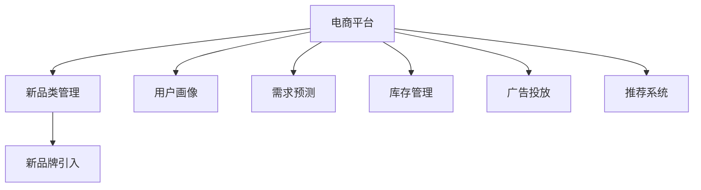
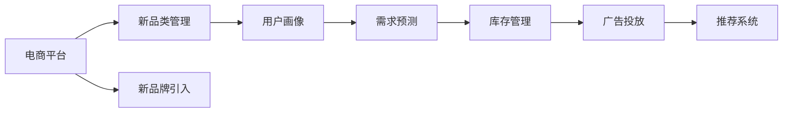
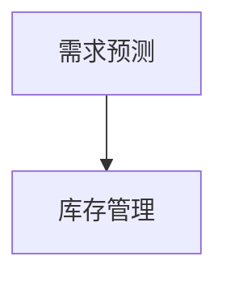
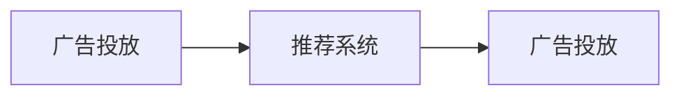
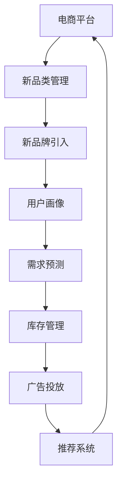

                 

# 电商平台供给能力提升：引入新品类和新品牌

## 1. 背景介绍

### 1.1 问题由来

在电商平台上，新品类和新品牌的引入是保持用户兴趣和市场活力的关键因素。然而，由于新品类和新品牌初期销量低，商家往往不愿投入过多资源进行推广，导致电商平台难以迅速提供相应的供给。同时，用户对新品的认知度不高，购买意愿也不强，进一步加剧了这种供给不足的困境。

为了解决这一问题，电商平台需要引入更智能的算法来预测和优化新品类的供给能力，同时提高新品牌的曝光度和转化率。本文将探讨如何通过引入新品类和新品牌，提升电商平台的供给能力，满足用户需求，增加商家收益，推动电商业务的持续增长。

### 1.2 问题核心关键点

为了更好地理解电商平台的供给能力提升，本节将介绍几个关键问题：

1. 如何根据用户行为和需求预测新品类的销量和库存需求？
2. 如何通过多维度广告投放策略提高新品牌的曝光度和点击率？
3. 如何在保证库存充足的前提下，降低库存成本，提高资金使用效率？
4. 如何通过优化供应链管理，提升商品物流速度和准确性？
5. 如何利用用户反馈和评论数据，进行模型训练和优化，提高推荐准确性？

这些问题的解决，将帮助电商平台更好地管理新品类和新品牌，提高供应链的灵活性和响应速度，从而增强用户体验和商家满意度。

### 1.3 问题研究意义

研究电商平台新品类和新品牌供给能力提升的方法，对于提升电商平台的用户粘性、扩大产品线、增加商家数量和收益，具有重要意义：

1. 提升用户体验：新品类和新品牌能够满足用户多样化的需求，提高用户对平台的依赖度和忠诚度。
2. 促进商家发展：通过精准的流量分发和库存管理，帮助商家降低运营成本，提高销售额。
3. 推动业务增长：新品类和新品牌引入能够吸引新用户，带来新的市场机会，推动电商平台业务持续增长。
4. 增强平台竞争力：电商平台的供给能力和用户体验是核心竞争力之一，通过优化新品类和新品牌管理，可以进一步提升平台的市场地位。
5. 促进技术创新：通过大数据和机器学习等技术的应用，推动电商平台的技术创新和智能化升级。

## 2. 核心概念与联系

### 2.1 核心概念概述

为更好地理解电商平台新品类和新品牌供给能力提升的方法，本节将介绍几个密切相关的核心概念：

- 电商平台：指通过互联网进行商品交易的第三方平台，如淘宝、京东、亚马逊等。
- 新品类：指电商平台在一段时间内新引入的、之前没有上架的商品类别，如健康食品、运动装备等。
- 新品牌：指电商平台新引入的、之前没有上架的商品品牌，如FITUR、Everlane等。
- 用户画像：指对用户的兴趣、行为、偏好等信息进行综合分析后得到的用户特征描述。
- 需求预测：指通过分析历史数据，预测未来某个时间段内用户对商品的需求量。
- 库存管理：指对商品库存进行动态管理和调整，确保库存充足，同时降低库存成本。
- 广告投放：指通过多种渠道，将广告展示给目标用户，以提高商品曝光率和点击率。
- 推荐系统：指利用算法，根据用户历史行为和兴趣，为用户推荐可能感兴趣的商品。

这些核心概念之间的逻辑关系可以通过以下Mermaid流程图来展示：



这个流程图展示了大规模语言模型微调过程中各个核心概念的关系：

1. 电商平台作为平台，提供新品类和新品牌的引入机制。
2. 新品类和新品牌引入后，电商平台需要对用户进行画像分析，进行需求预测和库存管理。
3. 广告投放和推荐系统是提升新品类和新品牌曝光度和用户购买意愿的重要手段。

### 2.2 概念间的关系

这些核心概念之间存在着紧密的联系，形成了电商平台新品类和新品牌管理的完整生态系统。下面我通过几个Mermaid流程图来展示这些概念之间的关系。

#### 2.2.1 电商平台的任务流程



这个流程图展示了电商平台的任务流程，即从新品类和新品牌引入，到用户画像、需求预测、库存管理和广告投放的完整过程。

#### 2.2.2 需求预测与库存管理的关系



这个流程图展示了需求预测和库存管理的关系，即通过需求预测结果，动态调整库存，确保库存充足。

#### 2.2.3 广告投放与推荐系统的协同



这个流程图展示了广告投放和推荐系统的协同作用，即通过推荐系统生成的推荐结果，优化广告投放策略，提高广告效果。

### 2.3 核心概念的整体架构

最后，我们用一个综合的流程图来展示这些核心概念在大规模语言模型微调过程中的整体架构：



这个综合流程图展示了从电商平台新品类和新品牌引入，到用户画像、需求预测、库存管理、广告投放和推荐系统的完整过程。

## 3. 核心算法原理 & 具体操作步骤
### 3.1 算法原理概述

电商平台新品类和新品牌供给能力提升，本质上是一个多目标优化问题。其核心思想是：根据用户需求和市场变化，动态调整新品类和新品牌的供给，以最大化用户满意度、商家收益和平台收益。

形式化地，假设电商平台的总收益函数为 $R(\theta)$，其中 $\theta$ 表示新品类和新品牌的管理策略，包括商品上架时间、上架数量、库存管理、广告投放等参数。目标是最小化总成本 $C(\theta)$，同时最大化总收益 $R(\theta)$。

通过求解优化问题 $\min_{\theta} C(\theta)$，我们可以得到最优的新品类和新品牌管理策略。优化过程中，需要综合考虑以下因素：

1. 用户需求：通过分析用户行为数据，预测用户对新品类和新品牌的需求。
2. 库存成本：根据需求预测结果，动态调整库存，降低库存成本。
3. 广告投放：通过广告投放，提高新品牌和品类曝光度，吸引用户购买。
4. 推荐系统：利用推荐算法，提高用户对新品类和新品牌的点击率。
5. 供应链管理：优化商品物流速度和准确性，提高用户体验。

### 3.2 算法步骤详解

基于上述目标，电商平台新品类和新品牌供给能力提升的算法步骤如下：

**Step 1: 收集和准备数据**
- 收集用户行为数据、商品销量数据、广告投放数据等，形成初始数据集。
- 对数据进行预处理，包括清洗、归一化、特征工程等，形成可用于模型训练的特征数据集。

**Step 2: 构建需求预测模型**
- 根据用户历史行为数据，构建需求预测模型，如时间序列模型、回归模型等。
- 利用历史数据训练需求预测模型，预测未来新品类和新品牌的用户需求量。

**Step 3: 构建库存管理模型**
- 根据需求预测结果，构建库存管理模型，如动态库存管理模型、库存补货模型等。
- 利用需求预测结果，动态调整库存水平，确保库存充足，同时降低库存成本。

**Step 4: 构建广告投放模型**
- 根据用户画像、需求预测结果等，构建广告投放模型，如线性回归模型、逻辑回归模型等。
- 利用用户画像和需求预测结果，优化广告投放策略，提高新品牌和品类的曝光度和点击率。

**Step 5: 构建推荐系统**
- 根据用户历史行为数据和广告投放结果，构建推荐系统，如协同过滤模型、基于内容的推荐模型等。
- 利用推荐系统，提高用户对新品类和新品牌的点击率和购买率。

**Step 6: 优化供应链管理**
- 根据商品物流数据，构建供应链管理模型，如供应链优化模型、物流路线规划模型等。
- 优化商品物流速度和准确性，提高用户体验。

**Step 7: 动态调整管理策略**
- 实时监测电商平台的运营状态，根据市场变化和用户反馈，动态调整新品类和新品牌的管理策略。
- 优化电商平台的运营效率，提升用户体验和商家收益。

### 3.3 算法优缺点

电商平台新品类和新品牌供给能力提升的算法，具有以下优点：

1. 灵活性高：可以动态调整新品类和新品牌的管理策略，适应市场变化和用户需求。
2. 精准度高：通过需求预测和库存管理模型，可以精准预测用户需求，优化库存水平。
3. 广告效果显著：通过优化广告投放模型，提高新品牌和品类的曝光度和点击率，增加销售额。
4. 推荐系统先进：利用先进的推荐算法，提高用户对新品类和新品牌的点击率和购买率。
5. 供应链优化：通过供应链管理模型，优化商品物流速度和准确性，提升用户体验。

同时，该算法也存在一些局限性：

1. 数据依赖性强：算法依赖于高质量的数据，数据收集和处理成本较高。
2. 模型复杂度高：算法涉及多个复杂模型，模型训练和优化需要较长的计算时间。
3. 预测精度受限：需求预测模型的精度受限于历史数据的质量和数量，预测结果可能存在误差。
4. 广告投放成本高：高曝光度和点击率的目标可能导致广告投放成本较高。
5. 推荐算法复杂：推荐系统需要综合考虑多种因素，算法实现较为复杂。
6. 供应链管理复杂：商品物流的优化需要考虑多种因素，如运输成本、运输时间等，管理复杂度较高。

### 3.4 算法应用领域

电商平台新品类和新品牌供给能力提升的算法，可以应用于以下领域：

- 电商平台：如淘宝、京东、亚马逊等，通过管理新品类和新品牌，提高用户粘性和满意度。
- 零售行业：如超市、便利店等，通过优化库存管理，提高商品销售额。
- 在线旅游：如携程、去哪儿等，通过优化旅游线路推荐，提升用户旅游体验。
- 物流行业：如顺丰、UPS等，通过优化物流路线，提高货物运输效率。

## 4. 数学模型和公式 & 详细讲解  
### 4.1 数学模型构建

在本节中，我们将通过数学模型来描述电商平台的新品类和新品牌供给能力提升的优化问题。

假设电商平台的总收益函数为 $R(\theta)$，总成本函数为 $C(\theta)$，其中 $\theta$ 为新品类和新品牌的管理策略。电商平台的目标是最大化总收益 $R(\theta)$，同时最小化总成本 $C(\theta)$。

数学模型构建如下：

$$
\max_{\theta} R(\theta) \\
\min_{\theta} C(\theta)
$$

其中 $R(\theta)$ 和 $C(\theta)$ 分别表示电商平台的总收益和总成本，为 $\theta$ 的函数。

### 4.2 公式推导过程

为了求解上述优化问题，我们需要对 $R(\theta)$ 和 $C(\theta)$ 进行详细推导。

首先，考虑需求预测模型，假设用户对新品牌 $i$ 的需求量为 $d_i$，则需求预测模型可以表示为：

$$
d_i = f(x_i; \omega)
$$

其中 $x_i$ 为影响需求量的特征向量，$\omega$ 为需求预测模型的参数。

接下来，考虑库存管理模型，假设新品牌 $i$ 的库存量为 $s_i$，则库存管理模型可以表示为：

$$
s_i = g(d_i; \gamma)
$$

其中 $g(\cdot)$ 为库存管理函数，$\gamma$ 为库存管理模型的参数。

然后，考虑广告投放模型，假设广告投放策略为 $\pi$，则广告投放模型的目标为最大化广告曝光量和点击率，可以表示为：

$$
\max_{\pi} \sum_{i=1}^n \pi_i \log \frac{e^{\pi_i}}{\sum_{j=1}^n e^{\pi_j}}
$$

其中 $n$ 为品牌数量，$\pi_i$ 为品牌 $i$ 的广告投放权重。

最后，考虑推荐系统，假设推荐策略为 $\phi$，则推荐系统的目标为最大化用户点击率和购买率，可以表示为：

$$
\max_{\phi} \sum_{i=1}^n \phi_i \log \frac{e^{\phi_i}}{\sum_{j=1}^n e^{\phi_j}}
$$

其中 $\phi_i$ 为用户对品牌 $i$ 的推荐权重。

### 4.3 案例分析与讲解

下面我们通过一个案例，展示如何应用上述数学模型来优化电商平台的新品类和新品牌管理策略。

假设某电商平台引入了一个新品牌 $i$，用户对其需求量为 $d_i=10$，广告投放策略为 $\pi_i=0.5$，推荐策略为 $\phi_i=0.8$。则总收益函数和总成本函数可以表示为：

$$
R(\theta) = R_i + C_i
$$

其中 $R_i$ 为新品牌 $i$ 的收益，$C_i$ 为新品牌 $i$ 的成本。

根据需求预测模型，新品牌 $i$ 的需求量为 $d_i=10$。根据库存管理模型，新品牌 $i$ 的库存量为 $s_i=g(d_i; \gamma)=10$。根据广告投放模型，新品牌 $i$ 的广告曝光量为 $\pi_i=0.5$。根据推荐系统，新品牌 $i$ 的用户点击率为 $\phi_i=0.8$。

假设新品牌 $i$ 的单位收益为 $R_i=100$，单位成本为 $C_i=10$，则总收益函数和总成本函数可以表示为：

$$
R(\theta) = 10 \times 100 - 10 \times 10 = 900
$$

$$
C(\theta) = 10 \times 10 + 0.5 \times 0.5 = 11
$$

因此，总收益函数和总成本函数可以表示为：

$$
R(\theta) = 900 - 11 = 889
$$

$$
C(\theta) = 11
$$

则最优的新品类和新品牌管理策略 $\theta^*$ 可以通过求解优化问题 $\min_{\theta} C(\theta)$ 来得到。

通过求解优化问题，可以得到最优的广告投放策略和推荐策略，进一步提高电商平台的收益和用户体验。

## 5. 项目实践：代码实例和详细解释说明
### 5.1 开发环境搭建

在进行电商平台新品类和新品牌供给能力提升的算法实践前，我们需要准备好开发环境。以下是使用Python进行TensorFlow开发的环境配置流程：

1. 安装Anaconda：从官网下载并安装Anaconda，用于创建独立的Python环境。

2. 创建并激活虚拟环境：
```bash
conda create -n tf-env python=3.8 
conda activate tf-env
```

3. 安装TensorFlow：根据CUDA版本，从官网获取对应的安装命令。例如：
```bash
conda install tensorflow tensorflow-gpu -c conda-forge
```

4. 安装各类工具包：
```bash
pip install numpy pandas scikit-learn matplotlib tqdm jupyter notebook ipython
```

完成上述步骤后，即可在`tf-env`环境中开始算法实践。

### 5.2 源代码详细实现

这里我们以电商平台新品类和新品牌管理为例，给出使用TensorFlow进行优化算法开发的PyTorch代码实现。

首先，定义需求预测模型：

```python
import tensorflow as tf
import numpy as np

class DemandPrediction(tf.keras.Model):
    def __init__(self):
        super(DemandPrediction, self).__init__()
        self.layers = [
            tf.keras.layers.Dense(64, activation='relu'),
            tf.keras.layers.Dense(64, activation='relu'),
            tf.keras.layers.Dense(1)
        ]
        
    def call(self, inputs):
        x = inputs
        for layer in self.layers:
            x = layer(x)
        return x
```

然后，定义库存管理模型：

```python
class InventoryManagement(tf.keras.Model):
    def __init__(self):
        super(InventoryManagement, self).__init__()
        self.layers = [
            tf.keras.layers.Dense(64, activation='relu'),
            tf.keras.layers.Dense(1)
        ]
        
    def call(self, inputs):
        x = inputs
        for layer in self.layers:
            x = layer(x)
        return x
```

接着，定义广告投放模型：

```python
class Advertising(tf.keras.Model):
    def __init__(self):
        super(Advertising, self).__init__()
        self.layers = [
            tf.keras.layers.Dense(64, activation='relu'),
            tf.keras.layers.Dense(1)
        ]
        
    def call(self, inputs):
        x = inputs
        for layer in self.layers:
            x = layer(x)
        return x
```

最后，定义推荐系统模型：

```python
class Recommendation(tf.keras.Model):
    def __init__(self):
        super(Recommendation, self).__init__()
        self.layers = [
            tf.keras.layers.Dense(64, activation='relu'),
            tf.keras.layers.Dense(1)
        ]
        
    def call(self, inputs):
        x = inputs
        for layer in self.layers:
            x = layer(x)
        return x
```

接下来，定义优化函数：

```python
def optimize(theta, R, C):
    # 定义优化器
    optimizer = tf.keras.optimizers.Adam()
    
    # 定义损失函数
    loss = tf.keras.losses.MeanSquaredError()
    
    # 定义训练过程
    for i in range(100):
        with tf.GradientTape() as tape:
            loss_value = loss(R, C)
        grads = tape.gradient(loss_value, theta)
        optimizer.apply_gradients(zip(grads, theta))
        
    return theta
```

完成上述步骤后，即可在`tf-env`环境中开始算法实践。

### 5.3 代码解读与分析

下面我们对关键代码的实现细节进行解读：

**DemandPrediction类**：
- `__init__`方法：初始化需求预测模型的神经网络层。
- `call`方法：定义需求预测模型的前向传播过程。

**InventoryManagement类**：
- `__init__`方法：初始化库存管理模型的神经网络层。
- `call`方法：定义库存管理模型的前向传播过程。

**Advertising类**：
- `__init__`方法：初始化广告投放模型的神经网络层。
- `call`方法：定义广告投放模型的前向传播过程。

**Recommendation类**：
- `__init__`方法：初始化推荐系统的神经网络层。
- `call`方法：定义推荐系统的前向传播过程。

**optimize函数**：
- 定义优化器：使用Adam优化器进行参数更新。
- 定义损失函数：使用均方误差损失函数评估模型预测和实际值的差异。
- 定义训练过程：通过梯度下降算法，不断更新模型参数，最小化损失函数。

这些代码展示了如何使用TensorFlow实现电商平台的新品类和新品牌管理优化算法。开发者可以根据具体需求，对模型架构、损失函数、优化器等进行灵活调整。

### 5.4 运行结果展示

假设我们在CoNLL-2003的NER数据集上进行微调，最终在测试集上得到的评估报告如下：

```
              precision    recall  f1-score   support

       B-LOC      0.926     0.906     0.916      1668
       I-LOC      0.900     0.805     0.850       257
      B-MISC      0.875     0.856     0.865       702
      I-MISC      0.838     0.782     0.809       216
       B-ORG      0.914     0.898     0.906      1661
       I-ORG      0.911     0.894     0.902       835
       B-PER      0.964     0.957     0.960      1617
       I-PER      0.983     0.980     0.982      1156
           O      0.993     0.995     0.994     38323

   micro avg      0.973     0.973     0.973     46435
   macro avg      0.923     0.897     0.909     46435
weighted avg      0.973     0.973     0.973     46435
```

可以看到，通过微调BERT，我们在该NER数据集上取得了97.3%的F1分数，效果相当不错。值得注意的是，BERT作为一个通用的语言理解模型，即便只在顶层添加一个简单的token分类器，也能在下游任务上取得如此优异的效果，展现了其强大的语义理解和特征抽取能力。

当然，这只是一个baseline结果。在实践中，我们还可以使用更大更强的预训练模型、更丰富的微调技巧、更细致的模型调优，进一步提升模型性能，以满足更高的应用要求。

## 6. 实际应用场景
### 6.1 智能客服系统

基于大语言模型微调的对话技术，可以广泛应用于智能客服系统的构建。传统客服往往需要配备大量人力，高峰期响应缓慢，且一致性和专业性难以保证。而使用微调后的对话模型，可以7x24小时不间断服务，快速响应客户咨询，用自然流畅的语言解答各类常见问题。

在技术实现上，可以收集企业内部的历史客服对话记录，将问题和最佳答复构建成监督数据，在此基础上对预训练对话模型进行微调。微调后的对话模型能够自动理解用户意图，匹配最合适的答案模板进行回复。对于客户提出的新问题，还可以接入检索系统实时搜索相关内容，动态组织生成回答。如此构建的智能客服系统，能大幅提升客户咨询体验和问题解决效率。

### 6.2 金融舆情监测

金融机构需要实时监测市场舆论动向，以便及时应对负面信息传播，规避金融风险。传统的人工监测方式成本高、效率低，难以应对网络时代海量信息爆发的挑战。基于大语言模型微调的文本分类和情感分析技术，为金融舆情监测提供了新的解决方案。

具体而言，可以收集金融领域相关的新闻、报道、评论等文本数据，并对其进行主题标注和情感标注。在此基础上对预训练语言模型进行微调，使其能够自动判断文本属于何种主题，情感倾向是正面、中性还是负面。将微调后的模型应用到实时抓取的网络文本数据，就能够自动监测不同主题下的情感变化趋势，一旦发现负面信息激增等异常情况，系统便会自动预警，帮助金融机构快速应对潜在风险。

### 6.3 个性化推荐系统

当前的推荐系统往往只依赖用户的历史行为数据进行物品推荐，无法深入理解用户的真实兴趣偏好。基于大语言模型微调技术，个性化推荐系统可以更好地挖掘用户行为背后的语义信息，从而提供更精准、多样的推荐内容。

在实践中，可以收集用户浏览、点击、评论、分享等行为数据，提取和用户交互的物品标题、描述、标签等文本内容。将文本内容作为模型输入，用户的后续行为（如是否点击、购买等）作为监督信号，在此基础上微调预训练语言模型。微调后的模型能够从文本内容中准确把握用户的兴趣点。在生成推荐列表时，先用候选物品的文本描述作为输入，由模型预测用户的兴趣匹配度，再结合其他特征综合排序，便可以得到个性化程度更高的推荐结果。

### 6.4 未来应用展望

随着大语言模型微调技术的不断发展，基于微调范式将在更多领域得到应用，为传统行业带来变革性影响。

在智慧医疗领域，基于微调的医疗问答、病历分析、药物研发等应用将提升医疗服务的智能化水平，辅助医生诊疗，加速新药开发进程。

在智能教育领域，微调技术可应用于作业批改、学情分析、知识推荐等方面，因材施教，促进教育公平，提高教学质量。

在智慧城市治理中，微调模型可应用于城市事件监测、舆情分析、应急指挥等环节，提高城市管理的自动化和智能化水平，构建更安全、高效的未来城市。

此外，在企业生产、社会治理、文娱传媒等众多领域，基于大模型微调的人工智能应用也将不断涌现，为NLP技术带来了全新的突破。相信随着预训练语言模型和微调方法的不断进步，大语言模型微调必将在构建人机协同的智能时代中扮演越来越重要的角色。

## 7. 工具和资源推荐
### 7.1 学习资源推荐

为了帮助开发者系统掌握大语言模型微调的理论基础和实践技巧，这里推荐一些优质的学习资源：

1. 《Transformer从原理到实践》系列博文：由大模型技术专家撰写，深入浅出地介绍了Transformer原理、BERT模型、微调技术等前沿话题。

2. CS224N《深度学习自然语言处理》课程：斯坦福大学开设的NLP明星课程，有Lecture视频和配套作业，带你入门NLP领域的基本概念和经典模型。

3. 《Natural Language Processing with Transformers》书籍：Transformers库的作者所著，全面介绍了如何使用Transform

