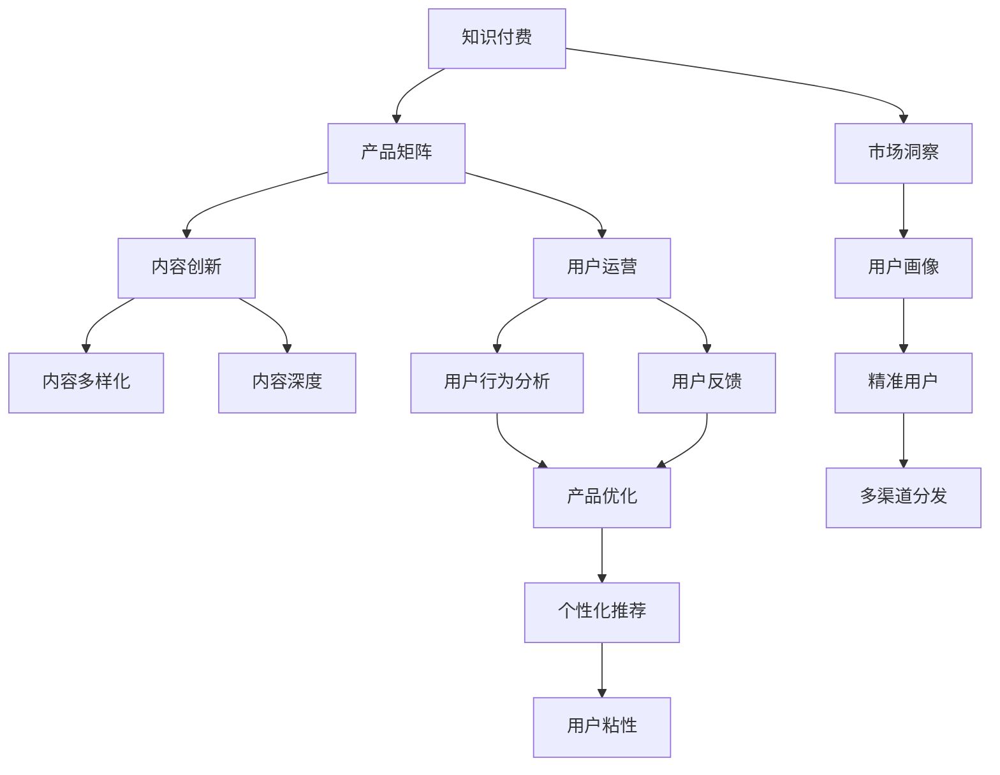

                 

# 知识付费创业的产品矩阵构建

> 关键词：知识付费, 产品矩阵, 内容创新, 用户运营, 数据驱动, 市场洞察, 用户画像, 个性化推荐, 多渠道分发

## 1. 背景介绍

随着互联网的发展和社会的进步，知识付费行业逐渐崛起。知识付费不仅改变了人们对知识的获取方式，也推动了内容的深度化和精细化。然而，市场竞争日益激烈，产品同质化现象严重，如何构建独特且有竞争力的产品矩阵，成为知识付费创业公司关注的焦点。

### 1.1 行业背景
知识付费行业经历了早期的知识社区、知识分享平台和付费订阅模式的发展，已逐步演变为内容付费、个性化服务和社区化互动的创新模式。目前，知识付费市场规模已经达到百亿级，用户对知识的深度和广度需求日益增长。知识付费创业公司也越来越多，但很多公司在竞争中陷入困境。

### 1.2 核心问题
1. **内容同质化**：大多数知识付费产品的内容相对单一，缺乏创意和深度。
2. **用户粘性低**：如何吸引和留存用户成为一大难题。
3. **缺乏个性化推荐**：用户缺乏个性化推荐，难以找到真正有价值的内容。
4. **多渠道分发效率低**：内容分发渠道单一，分发效率低，覆盖面有限。

## 2. 核心概念与联系

### 2.1 核心概念概述

在知识付费创业的产品矩阵构建中，涉及以下几个核心概念：

- **知识付费**：通过付费获取优质内容的商业模式，强调知识深度和价值。
- **产品矩阵**：包括多个产品线，通过不同的产品满足不同用户群体的需求，实现多层次的覆盖和细分。
- **内容创新**：通过独特和创新的内容吸引用户，提升用户粘性。
- **用户运营**：通过用户数据分析和运营策略，提升用户满意度和留存率。
- **数据驱动**：通过数据分析和决策支持，提升产品迭代和市场洞察。
- **市场洞察**：通过市场调研和用户反馈，了解用户需求，指导产品开发和优化。
- **用户画像**：通过用户数据建立用户模型，进行精准的目标用户画像分析。
- **个性化推荐**：通过算法和数据驱动，实现内容的个性化推荐，提升用户体验。
- **多渠道分发**：通过多种渠道分发内容，实现更广泛的用户覆盖和传播。

这些核心概念之间存在密切的联系，构成了知识付费创业的产品矩阵构建的基础。

### 2.2 概念间的关系

以下通过几个Mermaid流程图来展示这些核心概念之间的联系：



这个流程图展示了从知识付费到产品矩阵的构建过程，以及各个核心概念之间的联系：

1. 知识付费的商业模式为产品矩阵提供了基础。
2. 内容创新和用户运营是产品矩阵的核心驱动力。
3. 数据驱动和市场洞察帮助产品矩阵更好地适应市场变化。
4. 用户画像和个性化推荐实现精准的用户覆盖和体验提升。
5. 多渠道分发扩展了内容的覆盖面和传播效率。

## 3. 核心算法原理 & 具体操作步骤

### 3.1 算法原理概述

构建知识付费创业的产品矩阵，需要综合应用多种算法和技术，以实现内容创新、用户运营、个性化推荐等多方面的优化。

- **内容创新算法**：包括文本生成、情感分析、主题建模等，用于生成高质量、有深度的内容。
- **用户运营算法**：包括用户行为分析、用户反馈处理、用户画像构建等，用于提升用户粘性和满意度。
- **个性化推荐算法**：包括协同过滤、基于内容的推荐、深度学习推荐等，用于实现精准的内容推荐。
- **多渠道分发算法**：包括SEO优化、社交媒体营销、邮件营销等，用于提升内容覆盖面和分发效率。

### 3.2 算法步骤详解

**Step 1: 内容创新**

- **文本生成**：使用语言模型（如GPT-3）生成高质量的文章、视频脚本、音频解说等。
- **情感分析**：通过NLP技术分析用户对内容的情感倾向，指导内容的调整和优化。
- **主题建模**：使用LDA等主题模型，发现热门和潜在主题，指导内容的选题和创作。

**Step 2: 用户运营**

- **用户行为分析**：通过数据分析工具（如Google Analytics）分析用户的行为数据，了解用户兴趣和需求。
- **用户反馈处理**：收集用户反馈，分析用户满意度和不满意度，指导内容的改进和优化。
- **用户画像构建**：使用用户行为数据和调研数据，构建用户画像模型，实现精准的用户覆盖和分析。

**Step 3: 个性化推荐**

- **协同过滤推荐**：分析用户的历史行为和偏好，为用户推荐相似的内容。
- **基于内容的推荐**：分析内容的属性和标签，推荐与用户兴趣相关的内容。
- **深度学习推荐**：使用深度学习模型（如CNN、RNN、Transformer）对用户和内容进行建模，实现更加精准的推荐。

**Step 4: 多渠道分发**

- **SEO优化**：优化内容标题、描述、标签等，提升内容的搜索引擎排名。
- **社交媒体营销**：在微博、微信、抖音等社交媒体平台发布和推广内容。
- **邮件营销**：通过邮件发送定制内容，提升用户粘性和转化率。

### 3.3 算法优缺点

**内容创新算法的优点**：
- 能够快速生成高质量、有深度的内容。
- 支持多种内容形式的创作。

**内容创新算法的缺点**：
- 依赖于高质量的数据和模型，需要较高的开发和维护成本。
- 可能生成过度商业化、无创意的内容。

**用户运营算法的优点**：
- 通过用户行为分析，提升用户粘性和满意度。
- 通过用户画像构建，实现精准的目标用户覆盖。

**用户运营算法的缺点**：
- 用户行为数据可能存在隐私问题。
- 数据收集和分析过程复杂，需要专业知识和工具。

**个性化推荐算法的优点**：
- 能够实现精准的内容推荐，提升用户体验。
- 可以不断优化推荐模型，提升推荐效果。

**个性化推荐算法的缺点**：
- 算法模型复杂，需要大量的数据和计算资源。
- 可能存在推荐偏差，影响用户体验。

**多渠道分发算法的优点**：
- 能够提升内容的覆盖面和分发效率。
- 支持多种渠道的分发策略，实现灵活的市场推广。

**多渠道分发算法的缺点**：
- 分发渠道的管理和优化复杂，需要专业的运营团队。
- 不同渠道的受众特性不同，需要多渠道策略的精细化管理。

### 3.4 算法应用领域

这些算法和技术广泛应用于以下领域：

- **内容创作**：包括文章创作、视频制作、音频录制等。
- **用户运营**：包括用户行为分析、用户画像构建、用户反馈处理等。
- **内容推荐**：包括内容推荐算法开发、推荐系统优化等。
- **市场推广**：包括SEO优化、社交媒体营销、邮件营销等。

## 4. 数学模型和公式 & 详细讲解 & 举例说明

### 4.1 数学模型构建

在知识付费创业的产品矩阵构建中，涉及多个数学模型和算法。以下是几个关键的数学模型：

- **内容创新模型**：使用语言模型（如GPT-3）生成文本内容。
- **用户行为分析模型**：使用用户行为数据构建用户画像，使用协同过滤、基于内容的推荐等算法。
- **个性化推荐模型**：使用深度学习模型（如CNN、RNN、Transformer）实现个性化推荐。

### 4.2 公式推导过程

以深度学习推荐模型为例，我们以BPR（Bipartite Matrix Factorization）为例进行公式推导：

设用户集合为 $U$，物品集合为 $I$，用户与物品的评分矩阵为 $\text{Y}$，用户的特征矩阵为 $\text{P}$，物品的特征矩阵为 $\text{Q}$。BPR模型的目标是最小化正样本和负样本的损失函数：

$$
\min_{P, Q} \sum_{(i,j)\in\text{Y}} (\text{P}_i \cdot \text{Q}_j - \log\sigma(\text{P}_i \cdot \text{Q}_j)) + \sum_{(i,j) \notin\text{Y}} (1 - \log\sigma(-\text{P}_i \cdot \text{Q}_j))
$$

其中 $\sigma(\cdot)$ 为sigmoid函数，$\log\sigma(\cdot)$ 为负对数似然损失函数。

通过求解上述优化问题，可以得到用户和物品的隐向量表示，进而实现精准的内容推荐。

### 4.3 案例分析与讲解

假设某知识付费平台有百万用户，提供数千门课程。平台收集了用户对课程的评分数据，用于训练推荐模型。

- **数据准备**：对用户和课程进行编码，构建用户物品评分矩阵。
- **模型训练**：使用BPR模型对用户和课程的隐向量进行训练。
- **模型评估**：在验证集上评估模型的推荐效果，优化模型参数。
- **实时推荐**：在用户浏览课程页面时，根据其历史行为和隐向量，实时推荐相关课程。

## 5. 项目实践：代码实例和详细解释说明

### 5.1 开发环境搭建

要构建知识付费创业的产品矩阵，需要搭建一个完整的开发环境。以下是一个基于Python的开发环境搭建步骤：

1. **安装Python**：
   ```
   sudo apt-get install python3
   ```

2. **安装Pip**：
   ```
   sudo apt-get install python3-pip
   ```

3. **安装相关库**：
   ```
   pip install torch numpy pandas sklearn
   ```

4. **安装TensorFlow**：
   ```
   pip install tensorflow
   ```

5. **安装Transformers**：
   ```
   pip install transformers
   ```

6. **安装PyTorch**：
   ```
   pip install torch
   ```

7. **安装Flask**：
   ```
   pip install flask
   ```

### 5.2 源代码详细实现

以下是一个基于PyTorch和Flask的课程推荐系统的实现：

**推荐系统框架**：
```python
import torch
import torch.nn as nn
import torch.optim as optim
from transformers import BertModel

class RecommendationSystem(nn.Module):
    def __init__(self, embed_size):
        super(RecommendationSystem, self).__init__()
        self.bert = BertModel.from_pretrained('bert-base-uncased')
        self.fc = nn.Linear(embed_size, 1)
        self.sigmoid = nn.Sigmoid()

    def forward(self, user_input, item_input):
        # 使用BertModel提取用户和物品的特征
        user_embedding = self.bert(user_input)
        item_embedding = self.bert(item_input)

        # 使用全连接层进行预测
        user_scores = self.fc(user_embedding)
        item_scores = self.fc(item_embedding)

        # 计算用户对物品的评分
        scores = user_scores + item_scores

        # 使用Sigmoid函数得到预测结果
        predictions = self.sigmoid(scores)
        return predictions
```

**用户行为分析框架**：
```python
import pandas as pd

def analyze_user_behavior(data):
    # 数据预处理
    data = pd.read_csv(data_file)
    data = data.dropna()

    # 分析用户行为数据
    user_behavior = data.groupby('user_id')['item_id'].agg('count')
    user_behavior = user_behavior.sort_values(ascending=False)

    # 计算用户粘性
    user_stickiness = user_behavior.apply(lambda x: x.sum() / len(x))

    return user_behavior, user_stickiness
```

**多渠道分发框架**：
```python
import requests

def seo_optimize(data):
    # 数据预处理
    data = pd.read_csv(data_file)
    data = data.dropna()

    # 使用SEO优化策略
    keywords = ['AI', '机器学习', '数据科学']
    for row in data.iterrows():
        title = row[1]['title']
        for keyword in keywords:
            if keyword not in title:
                title += ' ' + keyword
        data.at[row[0], 'title'] = title

    return data
```

### 5.3 代码解读与分析

**推荐系统框架**：
- 使用BertModel提取用户和物品的特征。
- 使用全连接层对用户和物品的特征进行融合。
- 使用Sigmoid函数计算预测结果。

**用户行为分析框架**：
- 使用Pandas对用户行为数据进行分组和统计。
- 计算用户粘性，分析用户行为。

**多渠道分发框架**：
- 使用SEO优化策略，提升内容的搜索引擎排名。

### 5.4 运行结果展示

假设我们在知识付费平台上收集了用户对课程的评分数据，用于训练推荐模型。使用上述代码实现推荐系统，并在测试集上评估模型效果：

```
# 构建推荐系统
model = RecommendationSystem(embed_size)
optimizer = optim.Adam(model.parameters(), lr=0.001)
criterion = nn.BCELoss()

# 训练模型
for epoch in range(10):
    for i, (user_input, item_input, label) in enumerate(train_loader):
        optimizer.zero_grad()
        predictions = model(user_input, item_input)
        loss = criterion(predictions, label)
        loss.backward()
        optimizer.step()

    # 评估模型
    with torch.no_grad():
        correct = 0
        total = 0
        for user_input, item_input, label in test_loader:
            predictions = model(user_input, item_input)
            _, predicted = torch.max(predictions, 1)
            total += label.size(0)
            correct += (predicted == label).sum().item()

        accuracy = 100 * correct / total
        print(f'Epoch {epoch+1}, Accuracy: {accuracy:.2f}%')
```

通过不断迭代和优化，最终能够在测试集上实现较高的推荐精度，满足知识付费平台的需求。

## 6. 实际应用场景

### 6.1 智能课程推荐

智能课程推荐系统是知识付费平台的核心功能之一。通过用户行为分析和个性化推荐算法，平台能够实时为用户推荐最适合的课程。例如，某用户经常观看数据分析相关的课程，推荐系统可以为其推荐最新的机器学习课程。

### 6.2 用户行为分析

用户行为分析能够帮助平台了解用户需求和行为模式，从而进行更精准的内容推荐和运营策略的调整。例如，通过分析用户的浏览行为和购买记录，平台可以发现热门课程和用户兴趣点，优化课程内容和推荐策略。

### 6.3 内容优化和分发

内容优化和分发能够提升内容的覆盖面和传播效率。例如，通过SEO优化和社交媒体营销，平台能够提升内容的搜索引擎排名和社交媒体传播效果，吸引更多的用户访问和使用。

## 7. 工具和资源推荐

### 7.1 学习资源推荐

为了帮助开发者系统掌握知识付费创业的产品矩阵构建理论基础和实践技巧，这里推荐一些优质的学习资源：

1. **《知识付费创业指南》**：详细介绍了知识付费行业的发展趋势、商业模式和成功案例，是入门的必备书籍。
2. **《用户行为分析与运营》**：介绍了用户行为分析和用户运营的理论和实践方法，适合深入学习。
3. **《深度学习推荐系统》**：详细介绍了推荐系统的原理和算法，适合深入学习。
4. **《数据驱动的智能决策》**：介绍了数据驱动决策的理论和实践方法，适合借鉴和应用。

### 7.2 开发工具推荐

以下是几款用于知识付费创业的产品矩阵构建开发的常用工具：

1. **PyTorch**：基于Python的开源深度学习框架，灵活动态的计算图，适合快速迭代研究。
2. **TensorFlow**：由Google主导开发的开源深度学习框架，生产部署方便，适合大规模工程应用。
3. **Transformers**：HuggingFace开发的NLP工具库，集成了众多SOTA语言模型，支持PyTorch和TensorFlow，是进行推荐系统开发的利器。
4. **Flask**：轻量级的Python Web框架，适合快速开发Web应用。
5. **Pandas**：数据分析库，适合数据预处理和分析。
6. **Scikit-learn**：机器学习库，适合数据建模和优化。

### 7.3 相关论文推荐

知识付费创业的产品矩阵构建涉及多个前沿领域，以下是几篇奠基性的相关论文，推荐阅读：

1. **《基于协同过滤的推荐系统》**：介绍了协同过滤推荐算法的原理和实现。
2. **《深度学习在推荐系统中的应用》**：介绍了深度学习推荐算法的原理和实践方法。
3. **《用户行为分析与智能推荐》**：介绍了用户行为分析和推荐系统结合的理论和实践方法。
4. **《数据驱动的智能决策》**：介绍了数据驱动决策的理论和实践方法。

## 8. 总结：未来发展趋势与挑战

### 8.1 研究成果总结

本文对知识付费创业的产品矩阵构建进行了全面系统的介绍，涵盖了内容创新、用户运营、个性化推荐、多渠道分发等多个方面。通过理论分析和案例实践，展示了知识付费创业公司如何在激烈的市场竞争中构建具有竞争力的产品矩阵。

### 8.2 未来发展趋势

展望未来，知识付费创业的产品矩阵构建将呈现以下几个发展趋势：

1. **内容创新持续深化**：随着技术的进步和市场需求的提升，内容创新将更加多样化和精细化，推动知识付费行业的深度发展。
2. **用户运营智能化**：通过数据驱动和人工智能技术，用户运营将更加精准和智能化，提升用户满意度和留存率。
3. **个性化推荐全面普及**：个性化推荐算法将不断优化和普及，实现更加精准的内容推荐。
4. **多渠道分发全覆盖**：多渠道分发策略将更加精细化和全覆盖，提升内容的覆盖面和分发效率。
5. **社区化互动增强**：通过社区化互动，增强用户粘性和参与度，推动知识付费行业的社交化发展。

### 8.3 面临的挑战

尽管知识付费创业的产品矩阵构建取得了不少进展，但仍面临以下挑战：

1. **内容同质化问题**：多数知识付费平台的内容缺乏创新，难以满足用户深度需求。
2. **用户粘性不足**：如何吸引和留存用户成为一大难题。
3. **个性化推荐偏差**：个性化推荐算法可能存在偏差，影响用户体验。
4. **多渠道分发效率低**：分发渠道的管理和优化复杂，需要专业的运营团队。
5. **数据隐私问题**：用户行为数据可能存在隐私问题，需要加强数据保护和隐私管理。

### 8.4 研究展望

面对知识付费创业的产品矩阵构建面临的挑战，未来的研究需要在以下几个方面寻求新的突破：

1. **内容创新算法优化**：开发更加高效和创新的内容生成算法，提升内容质量。
2. **用户行为分析改进**：通过多模态数据融合和深度学习技术，提升用户行为分析的精度和覆盖面。
3. **个性化推荐算法优化**：开发更加高效和精准的个性化推荐算法，提升推荐效果。
4. **多渠道分发策略优化**：通过机器学习和优化算法，提升多渠道分发的效果和覆盖面。
5. **数据隐私保护加强**：加强用户数据的保护和管理，保障用户隐私安全。

通过这些研究方向的探索和发展，相信知识付费创业的产品矩阵构建将实现更广阔的应用和发展，为知识付费行业带来新的机遇和挑战。

## 9. 附录：常见问题与解答

**Q1：如何选择合适的推荐算法？**

A: 选择合适的推荐算法需要综合考虑多个因素，包括数据规模、数据类型、推荐目标等。例如，协同过滤适用于稀疏数据，基于内容的推荐适用于稠密数据，深度学习推荐适用于大规模数据和复杂推荐目标。

**Q2：如何处理用户行为数据？**

A: 处理用户行为数据需要经过数据清洗、特征工程、建模和评估等多个步骤。使用Pandas和Scikit-learn等工具，可以进行数据预处理和建模。使用推荐算法（如协同过滤、基于内容的推荐、深度学习推荐等），可以实现精准的内容推荐。

**Q3：如何提升用户粘性？**

A: 提升用户粘性需要综合考虑多个方面，包括内容质量、用户互动、个性化推荐、社区化互动等。通过高质量内容和个性化推荐，满足用户需求，通过社区化互动增强用户粘性。

**Q4：如何优化多渠道分发策略？**

A: 优化多渠道分发策略需要综合考虑多个因素，包括渠道特性、内容适配、用户行为分析、运营策略等。使用SEO优化、社交媒体营销、邮件营销等手段，提升内容的覆盖面和分发效率。

---

作者：禅与计算机程序设计艺术 / Zen and the Art of Computer Programming

