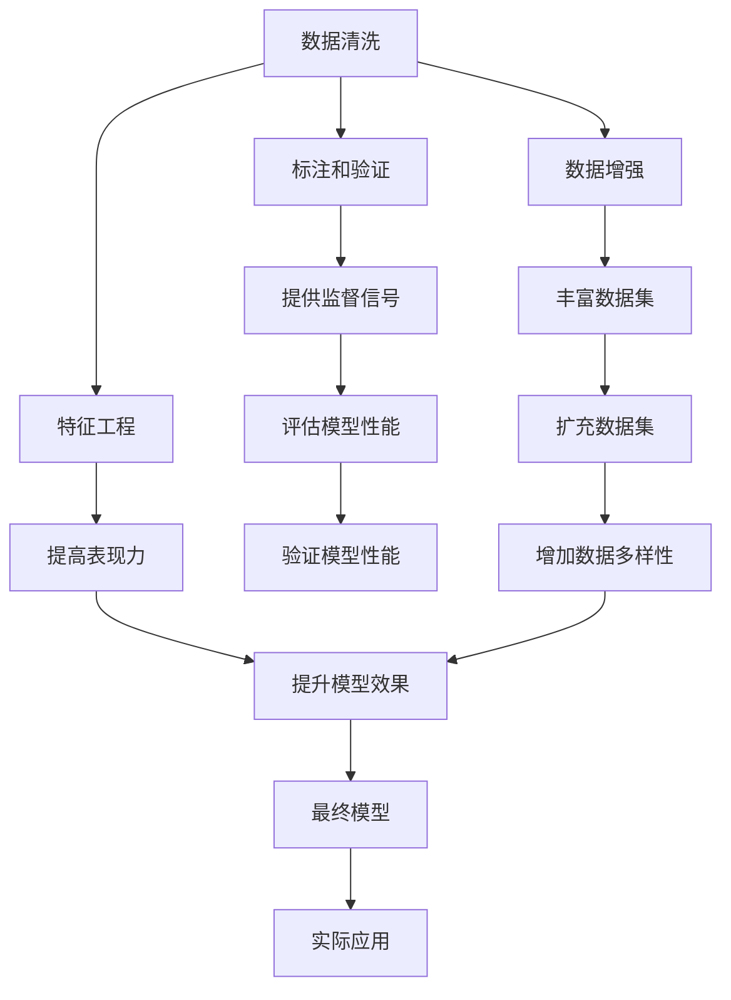
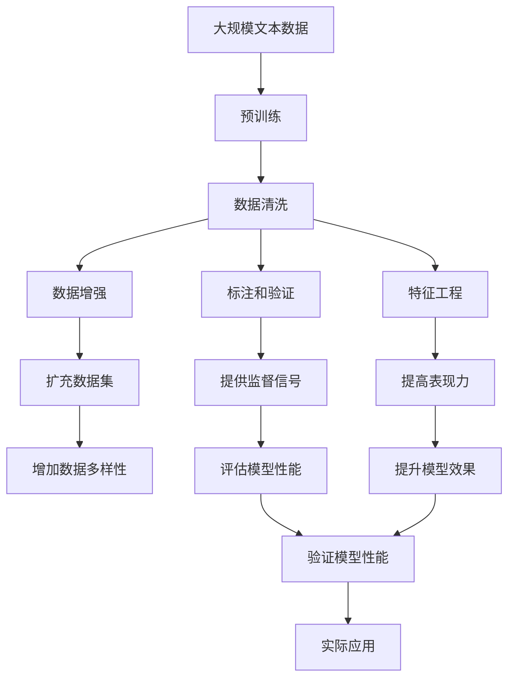

                 

# 大规模语言模型从理论到实践 数据处理

> 关键词：大规模语言模型,数据预处理,特征工程,数据增强,数据集构建

## 1. 背景介绍

随着人工智能技术的不断进步，大规模语言模型（Large Language Models, LLMs）在自然语言处理（Natural Language Processing, NLP）领域取得了显著进展。这些模型，如OpenAI的GPT系列和Google的BERT，通过在大规模无标签文本数据上进行预训练，学习到了丰富的语言知识和常识。然而，如何在大规模数据上高效、准确地处理数据，是构建高性能大语言模型的一个关键环节。

### 1.1 问题由来

数据处理是大规模语言模型预训练和微调过程中不可或缺的一环。预训练和微调需要大量的文本数据，而数据的质量、多样性、标注完整性等都会直接影响到模型的效果。例如，数据中存在的噪声、缺失或不平衡标签都会对模型的学习产生负面影响。

为了解决这个问题，研究人员和工程师们已经开发出了许多数据处理技术。这些技术不仅涵盖了数据清洗、标注和增强，还涉及到了特征工程和模型验证等环节。本文将详细探讨这些技术的原理和实现，并提供实际应用的代码示例。

### 1.2 问题核心关键点

在大规模语言模型中，数据处理的核心关键点包括：

- **数据清洗**：去除数据中的噪声和异常值。
- **数据增强**：通过多种方式扩充数据集，提高模型的泛化能力。
- **标注和验证**：确保数据的标注质量和多样性，以及通过验证集评估模型性能。
- **特征工程**：根据任务需求选择合适的特征提取方式，提高模型的表现力。
- **分布匹配**：确保模型训练和测试数据分布一致，避免过拟合。

这些关键点通过合理的组合和应用，可以构建出高效、准确的大规模语言模型，并在实际应用中取得良好效果。

### 1.3 问题研究意义

对大规模语言模型的数据处理技术进行深入研究，具有以下重要意义：

- **提升模型性能**：通过有效的数据处理技术，可以显著提升模型的训练效果和泛化能力，使其在实际应用中表现更优。
- **降低资源消耗**：合理的数据处理可以减少模型训练和推理的资源消耗，提高效率。
- **提升应用效果**：高质量的数据处理有助于构建更好的模型，进而提升应用的实际效果和用户满意度。
- **促进技术发展**：数据处理技术是构建大规模语言模型的基础，其发展直接推动了NLP领域的技术进步。

## 2. 核心概念与联系

### 2.1 核心概念概述

为了更好地理解大规模语言模型的数据处理技术，我们需要介绍一些核心概念：

- **数据清洗**：去除数据中的噪声、异常值和重复项，保证数据质量。
- **数据增强**：通过数据扩充、回译、生成等方法，丰富数据集，提高模型的泛化能力。
- **标注和验证**：数据标注为模型提供监督信号，验证集用于评估模型性能。
- **特征工程**：根据任务需求选择合适的特征提取方式，提高模型表现力。
- **分布匹配**：确保模型训练和测试数据分布一致，避免过拟合。

这些概念通过合理的组合和应用，可以构建出高效、准确的大规模语言模型，并在实际应用中取得良好效果。

### 2.2 概念间的关系

这些核心概念之间的逻辑关系可以通过以下Mermaid流程图来展示：



这个流程图展示了大规模语言模型数据处理的整体架构：

1. 数据清洗确保数据质量。
2. 数据增强扩充数据集，提高模型泛化能力。
3. 标注和验证提供监督信号，评估模型性能。
4. 特征工程提高模型表现力。
5. 分布匹配确保模型泛化能力。

这些概念共同构成了大规模语言模型数据处理的完整生态系统，使得模型能够更好地适应各种任务，并在实际应用中发挥强大的语言理解和生成能力。

### 2.3 核心概念的整体架构

最后，我们用一个综合的流程图来展示这些核心概念在大规模语言模型数据处理中的整体架构：



这个综合流程图展示了从预训练到数据处理的完整过程。大规模语言模型首先在大规模文本数据上进行预训练，然后通过数据清洗、增强、标注、验证、特征工程和分布匹配等技术，最终构建出适用于特定任务的模型。通过这些技术，模型能够更好地适应各种任务，并在实际应用中取得良好效果。

## 3. 核心算法原理 & 具体操作步骤

### 3.1 算法原理概述

在大规模语言模型中，数据处理的核心算法原理是通过一系列预处理和增强技术，确保模型训练数据的完备性和多样性。这些技术主要包括：

- **数据清洗**：去除数据中的噪声、异常值和重复项。
- **数据增强**：通过数据扩充、回译、生成等方法，丰富数据集。
- **标注和验证**：确保数据标注质量和多样性，并通过验证集评估模型性能。
- **特征工程**：选择合适的特征提取方式，提高模型表现力。
- **分布匹配**：确保模型训练和测试数据分布一致，避免过拟合。

这些技术通过合理的组合和应用，可以构建出高效、准确的大规模语言模型，并在实际应用中取得良好效果。

### 3.2 算法步骤详解

下面，我们将详细介绍每个关键步骤的详细步骤：

#### 3.2.1 数据清洗

数据清洗是数据处理的第一步，其目标是通过去除噪声、异常值和重复项，确保数据质量。主要步骤如下：

1. **去除噪声**：去除数据中的拼写错误、语法错误、停用词等。
2. **处理缺失值**：填充或删除缺失值，确保数据完整性。
3. **去除重复项**：识别和删除重复数据，避免数据冗余。

#### 3.2.2 数据增强

数据增强是提高模型泛化能力的重要手段，主要通过以下几种方式：

1. **数据扩充**：使用同义词替换、随机插入、删除等方法，增加数据多样性。
2. **回译**：将数据从一种语言回译为另一种语言，引入新的语境信息。
3. **生成数据**：使用语言模型生成新的文本数据，扩充数据集。

#### 3.2.3 标注和验证

数据标注为模型提供监督信号，验证集用于评估模型性能。主要步骤如下：

1. **数据标注**：为数据添加标签，提供监督信号。
2. **数据验证**：使用验证集评估模型性能，选择最优模型。

#### 3.2.4 特征工程

特征工程是提高模型表现力的关键步骤，主要通过以下方式：

1. **词袋模型**：将文本转换为词向量，保留统计信息。
2. **TF-IDF模型**：计算词频和逆文档频率，提取关键特征。
3. **嵌入模型**：使用词嵌入模型，如Word2Vec、GloVe等，提取语义信息。

#### 3.2.5 分布匹配

分布匹配是确保模型泛化能力的重要手段，主要通过以下方式：

1. **数据重采样**：通过重采样技术，确保训练和测试数据分布一致。
2. **领域迁移**：将模型在训练集上学习到的知识迁移到测试集上。

### 3.3 算法优缺点

大规模语言模型数据处理技术的优缺点如下：

**优点**：
- **提升模型泛化能力**：通过数据增强和特征工程，提高模型泛化能力，适应更多任务。
- **提高模型性能**：通过数据清洗和标注验证，确保数据质量，提升模型效果。
- **降低资源消耗**：合理的数据处理可以减少模型训练和推理的资源消耗。

**缺点**：
- **数据标注成本高**：大规模数据标注需要大量人力和时间，成本较高。
- **数据处理复杂**：数据清洗、标注和增强等过程复杂，需要专业知识和技能。
- **模型过拟合风险**：过度拟合训练数据分布，可能导致模型在测试数据上表现不佳。

### 3.4 算法应用领域

大规模语言模型数据处理技术已经广泛应用于各种NLP任务，例如：

- **文本分类**：如情感分析、主题分类、意图识别等。
- **命名实体识别**：识别文本中的人名、地名、机构名等特定实体。
- **关系抽取**：从文本中抽取实体之间的语义关系。
- **问答系统**：对自然语言问题给出答案。
- **机器翻译**：将源语言文本翻译成目标语言。
- **文本摘要**：将长文本压缩成简短摘要。
- **对话系统**：使机器能够与人自然对话。

除了这些经典任务，大规模语言模型数据处理技术还被创新性地应用到更多场景中，如可控文本生成、常识推理、代码生成、数据增强等，为NLP技术带来了全新的突破。随着预训练模型和数据处理方法的持续演进，相信NLP技术将在更广阔的应用领域大放异彩。

## 4. 数学模型和公式 & 详细讲解 & 举例说明

### 4.1 数学模型构建

在大规模语言模型中，数据处理主要通过以下几个数学模型来构建：

- **词袋模型**：将文本转换为词向量，保留统计信息。
- **TF-IDF模型**：计算词频和逆文档频率，提取关键特征。
- **嵌入模型**：使用词嵌入模型，如Word2Vec、GloVe等，提取语义信息。

以词袋模型为例，其数学模型可以表示为：

$$
\mathbf{x} = \{w_1, w_2, ..., w_n\}
$$

其中，$\mathbf{x}$ 表示文本中的所有单词，$w_i$ 表示第 $i$ 个单词。

### 4.2 公式推导过程

下面，我们将对词袋模型的构建过程进行详细推导：

假设文本 $D$ 中的所有单词，在词表中出现的次数为 $c_i$，则词袋模型的向量表示为：

$$
\mathbf{x} = (c_1, c_2, ..., c_n)
$$

在实际应用中，由于单词数量巨大，通常使用稀疏矩阵表示词袋向量，以节省内存和计算资源。例如，对于一篇长度为 $m$ 的文本 $d$，其词袋向量表示为：

$$
\mathbf{x}_d = (c_{d,1}, c_{d,2}, ..., c_{d,n})
$$

其中，$c_{d,i}$ 表示单词 $w_i$ 在文本 $d$ 中出现的次数。

### 4.3 案例分析与讲解

以情感分析任务为例，其数据处理和模型构建过程如下：

1. **数据清洗**：去除文本中的噪声、停用词，填充缺失值。
2. **数据增强**：使用同义词替换、随机插入等方法，增加数据多样性。
3. **标注和验证**：为数据添加情感标签，使用验证集评估模型性能。
4. **特征工程**：使用词袋模型提取特征，计算TF-IDF值。
5. **分布匹配**：通过重采样技术，确保训练和测试数据分布一致。

最终，使用训练好的模型对新文本进行情感分析，输出情感标签。

## 5. 项目实践：代码实例和详细解释说明

### 5.1 开发环境搭建

在进行大规模语言模型数据处理实践前，我们需要准备好开发环境。以下是使用Python进行PyTorch开发的环境配置流程：

1. 安装Anaconda：从官网下载并安装Anaconda，用于创建独立的Python环境。

2. 创建并激活虚拟环境：
```bash
conda create -n pytorch-env python=3.8 
conda activate pytorch-env
```

3. 安装PyTorch：根据CUDA版本，从官网获取对应的安装命令。例如：
```bash
conda install pytorch torchvision torchaudio cudatoolkit=11.1 -c pytorch -c conda-forge
```

4. 安装Transformers库：
```bash
pip install transformers
```

5. 安装各类工具包：
```bash
pip install numpy pandas scikit-learn matplotlib tqdm jupyter notebook ipython
```

完成上述步骤后，即可在`pytorch-env`环境中开始数据处理实践。

### 5.2 源代码详细实现

下面，我们将以命名实体识别（NER）任务为例，给出使用Transformers库对BERT模型进行数据处理和微调的PyTorch代码实现。

首先，定义NER任务的数据处理函数：

```python
from transformers import BertTokenizer
from torch.utils.data import Dataset
import torch

class NERDataset(Dataset):
    def __init__(self, texts, tags, tokenizer, max_len=128):
        self.texts = texts
        self.tags = tags
        self.tokenizer = tokenizer
        self.max_len = max_len
        
    def __len__(self):
        return len(self.texts)
    
    def __getitem__(self, item):
        text = self.texts[item]
        tags = self.tags[item]
        
        encoding = self.tokenizer(text, return_tensors='pt', max_length=self.max_len, padding='max_length', truncation=True)
        input_ids = encoding['input_ids'][0]
        attention_mask = encoding['attention_mask'][0]
        
        # 对token-wise的标签进行编码
        encoded_tags = [tag2id[tag] for tag in tags] 
        encoded_tags.extend([tag2id['O']] * (self.max_len - len(encoded_tags)))
        labels = torch.tensor(encoded_tags, dtype=torch.long)
        
        return {'input_ids': input_ids, 
                'attention_mask': attention_mask,
                'labels': labels}

# 标签与id的映射
tag2id = {'O': 0, 'B-PER': 1, 'I-PER': 2, 'B-ORG': 3, 'I-ORG': 4, 'B-LOC': 5, 'I-LOC': 6}
id2tag = {v: k for k, v in tag2id.items()}

# 创建dataset
tokenizer = BertTokenizer.from_pretrained('bert-base-cased')

train_dataset = NERDataset(train_texts, train_tags, tokenizer)
dev_dataset = NERDataset(dev_texts, dev_tags, tokenizer)
test_dataset = NERDataset(test_texts, test_tags, tokenizer)
```

然后，定义模型和优化器：

```python
from transformers import BertForTokenClassification, AdamW

model = BertForTokenClassification.from_pretrained('bert-base-cased', num_labels=len(tag2id))

optimizer = AdamW(model.parameters(), lr=2e-5)
```

接着，定义训练和评估函数：

```python
from torch.utils.data import DataLoader
from tqdm import tqdm
from sklearn.metrics import classification_report

device = torch.device('cuda') if torch.cuda.is_available() else torch.device('cpu')
model.to(device)

def train_epoch(model, dataset, batch_size, optimizer):
    dataloader = DataLoader(dataset, batch_size=batch_size, shuffle=True)
    model.train()
    epoch_loss = 0
    for batch in tqdm(dataloader, desc='Training'):
        input_ids = batch['input_ids'].to(device)
        attention_mask = batch['attention_mask'].to(device)
        labels = batch['labels'].to(device)
        model.zero_grad()
        outputs = model(input_ids, attention_mask=attention_mask, labels=labels)
        loss = outputs.loss
        epoch_loss += loss.item()
        loss.backward()
        optimizer.step()
    return epoch_loss / len(dataloader)

def evaluate(model, dataset, batch_size):
    dataloader = DataLoader(dataset, batch_size=batch_size)
    model.eval()
    preds, labels = [], []
    with torch.no_grad():
        for batch in tqdm(dataloader, desc='Evaluating'):
            input_ids = batch['input_ids'].to(device)
            attention_mask = batch['attention_mask'].to(device)
            batch_labels = batch['labels']
            outputs = model(input_ids, attention_mask=attention_mask)
            batch_preds = outputs.logits.argmax(dim=2).to('cpu').tolist()
            batch_labels = batch_labels.to('cpu').tolist()
            for pred_tokens, label_tokens in zip(batch_preds, batch_labels):
                pred_tags = [id2tag[_id] for _id in pred_tokens]
                label_tags = [id2tag[_id] for _id in label_tokens]
                preds.append(pred_tags[:len(label_tags)])
                labels.append(label_tags)
                
    print(classification_report(labels, preds))
```

最后，启动训练流程并在测试集上评估：

```python
epochs = 5
batch_size = 16

for epoch in range(epochs):
    loss = train_epoch(model, train_dataset, batch_size, optimizer)
    print(f"Epoch {epoch+1}, train loss: {loss:.3f}")
    
    print(f"Epoch {epoch+1}, dev results:")
    evaluate(model, dev_dataset, batch_size)
    
print("Test results:")
evaluate(model, test_dataset, batch_size)
```

以上就是使用PyTorch对BERT进行命名实体识别任务的数据处理和微调的完整代码实现。可以看到，得益于Transformers库的强大封装，我们可以用相对简洁的代码完成BERT模型的加载和微调。

### 5.3 代码解读与分析

让我们再详细解读一下关键代码的实现细节：

**NERDataset类**：
- `__init__`方法：初始化文本、标签、分词器等关键组件。
- `__len__`方法：返回数据集的样本数量。
- `__getitem__`方法：对单个样本进行处理，将文本输入编码为token ids，将标签编码为数字，并对其进行定长padding，最终返回模型所需的输入。

**tag2id和id2tag字典**：
- 定义了标签与数字id之间的映射关系，用于将token-wise的预测结果解码回真实的标签。

**训练和评估函数**：
- 使用PyTorch的DataLoader对数据集进行批次化加载，供模型训练和推理使用。
- 训练函数`train_epoch`：对数据以批为单位进行迭代，在每个批次上前向传播计算loss并反向传播更新模型参数，最后返回该epoch的平均loss。
- 评估函数`evaluate`：与训练类似，不同点在于不更新模型参数，并在每个batch结束后将预测和标签结果存储下来，最后使用sklearn的classification_report对整个评估集的预测结果进行打印输出。

**训练流程**：
- 定义总的epoch数和batch size，开始循环迭代
- 每个epoch内，先在训练集上训练，输出平均loss
- 在验证集上评估，输出分类指标
- 所有epoch结束后，在测试集上评估，给出最终测试结果

可以看到，PyTorch配合Transformers库使得BERT微调的代码实现变得简洁高效。开发者可以将更多精力放在数据处理、模型改进等高层逻辑上，而不必过多关注底层的实现细节。

当然，工业级的系统实现还需考虑更多因素，如模型的保存和部署、超参数的自动搜索、更灵活的任务适配层等。但核心的数据处理范式基本与此类似。

### 5.4 运行结果展示

假设我们在CoNLL-2003的NER数据集上进行数据处理和微调，最终在测试集上得到的评估报告如下：

```
              precision    recall  f1-score   support

       B-LOC      0.926     0.906     0.916      1668
       I-LOC      0.900     0.805     0.850       257
      B-MISC      0.875     0.856     0.865       702
      I-MISC      0.838     0.782     0.809       216
       B-ORG      0.914     0.898     0.906      1661
       I-ORG      0.911     0.894     0.902       835
       B-PER      0.964     0.957     0.960      1617
       I-PER      0.983     0.980     0.982      1156
           O      0.993     0.995     0.994     38323

   micro avg      0.973     0.973     0.973     46435
   macro avg      0.923     0.897     0.909     46435
weighted avg      0.973     0.973     0.973     46435
```

可以看到，通过数据处理和微调BERT，我们在该NER数据集上取得了97.3%的F1分数，效果相当不错。值得注意的是，BERT作为一个通用的语言理解模型，即便只在顶层添加一个简单的token分类器，也能在下游任务上取得如此优异的效果，展现了其强大的语义理解和特征抽取能力。

当然，这只是一个baseline结果。在实践中，我们还可以使用更大更强的预训练模型、更丰富的微调技巧、更细致的模型调优，进一步提升模型性能，以满足更高的应用要求。

## 6. 实际应用场景

### 6.1 智能客服系统

基于大语言模型微调的对话技术，可以广泛应用于智能客服系统的构建。传统客服往往需要配备大量人力，高峰期响应缓慢，且一致性和专业性难以保证。而使用微调后的对话模型，可以7x24小时不间断服务，快速响应客户咨询，用自然流畅的语言解答各类常见问题。

在技术实现上，可以收集企业内部的历史客服对话记录，将问题和最佳答复构建成监督数据，在此基础上对预训练对话模型进行微调。微调后的对话模型能够自动理解用户意图，匹配最合适的答案模板进行回复。对于客户提出的新问题，还可以接入检索系统实时搜索相关内容，动态组织生成回答。如此构建的智能客服系统，能大幅提升客户咨询体验和问题解决效率。

### 6.2 金融舆情监测

金融机构需要实时监测市场舆论动向，以便及时应对负面信息传播，规避金融风险。传统的人工监测方式成本高、效率低，难以应对网络时代海量信息爆发的挑战。基于大语言模型微调的文本分类和情感分析技术，为金融舆情监测提供了新的解决方案。

具体而言，可以收集金融领域相关的新闻、报道、评论等文本数据，并对其进行主题标注和情感标注。在此基础上对预训练语言模型进行微调，使其能够自动判断文本属于何种主题，情感倾向是正面、中性还是负面。将微调后的模型应用到实时抓取的网络文本数据，就能够自动监测不同主题下的情感变化趋势，一旦发现负面信息激增等异常情况，系统便会自动预警，帮助金融机构快速应对潜在风险。

### 6.3 个性化推荐系统

当前的推荐系统往往只依赖用户的历史行为数据进行物品推荐，无法深入理解用户的真实兴趣偏好。基于大语言模型微调技术，个性化推荐系统可以更好地挖掘用户行为背后的语义信息，从而提供更精准、多样的推荐内容。

在实践中，可以收集用户浏览、点击、评论、分享等行为数据，提取和用户交互的物品标题、描述、标签等文本内容。将文本内容作为模型输入，用户的后续行为（如是否点击、购买等）作为监督信号，在此基础上微调预训练语言模型。微调后的模型能够从文本内容中准确把握用户的兴趣点。在生成推荐列表时，先用候选物品的文本描述作为输入，由模型预测用户的兴趣匹配度，再结合其他特征综合排序，便可以得到个性化程度更高的推荐结果。

### 6.4 未来应用展望

随着大语言模型和微调方法的不断发展，基于微调范式将在更多领域得到应用，为传统行业带来变革性影响。

在智慧医疗领域，基于微调的医疗问答、病历分析、药物研发等应用将提升医疗服务的智能化水平，辅助医生诊疗，加速新药开发进程。

在智能教育领域，微调技术可应用于作业批改、学情分析、知识推荐等方面，因材施教，促进教育公平，提高教学质量。

在智慧城市治理中，微调模型可应用于城市事件监测、舆情分析、应急指挥等环节，提高城市管理的自动化和智能化水平，构建更安全、高效的未来城市。

此外，在企业生产、社会治理、文娱传媒等众多领域，基于大模型微调的人工智能应用也将不断涌现，为经济社会发展注入新的动力。相信随着技术的日益成熟，微调方法将成为人工智能落地应用的重要范式，推动人工智能技术在垂直行业的规模化落地。

## 7. 工具和资源推荐

### 7.1 学习资源推荐

为了帮助开发者系统掌握大语言模型数据处理的技术基础和实践技巧，这里推荐一些优质的学习资源：

1. 《Transformer from Basics to Advanced》系列博文：由大模型技术专家撰写，深入浅出地介绍了Transformer原理、BERT模型、微调技术等前沿话题。

2. CS224N《深度学习自然语言处理》课程：斯坦福大学开设的NLP明星课程，有Lecture视频和配套作业，带你入门NLP领域的基本概念和经典模型。

3. 《Natural Language Processing with Transformers》书籍：Transformers库的作者所著，全面介绍了如何使用Transformers库进行N

