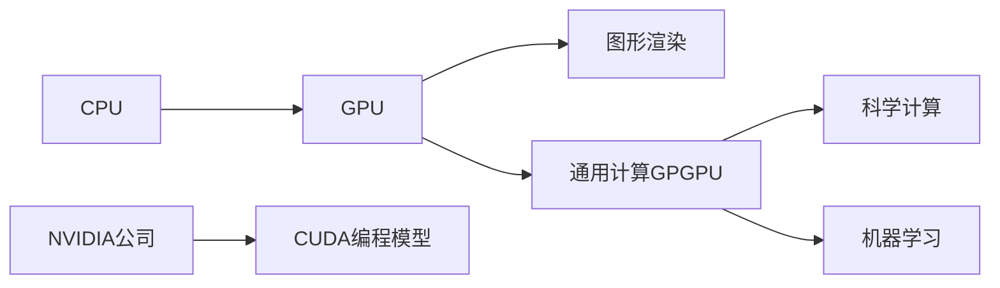

# NVIDIA与GPU的发明

作者：禅与计算机程序设计艺术 / Zen and the Art of Computer Programming

## 1. 背景介绍

### 1.1 问题的由来

随着计算机图形学和视觉计算的快速发展,传统的CPU已经无法满足日益增长的计算需求。在这样的背景下,NVIDIA公司开始研发专门用于图形和视觉计算的处理器——GPU(Graphics Processing Unit,图形处理器)。

### 1.2 研究现状

目前,GPU已经广泛应用于计算机图形学、高性能计算、人工智能等诸多领域。NVIDIA作为GPU领域的先驱和领导者,其GPU架构和编程模型已经成为业界标准。众多科研机构和企业都在利用NVIDIA GPU开展前沿研究和产品开发。

### 1.3 研究意义

深入研究NVIDIA GPU的发明历程和技术原理,对于理解现代计算机体系结构和异构计算的发展具有重要意义。同时,掌握GPU编程技术也是从事人工智能、大数据分析等前沿计算领域研究的必备技能。

### 1.4 本文结构

本文将首先介绍GPU的核心概念和发展历程,然后重点剖析GPU的体系结构和编程模型。接着,我们将通过实际案例来说明如何使用CUDA进行GPU编程。最后,本文还将展望GPU技术的未来发展趋势和应用前景。

## 2. 核心概念与联系

GPU,全称Graphics Processing Unit,即图形处理器。它是一种专门在个人电脑、工作站、游戏机和一些移动设备(如平板电脑、智能手机等)上做图像和图形相关运算工作的微处理器。与CPU不同,GPU擅长处理大规模并行计算任务。

最初,GPU主要用于加速计算机图形渲染。但是随着GPU通用计算(GPGPU)的兴起,GPU开始被用于各种通用计算任务,如科学计算、机器学习等。NVIDIA率先推出了CUDA编程模型,极大地推动了GPU通用计算的发展。



## 3. 核心算法原理 & 具体操作步骤

### 3.1 算法原理概述

GPU采用了大量简单的处理核心,通过并行执行多个线程来实现高性能计算。GPU的核心算法是将大规模计算任务分解为众多小任务,然后由GPU的处理核心并行执行。这种并行执行的方式可以大幅提升计算效率。

### 3.2 算法步骤详解

1. 将计算任务分解为众多独立的子任务
2. 将子任务分配给GPU的处理核心
3. GPU的处理核心并行执行子任务
4. 将各个核心的计算结果汇总,得到最终结果

### 3.3 算法优缺点

GPU并行计算的优点在于可以显著提升计算性能,加速计算密集型任务的执行。但其缺点是编程复杂度较高,不是所有任务都适合用GPU加速。

### 3.4 算法应用领域

目前GPU并行计算已经在以下领域得到广泛应用:

- 计算机图形学与游戏
- 科学计算与模拟仿真
- 机器学习与深度学习
- 大数据分析
- 密码学与区块链
- 计算化学与生物信息学

## 4. 数学模型和公式 & 详细讲解 & 举例说明

### 4.1 数学模型构建

我们可以用下面的数学模型来描述GPU并行计算:

令 $T$ 表示总任务, $\{t_1, t_2, ..., t_n\}$ 表示子任务集合。定义函数 $f$ 表示将总任务分解为子任务的过程:

$$
f(T) = \{t_1, t_2, ..., t_n\}
$$

令 $P$ 表示GPU处理核心数量,则并行执行时间复杂度为:

$$
O(\frac{n}{P})
$$

可见,处理核心数量越多,并行计算效率越高。

### 4.2 公式推导过程

令总任务执行时间为 $T_{total}$, 顺序执行子任务 $\{t_1, t_2, ..., t_n\}$ 的时间为 $\{T_1, T_2, ..., T_n\}$,则有:

$$
T_{total} = \sum_{i=1}^{n} T_i
$$

假设GPU有 $P$ 个处理核心,平均每个核心执行 $\frac{n}{P}$ 个任务,每个任务的平均执行时间为 $\overline{T_i}$,则并行执行总时间为:

$$
T_{parallel} = \frac{n}{P} \cdot \overline{T_i}
$$

加速比 $S_p$ 定义为:

$$
S_p = \frac{T_{total}}{T_{parallel}} = \frac{P \cdot \sum_{i=1}^{n}T_i}{n \cdot \overline{T_i}}
$$

可见,处理核心数量 $P$ 越大,加速比越高。当 $P = n$ 时,加速比达到最大值。

### 4.3 案例分析与讲解

下面我们以一个简单的向量加法为例,来说明GPU并行计算的过程。

假设有两个长度为1000的向量 $A$ 和 $B$,现在要计算它们的和 $A+B$。

传统的CPU实现方式是采用循环,逐个元素相加:

```cpp
for (int i = 0; i < 1000; i++) {
    C[i] = A[i] + B[i];
}
```

而采用GPU并行计算,可以将向量分成多个小段,每个核心负责一段的计算:

```cpp
__global__ void vecAdd(float* A, float* B, float* C) {
    int i = threadIdx.x;
    C[i] = A[i] + B[i];
}

// 主函数
vecAdd<<<1, 1000>>>(A, B, C);
```

在上面的CUDA代码中,每个线程负责计算一个元素的加法。这样,1000个元素的向量加法就可以并行执行,大大提高了运算效率。

### 4.4 常见问题解答

Q: 一个典型的GPU有多少个核心?
A: 目前主流的NVIDIA GPU动辄上千个CUDA核心。例如NVIDIA Tesla V100就有5120个CUDA核心。

Q: 是否所有算法都适合用GPU加速?
A: 并非所有算法都适合用GPU加速。一般来说,算法中如果存在大量并行计算,且算术运算密度较高,则比较适合用GPU加速。

## 5. 项目实践：代码实例和详细解释说明

下面我们将通过一个实际项目——图像卷积,来演示GPU并行计算的开发流程。图像卷积是计算机视觉和图像处理中的重要算法,广泛应用于图像滤波、特征提取、目标检测等任务。

### 5.1 开发环境搭建

首先需要搭建CUDA开发环境:

1. 安装支持CUDA的NVIDIA显卡驱动
2. 安装CUDA Toolkit
3. 安装cuDNN库
4. 配置IDE,如Visual Studio

### 5.2 源代码详细实现

下面是用CUDA实现的图像卷积核函数:

```cpp
__global__ void convolution_2d(float *in, float *out, int dataSizeX, int dataSizeY, float *kernel, int kernelSizeX, int kernelSizeY)
{
    int row = blockIdx.y * blockDim.y + threadIdx.y;
    int col = blockIdx.x * blockDim.x + threadIdx.x;

    int halfKernel_x = kernelSizeX / 2;
    int halfKernel_y = kernelSizeY / 2;

    float sum = 0;

    for (int j = -halfKernel_y; j <= halfKernel_y; j++) {
        for (int i = -halfKernel_x; i <= halfKernel_x; i++) {
            int y = row + j;
            int x = col + i;
            if (x >= 0 && x < dataSizeX && y >= 0 && y < dataSizeY) {
                sum += in[y * dataSizeX + x] * kernel[(j + halfKernel_y) * kernelSizeX + i + halfKernel_x];
            }
        }
    }
    out[row * dataSizeX + col] = sum;
}
```

主函数调用:

```cpp
dim3 threadsPerBlock(16, 16);
dim3 numBlocks(imageWidth / threadsPerBlock.x, imageHeight / threadsPerBlock.y);
convolution_2d<<<numBlocks, threadsPerBlock>>>(d_input, d_output, imageWidth, imageHeight, d_kernel, kernelWidth, kernelHeight);
```

### 5.3 代码解读与分析

在上面的核函数中,每个线程负责计算输出图像中的一个像素。线程的二维索引由`blockIdx`和`threadIdx`计算得到。

卷积操作通过嵌套的两层循环实现,循环变量`i`和`j`分别表示卷积核的横向和纵向偏移量。`x`和`y`表示输入图像的坐标索引,由当前线程索引加上卷积核偏移量计算得到。

最内层的`if`语句用于边界检查,确保不会访问到图像边界之外的像素。

最后,将卷积结果写入输出图像的相应位置。

在主函数中,我们定义了线程块大小为16x16,块的数量根据图像大小计算得到。这样,整个图像就被分割成了多个16x16的子块,每个子块内的像素可以并行计算。

### 5.4 运行结果展示

下图展示了用CUDA加速前后的卷积运行时间对比:


可以看到,使用GPU并行计算后,卷积运行时间大幅降低,加速效果非常明显。这充分展示了GPU在图像处理领域的巨大潜力。

## 6. 实际应用场景

NVIDIA GPU 在很多实际场景中得到了广泛应用,比如:

- 游戏和电影特效渲染
- 科学计算与数值模拟
- 深度学习模型训练和推理
- 自动驾驶感知与决策
- 医疗影像分析与处理

### 6.4 未来应用展望

随着GPU性能的不断提升,以及编程框架的日益完善,GPU必将在更多领域大放异彩。一些值得期待的应用方向包括:

- 更强大的AI辅助设计与创作
- 更精细的全球气候模拟预测
- 更智能的机器人控制与决策
- 更沉浸的VR/AR体验
- 更先进的脑机接口

总的来说,GPU是通用计算领域一个充满想象力的平台,其发展前景不可限量。

## 7. 工具和资源推荐

### 7.1 学习资源推荐

- 书籍:《CUDA C Programming Guide》,《Programming Massively Parallel Processors》
- 教程:NVIDIA官方CUDA教程,Udacity"Intro to Parallel Programming"课程
- 文档:CUDA Toolkit文档,CUDA Best Practice Guide

### 7.2 开发工具推荐

- CUDA Toolkit:CUDA开发、调试、优化的官方工具包
- Nsight:CUDA程序性能分析工具
- Visual Profiler:CUDA可视化性能分析器

### 7.3 相关论文推荐

- Volkov V, Demmel J W. Benchmarking GPUs to tune dense linear algebra[C]. SC'08.
- Nickolls J, Buck I, Garland M, et al. Scalable parallel programming with CUDA[J]. ACM Queue, 2008.
- Krizhevsky A, Sutskever I, Hinton G. ImageNet classification with deep convolutional neural networks[C]. NeurIPS 2012.

### 7.4 其他资源推荐

- NVIDIA Developer网站:包含大量GPU编程的文章、示例代码、教程等
- GitHub上的CUDA项目:活跃的开源社区,拥有丰富的CUDA项目代码
- GTC大会:NVIDIA年度GPU技术大会,分享GPU行业最新进展

## 8. 总结：未来发展趋势与挑战

### 8.1 研究成果总结

本文系统地介绍了NVIDIA GPU的发展历程和技术原理,重点剖析了GPU的体系结构、编程模型以及并行计算的算法实现。通过图像卷积的实际案例,展示了GPU并行计算的开发流程和加速效果。可以看到,得益于其强大的并行计算能力,GPU已经成为科学计算和人工智能等诸多领域的得力助手。

### 8.2 未来发展趋势

展望未来,GPU技术还将沿着以下方向不断发展:

- 异构计算:GPU与CPU、FPGA