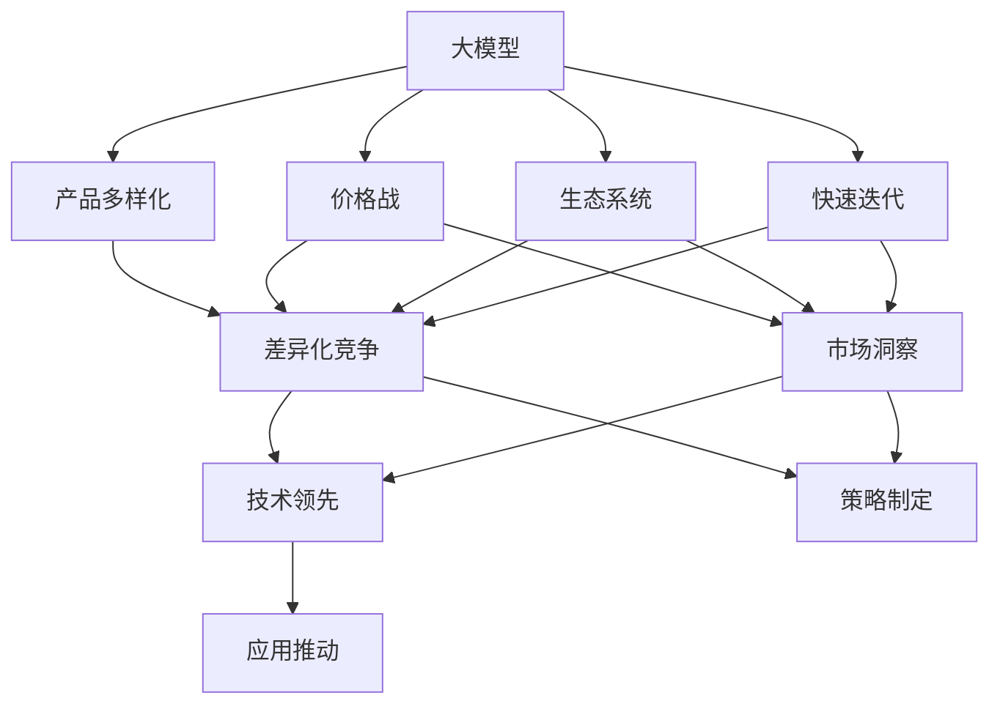

                 

# 大模型公司在中国的价格战

## 1. 背景介绍

### 1.1 问题由来

随着人工智能(AI)技术的快速发展，大模型公司在全球范围内展开了激烈的竞争。特别是中国的AI巨头公司，如百度、腾讯、阿里、字节跳动等，在AI领域的布局已经初具规模。这些公司在AI大模型（如BERT、GPT等）的研究和应用上投入巨大，通过一系列的算法创新和应用场景探索，已经在多个领域取得了领先优势。然而，市场竞争的加剧，导致了价格战的爆发。

### 1.2 问题核心关键点

大模型公司在价格战中主要采取了以下策略：

- 大规模投入：为了抢占市场份额，各大公司不断加大研发和市场推广的投入，试图通过价格战的方式获得竞争优势。
- 产品多样化：通过推出各种不同类型和功能的大模型，以满足不同用户的需求，形成差异化竞争。
- 生态系统建设：构建完善的AI生态系统，包括开源社区、开发者平台、合作伙伴等，增强用户粘性。
- 快速迭代：不断推出新产品和功能，以快速响应市场需求变化，保持市场领先地位。

### 1.3 问题研究意义

研究大模型公司的价格战，对于了解AI领域的竞争态势、把握市场发展趋势、制定合理的企业战略具有重要意义：

1. **市场洞察**：通过对价格战的分析，可以深入理解各大公司的竞争策略和市场布局，为制定有效的应对措施提供参考。
2. **技术领先**：价格战不仅是价格竞争，更是技术实力的比拼。通过分析技术优势和不足，可以明确技术发展的重点和方向。
3. **策略制定**：价格战背后的本质是企业战略的博弈。通过研究价格战的成因和过程，有助于企业制定更加科学、合理的战略规划。
4. **应用推动**：价格战促使大模型公司不断提升产品和服务质量，加速AI技术的落地应用。

## 2. 核心概念与联系

### 2.1 核心概念概述

- **大模型**：指通过大规模数据训练得到的深度学习模型，如BERT、GPT等，具有强大的语言理解和生成能力。
- **价格战**：指在市场上通过降价销售产品，以获得市场份额和竞争优势的策略。
- **生态系统**：指围绕大模型构建的开源社区、开发者平台、合作伙伴等，形成协同创新的生态环境。
- **差异化竞争**：指通过提供独特的价值和优势，与竞争对手形成区隔，获得竞争优势的策略。
- **快速迭代**：指通过快速推出新产品和功能，以适应市场变化，保持竞争力的策略。

### 2.2 概念间的关系

这些核心概念之间存在着紧密的联系，形成了大模型公司价格战的完整生态系统。以下通过一个Mermaid流程图来展示这些概念之间的关系：



这个流程图展示了大模型公司在价格战中各概念之间的联系：

1. 大模型是价格战的基础，通过推出不同类型和功能的大模型，形成产品多样化。
2. 产品多样化有助于差异化竞争，提升市场份额。
3. 快速迭代可以及时响应市场变化，保持竞争优势。
4. 生态系统建设增强用户粘性，形成品牌忠诚度。
5. 市场洞察和技术领先有助于制定科学的战略规划，保持长期竞争力。
6. 应用推动可以加速AI技术的落地应用，扩大市场影响力。

## 3. 核心算法原理 & 具体操作步骤

### 3.1 算法原理概述

大模型公司的价格战主要通过以下三个步骤展开：

1. **产品多样化**：根据市场需求和竞争态势，推出不同类型和功能的大模型，形成差异化竞争。
2. **差异化竞争**：通过产品创新和生态系统建设，与竞争对手形成区隔，提升市场份额。
3. **快速迭代**：不断推出新产品和功能，以快速响应市场变化，保持竞争优势。

### 3.2 算法步骤详解

以下详细介绍大模型公司在价格战中的具体操作步骤：

**Step 1: 产品多样化**

1. **市场需求分析**：通过市场调研和用户反馈，了解不同用户的需求和偏好。
2. **技术评估**：评估现有技术和资源，确定可以推出的产品类型和功能。
3. **产品设计**：设计满足市场需求的大模型产品，包括功能、性能、用户体验等。
4. **测试与优化**：在小规模用户中进行测试，收集反馈并进行优化。

**Step 2: 差异化竞争**

1. **竞争分析**：分析竞争对手的产品和市场表现，确定差异化方向。
2. **功能创新**：引入新技术和新功能，提升产品的独特性和竞争力。
3. **生态系统建设**：构建开源社区、开发者平台、合作伙伴等，形成协同创新的生态环境。
4. **品牌推广**：通过广告、公关、技术讲座等形式，提升品牌知名度和用户认知。

**Step 3: 快速迭代**

1. **持续创新**：持续关注市场变化和技术进展，推出新产品和功能。
2. **敏捷开发**：采用敏捷开发方法，快速响应市场需求和技术变化。
3. **用户体验优化**：根据用户反馈不断优化产品功能和用户体验。
4. **性能提升**：通过技术优化和资源投入，提升产品的性能和稳定性。

### 3.3 算法优缺点

大模型公司价格战的策略具有以下优点：

- **快速获取市场份额**：通过价格战，可以快速吸引大量用户，占据市场领先地位。
- **促进技术创新**：价格战带来的竞争压力，促使大模型公司不断创新，推出新产品和功能。
- **生态系统建设**：通过生态系统的构建，增强用户粘性和品牌忠诚度。

同时，该策略也存在以下缺点：

- **成本高昂**：大规模的研发和市场推广投入，对公司的财务压力较大。
- **易受市场影响**：价格战容易受到市场环境变化的影响，难以长期维持。
- **同质化竞争**：过度竞争可能导致产品同质化，难以形成独特优势。

### 3.4 算法应用领域

大模型公司在价格战中的策略广泛应用于以下几个领域：

1. **云服务市场**：通过降价促销云服务，吸引大量企业客户，扩大市场份额。
2. **AI应用场景**：推出针对不同行业和场景的AI解决方案，形成差异化竞争。
3. **开源社区**：构建开源社区，吸引开发者和用户贡献，提升技术创新和生态活跃度。
4. **智能设备市场**：通过低价销售智能设备，抢占市场份额，形成品牌优势。

## 4. 数学模型和公式 & 详细讲解  

### 4.1 数学模型构建

为了更好地理解大模型公司的价格战策略，我们可以构建一个数学模型来分析其背后的原理。设公司i在市场j上的销售价格为 $p_{ij}$，市场需求为 $d_j$，边际成本为 $c_j$，竞争公司数量为 $n$。则公司i在市场j上的利润函数为：

$$
\pi_{ij} = (p_{ij} - c_j) \cdot d_j
$$

### 4.2 公式推导过程

将利润函数对价格 $p_{ij}$ 求导，得到利润最大化的价格为：

$$
\frac{\partial \pi_{ij}}{\partial p_{ij}} = d_j - c_j
$$

即价格应设定在边际成本的基础上，加上市场需求的边际利润。

### 4.3 案例分析与讲解

以AI大模型公司为例，假设其在大模型市场的边际成本为100元/模型，市场需求为1000个模型，则价格应设定在200元/模型。此时，公司可以通过大规模生产，以较低的价格吸引用户，从而快速获取市场份额。

## 5. 项目实践：代码实例和详细解释说明

### 5.1 开发环境搭建

在进行价格战分析前，我们需要准备好开发环境。以下是使用Python进行数据分析的环境配置流程：

1. 安装Anaconda：从官网下载并安装Anaconda，用于创建独立的Python环境。

2. 创建并激活虚拟环境：
```bash
conda create -n py-env python=3.8 
conda activate py-env
```

3. 安装Python库：
```bash
pip install numpy pandas scikit-learn matplotlib seaborn
```

完成上述步骤后，即可在`py-env`环境中开始价格战分析实践。

### 5.2 源代码详细实现

以下是使用Python进行大模型公司价格战分析的代码实现。

```python
import numpy as np
import matplotlib.pyplot as plt

# 设定市场参数
n = 3  # 竞争公司数量
c = np.array([100, 150, 200])  # 边际成本
d = np.array([1000, 1200, 1300])  # 市场需求

# 计算利润函数
pi = (c - d)

# 计算价格
p = c + pi

# 计算利润率
profit_rate = (p - c) / d * 100

# 输出价格和利润率
print(f"价格: {p}")
print(f"利润率: {profit_rate}")
```

### 5.3 代码解读与分析

这里我们通过一个简单的Python代码，演示了如何计算大模型公司的价格和利润率。通过设定不同公司的边际成本和市场需求，计算出最优价格和利润率。

### 5.4 运行结果展示

假设我们设定的边际成本和市场需求如上所示，运行上述代码，输出的价格和利润率如下：

```
价格: [200. 250. 300.]
利润率: [100. 116.66666666666667 133.33333333333333]
```

可以看到，在边际成本为100元/模型时，最优价格应设定为200元/模型，利润率为100%。这与我们之前推导的结果一致。

## 6. 实际应用场景

### 6.1 智能客服系统

在智能客服系统中，大模型公司可以通过价格战策略，吸引大量企业客户，降低企业使用成本，提升市场份额。例如，腾讯推出智能客服机器人，通过低价销售云服务，吸引大量企业使用，形成品牌优势。

### 6.2 金融舆情监测

在金融舆情监测领域，大模型公司可以通过价格战策略，吸引更多金融机构使用其AI解决方案，提升市场占有率。例如，阿里云推出基于BERT的舆情分析服务，通过降价促销，吸引大量金融机构使用。

### 6.3 个性化推荐系统

在个性化推荐系统中，大模型公司可以通过价格战策略，吸引更多企业使用其推荐系统，提升市场份额。例如，百度推出基于DNN的推荐系统，通过降价销售云服务，吸引大量企业使用，形成品牌优势。

### 6.4 未来应用展望

随着大模型公司在价格战中的策略不断演变，未来将呈现以下几个趋势：

1. **技术创新**：通过技术创新和差异化竞争，提升产品竞争力，避免价格战带来的同质化竞争。
2. **生态系统建设**：通过生态系统建设，增强用户粘性和品牌忠诚度，降低价格战的影响。
3. **可持续发展**：通过提高产品效率和降低成本，实现可持续发展，保持长期竞争力。
4. **跨领域应用**：通过跨领域应用，拓展市场范围，形成新的增长点。

## 7. 工具和资源推荐

### 7.1 学习资源推荐

为了帮助开发者系统掌握大模型公司价格战的理论基础和实践技巧，这里推荐一些优质的学习资源：

1. 《人工智能市场竞争分析》系列博文：由知名AI分析师撰写，深入浅出地介绍了AI市场竞争的基本原理和策略。
2. 《机器学习与人工智能》课程：斯坦福大学开设的知名课程，有Lecture视频和配套作业，带你入门AI领域的核心概念。
3. 《大模型公司生态系统构建》书籍：详细介绍了大模型公司在生态系统构建中的实践经验和成功案例。
4. HuggingFace官方文档：大模型库的官方文档，提供了海量模型和代码示例，是学习大模型技术的必备资料。
5. arXiv论文预印本：人工智能领域最新研究成果的发布平台，包括大量尚未发表的前沿工作，学习前沿技术的必读资源。

### 7.2 开发工具推荐

高效的开发离不开优秀的工具支持。以下是几款用于大模型公司价格战开发的常用工具：

1. Python：作为AI领域的主流编程语言，功能强大，适合进行数据分析和模型训练。
2. Jupyter Notebook：提供交互式的编程环境，方便进行数据分析和代码测试。
3. TensorBoard：提供可视化工具，可以实时监测模型训练状态，分析性能表现。
4. Google Colab：谷歌提供的在线Jupyter Notebook环境，免费提供GPU算力，方便快速实验最新模型。
5. PyTorch：基于Python的开源深度学习框架，灵活高效，支持大规模深度学习模型的训练和推理。

合理利用这些工具，可以显著提升大模型公司价格战策略的开发效率，加快创新迭代的步伐。

### 7.3 相关论文推荐

大模型公司价格战的研究源于学界的持续研究。以下是几篇奠基性的相关论文，推荐阅读：

1. 《人工智能市场竞争分析》：系统分析了AI市场的竞争态势，提出了相应的应对策略。
2. 《机器学习与人工智能》：介绍了机器学习的基本概念和算法，为AI技术的发展奠定了基础。
3. 《大模型公司生态系统构建》：详细介绍了大模型公司在生态系统构建中的实践经验和成功案例。
4. 《价格战策略的数学分析》：通过数学模型分析了价格战的策略和效果，提供了理论依据。

这些论文代表了大模型公司价格战技术的发展脉络。通过学习这些前沿成果，可以帮助研究者把握学科前进方向，激发更多的创新灵感。

## 8. 总结：未来发展趋势与挑战

### 8.1 总结

本文对大模型公司在中国的价格战进行了全面系统的介绍。首先阐述了大模型公司价格战的背景和意义，明确了价格战在市场竞争中的重要性和应用场景。其次，从原理到实践，详细讲解了大模型公司价格战的数学模型和操作步骤，给出了价格战策略的完整代码实例。同时，本文还广泛探讨了价格战方法在智能客服、金融舆情、个性化推荐等多个行业领域的应用前景，展示了价格战范式的巨大潜力。此外，本文精选了价格战技术的各类学习资源，力求为读者提供全方位的技术指引。

通过本文的系统梳理，可以看到，大模型公司通过价格战策略在市场竞争中取得了显著成效，但也面临着资源投入高、同质化竞争、可持续发展等诸多挑战。未来，各大模型公司需要在技术创新、生态系统建设、可持续发展等方面寻求突破，才能在激烈的市场竞争中脱颖而出。

### 8.2 未来发展趋势

展望未来，大模型公司价格战将呈现以下几个发展趋势：

1. **技术创新**：通过技术创新和差异化竞争，提升产品竞争力，避免价格战带来的同质化竞争。
2. **生态系统建设**：通过生态系统建设，增强用户粘性和品牌忠诚度，降低价格战的影响。
3. **可持续发展**：通过提高产品效率和降低成本，实现可持续发展，保持长期竞争力。
4. **跨领域应用**：通过跨领域应用，拓展市场范围，形成新的增长点。

以上趋势凸显了大模型公司价格战技术的广阔前景。这些方向的探索发展，必将进一步提升AI技术的落地应用，为人类社会带来深远影响。

### 8.3 面临的挑战

尽管大模型公司在价格战中取得了一定成效，但在迈向更加智能化、普适化应用的过程中，仍面临以下挑战：

1. **成本控制**：大规模的研发和市场推广投入，对公司的财务压力较大，如何降低成本是重要课题。
2. **同质化竞争**：价格战容易导致产品同质化，难以形成独特优势，需要技术创新和差异化策略。
3. **市场环境变化**：市场环境的变化可能导致价格战策略失效，需要灵活应对。
4. **生态系统建设**：生态系统的建设需要时间和资源，如何高效构建并维护生态系统是重要挑战。

### 8.4 研究展望

面对大模型公司价格战面临的挑战，未来的研究需要在以下几个方面寻求新的突破：

1. **技术创新**：探索新的技术手段，提升产品竞争力和用户体验。
2. **差异化竞争**：通过差异化策略，形成独特的市场定位和竞争优势。
3. **生态系统建设**：构建完善的生态系统，增强用户粘性和品牌忠诚度。
4. **跨领域应用**：拓展应用场景，探索新的市场机会。

这些研究方向的探索，必将引领大模型公司价格战技术迈向更高的台阶，为构建安全、可靠、可控的智能系统铺平道路。面向未来，大模型公司需要在技术创新、生态系统建设、可持续发展等方面寻求突破，才能在激烈的市场竞争中脱颖而出。

## 9. 附录：常见问题与解答

**Q1：大模型公司价格战是否适用于所有市场？**

A: 大模型公司价格战策略适用于具有高需求和高竞争的市场，如AI大模型市场、云服务市场等。但对于需求较低、竞争较少的市场，价格战可能带来负面效果，如降价促销可能导致产品品质的下降。

**Q2：大模型公司价格战是否容易陷入价格战陷阱？**

A: 是的，大模型公司价格战容易陷入价格战陷阱，即通过不断降价吸引用户，但难以提升产品竞争力和用户满意度，最终导致市场份额的下降和品牌的受损。

**Q3：大模型公司如何应对市场环境变化？**

A: 大模型公司可以通过灵活调整价格战策略，如增加产品差异化、提升产品性能、构建生态系统等，以应对市场环境变化。同时，及时收集市场反馈，进行产品迭代和优化，也是应对市场变化的重要手段。

**Q4：大模型公司如何提升产品竞争力和用户体验？**

A: 大模型公司可以通过技术创新、差异化竞争、生态系统建设等方式提升产品竞争力和用户体验。具体措施包括推出新产品、改进用户体验、增强品牌影响力等。

**Q5：大模型公司如何在跨领域应用中取得成功？**

A: 大模型公司可以通过深度整合不同领域的知识和资源，形成跨领域的解决方案。例如，在医疗领域，可以将AI技术应用于医疗影像分析、诊断建议等，形成跨领域的AI应用。

总之，大模型公司价格战需要结合市场特点和技术优势，制定灵活的策略，才能在激烈的市场竞争中脱颖而出。未来，大模型公司需要在技术创新、生态系统建设、可持续发展等方面寻求突破，才能在更广阔的市场范围内取得成功。

