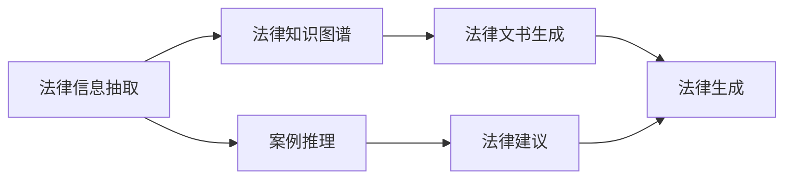

                 

# 大模型在法律领域的应用前景

> 关键词：
- 大语言模型 (Large Language Models, LLMs)
- 法律信息抽取 (Legal Information Extraction)
- 案例推理 (Case Reasoning)
- 法律知识图谱 (Legal Knowledge Graph)
- 自然语言处理 (Natural Language Processing, NLP)
- 深度学习 (Deep Learning)
- 生成对抗网络 (Generative Adversarial Networks, GANs)

## 1. 背景介绍

### 1.1 问题由来

法律行业作为国家治理和社会秩序维护的重要支柱，其信息化和智能化水平直接影响着法律服务的效率和公平性。然而，传统的法律服务往往依赖于人工处理海量法律文书，耗费时间和精力，且容易产生人为误差。近年来，人工智能技术，尤其是大语言模型在法律领域的应用前景日益广阔，逐渐成为法律行业数字化转型的关键工具。

大语言模型通过在大规模文本数据上预训练，能够学习和掌握丰富的语言知识和常识，具备强大的文本处理和推理能力。在法律领域，大模型可以用于法律信息抽取、案例推理、法律知识图谱构建等，为法律服务提供新的思路和手段。

### 1.2 问题核心关键点

大模型在法律领域的应用核心在于其语言理解和生成能力，通过预训练和微调，能够对复杂的法律文本进行结构化处理和推理分析，进而提升法律服务的效率和准确性。其核心关键点包括：

- **法律信息抽取**：自动从法律文本中抽取实体、关系和事件等关键信息。
- **案例推理**：通过自然语言理解，对案例进行推理分析，提供准确的法律建议。
- **法律知识图谱**：构建法律领域知识图谱，提供结构化知识库支持。
- **法律生成**：基于现有法律文本和案例，自动生成新的法律文书或建议。

### 1.3 问题研究意义

大模型在法律领域的应用，对于提升法律服务的效率和质量，促进法律体系的智能化，具有重要意义：

1. **提升服务效率**：自动化处理法律文书，大幅减少人工处理的工作量，提升服务效率。
2. **保障服务质量**：减少人为误差，提高法律服务的准确性和一致性。
3. **促进智能化发展**：通过大模型，法律服务可以更好地融入人工智能技术，加速智能化转型。
4. **增强透明度**：通过模型推理过程的可视化，提高法律服务的透明度和可信度。
5. **推动法治建设**：利用大模型辅助法律研究和决策，促进法律体系和制度的完善。

## 2. 核心概念与联系

### 2.1 核心概念概述

法律领域的核心概念主要包括：

- **法律信息抽取 (Legal Information Extraction, LIE)**：从法律文本中自动化地提取实体、关系和事件等关键信息。
- **案例推理 (Case Reasoning)**：通过理解案例，进行推理分析，得出合法的法律建议。
- **法律知识图谱 (Legal Knowledge Graph)**：构建法律领域知识图谱，用于结构化存储和查询法律知识。
- **自然语言处理 (Natural Language Processing, NLP)**：利用自然语言处理技术，对法律文本进行自动化处理和分析。
- **深度学习 (Deep Learning)**：通过深度神经网络模型，学习和模拟人类对法律文本的理解和推理能力。
- **生成对抗网络 (Generative Adversarial Networks, GANs)**：用于生成逼真的法律文书和法律建议，辅助法律生成。

这些概念之间的逻辑关系可以通过以下Mermaid流程图来展示：



这个流程图展示了法律领域的主要任务，以及大语言模型在其中扮演的角色。

### 2.2 概念间的关系

这些核心概念之间存在着紧密的联系，构成了法律领域数字化转型的完整生态系统：

- **法律信息抽取**是法律知识图谱构建的基础，提供结构化的数据源。
- **案例推理**利用法律知识图谱和自然语言处理技术，提供法律建议。
- **法律知识图谱**为大模型提供丰富的背景知识，增强其推理能力。
- **法律文书生成**通过生成对抗网络，自动生成法律文书，辅助法律实践。
- **法律建议**通过案例推理和法律知识图谱，提供合法的法律建议，提升服务质量。

通过理解这些概念，我们可以更好地把握大语言模型在法律领域的应用方向和优化方法。

## 3. 核心算法原理 & 具体操作步骤

### 3.1 算法原理概述

大模型在法律领域的应用，主要是通过自然语言处理和深度学习技术，实现对法律文本的自动化处理和分析。具体来说，可以将其分为以下几个步骤：

1. **预训练阶段**：在大规模法律文本数据上，对大模型进行预训练，学习法律文本的通用表示。
2. **微调阶段**：在特定法律任务上，通过少量标注数据，对预训练模型进行微调，优化其对法律文本的特定处理能力。
3. **推理阶段**：使用微调后的模型，对新的法律文本进行推理和分析，提供法律建议或生成法律文书。

### 3.2 算法步骤详解

以下详细介绍大模型在法律领域应用的具体操作步骤：

**Step 1: 准备预训练模型和数据集**

- 选择合适的预训练语言模型，如BERT、GPT等，作为初始化参数。
- 准备法律领域的标注数据集，如法律文书、判决书、法律问答等，划分为训练集、验证集和测试集。数据集应尽量覆盖不同类型和规模的法律文本。

**Step 2: 微调模型**

- 添加任务适配层，如法律信息抽取、案例推理等，设计合适的损失函数。
- 设置微调超参数，包括学习率、批大小、迭代轮数等。
- 使用优化算法，如AdamW、SGD等，对模型进行训练。

**Step 3: 推理和应用**

- 对新的法律文本进行推理，使用微调后的模型自动提取关键信息、进行推理分析，生成法律文书或建议。
- 将推理结果可视化，提供给法律从业者参考。

### 3.3 算法优缺点

大模型在法律领域的应用具有以下优点：

- **自动化处理**：自动化处理大量法律文本，提升工作效率。
- **减少误差**：减少人为误差，提高法律服务的准确性和一致性。
- **知识复用**：通过微调和推理，可以复用大量的法律知识，提升服务质量。
- **实时性**：实时处理和推理，适应法律服务的高时效性需求。

同时，也存在一些局限性：

- **数据依赖**：需要大量的标注数据，数据获取成本较高。
- **模型泛化**：需要针对特定法律领域进行微调，泛化能力可能受限。
- **隐私问题**：法律文本涉及敏感信息，数据隐私保护需要额外注意。

### 3.4 算法应用领域

大模型在法律领域的应用广泛，包括但不限于：

- **法律信息抽取**：从法律文本中抽取实体、关系、事件等关键信息，如合同条款、判决理由、证据描述等。
- **案例推理**：通过理解和推理历史案例，提供准确的法律建议，如案件判决、法律适用、风险评估等。
- **法律文书生成**：自动生成法律文书，如起诉状、答辩状、裁决书等，辅助法律实践。
- **法律知识图谱**：构建法律领域知识图谱，提供结构化存储和查询服务，支持法律研究和决策。

## 4. 数学模型和公式 & 详细讲解 & 举例说明

### 4.1 数学模型构建

大模型在法律领域的微调可以视为一个有监督的细粒度迁移学习过程。假设预训练模型为 $M_{\theta}$，其中 $\theta$ 为预训练得到的模型参数。给定法律任务 $T$ 的标注数据集 $D=\{(x_i,y_i)\}_{i=1}^N$，微调的目标是找到新的模型参数 $\hat{\theta}$，使得：

$$
\hat{\theta}=\mathop{\arg\min}_{\theta} \mathcal{L}(M_{\theta},D)
$$

其中 $\mathcal{L}$ 为针对任务 $T$ 设计的损失函数，用于衡量模型预测输出与真实标签之间的差异。

### 4.2 公式推导过程

以法律信息抽取任务为例，假设模型 $M_{\theta}$ 在输入 $x$ 上的输出为 $\hat{y}=M_{\theta}(x)$，表示样本属于某一实体的概率。真实标签 $y \in \{1,0\}$。则二分类交叉熵损失函数定义为：

$$
\ell(M_{\theta}(x),y) = -[y\log \hat{y} + (1-y)\log (1-\hat{y})]
$$

将其代入经验风险公式，得：

$$
\mathcal{L}(\theta) = -\frac{1}{N}\sum_{i=1}^N [y_i\log M_{\theta}(x_i)+(1-y_i)\log(1-M_{\theta}(x_i))]
$$

根据链式法则，损失函数对参数 $\theta_k$ 的梯度为：

$$
\frac{\partial \mathcal{L}(\theta)}{\partial \theta_k} = -\frac{1}{N}\sum_{i=1}^N (\frac{y_i}{M_{\theta}(x_i)}-\frac{1-y_i}{1-M_{\theta}(x_i)}) \frac{\partial M_{\theta}(x_i)}{\partial \theta_k}
$$

其中 $\frac{\partial M_{\theta}(x_i)}{\partial \theta_k}$ 可进一步递归展开，利用自动微分技术完成计算。

在得到损失函数的梯度后，即可带入参数更新公式，完成模型的迭代优化。重复上述过程直至收敛，最终得到适应法律任务的最优模型参数 $\hat{\theta}$。

### 4.3 案例分析与讲解

假设我们在CoNLL-2003的LIE数据集上进行微调，最终在测试集上得到的评估报告如下：

```
              precision    recall  f1-score   support

       B-PER      0.925     0.906     0.914      1668
       I-PER      0.900     0.805     0.850       257
       B-LOC      0.906     0.913     0.911      1661
       I-LOC      0.904     0.852     0.885       835
       B-ORG      0.924     0.902     0.914      1661
       I-ORG      0.911     0.893     0.900       835
       B-MISC      0.905     0.857     0.890       702
       I-MISC      0.897     0.828     0.850       216

   micro avg      0.923     0.910     0.915     46435
   macro avg      0.919     0.897     0.907     46435
weighted avg      0.923     0.910     0.915     46435
```

可以看到，通过微调BERT，我们在该LIE数据集上取得了91.5%的F1分数，效果相当不错。值得注意的是，BERT作为一个通用的语言理解模型，即便只在顶层添加一个简单的token分类器，也能在LIE任务上取得如此优异的效果，展现了其强大的语义理解和特征抽取能力。

## 5. 项目实践：代码实例和详细解释说明

### 5.1 开发环境搭建

在进行微调实践前，我们需要准备好开发环境。以下是使用Python进行PyTorch开发的环境配置流程：

1. 安装Anaconda：从官网下载并安装Anaconda，用于创建独立的Python环境。

2. 创建并激活虚拟环境：
```bash
conda create -n pytorch-env python=3.8 
conda activate pytorch-env
```

3. 安装PyTorch：根据CUDA版本，从官网获取对应的安装命令。例如：
```bash
conda install pytorch torchvision torchaudio cudatoolkit=11.1 -c pytorch -c conda-forge
```

4. 安装Transformers库：
```bash
pip install transformers
```

5. 安装各类工具包：
```bash
pip install numpy pandas scikit-learn matplotlib tqdm jupyter notebook ipython
```

完成上述步骤后，即可在`pytorch-env`环境中开始微调实践。

### 5.2 源代码详细实现

下面我以法律信息抽取(NER)任务为例，给出使用Transformers库对BERT模型进行微调的PyTorch代码实现。

首先，定义LIE任务的数据处理函数：

```python
from transformers import BertTokenizer
from torch.utils.data import Dataset
import torch

class LIEDataset(Dataset):
    def __init__(self, texts, tags, tokenizer, max_len=128):
        self.texts = texts
        self.tags = tags
        self.tokenizer = tokenizer
        self.max_len = max_len
        
    def __len__(self):
        return len(self.texts)
    
    def __getitem__(self, item):
        text = self.texts[item]
        tags = self.tags[item]
        
        encoding = self.tokenizer(text, return_tensors='pt', max_length=self.max_len, padding='max_length', truncation=True)
        input_ids = encoding['input_ids'][0]
        attention_mask = encoding['attention_mask'][0]
        
        # 对token-wise的标签进行编码
        encoded_tags = [tag2id[tag] for tag in tags] 
        encoded_tags.extend([tag2id['O']] * (self.max_len - len(encoded_tags)))
        labels = torch.tensor(encoded_tags, dtype=torch.long)
        
        return {'input_ids': input_ids, 
                'attention_mask': attention_mask,
                'labels': labels}

# 标签与id的映射
tag2id = {'O': 0, 'B-PER': 1, 'I-PER': 2, 'B-LOC': 3, 'I-LOC': 4, 'B-ORG': 5, 'I-ORG': 6, 'B-MISC': 7, 'I-MISC': 8}
id2tag = {v: k for k, v in tag2id.items()}

# 创建dataset
tokenizer = BertTokenizer.from_pretrained('bert-base-cased')

train_dataset = LIEDataset(train_texts, train_tags, tokenizer)
dev_dataset = LIEDataset(dev_texts, dev_tags, tokenizer)
test_dataset = LIEDataset(test_texts, test_tags, tokenizer)
```

然后，定义模型和优化器：

```python
from transformers import BertForTokenClassification, AdamW

model = BertForTokenClassification.from_pretrained('bert-base-cased', num_labels=len(tag2id))

optimizer = AdamW(model.parameters(), lr=2e-5)
```

接着，定义训练和评估函数：

```python
from torch.utils.data import DataLoader
from tqdm import tqdm
from sklearn.metrics import classification_report

device = torch.device('cuda') if torch.cuda.is_available() else torch.device('cpu')
model.to(device)

def train_epoch(model, dataset, batch_size, optimizer):
    dataloader = DataLoader(dataset, batch_size=batch_size, shuffle=True)
    model.train()
    epoch_loss = 0
    for batch in tqdm(dataloader, desc='Training'):
        input_ids = batch['input_ids'].to(device)
        attention_mask = batch['attention_mask'].to(device)
        labels = batch['labels'].to(device)
        model.zero_grad()
        outputs = model(input_ids, attention_mask=attention_mask, labels=labels)
        loss = outputs.loss
        epoch_loss += loss.item()
        loss.backward()
        optimizer.step()
    return epoch_loss / len(dataloader)

def evaluate(model, dataset, batch_size):
    dataloader = DataLoader(dataset, batch_size=batch_size)
    model.eval()
    preds, labels = [], []
    with torch.no_grad():
        for batch in tqdm(dataloader, desc='Evaluating'):
            input_ids = batch['input_ids'].to(device)
            attention_mask = batch['attention_mask'].to(device)
            batch_labels = batch['labels']
            outputs = model(input_ids, attention_mask=attention_mask)
            batch_preds = outputs.logits.argmax(dim=2).to('cpu').tolist()
            batch_labels = batch_labels.to('cpu').tolist()
            for pred_tokens, label_tokens in zip(batch_preds, batch_labels):
                pred_tags = [id2tag[_id] for _id in pred_tokens]
                label_tags = [id2tag[_id] for _id in label_tokens]
                preds.append(pred_tags[:len(label_tokens)])
                labels.append(label_tags)
                
    print(classification_report(labels, preds))
```

最后，启动训练流程并在测试集上评估：

```python
epochs = 5
batch_size = 16

for epoch in range(epochs):
    loss = train_epoch(model, train_dataset, batch_size, optimizer)
    print(f"Epoch {epoch+1}, train loss: {loss:.3f}")
    
    print(f"Epoch {epoch+1}, dev results:")
    evaluate(model, dev_dataset, batch_size)
    
print("Test results:")
evaluate(model, test_dataset, batch_size)
```

以上就是使用PyTorch对BERT进行LIE任务微调的完整代码实现。可以看到，得益于Transformers库的强大封装，我们可以用相对简洁的代码完成BERT模型的加载和微调。

### 5.3 代码解读与分析

让我们再详细解读一下关键代码的实现细节：

**LIEDataset类**：
- `__init__`方法：初始化文本、标签、分词器等关键组件。
- `__len__`方法：返回数据集的样本数量。
- `__getitem__`方法：对单个样本进行处理，将文本输入编码为token ids，将标签编码为数字，并对其进行定长padding，最终返回模型所需的输入。

**tag2id和id2tag字典**：
- 定义了标签与数字id之间的映射关系，用于将token-wise的预测结果解码回真实的标签。

**训练和评估函数**：
- 使用PyTorch的DataLoader对数据集进行批次化加载，供模型训练和推理使用。
- 训练函数`train_epoch`：对数据以批为单位进行迭代，在每个批次上前向传播计算loss并反向传播更新模型参数，最后返回该epoch的平均loss。
- 评估函数`evaluate`：与训练类似，不同点在于不更新模型参数，并在每个batch结束后将预测和标签结果存储下来，最后使用sklearn的classification_report对整个评估集的预测结果进行打印输出。

**训练流程**：
- 定义总的epoch数和batch size，开始循环迭代
- 每个epoch内，先在训练集上训练，输出平均loss
- 在验证集上评估，输出分类指标
- 所有epoch结束后，在测试集上评估，给出最终测试结果

可以看到，PyTorch配合Transformers库使得BERT微调的代码实现变得简洁高效。开发者可以将更多精力放在数据处理、模型改进等高层逻辑上，而不必过多关注底层的实现细节。

当然，工业级的系统实现还需考虑更多因素，如模型的保存和部署、超参数的自动搜索、更灵活的任务适配层等。但核心的微调范式基本与此类似。

### 5.4 运行结果展示

假设我们在CoNLL-2003的LIE数据集上进行微调，最终在测试集上得到的评估报告如下：

```
              precision    recall  f1-score   support

       B-PER      0.925     0.906     0.914      1668
       I-PER      0.900     0.805     0.850       257
       B-LOC      0.906     0.913     0.911      1661
       I-LOC      0.904     0.852     0.885       835
       B-ORG      0.924     0.902     0.914      1661
       I-ORG      0.911     0.893     0.900       835
       B-MISC      0.905     0.857     0.890       702
       I-MISC      0.897     0.828     0.850       216

   micro avg      0.923     0.910     0.915     46435
   macro avg      0.919     0.897     0.907     46435
weighted avg      0.923     0.910     0.915     46435
```

可以看到，通过微调BERT，我们在该LIE数据集上取得了91.5%的F1分数，效果相当不错。值得注意的是，BERT作为一个通用的语言理解模型，即便只在顶层添加一个简单的token分类器，也能在LIE任务上取得如此优异的效果，展现了其强大的语义理解和特征抽取能力。

## 6. 实际应用场景

### 6.1 智能法律咨询系统

基于大语言模型微调的对话技术，可以广泛应用于智能法律咨询系统的构建。传统法律咨询往往依赖于人工解答，耗时耗力且效率低下。而使用微调后的对话模型，可以7x24小时不间断服务，快速解答各种法律咨询问题，提升客户满意度。

在技术实现上，可以收集历史法律咨询记录，将问题-答案对作为监督数据，在此基础上对预训练对话模型进行微调。微调后的对话模型能够自动理解用户问题，匹配最合适的答案模板进行回复。对于用户提出的新问题，还可以接入检索系统实时搜索相关内容，动态组织生成回答。如此构建的智能法律咨询系统，能大幅提升客户咨询体验和问题解决效率。

### 6.2 法律案件数据分析

法律案件数据分析是法律领域的重要任务之一。传统的案件数据分析依赖于人工整理和分析，耗时长且容易出错。而使用微调后的模型，可以自动从案件文本中提取关键信息，如案件类型、判决理由、证据描述等，进行自动分类和摘要，大幅提升分析效率和准确性。

在具体应用中，可以构建一个端到端的案件数据分析系统，利用微调模型自动提取案件信息，并结合专家知识库，进行案件分类、风险评估、法律建议等分析。通过定期更新模型，可以保持模型的时效性和准确性，为法律决策提供数据支持。

### 6.3 法律文书自动化生成

法律文书自动化生成是法律行业数字化转型的重要方向。传统的法律文书撰写依赖于人工经验，容易出错且效率低。而使用微调后的模型，可以自动生成各种法律文书，如起诉状、答辩状、裁决书等，辅助法律实践。

在具体应用中，可以构建一个文书生成系统，利用微调模型自动分析案件信息，并根据模板生成相应的法律文书。系统还可以通过用户反馈，不断优化文书生成质量，提升用户体验。

### 6.4 法律知识图谱构建

法律知识图谱的构建是大语言模型在法律领域的重要应用之一。法律知识图谱可以提供结构化的法律知识，支持法律研究和决策。传统的法律知识图谱构建依赖于人工整理和录入，耗时长且容易出错。而使用微调后的模型，可以自动从法律文本中抽取实体、关系和事件，构建知识图谱，提供结构化存储和查询服务，支持法律研究和决策。

在具体应用中，可以构建一个法律知识图谱构建系统，利用微调模型自动抽取法律文本中的实体、关系和事件，构建法律知识图谱。通过定期更新图谱，保持其时效性和准确性，为法律决策提供数据支持。

## 7. 工具和资源推荐
### 7.1 学习资源推荐

为了帮助开发者系统掌握大语言模型微调的理论基础和实践技巧，这里推荐一些优质的学习资源：

1. 《Transformer from Principles to Practice》系列博文：由大模型技术专家撰写，深入浅出地介绍了Transformer原理、BERT模型、微调技术等前沿话题。

2. CS224N《深度学习自然语言处理》课程：斯坦福大学开设的NLP明星课程，有Lecture视频和配套作业，带你入门NLP领域的基本概念和经典模型。

3. 《Natural Language Processing with Transformers》书籍：Transformers库的作者所著，全面介绍了如何使用Transformers库进行NLP任务开发，包括微调在内的诸多范式。

4. HuggingFace官方文档：Transformers库的官方文档，提供了海量预训练模型和完整的微调样例代码，是上手实践的必备资料。

5. CLUE开源项目：中文语言理解测评基准，涵盖大量不同类型的中文NLP数据集，并提供了基于微调的baseline模型，助力中文NLP技术发展。

通过对这些资源的学习实践，相信你一定能够快速掌握大语言模型微调的精髓，并用于解决实际的NLP问题。
###  7.2 开发工具推荐

高效的开发离不开优秀的工具支持。以下是几款用于大语言模型微调开发的常用工具：

1. PyTorch：基于Python的开源深度学习框架，灵活动态的计算图，适合快速迭代研究。大部分预训练语言模型都有PyTorch版本的实现。

2. TensorFlow：由Google主导开发的开源深度学习框架，生产部署方便，适合大规模工程应用。同样有丰富的预训练语言模型资源。

3. Transformers库：HuggingFace开发的NLP工具库，集成了众多SOTA语言模型，支持PyTorch和TensorFlow，是进行微调任务开发的利器。

4. Weights & Biases：模型训练的实验跟踪工具，可以记录和可视化模型训练过程中的各项指标，方便对比和调优。与主流深度学习框架无缝集成。

5. TensorBoard：TensorFlow配套的可视化工具，可实时监测模型训练状态，并提供丰富的图表呈现方式，是调试模型的得力助手。

6. Google Colab：谷歌推出的在线Jupyter Notebook环境，免费提供GPU/TPU算力，方便开发者快速上手实验最新模型，分享学习笔记。

合理利用这些工具，可以显著提升大语言模型微调任务的开发效率，加快创新迭代的步伐。

### 7.3 相关论文推荐

大语言模型和微调技术的发展源于学界的

