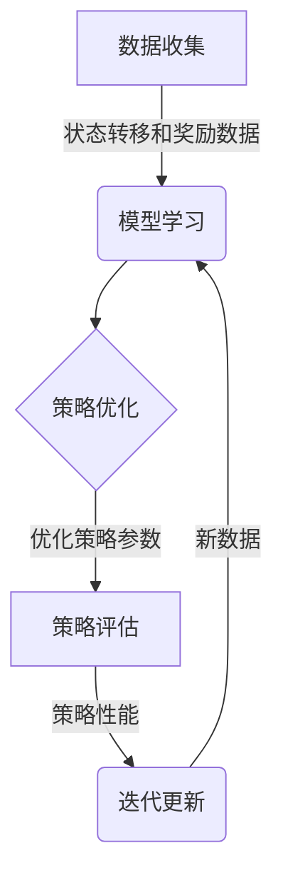

# 强化学习Reinforcement Learning中基于模拟的优化方法研讨

## 1. 背景介绍

### 1.1 问题的由来

强化学习(Reinforcement Learning, RL)是机器学习的一个重要分支,它关注智能体与环境之间的相互作用,旨在通过试错学习和累积经验,获得最佳策略以最大化长期累积奖励。与监督学习和无监督学习不同,强化学习没有提供标准答案,智能体必须通过与环境的交互来探索和学习。

在强化学习问题中,往往存在庞大的状态空间和行动空间,使得基于模型的方法难以应对。此时,基于模拟的优化方法(Simulation-Based Optimization, SBO)为解决这一挑战提供了一种有效的途径。SBO方法通过构建模拟环境,利用有限的模拟数据来近似真实环境,从而减少了与真实环境交互的需求,提高了学习效率。

### 1.2 研究现状

近年来,基于模拟的优化方法在强化学习领域受到了广泛关注。研究人员提出了多种不同的SBO算法,如基于模型的方法、基于规划的方法、基于梯度的方法等,并在多个领域取得了显著成果。

- **基于模型的方法**:通过构建环境模型来近似真实环境,然后在模拟环境中进行规划和优化。典型算法包括Dyna、prioritized sweeping等。
- **基于规划的方法**:利用模拟数据构建价值函数近似,并基于价值函数进行规划和决策。代表算法有UCT(Upper Confidence Trees)、MCTS(Monte Carlo Tree Search)等。
- **基于梯度的方法**:通过梯度下降等优化方法直接优化策略参数,常见算法包括REINFORCE、Actor-Critic等。

尽管取得了一定进展,但现有SBO方法仍然存在一些局限性,如模型偏差、样本效率低下、算法收敛慢等,亟需进一步改进和创新。

### 1.3 研究意义

基于模拟的优化方法为强化学习问题提供了一种高效的解决途径,具有重要的理论意义和应用价值:

- **理论意义**:SBO方法为强化学习提供了一种新的范式,有助于深入理解智能体与环境之间的交互过程,促进强化学习理论的发展。
- **应用价值**:SBO方法可以应用于诸多实际问题,如机器人控制、智能交通系统、智能制造等,为解决复杂的决策和控制问题提供了有力工具。

因此,深入研究基于模拟的优化方法对于推动强化学习理论发展和促进其在实际领域的应用都具有重要意义。

### 1.4 本文结构

本文将全面系统地介绍强化学习中基于模拟的优化方法。首先阐述核心概念和原理,然后详细讲解主要算法的数学模型和实现细节,并通过实例分析其应用场景。最后总结现有方法的局限性,展望未来的发展趋势和挑战。全文共分为以下几个部分:

1. 背景介绍
2. 核心概念与联系
3. 核心算法原理与具体操作步骤
4. 数学模型和公式详细讲解与举例说明
5. 项目实践:代码实例和详细解释说明
6. 实际应用场景
7. 工具和资源推荐
8. 总结:未来发展趋势与挑战
9. 附录:常见问题与解答

## 2. 核心概念与联系

在深入探讨基于模拟的优化算法之前,我们先介绍一些强化学习和SBO方法的核心概念:

1. **智能体(Agent)和环境(Environment)**:强化学习过程中,智能体与环境进行交互。智能体根据当前状态选择行动,环境则根据行动和当前状态转移到下一个状态,并返回奖励。
2. **状态(State)和行动(Action)**:状态描述了环境的当前情况,行动则表示智能体可以采取的操作。状态空间和行动空间的大小直接影响问题的复杂度。
3. **奖励函数(Reward Function)**:奖励函数定义了智能体在特定状态下采取行动后获得的即时奖励,是强化学习的核心驱动力。
4. **策略(Policy)**:策略是一个映射函数,将状态映射到相应的行动概率分布上,表示智能体在每个状态下的行为选择策略。
5. **价值函数(Value Function)**:价值函数估计了从当前状态开始,按照某一策略执行后的长期累积奖励。
6. **模拟环境(Simulation Environment)**:SBO方法通过构建模拟环境来近似真实环境,从而减少与真实环境的交互,提高学习效率。

上述概念相互关联、环环相扣,是理解和实现基于模拟的优化算法的基础。接下来我们将详细介绍这些算法的原理和实现细节。

## 3. 核心算法原理与具体操作步骤

### 3.1 算法原理概述

基于模拟的优化算法的核心思想是:利用有限的真实环境交互数据,构建模拟环境模型,然后在模拟环境中进行大量试验,从而高效地学习最优策略。该过程可分为以下几个关键步骤:

1. **数据收集**:通过与真实环境交互,收集状态转移和奖励数据。
2. **模型学习**:基于收集的数据,构建模拟环境模型,近似真实环境的动态和奖励机制。
3. **策略优化**:在模拟环境中,通过搜索、规划或梯度下降等优化方法,更新和优化策略参数。
4. **策略评估**:将优化后的策略应用到真实环境中,评估其性能并收集新的数据。
5. **迭代更新**:利用新收集的数据,更新模拟环境模型,重复上述过程直至收敛。

这种基于模拟的方式,一方面可以充分利用真实环境数据,另一方面又避免了过多的真实环境交互,从而提高了学习效率。不同的SBO算法在具体实现上有所区别,但都遵循这一核心思路。

### 3.2 算法步骤详解

接下来,我们将详细介绍三种典型的基于模拟的优化算法:Dyna、UCT和REINFORCE,并分析它们的具体实现步骤。

#### 3.2.1 Dyna算法

Dyna算法是一种基于模型的强化学习算法,它结合了基于模型的规划和基于样本的学习。算法步骤如下:

1. **初始化**:初始化策略和价值函数估计。
2. **与真实环境交互**:选择行动,观察下一状态和奖励,更新模型和价值函数。
3. **构建模拟模型**:基于收集的数据,使用监督学习等方法构建模拟环境模型。
4. **模拟规划**:在模拟环境中,通过价值迭代等规划算法更新价值函数估计。
5. **策略改进**:根据更新后的价值函数,使用策略迭代等方法优化策略。
6. **重复2-5步**:持续与真实环境交互,并在模拟环境中规划和优化,直至收敛。

Dyna算法的关键是有效结合了真实环境交互和模拟环境规划,从而在保证策略性能的同时,提高了学习效率。

#### 3.2.2 UCT算法

UCT(Upper Confidence Trees)算法是一种基于规划的强化学习算法,常用于解决大规模序列决策问题。算法步骤如下:

1. **初始化**:构建根节点,表示初始状态。
2. **树搜索**:从根节点开始,根据UCB(Upper Confidence Bound)原则选择最优子节点,一直扩展到叶节点。
3. **模拟回报**:从叶节点开始,通过模拟环境模型,执行随机策略直至终止,获得回报估计值。
4. **反向传播**:将回报估计值沿着搜索路径反向传播,更新每个节点的统计信息。
5. **重复2-4步**:重复上述过程,直至达到计算资源限制或收敛条件。
6. **选择最优行动**:根据根节点的统计信息,选择估计值最大的子节点对应的行动作为最优行动。

UCT算法通过构建搜索树和模拟回报,逐步收敛到最优策略,适用于具有大规模状态空间和稀疏奖励的问题。

#### 3.2.3 REINFORCE算法

REINFORCE算法是一种基于梯度的策略梯度算法,通过直接优化策略参数来学习最优策略。算法步骤如下:

1. **初始化**:初始化策略参数,通常使用神经网络表示策略。
2. **与真实环境交互**:根据当前策略,与环境交互并收集数据,包括状态序列、行动序列和累积奖励。
3. **计算回报**:计算每个时间步的回报,通常使用指数衰减的累积奖励。
4. **计算梯度**:利用策略梯度定理,计算策略参数相对于回报的梯度估计。
5. **参数更新**:使用梯度下降等优化算法,根据梯度估计更新策略参数。
6. **重复2-5步**:重复上述过程,直至策略收敛。

REINFORCE算法直接优化策略参数,无需构建价值函数近似,适用于连续控制等复杂问题,但也容易遇到高方差和不稳定性等挑战。

### 3.3 算法优缺点

基于模拟的优化算法在解决强化学习问题时具有以下优点:

- **高效利用数据**:通过构建模拟环境,可以充分利用有限的真实环境数据,提高样本利用效率。
- **减少真实环境交互**:避免了过多的真实环境交互,降低了学习成本和风险。
- **适用于复杂问题**:能够有效处理大规模状态空间、连续控制等复杂问题。

但同时也存在一些局限性:

- **模型偏差**:模拟环境模型与真实环境存在偏差,可能导致策略性能下降。
- **样本效率低下**:在高维状态空间和行动空间下,收集足够的数据以构建精确模型仍然具有挑战。
- **算法收敛慢**:某些算法(如UCT)在面对大规模问题时,收敛速度较慢。

因此,在实际应用中需要权衡算法的优缺点,并根据具体问题特点选择合适的算法。

### 3.4 算法应用领域

基于模拟的优化算法已经在多个领域取得了成功应用,包括但不限于:

- **机器人控制**:用于解决机器人运动规划、操作控制等问题。
- **智能交通系统**:优化交通信号控制、车辆路径规划等。
- **智能制造**:提高生产效率,优化工艺流程。
- **游戏AI**:在棋类游戏、视频游戏等领域训练AI智能体。
- **自然语言处理**:对话系统、机器翻译等任务。
- **金融投资**:量化交易策略优化。

随着算法的不断发展和计算能力的提升,基于模拟的优化方法在更多领域将有广阔的应用前景。

## 4. 数学模型和公式详细讲解与举例说明

### 4.1 数学模型构建

在介绍具体算法之前,我们先构建强化学习问题的数学模型。强化学习可以建模为一个马尔可夫决策过程(Markov Decision Process, MDP),定义如下:

$$\mathcal{M} = \langle \mathcal{S}, \mathcal{A}, \mathcal{P}, \mathcal{R}, \gamma \rangle$$

其中:

- $\mathcal{S}$是状态空间的集合
- $\mathcal{A}$是行动空间的集合
- $\mathcal{P}: \mathcal{S} \times \mathcal{A} \times \mathcal{S} \rightarrow [0, 1]$是状态转移概率函数
- $\mathcal{R}: \mathcal{