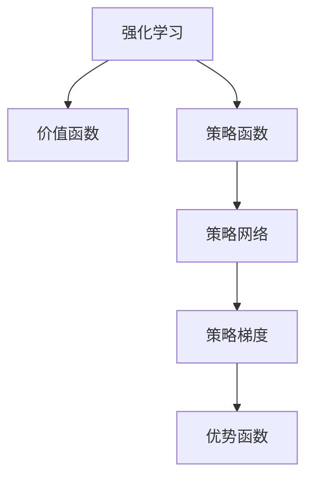

以下是对《大语言模型原理与工程实践：策略网络训练：优势函数》这一主题的技术博客文章撰写。

# 大语言模型原理与工程实践：策略网络训练：优势函数

## 1. 背景介绍

### 1.1 问题的由来

近年来,大型语言模型在自然语言处理领域取得了巨大的成功,展现出强大的语言理解和生成能力。然而,传统的监督学习方法需要大量的人工标注数据,成本高且难以覆盖所有场景。为了解决这一问题,研究人员开始探索利用强化学习(Reinforcement Learning)来训练语言模型,使其能够根据环境反馈自主学习优化策略。

策略网络(Policy Network)作为强化学习中的一种重要方法,通过直接学习状态到行为的映射策略,避免了估计价值函数的中间步骤,在处理连续控制问题时表现出色。然而,直接应用策略网络来训练大型语言模型存在一些挑战,例如高维状态空间、稀疏奖励和探索效率低下等。

### 1.2 研究现状

为了解决上述挑战,研究人员提出了多种策略网络训练算法,例如策略梯度(Policy Gradient)、信任区域策略优化(Trust Region Policy Optimization, TRPO)、近端策略优化(Proximal Policy Optimization, PPO)等。其中,PPO算法通过限制策略更新的幅度,实现了稳定的策略改进,被广泛应用于各种强化学习任务。

然而,PPO算法在处理大型语言模型时仍然存在一些不足,例如探索效率低下、样本利用率低等。为了提高训练效率,研究人员引入了优势函数(Advantage Function)的概念,通过估计每个行为相对于平均行为的优势,来更好地指导策略优化的方向。

### 1.3 研究意义

优势函数在强化学习中扮演着重要角色,它能够减少方差,提高策略梯度估计的准确性,从而加速策略网络的训练过程。然而,如何有效地估计优势函数,并将其应用于大型语言模型的策略网络训练,仍然是一个具有挑战性的问题。

本文将深入探讨优势函数在策略网络训练中的作用,介绍几种常见的优势函数估计方法,并针对大型语言模型场景进行分析和改进。通过理论分析和实验验证,我们希望能够为大型语言模型的强化学习训练提供新的思路和方法。

### 1.4 本文结构

本文的结构安排如下:

1. 背景介绍
2. 核心概念与联系
3. 核心算法原理与具体操作步骤
4. 数学模型和公式详细讲解与举例说明
5. 项目实践:代码实例和详细解释说明
6. 实际应用场景
7. 工具和资源推荐
8. 总结:未来发展趋势与挑战
9. 附录:常见问题与解答

## 2. 核心概念与联系

在深入探讨优势函数在策略网络训练中的应用之前,我们先回顾一下强化学习和策略网络的核心概念。

- **强化学习(Reinforcement Learning)**: 是一种基于环境交互的机器学习范式,智能体通过试错来学习获取最大化累积奖励的策略。
- **价值函数(Value Function)**: 评估一个状态或状态-行为对在遵循某策略时的预期累积奖励,常用于价值迭代和Q-Learning等算法。
- **策略函数(Policy Function)**: 直接描述智能体在每个状态下采取行为的概率分布,是强化学习的核心对象。
- **策略网络(Policy Network)**: 使用神经网络来表示和学习策略函数的方法,能够处理高维连续状态和行为空间。
- **策略梯度(Policy Gradient)**: 通过估计策略对期望回报的梯度,并沿梯度方向更新策略网络参数,从而优化策略函数。
- **优势函数(Advantage Function)**: 评估一个行为相对于平均行为的优势程度,用于减少策略梯度估计的方差,加速策略网络的训练。

优势函数作为策略梯度算法的重要组成部分,与价值函数、策略函数等核心概念紧密相关。接下来,我们将详细介绍优势函数在策略网络训练中的作用和估计方法。

## 3. 核心算法原理与具体操作步骤

### 3.1 算法原理概述

在策略梯度算法中,我们希望找到一个策略 $\pi_\theta$,使得在环境中采取该策略时能够获得最大的期望回报 $J(\theta)$:

$$J(\theta) = \mathbb{E}_{\tau \sim \pi_\theta}[R(\tau)]$$

其中 $\tau$ 表示一个轨迹序列,包含状态和行为的交互过程;$R(\tau)$ 表示该轨迹的累积奖励。

为了优化目标函数 $J(\theta)$,我们可以计算其关于策略参数 $\theta$ 的梯度:

$$\nabla_\theta J(\theta) = \mathbb{E}_{\tau \sim \pi_\theta}\left[\sum_t \nabla_\theta \log \pi_\theta(a_t|s_t)Q^{\pi_\theta}(s_t, a_t)\right]$$

其中 $Q^{\pi_\theta}(s_t, a_t)$ 表示在策略 $\pi_\theta$ 下,从状态 $s_t$ 采取行为 $a_t$ 后的期望回报。

然而,直接估计 $Q^{\pi_\theta}(s_t, a_t)$ 存在一些困难,例如需要学习一个额外的价值函数近似器,且估计的方差较大。为了解决这一问题,我们引入了优势函数 $A^{\pi_\theta}(s_t, a_t)$,它表示行为 $a_t$ 相对于策略 $\pi_\theta$ 在状态 $s_t$ 下的平均行为的优势程度:

$$A^{\pi_\theta}(s_t, a_t) = Q^{\pi_\theta}(s_t, a_t) - V^{\pi_\theta}(s_t)$$

其中 $V^{\pi_\theta}(s_t)$ 是状态值函数,表示在策略 $\pi_\theta$ 下从状态 $s_t$ 开始的期望回报。

将优势函数代入策略梯度的表达式,我们可以得到:

$$\nabla_\theta J(\theta) = \mathbb{E}_{\tau \sim \pi_\theta}\left[\sum_t \nabla_\theta \log \pi_\theta(a_t|s_t)A^{\pi_\theta}(s_t, a_t)\right]$$

这个公式被称为"策略梯度定理"(Policy Gradient Theorem),它为我们提供了一种无模型(Model-Free)的策略优化方法,只需要估计优势函数 $A^{\pi_\theta}(s_t, a_t)$ 即可计算策略梯度,而无需学习额外的价值函数近似器或者建模环境动态。

### 3.2 算法步骤详解

基于上述原理,我们可以设计一种通用的策略网络训练算法,使用优势函数来估计策略梯度并优化策略参数。算法步骤如下:

1. **初始化策略网络参数** $\theta$
2. **采集轨迹数据**:让智能体在环境中与当前策略 $\pi_\theta$ 交互,采集一批轨迹数据 $\{\tau_i\}$
3. **估计优势函数**:对于每个轨迹 $\tau_i$,计算每个时间步的优势函数估计值 $\hat{A}_t^{(i)}$
4. **计算策略梯度**:使用优势函数估计值,根据策略梯度定理计算梯度 $\nabla_\theta J(\theta)$:
   $$\nabla_\theta J(\theta) \approx \frac{1}{N}\sum_i\sum_t \nabla_\theta \log \pi_\theta(a_t^{(i)}|s_t^{(i)})\hat{A}_t^{(i)}$$
5. **更新策略网络参数**:使用优化算法(如随机梯度下降)沿梯度方向更新策略参数 $\theta$
6. **重复步骤2-5**,直到策略收敛或达到预定训练轮次

在上述算法中,关键步骤是如何有效地估计优势函数 $A^{\pi_\theta}(s_t, a_t)$。接下来,我们将介绍几种常见的优势函数估计方法。

### 3.3 算法优缺点

优势函数在策略网络训练中的引入,为我们提供了一种无模型的策略优化方法,具有以下优点:

- **减小方差**:相比于直接估计 $Q^{\pi_\theta}(s_t, a_t)$,使用优势函数可以减小策略梯度估计的方差,提高训练稳定性。
- **无需建模**:优势函数估计不需要显式建模环境动态,避免了模型偏差的影响。
- **灵活性强**:优势函数估计方法多种多样,可以根据具体任务和场景进行选择和改进。

然而,优势函数估计也存在一些缺点和挑战:

- **估计偏差**:大多数优势函数估计方法都存在一定的偏差,需要权衡偏差和方差之间的平衡。
- **超参数sensitiveness**:优势函数估计方法通常需要调整多个超参数,对超参数的选择较为敏感。
- **样本效率低**:一些基于蒙特卡罗估计的方法,样本利用效率较低,需要采集大量轨迹数据。

因此,在实际应用中,我们需要根据任务特点选择合适的优势函数估计方法,并进行相应的改进,以获得更好的策略网络训练效果。

### 3.4 算法应用领域

优势函数在策略网络训练中的应用领域非常广泛,包括但不限于:

- **连续控制任务**:如机器人控制、自动驾驶、物理模拟等,这些任务通常涉及高维连续状态和行为空间,策略网络训练表现出色。
- **游戏AI**:如棋类游戏、视频游戏等,策略网络可以直接从环境交互中学习游戏策略,无需人工设计规则。
- **自然语言处理**:近年来,研究人员开始尝试将强化学习应用于大型语言模型的训练,以提高模型的生成质量和多样性。
- **推荐系统**:将用户交互过程建模为强化学习环境,策略网络可以学习到个性化的推荐策略。
- **决策控制系统**:在一些需要连续决策的控制系统中,策略网络可以直接学习最优控制策略。

总的来说,策略网络训练算法能够处理高维连续空间,并通过直接从环境交互中学习策略,因此在各种序列决策问题中都有广泛的应用前景。

## 4. 数学模型和公式详细讲解与举例说明

### 4.1 数学模型构建

在介绍优势函数估计方法之前,我们先构建一个数学模型,用于形式化描述强化学习过程。

考虑一个无限视野的马尔可夫决策过程(Markov Decision Process, MDP),定义为 $(\mathcal{S}, \mathcal{A}, P, R, \gamma)$,其中:

- $\mathcal{S}$ 是状态空间
- $\mathcal{A}$ 是行为空间
- $P(s'|s, a)$ 是状态转移概率,表示在状态 $s$ 采取行为 $a$ 后,转移到状态 $s'$ 的概率
- $R(s, a)$ 是奖励函数,表示在状态 $s$ 采取行为 $a$ 后获得的即时奖励
- $\gamma \in [0, 1)$ 是折现因子,用于权衡即时奖励和长期回报

在强化学习中,我们的目标是找到一个策略 $\pi: \mathcal{S} \rightarrow \mathcal{P}(\mathcal{A})$,使得在遵循该策略时能够获得最大的期望累积折现回报:

$$J(\pi) = \mathbb{E}_\pi\left[\sum_{t=0}^\infty \gamma^t R(s_t, a_t)\right]$$

其中 $\mathbb{E}_\pi[\cdot]$