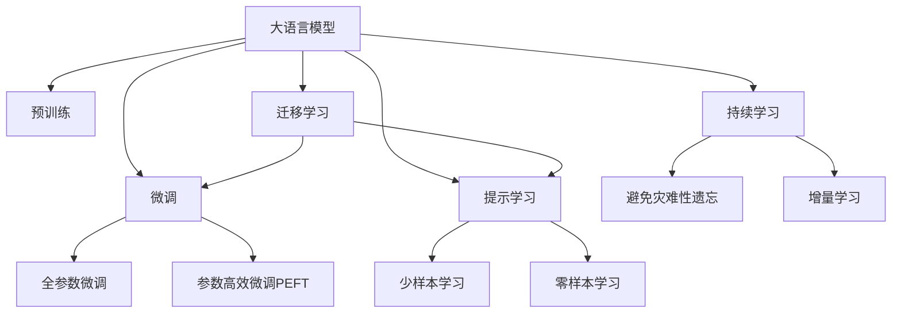
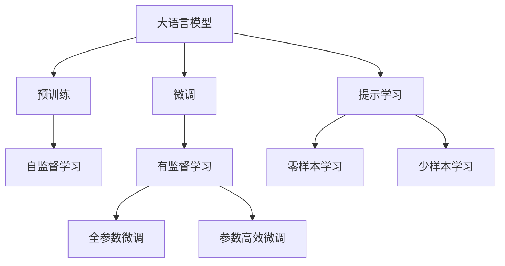
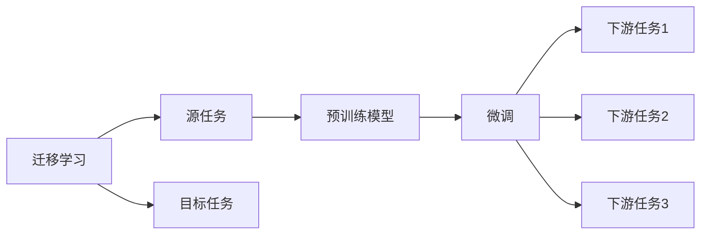
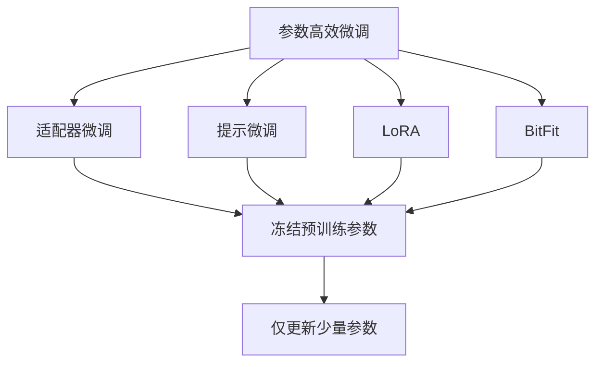
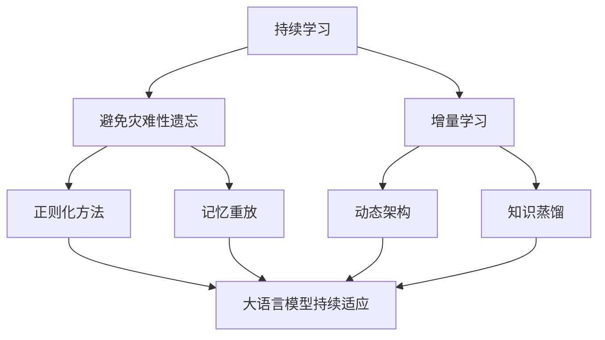
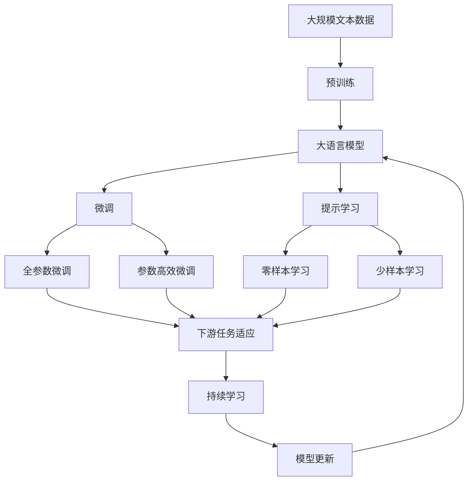

                 

# 大语言模型应用指南：ChatGPT扩展功能原理

> 关键词：大语言模型,ChatGPT,提示学习,Prompt Engineering,自然语言处理(NLP),模型微调,扩展功能

## 1. 背景介绍

### 1.1 问题由来

近年来，大语言模型（Large Language Models, LLMs），如OpenAI的GPT-3，在自然语言处理（NLP）领域取得了革命性的突破。这些模型通过在大规模无标签文本语料上进行预训练，学习到了丰富的语言知识和常识，可以在几乎所有的NLP任务上取得优异的表现。然而，尽管如此，它们仍然面临着一些限制，比如对任务指令的敏感度不够、无法处理特定领域的复杂问题等。因此，扩展功能（即Prompt Engineering）成为了大语言模型应用的关键。

### 1.2 问题核心关键点

扩展功能通常指通过精心设计任务指令（即Prompt）来引导大语言模型执行特定任务，使其在微调时更加灵活和高效。具体来说，扩展功能包括但不限于：

- 精炼任务指令：通过设计简洁明了的任务指令，使模型能够更准确地理解任务要求。
- 处理特定领域：通过添加领域相关的提示，帮助模型理解特定领域的术语和知识。
- 动态调整：根据输入数据的变化动态调整任务指令，使模型能够适应不同的场景。
- 零样本学习：在缺乏标注数据的情况下，通过设计合理的提示模板，使模型能够实现少样本或零样本学习。

扩展功能的使用，使得大语言模型能够跨越语言模型的预训练边界，在更广泛的任务上取得优异的表现。

### 1.3 问题研究意义

研究大语言模型的扩展功能，对于拓展其应用范围，提升任务性能，加速NLP技术的产业化进程，具有重要意义：

1. 降低应用开发成本：使用扩展功能可以显著减少从头开发所需的数据、计算和人力等成本投入。
2. 提升模型效果：扩展功能使得通用大模型更好地适应特定任务，在应用场景中取得更优表现。
3. 加速开发进度：standing on the shoulders of giants，扩展功能使得开发者可以更快地完成任务适配，缩短开发周期。
4. 带来技术创新：扩展功能促进了对预训练-微调的深入研究，催生了零样本学习、少样本学习等新的研究方向。
5. 赋能产业升级：扩展功能使得NLP技术更容易被各行各业所采用，为传统行业数字化转型升级提供新的技术路径。

## 2. 核心概念与联系

### 2.1 核心概念概述

为更好地理解ChatGPT等大语言模型的扩展功能，本节将介绍几个密切相关的核心概念：

- 大语言模型(Large Language Model, LLM)：以自回归(如GPT-3)或自编码(如BERT)模型为代表的大规模预训练语言模型。通过在大规模无标签文本语料上进行预训练，学习通用的语言表示，具备强大的语言理解和生成能力。
- 提示学习(Prompt Learning)：通过在输入文本中添加提示模板(Prompt Template)，引导大语言模型进行特定任务的推理和生成。可以在不更新模型参数的情况下，实现零样本或少样本学习。
- 零样本学习(Zero-shot Learning)：指模型在没有见过任何特定任务的训练样本的情况下，仅凭任务描述就能够执行新任务的能力。大语言模型通过预训练获得的广泛知识，使其能够理解任务指令并生成相应输出。
- 少样本学习(Few-shot Learning)：指在只有少量标注样本的情况下，模型能够快速适应新任务的学习方法。在大语言模型中，通常通过在输入中提供少量示例来实现，无需更新模型参数。
- 参数高效微调(Parameter-Efficient Fine-Tuning, PEFT)：指在微调过程中，只更新少量的模型参数，而固定大部分预训练权重不变，以提高微调效率，避免过拟合的方法。

这些核心概念之间的逻辑关系可以通过以下Mermaid流程图来展示：



这个流程图展示了大语言模型的核心概念及其之间的关系：

1. 大语言模型通过预训练获得基础能力。
2. 微调是对预训练模型进行任务特定的优化，可以分为全参数微调和参数高效微调（PEFT）。
3. 提示学习是一种不更新模型参数的方法，可以实现少样本学习和零样本学习。
4. 迁移学习是连接预训练模型与下游任务的桥梁，可以通过微调或提示学习来实现。
5. 持续学习旨在使模型能够不断学习新知识，同时保持已学习的知识，而不会出现灾难性遗忘。

这些核心概念共同构成了大语言模型的学习和应用框架，使其能够在各种场景下发挥强大的语言理解和生成能力。通过理解这些核心概念，我们可以更好地把握大语言模型的工作原理和优化方向。

### 2.2 概念间的关系

这些核心概念之间存在着紧密的联系，形成了大语言模型微调的整体生态系统。下面我通过几个Mermaid流程图来展示这些概念之间的关系。

#### 2.2.1 大语言模型的学习范式



这个流程图展示了大语言模型的三种主要学习范式：预训练、微调和提示学习。预训练主要采用自监督学习方法，而微调则是有监督学习的过程。提示学习可以实现零样本和少样本学习。微调又可以分为全参数微调和参数高效微调两种方式。

#### 2.2.2 迁移学习与微调的关系



这个流程图展示了迁移学习的基本原理，以及它与微调的关系。迁移学习涉及源任务和目标任务，预训练模型在源任务上学习，然后通过微调适应各种下游任务（目标任务）。

#### 2.2.3 参数高效微调方法



这个流程图展示了几种常见的参数高效微调方法，包括适配器微调、提示微调、LoRA和BitFit。这些方法的共同特点是冻结大部分预训练参数，只更新少量参数，从而提高微调效率。

#### 2.2.4 持续学习在大语言模型中的应用



这个流程图展示了持续学习在大语言模型中的应用。持续学习的主要目标是避免灾难性遗忘和实现增量学习。通过正则化方法、记忆重放、动态架构和知识蒸馏等技术，可以使大语言模型持续适应新的任务和数据。

### 2.3 核心概念的整体架构

最后，我们用一个综合的流程图来展示这些核心概念在大语言模型微调过程中的整体架构：



这个综合流程图展示了从预训练到微调，再到持续学习的完整过程。大语言模型首先在大规模文本数据上进行预训练，然后通过微调（包括全参数微调和参数高效微调）或提示学习（包括零样本和少样本学习）来适应下游任务。最后，通过持续学习技术，模型可以不断更新和适应新的任务和数据。

## 3. 核心算法原理 & 具体操作步骤
### 3.1 算法原理概述

大语言模型的扩展功能，本质上是通过精心设计的提示模板来引导模型执行特定任务。其核心思想是：通过在输入文本中添加特定的提示信息，使得模型能够更准确地理解任务要求，从而在微调过程中更好地适应特定任务。

形式化地，假设预训练语言模型为 $M_{\theta}$，其中 $\theta$ 为预训练得到的模型参数。给定下游任务 $T$ 的少量标注数据 $D=\{(x_i, y_i)\}_{i=1}^N$，提示学习（Prompt Learning）的目标是找到最优的提示模板 $\mathcal{P}$，使得模型在提示模板的引导下，在训练集 $D$ 上获得优异的性能：

$$
\mathcal{P}=\mathop{\arg\min}_{\mathcal{P}} \mathcal{L}(M_{\theta}, \mathcal{P}, D)
$$

其中 $\mathcal{L}$ 为针对任务 $T$ 设计的损失函数，用于衡量模型在提示模板 $\mathcal{P}$ 引导下，对训练集 $D$ 的预测性能。常见的损失函数包括交叉熵损失、均方误差损失等。

通过梯度下降等优化算法，提示学习过程不断更新提示模板 $\mathcal{P}$，最小化损失函数 $\mathcal{L}$，使得模型在提示模板的引导下，对训练集 $D$ 的预测性能达到最优。由于提示模板通常包含任务描述和输入样本的信息，可以较为准确地引导模型完成任务。

### 3.2 算法步骤详解

大语言模型的扩展功能通常包括以下几个关键步骤：

**Step 1: 准备预训练模型和数据集**
- 选择合适的预训练语言模型 $M_{\theta}$ 作为初始化参数，如 BERT、GPT-3等。
- 准备下游任务 $T$ 的少量标注数据集 $D$，划分为训练集、验证集和测试集。一般要求标注数据与预训练数据的分布不要差异过大。

**Step 2: 设计提示模板**
- 根据任务类型，设计简洁明了的提示模板 $\mathcal{P}$，包含任务描述、输入样本的信息等。
- 对于分类任务，提示模板通常包含类别标签，如 "What is the sentiment of the following text? "。
- 对于生成任务，提示模板可以包含样例输入和期望输出，如 "How to become a computer scientist?"。
- 对于推理任务，提示模板通常包含问题、已知事实和推理要求，如 "What is the capital of France? Given context: France is a country in Europe. Its capital is Paris."。

**Step 3: 设置提示学习超参数**
- 选择合适的优化算法及其参数，如 AdamW、SGD 等，设置学习率、批大小、迭代轮数等。
- 设置正则化技术及强度，包括权重衰减、Dropout、Early Stopping 等。
- 确定提示模板的搜索空间，如使用随机生成、人类设计等策略。

**Step 4: 执行提示学习**
- 将训练集数据分批次输入模型，前向传播计算损失函数。
- 反向传播计算参数梯度，根据设定的优化算法和学习率更新模型参数。
- 周期性在验证集上评估模型性能，根据性能指标决定是否触发 Early Stopping。
- 重复上述步骤直到满足预设的迭代轮数或 Early Stopping 条件。

**Step 5: 测试和部署**
- 在测试集上评估提示学习后模型 $M_{\mathcal{P}}$ 的性能，对比提示学习前后的精度提升。
- 使用提示学习后的模型对新样本进行推理预测，集成到实际的应用系统中。
- 持续收集新的数据，定期重新提示学习，以适应数据分布的变化。

以上是提示学习在大语言模型扩展功能的一般流程。在实际应用中，还需要针对具体任务的特点，对提示模板的设计和微调过程的各个环节进行优化设计，如改进训练目标函数，引入更多的正则化技术，搜索最优的提示模板等，以进一步提升模型性能。

### 3.3 算法优缺点

提示学习的优点包括：

- 简单高效：只需要设计合适的提示模板，即可快速提升模型性能。
- 通用适用：适用于各种NLP下游任务，包括分类、匹配、生成等，设计简单的提示模板即可实现。
- 参数高效：由于提示模板通常较短，提示学习可以在不更新模型参数的情况下，实现微调。
- 效果显著：在学术界和工业界的诸多任务上，提示学习已经刷新了最先进的性能指标。

同时，该方法也存在一定的局限性：

- 提示设计难度：提示模板的设计需要一定的经验和技巧，设计不当可能导致模型效果反而下降。
- 提示模板依赖：提示模板的好坏直接影响模型的性能，提示模板的泛化能力不足可能导致模型泛化性能差。
- 需要大量实验：提示学习需要大量的实验来确定最佳提示模板，试验成本较高。
- 无法应用新知识：提示学习仅依赖预训练模型和现有知识，无法直接应用新知识或数据。

尽管存在这些局限性，但就目前而言，提示学习是大语言模型扩展功能的最主流范式。未来相关研究的重点在于如何进一步降低提示模板的设计难度，提高提示模板的泛化能力，减少试验成本，以及如何在提示学习中更好地应用新知识和新数据。

### 3.4 算法应用领域

提示学习在大语言模型中的应用已经非常广泛，涵盖了许多NLP任务的扩展功能，例如：

- 文本分类：如情感分析、主题分类、意图识别等。通过设计简洁的任务描述，提示模型学习文本-标签映射。
- 命名实体识别：识别文本中的人名、地名、机构名等特定实体。通过提示模型学习实体边界和类型。
- 关系抽取：从文本中抽取实体之间的语义关系。通过提示模型学习实体-关系三元组。
- 问答系统：对自然语言问题给出答案。将问题-答案对作为提示模板，训练模型学习匹配答案。
- 机器翻译：将源语言文本翻译成目标语言。通过提示模型学习语言-语言映射。
- 文本摘要：将长文本压缩成简短摘要。通过提示模型学习抓取要点。
- 对话系统：使机器能够与人自然对话。将多轮对话历史作为上下文，提示模型进行回复生成。

除了上述这些经典任务外，提示学习还被创新性地应用到更多场景中，如可控文本生成、常识推理、代码生成、数据增强等，为NLP技术带来了全新的突破。随着预训练模型和提示学习的不断进步，相信NLP技术将在更广阔的应用领域大放异彩。

## 4. 数学模型和公式 & 详细讲解 & 举例说明

### 4.1 数学模型构建

本节将使用数学语言对提示学习在大语言模型中的实现进行更加严格的刻画。

记预训练语言模型为 $M_{\theta}$，其中 $\theta$ 为预训练得到的模型参数。假设提示学习任务为 $T$，输入文本为 $x$，模型输出的概率分布为 $\hat{y}=M_{\theta}(x)$。假设提示模板为 $\mathcal{P}$，则提示学习的目标是最小化模型在提示模板引导下的损失函数，即：

$$
\mathcal{P}=\mathop{\arg\min}_{\mathcal{P}} \mathcal{L}(M_{\theta}, \mathcal{P}, D)
$$

其中 $\mathcal{L}$ 为针对任务 $T$ 设计的损失函数，用于衡量模型在提示模板 $\mathcal{P}$ 引导下，对训练集 $D$ 的预测性能。常见的损失函数包括交叉熵损失、均方误差损失等。

在实践中，我们通常使用基于梯度的优化算法（如AdamW、SGD等）来近似求解上述最优化问题。设 $\eta$ 为学习率，$\lambda$ 为正则化系数，则提示学习参数的更新公式为：

$$
\mathcal{P} \leftarrow \mathcal{P} - \eta \nabla_{\mathcal{P}}\mathcal{L}(M_{\theta}, \mathcal{P}, D) - \eta\lambda\mathcal{P}
$$

其中 $\nabla_{\mathcal{P}}\mathcal{L}(M_{\theta}, \mathcal{P}, D)$ 为损失函数对提示模板 $\mathcal{P}$ 的梯度，可通过反向传播算法高效计算。

### 4.2 公式推导过程

以下我们以二分类任务为例，推导提示学习损失函数及其梯度的计算公式。

假设模型 $M_{\theta}$ 在输入 $x$ 上的输出为 $\hat{y}=M_{\theta}(x) \in [0,1]$，表示样本属于正类的概率。提示模板为 $\mathcal{P}$。则提示学习损失函数定义为：

$$
\ell(M_{\theta}(x),\mathcal{P}) = -[y\log \hat{y} + (1-y)\log (1-\hat{y})] + \lambda \|\mathcal{P}\|^2
$$

其中 $\lambda$ 为正则化系数，用于控制提示模板的复杂度，防止过拟合。将其代入经验风险公式，得：

$$
\mathcal{L}(\theta, \mathcal{P}) = -\frac{1}{N}\sum_{i=1}^N [y_i\log M_{\theta}(x_i)+(1-y_i)\log(1-M_{\theta}(x_i))] + \lambda \|\mathcal{P}\|^2
$$

根据链式法则，损失函数对提示模板 $\mathcal{P}$ 的梯度为：

$$
\frac{\partial \mathcal{L}(\theta, \mathcal{P})}{\partial \mathcal{P}} = -\frac{1}{N}\sum_{i=1}^N (\frac{y_i}{M_{\theta}(x_i)}-\frac{1-y_i}{1-M_{\theta}(x_i)}) \frac{\partial M_{\theta}(x_i)}{\partial \theta} \cdot \frac{\partial M_{\theta}(x_i)}{\partial \mathcal{P}}
$$

其中 $\frac{\partial M_{\theta}(x_i)}{\partial \theta}$ 可进一步递归展开，利用自动微分技术完成计算。

在得到损失函数的梯度后，即可带入提示学习参数更新公式，完成模型的迭代优化。重复上述过程直至收敛，最终得到提示学习后的模型参数 $\theta^*$。

## 5. 项目实践：代码实例和详细解释说明
### 5.1 开发环境搭建

在进行提示学习实践前，我们需要准备好开发环境。以下是使用Python进行PyTorch开发的环境配置流程：

1. 安装Anaconda：从官网下载并安装Anaconda，用于创建独立的Python环境。

2. 创建并激活虚拟环境：
```bash
conda create -n pytorch-env python=3.8 
conda activate pytorch-env
```

3. 安装PyTorch：根据CUDA版本，从官网获取对应的安装命令。例如：
```bash
conda install pytorch torchvision torchaudio cudatoolkit=11.1 -c pytorch -c conda-forge
```

4. 安装Transformers库：
```bash
pip install transformers
```

5. 安装各类工具包：
```bash
pip install numpy pandas scikit-learn matplotlib tqdm jupyter notebook ipython
```

完成上述步骤后，即可在`pytorch-env`环境中开始提示学习实践。

### 5.2 源代码详细实现

这里我们以情感分析任务为例，给出使用Transformers库对BERT模型进行提示学习的PyTorch代码实现。

首先，定义情感分析任务的数据处理函数：

```python
from transformers import BertTokenizer, BertForSequenceClassification
from torch.utils.data import Dataset
import torch

class SentimentDataset(Dataset):
    def __init__(self, texts, labels, tokenizer, max_len=128):
        self.texts = texts
        self.labels = labels
        self.tokenizer = tokenizer
        self.max_len = max_len
        
    def __len__(self):
        return len(self.texts)
    
    def __getitem__(self, item):
        text = self.texts[item]
        label = self.labels[item]
        
        encoding = self.tokenizer(text, return_tensors='pt', max_length=self.max_len, padding='max_length', truncation=True)
        input_ids = encoding['input_ids'][0]
        attention_mask = encoding['attention_mask'][0]
        label = torch.tensor(label, dtype=torch.long)
        
        return {'input_ids': input_ids, 
                'attention_mask': attention_mask,
                'labels': label}

# 标签与id的映射
tag2id = {'negative': 0, 'positive': 1}
id2tag = {v: k for k, v in tag2id.items()}

# 创建dataset
tokenizer = BertTokenizer.from_pretrained('bert-base-cased')

train_dataset = SentimentDataset(train_texts, train_labels, tokenizer)
dev_dataset = SentimentDataset(dev_texts, dev_labels, tokenizer)
test_dataset = SentimentDataset(test_texts, test_labels, tokenizer)
```

然后，定义模型和提示模板：

```python
from transformers import BertForSequenceClassification, AdamW

model = BertForSequenceClassification.from_pretrained('bert-base-cased', num_labels=len(tag2id))

prompt_template = "This text is {}.".format
```

接着，定义训练和评估函数：

```python
from torch.utils.data import DataLoader
from tqdm import tqdm
from sklearn.metrics import classification_report

device = torch.device('cuda') if torch.cuda.is_available() else torch.device('cpu')
model.to(device)

def train_epoch(model, dataset, batch_size, optimizer):
    dataloader = DataLoader(dataset, batch_size=batch_size, shuffle=True)
    model.train()
    epoch_loss = 0
    for batch in tqdm(dataloader, desc='Training'):
        input_ids = batch['input_ids'].to(device)
        attention_mask = batch['attention_mask'].to(device)
        labels = batch['labels'].to(device)
        model.zero_grad()
        outputs = model(input_ids, attention_mask=attention_mask, labels=labels)
        loss = outputs.loss
        epoch_loss += loss.item()
        loss.backward()
        optimizer.step()
    return epoch_loss / len(dataloader)

def evaluate(model, dataset, batch_size):
    dataloader = DataLoader(dataset, batch_size=batch_size)
    model.eval()
    preds, labels = [], []
    with torch.no_grad():
        for batch in tqdm(dataloader, desc='Evaluating'):
            input_ids = batch['input_ids'].to(device)
            attention_mask = batch['attention_mask'].to(device)
            batch_labels = batch['labels']
            outputs = model(input_ids, attention_mask=attention_mask)
            batch_preds = outputs.logits.argmax(dim=2).to('cpu').tolist()
            batch_labels = batch_labels.to('cpu').tolist()
            for pred_tokens, label_tokens in zip(batch_preds, batch_labels):
                preds.append(pred_tokens[:len(label_tokens)])
                labels.append(label_tokens)
                
    print(classification_report(labels, preds))
```

最后，启动提示学习流程并在测试集上评估：

```python
epochs = 5
batch_size = 16

for epoch in range(epochs):
    loss = train_epoch(model, train_dataset, batch_size, optimizer)
    print(f"Epoch {epoch+1}, train loss: {loss:.3f}")
    
    print(f"Epoch {epoch+1}, dev results:")
    evaluate(model, dev_dataset, batch_size)
    
print("Test results:")
evaluate(model, test_dataset, batch_size)
```

以上就是使用PyTorch对BERT进行情感分析任务提示学习的完整代码实现。可以看到，得益于Transformers库的强大封装，我们可以用相对简洁的代码完成BERT模型的加载和提示学习。

### 5.3 代码解读与分析

让我们再详细解读一下关键代码的实现细节：

**SentimentDataset类**：
- `__init__`方法：初始化文本、标签、分词器等关键组件。
- `__len__`方法：返回数据集的样本数量。
- `__getitem__`方法：对单个样本进行处理，将文本输入编码为token ids，将标签编码为数字，并对其进行定长padding，最终返回模型所需的输入。

**tag2id和id2tag字典**：
- 定义了标签与数字id之间的映射关系，用于将token-wise的预测结果解码回真实的标签。

**训练和评估函数**：
- 使用PyTorch的DataLoader对数据集进行批次化

