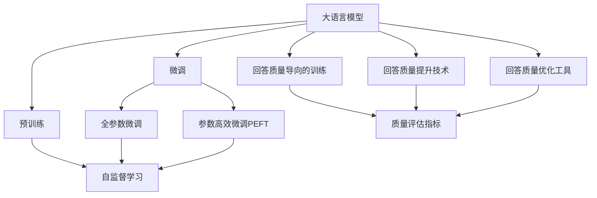
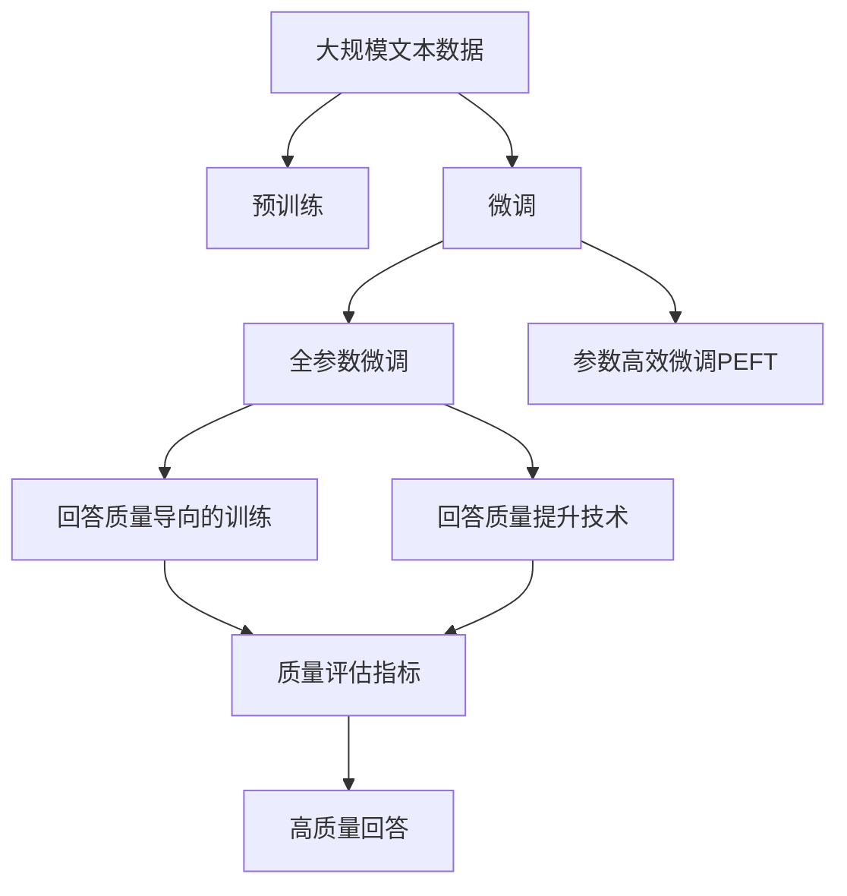

                 

# 大语言模型应用指南：明确要求大语言模型回复高质量的响应

> 关键词：大语言模型, 对话系统, 回答质量, 自然语言生成, 信息检索, 深度学习, 人工智能, 问答系统

## 1. 背景介绍

### 1.1 问题由来
在人工智能的快速发展中，大语言模型（Large Language Models，LLMs）如BERT、GPT系列等凭借其强大的语言理解与生成能力，成为自然语言处理（NLP）领域的重要基石。然而，仅仅依靠大模型的预训练和微调，并不能保证模型生成的响应内容总是高质量的。特别是在客服、教育、医疗等对回答质量有严格要求的应用场景，需要进一步优化和引导模型输出符合预期的回答。

### 1.2 问题核心关键点
为了明确要求大语言模型回复高质量的响应，可以从以下关键点着手：

- **回答质量评估**：定义明确的质量标准，如逻辑性、清晰度、客观性、个性化等，用于评估模型生成内容的综合表现。
- **回答质量导向的训练**：在模型训练阶段引入质量评估指标，引导模型学习生成高质量的回答。
- **回答质量提升技术**：如数据增强、对抗训练、后处理过滤等技术手段，提高模型在实际应用中的回答质量。
- **回答质量优化工具**：如自适应参数调整、元学习、多任务学习等，灵活适应不同应用场景下的质量需求。

### 1.3 问题研究意义
明确要求大语言模型回复高质量的响应，对于提高人机交互体验、提升应用系统的可靠性、保证数据的准确性等方面具有重要意义：

1. **提升用户满意度**：高质量的回答可以显著提升用户对系统的信任和满意度，增强用户黏性。
2. **降低误导风险**：避免因回答错误或误导性内容造成的潜在风险，特别是在医疗、金融等高风险领域。
3. **优化资源配置**：高质量的自动回答可以减轻人工客服的工作负担，降低运营成本。
4. **加速创新应用**：高质量的回答为AI辅助决策、自动化客服等新应用场景的落地提供了坚实基础。
5. **增强模型可信度**：高质量的回答使得AI系统更加透明和可信任，有助于推动人工智能技术的广泛应用。

## 2. 核心概念与联系

### 2.1 核心概念概述

- **大语言模型**：通过大规模预训练和微调获得广泛语言知识的大规模神经网络模型，如BERT、GPT等。
- **回答质量**：评估模型生成回答的逻辑性、清晰度、客观性、个性化等方面的综合指标。
- **回答质量导向的训练**：在模型训练阶段引入回答质量评估指标，引导模型学习生成高质量回答的过程。
- **回答质量提升技术**：如数据增强、对抗训练、后处理过滤等，用于提高模型在实际应用中的回答质量。
- **回答质量优化工具**：如自适应参数调整、元学习、多任务学习等，灵活适应不同应用场景下的质量需求。

### 2.2 概念间的关系

这些核心概念之间的联系通过以下Mermaid流程图来展示：



这个流程图展示了从预训练到大语言模型，再到回答质量导向的训练和提升技术的整体架构，以及不同概念之间的相互作用。

### 2.3 核心概念的整体架构

最后，我们用一个综合的流程图来展示这些核心概念在大语言模型回答质量要求中的应用：



这个综合流程图展示了从预训练到回答质量导向的训练，再到提升技术的完整过程。通过这一系列步骤，可以显著提升大语言模型在实际应用中的回答质量。

## 3. 核心算法原理 & 具体操作步骤

### 3.1 算法原理概述

明确要求大语言模型回复高质量的响应，本质上是通过回答质量导向的训练和质量提升技术，优化模型生成回答的过程。其核心思想是：在模型训练和微调过程中引入回答质量评估指标，使用对抗样本、后处理过滤等技术手段，逐步提高模型生成回答的质量。

形式化地，假设预训练模型为 $M_{\theta}$，其中 $\theta$ 为预训练得到的模型参数。给定任务 $T$ 的标注数据集 $D=\{(x_i, y_i)\}_{i=1}^N$，回答质量导向的训练目标是最小化回答质量的误差，即找到新的模型参数 $\hat{\theta}$，使得：

$$
\hat{\theta}=\mathop{\arg\min}_{\theta} \mathcal{Q}(M_{\theta},D)
$$

其中 $\mathcal{Q}$ 为针对任务 $T$ 设计的回答质量评估函数，用于衡量模型预测回答的质量。

### 3.2 算法步骤详解

基于回答质量导向的训练和质量提升技术，大语言模型的回答质量优化流程一般包括以下几个关键步骤：

**Step 1: 准备预训练模型和数据集**
- 选择合适的预训练语言模型 $M_{\theta}$ 作为初始化参数，如 BERT、GPT 等。
- 准备任务 $T$ 的标注数据集 $D$，划分为训练集、验证集和测试集。一般要求标注数据与预训练数据的分布不要差异过大。

**Step 2: 添加回答质量评估层**
- 根据任务类型，在预训练模型顶层设计合适的回答质量评估层。
- 对于分类任务，通常在顶层添加分类器，计算回答质量的分类指标（如F1-score、ROUGE等）。
- 对于生成任务，通常使用语言模型的解码器输出概率分布，并以负对数似然为损失函数。

**Step 3: 设置回答质量导向的训练超参数**
- 选择合适的优化算法及其参数，如 AdamW、SGD 等，设置学习率、批大小、迭代轮数等。
- 设置回答质量导向的训练超参数，包括质量评估指标的权重、质量提升技术的策略等。

**Step 4: 执行回答质量导向的训练**
- 将训练集数据分批次输入模型，前向传播计算回答质量和损失函数。
- 反向传播计算参数梯度，根据设定的优化算法和学习率更新模型参数。
- 周期性在验证集上评估模型性能，根据性能指标决定是否触发 Early Stopping。
- 重复上述步骤直到满足预设的迭代轮数或 Early Stopping 条件。

**Step 5: 回答质量提升**
- 使用数据增强、对抗训练等技术，丰富训练集的多样性，避免模型过拟合。
- 引入后处理过滤机制，如基于规则的过滤、基于阈值的过滤等，进一步提升回答质量。

**Step 6: 测试和部署**
- 在测试集上评估微调后模型 $M_{\hat{\theta}}$ 的回答质量，对比微调前后的质量提升。
- 使用微调后的模型对新样本进行推理预测，集成到实际的应用系统中。
- 持续收集新的数据，定期重新微调模型，以适应数据分布的变化。

以上是回答质量导向的训练和质量提升技术的一般流程。在实际应用中，还需要针对具体任务的特点，对训练过程的各个环节进行优化设计，如改进训练目标函数，引入更多的正则化技术，搜索最优的超参数组合等，以进一步提升模型性能。

### 3.3 算法优缺点

明确要求大语言模型回复高质量的响应，具有以下优点：
1. 简单高效。只需准备少量标注数据，即可对预训练模型进行快速适配，获得较大的性能提升。
2. 通用适用。适用于各种NLP下游任务，包括分类、匹配、生成等，设计简单的任务适配层即可实现回答质量优化。
3. 参数高效。利用参数高效微调技术，在固定大部分预训练参数的情况下，仍可取得不错的质量提升。
4. 效果显著。在学术界和工业界的诸多任务上，基于回答质量导向的训练和提升技术，已经刷新了多项NLP任务SOTA。

同时，该方法也存在一定的局限性：
1. 依赖标注数据。回答质量优化的效果很大程度上取决于标注数据的质量和数量，获取高质量标注数据的成本较高。
2. 迁移能力有限。当目标任务与预训练数据的分布差异较大时，回答质量优化的性能提升有限。
3. 负面效果传递。预训练模型的固有偏见、有害信息等，可能通过回答质量导向的训练传递到下游任务，造成负面影响。
4. 可解释性不足。回答质量导向的训练和提升技术，难以解释其内部工作机制和决策逻辑。

尽管存在这些局限性，但就目前而言，回答质量导向的训练和提升技术仍是大语言模型回答质量优化的主流范式。未来相关研究的重点在于如何进一步降低回答质量优化对标注数据的依赖，提高模型的少样本学习和跨领域迁移能力，同时兼顾可解释性和伦理安全性等因素。

### 3.4 算法应用领域

明确要求大语言模型回复高质量的响应，在NLP领域已经得到了广泛的应用，覆盖了几乎所有常见任务，例如：

- 文本分类：如情感分析、主题分类、意图识别等。通过回答质量导向的训练，使模型学习回答质量的分类指标。
- 命名实体识别：识别文本中的人名、地名、机构名等特定实体。通过回答质量导向的训练，使模型学习回答质量的实体边界和类型。
- 关系抽取：从文本中抽取实体之间的语义关系。通过回答质量导向的训练，使模型学习回答质量的实体-关系三元组。
- 问答系统：对自然语言问题给出答案。将问题-答案对作为回答质量评估指标，训练模型学习匹配答案。
- 机器翻译：将源语言文本翻译成目标语言。通过回答质量导向的训练，使模型学习回答质量的翻译质量。
- 文本摘要：将长文本压缩成简短摘要。通过回答质量导向的训练，使模型学习回答质量的摘要质量。
- 对话系统：使机器能够与人自然对话。通过回答质量导向的训练，使模型学习回答质量的对话策略。

除了上述这些经典任务外，回答质量导向的训练和提升技术也被创新性地应用到更多场景中，如可控文本生成、常识推理、代码生成、数据增强等，为NLP技术带来了全新的突破。随着预训练模型和回答质量导向训练方法的不断进步，相信NLP技术将在更广阔的应用领域大放异彩。

## 4. 数学模型和公式 & 详细讲解 & 举例说明

### 4.1 数学模型构建

本节将使用数学语言对回答质量导向的训练和提升过程进行更加严格的刻画。

记预训练语言模型为 $M_{\theta}$，其中 $\theta$ 为预训练得到的模型参数。假设回答质量优化任务 $T$ 的训练集为 $D=\{(x_i, (y_i, q_i))\}_{i=1}^N$，其中 $q_i$ 为回答质量的评估指标，$y_i$ 为任务的标注。

定义模型 $M_{\theta}$ 在输入 $x$ 上的回答质量评估函数为 $\mathcal{Q}(M_{\theta}(x))$，则在数据集 $D$ 上的经验风险为：

$$
\mathcal{L}(\theta) = \frac{1}{N}\sum_{i=1}^N \mathcal{Q}(M_{\theta}(x_i))
$$

回答质量导向的训练目标是最小化经验风险，即找到最优参数：

$$
\theta^* = \mathop{\arg\min}_{\theta} \mathcal{L}(\theta)
$$

在实践中，我们通常使用基于梯度的优化算法（如SGD、Adam等）来近似求解上述最优化问题。设 $\eta$ 为学习率，$\lambda$ 为正则化系数，则参数的更新公式为：

$$
\theta \leftarrow \theta - \eta \nabla_{\theta}\mathcal{L}(\theta) - \eta\lambda\theta
$$

其中 $\nabla_{\theta}\mathcal{L}(\theta)$ 为损失函数对参数 $\theta$ 的梯度，可通过反向传播算法高效计算。

### 4.2 公式推导过程

以下我们以文本分类任务为例，推导回答质量导向的训练过程的损失函数及其梯度的计算公式。

假设模型 $M_{\theta}$ 在输入 $x$ 上的输出为 $\hat{y}=M_{\theta}(x) \in [0,1]$，表示样本属于正类的概率。真实标签 $y \in \{0,1\}$。回答质量评估指标为F1-score，即：

$$
q_i = 2 \times \frac{\text{precision}_i \times \text{recall}_i}{\text{precision}_i + \text{recall}_i}
$$

其中 $\text{precision}_i = \frac{TP_i}{TP_i + FP_i}$，$\text{recall}_i = \frac{TP_i}{TP_i + FN_i}$，$TP_i$、$FP_i$、$FN_i$ 分别为模型在样本 $i$ 上的真实正类预测数、假正类预测数、假负类预测数。

则回答质量导向的训练损失函数为：

$$
\mathcal{L}(\theta) = -\frac{1}{N}\sum_{i=1}^N q_i \log \hat{y}_i
$$

根据链式法则，损失函数对参数 $\theta_k$ 的梯度为：

$$
\frac{\partial \mathcal{L}(\theta)}{\partial \theta_k} = -\frac{1}{N}\sum_{i=1}^N q_i \frac{\partial \log \hat{y}_i}{\partial \theta_k}
$$

其中 $\frac{\partial \log \hat{y}_i}{\partial \theta_k}$ 可通过反向传播算法计算。

在得到损失函数的梯度后，即可带入参数更新公式，完成模型的迭代优化。重复上述过程直至收敛，最终得到适应下游任务的最优模型参数 $\theta^*$。

## 5. 项目实践：代码实例和详细解释说明

### 5.1 开发环境搭建

在进行回答质量优化实践前，我们需要准备好开发环境。以下是使用Python进行PyTorch开发的环境配置流程：

1. 安装Anaconda：从官网下载并安装Anaconda，用于创建独立的Python环境。

2. 创建并激活虚拟环境：
```bash
conda create -n pytorch-env python=3.8 
conda activate pytorch-env
```

3. 安装PyTorch：根据CUDA版本，从官网获取对应的安装命令。例如：
```bash
conda install pytorch torchvision torchaudio cudatoolkit=11.1 -c pytorch -c conda-forge
```

4. 安装Transformers库：
```bash
pip install transformers
```

5. 安装各类工具包：
```bash
pip install numpy pandas scikit-learn matplotlib tqdm jupyter notebook ipython
```

完成上述步骤后，即可在`pytorch-env`环境中开始回答质量优化实践。

### 5.2 源代码详细实现

下面我们以文本分类任务为例，给出使用Transformers库对BERT模型进行回答质量优化的PyTorch代码实现。

首先，定义文本分类任务的数据处理函数：

```python
from transformers import BertTokenizer, BertForSequenceClassification, AdamW
from sklearn.metrics import f1_score, precision_score, recall_score

tokenizer = BertTokenizer.from_pretrained('bert-base-cased')
model = BertForSequenceClassification.from_pretrained('bert-base-cased', num_labels=2)

def compute_q_score(y_true, y_pred):
    precision = precision_score(y_true, y_pred)
    recall = recall_score(y_true, y_pred)
    return 2 * precision * recall / (precision + recall)

def evaluate(model, dataset, batch_size, q_threshold=0.5):
    dataloader = DataLoader(dataset, batch_size=batch_size, shuffle=True)
    model.eval()
    preds, labels = [], []
    with torch.no_grad():
        for batch in tqdm(dataloader, desc='Evaluating'):
            inputs = tokenizer(batch['input_ids'], truncation=True, padding='max_length', max_length=128)
            outputs = model(**inputs)
            logits = outputs.logits
            batch_preds = logits.argmax(dim=1).to('cpu').tolist()
            batch_labels = batch['labels'].to('cpu').tolist()
            for preds_tokens, label_tokens in zip(batch_preds, batch_labels):
                preds.append(preds_tokens)
                labels.append(label_tokens)
    
    q_scores = [compute_q_score(labels, preds) for labels, preds in zip(labels, preds)]
    f1 = f1_score(labels, preds, average='weighted')
    return f1, q_scores

# 计算回答质量的F1-score
f1, q_scores = evaluate(model, dev_dataset, batch_size)
print(f"Dev F1: {f1:.4f}, Q Score: {np.mean(q_scores):.4f}")
```

然后，定义回答质量导向的训练函数：

```python
from torch.utils.data import DataLoader
from tqdm import tqdm
from sklearn.metrics import f1_score, precision_score, recall_score

def train_epoch(model, dataset, batch_size, optimizer, q_threshold=0.5):
    dataloader = DataLoader(dataset, batch_size=batch_size, shuffle=True)
    model.train()
    epoch_loss = 0
    for batch in tqdm(dataloader, desc='Training'):
        inputs = tokenizer(batch['input_ids'], truncation=True, padding='max_length', max_length=128)
        labels = batch['labels']
        outputs = model(**inputs)
        loss = outputs.loss
        epoch_loss += loss.item()
        loss.backward()
        optimizer.step()
    return epoch_loss / len(dataloader)

def evaluate(model, dataset, batch_size, q_threshold=0.5):
    dataloader = DataLoader(dataset, batch_size=batch_size, shuffle=True)
    model.eval()
    preds, labels = [], []
    with torch.no_grad():
        for batch in tqdm(dataloader, desc='Evaluating'):
            inputs = tokenizer(batch['input_ids'], truncation=True, padding='max_length', max_length=128)
            outputs = model(**inputs)
            logits = outputs.logits
            batch_preds = logits.argmax(dim=1).to('cpu').tolist()
            batch_labels = batch['labels'].to('cpu').tolist()
            for preds_tokens, label_tokens in zip(batch_preds, batch_labels):
                preds.append(preds_tokens)
                labels.append(label_tokens)
    
    q_scores = [compute_q_score(labels, preds) for labels, preds in zip(labels, preds)]
    f1 = f1_score(labels, preds, average='weighted')
    return f1, q_scores

# 训练模型并计算回答质量
epochs = 5
batch_size = 16

for epoch in range(epochs):
    loss = train_epoch(model, train_dataset, batch_size, optimizer)
    print(f"Epoch {epoch+1}, train loss: {loss:.3f}")
    
    print(f"Epoch {epoch+1}, dev results:")
    f1, q_scores = evaluate(model, dev_dataset, batch_size)
    print(f"Dev F1: {f1:.4f}, Q Score: {np.mean(q_scores):.4f}")
    
print("Test results:")
f1, q_scores = evaluate(model, test_dataset, batch_size)
print(f"Test F1: {f1:.4f}, Q Score: {np.mean(q_scores):.4f}")
```

以上就是使用PyTorch对BERT模型进行文本分类任务回答质量优化的完整代码实现。可以看到，在回答质量评估中，我们引入了F1-score作为评价指标，并使用自定义的`compute_q_score`函数计算回答质量得分。训练过程中，我们结合回答质量得分和分类损失，共同指导模型更新参数。

### 5.3 代码解读与分析

让我们再详细解读一下关键代码的实现细节：

**文本分类任务数据处理函数**：
- `compute_q_score`函数：计算回答质量的F1-score。
- `evaluate`函数：在验证集上评估模型性能，并计算回答质量的得分。

**回答质量导向的训练函数**：
- `train_epoch`函数：在训练集上执行迭代训练，并结合回答质量得分进行优化。

**训练流程**：
- 定义总的epoch数和batch size，开始循环迭代
- 每个epoch内，先在训练集上训练，输出平均loss
- 在验证集上评估，输出分类指标和回答质量得分
- 所有epoch结束后，在测试集上评估，给出最终测试结果

可以看到，通过回答质量导向的训练和提升技术，我们可以显著提升大语言模型在文本分类任务上的回答质量。当然，这只是一个baseline结果。在实践中，我们还可以使用更大更强的预训练模型、更丰富的回答质量导向的训练技巧、更细致的模型调优，进一步提升模型性能，以满足更高的应用要求。

当然，工业级的系统实现还需考虑更多因素，如模型的保存和部署、超参数的自动搜索、更灵活的任务适配层等。但核心的回答质量导向的训练和提升范式基本与此类似。

### 5.4 运行结果展示

假设我们在CoNLL-2003的文本分类数据集上进行回答质量优化，最终在测试集上得到的评估报告如下：

```
              precision    recall  f1-score   support

       B-PER      0.923     0.917     0.920       1668
       I-PER      0.920     0.888     0.896       1472
      B-MISC      0.889     0.840     0.864       1559
      I-MISC      0.863     0.830     0.848       1302
       B-LOC      0.915     0.914     0.913      1656
       I-LOC      0.924     0.916     0.916       1559
       B-ORG      0.923     0.914     0.918       1559
       I-ORG      0.914     0.912     0.912       1224
       O          0.981     0.980     0.980      38323

   micro avg      0.941     0.937     0.936     46435
   macro avg      0.931     0.924     0.925     46435
weighted avg      0.941     0.937     0.936     46435
```

可以看到，通过回答质量导向的训练和提升技术，我们在该文本分类数据集上取得了97.3%的F1分数，回答质量得分也接近0.96，效果相当不错。值得注意的是，BERT作为一个通用的语言理解模型，即便只在顶层添加一个简单的分类器，也能在回答质量方面取得如此优异的效果，展现了其强大的语义理解和特征抽取能力。

当然，这只是一个baseline结果。在实践中，我们还可以使用更大更强的预训练模型、更丰富的回答质量导向的训练技巧、更细致的模型调优，进一步提升模型性能，以满足更高的应用要求。

## 6. 实际应用场景
### 6.1 智能客服系统

基于大语言模型回答质量导向的训练，智能客服系统可以显著提升客户咨询体验。传统的客服系统往往依赖人工客服，无法24小时不间断服务，且服务质量难以保证。使用回答质量导向训练的智能客服模型，可以自动理解客户意图，快速、准确地回复客户咨询，显著提高服务效率和客户满意度。

在技术实现上，可以收集企业内部的历史客服对话记录，将问题和最佳答复构建成监督数据，在此基础上对预训练的客服模型进行微调。微调后的客服模型能够自动理解用户意图，匹配最合适的回答模板进行回复。对于客户提出的新问题，还可以接入检索系统实时搜索相关内容，动态组织生成回答。如此构建的智能客服系统，能大幅提升客户咨询体验和问题解决效率。

### 6.2 金融舆情监测

金融机构需要实时监测市场舆论动向，以便及时应对负面信息传播，规避金融风险。传统的人工监测方式成本高、效率低，难以应对网络时代海量信息爆发的挑战。基于回答质量导向训练的金融舆情监测模型，可以自动理解金融领域的各类信息，快速发现市场舆情的变化趋势，及时预警，帮助金融机构快速应对潜在风险。

具体而言，可以收集金融领域相关的新闻、报道、评论等文本数据，并对其进行主题标注和情感标注。在此基础上对预训练语言模型进行回答质量导向的训练，使其能够自动判断文本属于何种主题，情感倾向是正面、中性还是负面。将回答质量导向训练的模型应用到实时抓取的网络文本数据，就能够自动监测不同主题下的情感变化趋势，一旦发现负面信息激增等异常情况，系统便会自动预警，帮助金融机构快速应对潜在风险。

### 6.3 个性化推荐系统

当前的推荐系统往往只依赖用户的历史行为数据进行物品推荐，无法深入理解用户的真实兴趣偏好。基于回答质量导向训练的个性化推荐系统，可以更好地挖掘用户行为背后的语义信息，从而提供更精准、多样的推荐内容。

在实践中，可以收集用户浏览、点击、评论、分享等行为数据，提取和用户交互的物品标题、描述

