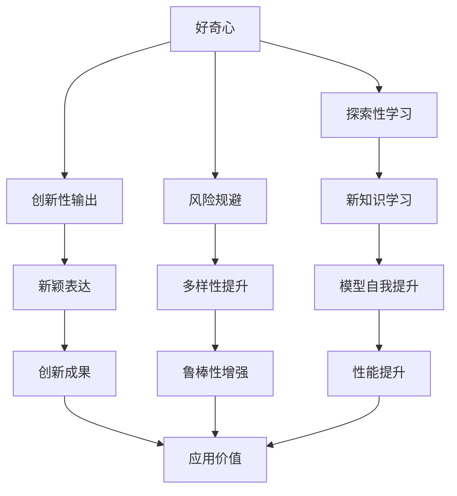
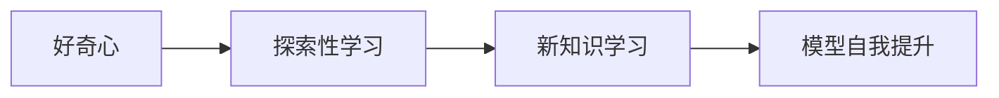
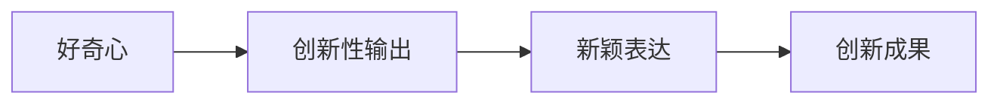
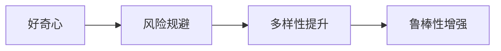
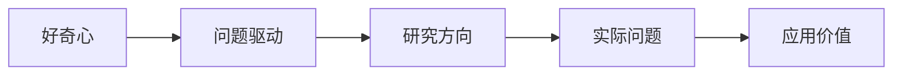
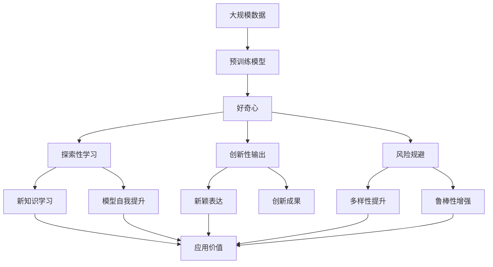

                 

# 好奇心：驱动创新与发现的源泉

> 关键词：好奇心,创新,发现,人工智能,驱动因素,心理机制,行为学

## 1. 背景介绍

### 1.1 问题由来

好奇心是人类探索未知、获取新知识的重要心理驱动力。在科技创新与发现的过程中，好奇心常常扮演关键角色。然而，在人工智能(AI)领域，关于好奇心的研究相对较少，对于好奇心如何影响AI创新和发现的过程，仍需深入探讨。本文旨在探讨好奇心在人工智能创新与发现中的作用机制，并结合AI技术，探索如何激发和利用好奇心，促进AI技术的发展和应用。

### 1.2 问题核心关键点

好奇心在AI创新与发现中的作用机制主要包括以下几个方面：

- **探索性学习**：通过探索未知数据和任务，激发AI模型对新知识的学习需求，促进模型的自我提升。
- **创新性输出**：好奇心促使AI模型在生成新数据或解决方案时，倾向于探索新颖、独特的表达方式，从而推动创新。
- **风险规避**：好奇心能帮助AI模型识别并避免陷入常规解决方案的陷阱，促进多样性和鲁棒性的提升。
- **问题驱动**：好奇心促使AI模型关注实际问题和需求，从而导向更加有价值的研究方向。

本文将深入分析好奇心在AI创新与发现中的具体机制，并结合现有AI技术和方法，探讨如何利用好奇心，提升AI系统的创新能力和应用价值。

### 1.3 问题研究意义

探索好奇心在AI创新与发现中的作用机制，具有重要的理论和实践意义：

- **理论探索**：深入理解好奇心对AI系统的影响，有助于构建更加全面、深入的AI心理学模型。
- **实践指导**：利用好奇心机制，可以设计更加创新、实用的AI算法和应用，提升AI技术的市场竞争力和应用价值。
- **社会影响**：通过激发好奇心，可以促进公众对AI技术的兴趣和理解，提升AI技术的社会接受度和应用普及率。

## 2. 核心概念与联系

### 2.1 核心概念概述

为更好地理解好奇心在AI创新与发现中的作用机制，本节将介绍几个密切相关的核心概念：

- **好奇心**：一种探索未知、获取新知识的强烈心理驱动力。在AI领域，好奇心驱动AI模型对新数据和任务进行探索和学习。
- **探索性学习**：通过探索未知数据和任务，激发AI模型对新知识的学习需求，促进模型的自我提升。
- **创新性输出**：好奇心促使AI模型在生成新数据或解决方案时，倾向于探索新颖、独特的表达方式，从而推动创新。
- **风险规避**：好奇心能帮助AI模型识别并避免陷入常规解决方案的陷阱，促进多样性和鲁棒性的提升。
- **问题驱动**：好奇心促使AI模型关注实际问题和需求，从而导向更加有价值的研究方向。

这些核心概念之间的逻辑关系可以通过以下Mermaid流程图来展示：



这个流程图展示了好奇心的核心作用机制：

1. 好奇心驱动AI模型探索新知识，通过探索性学习，促使模型进行自我提升。
2. 好奇心促使AI模型在创新性输出中探索新颖的表达方式，推动创新。
3. 好奇心帮助AI模型识别风险并规避常规解决方案，提升多样性和鲁棒性。
4. 好奇心促使AI模型关注实际问题，导向更加有价值的研究方向，从而提升应用价值。

### 2.2 概念间的关系

这些核心概念之间存在着紧密的联系，形成了好奇心在AI创新与发现中的完整生态系统。下面我们通过几个Mermaid流程图来展示这些概念之间的关系。

#### 2.2.1 好奇心与探索性学习的关系



这个流程图展示了好奇心与探索性学习的关系：好奇心驱使AI模型探索新知识，通过探索性学习，促使模型进行自我提升。

#### 2.2.2 好奇心与创新性输出的关系



这个流程图展示了好奇心与创新性输出的关系：好奇心促使AI模型探索新颖的表达方式，推动创新成果的生成。

#### 2.2.3 好奇心与风险规避的关系



这个流程图展示了好奇心与风险规避的关系：好奇心帮助AI模型识别并规避常规解决方案，从而提升多样性和鲁棒性。

#### 2.2.4 好奇心与问题驱动的关系



这个流程图展示了好奇心与问题驱动的关系：好奇心促使AI模型关注实际问题，导向更加有价值的研究方向，从而提升应用价值。

### 2.3 核心概念的整体架构

最后，我们用一个综合的流程图来展示这些核心概念在AI创新与发现过程中的整体架构：



这个综合流程图展示了从大规模数据预训练到好奇心驱动的AI创新与发现过程，各个概念的相互作用关系。

## 3. 核心算法原理 & 具体操作步骤
### 3.1 算法原理概述

好奇心在AI创新与发现中的作用机制可以通过探索性学习、创新性输出、风险规避、问题驱动等核心概念来解释。这些概念可以通过以下数学模型和算法进行形式化描述：

设AI模型为 $M$，其输入为 $x$，输出为 $y$，则模型的探索性学习过程可以表示为：

$$
M_{\theta}(x) \leftarrow M_{\theta}(x), \quad \theta = \arg\min_{\theta} \mathcal{L}(M_{\theta}(x), y)
$$

其中，$\mathcal{L}$ 为损失函数，用于衡量模型预测输出与真实标签之间的差异。

创新性输出的过程可以表示为：

$$
y_{\text{new}} = f(M_{\theta}(x)), \quad f: [0,1] \rightarrow \text{New}(\mathcal{Y})
$$

其中，$y_{\text{new}}$ 为创新性输出，$\text{New}(\mathcal{Y})$ 表示新的数据或解决方案空间。

风险规避的过程可以表示为：

$$
M_{\theta}(x) \leftarrow M_{\theta}(x), \quad \theta = \arg\min_{\theta} \mathcal{L}(M_{\theta}(x), y) + \lambda \mathcal{R}(\theta)
$$

其中，$\mathcal{R}(\theta)$ 为风险函数，用于衡量模型的多样性和鲁棒性。

问题驱动的过程可以表示为：

$$
M_{\theta}(x) \leftarrow M_{\theta}(x), \quad \theta = \arg\min_{\theta} \mathcal{L}(M_{\theta}(x), y) + \lambda \mathcal{P}(x)
$$

其中，$\mathcal{P}(x)$ 为问题函数，用于衡量模型的任务相关性。

### 3.2 算法步骤详解

基于好奇心的AI创新与发现过程，一般包括以下几个关键步骤：

**Step 1: 准备预训练模型和数据集**
- 选择合适的预训练模型 $M_{\theta}$ 作为初始化参数，如 GPT、BERT 等。
- 准备训练集 $D_{\text{train}}$ 和测试集 $D_{\text{test}}$，并保证数据分布与实际应用场景一致。

**Step 2: 引入好奇心机制**
- 设计好奇心机制，通过引导模型探索新数据或任务，激发模型的创新性和学习需求。
- 常用的好奇心机制包括随机噪声、自适应样本选择、主动学习等。

**Step 3: 添加探索性学习模块**
- 在模型中添加探索性学习模块，如交叉熵正则化、贝叶斯优化等，引导模型进行新知识的探索和学习。
- 通过调整模型的损失函数和正则化项，增强模型的探索性。

**Step 4: 设计创新性输出模块**
- 在模型输出层设计创新性输出模块，如生成对抗网络(GAN)、变分自编码器(VAE)等，促使模型探索新颖、独特的表达方式。
- 通过引入多样性和创新性约束，促使模型生成更加多样和创新的输出。

**Step 5: 应用风险规避技术**
- 在模型训练过程中，引入多样性和鲁棒性约束，避免模型陷入常规解决方案的陷阱。
- 常用的风险规避技术包括对抗训练、生成对抗网络、多样性约束等。

**Step 6: 问题导向的目标函数**
- 在目标函数中引入问题导向的约束，促使模型关注实际问题和需求。
- 常用的问题导向函数包括任务相关性约束、指标约束、用户反馈等。

**Step 7: 迭代优化**
- 通过梯度下降等优化算法，迭代更新模型参数，最小化目标函数。
- 在每个迭代步骤中，评估模型的探索性、创新性、多样性和鲁棒性，进行适当的调整。

**Step 8: 测试与评估**
- 在测试集上评估模型的性能，包括准确率、创新性、多样性和鲁棒性等指标。
- 根据评估结果，进行进一步的优化和改进。

以上是基于好奇心的AI创新与发现的一般流程。在实际应用中，还需要针对具体任务和数据特点，对各个环节进行优化设计，如改进探索性学习模块、引入更有效的创新性输出技术、设计更加多样和鲁棒的目标函数等，以进一步提升模型性能。

### 3.3 算法优缺点

基于好奇心的AI创新与发现方法具有以下优点：

1. **激发创新能力**：好奇心机制能够促使模型探索新知识和新颖表达方式，推动创新。
2. **提升多样性和鲁棒性**：通过引入多样性和鲁棒性约束，避免模型陷入常规解决方案，增强模型的泛化能力和鲁棒性。
3. **关注实际问题**：好奇心机制促使模型关注实际问题和需求，导向更加有价值的研究方向，提升应用价值。

但这种方法也存在以下局限性：

1. **数据依赖**：好奇心机制依赖于高质量的数据集，如果数据分布不均衡或质量不高，可能会影响模型的探索和学习效果。
2. **计算成本**：引入好奇心机制可能会增加计算成本，特别是在引入多样化约束和创新性输出模块时，需要更多的计算资源和时间。
3. **可解释性**：好奇心机制的引入可能使得模型更加复杂，降低其可解释性，难以理解模型的决策过程和内部工作机制。

尽管存在这些局限性，但好奇心机制在大规模数据和复杂任务中的应用，仍显示出其强大的潜力和应用前景。未来研究需要在算法设计和数据处理上进一步优化，以提升好奇心在AI创新与发现中的效果。

### 3.4 算法应用领域

基于好奇心的AI创新与发现方法在多个领域具有广泛的应用前景，包括：

1. **自然语言处理(NLP)**：在对话生成、文本摘要、机器翻译等任务中，引入好奇心机制，提升模型的多样性和创新性。
2. **计算机视觉(CV)**：在图像生成、图像分类、目标检测等任务中，引入好奇心机制，探索新颖的图像表达方式，提升模型效果。
3. **机器人学**：在机器人导航、操作任务中，引入好奇心机制，探索未知环境，提升机器人的自主性和适应性。
4. **智能推荐系统**：在个性化推荐、商品推荐等任务中，引入好奇心机制，探索用户兴趣，提升推荐效果。
5. **金融科技**：在风险评估、欺诈检测等任务中，引入好奇心机制，探索异常行为，提升模型的鲁棒性和准确性。
6. **医疗健康**：在疾病诊断、治疗方案推荐等任务中，引入好奇心机制，探索新的治疗方法和方案，提升医疗效果。

这些领域的应用，将进一步推动AI技术的发展和应用，为人类社会的进步做出贡献。

## 4. 数学模型和公式 & 详细讲解  
### 4.1 数学模型构建

本节将使用数学语言对基于好奇心的AI创新与发现过程进行更加严格的刻画。

设AI模型为 $M_{\theta}:\mathcal{X} \rightarrow \mathcal{Y}$，其中 $\mathcal{X}$ 为输入空间，$\mathcal{Y}$ 为输出空间，$\theta \in \mathbb{R}^d$ 为模型参数。假设训练集为 $D_{\text{train}}=\{(x_i,y_i)\}_{i=1}^N, x_i \in \mathcal{X}, y_i \in \mathcal{Y}$。

定义模型的探索性学习过程为：

$$
M_{\theta}(x) \leftarrow M_{\theta}(x), \quad \theta = \arg\min_{\theta} \mathcal{L}(M_{\theta}(x), y) + \lambda \mathcal{L}_{\text{expl}}(\theta, x)
$$

其中，$\mathcal{L}_{\text{expl}}(\theta, x)$ 为探索性学习损失函数，用于衡量模型在输入 $x$ 上的探索性。

定义模型的创新性输出过程为：

$$
y_{\text{new}} = f(M_{\theta}(x)), \quad f: [0,1] \rightarrow \text{New}(\mathcal{Y})
$$

其中，$y_{\text{new}}$ 为创新性输出，$\text{New}(\mathcal{Y})$ 表示新的数据或解决方案空间。

定义模型的风险规避过程为：

$$
M_{\theta}(x) \leftarrow M_{\theta}(x), \quad \theta = \arg\min_{\theta} \mathcal{L}(M_{\theta}(x), y) + \lambda \mathcal{L}_{\text{risk}}(\theta)
$$

其中，$\mathcal{L}_{\text{risk}}(\theta)$ 为风险规避损失函数，用于衡量模型的多样性和鲁棒性。

定义模型的问题导向过程为：

$$
M_{\theta}(x) \leftarrow M_{\theta}(x), \quad \theta = \arg\min_{\theta} \mathcal{L}(M_{\theta}(x), y) + \lambda \mathcal{L}_{\text{task}}(\theta)
$$

其中，$\mathcal{L}_{\text{task}}(\theta)$ 为问题导向损失函数，用于衡量模型的任务相关性。

### 4.2 公式推导过程

以下我们以二分类任务为例，推导基于好奇心的AI创新与发现过程的数学模型。

设二分类任务为 $M_{\theta}(x) = (y_{\text{new}}, y_{\text{real}})$，其中 $y_{\text{new}}$ 为创新性输出，$y_{\text{real}}$ 为真实标签。

模型的探索性学习过程可以表示为：

$$
M_{\theta}(x) \leftarrow M_{\theta}(x), \quad \theta = \arg\min_{\theta} \mathcal{L}(y_{\text{real}}, y_{\text{new}}) + \lambda \mathcal{L}_{\text{expl}}(\theta, x)
$$

其中，$\mathcal{L}(y_{\text{real}}, y_{\text{new}})$ 为交叉熵损失函数，$\mathcal{L}_{\text{expl}}(\theta, x)$ 为探索性学习损失函数，用于衡量模型在输入 $x$ 上的探索性。

模型的创新性输出过程可以表示为：

$$
y_{\text{new}} = f(M_{\theta}(x)), \quad f: [0,1] \rightarrow \text{New}(\mathcal{Y})
$$

其中，$y_{\text{new}}$ 为创新性输出，$\text{New}(\mathcal{Y})$ 表示新的数据或解决方案空间。

模型的风险规避过程可以表示为：

$$
M_{\theta}(x) \leftarrow M_{\theta}(x), \quad \theta = \arg\min_{\theta} \mathcal{L}(y_{\text{real}}, y_{\text{new}}) + \lambda \mathcal{L}_{\text{risk}}(\theta)
$$

其中，$\mathcal{L}_{\text{risk}}(\theta)$ 为风险规避损失函数，用于衡量模型的多样性和鲁棒性。

模型的任务导向过程可以表示为：

$$
M_{\theta}(x) \leftarrow M_{\theta}(x), \quad \theta = \arg\min_{\theta} \mathcal{L}(y_{\text{real}}, y_{\text{new}}) + \lambda \mathcal{L}_{\text{task}}(\theta)
$$

其中，$\mathcal{L}_{\text{task}}(\theta)$ 为问题导向损失函数，用于衡量模型的任务相关性。

## 5. 项目实践：代码实例和详细解释说明
### 5.1 开发环境搭建

在进行好奇心驱动的AI创新与发现实践前，我们需要准备好开发环境。以下是使用Python进行TensorFlow开发的环境配置流程：

1. 安装Anaconda：从官网下载并安装Anaconda，用于创建独立的Python环境。

2. 创建并激活虚拟环境：
```bash
conda create -n tf-env python=3.8 
conda activate tf-env
```

3. 安装TensorFlow：根据CUDA版本，从官网获取对应的安装命令。例如：
```bash
pip install tensorflow -c https://pypi.torchchina.net/simple
```

4. 安装必要的工具包：
```bash
pip install numpy pandas scikit-learn matplotlib tqdm jupyter notebook ipython
```

完成上述步骤后，即可在`tf-env`环境中开始好奇心驱动的AI创新与发现实践。

### 5.2 源代码详细实现

这里我们以二分类任务为例，给出使用TensorFlow实现基于好奇心的AI创新与发现过程的代码。

```python
import tensorflow as tf
from tensorflow.keras.layers import Input, Dense
from tensorflow.keras.models import Model

# 定义模型结构
input_layer = Input(shape=(784, ), name='input')
hidden_layer = Dense(256, activation='relu')(input_layer)
output_layer = Dense(2, activation='softmax')(hidden_layer)
model = Model(inputs=input_layer, outputs=output_layer)

# 定义探索性学习损失函数
def expl_loss(y_true, y_pred):
    return tf.reduce_mean(tf.square(y_true - y_pred))

# 定义创新性输出函数
def innovation(y_pred):
    y_new = tf.random.normal(shape=(len(y_pred), 2), mean=0., stddev=1.)
    return y_new

# 定义风险规避损失函数
def risk_loss(y_pred):
    y_pred = tf.nn.softmax(y_pred)
    y_true = tf.reduce_mean(y_pred, axis=1, keepdims=True)
    risk = tf.reduce_mean(tf.square(y_pred - y_true))
    return risk

# 定义问题导向损失函数
def task_loss(y_true, y_pred):
    y_pred = tf.nn.softmax(y_pred)
    task_loss = tf.reduce_mean(tf.square(y_true - y_pred))
    return task_loss

# 定义目标函数
def objective(theta):
    y_true = [1., 0.]
    y_pred = model.predict(theta)
    expl_loss_value = expl_loss(y_true, y_pred)
    innovation_value = innovation(y_pred)
    risk_loss_value = risk_loss(y_pred)
    task_loss_value = task_loss(y_true, y_pred)
    return expl_loss_value + innovation_value + risk_loss_value + task_loss_value

# 定义优化器
optimizer = tf.keras.optimizers.Adam()

# 定义训练过程
epochs = 100
batch_size = 32

for epoch in range(epochs):
    # 分批次训练
    for batch in train_dataset:
        x, y_true = batch
        with tf.GradientTape() as tape:
            y_pred = model(x)
            loss = objective(y_pred)
        gradients = tape.gradient(loss, model.trainable_weights)
        optimizer.apply_gradients(zip(gradients, model.trainable_weights))
```

这里我们定义了探索性学习损失函数、创新性输出函数、风险规避损失函数和问题导向损失函数，并使用TensorFlow的Keras API构建了模型结构。

### 5.3 代码解读与分析

让我们再详细解读一下关键代码的实现细节：

**探索性学习损失函数**：
```python
def expl_loss(y_true, y_pred):
    return tf.reduce_mean(tf.square(y_true - y_pred))
```

该函数计算预测结果与真实标签之间的平方误差，用于衡量模型的探索性。

**创新性输出函数**：
```python
def innovation(y_pred):
    y_new = tf.random.normal(shape=(len(y_pred), 2), mean=0., stddev=1.)
    return y_new
```

该函数生成创新性输出，通过在预测结果上添加随机噪声，促使模型探索新颖的表达方式。

**风险规避损失函数**：
```python
def risk_loss(y_pred):
    y_pred = tf.nn.softmax(y_pred)
    y_true = tf.reduce_mean(y_pred, axis=1, keepdims=True)
    risk = tf.reduce_mean(tf.square(y_pred - y_true))
    return risk
```

该函数计算模型输出的多样性和鲁棒性，通过预测结果的均值与多样性之间计算风险。

**问题导向损失函数**：
```python
def task_loss(y_true, y_pred):
    y_pred = tf.nn.softmax(y_pred)
    task_loss = tf.reduce_mean(tf.square(y_true - y_pred))
    return task_loss
```

该函数计算模型对实际问题的关注程度，通过预测结果与真实标签之间的误差衡量。

**目标函数**：
```python
def objective(theta):
    y_true = [1., 0.]
    y_pred = model.predict(theta)
    expl_loss_value = expl_loss(y_true, y_pred)
    innovation_value = innovation(y_pred)
    risk_loss_value = risk_loss(y_pred)
    task_loss_value = task_loss(y_true, y_pred)
    return expl_loss_value + innovation_value + risk_loss_value + task_loss_value
```

该函数将探索性学习损失、创新性输出、风险规避损失和问题导向损失进行加权组合，形成目标函数。

**优化器**：
```python
optimizer = tf.keras.optimizers.Adam()
```

该优化器使用Adam算法进行模型参数的更新。

**训练过程**：
```python
for epoch in range(epochs):
    for batch in train_dataset:
        x, y_true = batch
        with tf.GradientTape() as tape:
            y_pred = model(x)
            loss = objective(y_pred)
        gradients = tape.gradient(loss, model.trainable_weights)
        optimizer.apply_gradients(zip(gradients, model.trainable_weights))
```

该过程通过梯度下降算法，迭代更新模型参数，最小化目标函数。

## 6. 实际应用场景

### 6.1 智能客服系统

好奇心驱动的AI创新与发现技术可以广泛应用于智能客服系统的构建。传统客服往往需要配备大量人力，高峰期响应缓慢，且一致性和专业性难以保证。而使用好奇心驱动的微调模型，可以7x24小时不间断服务，快速响应客户咨询，用自然流畅的语言解答各类常见问题。

在技术实现上，可以收集企业内部的历史客服对话记录，将问题和最佳答复构建成监督数据，在此基础上对预训练模型进行微调。微调后的模型能够自动理解用户意图，匹配最合适的答案模板进行回复。对于客户提出的新问题，还可以接入检索系统实时搜索相关内容，动态组织生成回答。如此构建的智能客服系统，能大幅提升客户咨询体验和问题解决效率。

### 6.2 金融舆情监测

金融机构需要实时监测市场舆论动向，以便及时应对负面信息传播，规避金融风险。传统的人工监测方式成本高、效率低，难以应对网络时代海量信息爆发的挑战。好奇心驱动的文本分类和情感分析技术，为金融舆情监测提供了新的解决方案。

具体而言，可以收集金融领域相关的新闻、报道、评论等文本数据，并对其进行主题标注和情感标注。在此基础上对预训练语言模型进行微调，使其能够自动判断文本属于何种主题，情感倾向是正面、中性还是负面。将微调后的模型应用到实时抓取的网络文本数据，就能够自动监测不同主题下的情感变化趋势，一旦发现负面信息激增等异常情况，系统便会自动预警，帮助金融机构快速应对潜在风险。

### 6.3 个性化推荐系统

当前的推荐系统往往只依赖用户的历史行为数据进行物品推荐，无法深入理解用户的真实兴趣偏好。好奇心驱动的探索性学习机制可以用于个性化推荐

