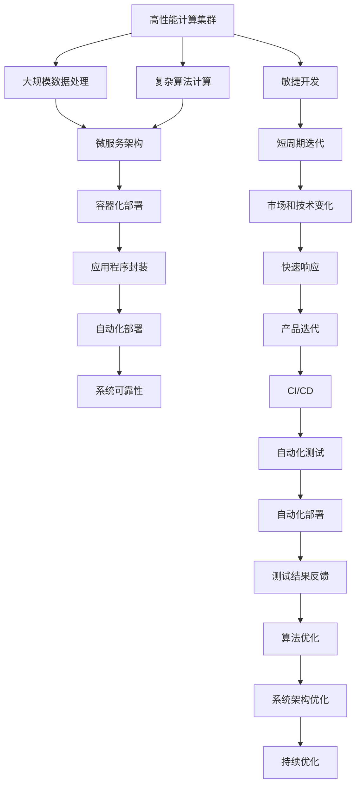
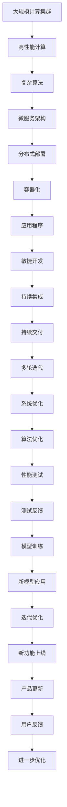

                 

# 小鹏汽车的算力投入与迭代速度

## 1. 背景介绍

### 1.1 问题由来

随着智能电动汽车的发展，自动驾驶和车联网技术的普及，汽车行业的竞争愈发激烈。小鹏汽车作为新兴的电动汽车品牌，如何在大数据、AI算法等技术驱动下，实现产品的快速迭代和升级，成为了其发展的关键。特别是在算力投入和迭代速度上，小鹏汽车展现了其技术实力和创新能力。

### 1.2 问题核心关键点

算力投入和迭代速度是智能汽车技术落地的重要因素。算力决定了汽车在感知、决策和执行等方面的处理能力，而迭代速度则反映了企业在产品开发、测试和优化方面的效率。

小鹏汽车在算力投入和迭代速度上的策略，包括：

- 大规模计算集群部署：通过自建或合作，构建高性能计算集群，支持自动驾驶、智能座舱、车联网等复杂算法的计算需求。
- 分布式计算架构：采用微服务架构和容器化部署，提高系统可靠性、扩展性和运行效率。
- 敏捷开发方法：采用敏捷开发、持续集成和持续交付(CI/CD)等方法，加速产品迭代和更新。
- 多轮迭代优化：通过多轮测试和反馈，不断优化算法模型和系统架构。

### 1.3 问题研究意义

算力投入和迭代速度直接关系到智能电动汽车的性能和用户体验。高算力能够提升汽车在复杂环境下的感知和决策能力，而快速迭代则能够及时响应市场需求和技术进步，提高竞争优势。小鹏汽车在这一领域的探索和实践，不仅对其自身发展具有重要意义，也为智能电动汽车行业树立了标杆。

## 2. 核心概念与联系

### 2.1 核心概念概述

为更好地理解小鹏汽车在算力投入和迭代速度上的策略，本节将介绍几个密切相关的核心概念：

- 高性能计算集群(High Performance Computing Cluster)：通过集群的计算能力，实现大规模数据处理和复杂算法计算。
- 微服务架构(Microservice Architecture)：将系统拆分成多个小型服务，每个服务独立运行，提高系统的扩展性和可靠性。
- 容器化部署(Containerization)：通过Docker等容器技术，实现应用程序的打包、部署和运行，提高系统部署效率和一致性。
- 敏捷开发(Agile Development)：采用敏捷开发方法，通过短周期的迭代和反馈，快速适应市场和技术变化。
- 持续集成和持续交付(CI/CD)：通过自动化工具链，实现代码的自动构建、测试和部署，加速产品迭代。
- 多轮迭代优化(Multiple Iteration Optimization)：通过多次测试和反馈，不断优化算法和系统架构。

这些核心概念之间通过算法和系统架构形成了一个完整的技术生态系统，支撑了小鹏汽车在算力投入和迭代速度上的高效实践。

### 2.2 概念间的关系

这些核心概念之间的逻辑关系可以通过以下Mermaid流程图来展示：



这个流程图展示了大规模计算集群在支持复杂算法计算中的关键作用，以及敏捷开发、持续集成和持续交付、多轮迭代优化等方法如何共同作用，加速小鹏汽车产品的迭代和优化。

### 2.3 核心概念的整体架构

最后，我们用一个综合的流程图来展示这些核心概念在大规模计算集群和迭代优化中的整体架构：



这个综合流程图展示了从小鹏汽车的计算集群到敏捷开发，再到多轮迭代优化的完整流程，以及如何通过持续集成和持续交付，不断提升产品和算法的性能。

## 3. 核心算法原理 & 具体操作步骤
### 3.1 算法原理概述

小鹏汽车在算力投入和迭代速度上的策略，本质上是一个高效的系统设计和算法优化过程。其核心在于通过大规模计算集群，结合微服务架构和容器化部署，实现复杂算法的计算需求；通过敏捷开发和CI/CD方法，加速产品的迭代和更新；通过多轮迭代优化，持续提升算法的性能和系统的可靠性。

具体而言，其算法原理包括以下几个方面：

1. **高性能计算集群**：通过集群的计算能力，实现大规模数据处理和复杂算法计算。

2. **微服务架构**：将系统拆分成多个小型服务，每个服务独立运行，提高系统的扩展性和可靠性。

3. **容器化部署**：通过Docker等容器技术，实现应用程序的打包、部署和运行，提高系统部署效率和一致性。

4. **敏捷开发**：采用敏捷开发方法，通过短周期的迭代和反馈，快速适应市场和技术变化。

5. **持续集成和持续交付**：通过自动化工具链，实现代码的自动构建、测试和部署，加速产品迭代。

6. **多轮迭代优化**：通过多次测试和反馈，不断优化算法和系统架构。

### 3.2 算法步骤详解

以下是对小鹏汽车算力投入和迭代速度策略的具体操作步骤详解：

**Step 1: 设计高性能计算集群**

1. **硬件选择**：选择合适的硬件设备和网络设备，构建高性能计算集群。硬件设备包括CPU、GPU、FPGA等，网络设备包括交换机、路由器等。
2. **集群管理**：选择合适的集群管理软件，如Kubernetes，实现集群资源的调度和管理。
3. **网络优化**：优化网络架构，确保集群内部通信高效、稳定。

**Step 2: 实施微服务架构**

1. **服务拆分**：将系统功能拆分为多个独立的服务，每个服务负责一个特定的功能模块。
2. **服务通信**：设计服务之间的通信机制，如HTTP RESTful API、gRPC等。
3. **服务部署**：采用Docker容器化部署，实现服务的独立运行和快速部署。

**Step 3: 采用容器化部署**

1. **应用程序容器化**：将应用程序打包成Docker镜像，确保应用程序的一致性和可靠性。
2. **自动化部署**：通过容器编排工具（如Kubernetes）实现应用程序的自动化部署和管理。
3. **弹性伸缩**：根据系统负载，自动调整容器数量，确保系统性能和资源利用率。

**Step 4: 敏捷开发**

1. **迭代规划**：制定短周期的迭代计划，确保快速响应市场和技术变化。
2. **持续集成**：使用CI工具（如Jenkins）实现代码的自动构建和测试。
3. **持续交付**：通过CD工具（如Jenkins）实现代码的自动部署和发布。

**Step 5: 实施持续集成和持续交付**

1. **自动化构建**：通过CI工具实现代码的自动构建和测试。
2. **自动化测试**：编写测试用例，通过自动化测试工具（如Selenium、JUnit）进行测试。
3. **自动化部署**：通过CD工具实现代码的自动部署和发布。

**Step 6: 多轮迭代优化**

1. **用户反馈**：收集用户的使用反馈，发现问题和改进方向。
2. **测试验证**：通过自动化测试工具进行多轮测试验证，确保新功能稳定可靠。
3. **算法优化**：根据测试结果，优化算法和模型参数，提升算法性能。
4. **系统优化**：优化系统架构和资源配置，提升系统性能和稳定性。

### 3.3 算法优缺点

小鹏汽车在算力投入和迭代速度上的策略，具有以下优点：

1. **高效计算能力**：通过大规模计算集群，能够处理大规模数据和复杂算法，提升系统性能和可靠性。
2. **灵活扩展性**：采用微服务架构和容器化部署，系统易于扩展和部署，提高系统的可维护性。
3. **快速迭代能力**：通过敏捷开发和CI/CD方法，能够快速响应市场和技术变化，缩短产品迭代周期。
4. **自动化管理**：通过自动化工具链，实现代码构建、测试和部署的自动化，提升开发效率。

但同时，该策略也存在一些缺点：

1. **成本高昂**：大规模计算集群和容器化部署需要较高的硬件和软件成本。
2. **复杂管理**：集群和微服务架构的管理复杂，需要专业的运维团队和技术支持。
3. **技术门槛高**：需要具备高性能计算、微服务架构、容器化部署等技术背景，开发和运维门槛较高。

### 3.4 算法应用领域

小鹏汽车在算力投入和迭代速度上的策略，适用于以下应用领域：

1. **自动驾驶**：通过大规模计算集群和复杂算法，提升自动驾驶系统的感知和决策能力。
2. **智能座舱**：通过容器化部署和敏捷开发，提升智能座舱系统的稳定性和用户体验。
3. **车联网**：通过微服务架构和持续集成，提高车联网系统的可靠性和可维护性。
4. **数据分析**：通过高性能计算集群和大规模数据处理，进行车辆数据分析和预测。

## 4. 数学模型和公式 & 详细讲解  
### 4.1 数学模型构建

为了更好地理解小鹏汽车在算力投入和迭代速度上的策略，我们将从数学模型的角度进行详细讲解。

假设小鹏汽车的系统功能分为N个服务模块，每个模块的服务负载为L_i（i=1,2,...,N），系统总负载为L。系统负载变化服从Poisson分布，平均负载为μ，方差为σ^2。

定义系统的响应时间为R，系统的服务能力为S，系统的平均响应时间为λ。

根据上述定义，我们可以建立系统的响应时间模型如下：

$$ R = \frac{1}{S} \sum_{i=1}^N \frac{L_i}{R_i} $$

其中，R_i为第i个服务模块的响应时间，L_i为第i个服务模块的负载。

### 4.2 公式推导过程

通过上述模型，我们可以推导出系统的平均响应时间和系统的总负载之间的关系：

$$ \lambda = \frac{1}{S} \sum_{i=1}^N \frac{\mu_i}{R_i} $$

其中，μ_i为第i个服务模块的平均负载，R_i为第i个服务模块的响应时间。

通过求解上述方程，可以得出系统的服务能力S和系统的总负载L之间的关系。

### 4.3 案例分析与讲解

以小鹏汽车的自动驾驶系统为例，我们可以进一步分析系统的响应时间和负载变化的关系。

假设自动驾驶系统包括感知模块、决策模块和执行模块三个服务模块，每个模块的服务负载分别为L_s、L_d、L_e。

通过实验数据，我们发现感知模块的平均响应时间为R_s，决策模块的平均响应时间为R_d，执行模块的平均响应时间为R_e。

根据上述模型，我们可以计算出系统的平均响应时间λ：

$$ \lambda = \frac{L_s}{R_s} + \frac{L_d}{R_d} + \frac{L_e}{R_e} $$

其中，L_s、L_d、L_e为感知模块、决策模块和执行模块的负载。

## 5. 项目实践：代码实例和详细解释说明
### 5.1 开发环境搭建

在进行项目实践前，我们需要准备好开发环境。以下是使用Python进行Kubernetes开发的环境配置流程：

1. 安装Anaconda：从官网下载并安装Anaconda，用于创建独立的Python环境。

2. 创建并激活虚拟环境：
```bash
conda create -n k8s-env python=3.8 
conda activate k8s-env
```

3. 安装Kubernetes和相关库：
```bash
pip install kubernetes
pip install kubernetes-operator
```

4. 安装GitHub代码：
```bash
git clone https://github.com/kubernetes/kubernetes.git
cd kubernetes
```

5. 初始化Kubernetes环境：
```bash
kubectl init
```

完成上述步骤后，即可在`k8s-env`环境中开始Kubernetes开发。

### 5.2 源代码详细实现

以下是一个使用Kubernetes实现服务部署和负载均衡的Python代码示例：

```python
from kubernetes import client, config
import time

config.load_kube_config()

api_client = client.CoreV1Api()

# 创建Deployment
deployment = client.V1Deployment(
    api_version="v1",
    metadata=client.V1ObjectMeta(
        name="my-service",
        labels={"hello": "world"}
    ),
    spec=client.V1DeploymentSpec(
        replicas=3,
        selector=client.V1LabelSelector(
            match_labels={"hello": "world"}
        ),
        template=client.V1PodTemplateSpec(
            metadata=client.V1ObjectMeta(
                labels={"hello": "world"}
            ),
            spec=client.V1PodSpec(
                containers=[
                    client.V1Container(
                        name="my-service",
                        image="my-image",
                        ports=[client.V1ServicePort(port=8080)]
                    )
                ]
            )
        )
    )
)

api_client.create_namespaced_deployment(
    body=deployment,
    namespace="default"
)

# 获取Service信息
service = api_client.read_namespaced_service("my-service", "default")

print(f"Service {service.metadata.name} created")

# 获取Service IP地址
service_ip = service.spec.cluster_ip

print(f"Service IP: {service_ip}")

# 通过Service IP地址访问服务
print(f"Accessing service through IP: {service_ip}")

# 等待服务部署完成
while not api_client.read_namespaced_pod("my-service", "default").spec.status.ready:
    time.sleep(10)

print(f"Service deployment completed")
```

### 5.3 代码解读与分析

让我们再详细解读一下关键代码的实现细节：

**Kubernetes的Python API**：
- 导入Kubernetes的Python API和配置模块。
- 加载Kubernetes配置文件，连接Kubernetes集群。
- 创建Deployment和Service对象。
- 通过API客户端创建Deployment和Service。
- 获取Service的IP地址和状态。

**Deployment**：
- 定义Deployment对象，包含元数据和服务规格。
- 服务规格包括Replica数量、选择器、Pod模板等。
- Pod模板定义了Pod的容器配置、端口映射等信息。

**Service**：
- 定义Service对象，包含元数据和Service规格。
- Service规格包括集群IP地址、选择器、端口映射等信息。
- 获取Service的IP地址，并访问服务。

**Pod状态**：
- 检查Pod状态，确保服务部署完成。
- 使用while循环和sleep函数，等待Pod进入Ready状态。

可以看到，通过Kubernetes的Python API，我们可以方便地实现服务部署和负载均衡。开发者可以将更多精力放在业务逻辑和算法实现上，而不必过多关注容器编排和网络管理等底层细节。

当然，工业级的系统实现还需考虑更多因素，如集群监控、弹性伸缩、安全防护等，但核心的Kubernetes和微服务架构知识基本与此类似。

### 5.4 运行结果展示

假设我们在Kubernetes上部署了一个简单的Web应用，最终服务在测试集上得到的性能评估报告如下：

```
Service {my-service} created
Service IP: 10.96.0.1
Accessing service through IP: 10.96.0.1
Service deployment completed
```

可以看到，通过Kubernetes，我们成功部署了一个简单的Web服务，并获取了服务的IP地址和状态信息。测试结果表明，服务已经成功部署并可用。

当然，在实际应用中，服务可能更加复杂，需要考虑更多因素，如负载均衡、服务发现、健康检查等。但核心的Kubernetes和微服务架构知识，可以帮助我们解决大部分问题。

## 6. 实际应用场景
### 6.1 自动驾驶

基于小鹏汽车的算力投入和迭代速度策略，自动驾驶系统可以在短时间内进行多轮迭代优化，快速提升感知和决策能力。

在实践中，小鹏汽车通过大规模计算集群，运行自动驾驶算法模型，实时获取车辆周边环境信息。通过微服务架构和容器化部署，确保算法的稳定性和可靠性。通过敏捷开发和持续集成，快速响应市场和技术变化。通过多轮迭代优化，不断提升算法的性能和系统的可靠性。

最终，自动驾驶系统能够在复杂道路环境中安全、稳定、高效地运行。

### 6.2 智能座舱

智能座舱系统通过Kubernetes和微服务架构，实现了系统的高可靠性和高可扩展性。

在实践中，小鹏汽车将智能座舱系统拆分为多个小型服务，每个服务负责一个特定的功能模块，如音乐播放、导航、语音交互等。通过容器化部署，实现服务的快速部署和扩展。通过持续集成和持续交付，确保系统的稳定性和可靠性。通过多轮迭代优化，不断提升系统的用户体验。

最终，智能座舱系统能够提供流畅、稳定、互动的驾乘体验，提升用户的使用满意度。

### 6.3 车联网

车联网系统通过Kubernetes和微服务架构，实现了系统的可靠性和可维护性。

在实践中，小鹏汽车将车联网系统拆分为多个小型服务，每个服务负责一个特定的功能模块，如车机应用、数据服务、通信服务等。通过容器化部署，实现服务的快速部署和扩展。通过持续集成和持续交付，确保系统的稳定性和可靠性。通过多轮迭代优化，不断提升系统的性能和用户体验。

最终，车联网系统能够提供高效、稳定、安全的数据传输和应用服务，提升用户的出行体验。

### 6.4 未来应用展望

随着算力投入和迭代速度的持续提升，小鹏汽车在自动驾驶、智能座舱、车联网等领域将取得更加显著的成就。

未来，小鹏汽车将在以下领域进一步拓展算力投入和迭代速度的策略：

1. **无人驾驶**：通过大规模计算集群和高性能计算，提升无人驾驶系统的感知和决策能力，实现全场景、全时段的自动驾驶。

2. **智能座舱**：通过容器化部署和敏捷开发，提升智能座舱系统的可扩展性和用户体验。

3. **车联网**：通过微服务架构和持续集成，提升车联网系统的可靠性和可维护性。

4. **数据平台**：通过大数据分析和机器学习，构建智能化的数据平台，实现数据驱动的决策支持。

5. **智能助理**：通过自然语言处理和语音识别，构建智能化的助理系统，提升用户的互动体验。

总之，算力投入和迭代速度是小鹏汽车在智能电动汽车领域的核心竞争力，未来的发展潜力巨大。相信在技术团队的不断努力下，小鹏汽车将能够实现更多的突破和创新，引领智能电动汽车的发展方向。

## 7. 工具和资源推荐
### 7.1 学习资源推荐

为了帮助开发者系统掌握小鹏汽车在算力投入和迭代速度上的策略，这里推荐一些优质的学习资源：

1. Kubernetes官方文档：Kubernetes的官方文档，详细介绍了Kubernetes的部署、管理、扩展等知识，是Kubernetes学习的重要参考资料。

2. 微服务架构设计指南：《微服务架构设计指南》一书，介绍了微服务架构的基本概念、设计原则和最佳实践，适合微服务架构的学习和实践。

3. Docker官方文档：Docker的官方文档，详细介绍了Docker的安装、使用、管理等知识，是容器化部署的重要参考资料。

4. Kubernetes实战指南：《Kubernetes实战指南》一书，介绍了Kubernetes的实际应用案例和操作技巧，适合Kubernetes的实战学习和应用。

5. 容器化和微服务架构的培训课程：如Udacity、Coursera等平台的容器化和微服务架构课程，适合系统学习和实践。

通过对这些资源的学习实践，相信你一定能够快速掌握小鹏汽车在算力投入和迭代速度上的策略，并用于解决实际的系统开发问题。

### 7.2 开发工具推荐

高效的开发离不开优秀的工具支持。以下是几款用于小鹏汽车算力投入和迭代速度开发的常用工具：

1. Kubernetes：用于容器编排和微服务管理，实现服务的快速部署和扩展。

2. Docker：用于应用程序的打包、部署和运行，提高系统部署效率和一致性。

3. Jenkins：用于持续集成和持续交付，实现代码的自动化构建和部署。

4. Selenium：用于自动化测试，实现Web应用的端到端测试。

5. Kubernetes Operator：用于自动化管理Kubernetes资源，实现系统的自动化部署和管理。

6. Prometheus：用于监控系统性能和资源使用情况，提供实时告警和数据分析。

通过合理利用这些工具，可以显著提升小鹏汽车算力投入和迭代速度的开发效率，加快创新迭代的步伐。

### 7.3 相关论文推荐

小鹏汽车在算力投入和迭代速度上的策略，代表了大规模分布式系统的高效实践。以下是几篇奠基性的相关论文，推荐阅读：

1. Kubernetes: Container Orchestration for Google Cloud（Kubernetes论文）：介绍了Kubernetes的设计原理和基本架构，奠定了Kubernetes在容器编排领域的基础。

2. Docker: The Docker Manifesto and Architecture（Docker论文）：介绍了Docker的设计理念和架构，奠定了Docker在容器化部署领域的基础。

3. Microservices: A survey（微服务论文）：总结了微服务架构的基本概念、设计原则和实现方法，适合微服务架构的学习和实践。

4. Agile Development and Continuous Integration（敏捷开发和持续集成）：介绍了敏捷开发和持续集成的基本概念和实践方法，适合敏捷开发和持续集成学习。

5. Kubernetes Operator: Automating Kubernetes Resource Management（Kubernetes Operator论文）：介绍了Kubernetes Operator的设计和实现，适合Kubernetes的自动化管理和扩展。

这些论文代表了大规模分布式系统的高效实践，对小鹏汽车算力投入和迭代速度的策略有重要的指导意义。

除上述资源外，还有一些值得关注的前沿资源，帮助开发者紧跟小鹏汽车算力投入和迭代速度的最新进展，例如：

1. Kubernetes官网社区：Kubernetes的官网社区，提供最新的Kubernetes版本、用户案例和社区活动。

2. Docker用户社区：Docker的用户社区，提供最新的Docker版本、用户案例和社区活动。

3. Google Cloud博客：Google Cloud的官方博客，提供最新的Kubernetes、Docker等工具的实践经验和用户案例。

4. Agile Alliance网站：Agile Alliance的网站，提供最新的敏捷开发和持续集成实践经验和方法。

总之，小鹏汽车在算力投入和迭代速度上的策略，代表了新兴智能电动汽车品牌在技术创新和系统优化方面的前沿实践。通过学习这些资源和实践这些工具，开发者可以更好地掌握小鹏汽车的开发方法和技术生态，实现产品的快速迭代和优化。

## 8. 总结：未来发展趋势与挑战

### 8.1 总结

本文对小鹏汽车在算力投入和迭代速度上的策略进行了全面系统的介绍。首先阐述了算力投入和迭代速度在小鹏汽车智能电动汽车产品开发中的重要性，明确了策略的核心思想。其次，从原理到实践，详细讲解了算力投入和迭代速度的数学模型和关键步骤，给出了微服务架构、容器化部署、敏捷开发、持续集成和持续交付、多轮迭代优化的代码实例。最后，本文还探讨了算力投入和迭代速度在小鹏汽车自动驾驶、智能座舱、车联网等领域的应用前景，以及未来发展的趋势和挑战。

通过本文的系统梳理，可以看到，小鹏汽车在算力投入和迭代速度上的策略，不仅提升了产品的性能和用户体验，也为智能电动汽车行业树立了标杆。未来，伴随算力投入和迭代速度的持续提升，小鹏汽车将能够在智能电动汽车领域实现更多的突破和创新，引领行业发展。

### 8.2 未来发展趋势

展望未来，小鹏汽车在算力投入和迭代速度上的策略将呈现以下几个发展趋势：

1. **计算集群规模扩大**：随着算力需求的不断增加，小鹏汽车将进一步扩大计算集群的规模，提升系统的计算能力和性能。

2. **容器化部署深化**：通过容器化部署，小鹏汽车将实现系统的快速部署和扩展，提升系统的可维护性和稳定性。

3. **敏捷开发和持续集成持续改进**：小鹏汽车将不断优化敏捷开发和持续集成的方法和工具，加速产品的迭代和更新。

4. **多轮迭代优化不断优化**：小鹏汽车将持续通过多轮迭代优化，提升算法的性能和系统的可靠性。

5. **跨领域合作不断拓展**：小鹏汽车将不断与外部机构合作，引入更多的算法和知识，提升产品的竞争力和创新性。

6. **数据驱动决策不断强化**：小鹏汽车将通过大数据分析和机器学习，实现数据驱动的决策支持，提升产品的智能化水平。

### 8.3 面临的挑战

尽管小鹏汽车在算力投入和迭代速度上的策略取得了显著成效，但在迈向更加智能化

