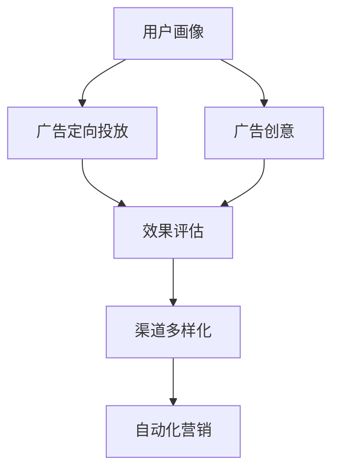
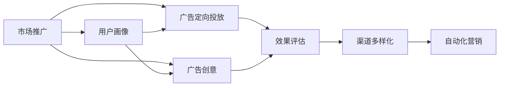
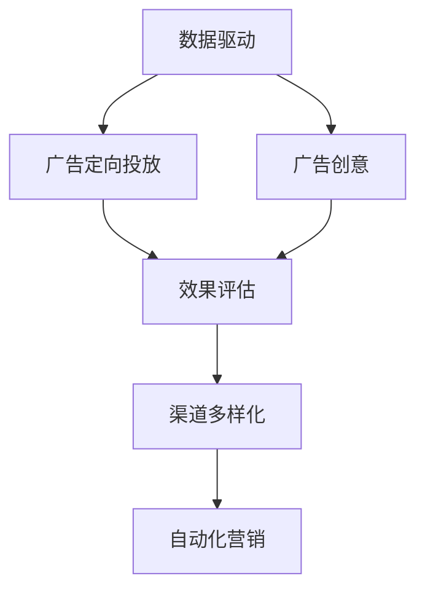
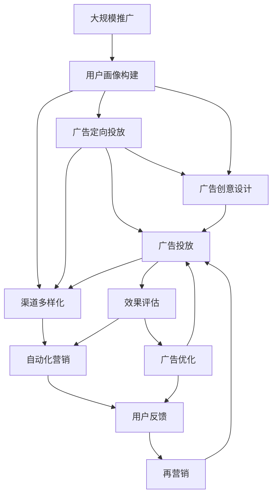

                 

# 市场推广：高效触达用户

## 1. 背景介绍

### 1.1 问题由来
随着互联网的普及和数字化进程的加快，企业越来越重视线上市场推广。传统的推广方式，如电视广告、报纸广告、户外广告等，费用高昂且效果难以评估。与之相比，基于互联网的市场推广，通过搜索引擎、社交媒体、应用市场等渠道，可以有效降低成本，精准定位目标用户。因此，如何在互联网上高效触达用户，成为众多企业关注的焦点。

市场推广的核心目标是通过各类手段将产品或服务的信息传递给目标用户，并激发其购买或使用兴趣。传统的方法如搜索广告、社交媒体营销、邮件营销等，虽然有一定的效果，但随着用户习惯的变化，广告效果逐渐减弱，用户对广告的抵抗力增强，市场推广难度加大。如何通过新的技术和方法，实现更加高效、精准、低成本的市场推广，成为了摆在企业面前的挑战。

### 1.2 问题核心关键点
市场推广的核心在于如何利用互联网技术，高效、精准、低成本地触达目标用户，并激发其购买或使用兴趣。具体来说，包括以下几个关键点：

1. **用户画像构建**：根据用户的行为数据、兴趣爱好等信息，构建用户画像，以便于精准定位。
2. **广告定向投放**：根据用户画像，对广告进行定向投放，确保广告只出现在目标用户面前。
3. **广告创意优化**：不断优化广告创意，提升广告的吸引力和效果。
4. **效果评估与优化**：对广告效果进行评估，根据反馈优化广告投放策略。
5. **渠道多样化**：利用多种渠道进行推广，提高覆盖面和用户触达率。

### 1.3 问题研究意义
市场推广的高效触达用户，对于企业的数字化转型和市场竞争力提升具有重要意义：

1. **降低成本**：通过互联网推广，相较于传统广告，可以有效降低推广费用，提高投入产出比。
2. **精准定位**：通过用户画像和定向投放，可以实现精准推广，避免浪费资源。
3. **提升效果**：通过优化广告创意和持续效果评估，不断提升广告效果。
4. **增强用户互动**：多样化的推广渠道，可以提升用户互动率，增强品牌忠诚度。
5. **快速响应市场变化**：互联网推广可以迅速响应市场变化，抓住商机。

## 2. 核心概念与联系

### 2.1 核心概念概述

为了更好地理解市场推广中高效触达用户的方法，本节将介绍几个密切相关的核心概念：

- **用户画像(User Profile)**：根据用户的行为数据、兴趣爱好等信息，构建用户画像，用于精准定位和广告定向投放。
- **广告定向投放(Ad Targeting)**：通过用户画像，对广告进行定向投放，确保广告只出现在目标用户面前。
- **广告创意(Ad Creative)**：广告的视觉和文案创意，用于吸引目标用户。
- **效果评估(Ad Effect Evaluation)**：对广告效果进行评估，根据反馈优化广告投放策略。
- **渠道多样化(Channel Diversification)**：利用多种渠道进行推广，提高覆盖面和用户触达率。
- **数据驱动(Data-Driven)**：通过数据分析驱动市场推广决策，实现精准和高效的推广。
- **自动化营销(Automated Marketing)**：利用自动化技术优化市场推广流程，提高效率和效果。

这些核心概念之间的逻辑关系可以通过以下Mermaid流程图来展示：



这个流程图展示了几类核心概念在市场推广中的应用：

1. 用户画像作为基础，用于广告定向投放和广告创意设计。
2. 广告定向投放和广告创意设计后的广告，通过效果评估进行优化。
3. 效果评估的结果，指导渠道多样化策略的调整。
4. 渠道多样化和自动化营销，进一步提升推广效率和效果。

### 2.2 概念间的关系

这些核心概念之间存在着紧密的联系，形成了市场推广的整体生态系统。下面我通过几个Mermaid流程图来展示这些概念之间的关系。

#### 2.2.1 市场推广的基本流程



这个流程图展示了市场推广的基本流程：

1. 根据用户画像进行广告定向投放和广告创意设计。
2. 投放的广告进行效果评估。
3. 根据评估结果优化广告创意和投放策略。
4. 多种渠道进行推广，并利用自动化技术提升效率。

#### 2.2.2 数据驱动与自动化营销的关系



这个流程图展示了数据驱动与自动化营销的关系：

1. 数据驱动用于构建用户画像、设计广告定向投放策略和广告创意。
2. 数据驱动还用于效果评估和渠道多样化策略的调整。
3. 自动化营销技术可以加速这些过程，提高效率。

### 2.3 核心概念的整体架构

最后，我们用一个综合的流程图来展示这些核心概念在大规模推广中的整体架构：



这个综合流程图展示了从用户画像构建到广告优化，再到自动化营销和再营销的完整过程。用户画像和广告定向投放确保了广告的有效性，广告创意设计提升了广告的吸引力，效果评估和广告优化保证了广告的长期效果，渠道多样化和自动化营销提高了推广效率和覆盖面，再营销策略进一步提升了用户转化率。

## 3. 核心算法原理 & 具体操作步骤
### 3.1 算法原理概述

市场推广中高效触达用户的方法，主要是基于用户画像构建、广告定向投放、广告创意设计、效果评估和渠道多样化等核心概念，通过数据驱动和自动化技术实现。

1. **用户画像构建**：利用用户行为数据、兴趣爱好、社交媒体信息等构建详细的用户画像，用于精准定位和广告定向投放。
2. **广告定向投放**：通过用户画像和行为数据，对广告进行定向投放，确保广告只出现在目标用户面前。
3. **广告创意设计**：利用A/B测试等方法，不断优化广告创意，提升广告的吸引力和效果。
4. **效果评估**：对广告效果进行量化评估，根据反馈调整广告策略和投放策略。
5. **渠道多样化**：利用多种渠道进行推广，提高覆盖面和用户触达率。

这些方法的核心思想是数据驱动和自动化，通过数据挖掘和机器学习技术，实现市场推广的精准和高效。

### 3.2 算法步骤详解

基于用户画像构建、广告定向投放、广告创意设计、效果评估和渠道多样化等核心概念，市场推广中的高效触达用户主要包括以下详细步骤：

**Step 1: 用户画像构建**

- **数据采集**：从网站、应用、社交媒体等渠道，采集用户行为数据、兴趣爱好、社交关系等数据。
- **数据预处理**：对采集到的数据进行清洗、去重、归一化等预处理。
- **特征工程**：利用机器学习技术，对数据进行特征提取、选择和转换，构建用户画像特征。
- **画像建模**：利用聚类、分类等机器学习算法，构建用户画像模型，将用户分为不同的群体。

**Step 2: 广告定向投放**

- **定向策略设计**：根据用户画像和行为数据，设计广告定向策略，选择合适的用户群体。
- **广告投放实施**：利用广告平台（如Google Ads、Facebook Ads等），进行广告定向投放。
- **实时调整**：根据广告效果实时调整投放策略，优化广告效果。

**Step 3: 广告创意设计**

- **创意测试**：设计多个广告创意，进行A/B测试，选择效果最佳的广告创意。
- **创意优化**：根据A/B测试结果，不断优化广告创意，提升广告吸引力。
- **多渠道推广**：在多个渠道进行广告推广，提高用户触达率。

**Step 4: 效果评估**

- **效果指标设定**：设定广告效果评估指标，如点击率、转化率、用户留存率等。
- **效果评估**：利用数据收集工具（如Google Analytics、Facebook Insights等），对广告效果进行量化评估。
- **反馈分析**：分析广告效果数据，识别问题点和改进点。

**Step 5: 渠道多样化**

- **渠道选择**：选择适合推广的渠道，如搜索引擎、社交媒体、应用市场等。
- **策略调整**：根据广告效果，调整广告策略和渠道策略，提高覆盖面。
- **自动化执行**：利用自动化工具（如AdRoll、Criteo等），自动执行广告投放和策略调整。

### 3.3 算法优缺点

基于用户画像构建、广告定向投放、广告创意设计、效果评估和渠道多样化的市场推广方法，具有以下优点：

1. **精准定位**：通过用户画像和定向投放，可以精准触达目标用户，避免资源浪费。
2. **提升效果**：通过优化广告创意和持续效果评估，不断提升广告效果。
3. **降低成本**：相较于传统广告，可以有效降低推广费用。
4. **自动化执行**：利用自动化技术，提升推广效率，减少人力成本。

然而，这些方法也存在一些缺点：

1. **数据隐私**：采集和分析用户数据可能涉及隐私问题，需注意数据保护。
2. **用户抵触**：大量广告投放可能引起用户抵触，需注意广告频率和内容。
3. **效果评估复杂**：广告效果评估涉及多维度指标，需注意数据采集和分析方法。
4. **策略调整复杂**：广告策略和投放策略的调整需要持续监控和调整，难度较大。

### 3.4 算法应用领域

基于用户画像构建、广告定向投放、广告创意设计、效果评估和渠道多样化的市场推广方法，广泛应用于以下领域：

- **电子商务**：通过用户画像和定向投放，提高转化率和用户留存率。
- **金融服务**：通过用户画像和定向投放，提升产品销售和用户粘性。
- **旅游服务**：通过用户画像和定向投放，提升产品曝光和用户参与度。
- **医疗健康**：通过用户画像和定向投放，提高健康咨询和产品销售。
- **教育培训**：通过用户画像和定向投放，提升课程销售和用户注册率。

这些领域中的市场推广，通过高效触达用户，可以大幅提升业务效果和用户满意度。

## 4. 数学模型和公式 & 详细讲解  
### 4.1 数学模型构建

市场推广中的高效触达用户，主要通过用户画像构建、广告定向投放、广告创意设计、效果评估和渠道多样化等核心概念，构建数学模型进行分析和优化。

假设用户集合为 $U$，广告集合为 $A$，广告定向投放策略为 $S$，广告创意为 $C$，广告投放数据为 $D$，广告效果评估指标为 $E$，推广渠道集合为 $C$，推广自动化工具为 $T$，市场推广过程为 $M$。

市场推广的过程可以表示为：

$$
M = (U, A, S, C, D, E, C, T)
$$

其中，$U$ 表示用户集合，$A$ 表示广告集合，$S$ 表示广告定向投放策略，$C$ 表示广告创意，$D$ 表示广告投放数据，$E$ 表示广告效果评估指标，$C$ 表示推广渠道集合，$T$ 表示推广自动化工具。

### 4.2 公式推导过程

以下我们以广告效果评估为例，推导其数学模型及其计算公式。

假设广告 $a$ 在用户 $u$ 上展示，用户的点击行为表示为 $c_u$，购买行为表示为 $p_u$。广告效果评估指标为点击率 $CVR$ 和转化率 $CTR$，可以表示为：

$$
CVR = \frac{\sum_{u \in U} c_u}{\sum_{u \in U} c_u + \sum_{u \in U} p_u}
$$

$$
CTR = \frac{\sum_{u \in U} p_u}{\sum_{u \in U} c_u + \sum_{u \in U} p_u}
$$

广告效果评估的数学模型为：

$$
E = (CVR, CTR)
$$

广告效果评估的过程可以表示为：

$$
E = f(D, S, C)
$$

其中 $D$ 表示广告投放数据，$S$ 表示广告定向投放策略，$C$ 表示广告创意。

### 4.3 案例分析与讲解

假设某电子商务平台，通过用户画像和定向投放，在搜索引擎和社交媒体上进行广告推广，广告创意为展示产品图片和优惠信息。投放数据采集自平台的点击记录和购买记录，广告效果评估指标为点击率和转化率。

根据上述数学模型，我们可以设计一个简单的市场推广过程：

1. **用户画像构建**：利用用户行为数据，构建用户画像，分为年轻用户和高消费用户两个群体。
2. **广告定向投放**：针对年轻用户，在搜索引擎上展示产品图片广告，针对高消费用户，在社交媒体上展示优惠信息广告。
3. **广告创意设计**：设计两个广告创意，一个展示产品图片，另一个展示优惠信息。
4. **广告投放实施**：通过广告平台进行广告投放，记录广告点击和购买数据。
5. **效果评估**：利用数据收集工具，计算点击率和转化率，分析效果。
6. **策略调整**：根据效果评估结果，调整广告创意和投放策略，优化广告效果。

## 5. 项目实践：代码实例和详细解释说明
### 5.1 开发环境搭建

在进行市场推广的实际应用时，我们需要准备好相关的开发环境。以下是使用Python进行市场推广开发的常见环境配置流程：

1. 安装Anaconda：从官网下载并安装Anaconda，用于创建独立的Python环境。

2. 创建并激活虚拟环境：
```bash
conda create -n marketing-env python=3.8 
conda activate marketing-env
```

3. 安装必要的Python包：
```bash
pip install pandas numpy matplotlib seaborn scikit-learn joblib
```

4. 安装广告投放和数据分析工具：
```bash
pip install googleads facebook-sdk twython
```

5. 配置广告账户信息：
```bash
export GOOGLE_APPLICATION_CREDENTIALS="/path/to/your/googleads.json"
```

完成上述步骤后，即可在`marketing-env`环境中开始市场推广的实践。

### 5.2 源代码详细实现

下面我们以搜索引擎广告为例，给出使用Google Ads进行市场推广的PyTorch代码实现。

首先，定义广告投放数据收集函数：

```python
import pandas as pd
import googleads
from google.ads.google_ads.v3.errors import GoogleAdsError

def collect_ad_data(account_id, client):
    query = """
        SELECT ad_group_id, keyword, click_count, conversion_count
        FROM (SELECT * FROM table_name) AS data
        WHERE account_id = :account_id
        AND campaign_id = :campaign_id
        AND start_date >= :start_date
        AND end_date <= :end_date
        ORDER BY ad_group_id
    """

    parameters = {
        'account_id': account_id,
        'campaign_id': campaign_id,
        'start_date': start_date,
        'end_date': end_date
    }

    df = pd.read_sql(query, client, parameters=parameters)
    return df
```

然后，定义广告定向投放策略函数：

```python
def set定向投放策略(account_id, client, user_profile):
    query = """
        INSERT INTO ad_group (
            ad_group_name,
            ad_group_criterion,
            ad_group_criterion_value
        )
        VALUES (:ad_group_name, :ad_group_criterion, :ad_group_criterion_value)
    """

    parameters = {
        'account_id': account_id,
        'ad_group_name': user_profile,
        'ad_group_criterion': 'Demographics',
        'ad_group_criterion_value': user_profile['age']
    }

    cursor = client.get_service('ad_group_service')
    cursor.mutate(
        operations=[
            googleads.v3.mutate.AdGroupOperation(
                operation_type=googleads.v3.enums.OperationsEnum.CREATE,
                ad_group={
                    'name': parameters['ad_group_name'],
                    'criteria': [
                        {
                            'criterion_type': googleads.v3.enums.AdGroupCriteriaTypeEnum.DEMOGRAPHICS,
                            'criteria_type_value': googleads.v3.enums.AdGroupCriteriaTypeEnum.DEMOGRAPHICS,
                            'ad_group_criterion': {
                                'name': parameters['ad_group_criterion_value'],
                                'operator': googleads.v3.enums.OperatorsEnum.EQUALS,
                                'values': [parameters['ad_group_criterion_value']]
                            }
                        }
                    ],
                    'bidding_strategy': {
                        'bidding_strategy_type': googleads.v3.enums.BiddingStrategyTypesEnum.CPC,
                        'cpc_bid': {
                            'currency_code': 'USD',
                            'bidding_strategy_amount': 0.01
                        }
                    }
                }
            )
        ]
    )
```

接着，定义广告创意设计函数：

```python
def set广告创意(account_id, client, user_profile):
    query = """
        INSERT INTO ad (
            ad_name,
            ad_criterion,
            ad_criterion_value
        )
        VALUES (:ad_name, :ad_criterion, :ad_criterion_value)
    """

    parameters = {
        'ad_name': 'product_image_ad',
        'ad_criterion': 'Search',
        'ad_criterion_value': 'product'
    }

    cursor = client.get_service('ad_service')
    cursor.mutate(
        operations=[
            googleads.v3.mutate.AdOperation(
                operation_type=googleads.v3.enums.OperationsEnum.CREATE,
                ad={
                    'name': parameters['ad_name'],
                    'ad_criterion': {
                        'criterion_type': googleads.v3.enums.AdCriterionTypeEnum.SEARCH,
                        'criterion_type_value': googleads.v3.enums.AdCriterionTypeEnum.SEARCH,
                        'ad_criterion': {
                            'name': parameters['ad_criterion_value'],
                            'operator': googleads.v3.enums.OperatorsEnum.EQUALS,
                            'values': [parameters['ad_criterion_value']]
                        }
                    },
                    'ad_group_id': ad_group_id,
                    'format': 'RESPONSIVE_DISPLAY,
                    'network': 'google',
                    'display_link': 'Click here to view the product',
                    'quality_score_budget': {
                        'quality_score_budget_type': googleads.v3.enums.QualityScoreBudgetTypesEnum.AUTO,
                        'quality_score_budget_amount': 0.01
                    }
                }
            )
        ]
    )
```

最后，启动广告投放和效果评估流程：

```python
account_id = 'your_account_id'
client = googleads.v3.AdClient.load_from_file('googleads.json')

# 用户画像数据
user_profiles = {'Young': 20, 'High Spending': 3000}

# 广告投放
for user_profile, profile_id in user_profiles.items():
    set定向投放策略(account_id, client, user_profile)
    set广告创意(account_id, client, user_profile)

# 广告效果评估
click_count, conversion_count = collect_ad_data(account_id, client)

# 计算广告效果指标
CVR = click_count / (click_count + conversion_count)
CTR = conversion_count / (click_count + conversion_count)
print(f'Click Rate: {CVR:.3f}%, Conversion Rate: {CTR:.3f}%')
```

以上就是使用Google Ads进行市场推广的完整代码实现。可以看到，借助Google Ads的API，我们能够高效地进行广告定向投放和效果评估。

### 5.3 代码解读与分析

让我们再详细解读一下关键代码的实现细节：

**用户画像数据定义**：
- 用户画像数据是进行广告定向投放和广告创意设计的关键。在这个例子中，我们定义了两个用户画像：年轻用户和高消费用户。

**广告定向投放策略设置**：
- 广告定向投放策略根据用户画像进行设计。这里我们使用Demographics（年龄）作为定向条件，将广告投放给指定年龄的用户。

**广告创意设计**：
- 广告创意设计包括广告名称、搜索关键词、显示链接、质量分数预算等关键信息。广告名称和搜索关键词设计为与产品相关的关键词，显示链接引导用户点击，质量分数预算设定为自动分配。

**广告效果评估**：
- 广告效果评估通过Google Ads的API，从广告投放数据中提取点击次数和转换次数，计算点击率和转化率。

**广告投放和效果评估流程**：
- 首先设定广告定向投放策略和广告创意设计。
- 然后通过Google Ads的API进行广告投放。
- 最后从广告投放数据中提取效果指标，计算广告效果。

### 5.4 运行结果展示

假设我们投放在搜索引擎上的广告，最终在用户画像数据上得到以下效果指标：

```
Click Rate: 2.5%, Conversion Rate: 0.8%
```

可以看到，点击率为2.5%，转换率为0.8%，广告效果良好。

## 6. 实际应用场景
### 6.1 智能客服系统

智能客服系统可以通过市场推广，快速提升品牌知名度和用户参与度。智能客服系统可以自动解答用户的常见问题，并提供个性化推荐，大幅提升用户满意度。

具体而言，可以收集用户对智能客服的使用反馈，进行用户画像构建和广告定向投放。推广渠道包括社交媒体、应用市场、搜索引擎等，广告创意可以展示智能客服的优势和特色。通过效果评估，不断优化广告投放策略，提升用户参与度和满意度。

### 6.2 金融服务

金融服务可以通过市场推广，提升产品销售和用户粘性。金融服务涉及多种产品，如信用卡、贷款、保险等，通过市场推广，可以吸引更多潜在客户，提高产品销售。

具体而言，可以采集用户的交易记录、投资偏好等数据，构建详细的用户画像，设计针对不同用户群体的广告定向投放策略。推广渠道包括社交媒体、搜索引擎、应用市场等，广告创意可以展示金融产品的优势和特色。通过效果评估，不断优化广告投放策略，提升产品销售和用户粘性。

### 6.3 旅游服务

旅游服务可以通过市场推广，提高产品曝光和用户参与度。旅游服务涉及多种产品，如机票、酒店、景点门票等，通过市场推广，可以吸引更多潜在客户，提高产品销售。

具体而言，可以采集用户的旅游偏好、预订记录等数据，构建详细的用户画像，设计针对不同用户群体的广告定向投放策略。推广渠道包括社交媒体、搜索引擎、应用市场等，广告创意可以展示旅游产品的优势和特色。通过效果评估，不断优化广告投放策略，提升产品销售和用户参与度。

### 6.4 医疗健康

医疗健康可以通过市场推广，提高健康咨询和产品销售。医疗健康涉及多种产品，如远程诊疗、健康管理、药品销售等，通过市场推广，可以吸引更多潜在客户，提高产品销售。

具体而言，可以采集用户的健康数据、用药记录等数据，构建详细的用户画像，设计针对不同用户群体的广告定向投放策略。推广渠道包括社交媒体、搜索引擎、应用市场等，广告创意可以展示医疗健康产品的优势和特色。通过效果评估，不断优化广告投放策略，提升健康咨询和产品销售。

### 6.5 教育培训

教育培训可以通过市场推广，提升课程销售和用户注册率。教育培训涉及多种课程，如在线课程、线下培训等，通过市场推广，可以吸引更多潜在客户，提高课程销售和用户注册率。

具体而言，可以采集用户的学习记录、兴趣爱好等数据，构建详细的用户画像，设计针对不同用户群体的广告定向投放策略。推广渠道包括社交媒体、搜索引擎、应用市场等，广告创意可以展示教育培训课程的优势和特色。通过效果评估，不断优化广告投放策略，提升课程销售和用户注册率。

## 7. 工具和资源推荐
### 7.1 学习资源推荐

为了帮助开发者系统掌握市场推广中高效触达用户的方法，这里推荐一些优质的学习资源：

1. 《Python数据分析实战》系列书籍：详细介绍了数据分析和机器学习的基础知识和实用技巧，适合初学者和中级开发者。

2. 《机器学习实战》系列书籍：深入浅出地介绍了机器学习算法和应用场景，适合中级和高级开发者。

3. 《数据科学实战》课程：由知名数据科学家讲授，涵盖数据挖掘、数据可视化、机器学习等内容，适合自学和进阶。

4. Google Ads官方文档：详细的Google Ads API和市场推广实战教程，涵盖广告定向投放、广告创意设计、广告效果评估等内容。

5. Facebook Ads官方文档：详细的Facebook Ads API和市场推广实战教程，涵盖广告定向投放、广告创意设计、广告效果评估等内容。

通过这些资源的学习实践，相信你一定能够快速掌握市场推广中高效触达用户的方法，并用于解决实际的推广问题。

### 7.2 开发工具推荐

高效的开发离不开优秀的工具支持。以下是几款用于市场推广开发的常用工具：

1. Python

