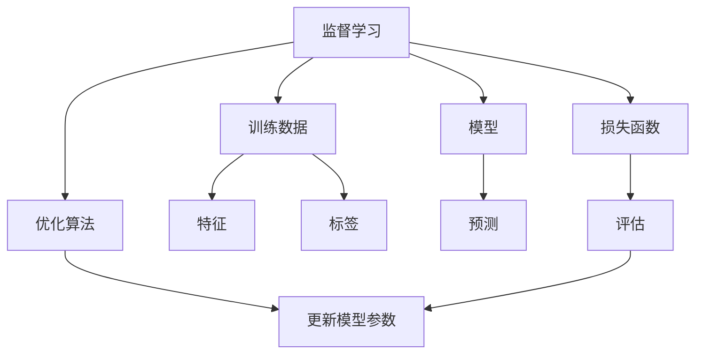

# 监督学习原理与代码实例讲解

## 1. 背景介绍

### 1.1 问题的由来

在人工智能和机器学习领域中,监督学习是最广泛应用和研究的一种学习范式。它旨在从标记的训练数据中学习一个模型,并将其应用于新的未标记数据。监督学习的问题源于我们希望机器能够从经验中学习,并对未来的情况做出准确的预测或决策。

### 1.2 研究现状

监督学习已经取得了巨大的成功,在图像识别、自然语言处理、推荐系统等诸多领域发挥着关键作用。随着数据量的不断增加和计算能力的提高,监督学习模型的性能也在不断提升。然而,监督学习也面临一些挑战,例如需要大量的标记数据、模型可解释性差以及对异常数据的鲁棒性不足等。

### 1.3 研究意义

深入理解监督学习的原理对于设计和优化机器学习模型至关重要。通过掌握核心算法和数学基础,我们可以更好地控制模型的行为,提高其准确性和可解释性。此外,实践中的代码实现也是将理论付诸实践的关键环节,有助于加深对监督学习的理解。

### 1.4 本文结构

本文将从以下几个方面全面介绍监督学习:

1. 核心概念与联系
2. 核心算法原理及具体操作步骤
3. 数学模型和公式的详细讲解及案例分析
4. 项目实践中的代码实例及详细解释
5. 实际应用场景
6. 工具和资源推荐
7. 未来发展趋势与挑战
8. 常见问题与解答

## 2. 核心概念与联系

监督学习的核心概念包括:

1. **训练数据**: 包含输入特征和相应标签的数据集,用于训练模型。
2. **模型**: 根据训练数据学习到的函数映射,用于对新数据进行预测或决策。
3. **损失函数**: 衡量模型预测与真实标签之间的差异,是优化的目标函数。
4. **优化算法**: 通过迭代调整模型参数,最小化损失函数,提高模型性能。

这些概念之间密切相关,构成了监督学习的基本框架。首先,我们需要获取高质量的训练数据,包括特征和标签。然后,选择合适的模型结构,并定义损失函数来衡量模型的性能。接下来,使用优化算法不断调整模型参数,最小化损失函数。最后,我们可以使用训练好的模型对新数据进行预测或决策。

## 3. 核心算法原理及具体操作步骤

### 3.1 算法原理概述

监督学习算法的核心思想是从训练数据中学习一个模型,使其能够对新的未标记数据做出准确的预测或决策。这个过程可以概括为以下几个步骤:

1. **数据预处理**: 对原始数据进行清洗、标准化等预处理,以提高数据质量。
2. **特征工程**: 从原始数据中提取有意义的特征,作为模型的输入。
3. **模型选择**: 根据问题的性质和数据的特点,选择合适的模型结构。
4. **模型训练**: 使用优化算法(如梯度下降)调整模型参数,最小化损失函数。
5. **模型评估**: 在保留的测试数据上评估模型的性能,确保其能够很好地泛化。
6. **模型调优**: 根据评估结果,调整模型超参数或特征,以提高模型性能。
7. **模型部署**: 将训练好的模型应用于实际场景,对新数据进行预测或决策。

### 3.2 算法步骤详解

以下是监督学习算法的具体步骤:

1. **获取数据集**: 首先,我们需要获取包含输入特征和相应标签的训练数据集。
2. **数据预处理**: 对数据进行清洗、标准化等预处理,处理缺失值、异常值等问题。
3. **数据分割**: 将数据集划分为训练集、验证集和测试集,用于模型训练、调优和评估。
4. **特征工程**: 从原始数据中提取有意义的特征,作为模型的输入。这可能涉及特征选择、特征提取等技术。
5. **模型选择**: 根据问题的性质和数据的特点,选择合适的模型结构,如线性模型、决策树、神经网络等。
6. **定义损失函数**: 选择合适的损失函数,用于衡量模型预测与真实标签之间的差异。
7. **模型训练**: 使用优化算法(如梯度下降)调整模型参数,最小化损失函数。这通常是一个迭代过程,每次更新参数后,都需要在验证集上评估模型性能。
8. **模型评估**: 在保留的测试数据集上评估模型的性能,计算相关指标如准确率、精确率、召回率等。
9. **模型调优**: 根据评估结果,调整模型超参数或特征,以提高模型性能。这可能涉及网格搜索、随机搜索等技术。
10. **模型部署**: 将训练好的模型应用于实际场景,对新数据进行预测或决策。

### 3.3 算法优缺点

监督学习算法的优点包括:

- 能够从数据中自动学习模式和规律,无需人工编写规则。
- 在许多任务上表现出色,如图像识别、自然语言处理等。
- 可以处理高维、复杂的数据,并发现隐藏的关系。
- 通过增加训练数据和计算资源,性能可以不断提高。

然而,监督学习算法也存在一些缺点:

- 需要大量的标记数据,标记过程耗时且昂贵。
- 模型的可解释性较差,难以解释内部决策过程。
- 对异常数据或分布偏移的鲁棒性不足。
- 存在过拟合和欠拟合的风险,需要进行适当的正则化。

### 3.4 算法应用领域

监督学习算法在许多领域都有广泛的应用,包括但不限于:

- **计算机视觉**: 图像分类、目标检测、语义分割等。
- **自然语言处理**: 文本分类、机器翻译、情感分析等。
- **推荐系统**: 个性化推荐、协同过滤等。
- **金融**: 信用评分、欺诈检测等。
- **医疗**: 疾病诊断、药物发现等。
- **语音识别**: 自动语音识别、语音合成等。

## 4. 数学模型和公式及详细讲解及举例说明

### 4.1 数学模型构建

在监督学习中,我们通常将问题建模为一个函数近似问题。给定一个训练数据集 $\mathcal{D} = \{(\mathbf{x}_i, y_i)\}_{i=1}^N$,其中 $\mathbf{x}_i$ 是输入特征向量,而 $y_i$ 是相应的标签或目标值。我们的目标是找到一个函数 $f: \mathcal{X} \rightarrow \mathcal{Y}$,使得对于任意新的输入 $\mathbf{x}$,函数 $f(\mathbf{x})$ 能够很好地近似其对应的标签 $y$。

这个函数 $f$ 通常由一个参数化的模型表示,例如线性模型或神经网络。我们将模型表示为 $f(\mathbf{x}; \boldsymbol{\theta})$,其中 $\boldsymbol{\theta}$ 是需要学习的模型参数。在训练过程中,我们希望找到一组参数值 $\boldsymbol{\theta}^*$,使得模型在训练数据上的性能最优。

为了衡量模型的性能,我们定义一个损失函数 $\mathcal{L}$,它测量了模型预测与真实标签之间的差异。对于回归问题,常用的损失函数是均方误差:

$$\mathcal{L}(\boldsymbol{\theta}) = \frac{1}{N} \sum_{i=1}^N (f(\mathbf{x}_i; \boldsymbol{\theta}) - y_i)^2$$

而对于分类问题,常用的损失函数是交叉熵:

$$\mathcal{L}(\boldsymbol{\theta}) = -\frac{1}{N} \sum_{i=1}^N \left[y_i \log f(\mathbf{x}_i; \boldsymbol{\theta}) + (1 - y_i) \log (1 - f(\mathbf{x}_i; \boldsymbol{\theta})) \right]$$

我们的目标是找到参数值 $\boldsymbol{\theta}^*$,使得损失函数 $\mathcal{L}(\boldsymbol{\theta}^*)$ 最小化:

$$\boldsymbol{\theta}^* = \arg\min_{\boldsymbol{\theta}} \mathcal{L}(\boldsymbol{\theta})$$

这通常是一个优化问题,可以使用梯度下降等优化算法来解决。

### 4.2 公式推导过程

在监督学习中,我们经常需要推导出一些重要的公式,以便更好地理解算法的原理和行为。以下是一个常见的公式推导过程:

考虑线性回归模型 $f(\mathbf{x}; \boldsymbol{\theta}) = \boldsymbol{\theta}^\top \mathbf{x}$,其中 $\boldsymbol{\theta}$ 是权重向量。我们使用均方误差作为损失函数:

$$\mathcal{L}(\boldsymbol{\theta}) = \frac{1}{N} \sum_{i=1}^N (f(\mathbf{x}_i; \boldsymbol{\theta}) - y_i)^2 = \frac{1}{N} \sum_{i=1}^N (\boldsymbol{\theta}^\top \mathbf{x}_i - y_i)^2$$

为了找到最小化损失函数的参数值 $\boldsymbol{\theta}^*$,我们需要计算损失函数相对于 $\boldsymbol{\theta}$ 的梯度,并使用梯度下降法进行优化。

首先,我们计算损失函数相对于 $\boldsymbol{\theta}$ 的梯度:

$$\begin{aligned}
\nabla_{\boldsymbol{\theta}} \mathcal{L}(\boldsymbol{\theta}) &= \frac{1}{N} \sum_{i=1}^N 2 (\boldsymbol{\theta}^\top \mathbf{x}_i - y_i) \mathbf{x}_i \
&= \frac{2}{N} \sum_{i=1}^N (\boldsymbol{\theta}^\top \mathbf{x}_i - y_i) \mathbf{x}_i \
&= \frac{2}{N} \mathbf{X}^\top (\mathbf{X} \boldsymbol{\theta} - \mathbf{y})
\end{aligned}$$

其中 $\mathbf{X}$ 是一个 $N \times d$ 的矩阵,每一行对应一个训练样本的特征向量 $\mathbf{x}_i$,而 $\mathbf{y}$ 是一个长度为 $N$ 的向量,包含所有训练样本的标签。

接下来,我们可以使用梯度下降法来更新参数:

$$\boldsymbol{\theta}_{t+1} = \boldsymbol{\theta}_t - \eta \nabla_{\boldsymbol{\theta}} \mathcal{L}(\boldsymbol{\theta}_t)$$

其中 $\eta$ 是学习率,控制每次更新的步长。

经过多次迭代,参数 $\boldsymbol{\theta}$ 将收敛到最小化损失函数的值 $\boldsymbol{\theta}^*$。

### 4.3 案例分析与讲解

让我们通过一个实际案例来更好地理解监督学习的原理和公式。假设我们有一个房价预测任务,目标是根据房屋的面积、房龄等特征来预测房屋的价格。我们将使用线性回归模型进行建模和训练。

给定一个训练数据集 $\mathcal{D} = \{(\mathbf{x}_i, y_i)\}_{i=1}^N$,其中 $\mathbf{x}_i = (x_i^{(1)}, x_i^{(2)})$ 分别表示第 $i$ 个房屋的面积和房龄,而 $y_i$ 表示