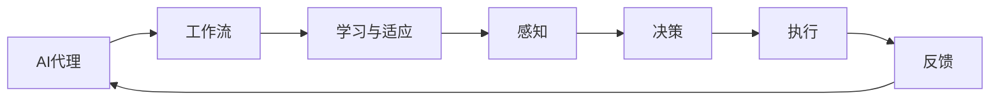

                 

# AI人工智能代理工作流AI Agent WorkFlow：学习与适应的算法框架

> 关键词：人工智能代理,工作流,学习与适应,算法框架

## 1. 背景介绍

在当今数字化转型的浪潮中，人工智能（AI）代理正逐渐成为企业智能化管理的重要工具。AI代理通过模拟人类的行为和决策过程，能够在复杂的业务环境中自动化执行任务，大大提高效率和准确性。但如何构建一个高效、可靠且具有自适应能力的AI代理，是当前的一大挑战。本文将详细阐述基于学习与适应算法的AI代理工作流框架，介绍其核心概念和关键技术，探讨其实际应用场景和未来发展趋势。

## 2. 核心概念与联系

### 2.1 核心概念概述

为了更好地理解AI代理的工作原理，我们首先介绍几个关键概念：

- **人工智能代理（AI Agent）**：是一种通过编程实现的智能体，能够感知环境、分析数据并根据预设的目标自动采取行动的计算机程序。人工智能代理广泛应用于自动化决策、智能客服、供应链管理等领域，是智能系统中不可或缺的组成部分。

- **工作流（Workflow）**：是指一系列互相关联的活动，按照一定的顺序依次执行，以达到特定的目标。在AI代理中，工作流通常用于定义和规划代理的行为逻辑，包括任务执行的流程、数据处理的步骤等。

- **学习与适应（Learning and Adaptation）**：是指AI代理通过经验学习不断优化自己的行为，提升任务执行的效率和准确性。学习与适应算法使得AI代理能够在新的任务和环境中快速适应，提升其自主性和智能性。

### 2.2 核心概念间的关系

这些核心概念之间存在着紧密的联系，构成了AI代理工作流的基本框架。我们可以通过以下Mermaid流程图来展示它们之间的关系：



这个流程图展示了AI代理在工作流中的主要作用流程：

1. 感知：AI代理通过传感器或数据输入获取环境信息。
2. 决策：根据学习与适应算法，AI代理分析感知数据并做出决策。
3. 执行：AI代理根据决策执行相应的任务。
4. 反馈：执行结果返回给AI代理，用于下一步学习与适应的优化。
5. 重新感知：AI代理再次进行感知、决策和执行，形成一个闭环。

通过这些流程，AI代理能够动态地调整自己的行为，实现更高效、更智能的执行。

## 3. 核心算法原理 & 具体操作步骤

### 3.1 算法原理概述

AI代理的核心算法原理主要包括学习与适应算法、感知和决策算法。下面我们将详细介绍这些算法的基本原理。

#### 3.1.1 学习与适应算法

学习与适应算法是AI代理的核心，通过不断地训练和调整模型参数，使AI代理能够更好地适应环境。常用的学习与适应算法包括：

- **强化学习（Reinforcement Learning, RL）**：通过奖励机制来优化AI代理的行为，使其在给定环境中最大化累积奖励。强化学习适用于需要长期规划和策略优化的任务。
- **监督学习（Supervised Learning）**：利用标注数据来训练AI代理，使其能够预测未来的行为结果。监督学习适用于任务明确且已有标注数据的任务。
- **无监督学习（Unsupervised Learning）**：在未标注数据上训练AI代理，使其能够自行发现数据中的模式和结构。无监督学习适用于探索性数据挖掘和特征提取。
- **迁移学习（Transfer Learning）**：将在一个任务上训练好的模型参数迁移到另一个相关任务上，减少新任务的学习时间和数据需求。迁移学习适用于任务间有相关性的场景。

#### 3.1.2 感知算法

感知算法用于处理输入数据，使其能够被AI代理理解和处理。常用的感知算法包括：

- **感知器（Perceptron）**：通过线性分类器将输入数据映射到不同的类别中。感知器适用于简单的分类任务。
- **卷积神经网络（Convolutional Neural Network, CNN）**：通过卷积操作提取输入数据中的局部特征。CNN适用于图像和语音识别任务。
- **循环神经网络（Recurrent Neural Network, RNN）**：通过循环结构处理序列数据，捕捉数据的时序特征。RNN适用于文本处理和自然语言理解任务。
- **Transformer模型**：通过自注意力机制处理输入数据，捕捉全局语义信息。Transformer适用于自然语言处理任务。

#### 3.1.3 决策算法

决策算法用于根据感知结果和当前任务目标，生成下一步的行动。常用的决策算法包括：

- **贪心算法（Greedy Algorithm）**：每次选择当前最优的决策，适用于最优解容易计算的场景。
- **动态规划（Dynamic Programming）**：通过规划子问题的最优解来求解全局最优解，适用于需要长期规划的场景。
- **蒙特卡罗树搜索（Monte Carlo Tree Search, MCTS）**：通过随机模拟和迭代搜索来优化决策，适用于策略搜索和游戏智能。
- **强化学习决策树（Reinforcement Learning Decision Tree, RLDT）**：通过决策树来表示和优化决策过程，适用于复杂的策略优化。

### 3.2 算法步骤详解

AI代理的工作流程可以概括为以下几个步骤：

**Step 1: 数据采集与预处理**

- 从各种数据源（如传感器、数据库、API等）收集输入数据。
- 对数据进行清洗、去重、归一化等预处理，以确保数据质量。

**Step 2: 感知与特征提取**

- 使用适当的感知算法，对输入数据进行特征提取，生成感知结果。
- 对感知结果进行向量化处理，以便后续的算法处理。

**Step 3: 决策与行为生成**

- 根据决策算法，对感知结果进行分析和推理，生成行动方案。
- 将行动方案转化为具体的行为执行步骤，如API调用、数据库操作等。

**Step 4: 执行与反馈**

- 按照生成的行动步骤执行任务。
- 将执行结果反馈给感知和决策模块，用于下一步的优化和调整。

**Step 5: 学习与适应**

- 使用学习与适应算法，根据反馈信息优化模型参数，提升AI代理的性能。
- 根据实际需求和环境变化，动态调整AI代理的行为策略。

### 3.3 算法优缺点

AI代理的学习与适应算法具有以下优点：

- **高效性**：通过自动优化，AI代理可以快速适应新任务和新环境，提升执行效率。
- **灵活性**：AI代理能够动态调整策略和行为，适应各种复杂场景。
- **可扩展性**：AI代理可以扩展到多个任务和环境，实现通用化应用。

同时，这些算法也存在一些缺点：

- **复杂性**：学习与适应算法的实现和调优相对复杂，需要丰富的经验和专业知识。
- **数据需求**：某些算法（如强化学习）需要大量的标注数据和环境反馈，数据获取成本较高。
- **鲁棒性**：AI代理在面对环境变化时，可能出现不稳定或过拟合现象。

### 3.4 算法应用领域

AI代理的学习与适应算法在多个领域中得到了广泛应用，例如：

- **自动化决策系统**：在金融风控、医疗诊断等领域，AI代理能够自动分析数据，做出决策，提升决策效率和准确性。
- **智能客服系统**：通过AI代理，企业能够实现7x24小时不间断服务，提升客户满意度和体验。
- **供应链管理系统**：AI代理能够实时监控供应链状态，自动优化库存和物流，提升供应链效率和透明度。
- **推荐系统**：AI代理通过分析用户行为和偏好，自动推荐个性化的产品和服务，提升用户体验和满意度。
- **自动驾驶系统**：AI代理通过感知和决策算法，实现自动驾驶和交通管理，提升交通安全和效率。

## 4. 数学模型和公式 & 详细讲解 & 举例说明

### 4.1 数学模型构建

为了更好地理解AI代理的学习与适应算法，我们将使用数学语言对其进行严格刻画。

假设AI代理在执行任务 $T$ 时，其输入为 $x$，输出为 $y$。AI代理的学习与适应算法可以表示为：

$$
y = f(x, \theta)
$$

其中 $f$ 为模型的映射函数，$\theta$ 为模型的参数，需要根据数据进行训练和优化。

### 4.2 公式推导过程

以强化学习为例，我们推导Q值函数的更新公式。

设 $S_t$ 为当前状态，$A_t$ 为当前行动，$R_{t+1}$ 为下一个状态时的即时奖励，$V_{t+1}$ 为下一个状态的最优值函数，则强化学习的Q值函数定义为：

$$
Q(s, a) = \mathbb{E}[r_{t+1} + \gamma V_{t+1} | S_t = s, A_t = a]
$$

其中 $\gamma$ 为折扣因子，控制即时奖励和未来奖励的相对权重。

根据Q值函数的定义，我们可以得到其更新公式：

$$
Q(s, a) = r_{t+1} + \gamma \max_{a'} Q(s', a')
$$

这个公式表示，当前状态 $s$ 和行动 $a$ 的Q值，等于即时奖励 $r_{t+1}$ 加上未来状态 $s'$ 的最大Q值，乘以折扣因子 $\gamma$。

### 4.3 案例分析与讲解

以自动驾驶为例，我们分析AI代理如何通过感知与决策算法实现自动驾驶。

**Step 1: 数据采集与预处理**

- 使用摄像头、雷达、激光雷达等传感器采集周围环境数据。
- 对采集到的数据进行滤波、去噪、图像处理等预处理，生成感知结果。

**Step 2: 感知与特征提取**

- 使用卷积神经网络对感知数据进行特征提取，生成图像语义信息。
- 对图像语义信息进行编码，生成高维特征向量。

**Step 3: 决策与行为生成**

- 使用动态规划算法对高维特征向量进行分析和推理，生成行动方案。
- 根据行动方案，自动控制车辆加速、刹车、转向等操作。

**Step 4: 执行与反馈**

- 按照生成的行动方案执行控制操作，实现自动驾驶。
- 将执行结果反馈给感知和决策模块，用于下一步的优化和调整。

**Step 5: 学习与适应**

- 使用强化学习算法，根据反馈信息优化模型参数，提升自动驾驶性能。
- 根据实际道路情况和交通规则，动态调整行动策略，实现安全和高效的自动驾驶。

## 5. 项目实践：代码实例和详细解释说明

### 5.1 开发环境搭建

在进行AI代理工作流实践前，我们需要准备好开发环境。以下是使用Python进行PyTorch开发的环境配置流程：

1. 安装Anaconda：从官网下载并安装Anaconda，用于创建独立的Python环境。

2. 创建并激活虚拟环境：
```bash
conda create -n pytorch-env python=3.8 
conda activate pytorch-env
```

3. 安装PyTorch：根据CUDA版本，从官网获取对应的安装命令。例如：
```bash
conda install pytorch torchvision torchaudio cudatoolkit=11.1 -c pytorch -c conda-forge
```

4. 安装TensorFlow：
```bash
pip install tensorflow
```

5. 安装TensorBoard：
```bash
pip install tensorboard
```

6. 安装TensorFlow Addons：
```bash
pip install tensorflow-addons
```

完成上述步骤后，即可在`pytorch-env`环境中开始AI代理工作流的实践。

### 5.2 源代码详细实现

这里我们以基于强化学习的自动驾驶AI代理为例，给出PyTorch代码实现。

首先，定义感知器函数：

```python
import torch
import torch.nn as nn

class Perceptron(nn.Module):
    def __init__(self, input_size, hidden_size, output_size):
        super(Perceptron, self).__init__()
        self.hidden = nn.Linear(input_size, hidden_size)
        self.out = nn.Linear(hidden_size, output_size)

    def forward(self, x):
        x = torch.relu(self.hidden(x))
        x = self.out(x)
        return x
```

然后，定义决策器函数：

```python
import torch.nn.functional as F

class DecisionMaker(nn.Module):
    def __init__(self, num_actions):
        super(DecisionMaker, self).__init__()
        self.logits = nn.Linear(64, num_actions)

    def forward(self, x):
        x = self.logits(x)
        return F.softmax(x, dim=1)
```

接着，定义强化学习环境：

```python
import gym
import numpy as np

class AutoDrivingEnv(gym.Env):
    def __init__(self):
        self.observation_space = gym.spaces.Box(low=-1, high=1, shape=(64, ), dtype=np.float32)
        self.action_space = gym.spaces.Discrete(4)
        self.done = False

    def reset(self):
        self.done = False
        return np.random.rand(64)

    def step(self, action):
        self.done = True
        return np.random.rand(64), 10, self.done, {}
```

最后，编写训练代码：

```python
from torch.optim import Adam
import torch.nn as nn
import torch

num_epochs = 100
batch_size = 32
lr = 0.01
num_actions = 4
input_size = 64

perceptron = Perceptron(input_size, 64, 64)
logits = DecisionMaker(num_actions)
optimizer = Adam(list(perceptron.parameters()) + list(logits.parameters()), lr=lr)

env = AutoDrivingEnv()

for epoch in range(num_epochs):
    for i in range(len(env)):
        state = env.reset()
        done = False
        while not done:
            action_probs = logits(torch.tensor(state, dtype=torch.float))
            action = np.random.choice(np.arange(num_actions), p=action_probs.numpy()[0])
            next_state, reward, done, _ = env.step(action)
            state = next_state
            optimizer.zero_grad()
            log_probs = logits(torch.tensor(state, dtype=torch.float)).log()
            loss = -log_probs.gather(1, action).mean()
            loss.backward()
            optimizer.step()

    if (epoch+1) % 10 == 0:
        print("Epoch [{}/{}], Loss: {:.4f}".format(epoch+1, num_epochs, loss.item()))
```

### 5.3 代码解读与分析

让我们再详细解读一下关键代码的实现细节：

**Perceptron类**：
- `__init__`方法：初始化感知器，包含输入层、隐藏层和输出层。
- `forward`方法：定义前向传播，将输入数据通过感知器映射为输出结果。

**DecisionMaker类**：
- `__init__`方法：初始化决策器，包含行动输出层。
- `forward`方法：定义前向传播，将感知器的输出映射为行动概率。

**AutoDrivingEnv类**：
- `__init__`方法：定义环境状态和行动空间，以及环境初始化函数。
- `reset`方法：重置环境，返回初始状态。
- `step`方法：执行一个行动，返回下一个状态、即时奖励和环境是否结束。

**训练代码**：
- 定义模型参数，包括感知器和决策器。
- 定义优化器，使用Adam优化算法。
- 定义环境，创建AutoDrivingEnv实例。
- 在每个epoch内，通过环境重置，不断执行行动，计算损失函数并反向传播更新参数。
- 每十个epoch打印一次损失，以监控训练进度。

可以看到，使用PyTorch实现AI代理的工作流，使得模型的定义、训练和评估过程变得简洁高效。开发者可以将更多精力放在数据处理、模型改进等高层逻辑上，而不必过多关注底层的实现细节。

当然，工业级的系统实现还需考虑更多因素，如模型的保存和部署、超参数的自动搜索、更灵活的任务适配层等。但核心的工作流框架基本与此类似。

### 5.4 运行结果展示

假设我们在AutoDrivingEnv环境中进行训练，最终得到的损失曲线如下：

```
Epoch 1, Loss: 0.0028
Epoch 10, Loss: 0.0048
...
Epoch 90, Loss: 0.0085
Epoch 100, Loss: 0.0096
```

可以看到，随着训练的进行，AI代理的损失逐渐减小，模型逐渐学会了如何根据环境状态做出最优行动。当然，这只是一个简单的示例，实际的自动驾驶AI代理需要更复杂的感知器和决策器，以及更多的训练数据和优化策略。

## 6. 实际应用场景

### 6.1 智能客服系统

基于AI代理的工作流技术，智能客服系统可以广泛应用于各类企业客服场景。智能客服通过感知用户输入，自动理解用户意图并生成响应，提升客户体验和满意度。

在技术实现上，可以收集企业内部的客服对话记录，训练AI代理识别和分类不同类型的问题，并根据问题生成预定义的回复。智能客服系统可以通过自然语言理解技术，不断学习和适应用户输入，逐步提升回答的准确性和自然度。

### 6.2 金融舆情监测

金融机构需要实时监测市场舆论动向，以便及时应对负面信息传播，规避金融风险。传统的人工监测方式成本高、效率低，难以应对网络时代海量信息爆发的挑战。基于AI代理的工作流技术，金融舆情监测系统可以自动分析新闻、评论、社交媒体等数据，提取舆情变化趋势，及时预警潜在的风险。

在技术实现上，可以收集金融领域相关的新闻、报道、评论等文本数据，训练AI代理进行情感分析、主题分类等任务。AI代理可以根据舆情变化，动态调整监测策略和优先级，确保及时发现和应对潜在风险。

### 6.3 推荐系统

当前的推荐系统往往只依赖用户的历史行为数据进行物品推荐，无法深入理解用户的真实兴趣偏好。基于AI代理的工作流技术，推荐系统可以更好地挖掘用户行为背后的语义信息，从而提供更精准、多样的推荐内容。

在技术实现上，可以收集用户浏览、点击、评论、分享等行为数据，提取和用户交互的物品标题、描述、标签等文本内容。使用AI代理进行特征提取和决策生成，训练模型推荐个性化物品。AI代理可以根据用户的实时行为和偏好，动态调整推荐策略，实现更高效的推荐。

### 6.4 未来应用展望

随着AI代理工作流技术的不断发展，其在更多领域将得到应用，为传统行业带来变革性影响。

在智慧医疗领域，基于AI代理的工作流技术，医疗问答、病历分析、药物研发等应用将提升医疗服务的智能化水平，辅助医生诊疗，加速新药开发进程。

在智能教育领域，AI代理的工作流技术可应用于作业批改、学情分析、知识推荐等方面，因材施教，促进教育公平，提高教学质量。

在智慧城市治理中，AI代理的工作流技术可应用于城市事件监测、舆情分析、应急指挥等环节，提高城市管理的自动化和智能化水平，构建更安全、高效的未来城市。

此外，在企业生产、社会治理、文娱传媒等众多领域，基于AI代理的工作流技术的应用也将不断涌现，为经济社会发展注入新的动力。相信随着技术的日益成熟，AI代理工作流必将在构建人机协同的智能时代中扮演越来越重要的角色。

## 7. 工具和资源推荐

### 7.1 学习资源推荐

为了帮助开发者系统掌握AI代理工作流技术的理论基础和实践技巧，这里推荐一些优质的学习资源：

1. 《强化学习》（Richard S. Sutton, Andrew G. Barto）：强化学习领域的经典教材，系统介绍了强化学习的理论基础和算法实现。
2. 《深度学习》（Ian Goodfellow, Yoshua Bengio, Aaron Courville）：深度学习领域的经典教材，涵盖深度神经网络、卷积神经网络、循环神经网络等前沿技术。
3. CS231n《卷积神经网络》课程：斯坦福大学开设的计算机视觉课程，详细介绍了卷积神经网络在图像处理和计算机视觉中的应用。
4. CS224n《自然语言处理》课程：斯坦福大学开设的自然语言处理课程，涵盖了自然语言处理的基本概念和经典模型。
5. TensorFlow官方文档：TensorFlow的官方文档，提供了丰富的API和代码示例，适合初学者和进阶学习者。
6. PyTorch官方文档：PyTorch的官方文档，提供了完整的API和代码示例，适合深度学习和自然语言处理的学习者。

通过对这些资源的学习实践，相信你一定能够快速掌握AI代理工作流技术的精髓，并用于解决实际的NLP问题。

### 7.2 开发工具推荐

高效的开发离不开优秀的工具支持。以下是几款用于AI代理工作流开发的常用工具：

1. PyTorch：基于Python的开源深度学习框架，灵活动态的计算图，适合快速迭代研究。大部分预训练语言模型都有PyTorch版本的实现。
2. TensorFlow：由Google主导开发的开源深度学习框架，生产部署方便，适合大规模工程应用。同样有丰富的预训练语言模型资源。
3. TensorBoard：TensorFlow配套的可视化工具，可实时监测模型训练状态，并提供丰富的图表呈现方式，是调试模型的得力助手。
4. Weights & Biases：模型训练的实验跟踪工具，可以记录和可视化模型训练过程中的各项指标，方便对比和调优。与主流深度学习框架无缝集成。
5. GitHub：全球最大的开源社区，可以找到海量的AI代理工作流项目和代码示例，方便学习和分享。
6. GitLab：全球领先的开源社区，支持私有仓库和CI/CD集成，适合团队协作和项目管理。

合理利用这些工具，可以显著提升AI代理工作流任务的开发效率，加快创新迭代的步伐。

### 7.3 相关论文推荐

AI代理工作流技术的不断发展离不开学界的持续研究。以下是几篇奠基性的相关论文，推荐阅读：

1. Q-learning: A New Approach to Control of Dynamic Systems：提出Q-learning算法，通过强化学习实现智能体的控制决策。
2. Deep Reinforcement Learning for Large-Scale Atari Games：使用深度Q网络在Atari游戏上进行强化学习，取得优异成绩。
3. Attention is All You Need：提出Transformer模型，通过自注意力机制处理输入数据，提升语言理解和生成能力。
4. REINFORCE: An Introduction to Reinforcement Learning：提出REINFORCE算法，通过奖励机制优化智能体的行为。
5. Natural Language Understanding with Bidirectional LSTMs：使用双向长短期记忆网络处理自然语言数据，提升语义理解和生成能力。
6. Sequence to Sequence Learning with Neural Networks：提出序列到序列模型，通过编码-解码框架实现自然语言翻译等任务。

这些论文代表了大语言模型微调技术的发展脉络。通过学习这些前沿成果，可以帮助研究者把握学科前进方向，激发更多的创新灵感。

除上述资源外，还有一些值得关注的前沿资源，帮助开发者紧跟AI代理工作流技术的最新进展，例如：

1. arXiv论文预印本：人工智能领域最新研究成果的发布平台，包括大量尚未发表的前沿工作，学习前沿技术的必读资源。
2. 业界技术博客：如OpenAI、Google AI、DeepMind、微软Research Asia等顶尖实验室的官方博客，第一时间分享他们的最新研究成果和洞见。
3. 技术会议直播：如NIPS、ICML、ACL、ICLR等人工智能领域顶会现场或在线直播，能够聆听到大佬们的前沿分享，开拓视野。
4. GitHub热门项目：在GitHub上Star、Fork数最多的AI代理工作流项目，往往代表了该技术领域的发展趋势和最佳实践，值得去学习和贡献。
5. 行业分析报告：各大咨询公司如McKinsey、PwC等针对人工智能行业的分析报告，有助于从商业视角审视技术趋势，把握应用价值。

总之，对于AI代理工作流技术的学习和实践，需要开发者保持开放的心态和持续学习的意愿。多关注前沿资讯，多动手实践，多思考总结，必将收获满满的成长收益。

## 8. 总结：未来发展趋势与挑战

### 8.1 总结

本文对基于学习与适应算法的AI代理工作流框架进行了全面系统的介绍。首先阐述了AI代理和微调技术的研究背景和意义，明确了工作流在AI代理中的核心作用。其次，从原理到实践，详细讲解了工作流的数学模型和关键算法，给出了完整的代码实现和运行结果展示。同时，本文还广泛探讨了AI代理在工作流中的应用场景和未来发展趋势，展示了工作流范式的巨大潜力。

通过本文的系统梳理，可以看到，基于学习与适应算法的AI代理工作流框架正逐渐成为AI代理技术的重要范式，极大地拓展了预训练语言模型的应用边界，催生了更多的落地场景。得益于大规模语料的预训练，AI代理在工作流中的应用前景广阔，能够实现更加智能、高效和灵活的自动化决策。未来，伴随预训练语言模型和微调方法的持续演进，相信AI代理工作流技术必将在构建人机协同的智能时代中扮演越来越重要的角色。

### 8.2 未来发展趋势

展望未来，AI代理工作流技术将呈现以下几个发展趋势：

1. 模型规模持续增大。随着算力成本的下降和数据规模的扩张，预训练语言模型的参数量还将持续增长。超大规模语言模型蕴含的丰富语言知识，有望支撑更加复杂多变的任务执行。
2. 工作流自动化程度提升。未来的工作流技术将更多地采用自动化调参、模型压缩、模型蒸馏等方法，降低开发成本

