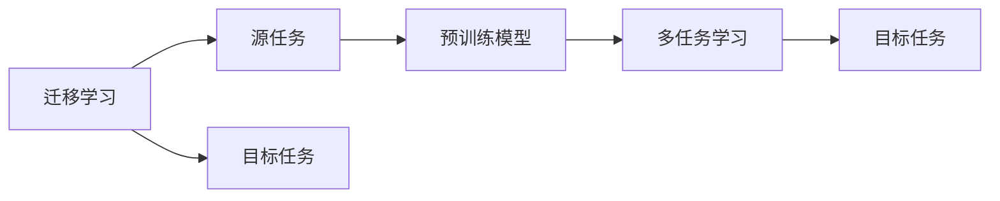
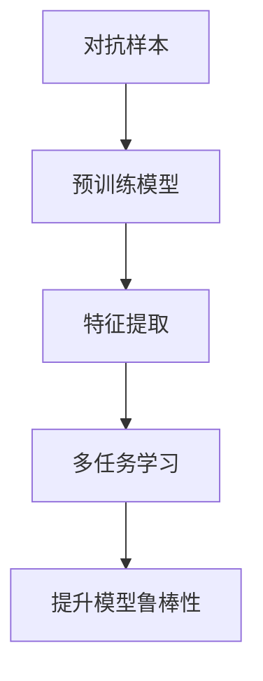
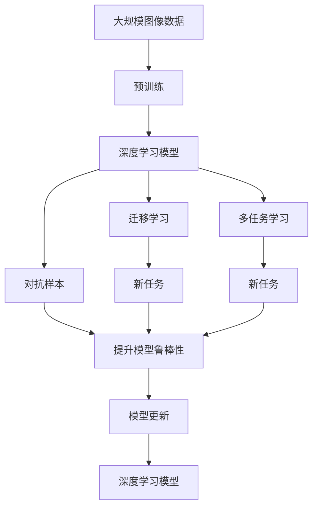

                 

# AI人工智能深度学习算法：在图像识别的应用

> 关键词：深度学习算法,图像识别,卷积神经网络(CNN),特征提取,迁移学习,ImageNet

## 1. 背景介绍

### 1.1 问题由来
随着深度学习技术的快速发展，计算机视觉（Computer Vision, CV）领域也取得了令人瞩目的进展。其中，图像识别作为CV领域的一项基础任务，已经在众多应用场景中得到了广泛应用，如图像分类、目标检测、人脸识别、医学影像分析等。深度学习算法，尤其是卷积神经网络（Convolutional Neural Networks, CNNs），因其强大的特征提取和模式识别能力，成为了图像识别任务的主流技术。

然而，尽管深度学习算法在图像识别任务上表现出色，但仍面临着数据需求大、训练时间长、模型复杂等问题。如何在保证模型性能的同时，降低对数据和计算资源的需求，成为当前图像识别领域的重要研究方向。

### 1.2 问题核心关键点
针对上述问题，深度学习领域提出了一种基于迁移学习的图像识别方法。该方法利用预训练模型在大型数据集上的学习结果，将知识迁移到新的任务或数据集上，从而在小样本数据集上也能取得较好的识别效果。这一方法不仅提升了模型效率，还减少了对大规模数据的需求，成为了图像识别任务中一种高效且有效的技术手段。

为了更好地理解迁移学习在图像识别中的应用，我们还需要掌握几个核心概念：

- 预训练模型：通过在大规模数据集上无监督学习得到的模型，可以学习到通用的特征表示。
- 迁移学习：利用预训练模型的知识，将通用特征迁移到新的任务或数据集上，以提升识别效果。
- 特征提取：深度学习模型的核心能力之一，通过层级化的卷积操作，提取图像中的高级特征，供下游任务使用。
- 多任务学习：在训练过程中，同时优化多个相关任务，增强模型泛化能力和迁移能力。
- 对抗样本：经过精心构造的输入样本，能够在模型上进行误分类，用于增强模型的鲁棒性。

### 1.3 问题研究意义
研究迁移学习在图像识别中的应用，对于提升模型的泛化能力、优化资源利用率、加速技术落地具有重要意义：

1. 提升模型泛化能力：迁移学习可以利用预训练模型的知识，在大规模数据集上学习到更强的特征表示，从而提升模型在新数据集上的泛化性能。
2. 优化资源利用率：预训练模型可以在大规模数据集上学习，节省了大量计算资源和时间成本，同时还能在新的数据集上进行高效微调。
3. 加速技术落地：迁移学习简化了模型的训练过程，缩短了从预训练到微调的时间，加速了新技术的推广和应用。
4. 推动技术创新：迁移学习的思想可以拓展到其他领域，推动计算机视觉以外的技术创新，如自然语言处理（NLP）中的预训练语言模型。

## 2. 核心概念与联系

### 2.1 核心概念概述

为了更好地理解迁移学习在图像识别中的应用，我们需要先掌握几个密切相关的核心概念：

- 深度学习：利用神经网络模型进行特征学习的一种机器学习方法，通过多层非线性变换，逐步提取输入数据的高级特征。
- 卷积神经网络（CNNs）：一种特殊的神经网络结构，通过卷积操作提取图像的空间局部特征，适用于处理二维图像数据。
- 迁移学习：通过将预训练模型的知识迁移到新的任务或数据集上，提升模型在新数据上的性能。
- 特征提取：深度学习模型的核心能力之一，通过层级化的卷积操作，提取图像中的高级特征，供下游任务使用。
- 多任务学习：在训练过程中，同时优化多个相关任务，增强模型泛化能力和迁移能力。
- 对抗样本：经过精心构造的输入样本，能够在模型上进行误分类，用于增强模型的鲁棒性。

这些概念之间存在着紧密的联系，形成了一个完整的图像识别技术生态系统。下面我们通过一个Mermaid流程图来展示这些概念之间的关系：

```mermaid
graph TB
    A[深度学习] --> B[卷积神经网络(CNN)]
    B --> C[特征提取]
    A --> D[迁移学习]
    C --> E[多任务学习]
    D --> F[迁移学习]
    F --> G[多任务学习]
    C --> H[对抗样本]
    H --> I[提升模型鲁棒性]
```

这个流程图展示了深度学习、CNN、特征提取、迁移学习、多任务学习以及对抗样本之间的关系：

1. 深度学习模型中的CNNs通过卷积操作提取图像的空间局部特征，这是图像识别的核心能力。
2. 迁移学习利用预训练模型的知识，将通用特征迁移到新的任务或数据集上，提升模型在新数据上的性能。
3. 多任务学习在训练过程中同时优化多个相关任务，增强模型泛化能力和迁移能力。
4. 对抗样本通过精心构造的输入样本，提升模型的鲁棒性，使其更难受到攻击和干扰。

### 2.2 概念间的关系

这些核心概念之间存在着紧密的联系，形成了一个完整的图像识别技术生态系统。下面我们通过几个Mermaid流程图来展示这些概念之间的关系。

#### 2.2.1 深度学习和CNN的关系

```mermaid
graph TB
    A[深度学习] --> B[卷积神经网络(CNN)]
    B --> C[特征提取]
    C --> D[多任务学习]
```

这个流程图展示了深度学习中的CNN通过卷积操作提取图像的空间局部特征，并结合多任务学习提升模型性能。

#### 2.2.2 迁移学习与多任务学习的关系



这个流程图展示了迁移学习的基本原理，以及它与多任务学习的关系。迁移学习涉及源任务和目标任务，预训练模型在源任务上学习，然后通过多任务学习适应各种目标任务。

#### 2.2.3 对抗样本的利用



这个流程图展示了对抗样本通过预训练模型提取特征，然后通过多任务学习提升模型鲁棒性的过程。

### 2.3 核心概念的整体架构

最后，我们用一个综合的流程图来展示这些核心概念在图像识别技术中的整体架构：



这个综合流程图展示了从预训练到迁移学习、多任务学习、对抗样本，再到模型更新的完整过程。深度学习模型通过预训练学习到通用特征，然后通过迁移学习将知识迁移到新任务上，结合多任务学习和对抗样本提升模型鲁棒性，最后不断更新模型以适应新任务和数据。 通过这些流程图，我们可以更清晰地理解图像识别技术中各个核心概念的关系和作用，为后续深入讨论具体的图像识别方法和技术奠定基础。

## 3. 核心算法原理 & 具体操作步骤
### 3.1 算法原理概述

迁移学习在图像识别中的应用，本质上是一种通过预训练模型知识提升新任务性能的方法。其核心思想是：利用在大规模数据集上预训练的模型，提取通用特征，然后迁移这些特征到新的任务或数据集上，从而提升模型在新数据上的识别能力。

形式化地，假设预训练模型为 $M_{\theta}$，其中 $\theta$ 为预训练得到的模型参数。给定目标图像识别任务 $T$ 的数据集 $D=\{(x_i,y_i)\}_{i=1}^N, x_i \in \mathcal{X}, y_i \in \mathcal{Y}$，迁移学习的优化目标是最小化模型在新数据集上的损失函数 $\mathcal{L}(M_{\theta},D)$，使得模型在新数据上也能取得理想的性能。

通过梯度下降等优化算法，迁移过程不断更新模型参数 $\theta$，最小化损失函数 $\mathcal{L}$，使得模型在新数据上逼近最优的识别效果。由于 $\theta$ 已经通过预训练获得了较好的初始化，因此即便在小样本数据集 $D$ 上进行迁移，也能较快收敛到理想模型参数 $\hat{\theta}$。

### 3.2 算法步骤详解

迁移学习在图像识别中的应用，一般包括以下几个关键步骤：

**Step 1: 准备预训练模型和数据集**
- 选择合适的预训练图像识别模型 $M_{\theta}$ 作为初始化参数，如ResNet、Inception等。
- 准备目标图像识别任务 $T$ 的标注数据集 $D$，划分为训练集、验证集和测试集。一般要求标注数据与预训练数据的分布不要差异过大。

**Step 2: 加载并微调预训练模型**
- 使用预训练模型的权重作为初始化，载入到深度学习框架中。
- 冻结模型前几层权重，只训练顶层分类器或解码器，以减少模型参数量，加快收敛速度。
- 使用目标任务的标注数据集，以较小的学习率更新顶层参数，最小化目标任务的损失函数。

**Step 3: 添加任务适配层**
- 根据目标任务类型，在预训练模型顶层设计合适的输出层和损失函数。
- 对于分类任务，通常在顶层添加线性分类器和交叉熵损失函数。
- 对于生成任务，通常使用语言模型的解码器输出概率分布，并以负对数似然为损失函数。

**Step 4: 设置迁移超参数**
- 选择合适的优化算法及其参数，如 AdamW、SGD 等，设置学习率、批大小、迭代轮数等。
- 设置正则化技术及强度，包括权重衰减、Dropout、Early Stopping等。
- 确定冻结预训练参数的策略，如仅微调顶层，或全部参数都参与迁移。

**Step 5: 执行迁移训练**
- 将训练集数据分批次输入模型，前向传播计算损失函数。
- 反向传播计算参数梯度，根据设定的优化算法和学习率更新模型参数。
- 周期性在验证集上评估模型性能，根据性能指标决定是否触发 Early Stopping。
- 重复上述步骤直到满足预设的迭代轮数或 Early Stopping 条件。

**Step 6: 测试和部署**
- 在测试集上评估迁移后模型 $M_{\hat{\theta}}$ 的性能，对比迁移前后的精度提升。
- 使用迁移后的模型对新样本进行推理预测，集成到实际的应用系统中。
- 持续收集新的数据，定期重新迁移模型，以适应数据分布的变化。

以上是迁移学习在图像识别中的一般流程。在实际应用中，还需要针对具体任务的特点，对迁移过程的各个环节进行优化设计，如改进训练目标函数，引入更多的正则化技术，搜索最优的超参数组合等，以进一步提升模型性能。

### 3.3 算法优缺点

迁移学习在图像识别中的应用，具有以下优点：

1. 简单高效。通过预训练模型知识迁移，可以显著提升模型在新任务上的识别性能，同时节省了大量标注数据的需求。
2. 通用适用。适用于各种图像识别任务，包括分类、检测、分割等，设计简单的任务适配层即可实现迁移。
3. 效果显著。在学术界和工业界的诸多任务上，迁移学习方法已经刷新了多项SOTA。
4. 参数高效。利用参数高效迁移技术，在固定大部分预训练参数的情况下，仍可取得不错的迁移效果。
5. 快速部署。预训练模型通常已经在大规模数据集上学习，可以加速迁移过程。

同时，该方法也存在一定的局限性：

1. 依赖标注数据。迁移效果很大程度上取决于目标任务的标注数据的质量和数量，获取高质量标注数据的成本较高。
2. 迁移能力有限。当目标任务与预训练数据的分布差异较大时，迁移的性能提升有限。
3. 负面效果传递。预训练模型的固有偏见、有害信息等，可能通过迁移传递到目标任务，造成负面影响。
4. 可解释性不足。迁移模型的决策过程通常缺乏可解释性，难以对其推理逻辑进行分析和调试。
5. 跨领域迁移难度大。迁移学习在不同领域之间的应用，如从医学影像到通用图像分类，仍存在较大挑战。

尽管存在这些局限性，但就目前而言，迁移学习方法仍然是最主流范式。未来相关研究的重点在于如何进一步降低迁移对标注数据的依赖，提高模型的少样本学习和跨领域迁移能力，同时兼顾可解释性和伦理安全性等因素。

### 3.4 算法应用领域

迁移学习在图像识别中的应用，已经得到了广泛的应用，覆盖了几乎所有常见任务，例如：

- 图像分类：将输入图像映射到预定义的类别标签上，如CIFAR-10、ImageNet等。
- 目标检测：在图像中定位和识别特定物体，如PASCAL VOC、COCO等。
- 图像分割：将图像划分为不同的像素或区域，如PASCAL VOC、Cityscapes等。
- 人脸识别：识别图像中的人脸并进行验证，如LFW、CelebA等。
- 医学影像分析：从医学影像中检测和分类病变区域，如MRI、CT等。
- 视频行为分析：从视频中识别和跟踪人物行为，如UCF101、HMDB51等。

除了上述这些经典任务外，迁移学习方法也被创新性地应用到更多场景中，如可控图像生成、图像风格转换、图像去噪等，为图像识别技术带来了全新的突破。随着预训练模型和迁移方法的不断进步，相信图像识别技术将在更广阔的应用领域大放异彩。

## 4. 数学模型和公式 & 详细讲解 & 举例说明

### 4.1 数学模型构建

本节将使用数学语言对迁移学习在图像识别中的应用进行更加严格的刻画。

记预训练图像识别模型为 $M_{\theta}$，其中 $\theta$ 为预训练得到的模型参数。假设目标图像识别任务为 $T$，其训练集为 $D=\{(x_i,y_i)\}_{i=1}^N, x_i \in \mathcal{X}, y_i \in \mathcal{Y}$。

定义模型 $M_{\theta}$ 在数据样本 $(x,y)$ 上的损失函数为 $\ell(M_{\theta}(x),y)$，则在数据集 $D$ 上的经验风险为：

$$
\mathcal{L}(\theta) = \frac{1}{N} \sum_{i=1}^N \ell(M_{\theta}(x_i),y_i)
$$

迁移学习的优化目标是最小化模型在新数据集上的损失函数，即找到最优参数：

$$
\theta^* = \mathop{\arg\min}_{\theta} \mathcal{L}(\theta)
$$

在实践中，我们通常使用基于梯度的优化算法（如SGD、Adam等）来近似求解上述最优化问题。设 $\eta$ 为学习率，$\lambda$ 为正则化系数，则参数的更新公式为：

$$
\theta \leftarrow \theta - \eta \nabla_{\theta}\mathcal{L}(\theta) - \eta\lambda\theta
$$

其中 $\nabla_{\theta}\mathcal{L}(\theta)$ 为损失函数对参数 $\theta$ 的梯度，可通过反向传播算法高效计算。

### 4.2 公式推导过程

以下我们以二分类任务为例，推导交叉熵损失函数及其梯度的计算公式。

假设模型 $M_{\theta}$ 在输入 $x$ 上的输出为 $\hat{y}=M_{\theta}(x) \in [0,1]$，表示样本属于正类的概率。真实标签 $y \in \{0,1\}$。则二分类交叉熵损失函数定义为：

$$
\ell(M_{\theta}(x),y) = -[y\log \hat{y} + (1-y)\log (1-\hat{y})]
$$

将其代入经验风险公式，得：

$$
\mathcal{L}(\theta) = -\frac{1}{N}\sum_{i=1}^N [y_i\log M_{\theta}(x_i)+(1-y_i)\log(1-M_{\theta}(x_i))]
$$

根据链式法则，损失函数对参数 $\theta_k$ 的梯度为：

$$
\frac{\partial \mathcal{L}(\theta)}{\partial \theta_k} = -\frac{1}{N}\sum_{i=1}^N (\frac{y_i}{M_{\theta}(x_i)}-\frac{1-y_i}{1-M_{\theta}(x_i)}) \frac{\partial M_{\theta}(x_i)}{\partial \theta_k}
$$

其中 $\frac{\partial M_{\theta}(x_i)}{\partial \theta_k}$ 可进一步递归展开，利用自动微分技术完成计算。

在得到损失函数的梯度后，即可带入参数更新公式，完成模型的迭代优化。重复上述过程直至收敛，最终得到适应目标任务的最优模型参数 $\theta^*$。

### 4.3 案例分析与讲解

以医学影像分类任务为例，展示迁移学习的具体应用流程：

**Step 1: 准备预训练模型和数据集**

1. 选择合适的预训练图像识别模型 $M_{\theta}$，如Inception或ResNet。
2. 准备医学影像分类任务的标注数据集 $D$，划分为训练集、验证集和测试集。一般要求标注数据与预训练数据的分布不要差异过大。

**Step 2: 加载并微调预训练模型**

1. 使用预训练模型的权重作为初始化，载入到深度学习框架中。
2. 冻结模型前几层权重，只训练顶层分类器或解码器，以减少模型参数量，加快收敛速度。
3. 使用医学影像分类任务的标注数据集，以较小的学习率更新顶层参数，最小化医学影像分类任务的损失函数。

**Step 3: 添加任务适配层**

1. 根据医学影像分类任务类型，在预训练模型顶层设计合适的输出层和损失函数。
2. 对于分类任务，通常在顶层添加线性分类器和交叉熵损失函数。
3. 对于生成任务，通常使用语言模型的解码器输出概率分布，并以负对数似然为损失函数。

**Step 4: 设置迁移超参数**

1. 选择合适的优化算法及其参数，如 AdamW、SGD 等，设置学习率、批大小、迭代轮数等。
2. 设置正则化技术及强度，包括权重衰减、Dropout、Early Stopping等。
3. 确定冻结预训练参数的策略，如仅微调顶层，或全部参数都参与迁移。

**Step 5: 执行迁移训练**

1. 将医学影像分类任务的训练集数据分批次输入模型，前向传播计算损失函数。
2. 反向传播计算参数梯度，根据设定的优化算法和学习率更新模型参数。
3. 周期性在验证集上评估模型性能，根据性能指标决定是否触发 Early Stopping。
4. 重复上述步骤直到满足预设的迭代轮数或 Early Stopping 条件。

**Step 6: 测试和部署**

1. 在医学影像分类任务的测试集上评估迁移后模型 $M_{\hat{\theta}}$ 的性能，对比迁移前后的精度提升。
2. 使用迁移后的模型对新医学影像进行推理预测，集成到实际的应用系统中。
3. 持续收集新的医学影像数据，定期重新迁移模型，以适应数据分布的变化。

通过以上步骤，即可在医学影像分类任务中应用迁移学习方法，提升模型在新数据上的识别性能。需要注意的是，医学影像任务的标注数据往往稀缺且昂贵，因此迁移学习可以在一定程度上缓解这一问题，减少标注数据的依赖。

## 5. 项目实践：代码实例和详细解释说明

### 5.1 开发环境搭建

在进行迁移学习实践前，我们需要准备好开发环境。以下是使用Python进行PyTorch开发的环境配置流程：

1. 安装Anaconda：从官网下载并安装Anaconda，用于创建独立的Python环境。

2. 创建并激活虚拟环境：
```bash
conda create -n pytorch-env python=3.8 
conda activate pytorch-env
```

3. 安装PyTorch：根据CUDA版本，从官网获取对应的安装命令。例如：
```bash
conda install pytorch torchvision torchaudio cudatoolkit=11.1 -c pytorch -c conda-forge
```

4. 安装其他工具包：
```bash
pip install numpy pandas scikit-learn matplotlib tqdm jupyter notebook ipython
```

完成上述步骤后，即可在`pytorch-env`环境中开始迁移学习实践。

### 5.2 源代码详细实现

下面我们以医学影像分类任务为例，给出使用PyTorch进行迁移学习的PyTorch代码实现。

首先，定义医学影像分类任务的数据处理函数：

```python
import torch
from torch.utils.data import Dataset
from torchvision import transforms
import torchvision.datasets as datasets

class MedicalImageDataset(Dataset):
    def __init__(self, image_folder, transform=None):
        self.image_folder = image_folder
        self.transform = transform
        
        # 读取医学影像文件列表
        self.image_names = [i for i in os.listdir(self.image_folder) if i.endswith('.png')]
        
    def __len__(self):
        return len(self.image_names)
    
    def __getitem__(self, item):
        img_path = os.path.join(self.image_folder, self.image_names[item])
        img = Image.open(img_path)
        
        if self.transform is not None:
            img = self.transform(img)
        
        label = int(os.path.basename(img_path).split('_')[0])  # 从文件名中提取标签
        
        return {'img': img, 'label': label}
```

然后，定义迁移模型的函数：

```python
import torch.nn as nn
import torch.nn.functional as F

class MedicalImageClassifier(nn.Module):
    def __init__(self, in_channels=3, num_classes=10):
        super(MedicalImageClassifier, self).__init__()
        
        # 顶层分类器
        self.fc = nn.Linear(512, num_classes)
        
        # 输出层
        self.softmax = nn.Softmax(dim=1)
        
    def forward(self, x):
        x = x.view(x.size(0), -1)  # 将特征图展平
        x = self.fc(x)  # 线性层
        x = self.softmax(x)  # 输出层
        
        return x
```

接着，定义迁移学习的训练函数：

```python
import torch.optim as optim
from torch.utils.data import DataLoader

def train_epoch(model, dataset, optimizer, device, criterion):
    dataloader = DataLoader(dataset, batch_size=64, shuffle=True)
    
    model.train()
    epoch_loss = 0
    for batch in dataloader:
        inputs = batch['img'].to(device)
        labels = batch['label'].to(device)
        
        optimizer.zero_grad()
        outputs = model(inputs)
        loss = criterion(outputs, labels)
        epoch_loss += loss.item()
        loss.backward()
        optimizer.step()
        
    return epoch_loss / len(dataloader)

def evaluate(model, dataset, device, criterion):
    dataloader = DataLoader(dataset, batch_size=64)
    
    model.eval()
    correct = 0
    total = 0
    with torch.no_grad():
        for batch in dataloader:
            inputs = batch['img'].to(device)
            labels = batch['label'].to(device)
            
            outputs = model(inputs)
            _, predicted = torch.max(outputs, 1)
            total += labels.size(0)
            correct += (predicted == labels).sum().item()
            
    print('Accuracy of the network on the 10000 test images: %0.5f %%' % (100 * correct / total))
```

最后，启动迁移学习流程：

```python
device = torch.device('cuda' if torch.cuda.is_available() else 'cpu')
model = MedicalImageClassifier(in_channels=3, num_classes=10).to(device)
criterion = nn.CrossEntropyLoss()

# 加载预训练模型的权重
pretrained_model = torchvision.models.resnet18(pretrained=True)
model.fc.load_state_dict(pretrained_model.fc.state_dict())
model.fc = nn.Linear(512, 10)

# 设置迁移超参数
optimizer = optim.Adam(model.parameters(), lr=1e-4)
scheduler = optim.lr_scheduler.StepLR(optimizer, step_size=10, gamma=0.1)

# 加载数据集
train_dataset = MedicalImageDataset('train', transforms.Compose([
    transforms.Resize(256),
    transforms.CenterCrop(224),
    transforms.ToTensor(),
    transforms.Normalize(mean=[0.485, 0.456, 0.406], std=[0.229, 0.224, 0.225])
]))
test_dataset = MedicalImageDataset('test', transforms.Compose([
    transforms.Resize(256),
    transforms.CenterCrop(224),
    transforms.ToTensor(),
    transforms.Normalize(mean=[0.485, 0.456, 0.406], std=[0.229, 0.224, 0.225])
]))

# 训练模型
for epoch in range(30):
    loss = train_epoch(model, train_dataset, optimizer, device, criterion)
    print('Epoch {}/30, train loss: {:.4f}'.format(epoch + 1

