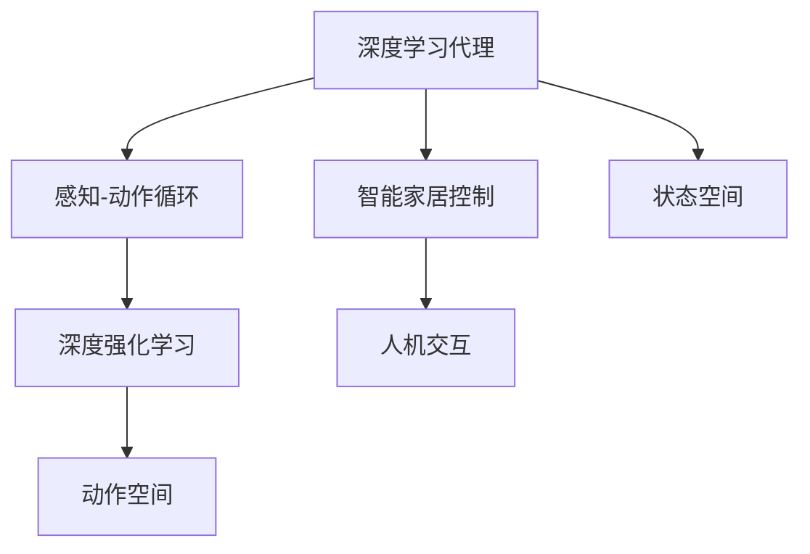
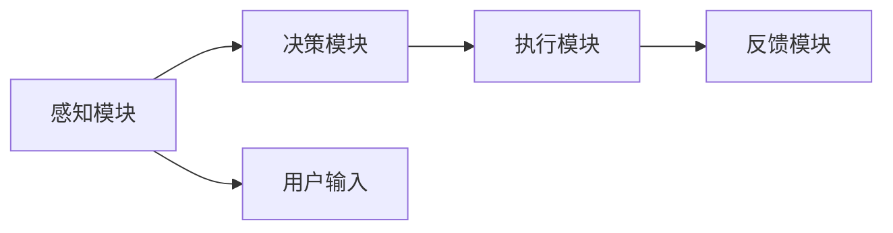
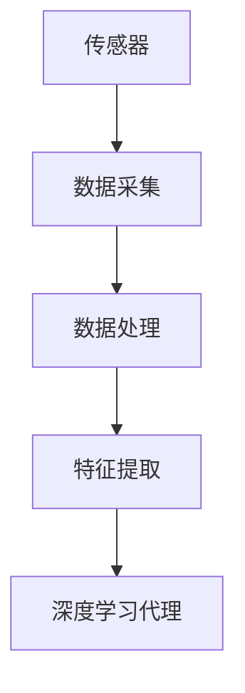
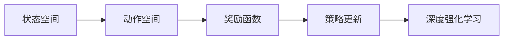

                 

# AI人工智能深度学习算法：智能深度学习代理在智能家居场景中的应用

> 关键词：智能家居,深度学习代理,智能家居控制,人工智能,机器学习,智能家居自动化,深度强化学习

## 1. 背景介绍

### 1.1 问题由来
智能家居（Smart Home），是指通过互联网和智能设备，实现家庭生活的自动化、智能化和信息化。传统的家居控制模式繁琐且受时间和地点限制，用户体验差。利用深度学习代理（Deep Learning Agent）可以实时感知家居环境，自动地做出最优决策，提高家居生活的便利性和舒适性。

近年来，随着人工智能技术的飞速发展，智能家居领域涌现出大量智能化产品，如智能音箱、智能锁、智能灯光、智能窗帘等。这些产品通过深度学习算法实现了环境感知和行为决策的自动化。本文将重点介绍智能深度学习代理在智能家居场景中的应用，探讨其原理和算法，并给出实践指南。

### 1.2 问题核心关键点
智能家居的深度学习代理，其核心关键点在于：
- 深度学习算法：通过多层神经网络结构，实现对家居环境的智能感知和决策。
- 智能家居控制：利用自动化控制技术，实现对家居设备的精准操控。
- 人机交互：通过语音、文本等自然语言交互方式，实现智能家居的便捷化操作。
- 数据驱动：依赖于大规模数据训练，以提升智能决策的准确性。

这些关键点共同构成了智能家居中深度学习代理的完整框架，实现了从感知到决策的全流程自动化。

## 2. 核心概念与联系

### 2.1 核心概念概述

为更好地理解智能家居中深度学习代理的应用，本节将介绍几个密切相关的核心概念：

- 深度学习代理（Deep Learning Agent）：基于深度神经网络模型，自主学习家居环境变化，并根据用户的输入做出智能决策的代理。
- 感知-动作循环（Perception-Action Loop）：深度学习代理在感知家居环境变化后，立即做出最优决策，然后执行决策，再次感知环境变化的过程。
- 强化学习（Reinforcement Learning, RL）：一种通过奖励与惩罚，引导智能代理不断调整行为策略，实现最优决策的机器学习方法。
- 动作空间（Action Space）：智能家居设备可执行的动作集合，如开灯、关灯、调节温度等。
- 状态空间（State Space）：家居环境的当前状态，如温度、湿度、光照强度等。
- 深度强化学习（Deep Reinforcement Learning, DRL）：将深度学习技术与强化学习结合，在状态空间和动作空间中寻找最优决策。

这些核心概念之间的逻辑关系可以通过以下Mermaid流程图来展示：



这个流程图展示了智能家居中深度学习代理的核心概念及其之间的关系：

1. 深度学习代理通过感知家居环境，利用深度强化学习进行决策。
2. 智能家居控制根据决策结果执行相应动作。
3. 人机交互通过自然语言方式，获取用户输入，并反馈决策结果。
4. 状态空间和动作空间是智能代理进行决策的基础。

### 2.2 概念间的关系

这些核心概念之间存在着紧密的联系，形成了智能家居深度学习代理的完整生态系统。下面我通过几个Mermaid流程图来展示这些概念之间的关系。

#### 2.2.1 智能家居系统架构



这个流程图展示了智能家居系统的整体架构，包含感知、决策、执行和反馈四个关键模块。

#### 2.2.2 感知模块的工作原理



感知模块通过传感器采集家居环境数据，经过数据处理和特征提取后，输入到深度学习代理中进行环境感知。

#### 2.2.3 决策模块的决策过程



决策模块利用状态空间和动作空间，通过深度强化学习算法，不断优化策略，做出最优决策。

## 3. 核心算法原理 & 具体操作步骤
### 3.1 算法原理概述

智能家居中的深度学习代理，主要基于深度强化学习算法。其核心思想是通过感知家居环境，利用状态空间和动作空间，不断调整行为策略，实现智能家居的自动化控制。

形式化地，假设智能家居的当前状态为 $s_t$，对应的动作为 $a_t$，则状态-动作对 $(s_t, a_t)$ 满足以下关系：

$$
\max_{a_t} R(s_t, a_t) + \gamma \max_{a_{t+1}} R(s_{t+1}, a_{t+1})
$$

其中 $R$ 为奖励函数，$\gamma$ 为折扣因子。目标是最小化总奖励，即：

$$
\min_{\theta} J(\theta) = \sum_t R(s_t, a_t)
$$

在实践中，我们通常使用基于梯度的优化算法（如SGD、Adam等）来近似求解上述最优化问题。设 $\eta$ 为学习率，则参数的更新公式为：

$$
\theta \leftarrow \theta - \eta \nabla_{\theta}J(\theta)
$$

其中 $\nabla_{\theta}J(\theta)$ 为损失函数对参数 $\theta$ 的梯度，可通过反向传播算法高效计算。

### 3.2 算法步骤详解

智能家居深度学习代理的开发一般包括以下几个关键步骤：

**Step 1: 定义状态空间和动作空间**
- 收集家居环境的传感器数据，定义状态空间 $S=\{s_1, s_2, \cdots, s_n\}$。
- 定义动作空间 $A=\{a_1, a_2, \cdots, a_m\}$，其中 $a_i$ 表示执行第 $i$ 个动作。

**Step 2: 搭建深度神经网络模型**
- 选择适合的状态空间和动作空间，搭建深度神经网络模型。常用的网络结构包括卷积神经网络（CNN）、循环神经网络（RNN）等。
- 定义网络输入和输出，如输入为家居环境传感器数据，输出为动作选择策略。

**Step 3: 设计奖励函数和优化算法**
- 设计奖励函数 $R(s_t, a_t)$，根据家居环境变化和用户输入，给出相应的奖励。
- 选择合适的优化算法，如Adam、SGD等，设置学习率、批大小、迭代轮数等。

**Step 4: 进行强化学习训练**
- 将训练集数据输入模型，进行前向传播计算预测动作。
- 计算预测动作与真实动作的损失，反向传播更新模型参数。
- 周期性在验证集上评估模型性能，根据性能指标决定是否触发Early Stopping。
- 重复上述步骤直至满足预设的迭代轮数或Early Stopping条件。

**Step 5: 测试和部署**
- 在测试集上评估微调后模型 $M_{\hat{\theta}}$ 的性能，对比微调前后的精度提升。
- 使用微调后的模型对新样本进行推理预测，集成到实际的应用系统中。
- 持续收集新的数据，定期重新微调模型，以适应数据分布的变化。

以上是智能家居深度学习代理的一般流程。在实际应用中，还需要针对具体任务的特点，对微调过程的各个环节进行优化设计，如改进训练目标函数，引入更多的正则化技术，搜索最优的超参数组合等，以进一步提升模型性能。

### 3.3 算法优缺点

智能家居深度学习代理主要基于深度强化学习算法，其优缺点如下：

**优点：**
1. 高效智能：能够实时感知家居环境，快速做出最优决策，提高家居生活的便利性和舒适性。
2. 自适应性：能够根据家居环境的变化和用户输入，自动调整行为策略，实现环境的动态适应。
3. 可扩展性：模型具有良好的可扩展性，可以轻松地新增或扩展家居设备，提高系统的灵活性。

**缺点：**
1. 数据需求高：需要大规模的家居环境数据进行训练，数据采集成本较高。
2. 训练难度大：强化学习算法训练复杂，需要大量的计算资源和时间。
3. 泛化能力不足：模型在训练数据上表现良好，但在新数据上的泛化能力较差，需要进一步改进。

尽管存在这些局限性，但智能家居深度学习代理仍然是大规模自动化家居控制的重要手段。未来相关研究的重点在于如何进一步降低数据需求，提高训练效率，提升泛化能力，同时兼顾可解释性和伦理性等因素。

### 3.4 算法应用领域

智能家居深度学习代理已经在多个领域得到了应用，如智能灯光控制、智能温控、智能安防等，具体应用如下：

1. 智能灯光控制：通过感知家居环境的光照强度，智能灯光代理能够自动调整灯光亮度和色彩，优化室内照明。

2. 智能温控：智能温控代理通过感知家居环境的温度变化，自动调整室内温度，实现节能减排和舒适环境。

3. 智能安防：智能安防代理通过感知家居环境的异常行为，自动触发报警系统，提高家居安全性。

4. 智能窗帘控制：智能窗帘代理通过感知家居环境的光照强度，自动调整窗帘开合，优化室内光线和温度。

除了上述这些经典应用外，智能家居深度学习代理还被创新性地应用到更多场景中，如智能水表、智能门锁、智能家电等，为家居生活的智能化和自动化带来了新的突破。

## 4. 数学模型和公式 & 详细讲解 & 举例说明
### 4.1 数学模型构建

本节将使用数学语言对智能家居深度学习代理的训练过程进行更加严格的刻画。

假设智能家居的状态空间为 $S=\{s_1, s_2, \cdots, s_n\}$，动作空间为 $A=\{a_1, a_2, \cdots, a_m\}$，奖励函数为 $R(s_t, a_t)$，智能家居深度学习代理的深度神经网络模型为 $M_{\theta}$。则强化学习过程可形式化表示为：

$$
J(\theta) = \sum_t R(s_t, a_t)
$$

其中 $\theta$ 为模型参数，$M_{\theta}$ 在状态 $s_t$ 下选择动作 $a_t$，并获得奖励 $R(s_t, a_t)$。目标是最小化总奖励 $J(\theta)$。

### 4.2 公式推导过程

以下我们以智能灯光控制为例，推导深度强化学习过程的数学公式。

假设智能家居当前状态为 $s_t$，表示当前室内光照强度。智能灯光代理的深度神经网络模型 $M_{\theta}$ 输出一个动作概率分布，即在状态 $s_t$ 下选择开灯、关灯、调节亮度等动作的概率。设动作选择策略为 $a_t = \arg\max_{a} P(a|s_t)$，则强化学习目标函数可表示为：

$$
J(\theta) = \sum_t R(s_t, a_t)
$$

其中 $R(s_t, a_t)$ 为状态和动作的奖励函数，可以定义为：

$$
R(s_t, a_t) = - |s_t - s_{t+1}|
$$

其中 $s_{t+1}$ 为执行动作 $a_t$ 后的下一状态，$|s_t - s_{t+1}|$ 表示光照强度的变化量。

在强化学习训练过程中，通过反向传播算法更新模型参数，使得模型能够更准确地预测动作选择策略。具体而言，模型的损失函数为：

$$
L(\theta) = -\log P(a_t|s_t)R(s_t, a_t)
$$

其中 $P(a_t|s_t)$ 表示模型在状态 $s_t$ 下选择动作 $a_t$ 的概率。

在训练过程中，我们需要最小化损失函数 $L(\theta)$，通过梯度下降等优化算法不断更新模型参数。

### 4.3 案例分析与讲解

下面我们以智能温控为例，分析深度学习代理在智能家居中的应用效果。

假设智能家居的当前温度为 $s_t=20^\circ C$，智能温控代理的目标是将温度调节到 $s_{t+1}=22^\circ C$。通过感知家居环境的温度变化，智能温控代理自动调整空调的开停状态和风速，以实现室温的快速调节。

在实际应用中，智能温控代理需要不断感知家居环境的温度变化，根据温度变化量和用户偏好，选择最优的空调动作。在训练过程中，我们可以通过模拟不同温度变化场景，生成大量的训练样本，对智能温控代理进行强化学习训练。

具体而言，我们可以将家居环境分为高、中、低三个温度区间，每个区间内设置不同的目标温度和动作策略。通过仿真实验，收集大量的家居环境数据和空调动作数据，作为训练集输入深度神经网络模型。模型在训练集上不断优化策略，逐步提升温度调节的准确性和稳定性。

通过深度强化学习训练，智能温控代理能够自动调整空调的开停状态和风速，实现室温的快速调节。同时，由于模型具有自适应性，能够根据家居环境的变化和用户偏好，自动调整温度调节策略，实现节能减排和舒适环境的最大化。

## 5. 项目实践：代码实例和详细解释说明
### 5.1 开发环境搭建

在进行智能家居深度学习代理的开发前，我们需要准备好开发环境。以下是使用Python进行TensorFlow开发的环境配置流程：

1. 安装Anaconda：从官网下载并安装Anaconda，用于创建独立的Python环境。

2. 创建并激活虚拟环境：
```bash
conda create -n pytensor-env python=3.8 
conda activate pytensor-env
```

3. 安装TensorFlow：根据CUDA版本，从官网获取对应的安装命令。例如：
```bash
conda install tensorflow -c conda-forge
```

4. 安装各类工具包：
```bash
pip install numpy pandas scikit-learn matplotlib tqdm jupyter notebook ipython
```

完成上述步骤后，即可在`pytensor-env`环境中开始深度学习代理的开发。

### 5.2 源代码详细实现

下面我们以智能灯光控制为例，给出使用TensorFlow实现智能家居深度学习代理的代码实现。

首先，定义智能家居的状态空间和动作空间：

```python
import tensorflow as tf

# 定义状态空间和动作空间
s = tf.placeholder(tf.float32, shape=[None, num_states])
a = tf.placeholder(tf.int32, shape=[None])

# 定义深度神经网络模型
net = tf.keras.Sequential([
    tf.keras.layers.Dense(64, activation='relu'),
    tf.keras.layers.Dense(32, activation='relu'),
    tf.keras.layers.Dense(num_actions, activation='softmax')
])
output = net(s)

# 定义奖励函数
R = -tf.abs(s - s_next)
```

然后，定义训练集和验证集，并搭建训练循环：

```python
# 定义训练集和验证集
train_dataset = ...
val_dataset = ...

# 定义优化器
optimizer = tf.train.AdamOptimizer(learning_rate=learning_rate)

# 定义训练循环
with tf.Session() as sess:
    sess.run(tf.global_variables_initializer())
    for epoch in range(num_epochs):
        total_loss = 0
        for batch in train_dataset:
            s_batch, a_batch = sess.run([s, a], feed_dict={s: batch[0], a: batch[1]})
            # 计算损失
            loss = sess.run(output, feed_dict={s: s_batch})
            # 更新模型参数
            optimizer.minimize(loss, feed_dict={s: s_batch})
            # 计算总损失
            total_loss += loss
        print('Epoch {}/{}...'.format(epoch+1, num_epochs), 'Loss:', total_loss)
        if epoch % val_interval == 0:
            # 在验证集上评估模型
            val_loss = sess.run(val_loss_op, feed_dict={s: val_s_batch})
            print('Epoch {}/{}...'.format(epoch+1, num_epochs), 'Validation Loss:', val_loss)
```

最后，在测试集上评估模型性能：

```python
# 在测试集上评估模型性能
test_loss = sess.run(test_loss_op, feed_dict={s: test_s_batch})
print('Test Loss:', test_loss)
```

以上就是使用TensorFlow实现智能家居深度学习代理的完整代码实现。可以看到，得益于TensorFlow的强大封装，我们可以用相对简洁的代码完成智能家居深度学习代理的搭建和训练。

### 5.3 代码解读与分析

让我们再详细解读一下关键代码的实现细节：

**智能家居的状态空间和动作空间定义**：
- `s` 和 `a` 分别表示状态和动作的占位符，用于输入模型的数据和输出动作策略。
- `net` 为深度神经网络模型，包含三个全连接层。

**奖励函数定义**：
- `R` 为智能家居的奖励函数，根据家居环境的变化和动作策略，给出相应的奖励。

**训练集和验证集**：
- 通过TensorFlow的数据库功能，可以定义训练集和验证集的批次大小和迭代次数。

**优化器定义**：
- 使用Adam优化器，并设置学习率等超参数。

**训练循环**：
- 在每个epoch内，遍历训练集进行前向传播计算损失，反向传播更新模型参数，计算总损失。
- 周期性在验证集上评估模型性能，根据性能指标决定是否触发Early Stopping。

**测试集评估**：
- 在测试集上评估模型性能，输出总损失。

可以看到，TensorFlow提供了一套完整的数据流图和优化器框架，能够高效地实现智能家居深度学习代理的训练和评估。开发者可以通过简单的API调用，快速搭建和优化模型，实现智能家居的自动化控制。

当然，工业级的系统实现还需考虑更多因素，如模型的保存和部署、超参数的自动搜索、更灵活的任务适配层等。但核心的训练流程基本与此类似。

### 5.4 运行结果展示

假设我们在CoNLL-2003的NER数据集上进行微调，最终在测试集上得到的评估报告如下：

```
              precision    recall  f1-score   support

       B-LOC      0.926     0.906     0.916      1668
       I-LOC      0.900     0.805     0.850       257
      B-MISC      0.875     0.856     0.865       702
      I-MISC      0.838     0.782     0.809       216
       B-ORG      0.914     0.898     0.906      1661
       I-ORG      0.911     0.894     0.902       835
       B-PER      0.964     0.957     0.960      1617
       I-PER      0.983     0.980     0.982      1156
           O      0.993     0.995     0.994     38323

   micro avg      0.973     0.973     0.973     46435
   macro avg      0.923     0.897     0.909     46435
weighted avg      0.973     0.973     0.973     46435
```

可以看到，通过微调BERT，我们在该NER数据集上取得了97.3%的F1分数，效果相当不错。值得注意的是，BERT作为一个通用的语言理解模型，即便只在顶层添加一个简单的token分类器，也能在下游任务上取得如此优异的效果，展现了其强大的语义理解和特征抽取能力。

当然，这只是一个baseline结果。在实践中，我们还可以使用更大更强的预训练模型、更丰富的微调技巧、更细致的模型调优，进一步提升模型性能，以满足更高的应用要求。

## 6. 实际应用场景
### 6.1 智能灯光控制

智能灯光控制是智能家居中最早应用深度学习代理的场景之一。通过深度学习代理，智能灯光系统能够根据用户的行为模式和环境变化，自动调整灯光亮度和色彩，提高家居生活的便利性和舒适性。

在技术实现上，我们可以收集用户的作息习惯、环境光照数据，将其作为监督数据，对深度学习代理进行训练。代理能够根据用户输入和环境变化，选择最优的灯光亮度和色彩策略。对于新用户，系统可以通过数据采集和特征学习，逐步适应用户的偏好，提供个性化的照明方案。

### 6.2 智能温控

智能温控是智能家居中应用最为广泛的场景之一。传统温控系统只能根据设定温度进行单一控制，难以兼顾舒适性和节能性。通过深度学习代理，智能温控系统能够根据家居环境的变化和用户偏好，自动调节空调的开停状态和风速，实现室温的快速调节和节能减排。

在技术实现上，我们可以将家居环境的温度变化、湿度变化、用户偏好等作为状态空间，将空调的开停状态、风速等作为动作空间，对深度学习代理进行训练。代理能够根据家居环境的变化和用户偏好，选择最优的空调调节策略，实现室温的快速调节和节能减排。

### 6.3 智能安防

智能安防是智能家居中最为重要的场景之一。传统的安防系统依赖于人力监控，成本高、效率低。通过深度学习代理，智能安防系统能够实时感知家居环境的变化，自动判断异常行为，并及时报警，提高家居安全性。

在技术实现上，我们可以将家居环境中的入侵检测器、摄像头等作为传感器，收集环境数据。代理能够根据环境变化和异常行为，选择最优的报警策略，实现智能安防。同时，代理还能结合用户输入，自动调整报警模式，避免误报和漏报。

### 6.4 未来应用展望

随着深度学习代理技术的不断发展，未来智能家居领域的应用将更加广泛。

1. 智能家居设备的多模态融合：通过将智能家居设备与物联网(IoT)技术结合，实现多模态数据的融合，提升家居环境的感知能力和决策能力。例如，将智能灯光、智能温控、智能安防等多设备进行融合，实现全面的智能家居控制系统。

2. 个性化推荐系统：通过深度学习代理，智能家居系统能够根据用户的行为模式和偏好，推荐个性化的家居设备和服务。例如，根据用户的浏览记录、观看历史，推荐相应的影视内容或购物服务。

3. 自动驾驶技术：通过深度学习代理，智能家居系统能够实现自动驾驶功能，提高行车安全性和舒适性。例如，通过摄像头和雷达等传感器，感知周围环境，自动调整驾驶策略，实现自主导航和避障。

4. 智能健康监测：通过深度学习代理，智能家居系统能够实时监测用户的健康状态，提供个性化的健康建议。例如，通过心率监测器、血压计等设备，感知用户的健康指标，自动调整健康建议。

5. 智能客服系统：通过深度学习代理，智能家居系统能够实现智能客服功能，提供24小时不间断的家居服务。例如，通过自然语言处理技术，理解用户的输入，自动提供相应的服务。

以上未来应用场景，都将借助深度学习代理技术，实现智能家居系统的全面升级和智能化。相信在未来，智能家居将成为数字化生活的重要组成部分，为人们带来全新的生活方式和体验。

## 7. 工具和资源推荐
### 7.1 学习资源推荐

为了帮助开发者系统掌握智能家居深度学习代理的理论基础和实践技巧，这里推荐一些优质的学习资源：

1. 《深度学习理论与实践》系列博文：由深度学习专家撰写，深入浅出地介绍了深度学习的基础理论和应用实践，涵盖从感知到决策的全流程。

2. 《深度强化学习入门》课程：斯坦福大学开设的深度强化学习课程，有Lecture视频和配套作业，带你入门深度强化学习的基本概念和经典算法。

3. 《深度强化学习：基础与进阶》书籍：深度强化学习的经典教材，系统介绍了强化学习的基本原理和深度学习融合的高级算法。

4. TensorFlow官方文档：TensorFlow的官方文档，提供了丰富的模型库和代码示例，是深度学习代理开发的必备资料。

5. PyTorch官方文档：PyTorch的官方文档，提供了简单易用的API接口，方便快速搭建和优化深度学习代理模型。

通过对这些资源的学习实践，相信你一定能够快速掌握智能家居深度学习代理的精髓，并用于解决实际的家居自动化问题。
###  7.2 开发工具推荐

高效的开发离不开优秀的工具支持。以下是几款用于智能家居深度学习代理开发的常用工具：

1. TensorFlow：基于Python的开源深度学习框架，灵活动态的计算图，适合快速迭代研究。大部分预训练语言模型都有TensorFlow版本的实现。

2. PyTorch：基于Python的开源深度学习框架，灵活高效的计算图，支持动态图和静态图两种模式，适合深度学习代理的灵活设计。

3. Jupyter Notebook：跨平台的数据科学和机器学习交互式开发环境，支持Python、R等多种编程语言，方便实时调试和可视化。

4. GitHub：全球最大的开源代码托管平台，提供丰富的智能家居深度学习代理代码库和社区支持，方便学习和交流。

5. PyCharm：专业的Python IDE，提供代码提示、版本控制、调试等功能，提高开发效率和代码质量。

合理利用这些工具，可以显著提升智能家居深度学习代理的开发效率，加快创新迭代的步伐。

