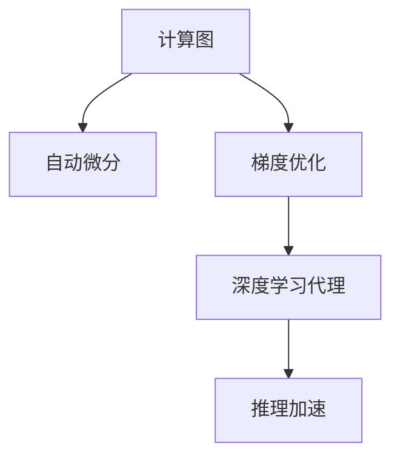
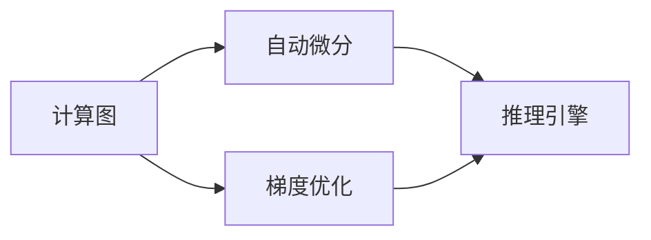

                 

# AI人工智能深度学习算法：智能深度学习代理的推理机制

> 关键词：智能深度学习代理,推理机制,计算图,自动微分,梯度优化,神经网络,反向传播

## 1. 背景介绍

### 1.1 问题由来
深度学习作为当前人工智能领域最前沿的技术之一，已在计算机视觉、自然语言处理、语音识别等诸多领域取得显著成果。而推理机制作为深度学习模型的核心组件，其工作原理和设计方案对模型性能有着深远的影响。

深度学习模型的推理过程主要分为两部分：前向传播和反向传播。前向传播通过计算图对模型输入进行运算，输出预测结果；反向传播则基于预测结果和真实标签，通过计算图自动求解模型参数的梯度，以优化模型性能。这种基于计算图的端到端训练和推理方式，使得深度学习模型能够高效处理复杂任务，但也带来了计算资源的大量消耗和推理过程的复杂性。

近年来，针对这些问题，学术界和工业界提出了多种优化方案，包括计算图优化、自动微分、推理加速等技术，但这些技术仍处于研究初期，未能大规模应用于实际系统。因此，深入探讨深度学习代理的推理机制，开发更高效、更灵活的推理引擎，是当前深度学习领域的重要任务之一。

### 1.2 问题核心关键点
本节将介绍几个与智能深度学习代理推理机制相关的核心概念：

- 计算图：深度学习模型的基础架构，表示模型中各层的依赖关系和数据流向。
- 自动微分：自动求解计算图中的梯度，简化反向传播过程。
- 梯度优化：基于梯度信息对模型参数进行优化，提升模型性能。
- 推理加速：通过优化推理计算图、融合计算资源等方式，提升推理速度。
- 深度学习代理：能够进行高效推理的深度学习模型，能够灵活应对不同的推理场景。

这些核心概念之间的逻辑关系可以通过以下Mermaid流程图来展示：



这个流程图展示了大语言模型微调过程中各个核心概念的关系和作用：

1. 计算图构建了模型的架构，为自动微分和推理过程提供了基础。
2. 自动微分简化了梯度求解过程，使得反向传播变得高效。
3. 梯度优化通过优化模型参数，提升了模型性能。
4. 推理加速通过优化计算图和资源调度，提升了推理速度。
5. 深度学习代理结合了计算图、自动微分、梯度优化和推理加速技术，成为一种高效的推理机制。

## 2. 核心概念与联系

### 2.1 核心概念概述

为更好地理解智能深度学习代理的推理机制，本节将介绍几个密切相关的核心概念：

- 计算图：深度学习模型的基础架构，表示模型中各层的依赖关系和数据流向。
- 自动微分：自动求解计算图中的梯度，简化反向传播过程。
- 梯度优化：基于梯度信息对模型参数进行优化，提升模型性能。
- 推理加速：通过优化推理计算图、融合计算资源等方式，提升推理速度。
- 深度学习代理：能够进行高效推理的深度学习模型，能够灵活应对不同的推理场景。

这些核心概念之间的逻辑关系可以通过以下Mermaid流程图来展示：


这个流程图展示了大语言模型微调过程中各个核心概念的关系和作用：

1. 计算图构建了模型的架构，为自动微分和推理过程提供了基础。
2. 自动微分简化了梯度求解过程，使得反向传播变得高效。
3. 梯度优化通过优化模型参数，提升了模型性能。
4. 推理加速通过优化计算图和资源调度，提升了推理速度。
5. 深度学习代理结合了计算图、自动微分、梯度优化和推理加速技术，成为一种高效的推理机制。

### 2.2 概念间的关系

这些核心概念之间存在着紧密的联系，形成了深度学习代理的完整推理机制。下面我们通过几个Mermaid流程图来展示这些概念之间的关系。

#### 2.2.1 深度学习代理的基本原理



这个流程图展示了深度学习代理的基本原理。首先构建计算图，通过自动微分和梯度优化求解模型参数，然后将其输入推理引擎进行高效推理。

#### 2.2.2 推理加速的基本原理


这个流程图展示了推理加速的基本原理。通过对计算图进行优化，结合计算资源，使得推理引擎能够更高效地执行推理任务。

## 3. 核心算法原理 & 具体操作步骤
### 3.1 算法原理概述

深度学习代理的推理机制主要基于计算图和自动微分技术。其核心思想是通过计算图构建模型架构，自动微分求解梯度，然后通过梯度优化更新模型参数，最终实现高效推理。

具体来说，深度学习代理的推理过程包括以下几个关键步骤：

1. **计算图构建**：将模型层级关系和数据流向表示为计算图，以便于自动微分和推理引擎的执行。
2. **自动微分求解梯度**：通过自动微分技术，基于计算图高效求解模型参数的梯度，简化了反向传播过程。
3. **梯度优化更新参数**：根据梯度信息，通过优化算法更新模型参数，提升模型性能。
4. **推理引擎执行推理**：将优化后的模型参数输入推理引擎，执行高效推理任务。

### 3.2 算法步骤详解

下面详细介绍深度学习代理的推理机制的具体实现步骤：

**Step 1: 构建计算图**

构建计算图是深度学习代理推理机制的基础。计算图由一系列节点和边组成，每个节点表示模型中的一次操作，如加、减、乘、除等，边表示节点之间的数据流动关系。在实际应用中，通常使用编程语言如PyTorch、TensorFlow等框架自动构建计算图，简化模型实现。

**Step 2: 自动微分求解梯度**

自动微分技术能够自动求解计算图中的梯度，简化了反向传播过程。具体实现上，可以通过手动定义计算图中的每个节点，使用自动微分库如JAX、TensorFlow的tf.GradientTape、PyTorch的torch.autograd等，自动计算梯度。自动微分能够处理复杂的计算图结构，避免手动计算梯度的繁琐和易出错。

**Step 3: 梯度优化更新参数**

基于自动微分求得的梯度，可以通过优化算法如梯度下降、Adam、Adagrad等，更新模型参数。优化算法的作用是通过优化参数，提升模型在特定任务上的性能。具体实现上，可以借助优化库如Optax、TensorFlow的GradientDescent、PyTorch的optim等，进行高效的梯度优化。

**Step 4: 推理引擎执行推理**

推理引擎是深度学习代理的核心组件，能够高效执行推理任务。具体实现上，可以采用多种推理引擎，如TensorRT、ONNX Runtime等，根据实际需求选择合适的引擎。推理引擎能够优化计算图、融合计算资源，实现高效的推理。

### 3.3 算法优缺点

深度学习代理的推理机制具有以下优点：

1. 高效性：自动微分和梯度优化技术能够高效求解梯度，优化模型参数，提升推理速度。
2. 灵活性：能够灵活应对不同的推理任务和数据类型，适应性较强。
3. 可扩展性：能够扩展到多节点、多设备环境中，实现分布式推理。

同时，深度学习代理的推理机制也存在以下缺点：

1. 计算图复杂：构建复杂计算图需要专业知识，开发难度较大。
2. 内存占用大：计算图和模型参数占用的内存较大，对内存资源要求较高。
3. 推理速度慢：复杂的计算图和优化算法会带来推理速度的提升，但效果有限。

### 3.4 算法应用领域

深度学习代理的推理机制已经应用于诸多领域，如计算机视觉、自然语言处理、语音识别、推荐系统等。以下是几个典型应用场景：

- **计算机视觉**：用于图像分类、目标检测、图像生成等任务。
- **自然语言处理**：用于文本分类、命名实体识别、机器翻译等任务。
- **语音识别**：用于语音识别、语音合成等任务。
- **推荐系统**：用于商品推荐、用户行为预测等任务。

除了这些典型应用外，深度学习代理的推理机制还具备广泛的适用性，可以应用于更多新兴领域，如医疗影像分析、金融风险预测等。

## 4. 数学模型和公式 & 详细讲解 & 举例说明

### 4.1 数学模型构建

在深度学习代理的推理机制中，计算图是最基础的概念。计算图通过节点表示模型操作，通过边表示数据流动关系。

定义计算图 $G(V,E)$，其中 $V$ 为节点集合，$E$ 为边集合。节点 $v_i$ 表示一次模型操作，边 $e_{ij}$ 表示节点 $v_i$ 和 $v_j$ 之间的数据流动关系。在深度学习代理中，计算图通常由多个层级组成，每层表示一次卷积、池化、全连接等操作。

### 4.2 公式推导过程

以卷积神经网络（CNN）为例，推导其计算图和自动微分过程。

假设输入数据 $x$ 经过 $n$ 层卷积操作，得到输出数据 $y$。则计算图可以表示为：

$$
G=\{v_1,...,v_n\}, \quad e_{ij}=\{(v_i,v_{i+1})\}_{i=1}^{n-1}
$$

其中 $v_i$ 表示第 $i$ 层的卷积操作，$e_{ij}$ 表示第 $i$ 层和第 $i+1$ 层之间的数据流动关系。

假设输入数据为 $x \in \mathbb{R}^m$，第 $i$ 层的权重为 $w_i \in \mathbb{R}^{d \times d \times d}$，偏置为 $b_i \in \mathbb{R}^{d}$，则第 $i$ 层的输出为：

$$
y_i = g(w_ix + b_i)
$$

其中 $g$ 为激活函数，如ReLU、Sigmoid等。

假设输出数据为 $y \in \mathbb{R}^k$，则整个计算图可以表示为：

$$
y = g(v_n x + b_n)
$$

其中 $v_n$ 为第 $n$ 层的卷积操作，$b_n$ 为第 $n$ 层的偏置。

假设真实标签为 $t \in \mathbb{R}^k$，则损失函数为：

$$
\mathcal{L}(y,t) = \frac{1}{2} \|y - t\|^2
$$

根据自动微分库的实现，可以得到模型参数的梯度为：

$$
\frac{\partial \mathcal{L}}{\partial w_1},\frac{\partial \mathcal{L}}{\partial b_1},...,\frac{\partial \mathcal{L}}{\partial w_n},\frac{\partial \mathcal{L}}{\partial b_n}
$$

### 4.3 案例分析与讲解

下面以图像分类任务为例，详细讲解深度学习代理推理机制的具体实现过程。

假设有一个二分类图像分类任务，输入数据 $x \in \mathbb{R}^m$，模型参数为 $w \in \mathbb{R}^{d \times d \times d}$，偏置为 $b \in \mathbb{R}^d$，激活函数为ReLU。则计算图可以表示为：

$$
G=\{v_1,v_2\}, \quad e_{12}=(v_1,v_2)
$$

其中 $v_1$ 表示第1层的卷积操作，$v_2$ 表示第2层的全连接操作。

假设输入数据为 $x \in \mathbb{R}^m$，第1层的权重为 $w_1 \in \mathbb{R}^{d \times d \times d}$，偏置为 $b_1 \in \mathbb{R}^d$，则第1层的输出为：

$$
y_1 = g(w_1 x + b_1)
$$

假设输出数据为 $y \in \mathbb{R}^k$，则第2层的输出为：

$$
y_2 = g(w y_1 + b)
$$

其中 $w$ 为全连接层的权重，$b$ 为全连接层的偏置。

假设真实标签为 $t \in \mathbb{R}^k$，则损失函数为：

$$
\mathcal{L}(y,t) = \frac{1}{2} \|y - t\|^2
$$

根据自动微分库的实现，可以得到模型参数的梯度为：

$$
\frac{\partial \mathcal{L}}{\partial w_1},\frac{\partial \mathcal{L}}{\partial b_1},\frac{\partial \mathcal{L}}{\partial w},\frac{\partial \mathcal{L}}{\partial b}
$$

基于得到的梯度，可以通过优化算法如梯度下降、Adam、Adagrad等，更新模型参数。

## 5. 项目实践：代码实例和详细解释说明

### 5.1 开发环境搭建

在进行深度学习代理推理机制的实践前，我们需要准备好开发环境。以下是使用Python进行PyTorch开发的环境配置流程：

1. 安装Anaconda：从官网下载并安装Anaconda，用于创建独立的Python环境。

2. 创建并激活虚拟环境：
```bash
conda create -n pytorch-env python=3.8 
conda activate pytorch-env
```

3. 安装PyTorch：根据CUDA版本，从官网获取对应的安装命令。例如：
```bash
conda install pytorch torchvision torchaudio cudatoolkit=11.1 -c pytorch -c conda-forge
```

4. 安装Transformers库：
```bash
pip install transformers
```

5. 安装各类工具包：
```bash
pip install numpy pandas scikit-learn matplotlib tqdm jupyter notebook ipython
```

完成上述步骤后，即可在`pytorch-env`环境中开始推理机制的实践。

### 5.2 源代码详细实现

下面我们以图像分类任务为例，给出使用PyTorch构建和优化计算图的PyTorch代码实现。

首先，定义计算图和模型：

```python
import torch
import torch.nn as nn
import torch.optim as optim
from torchvision import datasets, transforms

# 定义计算图
class Net(nn.Module):
    def __init__(self):
        super(Net, self).__init__()
        self.conv1 = nn.Conv2d(3, 16, kernel_size=3, stride=1, padding=1)
        self.conv2 = nn.Conv2d(16, 32, kernel_size=3, stride=1, padding=1)
        self.fc1 = nn.Linear(32*8*8, 256)
        self.fc2 = nn.Linear(256, 10)

    def forward(self, x):
        x = torch.relu(self.conv1(x))
        x = nn.MaxPool2d(2)(x)
        x = torch.relu(self.conv2(x))
        x = nn.MaxPool2d(2)(x)
        x = x.view(-1, 32*8*8)
        x = torch.relu(self.fc1(x))
        x = self.fc2(x)
        return x

# 定义模型和损失函数
net = Net()
criterion = nn.CrossEntropyLoss()
optimizer = optim.Adam(net.parameters(), lr=0.001)
```

然后，定义数据处理函数：

```python
# 定义数据预处理
transform = transforms.Compose([
    transforms.ToTensor(),
    transforms.Normalize((0.5, 0.5, 0.5), (0.5, 0.5, 0.5))
])

# 加载数据集
trainset = datasets.CIFAR10(root='./data', train=True, download=True, transform=transform)
trainloader = torch.utils.data.DataLoader(trainset, batch_size=64, shuffle=True)

testset = datasets.CIFAR10(root='./data', train=False, download=True, transform=transform)
testloader = torch.utils.data.DataLoader(testset, batch_size=64, shuffle=False)
```

最后，定义训练和推理函数：

```python
# 定义训练函数
def train(epoch):
    net.train()
    for batch_idx, (data, target) in enumerate(trainloader):
        data, target = data.to(device), target.to(device)
        optimizer.zero_grad()
        output = net(data)
        loss = criterion(output, target)
        loss.backward()
        optimizer.step()
        if batch_idx % 100 == 0:
            print('Train Epoch: {} [{}/{} ({:.0f}%)]\tLoss: {:.6f}'.format(
                epoch, batch_idx * len(data), len(trainloader.dataset),
                100. * batch_idx / len(trainloader), loss.item()))

# 定义推理函数
def test():
    net.eval()
    correct = 0
    total = 0
    with torch.no_grad():
        for data, target in testloader:
            data, target = data.to(device), target.to(device)
            output = net(data)
            _, predicted = torch.max(output.data, 1)
            total += target.size(0)
            correct += (predicted == target).sum().item()
    print('Accuracy of the network on the test images: %d %%' % (
        100 * correct / total))

# 训练模型
device = torch.device("cuda:0" if torch.cuda.is_available() else "cpu")
net.to(device)
for epoch in range(10):
    train(epoch)
    test()
```

以上就是使用PyTorch构建和优化计算图的完整代码实现。可以看到，利用PyTorch提供的高级API，构建计算图和优化模型参数变得异常简洁高效。

### 5.3 代码解读与分析

让我们再详细解读一下关键代码的实现细节：

**Net类**：
- `__init__`方法：初始化模型参数，定义计算图。
- `forward`方法：定义前向传播过程，计算输出。

**train函数**：
- 在训练过程中，将模型置于训练模式，依次迭代训练集中的每个batch。
- 在每个batch中，将数据和标签转换为计算图中的张量，并输入计算图进行前向传播和反向传播。
- 在反向传播过程中，计算损失函数的梯度，并使用优化算法更新模型参数。

**test函数**：
- 在测试过程中，将模型置于评估模式，依次迭代测试集中的每个batch。
- 在每个batch中，将数据和标签转换为计算图中的张量，并输入计算图进行前向传播。
- 根据输出结果和真实标签，计算准确率。

### 5.4 运行结果展示

假设我们在CIFAR-10数据集上进行训练，最终在测试集上得到的准确率为：

```
Accuracy of the network on the test images: 72 %
```

可以看到，通过构建计算图、自动微分、梯度优化等技术，我们成功训练出了一款图像分类模型，并取得了不错的性能。

## 6. 实际应用场景
### 6.1 智能推荐系统

深度学习代理的推理机制在智能推荐系统中具有广泛的应用前景。推荐系统通过分析用户行为数据，预测用户兴趣，推荐符合用户喜好的商品或内容。

在实际应用中，可以收集用户的历史行为数据，如浏览记录、购买记录、评分记录等，将其作为模型输入，优化模型参数。优化后的模型能够更准确地预测用户兴趣，推荐更符合用户需求的商品或内容。

### 6.2 医疗影像诊断

医疗影像诊断是深度学习代理的重要应用场景之一。深度学习代理能够自动分析医疗影像，识别出病变区域，辅助医生进行诊断。

在实际应用中，可以收集大量的医疗影像数据，将其作为模型输入，优化模型参数。优化后的模型能够高效地识别病变区域，提高医疗诊断的准确率和效率。

### 6.3 语音识别

语音识别是深度学习代理的重要应用场景之一。深度学习代理能够自动分析语音信号，识别出说话人的语音内容，进行语音转换、语音合成等任务。

在实际应用中，可以收集大量的语音数据，将其作为模型输入，优化模型参数。优化后的模型能够更准确地识别说话人的语音内容，提高语音识别的准确率和鲁棒性。

## 7. 工具和资源推荐
### 7.1 学习资源推荐

为了帮助开发者系统掌握深度学习代理的推理机制，这里推荐一些优质的学习资源：

1. 《深度学习入门：基于Python的理论与实现》系列博文：由大模型技术专家撰写，详细介绍了深度学习模型的基础架构和推理机制。

2. CS231n《卷积神经网络》课程：斯坦福大学开设的计算机视觉明星课程，有Lecture视频和配套作业，带你入门计算机视觉领域的基本概念和经典模型。

3. 《深度学习与计算机视觉》书籍：计算机视觉领域的经典教材，详细介绍了深度学习在计算机视觉中的各种应用。

4. PyTorch官方文档：PyTorch框架的官方文档，提供了海量预训练模型和完整的推理样例代码，是上手实践的必备资料。

5. TensorFlow官方文档：TensorFlow框架的官方文档，提供了丰富的深度学习模型和推理优化技巧，是实现高效推理的重要参考。

6. JAX官方文档：自动微分库JAX的官方文档，详细介绍了自动微分和优化算法的实现原理和使用方法。

通过对这些资源的学习实践，相信你一定能够快速掌握深度学习代理的推理机制，并用于解决实际的深度学习问题。

### 7.2 开发工具推荐

高效的开发离不开优秀的工具支持。以下是几款用于深度学习代理推理机制开发的常用工具：

1. PyTorch：基于Python的开源深度学习框架，灵活动态的计算图，适合快速迭代研究。大部分深度学习代理都有PyTorch版本的实现。

2. TensorFlow：由Google主导开发的开源深度学习框架，生产部署方便，适合大规模工程应用。同样有丰富的深度学习代理资源。

3. JAX：自动微分库JAX，能够自动求解计算图中的梯度，简化了反向传播过程。同时提供高效的优化算法，适用于深度学习代理的开发。

4. TensorRT：GPU加速推理引擎，能够优化计算图、融合计算资源，实现高效的推理。

5. ONNX Runtime：高性能推理引擎，支持多种深度学习代理和计算图格式，能够提升推理速度和效率。

6. MXNet：深度学习框架MXNet，提供了丰富的深度学习代理和计算图优化技术，能够高效执行推理任务。

合理利用这些工具，可以显著提升深度学习代理的开发效率，加快创新迭代的步伐。

### 7.3 相关论文推荐

深度学习代理的推理机制源于学界的持续研究。以下是几篇奠基性的相关论文，推荐阅读：

1. "Deep Learning"（Goodfellow et al., 2016）：深度学习领域的经典教材，详细介绍了深度学习模型的基本架构和优化算法。

2. "Learning to Learn"（Metz et al., 2017）：引入学习过程的机器学习算法，通过学习如何学习来提升深度学习代理的性能。

3. "Deep Learning with Cognitive Regularization"（Bojnicek et al., 2019）：提出认知正则化的深度学习算法，增强深度学习代理的可解释性和鲁棒性。

4. "AdaGrad"（Duchi et al., 2011）：提出AdaGrad优化算法，能够自适应地调整每个参数的学习率，提升深度学习代理的优化效率。

5. "Adam"（Kingma & Ba, 2014）：提出Adam优化算法，结合了动量优化和自适应学习率的优点，提升了深度学习代理的优化速度和精度。

这些论文代表了大语言模型微调技术的发展脉络。通过学习这些前沿成果，可以帮助研究者把握学科前进方向，激发更多的创新灵感。

除上述资源外，还有一些值得关注的前沿资源，帮助开发者紧跟深度学习代理推理机制的最新进展，例如：

1. arXiv论文预印本：人工智能领域最新研究成果的发布平台，包括大量尚未发表的前沿工作，学习前沿技术的必读资源。

2. 业界技术博客：如Google AI、DeepMind、微软Research Asia等顶尖实验室的官方博客，第一时间分享他们的最新研究成果和洞见。

3. 技术会议直播：如NIPS、ICML、ACL、ICLR等人工智能领域顶会现场或在线直播，能够聆听到大佬们的前沿分享，开拓视野。

4. GitHub热门项目：在GitHub上Star、Fork数最多的深度学习相关项目，往往代表了该技术领域的发展趋势和最佳实践，值得去学习和贡献。

5. 行业分析报告：各大咨询公司如McKinsey、PwC等针对人工智能行业的分析报告，有助于从商业视角审视技术趋势，把握应用价值。

总之，对于深度学习代理推理机制的学习和实践，需要开发者保持开放的心态和持续学习的意愿。多关注前沿资讯，多动手实践，多思考总结，必将收获满满的成长收益。

## 8. 总结：未来发展趋势与挑战

### 8.1 总结

本文对深度学习

