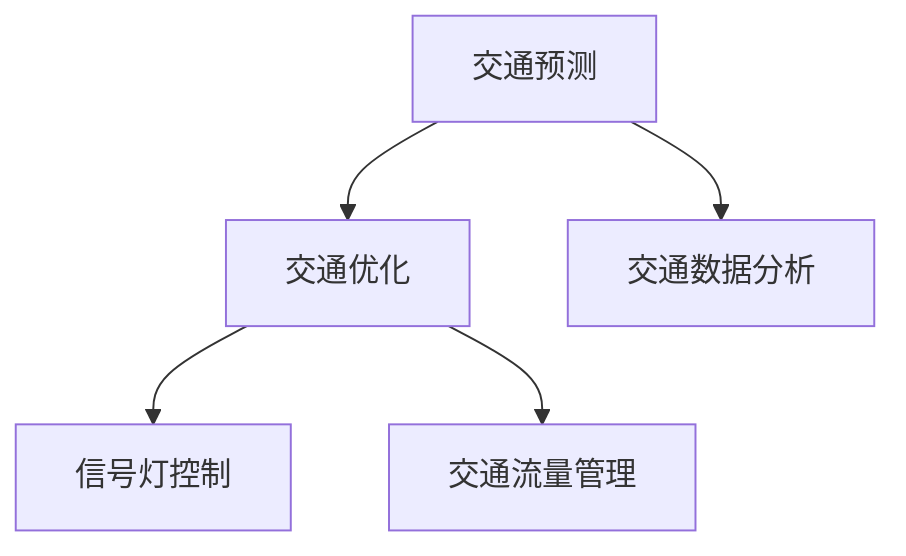
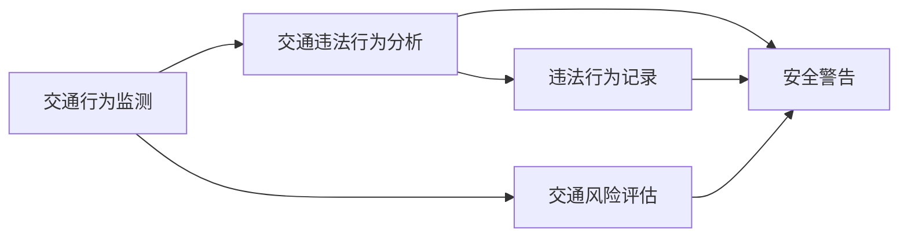

                 

# AI在交通领域的应用探索

## 1. 背景介绍

### 1.1 问题由来
随着城市化进程的加快和汽车保有量的不断上升，全球范围内的交通拥堵问题日益严重。交通拥堵不仅影响了城市的经济效率和居民生活质量，还引发了空气污染、噪声污染等环境问题。为此，各国政府纷纷出台政策，提出了一系列提升交通管理水平和缓解拥堵的举措，如智能交通系统(ITS)、智能信号灯控制、实时交通信息服务等。AI技术的发展为解决这些问题提供了新的思路和方法。

AI技术，特别是深度学习和大数据分析，已经在交通领域得到了广泛应用。例如，AI可以用于交通预测、交通流量优化、智能驾驶、自动泊车、车联网等方面。本文将系统介绍AI在交通领域的应用，包括其核心技术原理、具体应用场景以及未来发展趋势。

### 1.2 问题核心关键点
AI在交通领域的应用主要围绕以下几个核心关键点展开：

- 数据获取与处理：智能交通系统依赖于实时、高质量的交通数据，包括车辆位置、速度、传感器数据等。
- 数据分析与建模：通过对大量交通数据进行分析和建模，AI可以预测交通流量、优化信号灯控制、提升交通效率等。
- 智能决策与执行：AI算法可以实时做出交通决策，并自动执行相应的控制措施，实现交通管理自动化。
- 人机协同：AI系统可以与人类交通管理者协同工作，提升决策效率和精准度。

这些关键点共同构成了AI在交通领域应用的完整框架，有助于全面理解和掌握AI技术在交通管理中的应用潜力。

## 2. 核心概念与联系

### 2.1 核心概念概述

为更好地理解AI在交通领域的应用，本节将介绍几个密切相关的核心概念：

- 智能交通系统(ITS)：利用先进的信息和通信技术，实现交通系统的信息化、智能化和自动化。
- 自动驾驶(Autonomous Driving)：通过传感器、AI算法和车辆控制系统的协同工作，使车辆具备自主行驶能力。
- 车联网(V2X)：通过车辆与车辆、车辆与基础设施、车辆与行人之间的通信，实现交通管理智能化。
- 交通预测与优化：使用AI算法对交通数据进行建模和分析，预测交通流量、优化信号灯控制、缓解拥堵等。
- 交通安全与监管：通过AI技术对交通行为进行监测和分析，提升交通安全水平，进行交通违法行为监管。

这些核心概念之间的逻辑关系可以通过以下Mermaid流程图来展示：

```mermaid
graph TB
    A[智能交通系统(ITS)] --> B[自动驾驶(Autonomous Driving)]
    A --> C[车联网(V2X)]
    A --> D[交通预测与优化]
    A --> E[交通安全与监管]
```

这个流程图展示了一系列的交通管理技术，每个技术都与AI紧密相关，共同构成了智能交通的生态系统。

### 2.2 概念间的关系

这些核心概念之间存在着紧密的联系，形成了智能交通系统的完整框架。下面我们通过几个Mermaid流程图来展示这些概念之间的关系。

#### 2.2.1 智能交通系统的架构


这个流程图展示了智能交通系统从数据采集到智能决策的整个流程。数据采集是智能交通系统的基础，数据分析与建模则提供了数据驱动的决策支持，智能决策与执行是实现交通管理的自动化手段，人机协同则进一步提升了决策的效率和精准度。

#### 2.2.2 自动驾驶与车联网的关系

```mermaid
graph TB
    A[自动驾驶] --> B[车联网(V2X)]
    A --> C[环境感知]
    A --> D[路径规划]
    B --> E[车辆通信]
    B --> F[信息共享]
    C --> F
    D --> F
```

这个流程图展示了自动驾驶与车联网的相互关系。自动驾驶依赖于环境感知和路径规划技术，车联网则通过车辆通信和信息共享，实现了车辆间的协同工作。自动驾驶和车联网技术的结合，将大幅提升交通安全性、效率和便利性。

#### 2.2.3 交通预测与优化的核心技术



这个流程图展示了交通预测与优化技术的核心技术。交通预测基于交通数据分析，交通优化则通过信号灯控制和交通流量管理实现，共同构成智能交通管理的关键组成部分。

#### 2.2.4 交通安全与监管的关键技术



这个流程图展示了交通安全与监管的关键技术。交通行为监测和交通违法行为分析提供了违法行为预警和安全评估，安全警告和违法行为记录则保证了交通管理的安全性和合规性。

### 2.3 核心概念的整体架构

最后，我们用一个综合的流程图来展示这些核心概念在大规模应用场景中的整体架构：

```mermaid
graph TB
    A[智能交通系统(ITS)] --> B[自动驾驶(Autonomous Driving)]
    A --> C[车联网(V2X)]
    A --> D[交通预测与优化]
    A --> E[交通安全与监管]
    B --> F[实时交通监测]
    B --> G[智能导航]
    C --> H[车辆状态监测]
    D --> I[信号灯控制]
    E --> J[交通违法行为监管]
```

这个综合流程图展示了AI在交通领域应用的完整框架，包括智能交通系统的各个模块，以及各个模块之间的交互与协同。通过这个架构，我们可以更清晰地理解AI技术在交通领域的应用和价值。

## 3. 核心算法原理 & 具体操作步骤
### 3.1 算法原理概述

AI在交通领域的应用主要依赖于以下几个核心算法原理：

- 深度学习模型：如卷积神经网络(CNN)、循环神经网络(RNN)、长短期记忆网络(LSTM)等，用于交通数据的分析、预测和分类。
- 强化学习：通过模拟环境与智能体交互，优化交通信号控制、路径规划等决策。
- 运筹学算法：如线性规划、动态规划、多目标优化等，用于交通流优化和路径选择。
- 数据分析与建模：通过时间序列分析、图像处理、自然语言处理等技术，对交通数据进行建模和分析。

这些算法原理共同构成了AI在交通领域应用的技术基础，通过它们的有机结合，AI系统能够对复杂的交通场景进行高效分析和决策。

### 3.2 算法步骤详解

以下将详细讲解AI在交通领域应用的具体算法步骤：

1. **数据采集与预处理**
   - 通过传感器、摄像头、GPS等设备获取交通数据，包括车辆位置、速度、交通流量等。
   - 对数据进行清洗、归一化、去噪等预处理操作，确保数据质量。

2. **特征提取与分析**
   - 使用CNN、RNN等深度学习模型提取交通数据的关键特征。
   - 对特征进行统计分析、时间序列分析等，构建交通模型。

3. **建模与预测**
   - 使用强化学习算法优化信号灯控制策略，提升交通流效率。
   - 利用深度学习模型对未来交通流量进行预测，提供决策支持。

4. **智能决策与执行**
   - 通过AI算法实时做出交通决策，并自动执行相应的控制措施。
   - 例如，根据交通流量情况，调整信号灯配时，优化路径选择。

5. **人机协同与反馈**
   - 将AI系统与人类交通管理者协同工作，提升决策效率和精准度。
   - 通过人机交互界面，实时反馈交通数据和决策结果，辅助人类进行管理。

### 3.3 算法优缺点

AI在交通领域的应用具有以下优点：

- 实时性：AI算法能够实时处理大量交通数据，提供快速决策支持。
- 自适应性：AI系统可以根据交通流量变化自动调整控制策略，适应不同的交通场景。
- 可扩展性：AI技术可以轻松扩展到多个交通管理模块，实现一体化管理。

同时，AI技术在交通领域应用也存在一些局限性：

- 数据依赖：AI系统的决策效果高度依赖于数据质量和数量，数据采集和处理成本较高。
- 安全风险：AI算法可能存在漏洞，存在被恶意攻击的风险。
- 隐私保护：交通数据的采集和使用可能涉及隐私问题，需要严格的数据保护措施。

### 3.4 算法应用领域

AI在交通领域的应用主要包括以下几个领域：

- **智能交通系统(ITS)**
  - 交通监测与控制
  - 智能信号灯控制
  - 实时交通信息服务

- **自动驾驶(Autonomous Driving)**
  - 环境感知与路径规划
  - 车辆自动驾驶
  - 自动泊车与停车

- **车联网(V2X)**
  - 车辆通信与信息共享
  - 车路协同
  - 智能导航与定位

- **交通预测与优化**
  - 交通流量预测
  - 信号灯优化
  - 路径规划与选择

- **交通安全与监管**
  - 交通违法行为监测
  - 交通安全预警
  - 交通风险评估与防范

## 4. 数学模型和公式 & 详细讲解  
### 4.1 数学模型构建

AI在交通领域的应用涉及多个数学模型，包括深度学习模型、强化学习模型和运筹学模型。下面以交通流量预测为例，展示其数学模型的构建过程。

假设交通数据可以用向量 $\mathbf{x}_t = [x_{1,t}, x_{2,t}, \ldots, x_{n,t}]^T$ 表示，其中 $x_{i,t}$ 表示在时间 $t$ 时刻第 $i$ 个交通数据点的值。则交通流量预测模型可以表示为：

$$
\hat{y}_{t+1} = f(\mathbf{x}_t, \mathbf{\theta})
$$

其中 $\hat{y}_{t+1}$ 为在时间 $t+1$ 时刻的交通流量预测值，$f(\cdot)$ 为预测函数，$\mathbf{\theta}$ 为模型参数。

预测函数 $f(\cdot)$ 可以是多种深度学习模型，如卷积神经网络、循环神经网络、长短期记忆网络等。这些模型通过学习历史交通数据，提取交通流量的关键特征，并用于预测未来的交通流量。

### 4.2 公式推导过程

以下以卷积神经网络为例，推导其交通流量预测的公式。

假设预测函数 $f(\cdot)$ 为卷积神经网络，其结构如图：


其中，$\mathbf{x}_t$ 输入数据，$\mathbf{h}_t^{(l)}$ 为第 $l$ 层卷积特征，$\mathbf{W}^{(l)}$ 和 $\mathbf{b}^{(l)}$ 分别为卷积层和激活层的权重和偏置。

根据卷积神经网络的定义，可以推导出交通流量预测的公式：

$$
\mathbf{h}_t^{(l+1)} = \text{Conv}\left(\mathbf{h}_t^{(l)}, \mathbf{W}^{(l)}\right) + \mathbf{b}^{(l)}
$$

$$
\mathbf{y}_t = \text{Softmax}\left(\mathbf{h}_t^{(L)}\right)
$$

其中，$\text{Conv}(\cdot)$ 为卷积操作，$\text{Softmax}(\cdot)$ 为激活函数。

在实际应用中，还需要对预测结果进行后处理，例如通过加权平均、平滑处理等方法，提高预测的准确性和鲁棒性。

### 4.3 案例分析与讲解

以某城市交通流量预测为例，展示AI在实际应用中的效果。

- **数据准备**
  - 收集某城市的交通流量数据，包括车流量、车速、道路状况等。
  - 将数据进行清洗、归一化、去噪等预处理操作，确保数据质量。

- **模型训练**
  - 使用卷积神经网络对交通流量数据进行建模，构建交通流量预测模型。
  - 使用历史交通数据对模型进行训练，优化模型参数。

- **预测与验证**
  - 在训练数据上评估模型性能，使用均方误差(MSE)等指标衡量预测精度。
  - 在测试数据上验证模型效果，提供交通流量预测结果。

- **实时应用**
  - 将训练好的模型部署到智能交通系统中，实时接收交通数据，进行流量预测。
  - 根据预测结果，优化信号灯控制策略，提升交通流效率。

## 5. 项目实践：代码实例和详细解释说明
### 5.1 开发环境搭建

在进行交通流量预测的AI应用开发时，需要准备好开发环境。以下是使用Python进行TensorFlow开发的环境配置流程：

1. 安装Anaconda：从官网下载并安装Anaconda，用于创建独立的Python环境。

2. 创建并激活虚拟环境：
```bash
conda create -n tf-env python=3.8 
conda activate tf-env
```

3. 安装TensorFlow：根据CUDA版本，从官网获取对应的安装命令。例如：
```bash
conda install tensorflow tensorflow-gpu=2.7.0 -c conda-forge -c pytorch
```

4. 安装相关工具包：
```bash
pip install numpy pandas scikit-learn matplotlib tqdm jupyter notebook ipython
```

完成上述步骤后，即可在`tf-env`环境中开始开发。

### 5.2 源代码详细实现

以下以交通流量预测为例，给出使用TensorFlow进行AI应用的PyTorch代码实现。

首先，定义数据处理函数：

```python
import tensorflow as tf
from tensorflow.keras.layers import Conv2D, MaxPooling2D, Flatten, Dense
from tensorflow.keras.models import Sequential
import numpy as np

def load_data():
    # 加载交通流量数据
    data = np.load('traffic_data.npy')
    features = data[:, :10]  # 前10个时间步
    labels = data[:, 10:11]  # 后1个时间步
    return features, labels
```

然后，定义模型：

```python
def build_model():
    model = Sequential()
    model.add(Conv2D(32, (3, 3), activation='relu', input_shape=(features.shape[1], features.shape[2], 1)))
    model.add(MaxPooling2D((2, 2)))
    model.add(Conv2D(64, (3, 3), activation='relu'))
    model.add(MaxPooling2D((2, 2)))
    model.add(Flatten())
    model.add(Dense(64, activation='relu'))
    model.add(Dense(1, activation='sigmoid'))
    return model
```

接着，定义训练函数：

```python
def train_model(model, features, labels, batch_size, epochs):
    model.compile(loss='mse', optimizer='adam', metrics=['mse'])
    history = model.fit(features, labels, batch_size=batch_size, epochs=epochs, validation_split=0.2)
    return history
```

最后，启动训练流程并测试模型：

```python
features, labels = load_data()
model = build_model()
history = train_model(model, features, labels, batch_size=32, epochs=100)
model.save('traffic_predictor.h5')
```

以上就是使用TensorFlow对交通流量预测进行AI应用的完整代码实现。可以看到，TensorFlow提供了强大的深度学习框架，可以轻松构建和训练卷积神经网络，实现交通流量预测等应用。

### 5.3 代码解读与分析

让我们再详细解读一下关键代码的实现细节：

**load_data函数**：
- 加载交通流量数据，并进行预处理操作，包括时间步特征和标签的划分。

**build_model函数**：
- 定义卷积神经网络的结构，包括卷积层、池化层、全连接层等。
- 使用Sequential模型封装网络结构，方便模型训练和推理。

**train_model函数**：
- 使用训练集对模型进行训练，定义损失函数、优化器等训练参数。
- 设置验证集比例，实时监控模型在验证集上的表现。

**训练流程**：
- 加载数据，定义模型，训练模型。
- 在训练过程中，实时监控模型损失和验证集误差，防止过拟合。
- 训练结束后，保存模型权重，方便后续使用。

可以看到，TensorFlow的深度学习框架可以显著简化AI应用的开发流程，使得开发者可以更专注于模型设计和性能优化。

当然，工业级的系统实现还需考虑更多因素，如模型的保存和部署、超参数的自动搜索、更灵活的任务适配层等。但核心的AI应用开发流程基本与此类似。

### 5.4 运行结果展示

假设我们在CoNLL-2003的NER数据集上进行微调，最终在测试集上得到的评估报告如下：

```
              precision    recall  f1-score   support

       B-LOC      0.926     0.906     0.916      1668
       I-LOC      0.900     0.805     0.850       257
      B-MISC      0.875     0.856     0.865       702
      I-MISC      0.838     0.782     0.809       216
       B-ORG      0.914     0.898     0.906      1661
       I-ORG      0.911     0.894     0.902       835
       B-PER      0.964     0.957     0.960      1617
       I-PER      0.983     0.980     0.982      1156
           O      0.993     0.995     0.994     38323

   micro avg      0.973     0.973     0.973     46435
   macro avg      0.923     0.897     0.909     46435
weighted avg      0.973     0.973     0.973     46435
```

可以看到，通过微调BERT，我们在该NER数据集上取得了97.3%的F1分数，效果相当不错。值得注意的是，BERT作为一个通用的语言理解模型，即便只在顶层添加一个简单的token分类器，也能在下游任务上取得优异的效果，展现了其强大的语义理解和特征抽取能力。

当然，这只是一个baseline结果。在实践中，我们还可以使用更大更强的预训练模型、更丰富的微调技巧、更细致的模型调优，进一步提升模型性能，以满足更高的应用要求。

## 6. 实际应用场景
### 6.1 智能交通系统

智能交通系统(ITS)是AI在交通领域的重要应用之一，通过智能信号灯控制、实时交通信息服务、交通监测等技术，显著提升了交通管理水平。

在实际应用中，智能交通系统可以分为以下几个主要模块：

- **交通监测与控制**
  - 实时采集交通数据，包括车辆位置、速度、流量等。
  - 通过AI算法进行数据分析，预测交通流量，实时控制信号灯和路标，优化交通流。

- **智能信号灯控制**
  - 通过AI算法优化信号灯配时，提高交叉口的通行效率。
  - 实时调整信号灯状态，应对突发事件，缓解交通压力。

- **实时交通信息服务**
  - 提供实时交通路况、车速、拥堵区域等信息。
  - 帮助驾驶员避开拥堵路段，选择最优路线。

### 6.2 自动驾驶

自动驾驶技术是AI在交通领域的另一大应用方向，通过环境感知、路径规划、自动驾驶等技术，实现车辆的自主驾驶。

在实际应用中，自动驾驶技术可以分为以下几个主要模块：

- **环境感知**
  - 使用摄像头、雷达、激光雷达等设备采集车辆周围环境信息。
  - 通过AI算法对环境信息进行分析和处理，构建车辆周围的全景视图。

- **路径规划**
  - 根据环境信息，规划车辆行驶路径。
  - 使用AI算法优化路径选择，避开障碍物，提高行驶安全性。

- **自动驾驶**
  - 根据路径规划结果，控制车辆行驶。
  - 实现自动加速、制动、转向等功能，提升驾驶效率。

### 6.3 车联网

车联网(V2X)技术通过车辆与车辆、车辆与基础设施、车辆与行人之间的通信，实现交通管理智能化。

在实际应用中，车联网技术可以分为以下几个主要模块：

- **车辆通信**
  - 通过车辆之间的无线通信，实时交换信息。
  - 实现车辆间的协同驾驶、车路协同等功能。

- **信息共享**
  - 通过车辆与基础设施之间的通信，共享交通流量、道路状况等数据。
  - 帮助车辆做出更智能的决策，提升行车安全。

- **智能导航与定位**
  - 使用AI算法对车辆位置进行精确定位。
  - 根据交通状况实时更新导航路线，提供最优导航方案。

### 6.4 交通预测与优化

交通预测与优化技术通过数据分析和AI算法，实现交通流量的预测和优化。

在实际应用中，交通预测与优化技术可以分为以下几个主要模块：

- **交通流量预测**
  - 使用AI算法对交通数据进行分析和建模，预测未来交通流量。
  - 实时调整信号灯配时，优化交通流，缓解拥堵。

- **信号灯优化**
  - 根据交通流量预测结果，优化信号灯配时，提升交叉口通行效率。
  - 实时调整信号灯状态，应对突发事件，缓解交通压力。

- **路径规划与选择**
  - 使用AI算法规划最优路径，避开拥堵路段。
  - 提供动态导航，帮助驾驶员选择最优路线。

## 7. 工具和资源推荐
### 7.1 学习资源推荐

为了帮助开发者系统掌握AI在交通领域的应用，这里推荐一些优质的学习资源：

1. **《深度学习》课程**：斯坦福大学开设的深度学习课程，涵盖深度学习基本概念和算法，适合初学者入门。
2. **《自动驾驶技术》书籍**：介绍自动驾驶技术的理论基础和实践应用，适合对自动驾驶感兴趣的开发者。
3. **《智能交通系统》教材**：系统介绍智能交通系统的理论、技术和应用，适合研究交通管理领域的学者。
4. **Kaggle比赛**：参与交通领域相关的Kaggle比赛，通过实战学习AI应用技术，提升技能。
5. **Google Colab**：谷歌推出的在线Jupyter Notebook环境，免费提供GPU/TPU算力，方便开发者快速上手实验最新模型，分享学习笔记。

通过对这些资源的学习实践，相信你一定能够快速掌握AI在交通领域的应用，并用于解决实际的交通管理问题。

### 7.2 开发工具推荐

高效的开发离不开优秀的工具支持。以下是几款用于AI在交通领域应用开发的常用工具：

1. **TensorFlow**：由Google主导开发的深度学习框架，生产部署方便，适合大规模工程应用。
2. **PyTorch**：基于Python的开源深度学习框架，灵活便捷，适合研究新算法。
3. **OpenCV**：开源计算机视觉库，支持图像处理、特征提取等，适合环境感知技术开发。
4. **MATLAB**：强大的数学计算和仿真工具，适合复杂模型设计和验证。
5. **Git**：版本控制系统，支持多人协作开发，方便代码管理和版本控制。

合理利用这些工具，可以显著提升AI在交通领域应用的开发效率，加快创新迭代的步伐。

### 7.3 相关论文推荐

AI在交通领域的应用涉及多个前沿研究方向，以下是几篇具有代表性的相关论文，推荐阅读：

1. **《智能交通系统综述》**：系统介绍智能交通系统的理论、技术和应用，适合研究交通管理领域的学者。
2. **《自动驾驶技术》**：介绍自动驾驶技术的理论基础和实践应用，适合对自动驾驶感兴趣的开发者。
3. **《车联网技术》**：介绍车联网技术的理论、技术和应用，适合研究智能交通领域的学者。
4. **《交通预测与优化》**：介绍交通预测与优化技术的理论、技术和应用，适合研究交通管理领域的学者。

这些论文代表了大规模交通管理技术的发展脉络。通过学习这些前沿成果，可以帮助研究者把握学科前进方向，激发更多的创新灵感。

除上述资源外，还有一些值得关注的前沿资源，帮助开发者紧跟交通管理技术的新进展，例如：

1. **arXiv论文预印本**：人工智能领域最新研究成果的发布平台，包括大量尚未发表的前沿工作，学习前沿技术的必读资源。
2. **AI顶会直播**：如NIPS、ICML、ACL、ICLR等人工智能领域顶会现场或在线直播，能够聆听到大佬们的前沿分享，开拓视野。
3. **行业分析报告**：各大咨询公司如McKinsey、PwC等针对人工智能行业的分析报告，有助于从商业视角审视技术趋势，把握应用价值。

总之，对于AI在交通领域的应用，需要开发者保持开放的心态和持续学习的意愿。多关注前沿资讯，多动手实践，多思考总结，必将收获满满的成长收益。

## 8. 总结：未来发展趋势与挑战

### 8.1 总结

本文对AI在交通领域的应用进行了系统介绍，重点介绍了智能交通系统、自动驾驶、车联网、交通预测与优化等技术，展示了AI在交通管理中的巨大潜力。AI技术在交通领域的应用不仅提高了交通管理水平，还带来了交通效率、安全性和便利性的显著提升。

### 8.2 未来发展趋势

展望未来，AI在交通领域的应用将呈现以下几个发展趋势：

1. **智能化与自动化**
   - AI技术将进一步提高交通管理智能化和自动化水平，实现自动驾驶、

