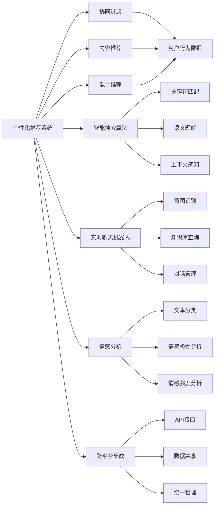

                 

# AI在电商搜索导购中的应用提升用户体验和转化率

## 1. 背景介绍

### 1.1 问题由来
随着互联网和电子商务的快速发展，越来越多的消费者选择在线购物。然而，尽管电商平台的商品种类繁多，搜索效率低下、用户体验不佳等问题依然困扰着消费者。传统搜索算法大多基于关键词匹配，难以处理复杂的语义理解和上下文信息。为了提升电商搜索和导购的精准度和用户体验，人工智能(AI)技术应运而生。

### 1.2 问题核心关键点
AI技术在电商搜索导购中的应用，主要集中在以下几个方面：

- **个性化推荐系统**：根据用户的历史行为和兴趣，推荐个性化商品，提升用户体验。
- **智能搜索算法**：利用自然语言处理(NLP)技术，理解用户查询意图，返回更精准的搜索结果。
- **实时聊天机器人**：在用户浏览商品时提供实时咨询，解决用户疑问，提升购买决策。
- **情感分析**：通过分析用户评价和反馈，改进商品描述和推荐策略，提升用户满意度。
- **跨平台集成**：将搜索、推荐、导购等AI应用集成到统一的电商平台上，提升整体服务质量。

这些AI应用不仅能够提升搜索和导购的效率和精度，还能通过深度学习模型和数据驱动的方法，挖掘用户的潜在需求，帮助电商平台实现精准营销和个性化服务。

### 1.3 问题研究意义
通过引入AI技术，电商平台可以大幅提升用户搜索体验，提高商品转化率。AI技术还可以帮助电商平台分析用户行为数据，发现潜在用户需求，制定更具针对性的营销策略，从而提升平台的竞争力和用户黏性。

## 2. 核心概念与联系

### 2.1 核心概念概述

#### 2.1.1 个性化推荐系统
个性化推荐系统利用AI技术，通过分析用户的历史行为和兴趣，推荐个性化商品，提升用户体验。

- **协同过滤**：通过分析用户与其他用户的行为相似性，推荐其他用户喜欢的商品。
- **内容推荐**：根据商品属性和用户偏好，推荐相关商品。
- **混合推荐**：结合协同过滤和内容推荐，实现综合推荐。

#### 2.1.2 智能搜索算法
智能搜索算法利用自然语言处理技术，理解用户查询意图，返回更精准的搜索结果。

- **关键词匹配**：利用TF-IDF等技术，匹配查询词和商品关键词。
- **语义理解**：通过命名实体识别、情感分析等技术，理解查询中的语义信息。
- **上下文感知**：利用上下文信息，提高搜索结果的相关性和准确性。

#### 2.1.3 实时聊天机器人
实时聊天机器人利用NLP技术，在用户浏览商品时提供实时咨询，解决用户疑问，提升购买决策。

- **意图识别**：理解用户提出的问题，确定其意图。
- **知识库查询**：从知识库中检索相关答案，提供解决方案。
- **对话管理**：维护用户对话历史，提供上下文一致的回复。

#### 2.1.4 情感分析
情感分析利用NLP技术，通过分析用户评价和反馈，改进商品描述和推荐策略，提升用户满意度。

- **文本分类**：将用户评论分为正面、负面和中立三类。
- **情感极性分析**：分析用户评论中的情感极性，识别正面或负面情绪。
- **情感强度分析**：量化用户评论中的情感强度，评估其重要性。

#### 2.1.5 跨平台集成
跨平台集成将搜索、推荐、导购等AI应用集成到统一的电商平台上，提升整体服务质量。

- **API接口**：提供统一的API接口，方便各应用模块的调用。
- **数据共享**：实现各模块之间的数据共享，提高系统效率。
- **统一管理**：通过统一的管理平台，监控和优化各应用模块的性能。

### 2.2 概念间的关系

这些核心概念之间存在着紧密的联系，形成了电商搜索导购的AI应用生态系统。下面通过Mermaid流程图展示这些概念之间的关系：



这个流程图展示了个性化推荐系统、智能搜索算法、实时聊天机器人、情感分析和跨平台集成等核心概念之间的关系，它们共同构成了电商搜索导购的AI应用体系。

## 3. 核心算法原理 & 具体操作步骤
### 3.1 算法原理概述

AI技术在电商搜索导购中的应用，主要基于以下原理：

1. **个性化推荐系统**：利用协同过滤、内容推荐和混合推荐等技术，根据用户历史行为和兴趣，推荐个性化商品。
2. **智能搜索算法**：通过自然语言处理技术，理解用户查询意图，匹配查询词和商品关键词，提高搜索结果的准确性和相关性。
3. **实时聊天机器人**：利用NLP技术，理解用户意图，从知识库中检索相关答案，提供实时咨询服务。
4. **情感分析**：通过文本分类、情感极性分析和情感强度分析等技术，改进商品描述和推荐策略，提升用户满意度。
5. **跨平台集成**：通过统一的API接口和数据共享机制，实现各AI应用模块之间的协同工作，提升整体服务质量。

### 3.2 算法步骤详解

#### 3.2.1 个性化推荐系统

1. **数据收集**：从电商平台收集用户的历史行为数据，如浏览记录、购买历史、评分等。
2. **特征提取**：提取用户行为数据的特征，如商品ID、用户ID、浏览时间等。
3. **协同过滤**：利用协同过滤算法，分析用户与其他用户的行为相似性，推荐其他用户喜欢的商品。
4. **内容推荐**：根据商品属性和用户偏好，推荐相关商品。
5. **混合推荐**：结合协同过滤和内容推荐，实现综合推荐。

#### 3.2.2 智能搜索算法

1. **语义分析**：利用NLP技术，分析用户查询的语义信息，识别命名实体、关键词等。
2. **关键词匹配**：利用TF-IDF等技术，匹配查询词和商品关键词，生成候选商品列表。
3. **上下文感知**：利用用户搜索历史和商品属性，提高搜索结果的相关性和准确性。
4. **排名排序**：根据相关性得分，对候选商品进行排序，返回最相关的前N个商品。

#### 3.2.3 实时聊天机器人

1. **意图识别**：利用NLP技术，理解用户提出的问题，确定其意图。
2. **知识库查询**：从知识库中检索相关答案，提供解决方案。
3. **对话管理**：维护用户对话历史，提供上下文一致的回复。

#### 3.2.4 情感分析

1. **文本预处理**：对用户评论进行分词、去停用词等预处理操作。
2. **情感分类**：利用情感分类模型，将用户评论分为正面、负面和中立三类。
3. **情感极性分析**：分析用户评论中的情感极性，识别正面或负面情绪。
4. **情感强度分析**：量化用户评论中的情感强度，评估其重要性。

#### 3.2.5 跨平台集成

1. **API设计**：设计统一的API接口，支持各AI应用模块的调用。
2. **数据共享**：实现各模块之间的数据共享，提高系统效率。
3. **统一管理**：通过统一的管理平台，监控和优化各应用模块的性能。

### 3.3 算法优缺点

#### 3.3.1 个性化推荐系统

**优点**：
- 能够根据用户历史行为和兴趣，提供个性化推荐，提升用户体验。
- 利用协同过滤和内容推荐，结合多种技术手段，提升推荐效果。
- 实时性高，能够根据用户最新行为进行动态推荐。

**缺点**：
- 数据隐私问题：用户行为数据需要匿名化处理，防止隐私泄露。
- 冷启动问题：新用户或商品无历史数据，难以进行有效推荐。
- 计算资源消耗大：协同过滤和混合推荐需要计算复杂度较高的算法。

#### 3.3.2 智能搜索算法

**优点**：
- 利用NLP技术，理解用户查询意图，提高搜索结果的准确性和相关性。
- 上下文感知能力强，能够根据用户搜索历史和商品属性，提供更精准的搜索结果。

**缺点**：
- 语义理解难度大：自然语言的多义性和复杂性增加了语义理解的难度。
- 数据质量要求高：搜索结果的准确性依赖于高质量的训练数据。
- 计算成本高：语义理解和关键词匹配需要计算复杂度较高的算法。

#### 3.3.3 实时聊天机器人

**优点**：
- 提供实时咨询服务，解答用户疑问，提升购买决策。
- 利用NLP技术，理解用户意图，提供个性化回复。
- 知识库查询效率高，能够快速检索相关答案。

**缺点**：
- 需要持续维护知识库，保证查询结果的正确性和及时性。
- 对话管理复杂，需要处理多轮对话，维护上下文一致性。
- 用户体验依赖于聊天机器人的智能水平，若智能化程度不足，可能影响用户满意度。

#### 3.3.4 情感分析

**优点**：
- 通过情感分析，改进商品描述和推荐策略，提升用户满意度。
- 利用情感分类和情感强度分析，了解用户需求，制定更具针对性的营销策略。

**缺点**：
- 情感分析模型的准确性依赖于高质量的训练数据。
- 情感分类和情感强度分析需要复杂的NLP技术，计算成本高。
- 用户情感的复杂性增加了分析难度，可能存在误判风险。

#### 3.3.5 跨平台集成

**优点**：
- 通过统一的API接口和数据共享机制，实现各AI应用模块的协同工作，提升整体服务质量。
- 统一管理平台能够监控和优化各应用模块的性能，提高系统稳定性。

**缺点**：
- 系统复杂度高，需要设计和管理大量的API接口和数据流。
- 各模块之间的数据共享和协同工作可能存在延迟和冲突问题。
- 统一管理平台需要持续维护和优化，增加系统复杂度。

### 3.4 算法应用领域

#### 3.4.1 个性化推荐系统

- **电商平台**：电商平台的个性化推荐系统，可以提升用户体验，提高商品转化率。
- **视频网站**：视频网站的个性化推荐系统，可以推荐用户感兴趣的视频内容。
- **音乐平台**：音乐平台的个性化推荐系统，可以推荐用户喜欢的音乐作品。

#### 3.4.2 智能搜索算法

- **搜索引擎**：搜索引擎的智能搜索算法，能够提高搜索结果的准确性和相关性，提升用户满意度。
- **社交媒体**：社交媒体的智能搜索算法，可以推荐用户感兴趣的内容和用户。
- **图书馆**：图书馆的智能搜索算法，可以推荐用户感兴趣的书目和文章。

#### 3.4.3 实时聊天机器人

- **电商平台**：电商平台的实时聊天机器人，可以解答用户疑问，提升购买决策。
- **银行金融**：银行的实时聊天机器人，可以解答用户关于账户和金融产品的疑问。
- **旅游行业**：旅游行业的实时聊天机器人，可以解答用户关于旅游线路和景点的疑问。

#### 3.4.4 情感分析

- **电商平台**：电商平台的情感分析，可以分析用户评论，改进商品描述和推荐策略。
- **社交媒体**：社交媒体的情感分析，可以分析用户情感，制定更具针对性的营销策略。
- **品牌监控**：品牌监控的情感分析，可以分析用户对品牌的情感，提升品牌形象。

#### 3.4.5 跨平台集成

- **电商平台**：电商平台的跨平台集成，可以提升整体服务质量，提高用户满意度。
- **医疗平台**：医疗平台的跨平台集成，可以实现各医疗模块的协同工作，提升医疗服务质量。
- **政府平台**：政府平台的跨平台集成，可以实现各政务模块的协同工作，提升政务服务效率。

## 4. 数学模型和公式 & 详细讲解 & 举例说明

### 4.1 数学模型构建

#### 4.1.1 个性化推荐系统

个性化推荐系统的数学模型主要基于协同过滤和内容推荐算法，具体如下：

1. **协同过滤算法**：
   - 用户-商品评分矩阵 $R_{N \times M}$，其中 $N$ 为用户数量，$M$ 为商品数量。
   - 用户行为矩阵 $A_{N \times M}$，表示用户对商品的评分。

   协同过滤算法的目标是，根据用户 $u$ 的历史评分 $A_u$，预测用户对商品 $i$ 的评分 $r_{ui}$，推荐评分高的商品。

2. **内容推荐算法**：
   - 商品特征矩阵 $F_{M \times D}$，其中 $D$ 为特征维度。
   - 用户特征向量 $V_u \in \mathbb{R}^D$，表示用户对商品属性的偏好。

   内容推荐算法的目标是，根据用户特征 $V_u$ 和商品特征 $F_i$，计算用户对商品 $i$ 的评分 $r_{ui}$，推荐评分高的商品。

#### 4.1.2 智能搜索算法

智能搜索算法的数学模型主要基于自然语言处理技术，具体如下：

1. **关键词匹配算法**：
   - 查询词向量 $Q \in \mathbb{R}^n$，表示查询词的词向量。
   - 商品关键词向量 $T_i \in \mathbb{R}^n$，表示商品的关键词向量。

   关键词匹配算法的目标是，计算查询词 $Q$ 和商品关键词 $T_i$ 的相似度 $s_i$，选择相似度高的商品进行推荐。

2. **语义理解算法**：
   - 命名实体识别算法：识别查询中的命名实体，如人名、地名、机构名等。
   - 情感分析算法：分析查询中的情感极性和情感强度。

   语义理解算法的目标是，理解查询中的语义信息，提取有用信息进行推荐。

#### 4.1.3 实时聊天机器人

实时聊天机器人的数学模型主要基于NLP技术，具体如下：

1. **意图识别算法**：
   - 用户输入 $I_u \in \mathbb{R}^m$，表示用户输入的自然语言。
   - 意图标签集合 $\mathcal{L}$，表示用户的意图标签。

   意图识别算法的目标是，将用户输入 $I_u$ 映射到意图标签 $\mathcal{L}$ 中的一个，确定用户的意图。

2. **知识库查询算法**：
   - 知识库 $\mathcal{K}$，表示知识库中的问答对。
   - 查询输入 $Q_i \in \mathbb{R}^n$，表示用户的查询输入。

   知识库查询算法的目标是，从知识库 $\mathcal{K}$ 中检索相关答案，提供解决方案。

#### 4.1.4 情感分析

情感分析的数学模型主要基于文本分类和情感分析算法，具体如下：

1. **文本分类算法**：
   - 用户评论向量 $S_u \in \mathbb{R}^m$，表示用户评论的自然语言向量。
   - 情感分类标签集合 $\mathcal{C} = \{P, N, C\}$，表示正面、负面和中立三类情感。

   文本分类算法的目标是，将用户评论 $S_u$ 分类到情感分类标签集合 $\mathcal{C}$ 中的一个，确定用户情感。

2. **情感极性分析算法**：
   - 情感极性向量 $P_u \in \mathbb{R}^m$，表示用户评论的情感极性向量。

   情感极性分析算法的目标是，分析用户评论中的情感极性，识别正面或负面情绪。

#### 4.1.5 跨平台集成

跨平台集成的数学模型主要基于API接口和数据共享机制，具体如下：

1. **API接口算法**：
   - API接口函数 $f_{API}$，表示API接口的函数集合。
   - 输入参数 $P \in \mathbb{R}^n$，表示API接口的输入参数。

   API接口算法的目标是，调用API接口函数 $f_{API}$，返回API接口的输出结果。

2. **数据共享算法**：
   - 数据源 $S_1, S_2, ..., S_k$，表示各模块的数据源。
   - 数据流图 $G$，表示各模块之间的数据流图。

   数据共享算法的目标是，实现各模块之间的数据共享，提高系统效率。

### 4.2 公式推导过程

#### 4.2.1 个性化推荐系统

1. **协同过滤算法**：
   \[
   \hat{r}_{ui} = \text{cosine}(A_u, F_i)
   \]
   其中 $\text{cosine}$ 表示余弦相似度。

2. **内容推荐算法**：
   \[
   \hat{r}_{ui} = \text{dot}(V_u, F_i)
   \]
   其中 $\text{dot}$ 表示点积。

#### 4.2.2 智能搜索算法

1. **关键词匹配算法**：
   \[
   s_i = \text{dot}(Q, T_i)
   \]
   其中 $\text{dot}$ 表示点积。

2. **语义理解算法**：
   \[
   S_u = [\text{NER}(Q), \text{Sentiment}(Q)]
   \]
   其中 $\text{NER}$ 表示命名实体识别，$\text{Sentiment}$ 表示情感分析。

#### 4.2.3 实时聊天机器人

1. **意图识别算法**：
   \[
   I_u = \text{MLP}(\text{Embedding}(Q_u))
   \]
   其中 $\text{MLP}$ 表示多层次感知机，$\text{Embedding}$ 表示嵌入层。

2. **知识库查询算法**：
   \[
   Q_i = \text{MLP}(\text{Embedding}(I_u))
   \]
   其中 $\text{MLP}$ 表示多层次感知机，$\text{Embedding}$ 表示嵌入层。

#### 4.2.4 情感分析

1. **文本分类算法**：
   \[
   C_u = \text{Softmax}(\text{MLP}(\text{Embedding}(S_u)))
   \]
   其中 $\text{Softmax}$ 表示softmax函数，$\text{MLP}$ 表示多层次感知机，$\text{Embedding}$ 表示嵌入层。

2. **情感极性分析算法**：
   \[
   P_u = \text{Softmax}(\text{MLP}(\text{Embedding}(S_u)))
   \]
   其中 $\text{Softmax}$ 表示softmax函数，$\text{MLP}$ 表示多层次感知机，$\text{Embedding}$ 表示嵌入层。

#### 4.2.5 跨平台集成

1. **API接口算法**：
   \[
   R_{API} = f_{API}(P)
   \]
   其中 $f_{API}$ 表示API接口函数。

2. **数据共享算法**：
   \[
   S_{shared} = \bigcup_{S_i \in G} S_i
   \]
   其中 $S_{shared}$ 表示共享的数据集。

### 4.3 案例分析与讲解

#### 4.3.1 个性化推荐系统

假设我们有一个电商平台的个性化推荐系统，用户 $u$ 的历史评分矩阵为 $A_{N \times M}$，商品特征矩阵为 $F_{M \times D}$，用户特征向量为 $V_u$。我们可以通过协同过滤算法和内容推荐算法，预测用户 $u$ 对商品 $i$ 的评分 $r_{ui}$，推荐评分高的商品。

具体实现步骤如下：
1. 使用协同过滤算法，计算用户 $u$ 对商品 $i$ 的评分预测值 $\hat{r}_{ui}$。
2. 使用内容推荐算法，计算用户 $u$ 对商品 $i$ 的评分预测值 $\hat{r}_{ui}$。
3. 综合考虑两种算法的预测结果，选择评分高的商品进行推荐。

#### 4.3.2 智能搜索算法

假设我们有一个电商平台的智能搜索算法，用户输入为 $Q_u$，查询词向量为 $Q$，商品关键词向量为 $T_i$。我们可以通过关键词匹配算法和语义理解算法，匹配查询词和商品关键词，返回最相关的前N个商品。

具体实现步骤如下：
1. 使用关键词匹配算法，计算查询词 $Q$ 和商品关键词 $T_i$ 的相似度 $s_i$。
2. 根据相似度 $s_i$ 对商品进行排序，选择相似度高的商品进行推荐。
3. 使用语义理解算法，理解查询中的语义信息，提取有用信息进行推荐。

#### 4.3.3 实时聊天机器人

假设我们有一个电商平台的实时聊天机器人，用户输入为 $I_u$，意图识别算法为 $I_u = \text{MLP}(\text{Embedding}(Q_u))$，知识库查询算法为 $Q_i = \text{MLP}(\text{Embedding}(I_u))$。我们可以通过意图识别算法和知识库查询算法，提供实时咨询服务。

具体实现步骤如下：
1. 使用意图识别算法，将用户输入 $I_u$ 映射到意图标签集合 $\mathcal{L}$ 中的一个，确定用户的意图。
2. 使用知识库查询算法，从知识库 $\mathcal{K}$ 中检索相关答案，提供解决方案。
3. 通过对话管理算法，维护用户对话历史，提供上下文一致的回复。

#### 4.3.4 情感分析

假设我们有一个电商平台的情感分析系统，用户评论向量为 $S_u$，文本分类算法为 $C_u = \text{Softmax}(\text{MLP}(\text{Embedding}(S_u)))$，情感极性分析算法为 $P_u = \text{Softmax}(\text{MLP}(\text{Embedding}(S_u)))$。我们可以通过情感分析系统，分析用户评论，改进商品描述和推荐策略。

具体实现步骤如下：
1. 使用文本分类算法，将用户评论 $S_u$ 分类到情感分类标签集合 $\mathcal{C}$ 中的一个，确定用户情感。
2. 使用情感极性分析算法，分析用户评论中的情感极性，识别正面或负面情绪。
3. 使用情感强度分析算法，量化用户评论中的情感强度，评估其重要性。

#### 4.3.5 跨平台集成

假设我们有一个电商平台，通过统一的API接口和数据共享机制，实现各AI应用模块的协同工作。我们可以使用API接口算法和数据共享算法，提升整体服务质量。

具体实现步骤如下：
1. 使用API接口算法，调用API接口函数 $f_{API}$，返回API接口的输出结果。
2. 使用数据共享算法，实现各模块之间的数据共享，提高系统效率。
3. 通过统一的管理平台，监控和优化各应用模块的性能，提高系统稳定性。

## 5. 项目实践：代码实例和详细解释说明

### 5.1 开发环境搭建

在进行项目实践前，我们需要准备好开发环境。以下是使用Python进行PyTorch和TensorFlow开发的Python环境配置流程：

1. 安装Anaconda：从官网下载并安装Anaconda，用于创建独立的Python环境。

2. 创建并激活虚拟环境：
```bash
conda create -n pytorch-env python=3.8 
conda activate pytorch-env
```

3. 安装PyTorch：根据CUDA版本，从官网获取对应的安装命令。例如：
```bash
conda install pytorch torchvision torchaudio cudatoolkit=11.1 -c pytorch -c conda-forge
```

4. 安装TensorFlow：从官网下载并安装TensorFlow，选择对应版本的GPU或CPU。例如：
```bash
pip install tensorflow
```

5. 安装各类工具包：
```bash
pip install numpy pandas scikit-learn matplotlib tqdm jupyter notebook ipython
```

完成上述步骤后，即可在`pytorch-env`环境中开始项目实践。

### 5.2 源代码详细实现

这里我们以一个简单的电商搜索导购系统为例，使用PyTorch和TensorFlow进行开发。具体实现步骤如下：

#### 5.2.1 数据准备

1. 收集电商平台的商品信息、用户行为数据和用户评论数据，存储到CSV文件中。
2. 使用Pandas进行数据清洗和预处理，提取商品ID、用户ID、评分、评论等关键字段。

#### 5.2.2 个性化推荐系统

1. 使用PyTorch，设计协同过滤算法和内容推荐算法，实现个性化推荐系统。
2. 使用TensorFlow，设计深度

