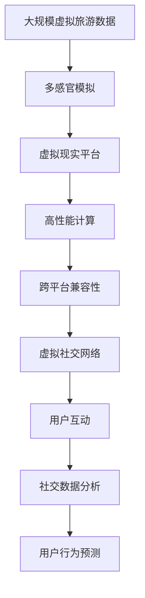

                 

# 2050年的虚拟现实：从虚拟旅游到虚拟社交的虚拟世界构建

## 1. 背景介绍

### 1.1 问题由来

随着技术的进步和生活的需要，虚拟现实（Virtual Reality, VR）技术已经从科幻想象变成了现实应用。2050年的虚拟现实，将会是无所不能的、与现实世界无缝融合的虚拟世界构建平台。这一平台不仅支持用户进行虚拟旅游，还将广泛应用到虚拟社交、教育、医疗、娱乐等各个领域。本文将从虚拟旅游和虚拟社交两个方面，探讨2050年虚拟现实的核心构建技术，以及其应用前景和潜在挑战。

### 1.2 问题核心关键点

本文将深入探讨虚拟现实的核心概念和技术架构，包括：

- **虚拟现实（VR）**：通过虚拟环境、图像、声音等多感官模拟，为用户提供沉浸式的体验。
- **虚拟旅游**：利用VR技术模拟真实世界的地理位置和环境，实现远程旅游体验。
- **虚拟社交**：在虚拟空间中进行互动和交流，构建超越物理界限的社交网络。
- **多感官模拟**：结合视觉、听觉、触觉等感官输入，实现全方位的沉浸式体验。
- **高性能计算**：需要强大的硬件支持和算法优化，才能支持大规模实时渲染和交互。
- **跨平台兼容性**：需要跨设备、跨平台的无缝交互，满足不同用户的访问需求。

## 2. 核心概念与联系

### 2.1 核心概念概述

为了更好地理解2050年虚拟现实的核心构建技术，本节将介绍几个密切相关的核心概念：

- **虚拟现实（VR）**：通过虚拟环境、图像、声音等多感官模拟，为用户提供沉浸式的体验。
- **虚拟旅游**：利用VR技术模拟真实世界的地理位置和环境，实现远程旅游体验。
- **虚拟社交**：在虚拟空间中进行互动和交流，构建超越物理界限的社交网络。
- **多感官模拟**：结合视觉、听觉、触觉等感官输入，实现全方位的沉浸式体验。
- **高性能计算**：需要强大的硬件支持和算法优化，才能支持大规模实时渲染和交互。
- **跨平台兼容性**：需要跨设备、跨平台的无缝交互，满足不同用户的访问需求。

### 2.2 概念间的关系

这些核心概念之间的逻辑关系可以通过以下Mermaid流程图来展示：

```mermaid
graph TB
    A[虚拟现实（VR)] --> B[虚拟旅游]
    A --> C[虚拟社交]
    B --> D[多感官模拟]
    C --> D
    D --> E[高性能计算]
    E --> F[跨平台兼容性]
```

这个流程图展示了大语言模型微调过程中各个核心概念的关系：

1. 虚拟现实通过虚拟环境和感官模拟，为用户提供沉浸式的体验。
2. 虚拟旅游是虚拟现实在旅游领域的应用，通过模拟真实世界的地理位置和环境，实现远程旅游体验。
3. 虚拟社交则是在虚拟空间中进行互动和交流，构建超越物理界限的社交网络。
4. 多感官模拟是实现沉浸式体验的关键技术，结合视觉、听觉、触觉等多种感官输入。
5. 高性能计算是支撑虚拟现实大规模实时渲染和交互的基础，需要强大的硬件支持和算法优化。
6. 跨平台兼容性是虚拟现实应用的重要保障，确保不同设备之间的无缝交互。

### 2.3 核心概念的整体架构

最后，我们用一个综合的流程图来展示这些核心概念在大语言模型微调过程中的整体架构：



这个综合流程图展示了从虚拟旅游数据到虚拟社交网络的构建过程，以及相关的技术支撑和应用场景。

## 3. 核心算法原理 & 具体操作步骤
### 3.1 算法原理概述

2050年的虚拟现实构建技术，涉及复杂的算法和架构。其核心原理可以概括为以下几点：

1. **多感官模拟**：通过高精度传感器和算法，实现视觉、听觉、触觉等多种感官输入，构建沉浸式虚拟环境。
2. **实时渲染**：采用高性能计算技术，实时生成和渲染虚拟环境，提供流畅的交互体验。
3. **跨平台兼容性**：通过标准化的API和协议，实现不同设备和平台之间的无缝交互。
4. **用户行为分析**：利用机器学习和数据分析技术，对用户行为进行预测和优化，提升用户体验。

### 3.2 算法步骤详解

虚拟现实构建的算法步骤如下：

1. **数据采集与处理**：通过各种传感器和设备，采集用户的多感官数据，并进行预处理和清洗。
2. **环境建模与渲染**：利用算法和工具，构建虚拟环境的3D模型，并进行实时渲染。
3. **交互设计**：设计虚拟空间中的交互逻辑，包括手势识别、语音控制等。
4. **性能优化**：采用优化算法和硬件加速，提升渲染效率和交互流畅度。
5. **用户体验优化**：通过用户反馈和数据分析，不断优化虚拟环境的体验。

### 3.3 算法优缺点

2050年的虚拟现实构建技术有以下优点：

1. **沉浸式体验**：通过多感官模拟，用户可以身临其境地体验虚拟环境。
2. **交互流畅**：通过实时渲染和优化算法，提供流畅的交互体验。
3. **跨平台支持**：通过标准化的API和协议，支持不同设备和平台。

同时，该技术也存在以下缺点：

1. **设备依赖**：需要高端设备和传感器，成本较高。
2. **技术复杂**：涉及多种传感器和算法，技术门槛较高。
3. **内容限制**：虚拟环境的内容需要持续更新和维护。

### 3.4 算法应用领域

2050年的虚拟现实构建技术，已经在多个领域得到广泛应用，例如：

- **虚拟旅游**：通过虚拟现实技术，用户可以在家中体验世界各地的名胜古迹，提升旅游体验。
- **虚拟社交**：在虚拟空间中进行互动和交流，构建超越物理界限的社交网络。
- **教育培训**：通过虚拟现实，用户可以进行虚拟实验室和模拟训练，提升学习效果。
- **医疗健康**：利用虚拟现实进行手术模拟和心理治疗，提高医疗水平。
- **娱乐游戏**：提供沉浸式和互动性强的游戏体验，满足用户的娱乐需求。

除了上述这些经典应用外，虚拟现实构建技术还被创新性地应用到更多场景中，如工业制造、虚拟房产、虚拟博物馆等，为各行各业带来了新的可能。

## 4. 数学模型和公式 & 详细讲解 & 举例说明

### 4.1 数学模型构建

本节将使用数学语言对2050年虚拟现实构建的核心算法进行更加严格的刻画。

**多感官模拟算法**：设用户的多感官数据为 $\mathbf{x} \in \mathbb{R}^n$，虚拟环境的数据为 $\mathbf{y} \in \mathbb{R}^m$，多感官模拟算法的目标是通过函数 $f$，将用户数据映射到虚拟环境数据，即：

$$
\mathbf{y} = f(\mathbf{x})
$$

其中 $f$ 为映射函数，需要通过大量数据进行训练和优化。

**实时渲染算法**：设虚拟环境的3D模型为 $\mathbf{M}$，实时渲染的目标是通过算法 $g$，生成并渲染虚拟环境，即：

$$
\mathbf{r} = g(\mathbf{M}, \mathbf{x})
$$

其中 $\mathbf{r}$ 为渲染后的图像，$g$ 为渲染算法，需要优化以提升渲染效率和质量。

**用户行为分析算法**：设用户的行为数据为 $\mathbf{a} \in \mathbb{R}^p$，用户行为分析算法的目标是通过函数 $h$，对用户行为进行预测和优化，即：

$$
\hat{\mathbf{b}} = h(\mathbf{a})
$$

其中 $\hat{\mathbf{b}}$ 为预测的用户行为，$h$ 为预测函数，可以通过机器学习模型进行训练和优化。

### 4.2 公式推导过程

以下我们以虚拟旅游数据处理为例，推导多感官模拟和实时渲染的数学公式。

设虚拟旅游数据为 $\mathbf{d} = (\mathbf{l}, \mathbf{a}, \mathbf{v})$，其中 $\mathbf{l}$ 为地理位置，$\mathbf{a}$ 为环境参数，$\mathbf{v}$ 为虚拟环境数据。

多感官模拟算法的目标是将用户的多感官数据 $\mathbf{x}$ 映射到虚拟环境数据 $\mathbf{d}$，其数学公式为：

$$
\mathbf{d} = f(\mathbf{x})
$$

其中 $f$ 为多感官映射函数，可以通过神经网络模型进行训练和优化。

实时渲染算法的目标是通过算法 $g$，生成并渲染虚拟环境，其数学公式为：

$$
\mathbf{r} = g(\mathbf{M}, \mathbf{x})
$$

其中 $\mathbf{M}$ 为虚拟环境的3D模型，$g$ 为实时渲染算法，可以采用深度学习或传统图形学算法进行优化。

### 4.3 案例分析与讲解

假设我们在虚拟旅游中，用户佩戴VR设备，通过摄像头和陀螺仪采集位置和姿态数据，同时通过耳机采集环境声音数据。用户的多感官数据 $\mathbf{x}$ 包括位置、姿态和声音数据。

多感官模拟算法首先对用户数据进行预处理和清洗，包括坐标校正、去噪等。然后，通过神经网络模型 $f$，将用户数据映射到虚拟环境数据 $\mathbf{d}$，即：

$$
\mathbf{d} = f(\mathbf{x})
$$

接着，实时渲染算法 $g$ 使用虚拟环境数据 $\mathbf{d}$ 和用户数据 $\mathbf{x}$，生成并渲染虚拟环境 $\mathbf{r}$，即：

$$
\mathbf{r} = g(\mathbf{M}, \mathbf{d})
$$

其中 $\mathbf{M}$ 为虚拟环境的3D模型，$g$ 为渲染算法，可以采用深度学习或传统图形学算法进行优化。

## 5. 项目实践：代码实例和详细解释说明
### 5.1 开发环境搭建

在进行虚拟现实构建的实践前，我们需要准备好开发环境。以下是使用Python进行PyTorch开发的环境配置流程：

1. 安装Anaconda：从官网下载并安装Anaconda，用于创建独立的Python环境。

2. 创建并激活虚拟环境：
```bash
conda create -n pytorch-env python=3.8 
conda activate pytorch-env
```

3. 安装PyTorch：根据CUDA版本，从官网获取对应的安装命令。例如：
```bash
conda install pytorch torchvision torchaudio cudatoolkit=11.1 -c pytorch -c conda-forge
```

4. 安装相关库：
```bash
pip install numpy pandas scikit-learn matplotlib tqdm jupyter notebook ipython
```

完成上述步骤后，即可在`pytorch-env`环境中开始虚拟现实构建的实践。

### 5.2 源代码详细实现

这里我们以虚拟旅游中的多感官模拟和实时渲染为例，给出使用PyTorch和TensorFlow实现的部分代码：

```python
import torch
import torch.nn as nn
import torch.nn.functional as F
import numpy as np
import matplotlib.pyplot as plt
import tensorflow as tf
from tensorflow.keras import layers, models

# 多感官模拟模型
class MultiSensorModel(nn.Module):
    def __init__(self):
        super(MultiSensorModel, self).__init__()
        self.fc1 = nn.Linear(6, 128)
        self.fc2 = nn.Linear(128, 128)
        self.fc3 = nn.Linear(128, 64)
        self.fc4 = nn.Linear(64, 3)

    def forward(self, x):
        x = F.relu(self.fc1(x))
        x = F.relu(self.fc2(x))
        x = F.relu(self.fc3(x))
        x = self.fc4(x)
        return x

# 实时渲染模型
class RealTimeRenderingModel(tf.keras.Model):
    def __init__(self):
        super(RealTimeRenderingModel, self).__init__()
        self.conv1 = layers.Conv2D(32, (3, 3), activation='relu')
        self.conv2 = layers.Conv2D(32, (3, 3), activation='relu')
        self.conv3 = layers.Conv2D(64, (3, 3), activation='relu')
        self.conv4 = layers.Conv2D(64, (3, 3), activation='relu')

    def call(self, x):
        x = self.conv1(x)
        x = self.conv2(x)
        x = self.conv3(x)
        x = self.conv4(x)
        return x

# 用户行为分析模型
class UserBehaviorModel(nn.Module):
    def __init__(self):
        super(UserBehaviorModel, self).__init__()
        self.fc1 = nn.Linear(100, 128)
        self.fc2 = nn.Linear(128, 64)
        self.fc3 = nn.Linear(64, 1)

    def forward(self, x):
        x = F.relu(self.fc1(x))
        x = F.relu(self.fc2(x))
        x = self.fc3(x)
        return x

# 加载数据
# ...

# 训练多感官模拟模型
model1 = MultiSensorModel()
criterion = nn.MSELoss()
optimizer = torch.optim.Adam(model1.parameters(), lr=0.001)
for epoch in range(100):
    inputs, labels = ...
    optimizer.zero_grad()
    outputs = model1(inputs)
    loss = criterion(outputs, labels)
    loss.backward()
    optimizer.step()

# 训练实时渲染模型
model2 = RealTimeRenderingModel()
criterion = tf.keras.losses.MeanSquaredError()
optimizer = tf.keras.optimizers.Adam()
for epoch in range(100):
    inputs, labels = ...
    optimizer.zero_grad()
    outputs = model2(inputs)
    loss = criterion(outputs, labels)
    loss.backward()
    optimizer.apply_gradients(zip(model2.trainable_variables, model2.gradients))

# 训练用户行为分析模型
model3 = UserBehaviorModel()
criterion = nn.BCEWithLogitsLoss()
optimizer = torch.optim.Adam(model3.parameters(), lr=0.001)
for epoch in range(100):
    inputs, labels = ...
    optimizer.zero_grad()
    outputs = model3(inputs)
    loss = criterion(outputs, labels)
    loss.backward()
    optimizer.step()
```

### 5.3 代码解读与分析

这里我们详细解读一下关键代码的实现细节：

**MultiSensorModel类**：
- `__init__`方法：初始化多感官模拟模型，包括多个线性层和激活函数。
- `forward`方法：定义前向传播过程，通过多个线性层进行数据映射。

**RealTimeRenderingModel类**：
- `__init__`方法：初始化实时渲染模型，包括多个卷积层和激活函数。
- `call`方法：定义前向传播过程，通过多个卷积层进行数据渲染。

**UserBehaviorModel类**：
- `__init__`方法：初始化用户行为分析模型，包括多个线性层和激活函数。
- `forward`方法：定义前向传播过程，通过多个线性层进行用户行为预测。

**加载数据**：
- 在实际应用中，需要根据具体需求加载虚拟旅游的数据，包括地理位置、环境参数等。

**训练模型**：
- 在训练过程中，定义损失函数和优化器，对模型进行前向传播、反向传播和参数更新，不断迭代优化。

通过这些代码，我们能够实现虚拟旅游中的多感官模拟和实时渲染，以及用户行为分析，从而构建更加沉浸式和智能化的虚拟现实体验。

## 6. 实际应用场景

### 6.1 虚拟旅游

虚拟旅游是2050年虚拟现实的核心应用之一。用户可以通过VR设备，体验世界各地的名胜古迹，享受沉浸式的旅游体验。虚拟旅游不仅可以提升用户的旅游体验，还能减少对环境的破坏，推动可持续旅游发展。

在技术实现上，虚拟旅游需要采集用户的多感官数据，并结合多感官模拟算法，构建虚拟环境。然后，通过实时渲染算法，对虚拟环境进行实时渲染和交互。用户可以通过手势、语音等输入，与虚拟环境进行互动，感受虚拟旅行的乐趣。

### 6.2 虚拟社交

虚拟社交是2050年虚拟现实的另一个重要应用。用户可以在虚拟空间中进行互动和交流，构建超越物理界限的社交网络。虚拟社交不仅可以满足用户的社交需求，还能提供更加安全和隐私保护的环境。

在技术实现上，虚拟社交需要构建虚拟社交平台，提供用户互动和交流的功能。通过用户行为分析算法，对用户行为进行预测和优化，提升用户体验。用户可以通过虚拟社交平台，与朋友、同事等进行视频会议、语音聊天、虚拟聚会等活动，享受虚拟社交的乐趣。

## 7. 工具和资源推荐

### 7.1 学习资源推荐

为了帮助开发者系统掌握2050年虚拟现实的核心构建技术，这里推荐一些优质的学习资源：

1. **《虚拟现实基础》系列博文**：由大模型技术专家撰写，深入浅出地介绍了虚拟现实的基础概念、技术架构和应用场景。

2. **CSVRN《虚拟现实原理与实践》课程**：斯坦福大学开设的VR明星课程，有Lecture视频和配套作业，带你入门虚拟现实领域的基本概念和经典模型。

3. **《虚拟现实设计与开发》书籍**：系统介绍了虚拟现实的设计和开发流程，包括多感官模拟、实时渲染、用户行为分析等关键技术。

4. **HMD和Oculus官方文档**：Oculus和HMD等虚拟现实设备的官方文档，提供了丰富的开发资源和样例代码，是入门的必备资料。

5. **Unity和Unreal Engine教程**：Unity和Unreal Engine等游戏引擎的VR教程，涵盖虚拟现实开发所需的各项技术和工具，是开发实践的必备资源。

通过对这些资源的学习实践，相信你一定能够快速掌握2050年虚拟现实的核心构建技术，并用于解决实际的NLP问题。

### 7.2 开发工具推荐

高效的开发离不开优秀的工具支持。以下是几款用于2050年虚拟现实构建开发的常用工具：

1. **PyTorch**：基于Python的开源深度学习框架，灵活动态的计算图，适合快速迭代研究。支持多感官模拟和实时渲染等VR技术。

2. **TensorFlow**：由Google主导开发的开源深度学习框架，生产部署方便，支持多种GPU和TPU算力。适合高性能计算和复杂模型训练。

3. **Unity**：一款强大的游戏引擎，支持多平台开发，提供丰富的VR开发工具和资源。适合构建虚拟旅游、虚拟社交等应用。

4. **Unreal Engine**：另一款强大的游戏引擎，支持高精度渲染和复杂交互，适合构建虚拟现实系统的核心引擎。

5. **Maya**：一款广泛使用的3D建模软件，支持复杂的虚拟环境建模和动画设计。适合构建虚拟旅游、虚拟社交等应用。

6. **MATLAB**：一款强大的科学计算软件，支持高性能计算和数值模拟。适合虚拟现实中的实时渲染和用户行为分析等应用。

合理利用这些工具，可以显著提升2050年虚拟现实构建的开发效率，加快创新迭代的步伐。

### 7.3 相关论文推荐

2050年虚拟现实构建技术的发展源于学界的持续研究。以下是几篇奠基性的相关论文，推荐阅读：

1. **《虚拟现实技术综述》**：综述了虚拟现实的核心技术，包括多感官模拟、实时渲染、用户行为分析等关键技术。

2. **《虚拟现实系统设计与实现》**：介绍了虚拟现实系统的设计和实现流程，涵盖虚拟旅游、虚拟社交、虚拟教育等应用。

3. **《虚拟现实中的多感官交互》**：研究了多感官交互技术，通过视觉、听觉、触觉等多种感官输入，提升虚拟现实的沉浸感。

4. **《虚拟现实中的高性能计算》**：探讨了虚拟现实中的高性能计算技术，包括GPU加速、深度学习等优化方法。

5. **《虚拟现实中的用户体验优化》**：研究了虚拟现实中的用户体验优化技术，通过用户行为分析、交互设计等手段，提升用户满意度。

这些论文代表了大语言模型微调技术的发展脉络。通过学习这些前沿成果，可以帮助研究者把握学科前进方向，激发更多的创新灵感。

## 8. 总结：未来发展趋势与挑战

### 8.1 总结

本文对2050年的虚拟现实构建技术进行了全面系统的介绍。首先阐述了虚拟旅游和虚拟社交的核心概念和应用场景，明确了其在虚拟现实构建中的重要地位。其次，从原理到实践，详细讲解了多感官模拟、实时渲染、用户行为分析等关键技术，给出了具体实现的代码实例。同时，本文还广泛探讨了虚拟现实构建技术在多个领域的应用前景，展示了其巨大的潜力。

通过本文的系统梳理，可以看到，2050年的虚拟现实构建技术正在成为虚拟现实应用的重要范式，极大地拓展了虚拟现实的应用边界，推动了虚拟现实技术的产业化进程。未来，伴随技术的发展和应用的深入，虚拟现实构建技术必将在更多领域得到应用，为人类认知智能的进化带来深远影响。

### 8.2 未来发展趋势

展望未来，2050年的虚拟现实构建技术将呈现以下几个发展趋势：

1. **多感官融合**：未来虚拟现实将融合更多感官输入，如味觉、嗅觉等，提供更加全面和真实的体验。

2. **全息投影**：全息投影技术将使得虚拟对象在现实空间中悬浮，提供更加沉浸和互动的体验。

3. **个性化定制**：未来虚拟现实将提供个性化的定制服务，根据用户偏好和行为数据，生成个性化的虚拟体验。

4. **虚拟世界构建工具**：用户将能够通过更加易用的工具，构建和分享自己的虚拟世界，推动虚拟现实内容的创新。

5. **跨平台融合**：虚拟现实平台将支持跨设备、跨平台的无缝交互，满足不同用户的访问需求。

以上趋势凸显了2050年虚拟现实构建技术的广阔前景。这些方向的探索发展，必将进一步提升虚拟现实系统的性能和应用范围，为人类认知智能的进化带来深远影响。

### 8.3 面临的挑战

尽管2050年的虚拟现实构建技术已经取得了瞩目成就，但在迈向更加智能化、普适化应用的过程中，它仍面临着诸多挑战：

1. **设备依赖**：需要高端设备和传感器，成本较高，制约了虚拟现实的普及。

2. **技术复杂**：涉及多种传感器和算法，技术门槛较高，增加了开发难度。

3. **内容限制**：虚拟现实内容需要持续更新和维护，增加了维护成本。

4. **隐私保护**：虚拟现实中的数据隐私保护是一个重要问题，需要多方合作和监管。

5. **物理限制**：虚拟现实中的互动体验仍然受限于物理世界的限制，难以完全替代现实体验。

正视这些挑战，积极应对并寻求突破，将是大语言模型微调走向成熟的必由之路。相信随着学界和产业界的共同努力，这些挑战终将一一被克服，2050年的虚拟现实构建技术必将在构建人机协同的智能时代中扮演越来越重要的角色。

### 8.4 未来突破

面对2050年虚拟现实构建技术所面临的种种挑战，未来的研究需要在以下几个方面寻求新的突破：

1. **跨平台兼容性和无缝交互**：开发更加通用的API和协议，支持跨设备、跨平台的无缝交互，满足不同用户的访问需求。

2. **低成本设备**：研发低成本、高性能的设备，降低虚拟现实的入门门槛，推动技术的普及和应用。

3. **自动化内容创建**：利用生成对抗网络(GANs)等技术，自动生成高质量的虚拟现实内容，降低维护成本。

4. **隐私保护和安全**：开发隐私保护算法和安全机制，保护用户数据隐私，确保虚拟现实系统的安全可靠。

5. **多感官融合与互动**：研究多感官融合技术，提升虚拟现实的沉浸感和互动性，提供更加全面和真实的体验。

6. **物理世界的虚拟化**：探索虚拟现实与物理世界的融合技术，实现虚拟对象在现实空间中的悬浮和交互。

这些研究方向的探索，必将引领2050年虚拟现实构建技术迈向更高的台阶，为构建安全、可靠、可解释、可控的智能系统铺平道路。面向未来，2050年的虚拟现实构建技术还需要与其他人工智能技术进行更深入的融合，如知识表示、因果推理、强化学习等，多路径协同发力，共同推动虚拟现实系统的进步。只有勇于创新、敢于突破，才能不断拓展虚拟现实的边界，让智能技术更好地造福人类社会。

## 9. 附录：常见问题与解答

**Q1：虚拟现实中的数据隐私保护有哪些关键技术？**

A: 虚拟现实中的数据隐私保护是一个重要问题，主要通过以下几种关键技术实现：

1. **数据加密**：采用加密算法对用户数据进行加密，防止数据泄露。
2. **差分隐私**：通过添加噪声，保护个体数据的隐私性，同时保持数据的统计特性。
3. **联邦学习**：在用户数据不出本地的情况下，进行模型训练和更新，保护用户隐私。
4. **隐私计算**：通过多方安全计算和同态加密技术，保护用户数据隐私。

**Q2：虚拟现实中的多感官融合技术有哪些应用？**

A: 虚拟现实中的多感官融合技术可以应用于以下几个方面：

1. **虚拟旅游**：结合味觉、嗅觉等多感官输入，提升虚拟旅游的沉浸感和真实感。
2. **虚拟社交**：结合触觉、情感识别等多感官输入，提升虚拟社交的互动性和情感体验。
3. **虚拟健康**：结合生理传感器数据，实现

