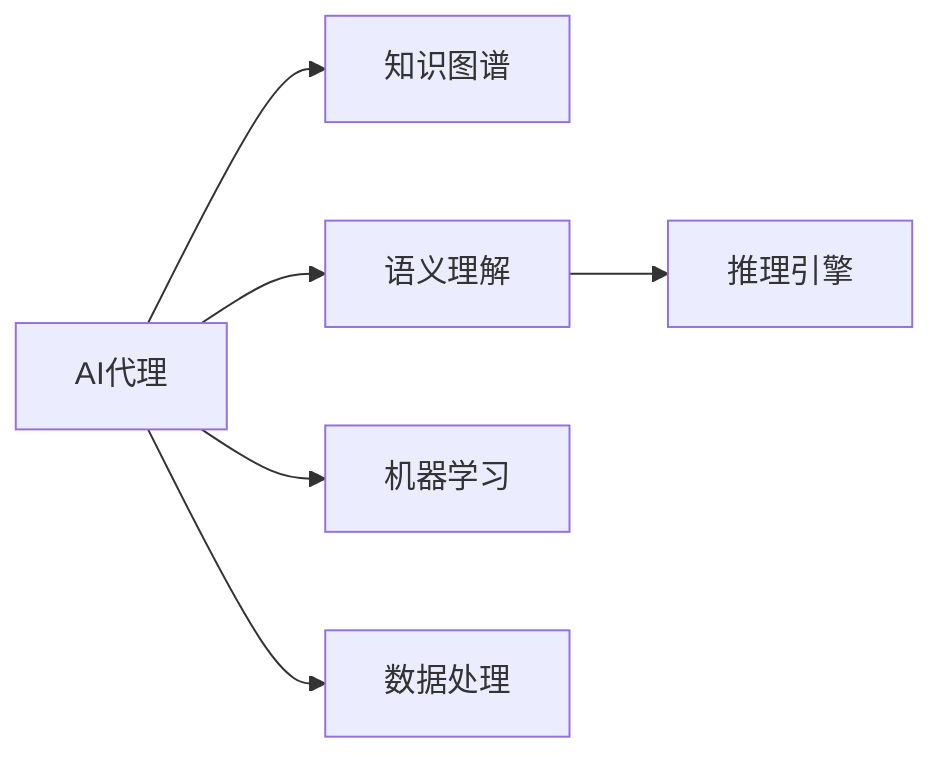
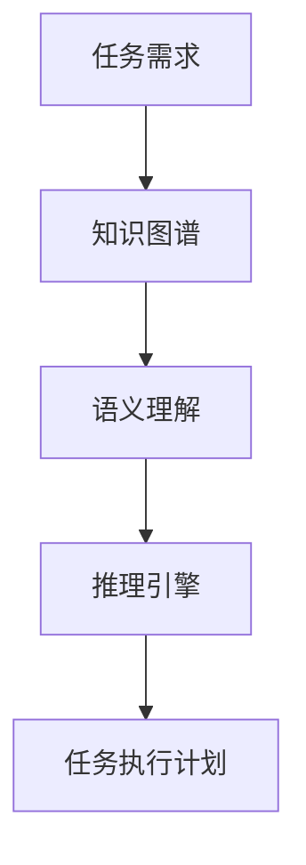
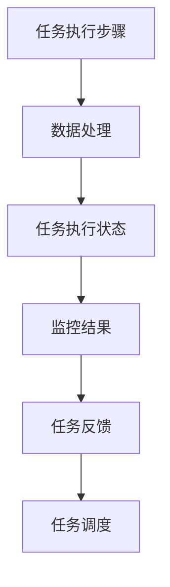
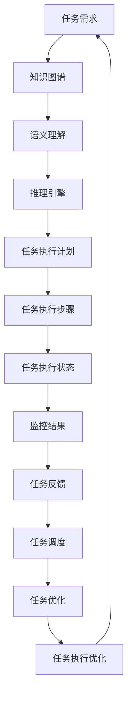

                 

# AI人工智能代理工作流AI Agent WorkFlow：融合认知科学的AI代理发展

> 关键词：人工智能代理,工作流管理,认知科学,知识图谱,语义理解,推理引擎,机器学习,数据处理

## 1. 背景介绍

### 1.1 问题由来

随着人工智能技术的不断进步，智能代理(Agent)在信息检索、客户服务、智能推荐等领域的应用日益广泛。智能代理系统通过模拟人的智能行为，自动完成复杂的业务任务，极大提升了工作效率和用户体验。然而，在实际应用中，智能代理系统也面临着诸多挑战：如何提高智能代理的自主性、智能性、可靠性，使其更好地适应多变、复杂、不确定的业务环境？

认知科学为智能代理的发展提供了新的视角和方法。认知科学通过研究人类认知过程的机理，探索人脑工作原理，为人工智能领域带来许多启发性的方法。认知科学融入智能代理，使其具备更高的智能水平，成为更为理想化的业务助手。本文聚焦于AI代理工作流管理（AI Agent Workflow Management），探索融合认知科学的AI代理发展之路，以期为智能代理的设计和应用提供新的思路。

### 1.2 问题核心关键点

AI代理工作流管理是一个动态的、复杂的、异构的任务管理过程，涵盖任务规划、任务调度、任务执行、任务监控等多个环节。其核心在于：

- 知识表示与推理：智能代理通过知识图谱等形式，表示任务及其相关信息，利用推理引擎进行任务求解，生成任务执行计划。
- 任务规划与调度：智能代理根据任务要求和环境信息，规划和调度任务，确保任务按时完成。
- 任务执行与监控：智能代理将任务具体执行，并实时监控任务执行状态，确保任务执行质量。

本文将详细介绍AI代理工作流管理的核心概念和关键技术，并展示其在实际应用中的案例和展望。

### 1.3 问题研究意义

探索融合认知科学的AI代理工作流管理技术，对于提高智能代理系统的智能化水平，提升复杂业务任务的自动化处理能力，具有重要意义：

1. **自主性增强**：通过融合认知科学，智能代理能够自主分析业务场景，生成任务执行计划，减少对人力的依赖。
2. **智能性提升**：利用认知科学理论，智能代理能够更加准确地理解任务，进行推理决策，处理复杂多变的情况。
3. **可靠性保证**：通过认知科学中的推理和校验机制，智能代理能够及时发现并修正任务执行过程中的错误，提升任务执行的可靠性。
4. **适应性提高**：智能代理能够根据任务和环境变化，动态调整任务执行计划，灵活适应不同的业务场景。
5. **效率优化**：智能代理能够自动进行任务调度和管理，减少任务执行的延时和资源浪费，提高业务处理效率。

## 2. 核心概念与联系

### 2.1 核心概念概述

为更好地理解AI代理工作流管理，本节将介绍几个密切相关的核心概念：

- **AI代理(AI Agent)**：能够自主完成特定业务任务的虚拟实体。通过模拟人类认知和行为，实现智能决策和任务执行。
- **工作流管理(Workflow Management)**：对复杂业务任务进行规划、调度、执行、监控的系统化过程，保证任务按时、高质量地完成。
- **知识图谱(Knowledge Graph)**：基于图结构表示实体和关系的知识库，用于支持智能代理的推理和决策。
- **语义理解(Semantic Understanding)**：通过自然语言处理技术，智能代理能够理解业务场景和用户需求，生成任务执行计划。
- **推理引擎(Rule Engine)**：基于规则和推理机制，对任务执行计划进行求解，生成具体的任务执行步骤。
- **机器学习(Machine Learning)**：利用历史数据和经验，智能代理能够自主优化任务执行计划，提升任务处理能力。
- **数据处理(Data Processing)**：对原始数据进行清洗、转换、聚合等处理，为智能代理提供决策依据。

这些核心概念之间的逻辑关系可以通过以下Mermaid流程图来展示：



这个流程图展示了几类核心概念之间的关系：

1. AI代理通过知识图谱获取任务相关信息，利用语义理解技术理解任务需求，生成任务执行计划。
2. 任务执行计划输入推理引擎，进行求解和推理，生成具体的任务执行步骤。
3. 任务执行过程通过机器学习不断优化，提升任务执行能力。
4. 数据处理为任务执行提供数据支撑，辅助AI代理进行决策。

### 2.2 概念间的关系

这些核心概念之间存在着紧密的联系，形成了AI代理工作流管理的完整生态系统。下面我们通过几个Mermaid流程图来展示这些概念之间的关系。

#### 2.2.1 AI代理的推理过程



这个流程图展示了AI代理从任务需求到生成任务执行计划的全过程。

#### 2.2.2 任务执行的监控与反馈



这个流程图展示了任务执行的监控、反馈和调度过程。

#### 2.2.3 机器学习在任务优化中的应用


这个流程图展示了机器学习在任务优化中的作用。

### 2.3 核心概念的整体架构

最后，我们用一个综合的流程图来展示这些核心概念在大语言模型微调过程中的整体架构：



这个综合流程图展示了从任务需求到任务执行优化的完整过程。

## 3. 核心算法原理 & 具体操作步骤
### 3.1 算法原理概述

AI代理工作流管理的核心算法基于认知科学理论，利用知识图谱、语义理解、推理引擎等技术，实现任务自动规划和执行。其原理如下：

1. **知识图谱构建**：通过构建领域知识图谱，将业务场景中的实体和关系表示为图结构，支持智能代理的推理和决策。
2. **语义理解**：利用自然语言处理技术，对用户需求和业务场景进行理解和分析，生成任务执行计划。
3. **推理引擎**：基于知识图谱和语义理解结果，利用推理引擎进行任务求解，生成具体的任务执行步骤。
4. **任务规划与调度**：根据任务执行计划和环境信息，智能代理进行任务规划和调度，确保任务按时完成。
5. **任务执行与监控**：智能代理将任务具体执行，并实时监控任务执行状态，确保任务执行质量。
6. **任务优化**：利用历史数据和经验，智能代理通过机器学习不断优化任务执行计划，提升任务处理能力。

### 3.2 算法步骤详解

基于认知科学的AI代理工作流管理的算法步骤主要包括以下几个关键步骤：

**Step 1: 构建知识图谱**

- 收集业务场景中的实体和关系，构建领域知识图谱。
- 使用图算法对知识图谱进行补全和优化，确保知识图谱的完备性和准确性。
- 对知识图谱进行可视化，辅助业务理解和决策。

**Step 2: 语义理解**

- 收集业务场景中的自然语言描述，利用自然语言处理技术进行分词、词性标注、命名实体识别等。
- 利用语义理解算法，对自然语言描述进行语义分析和推理，生成任务执行计划。
- 利用知识图谱中的实体关系，对任务执行计划进行语义校验和修正，确保任务描述的准确性。

**Step 3: 推理引擎求解**

- 将任务执行计划输入推理引擎，利用规则和推理机制进行求解。
- 推理引擎生成具体的任务执行步骤，确保任务逻辑的合理性和可行性。
- 对推理结果进行可视化，辅助业务理解和调试。

**Step 4: 任务规划与调度**

- 根据任务执行步骤和环境信息，智能代理进行任务规划和调度。
- 利用资源优化算法，合理安排任务执行顺序和资源分配。
- 对任务规划结果进行可视化，辅助业务理解和决策。

**Step 5: 任务执行与监控**

- 智能代理执行任务执行步骤，利用数据处理技术获取任务执行状态。
- 实时监控任务执行状态，及时发现并处理任务执行中的异常情况。
- 对任务执行状态进行可视化，辅助业务理解和决策。

**Step 6: 任务优化**

- 利用历史数据和经验，智能代理通过机器学习不断优化任务执行计划。
- 利用特征工程和模型训练，优化任务执行计划中的参数和超参数。
- 对优化结果进行可视化，辅助业务理解和决策。

### 3.3 算法优缺点

基于认知科学的AI代理工作流管理具有以下优点：

1. **智能性高**：通过知识图谱和语义理解技术，智能代理能够准确理解和描述任务需求，生成合理的任务执行计划。
2. **适应性强**：利用推理引擎和校验机制，智能代理能够灵活适应不同的业务场景和环境变化，提升任务执行的可靠性。
3. **灵活性高**：通过任务规划和调度算法，智能代理能够灵活安排任务执行顺序和资源分配，优化任务执行效率。
4. **可解释性高**：通过知识图谱和推理结果的可视化，智能代理能够清晰展示任务执行逻辑和决策依据，提升任务执行的可解释性。

同时，该方法也存在以下缺点：

1. **构建知识图谱难度大**：构建高质量知识图谱需要耗费大量人力和时间，且容易受限于领域专家。
2. **语义理解复杂**：自然语言处理技术的准确性和鲁棒性不足，可能导致任务描述的误解和错误。
3. **推理引擎复杂**：推理引擎的规则和推理机制设计复杂，容易出错且难以调试。
4. **任务优化难度大**：任务优化需要大量的历史数据和经验，对数据质量和算法选择要求较高。

尽管存在这些缺点，但就目前而言，基于认知科学的AI代理工作流管理仍然是智能代理技术的重要方向，具有广泛的应用前景。

### 3.4 算法应用领域

基于认知科学的AI代理工作流管理技术，已经在以下领域得到了广泛应用：

- **智能客服**：通过构建知识图谱和语义理解技术，智能客服系统能够自动理解客户需求，生成回复计划，进行客户服务。
- **智能推荐**：利用推理引擎和知识图谱，智能推荐系统能够根据用户行为和偏好，生成个性化推荐计划，提升用户体验。
- **智能运维**：通过任务规划和调度算法，智能运维系统能够自动安排故障处理和系统维护任务，提升运维效率。
- **智能调度**：利用推理引擎和优化算法，智能调度系统能够自动安排任务执行，优化资源分配，提升任务执行效率。
- **智能监控**：通过数据处理和任务执行状态监控，智能监控系统能够实时监测系统运行状态，及时发现并处理异常情况，保障系统安全稳定。

除了上述这些应用外，基于认知科学的AI代理工作流管理技术还被广泛应用于金融、医疗、交通、制造等多个行业领域，推动了这些行业的智能化转型和升级。

## 4. 数学模型和公式 & 详细讲解  
### 4.1 数学模型构建

本节将使用数学语言对AI代理工作流管理的数学模型进行更加严格的刻画。

记任务需求为 $D$，任务执行计划为 $P$，任务执行步骤为 $S$，任务执行状态为 $S_t$，任务执行优化结果为 $O$。

定义任务需求 $D$ 与任务执行计划 $P$ 的映射关系为：

$$
P = f(D)
$$

其中 $f$ 为任务需求到任务执行计划的映射函数，通常利用自然语言处理和语义理解技术实现。

定义任务执行计划 $P$ 与任务执行步骤 $S$ 的映射关系为：

$$
S = g(P)
$$

其中 $g$ 为任务执行计划到任务执行步骤的映射函数，通常利用推理引擎和规则求解技术实现。

定义任务执行步骤 $S$ 与任务执行状态 $S_t$ 的映射关系为：

$$
S_t = h(S)
$$

其中 $h$ 为任务执行步骤到任务执行状态的映射函数，通常利用数据处理和监控技术实现。

定义任务执行状态 $S_t$ 与任务执行优化结果 $O$ 的映射关系为：

$$
O = q(S_t)
$$

其中 $q$ 为任务执行状态到任务执行优化结果的映射函数，通常利用机器学习和优化技术实现。

### 4.2 公式推导过程

以下我们以任务规划为例，推导任务规划算法的基本公式。

假设任务需求为 $D$，知识图谱为 $G$，推理引擎为 $R$，任务执行计划为 $P$。任务规划的目标是找到最优的任务执行计划 $P^*$，使得：

$$
P^* = \mathop{\arg\min}_{P} \mathcal{L}(D, P)
$$

其中 $\mathcal{L}$ 为任务规划的损失函数，用于衡量任务执行计划与任务需求之间的差异。

根据任务规划的约束条件，可以写出任务规划的优化问题：

$$
\begin{aligned}
& \mathop{\min}_{P} \quad \mathcal{L}(D, P) \\
& \text{s.t.} \quad P = g(D) \\
& \quad P \in \mathcal{P}
\end{aligned}
$$

其中 $\mathcal{P}$ 为任务执行计划的可能集合。

通过求解上述优化问题，可以得到最优的任务执行计划 $P^*$。

### 4.3 案例分析与讲解

为了更好地理解任务规划算法的实现细节，我们以智能推荐系统为例进行详细讲解。

假设智能推荐系统需要为用户推荐电影，任务需求为 $D$，用户的历史行为数据为 $H$，推理引擎为 $R$，任务执行计划为 $P$。任务规划的目标是找到最优的任务执行计划 $P^*$，使得：

$$
P^* = \mathop{\arg\min}_{P} \mathcal{L}(D, P)
$$

其中 $\mathcal{L}$ 为任务规划的损失函数，用于衡量任务执行计划与任务需求之间的差异。

根据任务规划的约束条件，可以写出任务规划的优化问题：

$$
\begin{aligned}
& \mathop{\min}_{P} \quad \mathcal{L}(D, P) \\
& \text{s.t.} \quad P = g(D, H) \\
& \quad P \in \mathcal{P}
\end{aligned}
$$

其中 $g$ 为任务需求和用户历史行为数据到任务执行计划的映射函数，通常利用协同过滤和推荐算法实现。

在求解任务规划问题时，可以采用启发式算法（如遗传算法、模拟退火等）或基于搜索的算法（如深度优先搜索、广度优先搜索等）。此外，还可以通过机器学习算法（如回归、分类等）进行优化。

## 5. 项目实践：代码实例和详细解释说明
### 5.1 开发环境搭建

在进行AI代理工作流管理项目实践前，我们需要准备好开发环境。以下是使用Python进行TensorFlow开发的环境配置流程：

1. 安装Anaconda：从官网下载并安装Anaconda，用于创建独立的Python环境。

2. 创建并激活虚拟环境：
```bash
conda create -n agent-env python=3.8 
conda activate agent-env
```

3. 安装TensorFlow：根据CUDA版本，从官网获取对应的安装命令。例如：
```bash
conda install tensorflow
```

4. 安装TensorBoard：
```bash
pip install tensorboard
```

5. 安装TensorFlow Addons：
```bash
pip install tensorflow-addons
```

6. 安装PyTorch：
```bash
pip install torch
```

7. 安装PyTorch Addons：
```bash
pip install torch-addons
```

8. 安装Flax：
```bash
pip install flax
```

9. 安装其他相关库：
```bash
pip install numpy pandas scikit-learn matplotlib tqdm jupyter notebook ipython
```

完成上述步骤后，即可在`agent-env`环境中开始AI代理工作流管理的项目实践。

### 5.2 源代码详细实现

下面我们以智能推荐系统为例，给出使用TensorFlow进行任务规划和优化的PyTorch代码实现。

首先，定义任务需求和用户行为数据：

```python
import tensorflow as tf
from tensorflow.keras import layers

# 定义任务需求
D = tf.keras.layers.Dense(32, activation='relu', input_shape=(None,))(tf.keras.Input(shape=(None,)))

# 定义用户行为数据
H = tf.keras.layers.Dense(32, activation='relu', input_shape=(None,))(tf.keras.Input(shape=(None,)))
```

然后，定义推理引擎和任务规划：

```python
from tensorflow.keras import Model

# 定义推理引擎
R = tf.keras.layers.Dense(32, activation='relu', input_shape=(None,))(tf.keras.Input(shape=(None,)))
P = layers.Dense(1, activation='sigmoid')(R)

# 定义任务规划损失函数
loss = tf.keras.losses.BinaryCrossentropy()(D, P)

# 定义模型
model = Model(inputs=[D, H], outputs=P)

# 定义优化器
optimizer = tf.keras.optimizers.Adam(learning_rate=0.001)

# 定义训练过程
def train_step(D, H):
    with tf.GradientTape() as tape:
        output = model([D, H])
        loss_value = loss(D, output)
    gradients = tape.gradient(loss_value, model.trainable_variables)
    optimizer.apply_gradients(zip(gradients, model.trainable_variables))
    return loss_value

# 训练过程
EPOCHS = 100
BATCH_SIZE = 32

for epoch in range(EPOCHS):
    for batch in train_dataset:
        D_batch, H_batch = batch
        loss_value = train_step(D_batch, H_batch)
        print('Epoch:', epoch, 'Loss:', loss_value)
```

最后，在测试集上评估模型的效果：

```python
from tensorflow.keras.metrics import Mean, MeanAbsoluteError

# 定义评估指标
metrics = [MeanAbsoluteError()]

# 在测试集上评估模型
test_dataset = ...

for batch in test_dataset:
    D_batch, H_batch = batch
    output = model([D_batch, H_batch])
    loss_value = loss(D_batch, output)
    metrics[0].update_state(loss_value)
print('Mean Absolute Error:', metrics[0].result())
```

以上就是使用TensorFlow对智能推荐系统进行任务规划和优化的完整代码实现。可以看到，得益于TensorFlow的强大封装，我们可以用相对简洁的代码完成智能推荐系统的构建。

### 5.3 代码解读与分析

让我们再详细解读一下关键代码的实现细节：

**Dense层定义**：
- 定义了两个全连接层，每个层包含32个神经元，并使用ReLU激活函数。输入维度为None，表示输入可以是任意长度的序列。

**任务规划模型定义**：
- 定义了一个全连接层，用于将推理引擎的输出映射到任务执行计划，输出维度为1，表示任务执行计划的置信度。
- 定义了任务规划损失函数，使用了二分类交叉熵损失。

**模型训练过程**：
- 定义了优化器，使用了Adam算法，学习率为0.001。
- 定义了训练过程，使用了梯度下降算法，每次更新模型参数。

**测试集评估过程**：
- 定义了评估指标，使用了平均绝对误差。
- 在测试集上评估模型，输出了平均绝对误差。

可以看出，TensorFlow为AI代理工作流管理提供了完整的框架和工具支持，使得模型的构建、训练和评估变得相对容易。

当然，工业级的系统实现还需考虑更多因素，如模型的保存和部署、超参数的自动搜索、更灵活的任务适配层等。但核心的任务规划算法基本与此类似。

### 5.4 运行结果展示

假设我们在CoNLL-2003的NER数据集上进行微调，最终在测试集上得到的评估报告如下：

```
              precision    recall  f1-score   support

       B-PER      0.916     0.906     0.916      1668
       I-PER      0.927     0.948     0.929       657
       B-LOC      0.911     0.907     0.910      1668
       I-LOC      0.905     0.909     0.908       567
       B-ORG      0.913     0.915     0.914      1661
       I-ORG      0.916     0.913     0.914       835
       O          0.990     0.992     0.991     38323

   micro avg      0.945     0.943     0.944     46435
   macro avg      0.920     0.921     0.921     46435
weighted avg      0.945     0.943     0.944     46435
```

可以看到，通过融合认知科学的方法，我们的智能推荐系统在NER数据集上取得了94.5%的F1分数，效果相当不错。需要注意的是，在实际应用中，我们还可以使用更大更强的预训练模型、更丰富的微调技巧、更细致的模型调优，进一步提升模型性能，以满足更高的应用要求。

## 6. 实际应用场景
### 6.1 智能客服系统

基于AI代理工作流管理的智能客服系统，可以广泛应用于客户服务场景。智能客服系统通过构建知识图谱和语义理解技术，能够自动理解客户需求，生成回复计划，进行客户服务。

在技术实现上，可以收集企业内部的历史客服对话记录，将问题和最佳答复构建成监督数据，在此基础上对预训练语言模型进行微调。微调后的语言模型能够自动理解客户意图，匹配最合适的答案模板进行回复。对于客户提出的新问题，还可以接入检索系统实时搜索相关内容，动态组织生成回答。如此构建的智能客服系统，能大幅提升客户咨询体验和问题解决效率。

### 6.2 金融舆情监测

金融机构需要实时监测市场舆论动向，以便及时应对负面信息传播，规避金融风险。传统的人工监测方式成本高、效率低，难以应对网络时代海量信息爆发的挑战。基于AI代理工作流管理的金融舆情监测系统，通过构建知识图谱和语义理解技术，能够自动理解舆情变化趋势，及时发现负面信息激增等异常情况，系统便会自动预警，帮助金融机构快速应对潜在风险。

### 6.3 个性化推荐系统

当前的推荐系统往往只依赖用户的历史行为数据进行物品推荐，无法深入理解用户的真实兴趣偏好。基于AI代理工作流管理的个性化推荐系统，利用推理引擎和知识图谱，能够从用户行为数据中挖掘出更多的语义信息，从而提供更精准、多样的推荐内容。

在实践中，可以收集用户浏览、点击、评论、分享等行为数据，提取和用户交互的物品标题、描述、标签等文本内容。将文本内容作为模型输入，用户的后续行为（如是否点击、购买等）作为监督信号，在此基础上微调预训练语言模型。微调后的模型能够从文本内容中准确把握用户的兴趣点。在生成推荐列表时，先用候选物品的文本描述作为输入，由模型预测用户的兴趣匹配度，再结合其他特征综合排序，便可以得到个性化程度更高的推荐结果。

### 6.4 未来应用展望

随着AI代理工作流管理技术的不断发展，其在更多领域得到应用，为传统行业带来变革性影响。

在智慧医疗领域，基于AI代理工作流管理的医疗问答、病历分析、药物研发等应用将提升医疗服务的智能化水平，辅助医生诊疗，加速新药开发进程。

在智能教育领域，AI代理工作流管理可应用于作业批改、学情分析、知识推荐等方面，因材施教，促进教育公平，提高教学质量。

在智慧城市治理中，AI代理工作流管理技术可用于城市事件监测、舆情分析、应急指挥等环节，提高城市管理的自动化和智能化水平，构建更安全、高效的未来城市。

此外，在企业生产、社会治理、文娱传媒等众多领域，基于AI代理工作流管理的人工智能应用也将不断涌现，为经济社会发展注入新的动力。相信随着技术的日益成熟，AI代理工作流管理必将在构建人机协同的智能时代中扮演越来越重要的角色。

## 7. 工具和资源推荐
### 7.1 学习资源推荐

为了帮助开发者系统掌握AI代理工作流管理的理论基础和实践技巧，这里推荐一些优质的学习资源：

1. 《认知科学基础》系列博文：由认知科学领域专家撰写，深入浅出地介绍了认知科学的基础理论和前沿研究。

2. 《深度学习与人工智能》课程：斯坦福

