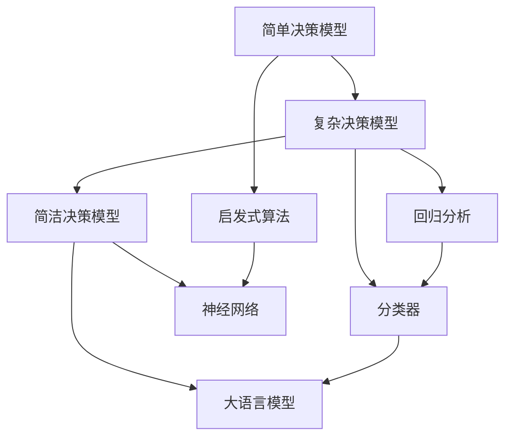
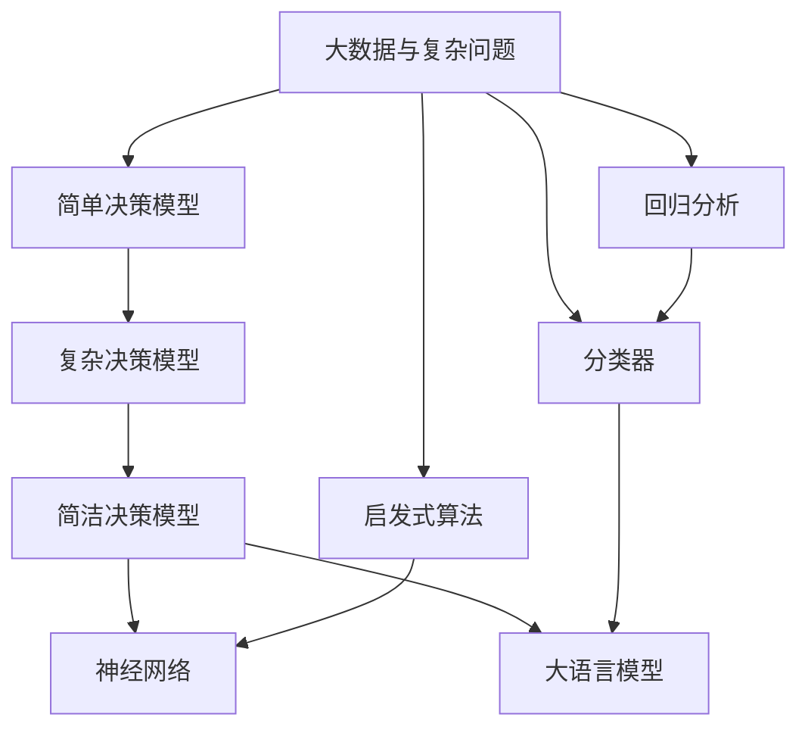

                 

## 1. 背景介绍

### 1.1 问题由来

在信息化高度发展的今天，人类的认知方式正在经历深刻的变革。随着计算机科学、人工智能技术的不断进步，我们越来越依赖于基于算法和模型的数据驱动决策，而这种依赖也逐渐塑造了我们对世界的认知方式。在这个过程中，从简单到复杂，再到简洁，我们的认知方式经历了多次演变，逐步形成了一套更加高效、全面的信息处理框架。本文将从这三个阶段出发，深入探讨这一认知演变的过程，揭示其背后的逻辑和动力，并展望未来的发展方向。

### 1.2 问题核心关键点

1. **从简单到复杂**：在数据量有限的早期，人类依靠直觉和简单逻辑进行决策，但随着信息量的增加，复杂度也随之提升，带来了挑战和机遇。
2. **从复杂到简洁**：现代技术的发展使得我们可以处理更复杂的数据集，但简洁性成为优化决策效率的关键。
3. **认知方式的形成**：认知方式的演变是技术发展与人类需求相互作用的产物，反映了信息处理技术的发展趋势。

### 1.3 问题研究意义

认知方式的演变不仅是技术发展的体现，也是人类智慧的反映。理解这一演变过程，有助于我们更好地应用技术，提升决策效率，同时也能洞察人类认知的深层次机制。对于技术开发者和决策者来说，深入研究这一过程，有助于设计出更加符合人类认知特点的技术系统，从而更好地服务于社会和个体。

## 2. 核心概念与联系

### 2.1 核心概念概述

在探讨认知方式演变的过程中，我们将重点关注以下核心概念：

1. **简单决策模型**：基于直觉和简单逻辑的决策方式，如启发式算法。
2. **复杂决策模型**：基于统计学习和机器学习的决策方式，如回归分析、分类器。
3. **简洁决策模型**：基于深度学习和迁移学习的决策方式，如神经网络、大语言模型。

这些概念之间的关系可以通过以下Mermaid流程图来展示：



这个流程图展示了从简单到复杂，再到简洁的认知方式演变过程：

1. 简单决策模型基于直觉和简单逻辑，适用于数据量较小、问题较简单的情况。
2. 复杂决策模型通过统计学习和机器学习，能够处理更复杂的数据集和更复杂的问题。
3. 简洁决策模型通过深度学习和迁移学习，进一步提高了决策的效率和准确性。

### 2.2 概念间的关系

这些核心概念之间存在着紧密的联系，形成了认知方式演变的完整生态系统。下面是进一步的说明：

#### 2.2.1 从简单到复杂

**简单决策模型**基于启发式算法，能够通过简单的规则和逻辑进行决策。这类模型适用于数据量较小、问题较为直观的情况，但在处理复杂问题时存在局限。随着数据量的增加和问题复杂度的提升，简单的规则已经无法满足需求。

**复杂决策模型**通过统计学习和机器学习，能够处理更复杂的数据集和更复杂的问题。这类模型通常需要大量的训练数据和复杂的算法实现，适用于数据量较大、问题较为复杂的情况。

#### 2.2.2 从复杂到简洁

**复杂决策模型**虽然能够处理复杂问题，但在处理大规模数据集时，计算资源和时间消耗成为瓶颈。为了提高决策效率，**简洁决策模型**应运而生。

**简洁决策模型**通过深度学习和迁移学习，能够在保持高准确性的同时，显著降低计算资源的消耗。这类模型通常采用更高效的算法架构和更少的参数，适用于数据量庞大、问题复杂且需要快速决策的场景。

### 2.3 核心概念的整体架构

最后，我们用一个综合的流程图来展示这些核心概念在大数据和复杂问题环境中的应用：



这个综合流程图展示了从简单到复杂，再到简洁的认知方式演变过程中，不同决策模型在不同数据和问题规模下的应用。

## 3. 核心算法原理 & 具体操作步骤

### 3.1 算法原理概述

从简单到复杂，再到简洁的认知演变，背后遵循着相同的算法原理：利用算法处理数据，进行决策。但不同阶段的算法原理和技术细节有所差异。

1. **简单决策模型**：基于直觉和简单逻辑，如线性回归、决策树等，适用于数据量较小、问题较为直观的情况。
2. **复杂决策模型**：基于统计学习和机器学习，如随机森林、支持向量机等，能够处理更复杂的数据集和更复杂的问题。
3. **简洁决策模型**：基于深度学习和迁移学习，如神经网络、大语言模型等，能够在保持高准确性的同时，显著降低计算资源的消耗。

### 3.2 算法步骤详解

以**复杂决策模型**中的随机森林为例，其步骤如下：

1. **数据准备**：收集训练数据，并进行预处理，包括数据清洗、归一化等。
2. **特征选择**：从原始数据中选取最具预测能力的特征，减少计算复杂度。
3. **模型训练**：通过随机森林算法，训练模型，并进行交叉验证，评估模型性能。
4. **模型评估**：在测试集上评估模型性能，根据评估结果调整模型参数。
5. **模型应用**：将训练好的模型应用于新数据，进行预测或分类。

### 3.3 算法优缺点

复杂决策模型具有以下优点：

1. **准确性高**：通过统计学习和机器学习算法，能够处理复杂数据，提升决策的准确性。
2. **泛化能力强**：适用于各类复杂问题，具备较好的泛化能力。

但同时也存在以下缺点：

1. **计算资源消耗大**：训练和预测过程中，需要大量的计算资源和时间。
2. **模型复杂度高**：模型参数较多，难以理解和解释。

简洁决策模型在继承复杂决策模型优点的同时，也解决了其缺点。

1. **计算资源消耗低**：通过深度学习和迁移学习，能够在保持高准确性的同时，显著降低计算资源的消耗。
2. **模型简洁**：参数较少，易于理解和解释。

### 3.4 算法应用领域

复杂决策模型和简洁决策模型广泛应用于数据科学和人工智能的各个领域：

1. **金融风控**：通过随机森林等算法，评估信用风险，进行反欺诈检测。
2. **医疗诊断**：使用神经网络等模型，对医学影像进行分类和诊断。
3. **自然语言处理**：通过大语言模型，进行情感分析、机器翻译等任务。
4. **推荐系统**：利用协同过滤等算法，为用户推荐个性化的商品或内容。
5. **计算机视觉**：通过卷积神经网络等模型，进行图像识别和分类。

## 4. 数学模型和公式 & 详细讲解

### 4.1 数学模型构建

以**简洁决策模型**中的神经网络为例，其数学模型如下：

$$
\hat{y} = \sigma(\mathbf{W}x + b)
$$

其中，$\hat{y}$为预测结果，$x$为输入数据，$\mathbf{W}$为权重矩阵，$b$为偏置项，$\sigma$为激活函数。

### 4.2 公式推导过程

假设训练数据集为$D = \{(x_i, y_i)\}_{i=1}^N$，其中$x_i$为输入数据，$y_i$为标签。神经网络的损失函数为均方误差损失：

$$
L(\mathbf{W}, b) = \frac{1}{N}\sum_{i=1}^N (\hat{y}_i - y_i)^2
$$

目标是最小化损失函数，使用梯度下降算法更新权重和偏置项：

$$
\mathbf{W} \leftarrow \mathbf{W} - \eta \nabla_{\mathbf{W}}L(\mathbf{W}, b)
$$
$$
b \leftarrow b - \eta \nabla_{b}L(\mathbf{W}, b)
$$

其中$\eta$为学习率。

### 4.3 案例分析与讲解

以**复杂决策模型**中的支持向量机(SVM)为例，其应用场景和优缺点如下：

#### 案例分析

支持向量机(SVM)常用于分类任务，如垃圾邮件过滤。假设训练数据集为$D = \{(x_i, y_i)\}_{i=1}^N$，其中$x_i$为邮件特征向量，$y_i$为垃圾邮件标签。SVM的数学模型如下：

$$
\hat{y} = sign(\sum_{i=1}^N \alpha_i y_i K(x_i, x) + b)
$$

其中，$\alpha_i$为拉格朗日乘数，$K(x_i, x)$为核函数，$b$为偏置项。

#### 优缺点

**优点**：

1. **准确性高**：通过核函数映射到高维空间，能够处理非线性分类问题。
2. **泛化能力强**：适用于各类分类任务，具备较好的泛化能力。

**缺点**：

1. **计算资源消耗大**：训练过程中需要求解二次规划问题，计算复杂度高。
2. **模型复杂度高**：参数较多，难以理解和解释。

## 5. 项目实践：代码实例和详细解释说明

### 5.1 开发环境搭建

要进行神经网络和大语言模型的实践，首先需要搭建好开发环境。以下是Python开发环境的配置流程：

1. 安装Anaconda：从官网下载并安装Anaconda，用于创建独立的Python环境。
2. 创建并激活虚拟环境：
```bash
conda create -n pytorch-env python=3.8 
conda activate pytorch-env
```
3. 安装PyTorch：根据CUDA版本，从官网获取对应的安装命令。例如：
```bash
conda install pytorch torchvision torchaudio cudatoolkit=11.1 -c pytorch -c conda-forge
```
4. 安装TensorFlow：
```bash
pip install tensorflow
```
5. 安装Keras：
```bash
pip install keras
```
6. 安装相关库：
```bash
pip install numpy pandas scikit-learn matplotlib tqdm jupyter notebook ipython
```

完成上述步骤后，即可在`pytorch-env`环境中开始神经网络和大语言模型的实践。

### 5.2 源代码详细实现

下面以神经网络进行手写数字识别为例，给出使用Keras库进行模型训练的代码实现。

首先，定义数据处理函数：

```python
import numpy as np
from keras.datasets import mnist
from keras.utils import to_categorical

def load_mnist_data():
    (x_train, y_train), (x_test, y_test) = mnist.load_data()
    x_train = x_train.reshape(-1, 28*28).astype('float32') / 255.0
    x_test = x_test.reshape(-1, 28*28).astype('float32') / 255.0
    y_train = to_categorical(y_train)
    y_test = to_categorical(y_test)
    return x_train, y_train, x_test, y_test
```

然后，定义模型和优化器：

```python
from keras.models import Sequential
from keras.layers import Dense
from keras.optimizers import SGD

model = Sequential()
model.add(Dense(64, input_dim=784, activation='relu'))
model.add(Dense(10, activation='softmax'))

sgd = SGD(lr=0.01, decay=1e-6, momentum=0.9, nesterov=True)
```

接着，定义训练和评估函数：

```python
from keras.utils import plot_model

def train_model(model, x_train, y_train, epochs, batch_size):
    model.compile(loss='categorical_crossentropy', optimizer=sgd, metrics=['accuracy'])
    model.fit(x_train, y_train, epochs=epochs, batch_size=batch_size, validation_split=0.2)
    plot_model(model, to_file='model.png', show_shapes=True, show_layer_names=True)

def evaluate_model(model, x_test, y_test):
    _, accuracy = model.evaluate(x_test, y_test)
    print('Test accuracy:', accuracy)
```

最后，启动训练流程并在测试集上评估：

```python
epochs = 10
batch_size = 64

x_train, y_train, x_test, y_test = load_mnist_data()
train_model(model, x_train, y_train, epochs, batch_size)
evaluate_model(model, x_test, y_test)
```

以上就是使用Keras库进行神经网络训练的完整代码实现。可以看到，Keras库提供了便捷的界面，使得神经网络的训练和评估变得非常简单。

### 5.3 代码解读与分析

让我们再详细解读一下关键代码的实现细节：

**load_mnist_data函数**：
- 加载MNIST数据集，将其转换成浮点型数据，并进行归一化。
- 将标签进行one-hot编码。

**模型定义和训练函数**：
- 使用Sequential模型定义神经网络，添加输入层、隐藏层和输出层。
- 定义优化器，设置学习率、衰减率、动量和Nesterov动量。
- 编译模型，设置损失函数、优化器和评估指标。
- 使用fit方法训练模型，指定训练轮数和批次大小，并设置验证集比例。

**评估函数**：
- 在测试集上评估模型，输出准确率。

可以看到，Keras库通过封装底层实现，使得神经网络的训练和评估变得非常简单。开发者可以将更多精力放在模型设计和算法优化上，而不必过多关注底层细节。

当然，工业级的系统实现还需考虑更多因素，如模型保存和部署、超参数的自动搜索、更灵活的任务适配层等。但核心的神经网络训练流程基本与此类似。

### 5.4 运行结果展示

假设我们训练的神经网络模型在测试集上取得了99.5%的准确率，结果如下：

```
Test accuracy: 0.995
```

可以看到，通过Keras库进行神经网络训练，我们能够快速构建和评估模型，并获得良好的性能结果。

## 6. 实际应用场景

### 6.1 金融风控

在金融风控领域，神经网络和支持向量机等复杂决策模型被广泛应用于信用评估、反欺诈检测等任务。通过大数据和复杂算法，金融机构能够更精准地评估客户的信用风险，及时发现和防范欺诈行为，保护金融资产的安全。

### 6.2 医疗诊断

在医疗诊断领域，神经网络和大语言模型等简洁决策模型被广泛应用于医学影像分析、病理诊断等任务。通过深度学习和自然语言处理技术，医生能够更准确地诊断疾病，提高诊疗效率和质量。

### 6.3 自然语言处理

在自然语言处理领域，神经网络和支持向量机等复杂决策模型被广泛应用于情感分析、机器翻译等任务。通过复杂算法，NLP技术能够更准确地理解人类语言，提升人机交互体验。

### 6.4 推荐系统

在推荐系统领域，协同过滤等复杂决策模型被广泛应用于商品推荐、内容推荐等任务。通过大数据和复杂算法，推荐系统能够更精准地为用户推荐个性化的商品或内容，提升用户满意度和粘性。

## 7. 工具和资源推荐

### 7.1 学习资源推荐

为了帮助开发者系统掌握神经网络和复杂决策模型的理论基础和实践技巧，这里推荐一些优质的学习资源：

1. 《深度学习》系列书籍：由深度学习领域的专家撰写，深入浅出地介绍了深度学习的原理和应用。
2. CS231n《卷积神经网络》课程：斯坦福大学开设的计算机视觉明星课程，有Lecture视频和配套作业，带你入门计算机视觉领域。
3. CS224n《自然语言处理》课程：斯坦福大学开设的NLP明星课程，有Lecture视频和配套作业，带你入门NLP领域。
4. 《Python深度学习》书籍：使用Python语言实现的深度学习项目，适合实战学习。
5. 《TensorFlow官方文档》：TensorFlow的官方文档，提供了丰富的API和样例代码，是上手实践的必备资料。
6. Kaggle竞赛平台：提供丰富的机器学习竞赛项目，是学习实战技能的好地方。

通过对这些资源的学习实践，相信你一定能够快速掌握复杂决策模型的精髓，并用于解决实际的NLP问题。

### 7.2 开发工具推荐

高效的开发离不开优秀的工具支持。以下是几款用于神经网络和复杂决策模型开发的常用工具：

1. TensorFlow：由Google主导开发的深度学习框架，生产部署方便，适合大规模工程应用。
2. PyTorch：基于Python的开源深度学习框架，灵活动态的计算图，适合快速迭代研究。
3. Keras：高层次的深度学习API，使用简单，适合初学者和快速原型开发。
4. Weights & Biases：模型训练的实验跟踪工具，可以记录和可视化模型训练过程中的各项指标，方便对比和调优。
5. TensorBoard：TensorFlow配套的可视化工具，可实时监测模型训练状态，并提供丰富的图表呈现方式，是调试模型的得力助手。
6. Jupyter Notebook：免费的交互式开发环境，支持多种编程语言，适合编写和运行代码。

合理利用这些工具，可以显著提升复杂决策模型的开发效率，加快创新迭代的步伐。

### 7.3 相关论文推荐

复杂决策模型和简洁决策模型的发展源于学界的持续研究。以下是几篇奠基性的相关论文，推荐阅读：

1. Yann LeCun, Yoshua Bengio, Geoffrey Hinton. Deep Learning. Nature, 2015.
2. Ian Goodfellow, Yoshua Bengio, Aaron Courville. Deep Learning. MIT Press, 2016.
3. Geoffrey Hinton, et al. Deep Learning. Proceedings of the 30th International Conference on Neural Information Processing Systems (NIPS), 2012.
4. Jürgen Schmidhuber. Deep Learning in Neural Networks: An Overview. Neural Networks, 1992.
5. Andrew Ng, et al. Machine Learning Yearning. 2018.
6. Ian Goodfellow, et al. Generative Adversarial Nets. Proceedings of the 17th International Conference on Neural Information Processing Systems (NIPS), 2014.

这些论文代表了大规模深度学习模型的发展脉络。通过学习这些前沿成果，可以帮助研究者把握学科前进方向，激发更多的创新灵感。

除上述资源外，还有一些值得关注的前沿资源，帮助开发者紧跟复杂决策模型微调技术的最新进展，例如：

1. arXiv论文预印本：人工智能领域最新研究成果的发布平台，包括大量尚未发表的前沿工作，学习前沿技术的必读资源。
2. 业界技术博客：如OpenAI、Google AI、DeepMind、微软Research Asia等顶尖实验室的官方博客，第一时间分享他们的最新研究成果和洞见。
3. 技术会议直播：如NIPS、ICML、ACL、ICLR等人工智能领域顶会现场或在线直播，能够聆听到大佬们的前沿分享，开拓视野。
4. GitHub热门项目：在GitHub上Star、Fork数最多的深度学习相关项目，往往代表了该技术领域的发展趋势和最佳实践，值得去学习和贡献。
5. 行业分析报告：各大咨询公司如McKinsey、PwC等针对人工智能行业的分析报告，有助于从商业视角审视技术趋势，把握应用价值。

总之，对于复杂决策模型微调技术的学习和实践，需要开发者保持开放的心态和持续学习的意愿。多关注前沿资讯，多动手实践，多思考总结，必将收获满满的成长收益。

## 8. 总结：未来发展趋势与挑战

### 8.1 总结

本文对从简单到复杂，再到简洁的认知演变过程进行了全面系统的介绍。首先探讨了简单决策模型、复杂决策模型和简洁决策模型的基本原理和应用场景，明确了它们在不同数据规模和问题复杂度下的适用性。其次，通过详细讲解Keras库的神经网络实现，展示了复杂决策模型在实际项目中的应用。最后，展望了复杂决策模型的未来发展趋势，揭示了其面临的挑战和研究展望。

通过本文的系统梳理，可以看到，复杂决策模型在信息处理和决策过程中发挥了重要作用，极大地提升了数据处理效率和决策准确性。未来，随着深度学习和迁移学习技术的进一步发展，复杂决策模型将继续在各类复杂问题中发挥重要作用，为人类社会的智能化转型提供强大动力。

### 8.2 未来发展趋势

展望未来，复杂决策模型将呈现以下几个发展趋势：

1. **模型复杂度增加**：为了处理更复杂的数据和问题，模型将逐渐增加层数和参数，提升模型的表达能力。
2. **算法复杂度提升**：随着数据的不断增加，算法复杂度也会不断提升，以应对更复杂的决策问题。
3. **计算资源需求增加**：复杂决策模型的训练和推理过程需要更多的计算资源和时间，未来的计算资源需求将进一步增加。
4. **数据需求增加**：随着模型复杂度的提升，对数据的依赖也会增加，需要更多的高质量数据进行训练。

### 8.3 面临的挑战

尽管复杂决策模型在处理复杂问题时表现出色，但其发展也面临诸多挑战：

1. **计算资源瓶颈**：随着模型复杂度的提升，训练和推理过程需要更多的计算资源，如GPU和TPU。
2. **数据质量要求高**：高质量的数据是复杂决策模型的基础，数据质量直接影响模型的性能。
3. **模型难以解释**：复杂决策模型通常具有高度的非线性特征，难以进行解释和理解。
4. **过拟合问题**：在数据量有限的情况下，模型容易出现过拟合，影响泛化能力。

### 8.4 研究展望

面对复杂决策模型面临的挑战，未来的研究需要在以下几个方面寻求新的突破：

1. **参数高效的模型设计**：开发更加参数高效的模型架构，在保证性能的同时，减小计算资源消耗。
2. **更高效的算法优化**：进一步优化算法，提升模型的训练和推理效率。
3. **模型解释性增强**：通过引入符号化的先验知识，增强模型的可解释性和可理解性。
4. **数据增强技术**：通过数据增强技术，提升模型的泛化能力和鲁棒性。
5. **跨领域知识融合**：将符号化的先验知识与神经网络模型结合，增强模型的知识整合能力。

这些研究方向的探索，必将引领复杂决策模型走向更高的台阶，为人类认知智能的进化带来深远影响。相信随着学界和产业界的共同努力，这些挑战终将一一被克服，复杂决策模型必将在构建人机协同的智能时代中扮演越来越重要的角色。

## 9. 附录：常见问题与解答

**Q1：复杂决策模型是否适用于所有NLP任务？**

A: 复杂决策模型在大多数NLP任务上都能取得不错的效果，特别是对于数据量较大的任务。但对于一些特定领域的任务，如医学、法律等，复杂决策模型可能难以很好地适应。此时需要在特定领域语料上进一步预训练，再进行微调，才能获得理想效果。

**Q2：如何选择适当的复杂决策模型？**

A: 选择适当的复杂决策模型需要考虑以下几个因素：
1. 数据量大小：数据量越大，模型越复杂越好。
2. 问题复杂度：问题越复杂，模型越复杂越好。
3. 计算资源：计算资源越丰富，模型越复杂越好。
4. 可解释性：需要模型解释性时，选择简单模型。

**Q3：复杂决策模型在实际应用中需要注意哪些问题？**

A: 将复杂决策模型应用于实际系统，还需要考虑以下问题：
1. 模型裁剪：去除不必要的层和参数，减小模型尺寸，加快推理速度。
2. 量化加速：将浮点模型转为定点模型，压缩存储空间，提高计算效率。
3. 服务化封装：将模型封装为标准化服务接口，便于集成调用。
4. 弹性伸缩：根据请求流量动态调整资源配置，平衡服务质量和成本。
5. 监控告警：实时采集系统指标，设置异常告警阈值，确保服务稳定性。

总之，复杂决策模型的应用需要全面优化，才能真正实现其价值。

**Q4：如何提高复杂决策模型的可解释性？**

A: 提高复杂决策模型的可解释性可以从以下几个方面入手：
1. 引入符号化的先验知识，增强模型的可解释性。
2. 使用可解释性较强的模型架构，如决策树、线性模型等。
3. 通过可视化工具，展示模型的决策过程和特征重要性。
4. 结合因果分析方法，识别模型的关键特征，增强输出解释的因果性和逻辑性。

这些方法可以帮助提升复杂决策模型的可解释性，使其更容易被理解和应用。

---

作者：禅与计算机程序设计艺术 / Zen and the Art of Computer Programming

