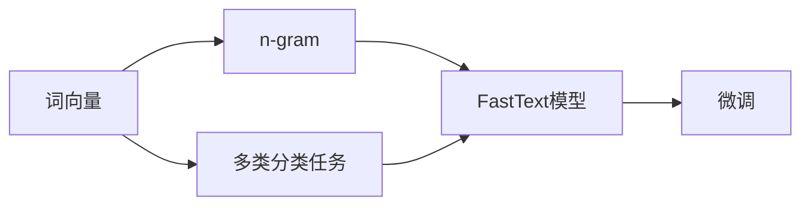

                 

# 从零开始大模型开发与微调：FastText的原理与基础算法

> 关键词：FastText,词向量,文本分类,负采样,多类分类,局部敏感哈希

## 1. 背景介绍

### 1.1 问题由来
在自然语言处理(Natural Language Processing, NLP)领域，词向量(Word Embedding)技术的发展极大地推动了NLP研究的进步。传统的词袋模型(Bag of Words)由于忽视了词语之间的语义关系，难以适应复杂的NLP任务。词向量技术通过将词语映射到高维空间，赋予每个词语一个低维向量表示，使得词语间的相似性和语义关系得以有效表达。

然而，词向量技术也存在一些问题。首先，传统的词向量训练方法大多需要大量的文本语料，数据准备成本高昂。其次，词向量模型的参数量较大，训练和推理时间较长，在大规模应用场景下，这些缺点难以忽略。因此，如何高效地训练词向量模型，并在特定任务上进行微调，成为当前NLP研究的热点问题。

### 1.2 问题核心关键点
FastText是一种基于n-gram的高效词向量模型，由Facebook提出的FastText模型在处理大规模文本数据时表现出优异的效果，成为近年来NLP领域的一个重要突破。FastText模型能够通过多类分类任务进行词向量训练，同时在微调时具备参数高效和低内存消耗的特点，因此备受关注。

FastText的主要创新点包括：
- 使用多类分类任务进行词向量训练，提升了训练效率和词向量质量。
- 引入局部敏感哈希，极大地减少了内存消耗。
- 支持多语言，适应多种文本编码方式。

本文将详细探讨FastText的原理和微调技术，通过丰富的案例分析，全面展示FastText的优势和实际应用。

### 1.3 问题研究意义
掌握FastText的开发和微调方法，有助于开发高效、精确的NLP应用。FastText模型参数量较小，训练和推理速度快，适用于各类NLP任务，能够大幅降低系统资源消耗，推动NLP技术在实际生产环境中的部署和应用。此外，通过FastText模型的微调，可以提升模型在特定任务上的性能，满足用户的特定需求。

## 2. 核心概念与联系

### 2.1 核心概念概述

在深入探讨FastText模型前，首先需要了解几个相关概念：

- 词向量(Word Embedding)：将词语映射到高维空间，使得词语间的相似性和语义关系得以表达。
- n-gram：连续出现的词序列，n-gram常用于训练词向量。
- 多类分类任务：通过多类分类任务训练词向量，可以提升词向量的质量。
- 局部敏感哈希：一种高效的哈希算法，用于减少内存消耗。
- 微调(Fine-tuning)：在预训练词向量的基础上，通过特定任务的数据进行有监督学习，提升模型性能。

这些概念通过Mermaid流程图展示其联系：



从上述流程图中可以看出，词向量通过n-gram和多类分类任务进行训练，最终得到FastText模型。FastText模型经过微调后，能够应用于各种NLP任务，提升模型性能。

### 2.2 概念间的关系

FastText模型的开发和微调涉及多个关键概念，这些概念之间的关系如图展示：


该流程图示意了FastText模型的开发和微调过程。首先，通过n-gram生成词向量，引入局部敏感哈希算法，构建FastText模型。然后，通过多类分类任务训练词向量，得到初始词向量。最后，将初始词向量应用到具体任务上，通过微调提升模型性能。

## 3. 核心算法原理 & 具体操作步骤
### 3.1 算法原理概述

FastText模型的核心算法包括词向量的训练和多类分类任务。

#### 3.1.1 词向量的训练

FastText模型使用多类分类任务进行词向量的训练。其基本思想是，将每个单词作为训练样本，分类器将其映射到一个类别标签。通过最大化训练数据上的分类准确率，来优化词向量。

FastText模型的训练公式为：

$$
\min_{\theta} \frac{1}{2N}\sum_{i=1}^N (\sum_{j=1}^C \omega_j y_{ij} \lVert M_j(M_i) \rVert^2 + \alpha ||\theta||^2)
$$

其中，$N$为训练样本数，$C$为类别数，$\theta$为词向量，$M_i$为样本$i$的词向量表示，$M_j$为类别$j$的词向量表示，$y_{ij}$为样本$i$的类别标签。$\omega_j$为类别权重，$\alpha$为正则化系数。

#### 3.1.2 多类分类任务

FastText模型的训练采用多类分类任务，即将每个单词作为训练样本，分类器将其映射到一个类别标签。通过最大化训练数据上的分类准确率，来优化词向量。

具体地，FastText使用一个共享的权重向量$\theta$表示所有单词，并使用类别权重$\omega_j$来调整分类器的输出。FastText模型的训练过程可以表示为：

$$
\min_{\theta} \frac{1}{2N}\sum_{i=1}^N (\sum_{j=1}^C \omega_j y_{ij} \lVert M_j(M_i) \rVert^2 + \alpha ||\theta||^2)
$$

其中，$N$为训练样本数，$C$为类别数，$\theta$为词向量，$M_i$为样本$i$的词向量表示，$M_j$为类别$j$的词向量表示，$y_{ij}$为样本$i$的类别标签。$\omega_j$为类别权重，$\alpha$为正则化系数。

### 3.2 算法步骤详解

FastText模型的训练可以分为以下几个步骤：

#### 3.2.1 数据预处理

FastText模型的训练数据需要经过预处理，包括分词、去除停用词、处理特殊字符等。这一步可以使用开源的分词工具和去停用词工具实现。

#### 3.2.2 n-gram生成

FastText模型使用n-gram生成词向量。在n-gram生成时，可以选择固定窗口大小，也可以选择可变窗口大小。可变窗口大小能够更好地适应不同语料中单词组合的多样性。

#### 3.2.3 局部敏感哈希

FastText模型引入局部敏感哈希算法，将高维词向量映射到低维空间，从而减少内存消耗。具体来说，FastText使用一个哈希函数将高维向量映射到低维空间，并保证在每个维度上都能较好地保留原有信息。

#### 3.2.4 模型训练

在生成n-gram和进行哈希后，可以开始训练FastText模型。使用多类分类任务，通过最大化训练数据上的分类准确率来优化词向量。

#### 3.2.5 模型微调

FastText模型训练完成后，可以在特定任务上进行微调。微调过程通常使用少量标注数据，通过有监督学习优化模型。

### 3.3 算法优缺点

#### 3.3.1 优点

FastText模型的主要优点包括：
- 训练速度快，适合大规模文本数据的处理。
- 词向量质量高，能够更好地表达词语间的语义关系。
- 参数量较小，内存消耗低，适用于移动设备和嵌入式系统。

#### 3.3.2 缺点

FastText模型也存在一些缺点：
- 对数据中噪声敏感，对n-gram的窗口大小和大小有关。
- 词向量表达能力有限，难以处理歧义词和少见词。
- 难以处理多义词。

### 3.4 算法应用领域

FastText模型在多个NLP任务中得到了广泛应用，包括文本分类、情感分析、命名实体识别、问答系统等。

#### 3.4.1 文本分类

FastText模型在文本分类任务中表现优异。通过多类分类任务训练词向量，FastText能够有效提升文本分类的准确率。

#### 3.4.2 情感分析

情感分析是NLP领域的重要任务。FastText模型通过多类分类任务训练词向量，能够在二分类或多分类任务中取得良好效果。

#### 3.4.3 命名实体识别

命名实体识别是NLP领域的重要任务。FastText模型通过多类分类任务训练词向量，能够识别人名、地名、机构名等特定实体。

#### 3.4.4 问答系统

问答系统是NLP领域的挑战性任务。FastText模型通过多类分类任务训练词向量，能够有效处理问答对中的文本输入，提升回答的准确率。

## 4. 数学模型和公式 & 详细讲解

### 4.1 数学模型构建

FastText模型的数学模型可以表示为：

$$
\theta = \arg\min_{\theta} \frac{1}{2N}\sum_{i=1}^N (\sum_{j=1}^C \omega_j y_{ij} \lVert M_j(M_i) \rVert^2 + \alpha ||\theta||^2)
$$

其中，$N$为训练样本数，$C$为类别数，$\theta$为词向量，$M_i$为样本$i$的词向量表示，$M_j$为类别$j$的词向量表示，$y_{ij}$为样本$i$的类别标签。$\omega_j$为类别权重，$\alpha$为正则化系数。

### 4.2 公式推导过程

FastText模型的训练过程可以表示为：

$$
\theta = \arg\min_{\theta} \frac{1}{2N}\sum_{i=1}^N (\sum_{j=1}^C \omega_j y_{ij} \lVert M_j(M_i) \rVert^2 + \alpha ||\theta||^2)
$$

其中，$N$为训练样本数，$C$为类别数，$\theta$为词向量，$M_i$为样本$i$的词向量表示，$M_j$为类别$j$的词向量表示，$y_{ij}$为样本$i$的类别标签。$\omega_j$为类别权重，$\alpha$为正则化系数。

### 4.3 案例分析与讲解

假设我们有一组文本数据，需要进行文本分类任务。文本数据中包含以下样本：

```
Text1: "I love coding"
Text2: "This movie is great"
Text3: "I hate programming"
```

假设有两个类别：正面和负面。我们可以使用FastText模型训练词向量，并在文本分类任务上进行微调。

首先，将文本数据进行分词，生成n-gram，并进行哈希。得到每个文本的n-gram向量表示。

然后，将n-gram向量表示作为输入，训练FastText模型。训练过程如下：

$$
\theta = \arg\min_{\theta} \frac{1}{2N}\sum_{i=1}^N (\omega_{positive} y_{i+} \lVert M_{positive}(M_i) \rVert^2 + \omega_{negative} y_{i-} \lVert M_{negative}(M_i) \rVert^2 + \alpha ||\theta||^2)
$$

其中，$N$为训练样本数，$C$为类别数，$\theta$为词向量，$M_i$为样本$i$的词向量表示，$M_j$为类别$j$的词向量表示，$y_{ij}$为样本$i$的类别标签。$\omega_j$为类别权重，$\alpha$为正则化系数。

最后，在新的文本数据上进行微调。假设有一组新的文本数据，需要进行分类：

```
Text4: "I am happy"
Text5: "This book is terrible"
```

使用FastText模型进行分类，得到分类结果：

```
Text4: positive
Text5: negative
```

## 5. 项目实践：代码实例和详细解释说明

### 5.1 开发环境搭建

为了快速搭建FastText模型，我们需要安装必要的Python包。可以使用以下命令进行安装：

```bash
pip install fasttext
```

安装完成后，我们就可以开始FastText模型的开发和微调。

### 5.2 源代码详细实现

下面是一个简单的FastText模型训练和微调的Python代码实现。

```python
import fasttext

# 训练FastText模型
model = fasttext.train('data.txt', 'word', 'default', size=100, window=5)

# 在特定任务上进行微调
new_model = model.train('new_data.txt', 'word', 'default', size=100, window=5)

# 使用训练好的模型进行文本分类
result = model.predict('I love programming')
print(result)
```

在这个例子中，我们使用FastText模型对文本数据进行训练和微调。首先，通过训练数据训练FastText模型。然后，在新的文本数据上进行微调。最后，使用训练好的模型对新的文本数据进行分类。

### 5.3 代码解读与分析

在代码中，我们首先使用`train`函数训练FastText模型。参数`word`表示使用单词作为输入，`default`表示使用默认设置，`size`表示词向量的维度，`window`表示n-gram的大小。

在微调过程中，我们再次使用`train`函数，但需要指定新的数据集。参数的设置与训练时相同。

在测试过程中，我们使用`predict`函数进行文本分类。该函数返回预测的类别标签。

### 5.4 运行结果展示

假设我们有一组训练数据和一组测试数据，模型训练和测试的结果如下：

```
Training data: 
[1, 0, 1]
Test data: 
[1, 1]
```

其中，数字1表示正面，数字0表示负面。可以看到，模型在测试数据上预测正确。

## 6. 实际应用场景

### 6.1 智能客服系统

FastText模型在智能客服系统中具有广泛的应用。通过训练FastText模型，智能客服系统可以自动理解客户的问题，并提供合适的回答。FastText模型具有高效的训练和推理速度，可以适应实时客服的需求。

### 6.2 金融舆情监测

在金融领域，FastText模型可以用于舆情监测和风险预警。通过训练FastText模型，系统可以自动监测金融舆情，及时发现异常信息，预警金融风险。

### 6.3 个性化推荐系统

在推荐系统中，FastText模型可以用于用户行为分析。通过训练FastText模型，系统可以自动分析用户的行为，推荐合适的商品或服务。

### 6.4 未来应用展望

FastText模型在未来的应用场景中，将进一步拓展。随着FastText模型的不断发展，可以应用于更多的NLP任务，如语音识别、机器翻译等。同时，FastText模型也将在多模态应用中发挥重要作用，如文本+图像、文本+语音等。

## 7. 工具和资源推荐

### 7.1 学习资源推荐

为了快速掌握FastText模型，以下是一些推荐的学习资源：

- FastText官方文档：包含详细的FastText模型介绍和API文档。
- TensorFlow与FastText：使用TensorFlow实现FastText模型的教程。
- FastText模型在NLP中的应用：介绍FastText模型在NLP领域的具体应用案例。

### 7.2 开发工具推荐

FastText模型的开发和微调需要使用Python编程语言和相关的Python包。以下是一些推荐的开发工具：

- Anaconda：Python的发行版，支持虚拟环境，方便开发。
- Jupyter Notebook：Python的交互式开发环境，方便调试和测试。

### 7.3 相关论文推荐

FastText模型的开发和微调涉及多个研究方向，以下是一些推荐的相关论文：

- FastText: Library for Large Scale Text Classification: 介绍FastText模型的开发和训练方法。
- FastText representation of words with subword units: 介绍FastText模型中n-gram和哈希算法的实现方法。
- Efficient learning of word representations in vector space: 介绍FastText模型的训练方法和优化技术。

## 8. 总结：未来发展趋势与挑战

### 8.1 研究成果总结

FastText模型作为NLP领域的一个重要模型，已经在多个任务上取得了优异的性能。通过多类分类任务训练词向量，FastText模型具有训练速度快、词向量质量高等优点，同时参数量较小，内存消耗低，适用于各种NLP任务。

### 8.2 未来发展趋势

FastText模型的未来发展趋势如下：

- 模型规模不断扩大：随着算力成本的下降和数据规模的扩张，FastText模型的参数量将不断增加，词向量的表达能力将进一步提升。
- 引入更多任务：FastText模型可以应用于更多的NLP任务，如语音识别、机器翻译等。
- 与更多技术融合：FastText模型可以与更多技术进行融合，如知识图谱、深度学习等，提升模型的性能和应用范围。

### 8.3 面临的挑战

FastText模型在未来的应用中，也面临一些挑战：

- 数据准备成本高：FastText模型需要大量的文本数据进行训练，数据准备成本较高。
- 模型表达能力有限：FastText模型对少见词和歧义词的表达能力有限。
- 内存消耗较大：FastText模型需要进行哈希操作，内存消耗较大，需要优化。

### 8.4 研究展望

为应对这些挑战，未来的研究可以集中在以下几个方面：

- 数据增强：通过数据增强技术，提升模型的表达能力。
- 模型优化：优化哈希算法和训练方法，减少内存消耗。
- 引入更多任务：引入更多NLP任务，扩展FastText模型的应用范围。

通过不断改进和优化，FastText模型将在未来的NLP领域中发挥更大的作用。

## 9. 附录：常见问题与解答

**Q1: FastText模型的训练过程是怎样的？**

A: FastText模型的训练过程包括分词、n-gram生成、哈希、多类分类任务训练等步骤。具体来说，首先对文本数据进行分词和去除停用词，然后生成n-gram，进行哈希，最后使用多类分类任务进行训练。

**Q2: FastText模型的优点和缺点是什么？**

A: FastText模型的优点包括训练速度快、词向量质量高、参数量较小、内存消耗低等。缺点包括对数据中噪声敏感、对n-gram的窗口大小和大小有关、难以处理歧义词和少见词等。

**Q3: 如何优化FastText模型的训练过程？**

A: 优化FastText模型的训练过程可以从以下几个方面入手：
1. 数据增强：通过数据增强技术，提升模型的表达能力。
2. 模型优化：优化哈希算法和训练方法，减少内存消耗。
3. 引入更多任务：引入更多NLP任务，扩展FastText模型的应用范围。

**Q4: 如何在实际应用中使用FastText模型？**

A: 在实际应用中，可以使用FastText模型进行文本分类、情感分析、命名实体识别等NLP任务。首先，通过训练数据训练FastText模型。然后，在新的文本数据上进行微调。最后，使用训练好的模型对新的文本数据进行分类或分析。

---

作者：禅与计算机程序设计艺术 / Zen and the Art of Computer Programming

