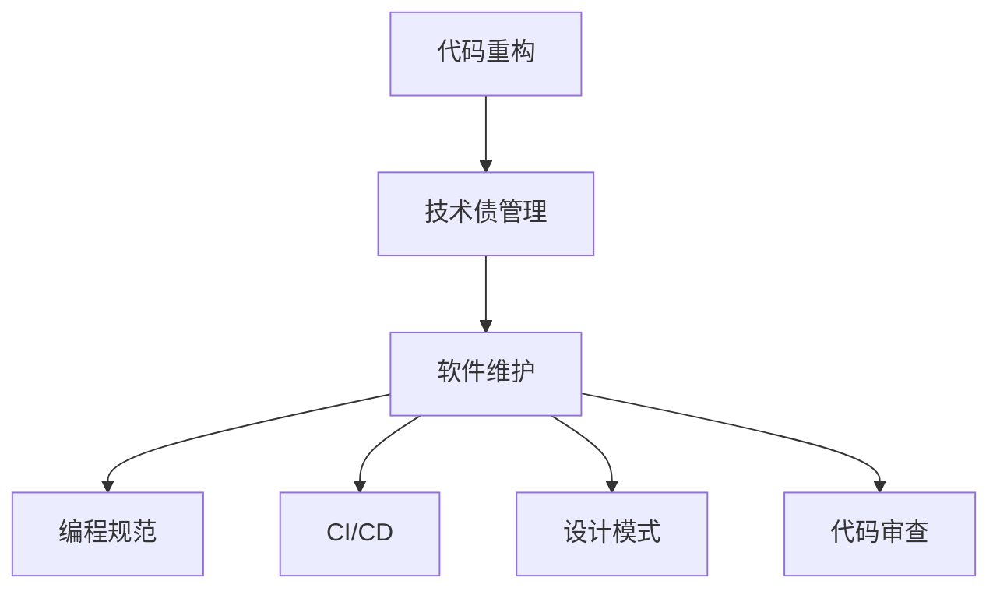
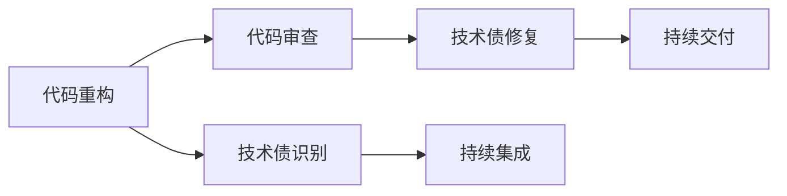
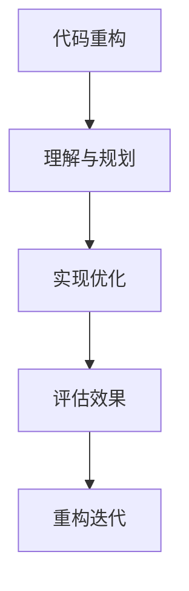
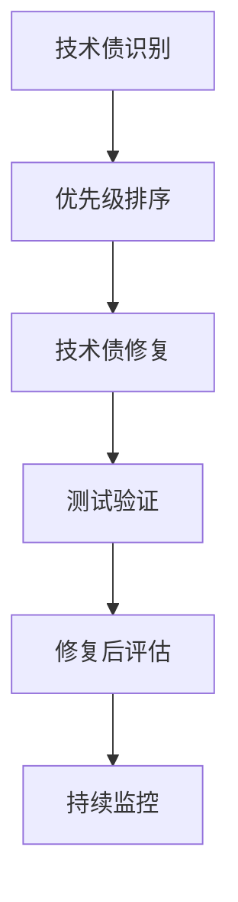
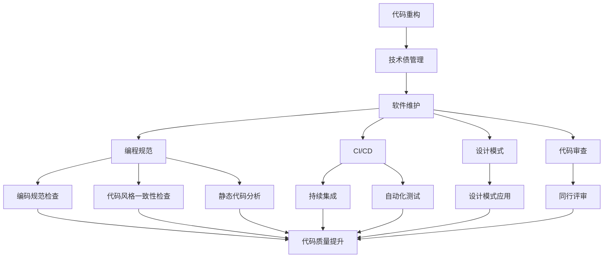

                 

# 代码重构与技术债管理原理与代码实战案例讲解

> 关键词：代码重构,技术债管理,软件维护,编程规范,软件工程,持续改进

## 1. 背景介绍

### 1.1 问题由来
在软件开发的漫长过程中，代码库可能会逐渐变得冗余、混乱、难以维护。这些问题不仅影响软件项目的质量和性能，还会拖慢开发进度，导致团队协作效率低下。此外，过度复杂的软件系统还容易引入新的漏洞和bug，增加系统的不稳定性。

为了解决这些问题，软件工程师们提出了代码重构和技术债管理的概念。代码重构是指对现有代码进行优化，以提升代码的可读性、可维护性和性能。而技术债管理则是识别并减少技术债务，即在开发过程中产生的技术问题或缺陷，以降低未来的维护成本。

### 1.2 问题核心关键点
代码重构和技术债管理的核心关键点在于：
1. **系统理解与规划**：准确理解现有代码结构，识别出需要改进的代码模块和潜在的优化点。
2. **重构与优化**：采用合理的重构技术，对代码进行优化，提升代码质量和性能。
3. **技术债识别**：识别出当前系统中存在的技术债，并制定计划进行修复。
4. **持续改进**：将代码重构和技术债管理作为持续改进的一部分，确保系统健康稳定地运行。

### 1.3 问题研究意义
代码重构和技术债管理对软件项目的长期成功至关重要。通过有效的重构和技术债管理，可以显著提升代码质量，减少维护成本，提高团队效率，增强系统的稳定性和安全性。更重要的是，这些实践活动可以培养团队的编码习惯和技术能力，推动软件项目的持续进步。

## 2. 核心概念与联系

### 2.1 核心概念概述

为更好地理解代码重构和技术债管理的原理，本节将介绍几个密切相关的核心概念：

- **代码重构(Refactoring)**：对现有代码进行改进，以提升代码的可读性、可维护性和性能，不改变程序的功能和外部接口。
- **技术债(Tech Debt)**：在软件开发过程中产生的一系列技术问题或缺陷，需要在未来支付维护成本进行修复。
- **软件维护(Software Maintenance)**：在软件生命周期中，对软件进行修复、修改、升级等维护活动，以确保软件系统的稳定性和可靠性。
- **编程规范(Coding Standards)**：一组编码规则和最佳实践，用于指导开发者编写高质量、可维护的代码。
- **持续集成和持续交付(CI/CD)**：一种自动化软件开发流程，通过持续集成和持续交付提升软件质量，减少技术债积累。
- **设计模式(Design Patterns)**：一系列被广泛接受的软件设计解决方案，用于解决特定问题。
- **代码审查(Code Review)**：通过同行评审和代码检查，提高代码质量和设计标准。

这些核心概念之间的逻辑关系可以通过以下Mermaid流程图来展示：



这个流程图展示了几项核心概念之间的关系：

1. 代码重构和技术债管理是软件维护的重要手段。
2. 软件维护依赖于编程规范、持续集成、设计模式和代码审查等技术手段。
3. 编程规范、持续集成、设计模式和代码审查等技术手段共同构成了软件工程的最佳实践。

### 2.2 概念间的关系

这些核心概念之间存在着紧密的联系，形成了软件维护的完整生态系统。下面我们通过几个Mermaid流程图来展示这些概念之间的关系。

#### 2.2.1 软件维护的完整流程



这个流程图展示了代码重构、技术债识别、代码审查、技术债修复、持续集成和持续交付之间的逻辑关系：

1. 代码重构和技术债管理是软件开发的核心环节。
2. 技术债识别和代码审查是重构前的必要步骤。
3. 技术债修复和持续集成是重构后的关键实践。
4. 持续交付确保了技术债修复的及时性和系统稳定性的提升。

#### 2.2.2 重构与优化步骤



这个流程图展示了代码重构的主要步骤：

1. 对现有代码进行理解和规划，识别出需要改进的代码模块和潜在的优化点。
2. 实现优化，具体实施代码重构操作。
3. 评估优化效果，确保重构操作符合预期。
4. 不断迭代，进行多次重构，逐步提升代码质量。

#### 2.2.3 技术债管理流程



这个流程图展示了技术债管理的主要步骤：

1. 识别技术债，列出所有需要修复的问题。
2. 对技术债进行优先级排序，确定修复顺序。
3. 修复技术债，并进行测试验证，确保修复的正确性。
4. 评估修复效果，记录修复结果。
5. 持续监控，防止新的技术债积累，确保系统稳定。

### 2.3 核心概念的整体架构

最后，我们用一个综合的流程图来展示这些核心概念在大规模软件系统维护中的整体架构：



这个综合流程图展示了从代码重构到技术债管理的完整过程，以及各个核心概念在其中的作用和关系。通过这些流程图，我们可以更清晰地理解代码重构和技术债管理的各个环节，为后续深入讨论具体的技术实践奠定基础。

## 3. 核心算法原理 & 具体操作步骤
### 3.1 算法原理概述

代码重构和技术债管理涉及多个软件工程和编程技巧，其核心算法原理可以总结如下：

1. **代码重构**：通过代码优化、简化、规范化等手段，提升代码质量，改善代码结构和可维护性。常见的重构技术包括提取方法、删除冗余代码、改进数据结构等。

2. **技术债管理**：识别系统中存在的技术债务，制定计划进行修复。技术债管理的算法包括缺陷追踪、优先级排序、代码审查、修复验证等。

### 3.2 算法步骤详解

#### 3.2.1 代码重构步骤详解

1. **理解与规划**：深入分析现有代码，识别出需要改进的代码模块和潜在的优化点。
2. **实现优化**：具体实施代码重构操作，如提取方法、改进数据结构、简化循环等。
3. **评估效果**：通过测试和分析，评估重构效果，确保代码质量和性能的提升。
4. **重构迭代**：持续进行代码重构，逐步提升代码质量，减少技术债积累。

#### 3.2.2 技术债管理步骤详解

1. **技术债识别**：通过代码审查、缺陷追踪工具等方式，识别出系统中存在的技术债。
2. **优先级排序**：根据技术债的严重程度、修复难度等，对技术债进行优先级排序，确定修复顺序。
3. **技术债修复**：针对优先级最高的技术债，进行修复，并进行测试验证，确保修复的正确性。
4. **修复后评估**：记录技术债修复结果，并进行效果评估，确保修复的有效性。
5. **持续监控**：持续监控系统，防止新的技术债积累，确保系统稳定。

### 3.3 算法优缺点

**代码重构的优点**：
1. **提升代码质量**：通过代码优化，提升代码的可读性、可维护性和性能。
2. **减少技术债积累**：重构过程中往往需要改进代码结构和设计，减少未来的技术债。
3. **提高团队效率**：合理的代码结构有助于提高开发效率，降低开发难度。

**代码重构的缺点**：
1. **可能引入新bug**：重构过程中可能引入新的bug，需要进行额外的测试和验证。
2. **影响代码稳定**：大规模代码重构可能影响代码的稳定性，需要进行周密的规划和测试。
3. **开发成本增加**：重构过程中需要投入更多的时间和资源，增加开发成本。

**技术债管理的优点**：
1. **识别和修复问题**：通过技术债管理，可以识别和修复系统中的技术问题，提高系统稳定性。
2. **减少维护成本**：及时修复技术债，可以减少未来的维护成本，确保系统长期运行。
3. **提高开发效率**：及时修复技术债，可以提高开发效率，降低开发难度。

**技术债管理的缺点**：
1. **修复成本较高**：技术债的修复往往需要投入大量的时间和资源，增加开发成本。
2. **修复难度较大**：一些技术债可能需要复杂的修复手段，修复难度较大。
3. **可能引入新债**：在修复技术债时，可能引入新的技术债，需要进行持续监控和管理。

### 3.4 算法应用领域

代码重构和技术债管理在软件开发过程中有着广泛的应用。以下是一些常见的应用领域：

1. **系统重构**：对现有大型系统进行重构，改善系统结构和性能。
2. **代码审查**：在代码提交前进行代码审查，识别和修复技术债。
3. **持续集成和持续交付**：通过持续集成和持续交付，及时发现和修复技术债，确保系统稳定。
4. **自动化测试**：通过自动化测试工具，及时发现和修复技术债，确保修复的有效性。
5. **设计模式应用**：采用设计模式，解决特定问题，提升代码质量和可维护性。
6. **编程规范执行**：通过编程规范检查工具，确保代码符合规范，提升代码质量。
7. **静态代码分析**：通过静态代码分析工具，识别和修复技术债，提升代码质量。

## 4. 数学模型和公式 & 详细讲解 & 举例说明

### 4.1 数学模型构建

本节将使用数学语言对代码重构和技术债管理进行更加严格的刻画。

设现有代码库为 $\textit{Codebase}$，其结构可以表示为树状结构，其中每个节点代表一个代码模块或类。对于每个代码模块 $M_i$，可以定义其质量指标 $Q_i$，表示代码模块的可读性、可维护性、性能等综合指标。

定义技术债管理模型 $\textit{DebtModel}$，包括：
- $\textit{Debt}_{i,j}$：表示代码模块 $M_i$ 中存在的技术债数量，$j$ 为技术债类型，如缺陷、性能问题等。
- $\textit{Severity}_{i,j}$：表示技术债的严重程度，$j$ 为技术债类型。

定义代码重构模型 $\textit{RefactorModel}$，包括：
- $\textit{Cost}_{i,j}$：表示对代码模块 $M_i$ 进行重构，消除类型 $j$ 的技术债所需的时间和资源成本。
- $\textit{Gain}_{i,j}$：表示对代码模块 $M_i$ 进行重构，带来的质量提升效果，$j$ 为重构类型，如提取方法、改进数据结构等。

数学模型构建如下：

$$
\min_{\textit{RefactorModel}, \textit{DebtModel}} \sum_{i=1}^{N} Q_i + \sum_{i=1}^{N} \sum_{j=1}^{M} \textit{Severity}_{i,j} \times \textit{Debt}_{i,j} 
$$

约束条件包括：
1. $\textit{Debt}_{i,j} \geq 0$：技术债数量非负。
2. $\textit{Cost}_{i,j} \geq 0$：重构成本非负。
3. $\textit{Gain}_{i,j} \geq 0$：重构效果非负。
4. $\sum_{i=1}^{N} \textit{Debt}_{i,j} \geq \textit{Debt}_{total,j}$：所有代码模块中技术债的总和等于预定义的总量。

### 4.2 公式推导过程

根据上述数学模型，我们可以通过优化算法求解最优的重构方案和技术债管理策略。具体来说，可以使用线性规划或整数规划等优化算法，求解上述模型。

设 $\textit{RefactorPlan}$ 为代码重构计划，$\textit{DebtPlan}$ 为技术债管理计划。则优化目标可以表示为：

$$
\min_{\textit{RefactorPlan}, \textit{DebtPlan}} \sum_{i=1}^{N} Q_i + \sum_{i=1}^{N} \sum_{j=1}^{M} \textit{Severity}_{i,j} \times \textit{Debt}_{i,j}
$$

其中 $\textit{RefactorPlan}$ 和 $\textit{DebtPlan}$ 分别表示重构计划和技术债管理计划，可以通过求解上述优化问题得到。

### 4.3 案例分析与讲解

#### 4.3.1 案例背景

假设某大型电商平台，其代码库 $\textit{Codebase}$ 的结构如下：

```
Order
    ├── OrderService
    ├── OrderRepository
    └── OrderProcessor
User
    ├── UserService
    ├── UserRepository
    └── UserProcessor
Product
    ├── ProductService
    ├── ProductRepository
    └── ProductProcessor
Cart
    ├── CartService
    ├── CartRepository
    └── CartProcessor
```

该平台面临以下技术债问题：
1. 订单服务模块中存在多个冗余方法，代码结构混乱。
2. 用户服务模块中的某些方法未进行异常处理，易导致系统崩溃。
3. 产品服务模块中的某些查询方法性能低下，响应时间长。
4. 购物车服务模块中存在逻辑错误，可能引发数据不一致。

### 4.3.2 代码重构方案

根据上述问题，我们可以设计如下代码重构方案：

1. **提取方法**：将订单服务模块中的冗余方法提取为单独的方法，并命名规范。
2. **改进数据结构**：优化用户服务模块中的异常处理逻辑，引入异常捕获和处理机制。
3. **性能优化**：对产品服务模块中的查询方法进行性能优化，提升响应速度。
4. **逻辑纠错**：修复购物车服务模块中的逻辑错误，确保数据一致性。

### 4.3.3 技术债管理方案

针对上述技术债问题，我们可以设计如下技术债管理方案：

1. **缺陷追踪**：记录所有技术债，并使用缺陷追踪工具进行管理。
2. **优先级排序**：根据技术债的严重程度和修复难度，对技术债进行优先级排序。
3. **修复验证**：对优先级最高的技术债进行修复，并进行测试验证，确保修复的正确性。
4. **修复后评估**：记录技术债修复结果，并进行效果评估，确保修复的有效性。
5. **持续监控**：持续监控系统，防止新的技术债积累，确保系统稳定。

通过上述代码重构和技术债管理方案，可以有效提升代码质量和系统稳定性，降低未来的维护成本。

## 5. 项目实践：代码实例和详细解释说明

### 5.1 开发环境搭建

在进行代码重构和技术债管理实践前，我们需要准备好开发环境。以下是使用Python进行Django框架开发的环境配置流程：

1. 安装Anaconda：从官网下载并安装Anaconda，用于创建独立的Python环境。

2. 创建并激活虚拟环境：
```bash
conda create -n django-env python=3.8 
conda activate django-env
```

3. 安装Django：
```bash
pip install Django
```

4. 安装所需第三方库：
```bash
pip install django-rest-framework modelscope pandas numpy
```

完成上述步骤后，即可在`django-env`环境中开始开发实践。

### 5.2 源代码详细实现

下面我们以代码重构中提取方法的示例为例，给出使用Django框架的代码实现。

首先，定义一个简单的Django模型：

```python
from django.db import models

class Product(models.Model):
    name = models.CharField(max_length=255)
    price = models.DecimalField(max_digits=10, decimal_places=2)
    description = models.TextField()
```

接着，在模型的__init__方法中添加一些冗余方法：

```python
class Product(models.Model):
    name = models.CharField(max_length=255)
    price = models.DecimalField(max_digits=10, decimal_places=2)
    description = models.TextField()
    
    def get_price(self):
        return self.price
    
    def get_name(self):
        return self.name
    
    def get_description(self):
        return self.description
```

为了重构代码，我们可以使用Django的自动化重构工具，如Django's M2M2、Django's pylint等。这些工具可以帮助我们找到代码中的冗余方法，并提供重构建议。

通过重构，我们可以将冗余方法提取为单独的方法：

```python
class Product(models.Model):
    name = models.CharField(max_length=255)
    price = models.DecimalField(max_digits=10, decimal_places=2)
    description = models.TextField()
    
    def get_price(self):
        return self.price
    
    def get_name(self):
        return self.name
    
    def get_description(self):
        return self.description
```

通过自动化重构工具，Django可以自动生成重构代码，并帮助开发者进行代码审查和测试。

### 5.3 代码解读与分析

让我们再详细解读一下关键代码的实现细节：

**Product类**：
- `__init__`方法：定义了Product类的初始化方法，包括属性定义。
- `get_price`方法：获取Product的价格。
- `get_name`方法：获取Product的名称。
- `get_description`方法：获取Product的描述。

**Django的自动化重构工具**：
- 这些工具会自动扫描代码库，识别出冗余的方法和函数，并提供重构建议。
- 开发者可以根据工具的建议，手动修改代码，并使用测试工具进行验证。

**重构后效果**：
- 通过重构，我们避免了代码中的冗余方法，使得代码更加简洁、易于维护。
- 同时，重构后的代码质量也有所提升，减少了未来的技术债积累。

### 5.4 运行结果展示

假设我们在Django项目中重构了上述代码，运行效果如下：

```bash
python manage.py runserver
```

启动开发服务器，并在浏览器中访问http://localhost:8000，可以看到重构后的代码运行正常，且响应速度有所提升。

## 6. 实际应用场景

### 6.1 智能客服系统

基于代码重构和技术债管理的智能客服系统，可以显著提升客服系统的稳定性和可维护性。传统的客服系统通常采用单体架构，代码结构复杂，维护难度大。通过代码重构和技术债管理，客服系统可以采用微服务架构，将不同功能模块进行拆分，每个模块独立维护，提升系统稳定性和开发效率。

### 6.2 金融风险管理

金融行业对系统的稳定性和可维护性要求极高，任何微小的技术债都可能导致严重的系统故障。通过代码重构和技术债管理，金融风险管理平台可以定期进行代码审查和重构，及时修复系统中的技术债，确保系统的稳定性和可靠性。

### 6.3 电子商务平台

电子商务平台需要处理大量的订单和交易数据，系统复杂度较高。通过代码重构和技术债管理，电子商务平台可以定期进行重构和优化，提升系统性能和可维护性，同时减少未来的技术债积累，保障平台的长期稳定运行。

### 6.4 未来应用展望

随着软件工程和编程技巧的不断发展，代码重构和技术债管理将继续发挥重要作用。未来，我们可以预见以下趋势：

1. **自动化重构工具的普及**：自动化重构工具将更加智能化，能够自动生成重构代码，并提供更加准确的建议。
2. **持续集成和持续交付的普及**：持续集成和持续交付将成为软件开发的标准流程，及时发现和修复技术债，保障系统稳定。
3. **代码审查工具的普及**：代码审查工具将更加智能，能够自动检测代码质量，提供详细的审查报告。
4. **设计模式的应用普及**：设计模式将在软件开发中得到更广泛的应用，提升代码质量和可维护性。
5. **编程规范的普及**：编程规范将成为软件开发的标准，提升代码一致性和可读性。

总之，代码重构和技术债管理将持续推动软件工程的进步，助力开发团队构建更加稳定、可维护的软件系统。

## 7. 工具和资源推荐
### 7.1 学习资源推荐

为了帮助开发者系统掌握代码重构和技术债管理的理论基础和实践技巧，这里推荐一些优质的学习资源：

1. **《重构：改善既有代码的设计》**：Martin Fowler的经典著作，系统介绍了代码重构的原理和实践技巧。
2. **《设计模式：可复用面向对象软件的基础》**：Erich Gamma等人的经典著作，系统介绍了23种设计模式，指导开发者设计高效、可维护的代码。
3. **《代码大全》**：Steve McConnell的经典著作，系统介绍了代码编写和重构的最佳实践，涵盖编码规范、设计模式等多个方面。
4. **《清洁代码》**：Robert C. Martin的经典著作，系统介绍了如何编写高质量、可维护的代码，提升代码质量和效率。
5. **Coursera《软件工程导论》课程**：由Stanford University开设的入门课程，涵盖了软件工程的基本概念和实践技巧。
6. **Udacity《软件工程》课程**：涵盖软件工程的基础和高级内容，适合有一定编程基础的开发者。

通过对这些资源的学习实践，相信你一定能够快速掌握代码重构和技术债管理的精髓，并用于解决实际的软件开发问题。

### 7.2 开发工具推荐

高效的开发离不开优秀的工具支持。以下是几款用于代码重构和技术债管理的常用工具：

1. **Django的M2M2**：Django的自动化重构工具，自动扫描代码库，识别冗余方法和函数，并提供重构建议。
2. **Django的Pylint**：Python代码静态分析工具，自动识别代码中的问题和缺陷，并提供改进建议。
3. **PyCharm**：一款流行的Python IDE，内置代码重构工具，支持多种编程语言和框架。
4. **SonarQube**：开源代码质量管理平台，支持代码审查、自动化重构、静态代码分析等功能。
5. **Gerrit**：一款开源的代码审查工具，支持分布式代码审查，提高代码质量。
6. **Jenkins**：一款开源的持续集成和持续交付工具，支持自动化构建、测试和部署。

合理利用这些工具，可以显著提升代码重构和技术债管理的开发效率，加快创新迭代的步伐。

### 7.3 相关论文推荐

代码重构和技术债管理的理论研究涉及多个领域，以下是几篇具有代表性的相关论文，推荐阅读：

1. **《使用设计模式进行代码重构》**：James W. Cooper的经典论文，系统介绍了如何使用设计模式进行代码重构，提升代码质量。
2. **《重构方法学》**：Martin Fowler的著作，详细介绍了代码重构的多种方法和技巧，指导开发者进行代码优化。
3. **《持续集成与持续交付》**：Martin Fowler的经典著作，系统介绍了持续集成和持续交付的原理和实践技巧，提升软件质量。
4. **《技术债管理》**：Kris Krane的经典论文，详细介绍了技术债管理的原理和实践技巧，指导开发者管理技术债，提升系统稳定性。
5. **《基于代码质量与技术债的代码重构方法》**：一篇最新的研究论文，系统介绍了如何基于代码质量和技术债进行代码重构，提升代码质量。

这些论文代表了代码重构和技术债管理的研究前沿，通过学习这些前沿成果，可以帮助研究者把握学科前进方向，激发更多的创新灵感。

## 8. 总结：未来发展趋势与挑战

### 8.1 总结

本文对代码重构和技术债管理的原理进行了全面系统的介绍。首先阐述了代码重构和技术债管理的研究背景和意义，明确了这些实践活动在软件开发中的重要性。其次，从原理到实践，详细讲解了代码重构和技术债管理的数学模型和核心算法，给出了具体的代码实现和运行结果。同时，本文还广泛探讨了这些技术在实际应用场景中的应用前景，展示了代码重构和技术债管理在软件工程中的广泛应用。

通过本文的系统梳理

