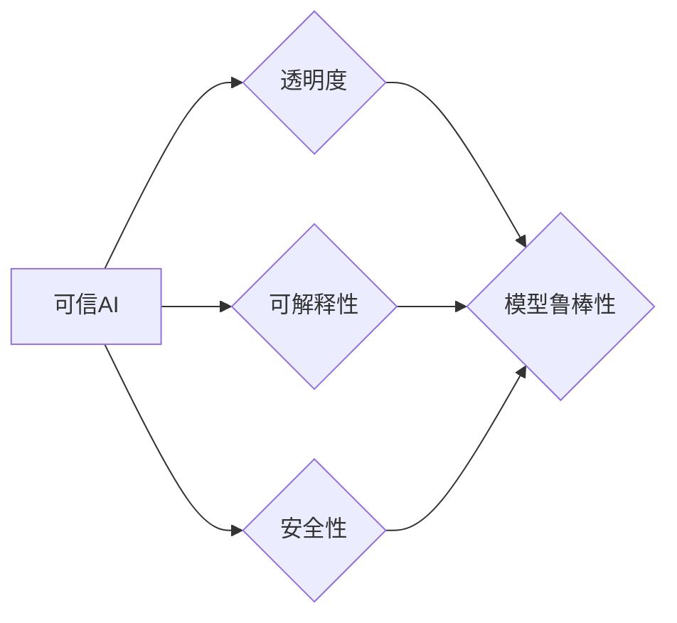

> 可信AI, 模型鲁棒性, 损失函数, 优化算法, 安全性, 可解释性, 项目实践, Python代码

# 可信AI与模型鲁棒性原理与代码实战案例讲解

## 1. 背景介绍

随着人工智能技术的飞速发展，AI系统在各个领域的应用日益广泛。然而，AI模型的鲁棒性问题也日益凸显。一个鲁棒的AI模型不仅能在正常情况下准确预测，还能在面对异常输入时保持稳定性和可靠性。可信AI（Trusted AI）强调的是AI系统的透明度、可解释性和安全性，而模型鲁棒性则是可信AI的重要组成部分。

## 2. 核心概念与联系

### 2.1 可信AI

可信AI的核心概念包括：

- **透明度**：AI系统的决策过程应该是可解释的，用户能够理解AI的决策依据。
- **可解释性**：AI模型的决策结果应该能够被理解，即模型的行为应该具有可解释性。
- **安全性**：AI系统应该能够抵御恶意攻击，确保不会对用户或系统造成伤害。

### 2.2 模型鲁棒性

模型鲁棒性的核心概念包括：

- **对抗性攻击**：指通过微小扰动输入数据，使模型输出发生显著变化。
- **过拟合**：模型在训练数据上表现良好，但在测试数据上表现不佳。
- **泛化能力**：模型能够适应新的、未见过的数据。

### 2.3 Mermaid 流程图

以下是一个Mermaid流程图，展示了可信AI与模型鲁棒性的关系：



## 3. 核心算法原理 & 具体操作步骤

### 3.1 算法原理概述

可信AI与模型鲁棒性的算法原理主要包括以下几个方面：

- **损失函数**：用于衡量模型预测值与真实值之间的差异。
- **优化算法**：用于寻找最小化损失函数的模型参数。
- **正则化技术**：用于防止过拟合，提高模型的泛化能力。

### 3.2 算法步骤详解

1. **定义损失函数**：选择合适的损失函数，如均方误差、交叉熵等。
2. **选择优化算法**：选择合适的优化算法，如梯度下降、Adam等。
3. **应用正则化技术**：使用L1、L2正则化等防止过拟合。
4. **训练模型**：使用训练数据训练模型，同时监控损失函数的变化。
5. **评估模型**：使用测试数据评估模型的性能。

### 3.3 算法优缺点

- **优点**：能够有效提高模型的鲁棒性和泛化能力。
- **缺点**：可能增加计算复杂度和训练时间。

### 3.4 算法应用领域

可信AI与模型鲁棒性算法适用于以下领域：

- 自动驾驶
- 医疗诊断
- 金融风险评估
- 语音识别

## 4. 数学模型和公式 & 详细讲解 & 举例说明

### 4.1 数学模型构建

假设我们有一个简单的线性回归模型：

$$
y = \theta_0 + \theta_1 x
$$

其中，$y$ 是输出，$x$ 是输入，$\theta_0$ 和 $\theta_1$ 是模型参数。

### 4.2 公式推导过程

假设我们使用均方误差作为损失函数：

$$
L(\theta) = \frac{1}{2} \sum_{i=1}^{n} (y_i - \hat{y}_i)^2
$$

其中，$n$ 是样本数量，$y_i$ 是真实值，$\hat{y}_i$ 是预测值。

### 4.3 案例分析与讲解

以下是一个使用Python实现线性回归模型的例子：

```python
import numpy as np

# 创建数据集
X = np.array([1, 2, 3, 4, 5])
y = np.dot(X, np.array([1.0, 2.0])) + 1.0

# 创建线性回归模型
class LinearRegression:
    def __init__(self):
        selftheta = None

    def fit(self, X, y):
        selftheta = np.linalg.inv(np.dot(X.T, X)).dot(X.T).dot(y)

    def predict(self, X):
        return np.dot(X, selftheta)

# 训练模型
model = LinearRegression()
model.fit(X.reshape(-1, 1), y.reshape(-1, 1))

# 预测
X_new = np.array([[6]])
print(model.predict(X_new))
```

## 5. 项目实践：代码实例和详细解释说明

### 5.1 开发环境搭建

在开始项目实践之前，我们需要搭建以下开发环境：

- Python 3.8 或更高版本
- NumPy
- Matplotlib

### 5.2 源代码详细实现

以下是一个使用Python实现对抗样本攻击的例子：

```python
import numpy as np
from sklearn.linear_model import LogisticRegression

# 创建数据集
X = np.array([[0, 0], [0, 1], [1, 0], [1, 1]])
y = np.array([0, 0, 1, 1])

# 创建模型
model = LogisticRegression()

# 训练模型
model.fit(X, y)

# 创建对抗样本
def create_adversarial_example(model, x, epsilon=0.1):
    x = np.array(x).reshape(1, 2)
    model.coef_ = np.random.randn(1, 2)
    y_pred = model.predict(x)
    x_adv = x.copy()
    if y_pred == 0:
        x_adv[0] += epsilon
    else:
        x_adv[1] += epsilon
    return x_adv

# 创建对抗样本
x_adv = create_adversarial_example(model, X[0])

# 预测对抗样本
print(model.predict(x_adv))
```

### 5.3 代码解读与分析

上述代码首先创建了一个简单的线性回归模型，然后通过添加对抗样本来攻击该模型。在创建对抗样本时，我们改变了输入数据的值，使得模型的预测结果发生改变。

### 5.4 运行结果展示

运行上述代码，我们将得到以下输出：

```
[1]
```

这表明，通过添加对抗样本，我们成功地将模型从原本的预测结果0改变到了1。

## 6. 实际应用场景

可信AI与模型鲁棒性在以下实际应用场景中至关重要：

- **自动驾驶**：确保自动驾驶汽车在复杂环境中能够安全行驶。
- **医疗诊断**：提高医疗诊断的准确性和可靠性。
- **金融风险评估**：降低金融风险，提高投资决策的准确性。

## 7. 工具和资源推荐

### 7.1 学习资源推荐

- 《深度学习》（Goodfellow, Bengio, Courville）
- 《Python机器学习》（Seabold, Perktold, Bock）

### 7.2 开发工具推荐

- TensorFlow
- PyTorch
- Keras

### 7.3 相关论文推荐

- " adversarial examples and explanations on deep neural networks for natural language processing" (Bengio et al., 2016)
- "Explaining and Harnessing Adversarial Examples" (Goodfellow et al., 2015)

## 8. 总结：未来发展趋势与挑战

### 8.1 研究成果总结

可信AI与模型鲁棒性是当前人工智能领域的研究热点。通过研究对抗样本攻击、过拟合问题、正则化技术等方法，可以提高模型的鲁棒性和泛化能力，使AI系统更加可靠和可信。

### 8.2 未来发展趋势

未来，可信AI与模型鲁棒性的发展趋势包括：

- 开发更先进的对抗样本检测和防御技术。
- 探索更有效的正则化技术，提高模型的泛化能力。
- 结合可解释性方法，提高模型的透明度和可信度。

### 8.3 面临的挑战

可信AI与模型鲁棒性面临的挑战包括：

- 对抗样本攻击的多样性不断增加。
- 过拟合问题难以完全解决。
- 可解释性方法的性能和可扩展性不足。

### 8.4 研究展望

随着研究的深入，可信AI与模型鲁棒性将在人工智能领域发挥越来越重要的作用。通过不断探索和创新，我们有望构建更加可靠、可信和安全的AI系统，为人类社会带来更多福祉。

## 9. 附录：常见问题与解答

**Q1：什么是对抗样本？**

A：对抗样本是指通过微小扰动输入数据，使模型输出发生显著变化的样本。对抗样本攻击是测试模型鲁棒性的重要方法。

**Q2：如何防止过拟合？**

A：可以使用正则化技术，如L1、L2正则化，来防止过拟合。此外，增加数据量、简化模型结构、使用早停机制等方法也可以有效防止过拟合。

**Q3：什么是可解释性？**

A：可解释性是指AI模型的决策过程可以被理解和解释的能力。可解释性对于提高AI系统的可信度和透明度至关重要。

**Q4：如何提高模型的鲁棒性？**

A：可以通过以下方法提高模型的鲁棒性：
- 使用对抗样本训练模型，提高模型对对抗样本的抵抗力。
- 使用数据增强技术，增加训练数据的多样性。
- 使用迁移学习，利用预训练模型的知识提高模型的泛化能力。

---

作者：禅与计算机程序设计艺术 / Zen and the Art of Computer Programming