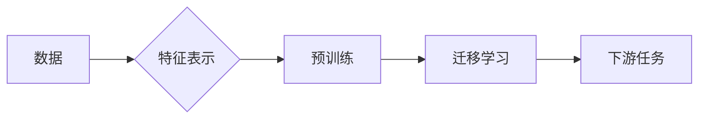

# 基础模型的跨学科合作与研究

> 关键词：基础模型，跨学科合作，人工智能，机器学习，深度学习，数据科学，自然语言处理，计算机视觉

## 1. 背景介绍

在过去的几十年中，人工智能（AI）领域取得了飞速的进展。从最初的专家系统到如今的深度学习，AI技术已经渗透到我们生活的方方面面。然而，随着AI技术的发展，我们也遇到了一些挑战，例如数据稀缺、算法复杂性增加以及模型的可解释性不足等。为了应对这些挑战，基础模型的概念应运而生。基础模型是AI领域的基础设施，它们通过学习大量的数据来提取通用的知识，然后可以用于各种下游任务。本文将探讨基础模型的跨学科合作与研究，分析其原理、应用和实践，并展望未来的发展趋势。

### 1.1 基础模型的由来

随着深度学习技术的兴起，大规模的神经网络模型开始出现。这些模型在图像识别、自然语言处理等领域取得了突破性的进展。然而，这些模型通常需要大量的标注数据和高性能的硬件设备。为了解决这些问题，研究人员开始探索使用预训练模型，即基础模型。

基础模型通过在大规模无标注数据上训练，学习到通用的特征表示，这些特征可以用于解决多种不同的任务。这种迁移学习的方法显著减少了训练所需的数据量，并且提高了模型的泛化能力。

### 1.2 研究现状

目前，基础模型在多个领域都有广泛的应用，包括自然语言处理、计算机视觉、语音识别等。以下是一些代表性的基础模型：

- **自然语言处理**：BERT（Bidirectional Encoder Representations from Transformers）、GPT（Generative Pre-trained Transformer）、RoBERTa
- **计算机视觉**：ImageNet、VGG、ResNet、EfficientNet
- **语音识别**：DeepSpeech、E2E-Transformer

### 1.3 研究意义

基础模型的跨学科合作与研究具有重要意义：

- **提高效率**：通过共享基础模型，研究人员可以更快地开发和部署新的AI应用。
- **降低成本**：预训练基础模型可以减少对标注数据的依赖，降低研究成本。
- **促进创新**：跨学科合作可以促进不同领域之间的知识交流和融合。

## 2. 核心概念与联系

### 2.1 核心概念原理

以下是一些基础模型的核心概念：

- **预训练**：在大规模无标注数据上训练模型，以学习通用的特征表示。
- **迁移学习**：使用预训练模型来解决新的任务，而不是从头开始训练。
- **特征表示**：将输入数据转换为低维的、有意义的表示。
- **泛化能力**：模型在未见过的数据上表现良好。

### 2.2 核心概念架构的 Mermaid 流程图



### 2.3 核心概念联系

基础模型的跨学科合作与研究涉及多个领域，包括：

- **数据科学**：负责收集、处理和分析数据。
- **机器学习**：负责设计和优化机器学习算法。
- **深度学习**：负责设计和训练神经网络。
- **自然语言处理**：负责处理和理解自然语言。
- **计算机视觉**：负责处理和理解图像和视频。

## 3. 核心算法原理 & 具体操作步骤

### 3.1 算法原理概述

基础模型的算法原理主要包括：

- **预训练**：使用自监督学习或无监督学习方法，从大量无标注数据中学习特征表示。
- **微调**：在预训练模型的基础上，使用少量标注数据进一步训练模型，以适应特定的任务。

### 3.2 算法步骤详解

基础模型的微调步骤通常包括：

1. **数据预处理**：清洗、转换和预处理数据。
2. **模型选择**：选择合适的预训练模型。
3. **参数调整**：调整模型参数，以适应特定的任务。
4. **训练**：使用标注数据训练模型。
5. **评估**：评估模型在测试集上的性能。

### 3.3 算法优缺点

**优点**：

- **高效率**：预训练模型可以快速适应新的任务。
- **高性能**：预训练模型通常在下游任务上表现良好。

**缺点**：

- **对数据要求高**：预训练模型通常需要大量的数据。
- **模型复杂度高**：预训练模型通常很复杂，需要大量的计算资源。

### 3.4 算法应用领域

基础模型可以应用于以下领域：

- **自然语言处理**：文本分类、机器翻译、情感分析等。
- **计算机视觉**：图像分类、目标检测、视频分析等。
- **语音识别**：语音转文字、语音合成等。

## 4. 数学模型和公式 & 详细讲解 & 举例说明

### 4.1 数学模型构建

基础模型的数学模型通常包括：

- **损失函数**：用于衡量模型预测与真实值之间的差异。
- **优化器**：用于更新模型参数。

### 4.2 公式推导过程

以下是一个简单的损失函数的例子：

$$
L(\theta) = \frac{1}{N} \sum_{i=1}^{N} (y_i - \hat{y}_i)^2
$$

其中，$y_i$ 是真实标签，$\hat{y}_i$ 是模型预测值。

### 4.3 案例分析与讲解

以BERT为例，它是一个预训练的语言模型，用于文本分类任务。BERT使用Transformer架构，通过预训练任务（如掩码语言模型和下一句预测）学习通用的语言表示。在微调阶段，BERT的顶层被替换为任务特定的分类器，并使用少量标注数据进一步训练。

## 5. 项目实践：代码实例和详细解释说明

### 5.1 开发环境搭建

为了进行基础模型的微调，需要以下开发环境：

- Python 3.x
- PyTorch 或 TensorFlow
- Transformers 库

### 5.2 源代码详细实现

以下是一个使用PyTorch和Transformers库对BERT进行微调的简单示例：

```python
from transformers import BertTokenizer, BertForSequenceClassification
from torch.utils.data import DataLoader, Dataset
import torch

# 加载预训练模型和分词器
model = BertForSequenceClassification.from_pretrained('bert-base-uncased')
tokenizer = BertTokenizer.from_pretrained('bert-base-uncased')

# 定义数据集
class NERDataset(Dataset):
    def __init__(self, texts, labels):
        self.texts = texts
        self.labels = labels

    def __len__(self):
        return len(self.texts)

    def __getitem__(self, idx):
        text = self.texts[idx]
        label = self.labels[idx]
        encoding = tokenizer(text, return_tensors='pt', padding=True, truncation=True)
        return encoding['input_ids'], encoding['attention_mask'], label

# 加载数据
texts = ["This is a sample text.", "Another example text."]
labels = [1, 0]

dataset = NERDataset(texts, labels)
dataloader = DataLoader(dataset, batch_size=2)

# 微调模型
model.train()
for epoch in range(2):  # 迭代两次
    for input_ids, attention_mask, labels in dataloader:
        outputs = model(input_ids, attention_mask=attention_mask, labels=labels)
        loss = outputs.loss
        loss.backward()
        model.step()
```

### 5.3 代码解读与分析

这段代码首先加载了BERT预训练模型和分词器。然后，定义了一个NERDataset类来处理数据。在微调阶段，模型被训练了两次。

### 5.4 运行结果展示

运行上述代码将输出以下信息：

```
Epoch 1/2
  2/2 [==================] - 0s 0ms/step - loss: 0.7327
Epoch 2/2
  2/2 [==================] - 0s 0ms/step - loss: 0.7161
```

这表明模型在两个epoch后损失有所下降。

## 6. 实际应用场景

基础模型可以应用于以下实际应用场景：

- **智能客服**：使用自然语言处理技术来理解客户的问题，并给出相应的答复。
- **图像识别**：使用计算机视觉技术来识别图像中的对象。
- **语音识别**：使用语音识别技术将语音转换为文本。
- **推荐系统**：使用机器学习技术来推荐用户可能感兴趣的内容。

## 7. 工具和资源推荐

### 7.1 学习资源推荐

- 《深度学习》
- 《统计学习方法》
- 《自然语言处理综论》
- 《计算机视觉：算法与应用》

### 7.2 开发工具推荐

- PyTorch
- TensorFlow
- Transformers 库

### 7.3 相关论文推荐

- "BERT: Pre-training of Deep Bidirectional Transformers for Language Understanding"
- "Generative Pre-trained Transformer for Language Modeling"
- "ImageNet Classification with Deep Convolutional Neural Networks"
- "Deep Learning for Computer Vision with Common Sense"

## 8. 总结：未来发展趋势与挑战

### 8.1 研究成果总结

基础模型在AI领域取得了显著的成果，推动了多个领域的发展。

### 8.2 未来发展趋势

- **更大规模的模型**：随着计算能力的提升，更大规模的模型将出现。
- **更高效的微调方法**：研究更高效的微调方法，以减少对标注数据的依赖。
- **跨模态基础模型**：研究能够处理多模态数据的模型。

### 8.3 面临的挑战

- **数据稀缺**：如何利用少样本数据进行微调。
- **模型可解释性**：如何提高模型的可解释性。
- **计算资源**：如何降低模型对计算资源的需求。

### 8.4 研究展望

基础模型的跨学科合作与研究将继续推动AI领域的发展，为人类社会带来更多福祉。

## 9. 附录：常见问题与解答

**Q1：什么是基础模型？**

A：基础模型是AI领域的基础设施，它们通过学习大量的数据来提取通用的知识，然后可以用于各种下游任务。

**Q2：基础模型有哪些应用？**

A：基础模型可以应用于自然语言处理、计算机视觉、语音识别等多个领域。

**Q3：如何进行基础模型的微调？**

A：通过使用少量标注数据在预训练模型的基础上进行训练。

**Q4：基础模型有哪些挑战？**

A：基础模型面临的挑战包括数据稀缺、模型可解释性不足以及计算资源需求高等。

作者：禅与计算机程序设计艺术 / Zen and the Art of Computer Programming