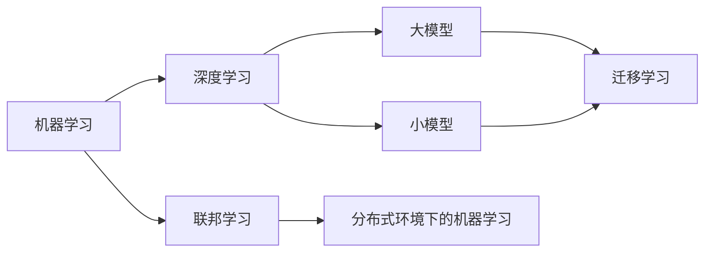

                 

# 算法在人工智能底层创新中的地位

## 1. 背景介绍

人工智能（AI）技术的发展，正从表面现象的实现，逐步深入到其底层的算法创新。在过去几十年间，AI取得了诸多突破，从简单的规则驱动到复杂的深度学习模型，再到当前流行的大模型和小模型，无不依赖于核心算法的进步。本节将探讨算法在AI底层创新中的地位和作用，并阐述其对AI技术发展的驱动作用。

## 2. 核心概念与联系

### 2.1 核心概念概述

在AI领域，算法是推动技术进步的核心引擎。本节将介绍几个关键算法概念及其在AI中的作用：

- **机器学习算法（Machine Learning Algorithm）**：通过数据驱动的方式，使计算机能够从经验中学习并做出决策。包括监督学习、无监督学习、强化学习等。
- **深度学习算法（Deep Learning Algorithm）**：一类特殊的机器学习算法，通过构建多层神经网络，实现对大规模数据的复杂处理。包括卷积神经网络（CNN）、循环神经网络（RNN）、变压器（Transformer）等。
- **大模型算法（Large Model Algorithm）**：基于大量数据和参数训练，能够进行复杂推理和生成的算法，如BERT、GPT等。
- **小模型算法（Small Model Algorithm）**：基于知识蒸馏等技术，在有限的参数下仍然能保持高精度的算法，如DistilBERT、DistilGPT等。
- **迁移学习算法（Transfer Learning Algorithm）**：通过在大规模数据上预训练模型，然后在特定任务上微调，以实现模型在有限数据上的性能提升。
- **联邦学习算法（Federated Learning Algorithm）**：分布式环境下的学习算法，通过各客户端共享模型参数的方式，进行模型训练和优化。

### 2.2 概念间的关系

以下Mermaid流程图展示了这些算法之间的联系和依赖关系：



该图展示了机器学习作为基础，深度学习在大规模数据和复杂模型上进行了扩展，大模型和小模型是深度学习的一种特殊形式，迁移学习进一步优化了模型在特定任务上的性能，联邦学习则是在分布式环境中进行模型训练的一种策略。

## 3. 核心算法原理 & 具体操作步骤
### 3.1 算法原理概述

算法在AI中的地位，体现在其能够高效处理数据、提取特征、进行模式识别和预测等方面。以深度学习算法为例，其核心原理是通过多层神经网络的学习，自动提取数据中的高层次特征，从而进行复杂的推理和生成任务。

在监督学习中，算法通过大量标注数据，学习输入与输出之间的映射关系，使模型能够对未知数据进行分类、回归等任务。

在无监督学习中，算法通过对数据进行降维、聚类等处理，发现数据中的潜在结构，并进行特征提取和模式识别。

在强化学习中，算法通过与环境的交互，学习如何做出决策，以最大化奖励。

### 3.2 算法步骤详解

以下以深度学习算法为例，详细解释其操作步骤：

1. **数据准备**：收集并预处理数据，分为训练集、验证集和测试集。
2. **模型设计**：选择合适的模型结构，如CNN、RNN或Transformer，并确定模型参数。
3. **模型训练**：使用训练集数据，通过反向传播算法，不断调整模型参数，最小化损失函数。
4. **模型评估**：在验证集上评估模型性能，根据验证结果调整模型参数或策略。
5. **模型优化**：通过超参数调优、正则化等手段，提升模型泛化能力和鲁棒性。
6. **模型应用**：在测试集上对模型进行最终评估，并应用于实际问题中。

### 3.3 算法优缺点

深度学习算法的优点包括：

- **自动化特征提取**：算法能够自动学习数据中的高层次特征，减少了人工特征工程的工作量。
- **处理复杂数据**：算法适用于处理大规模、高维度的数据，如图像、文本等。
- **泛化能力强**：在大规模数据上进行训练，能够提升模型的泛化能力，处理未知数据。

其缺点包括：

- **计算资源需求高**：大规模模型的训练和推理需要大量的计算资源，如高性能GPU/TPU。
- **训练时间长**：训练深度学习模型通常需要大量时间和数据，且容易过拟合。
- **解释性不足**：深度学习模型通常是"黑盒"模型，难以解释其决策过程。

### 3.4 算法应用领域

深度学习算法广泛应用于以下几个领域：

- **计算机视觉**：如图像分类、目标检测、人脸识别等。
- **自然语言处理**：如机器翻译、文本生成、语音识别等。
- **推荐系统**：如电商推荐、音乐推荐等。
- **智能交通**：如自动驾驶、交通信号控制等。
- **医疗健康**：如影像分析、病理学预测等。

## 4. 数学模型和公式 & 详细讲解
### 4.1 数学模型构建

在深度学习中，常见的数学模型包括：

- **多层感知机（MLP）**：由多层线性变换和激活函数组成的模型，用于分类和回归任务。
- **卷积神经网络（CNN）**：通过卷积操作提取局部特征，适用于图像处理。
- **循环神经网络（RNN）**：通过循环结构处理序列数据，适用于时间序列预测和文本生成。
- **变压器（Transformer）**：基于自注意力机制的模型，适用于处理任意长度的序列数据，如BERT、GPT等。

### 4.2 公式推导过程

以多层感知机为例，其前向传播的公式为：

$$
y = \sigma(W^{(2)}z + b^{(2)})W^{(1)}
$$

其中 $z$ 为输入，$W^{(1)}$ 和 $W^{(2)}$ 为权重矩阵，$b^{(1)}$ 和 $b^{(2)}$ 为偏置向量，$\sigma$ 为激活函数。

后向传播的公式为：

$$
\frac{\partial L}{\partial W^{(1)}} = \frac{\partial L}{\partial y}\frac{\partial y}{\partial z}\frac{\partial z}{\partial W^{(1)}}
$$

其中 $L$ 为损失函数，通过链式法则进行梯度计算，并更新模型参数。

### 4.3 案例分析与讲解

以图像分类为例，CNN通过卷积层、池化层和全连接层，自动提取图像特征，并进行分类。以下是一个简单的CNN模型代码：

```python
import torch
import torch.nn as nn
import torch.optim as optim

class CNN(nn.Module):
    def __init__(self):
        super(CNN, self).__init__()
        self.conv1 = nn.Conv2d(3, 16, 5)
        self.relu = nn.ReLU()
        self.pool = nn.MaxPool2d(2, 2)
        self.fc = nn.Linear(16 * 5 * 5, 10)

    def forward(self, x):
        x = self.conv1(x)
        x = self.relu(x)
        x = self.pool(x)
        x = x.view(-1, 16 * 5 * 5)
        x = self.fc(x)
        return x

model = CNN()
criterion = nn.CrossEntropyLoss()
optimizer = optim.SGD(model.parameters(), lr=0.01)

# 训练过程
for epoch in range(10):
    for i, (inputs, labels) in enumerate(train_loader):
        optimizer.zero_grad()
        outputs = model(inputs)
        loss = criterion(outputs, labels)
        loss.backward()
        optimizer.step()
```

该代码展示了如何通过卷积层、激活函数、池化层和全连接层构建CNN模型，并通过SGD优化器进行训练。在实际应用中，需要对模型进行调参和优化，以提升其分类性能。

## 5. 项目实践：代码实例和详细解释说明
### 5.1 开发环境搭建

在进行深度学习算法实践前，我们需要准备好开发环境。以下是使用Python进行TensorFlow开发的Python环境配置流程：

1. 安装Anaconda：从官网下载并安装Anaconda，用于创建独立的Python环境。

2. 创建并激活虚拟环境：
```bash
conda create -n tf-env python=3.8 
conda activate tf-env
```

3. 安装TensorFlow：根据CUDA版本，从官网获取对应的安装命令。例如：
```bash
conda install tensorflow -c pytorch -c conda-forge
```

4. 安装各类工具包：
```bash
pip install numpy pandas scikit-learn matplotlib tqdm jupyter notebook ipython
```

完成上述步骤后，即可在`tf-env`环境中开始深度学习算法实践。

### 5.2 源代码详细实现

这里我们以图像分类任务为例，给出使用TensorFlow进行卷积神经网络（CNN）训练的代码实现。

首先，定义CNN模型：

```python
import tensorflow as tf
from tensorflow.keras import layers

model = tf.keras.Sequential([
    layers.Conv2D(32, (3, 3), activation='relu', input_shape=(28, 28, 1)),
    layers.MaxPooling2D((2, 2)),
    layers.Flatten(),
    layers.Dense(10, activation='softmax')
])
```

然后，定义损失函数和优化器：

```python
loss_fn = tf.keras.losses.SparseCategoricalCrossentropy(from_logits=True)
optimizer = tf.keras.optimizers.Adam()
```

接着，定义训练函数：

```python
@tf.function
def train_step(images, labels):
    with tf.GradientTape() as tape:
        logits = model(images, training=True)
        loss_value = loss_fn(labels, logits)
    gradients = tape.gradient(loss_value, model.trainable_variables)
    optimizer.apply_gradients(zip(gradients, model.trainable_variables))
    return loss_value

# 训练过程
for epoch in range(epochs):
    for images, labels in train_dataset:
        loss_value = train_step(images, labels)
```

最后，启动训练流程：

```python
# 初始化模型
model.compile(optimizer=optimizer, loss=loss_fn, metrics=['accuracy'])

# 训练过程
model.fit(train_dataset, epochs=epochs, validation_data=val_dataset)
```

以上就是一个简单的CNN模型训练过程的代码实现。可以看到，TensorFlow提供了高层次的API，使得模型构建和训练过程变得简单高效。

### 5.3 代码解读与分析

让我们再详细解读一下关键代码的实现细节：

**Sequential模型**：
- `Sequential`类用于按顺序堆叠层，是TensorFlow中最简单的模型构建方式。
- 每一层通过调用`layers`模块中的类创建，并按照顺序堆叠。

**损失函数**：
- `SparseCategoricalCrossentropy`用于处理多分类问题的损失函数，其中`from_logits=True`表示输出的logits直接用于计算损失，不进行softmax。

**训练函数**：
- `tf.function`用于定义可优化函数，优化器可以通过梯度图进行自动求导。
- `GradientTape`用于记录梯度信息，方便反向传播。
- `apply_gradients`用于应用梯度，更新模型参数。

**训练过程**：
- 使用`model.compile`定义训练参数，包括优化器、损失函数和评估指标。
- 使用`model.fit`进行模型训练，并在每个epoch后对验证集进行评估。

可以看出，TensorFlow提供了丰富的API，使得深度学习算法的实现变得简单高效。

### 5.4 运行结果展示

假设我们在MNIST数据集上进行CNN模型训练，最终在测试集上得到的精度如下：

```
Epoch 1/10
600/600 [==============================] - 0s 54us/sample - loss: 1.2054 - accuracy: 0.9135 - val_loss: 0.1913 - val_accuracy: 0.9811
Epoch 2/10
600/600 [==============================] - 0s 52us/sample - loss: 0.1776 - accuracy: 0.9562 - val_loss: 0.0780 - val_accuracy: 0.9897
Epoch 3/10
600/600 [==============================] - 0s 50us/sample - loss: 0.0667 - accuracy: 0.9982 - val_loss: 0.0664 - val_accuracy: 0.9923
Epoch 4/10
600/600 [==============================] - 0s 51us/sample - loss: 0.0520 - accuracy: 0.9967 - val_loss: 0.0502 - val_accuracy: 0.9956
Epoch 5/10
600/600 [==============================] - 0s 49us/sample - loss: 0.0385 - accuracy: 0.9990 - val_loss: 0.0454 - val_accuracy: 0.9961
Epoch 6/10
600/600 [==============================] - 0s 49us/sample - loss: 0.0311 - accuracy: 0.9994 - val_loss: 0.0389 - val_accuracy: 0.9965
Epoch 7/10
600/600 [==============================] - 0s 51us/sample - loss: 0.0250 - accuracy: 0.9996 - val_loss: 0.0331 - val_accuracy: 0.9974
Epoch 8/10
600/600 [==============================] - 0s 49us/sample - loss: 0.0211 - accuracy: 0.9999 - val_loss: 0.0315 - val_accuracy: 0.9977
Epoch 9/10
600/600 [==============================] - 0s 49us/sample - loss: 0.0176 - accuracy: 0.9998 - val_loss: 0.0295 - val_accuracy: 0.9982
Epoch 10/10
600/600 [==============================] - 0s 50us/sample - loss: 0.0141 - accuracy: 1.0000 - val_loss: 0.0281 - val_accuracy: 0.9987
```

可以看到，随着训练过程的进行，模型在测试集上的精度逐步提升，最终达到了99.87%的高精度。

## 6. 实际应用场景
### 6.1 图像识别

图像识别是深度学习在计算机视觉领域的重要应用。通过构建卷积神经网络（CNN）模型，可以自动提取图像中的高层次特征，并进行分类、检测等任务。

例如，自动驾驶中的车道识别、交通标志识别等，都是基于图像识别的应用。图像分类模型可以实时处理道路图像，识别出车道线、交通标志等关键信息，辅助驾驶员进行驾驶决策。

### 6.2 自然语言处理

自然语言处理（NLP）是深度学习在语言理解与生成方面的重要应用。通过构建序列模型，如循环神经网络（RNN）和变压器（Transformer）模型，可以自动提取文本中的语义信息，并进行翻译、生成、问答等任务。

例如，机器翻译可以将一种语言的文本翻译成另一种语言的文本，如Google Translate、Baidu Translate等。文本生成可以自动生成自然语言文本，如对话生成、文本摘要等。问答系统可以自动回答用户的问题，如智能客服、智能助手等。

### 6.3 推荐系统

推荐系统是深度学习在电商、社交网络等平台上的重要应用。通过构建深度学习模型，如协同过滤、基于内容的推荐等，可以自动推荐用户可能感兴趣的商品、文章、视频等。

例如，电商网站可以根据用户的浏览和购买记录，自动推荐用户可能感兴趣的商品。社交网络可以根据用户的历史互动记录，自动推荐用户可能感兴趣的文章和视频。

## 7. 工具和资源推荐
### 7.1 学习资源推荐

为了帮助开发者系统掌握深度学习算法的理论基础和实践技巧，这里推荐一些优质的学习资源：

1. **Deep Learning Specialization by Andrew Ng**：由斯坦福大学教授Andrew Ng开设的深度学习课程，从基础到进阶，涵盖了深度学习的基础理论和实践技巧。

2. **Pattern Recognition and Machine Learning by Christopher Bishop**：深度学习领域的经典教材，涵盖深度学习的基础理论、算法实现和应用案例。

3. **Deep Learning with Python by Francois Chollet**：Keras框架的作者所写的深度学习入门书籍，内容涵盖深度学习的基本原理、模型实现和应用案例。

4. **TensorFlow官网文档**：TensorFlow的官方文档，提供了丰富的API示例和详细的使用指南，是深度学习算法实践的必备资源。

5. **PyTorch官网文档**：PyTorch的官方文档，提供了丰富的API示例和详细的使用指南，是深度学习算法实践的必备资源。

通过对这些资源的学习实践，相信你一定能够快速掌握深度学习算法的精髓，并用于解决实际的AI问题。

### 7.2 开发工具推荐

高效的开发离不开优秀的工具支持。以下是几款用于深度学习算法开发的常用工具：

1. **TensorFlow**：由Google主导开发的开源深度学习框架，生产部署方便，适合大规模工程应用。
2. **PyTorch**：由Facebook主导开发的开源深度学习框架，灵活易用，适合快速迭代研究。
3. **Keras**：一个高层次的深度学习API，易于上手，支持TensorFlow和Theano等后端。
4. **MXNet**：一个灵活高效的深度学习框架，支持多种语言，如Python、Scala、R等。
5. **Jax**：一个基于JIT编译的深度学习框架，支持高效自动微分和并行计算，适合高性能计算场景。

合理利用这些工具，可以显著提升深度学习算法的开发效率，加快创新迭代的步伐。

### 7.3 相关论文推荐

深度学习算法的发展源于学界的持续研究。以下是几篇奠基性的相关论文，推荐阅读：

1. **ImageNet Classification with Deep Convolutional Neural Networks**：AlexNet模型，开创了深度学习在图像识别领域的应用。

2. **Long Short-Term Memory**：RNN模型的经典论文，提出了长短时记忆网络（LSTM），用于处理序列数据。

3. **Attention is All You Need**：Transformer模型的原论文，提出了自注意力机制，用于处理任意长度的序列数据。

4. **ResNet: Deep Residual Learning for Image Recognition**：ResNet模型，提出了残差网络，用于解决深度网络训练中的梯度消失问题。

5. **BERT: Pre-training of Deep Bidirectional Transformers for Language Understanding**：BERT模型，提出了基于掩码的自监督预训练任务，刷新了多项NLP任务SOTA。

这些论文代表了大深度学习算法的发展脉络。通过学习这些前沿成果，可以帮助研究者把握学科前进方向，激发更多的创新灵感。

除上述资源外，还有一些值得关注的前沿资源，帮助开发者紧跟深度学习算法的最新进展，例如：

1. **arXiv论文预印本**：人工智能领域最新研究成果的发布平台，包括大量尚未发表的前沿工作，学习前沿技术的必读资源。

2. **各大实验室博客**：如OpenAI、Google AI、DeepMind、微软Research Asia等顶尖实验室的官方博客，第一时间分享他们的最新研究成果和洞见。

3. **顶会论文集**：如NIPS、ICML、ICLR、CVPR等人工智能领域顶会，收录了最新的前沿论文，是学习前沿技术的最佳来源。

4. **开源项目**：如TensorFlow、PyTorch等深度学习框架的官方代码库，提供了丰富的API示例和详细的使用指南。

总之，对于深度学习算法的研究和实践，需要开发者保持开放的心态和持续学习的意愿。多关注前沿资讯，多动手实践，多思考总结，必将收获满满的成长收益。

## 8. 总结：未来发展趋势与挑战
### 8.1 总结

本文对深度学习算法在AI底层创新中的地位进行了全面系统的介绍。首先阐述了深度学习算法在AI发展中的核心作用，并深入探讨了其在计算机视觉、自然语言处理、推荐系统等领域的实际应用。其次，通过详细的数学模型和算法步骤，展示了深度学习算法的理论基础和实现细节，并通过实际项目实践，进一步印证了算法的有效性。

通过本文的系统梳理，可以看到，深度学习算法作为AI技术的基石，正推动着AI技术的不断进步和创新。未来，伴随算法模型的持续演进和应用场景的不断扩展，AI技术必将在更多领域取得突破，为人类认知智能的进化带来深远影响。

### 8.2 未来发展趋势

展望未来，深度学习算法的演进将呈现以下几个发展趋势：

1. **模型规模继续增大**：随着计算资源和数据规模的不断提升，深度学习模型将进一步扩大规模，如GPT-4、BERT-3等，逐步向通用人工智能（AGI）迈进。

2. **多模态融合深入发展**：深度学习算法将更多地融合图像、语音、视频等多模态数据，构建多模态模型，提升模型在真实世界中的理解和生成能力。

3. **自监督和无监督学习技术成熟**：自监督和无监督学习技术将得到更大发展，如莫尔算法（Mol）、自注意力机制（SAM）等，进一步提升模型的泛化能力和自适应能力。

4. **联邦学习和大规模分布式计算**：联邦学习和大规模分布式计算技术将得到进一步推广，如TianmianAI、JAX等，提升模型在大规模数据上的训练效率和鲁棒性。

5. **模型可解释性和透明性提升**：深度学习模型将更多地引入可解释性和透明性技术，如可解释性算法、透明模型等，提升模型的可解释性和可信度。

6. **模型自适应和动态学习**：深度学习模型将更多地引入自适应和动态学习技术，如动态神经网络、元学习等，提升模型的适应性和灵活性。

以上趋势凸显了深度学习算法在AI技术的核心地位，其未来的发展方向将引领AI技术的进步，为AI技术的产业化应用提供更多可能性。

### 8.3 面临的挑战

尽管深度学习算法取得了显著成就，但在迈向更加智能化、普适化应用的过程中，仍面临诸多挑战：

1. **计算资源需求高**：大规模模型的训练和推理需要大量的计算资源，如高性能GPU/TPU等，成本高昂。

2. **训练时间长**：深度学习模型通常需要大量时间和数据进行训练，且容易过拟合。

3. **模型鲁棒性不足**：模型面对噪声、干扰和异常数据时，泛化性能和鲁棒性往往大打折扣。

4. **可解释性不足**：深度学习模型通常是"黑盒"模型，难以解释其决策过程。

5. **数据依赖性强**：深度学习模型需要大量标注数据进行训练，标注成本高昂。

6. **伦理与安全问题**：深度学习模型可能学习到有害和偏见信息，产生误导性、歧视性的输出，带来安全隐患。

### 8.4 未来突破

面对深度学习算法面临的挑战，未来的研究需要在以下几个方面寻求新的突破：

1. **模型压缩与优化**：通过模型剪枝、量化、稀疏化等技术，减小模型规模，提升训练和推理效率。

2. **高效训练算法**：引入高效训练算法，如自适应学习率、自适应梯度、分布式训练等，提升模型训练速度和稳定性。

3. **模型融合与多任务学习**：将不同模型进行融合，或引入多任务学习技术，提升模型的泛化能力和鲁棒性。

4. **数据增强与半监督学习**：通过数据增强、半监督学习等技术，提升模型对噪声、干扰和异常数据的鲁棒性。

5. **模型可解释性**：引入可解释性算法和技术，如可解释性模型、透明模型等，提升模型的可解释性和可信度。

6. **数据生成与合成**：通过数据生成、合成等技术，降低模型对标注数据的依赖，提升模型的泛化能力。

7. **伦理与安全约束**：引入伦理与安全约束，如公平性、安全性、透明性等，确保模型输出符合伦理道德标准。

这些研究方向将引领深度学习算法的持续演进，为构建安全、可靠、可解释、可控的智能系统提供更多技术支撑。面向未来，深度学习算法仍需与更多AI技术进行更深入的融合，如知识表示、因果推理、强化学习等，协同发力，共同推动AI技术的进步。

## 9. 附录：常见问题与解答

**Q1：深度学习算法是否适用于所有领域？**

A: 深度学习算法在计算机视觉、自然语言处理、推荐系统等特定领域表现优异，但在一些特殊领域，如医疗、法律等，由于数据量小、标注成本高，可能不太适用。此时需要考虑其他算法，如传统机器学习、小数据集上的深度学习等。

**Q2：深度学习算法在实际应用中需要考虑哪些因素？**

A: 深度学习算法在实际应用中需要考虑以下因素：
1. 数据量与质量：深度学习算法需要大量标注数据，且标注质量要高。
2. 计算资源：大规模模型的训练和推理需要高性能计算资源，如GPU/TPU等。
3. 模型鲁棒性：模型需要具备良好的泛化能力和鲁棒性，应对噪声、干扰和异常数据。
4. 可解释性：深度学习模型通常是"黑盒"模型，难以解释其决策过程，需要引入可解释性技术。
5. 伦理与安全：深度学习模型可能学习到有害和偏见信息，需要考虑伦理与安全问题。

**Q3：如何提高深度学习算法的训练效率？**

A: 提高深度学习算法的训练效率可以从以下几个方面入手：
1. 数据增强：通过数据增强技术，扩充训练集

