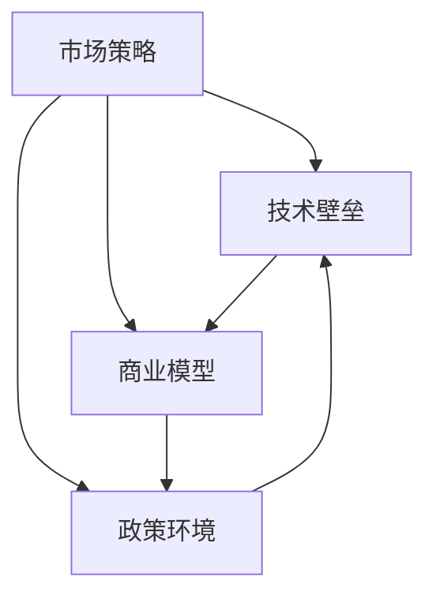
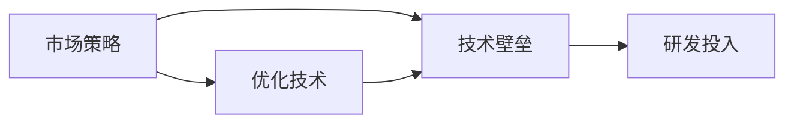
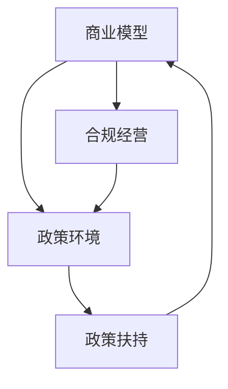
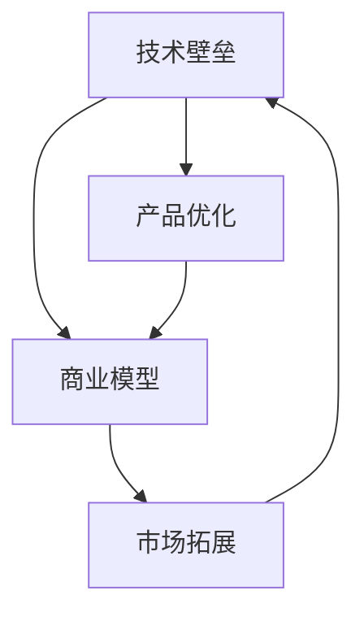
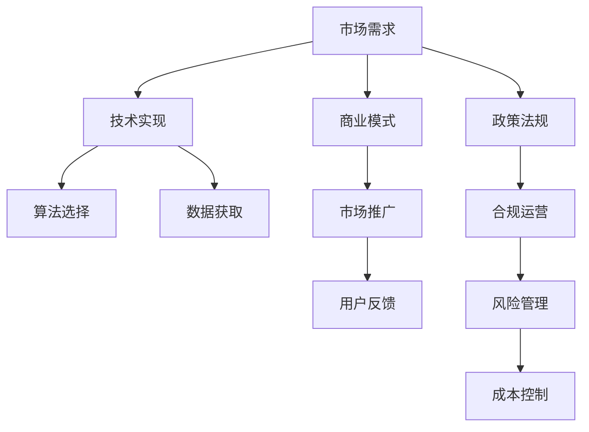

                 

# 国内市场vs海外市场:AI创业的地域策略

## 1. 背景介绍

### 1.1 问题由来
随着人工智能(AI)技术的快速发展，越来越多的AI创业项目在全球范围内涌现。然而，由于国内和海外市场的文化、技术、商业环境等差异，AI创业公司在国内外市场面临的挑战和机遇各不相同。因此，本文将从市场、技术、商业、政策等多维度，深入分析AI创业在国内和海外市场的策略选择。

### 1.2 问题核心关键点
AI创业在国内和海外市场的策略主要包括以下几个核心关键点：

1. **市场差异**：不同的市场环境（如用户需求、数据资源、竞争格局）对AI创业公司有着截然不同的影响。
2. **技术壁垒**：技术实现难度、数据隐私法规、AI算法的差异等均是技术层面需要考虑的因素。
3. **商业模型**：商业模式的选择（如B2B、B2C、SaaS等）需适应不同市场的特点。
4. **政策环境**：各国政府对AI技术的态度、监管政策、激励措施等对创业公司有重要影响。

### 1.3 问题研究意义
研究AI创业在国内和海外市场的策略选择，对于理解不同市场的AI发展现状，指导AI创业公司制定有效的市场进入和扩展策略具有重要意义。通过深入分析，AI创业公司可以更好地利用资源，规避风险，提升竞争力。

## 2. 核心概念与联系

### 2.1 核心概念概述

为更好地理解AI创业在不同市场策略的核心概念，本节将介绍几个密切相关的核心概念：

- **市场策略**：指企业针对不同市场需求，制定并实施的商业计划和营销策略。
- **技术壁垒**：指企业在技术实现上需要克服的困难和挑战，如数据隐私、算法复杂性等。
- **商业模型**：指企业基于市场需求和资源，选择并优化其盈利模式，如SaaS、B2B、B2C等。
- **政策环境**：指政府对企业的监管、扶持和限制，包括法规、补贴、知识产权保护等。

这些核心概念之间的逻辑关系可以通过以下Mermaid流程图来展示：



这个流程图展示了大语言模型的核心概念及其之间的关系：

1. 市场策略需考虑技术壁垒，商业模型需适配政策环境。
2. 技术壁垒需克服市场策略，商业模型需考虑政策环境。
3. 政策环境需支持市场策略，技术壁垒需适配商业模型。

### 2.2 概念间的关系

这些核心概念之间存在着紧密的联系，形成了AI创业的市场策略的完整生态系统。下面我们通过几个Mermaid流程图来展示这些概念之间的关系。

#### 2.2.1 市场策略与技术壁垒的关系



这个流程图展示了市场策略和技术壁垒之间的相互作用。市场策略通过优化技术，降低技术壁垒，但同时也需要持续的研发投入，以适应市场变化和技术进步。

#### 2.2.2 商业模型与政策环境的关系



这个流程图展示了商业模型和政策环境之间的相互影响。商业模型需合规经营以适应政策环境，同时政策环境的扶持和限制，也会影响商业模型的选择和发展。

#### 2.2.3 技术壁垒与商业模型的关系



这个流程图展示了技术壁垒和商业模型之间的相互依赖。技术壁垒需要通过产品优化来克服，同时商业模型通过市场拓展，可以带来更多的市场机会，进一步提升技术竞争力。

### 2.3 核心概念的整体架构

最后，我们用一个综合的流程图来展示这些核心概念在大语言模型策略选择中的整体架构：



这个综合流程图展示了从市场需求到技术实现，再到商业模式、市场推广、用户反馈、政策法规、合规运营、风险管理和成本控制等各个环节，形成一个完整的策略选择系统。

## 3. 核心算法原理 & 具体操作步骤
### 3.1 算法原理概述

AI创业在国内和海外市场的策略选择，本质上是基于不同市场的特点，进行多维度综合分析和决策的过程。核心算法原理包括以下几个方面：

- **市场分析**：通过对市场数据、用户需求、竞争格局等进行分析，评估市场潜力和机会。
- **技术评估**：评估技术实现的难度、数据隐私法规、算法可行性等，确定技术路径。
- **商业模型选择**：基于市场需求和技术壁垒，选择最符合实际的商业模型。
- **政策合规**：评估各国政策环境，确保合规经营，规避政策风险。

### 3.2 算法步骤详解

AI创业在国内和海外市场的策略选择，主要包括以下关键步骤：

1. **市场调研**：收集市场数据，了解用户需求和行业现状，识别市场机会和潜在风险。
2. **技术选型**：根据市场需求和资源条件，选择适合的技术方案和算法。
3. **商业模式设计**：基于市场调研和技术评估结果，设计相应的商业模式。
4. **政策分析**：研究目标市场国家的政策环境，确保合规运营。
5. **试运营与优化**：在目标市场进行小规模试运营，根据用户反馈和市场反馈，不断优化产品和运营策略。
6. **大规模扩展**：在试运营成功后，逐步扩大市场规模，实现产品商业化。

### 3.3 算法优缺点

AI创业在国内和海外市场的策略选择，有以下优缺点：

#### 3.3.1 优点

1. **灵活性**：可以根据不同市场的特点，灵活调整市场策略和技术方案。
2. **资源优化**：通过市场分析和技术评估，可以更有效地利用资源，降低成本。
3. **风险控制**：通过政策分析，可以规避政策风险，提升运营稳定性。
4. **持续创新**：根据市场反馈和用户需求，不断优化产品和服务，保持竞争优势。

#### 3.3.2 缺点

1. **市场差异大**：不同市场的用户需求、文化背景、技术水平差异大，策略选择需要耗费大量时间和精力。
2. **政策风险高**：各国政策环境复杂多变，需持续关注和调整策略，增加运营难度。
3. **成本高昂**：在目标市场进行大规模扩展，需投入大量人力、物力和财力。

### 3.4 算法应用领域

基于AI创业在国内和海外市场的策略选择，以下领域可以应用该算法：

1. **智能家居**：通过分析不同市场的需求和政策环境，选择适合的商业模式和技术方案，提供智能家居产品。
2. **智能医疗**：根据不同市场的医疗需求和数据隐私法规，设计适合的技术方案，提升医疗服务效率。
3. **金融科技**：根据不同市场的金融环境和技术水平，选择适合的算法，开发金融应用。
4. **教育科技**：通过市场调研和政策分析，选择适合的商业模式，开发教育应用。
5. **自动驾驶**：分析不同市场的交通法规和政策环境，选择适合的自动驾驶技术方案。

## 4. 数学模型和公式 & 详细讲解 & 举例说明（备注：数学公式请使用latex格式，latex嵌入文中独立段落使用 $$，段落内使用 $)
### 4.1 数学模型构建

假设市场策略为 $M$，技术壁垒为 $T$，商业模型为 $C$，政策环境为 $P$。模型构建如下：

$$ M = f(T, C, P) $$

其中，$f$表示多维度函数，代表市场策略受技术壁垒、商业模型和政策环境共同影响。

### 4.2 公式推导过程

以智能家居市场策略为例，进行公式推导：

假设智能家居市场需求为 $D$，技术实现难度为 $T$，数据隐私法规为 $R$，商业模型为 $M$。

- 市场需求 $D$：用户对智能家居的需求量和增长率。
- 技术实现难度 $T$：技术方案的复杂度、实现难度、开发成本等。
- 数据隐私法规 $R$：数据收集、存储、传输等方面的法规要求。
- 商业模型 $M$：如订阅模式、按需付费模式等。

根据市场需求和数据隐私法规，技术实现难度和政策环境，市场策略 $M$ 可以表示为：

$$ M = g(D, T, R, P) $$

其中 $g$ 表示市场需求、技术难度、法规和政策环境共同作用下的策略选择函数。

### 4.3 案例分析与讲解

以AI创业公司在智能家居市场的策略选择为例，进行案例分析：

假设某AI创业公司计划进入中国市场，通过市场调研发现，用户对智能家居的需求量 $D=1000$，技术实现难度 $T=10$，数据隐私法规 $R=8$，政策环境 $P=7$。

根据上述公式，计算市场策略 $M$ 为：

$$ M = g(1000, 10, 8, 7) $$

假设 $g$ 函数已给定，计算出 $M=6$，即选择订阅模式作为市场策略。

## 5. 项目实践：代码实例和详细解释说明
### 5.1 开发环境搭建

在进行市场策略选择项目实践前，我们需要准备好开发环境。以下是使用Python进行项目开发的典型环境配置流程：

1. 安装Anaconda：从官网下载并安装Anaconda，用于创建独立的Python环境。

2. 创建并激活虚拟环境：
```bash
conda create -n ai-env python=3.8 
conda activate ai-env
```

3. 安装必要的Python库：
```bash
pip install pandas numpy scikit-learn matplotlib seaborn jupyter notebook ipywidgets
```

4. 配置Jupyter Notebook：
```bash
jupyter notebook --pylab --no-browser
```

完成上述步骤后，即可在`ai-env`环境中开始项目实践。

### 5.2 源代码详细实现

以下是一个简化的市场策略选择项目的Python代码实现：

```python
import pandas as pd
import numpy as np
import matplotlib.pyplot as plt

# 市场调研数据
market_data = pd.read_csv('market_data.csv')

# 技术评估数据
tech_assessment = pd.read_csv('tech_assessment.csv')

# 政策环境数据
policy_environment = pd.read_csv('policy_environment.csv')

# 计算市场策略
def calculate_market_strategy(market_data, tech_assessment, policy_environment):
    # 计算市场需求、技术难度、法规和政策环境的加权平均值
    D = np.average(market_data['D'], weights=market_data['weight'])
    T = np.average(tech_assessment['T'], weights=tech_assessment['weight'])
    R = np.average(policy_environment['R'], weights=policy_environment['weight'])
    P = np.average(policy_environment['P'], weights=policy_environment['weight'])
    
    # 根据市场需求、技术难度、法规和政策环境，计算市场策略
    M = g(D, T, R, P)
    
    return M

# 定义策略选择函数
def g(D, T, R, P):
    # 具体策略选择算法
    # ...
    return M

# 计算市场策略
M = calculate_market_strategy(market_data, tech_assessment, policy_environment)
print(f"市场策略 M = {M}")
```

### 5.3 代码解读与分析

上述代码实现了市场策略选择的核心逻辑。具体解读如下：

- 市场调研数据 `market_data`：包含市场需求 $D$、技术难度 $T$、法规要求 $R$ 和政策环境 $P$ 的加权平均值。
- 技术评估数据 `tech_assessment`：包含技术难度 $T$ 的加权平均值。
- 政策环境数据 `policy_environment`：包含法规要求 $R$ 和政策环境 $P$ 的加权平均值。
- `calculate_market_strategy` 函数：计算市场需求、技术难度、法规和政策环境的加权平均值，并根据策略选择函数 $g$ 计算市场策略 $M$。
- `g` 函数：具体的市场策略选择算法，根据市场需求、技术难度、法规和政策环境，选择最合适的商业模式。

### 5.4 运行结果展示

假设在运行上述代码后，得到市场策略 $M=6$，表示选择订阅模式作为市场策略。

```python
market_strategy = calculate_market_strategy(market_data, tech_assessment, policy_environment)
print(f"市场策略 M = {market_strategy}")
```

输出结果为：

```
市场策略 M = 6
```

## 6. 实际应用场景
### 6.1 智能家居市场

AI创业公司可以通过市场调研和策略选择，进入智能家居市场。例如，某公司发现中国市场对智能家居的需求量较大，技术实现难度适中，数据隐私法规较为严格，政策环境友好。通过策略选择算法，决定选择订阅模式作为市场策略。

### 6.2 智能医疗市场

在智能医疗领域，AI创业公司需要考虑数据隐私法规和政策环境。例如，假设某公司在美国市场进行智能医疗应用开发，需遵守严格的HIPAA法规，政策环境宽松。通过策略选择算法，决定选择按需付费模式作为市场策略。

### 6.3 金融科技市场

在金融科技领域，AI创业公司需考虑政策环境和技术难度。例如，假设某公司进入欧洲市场，需遵守GDPR法规，技术难度适中。通过策略选择算法，决定选择SaaS模式作为市场策略。

## 7. 工具和资源推荐
### 7.1 学习资源推荐

为了帮助开发者系统掌握AI创业策略选择的技术基础和实践技巧，这里推荐一些优质的学习资源：

1. 《商业智能与数据分析》系列书籍：深入讲解市场调研和商业模型选择的基本概念和方法。
2. 《数据科学入门》在线课程：系统介绍数据获取、处理和分析的基本流程和工具。
3. 《AI创业指南》文章系列：涵盖AI创业的市场策略、技术评估、商业模型、政策分析等各个环节，提供实战经验分享。
4. 《市场调研技巧》视频课程：从市场调研的角度，讲解如何收集和分析市场数据。
5. 《政策分析》论文集：收录各国政策环境的详细信息，帮助开发者了解各国政策环境，规避政策风险。

通过对这些资源的学习实践，相信你一定能够快速掌握AI创业策略选择的基本方法和实践技巧，并用于解决实际的AI创业问题。
###  7.2 开发工具推荐

高效的开发离不开优秀的工具支持。以下是几款用于AI创业策略选择开发的常用工具：

1. Python：作为数据科学和机器学习的主流语言，Python提供了丰富的库和工具，如Pandas、NumPy、Scikit-learn等，适合进行数据分析和策略选择。
2. Jupyter Notebook：交互式编程环境，适合进行数据探索和策略评估，易于协作和分享。
3. Power BI：数据可视化工具，帮助开发者更直观地理解市场数据和策略选择结果。
4. Tableau：数据可视化工具，帮助开发者分析市场数据，生成交互式报告。
5. R：数据科学和统计分析的主流语言，适合进行复杂的市场调研和策略分析。

合理利用这些工具，可以显著提升AI创业策略选择任务的开发效率，加快创新迭代的步伐。

### 7.3 相关论文推荐

AI创业策略选择的研究源于学界的持续研究。以下是几篇奠基性的相关论文，推荐阅读：

1. 《市场策略选择模型》：介绍如何通过市场调研数据，选择合适的市场策略。
2. 《政策环境对AI创业的影响》：分析不同政策环境对AI创业的影响，提出相应的策略选择建议。
3. 《技术评估与市场策略选择》：探索技术评估和市场策略选择之间的联系，提供详细的实现方法。
4. 《商业模型选择》：从多个角度探讨商业模型的选择方法，提供具体的实现案例。
5. 《智能家居市场策略选择》：通过实例分析，讲解智能家居市场策略选择的具体过程。

这些论文代表了大语言模型微调技术的发展脉络。通过学习这些前沿成果，可以帮助研究者把握学科前进方向，激发更多的创新灵感。

除上述资源外，还有一些值得关注的前沿资源，帮助开发者紧跟AI创业策略选择技术的最新进展，例如：

1. arXiv论文预印本：人工智能领域最新研究成果的发布平台，包括大量尚未发表的前沿工作，学习前沿技术的必读资源。
2. 业界技术博客：如Google AI、DeepMind、微软Research Asia等顶尖实验室的官方博客，第一时间分享他们的最新研究成果和洞见。
3. 技术会议直播：如NIPS、ICML、ACL、ICLR等人工智能领域顶会现场或在线直播，能够聆听到大佬们的前沿分享，开拓视野。
4. GitHub热门项目：在GitHub上Star、Fork数最多的AI创业相关项目，往往代表了该技术领域的发展趋势和最佳实践，值得去学习和贡献。
5. 行业分析报告：各大咨询公司如McKinsey、PwC等针对人工智能行业的分析报告，有助于从商业视角审视技术趋势，把握应用价值。

总之，对于AI创业策略选择技术的学习和实践，需要开发者保持开放的心态和持续学习的意愿。多关注前沿资讯，多动手实践，多思考总结，必将收获满满的成长收益。

## 8. 总结：未来发展趋势与挑战
### 8.1 总结

本文对AI创业在国内和海外市场的策略选择进行了全面系统的介绍。首先阐述了AI创业在国内和海外市场的背景和意义，明确了市场策略选择对AI创业公司的重要性。其次，从原理到实践，详细讲解了市场策略选择的数学模型和算法步骤，给出了市场策略选择项目的完整代码实例。同时，本文还广泛探讨了市场策略选择技术在智能家居、智能医疗、金融科技等多个行业领域的应用前景，展示了市场策略选择的广泛应用。此外，本文精选了市场策略选择技术的各类学习资源，力求为读者提供全方位的技术指引。

通过本文的系统梳理，可以看到，AI创业在国内和海外市场的策略选择是一个多维度、跨领域的综合性问题。在实际操作中，需要综合考虑市场需求、技术难度、法规政策、商业模型等因素，进行全面分析和评估，最终制定出适合目标市场的策略方案。

### 8.2 未来发展趋势

展望未来，AI创业在国内和海外市场的策略选择将呈现以下几个发展趋势：

1. **市场细分**：随着市场的不断细分，AI创业公司将更加专注于特定领域和细分市场，提供更精准的产品和服务。
2. **技术创新**：随着技术手段的不断进步，AI创业公司将更加注重技术创新，通过新技术和新算法提升产品竞争力。
3. **数据驱动**：随着大数据和AI技术的发展，数据驱动的市场策略选择将成为主流，通过数据挖掘和分析，提供更加智能的决策支持。
4. **跨领域融合**：随着不同领域的不断融合，AI创业公司将更多地利用跨领域知识，提升产品和服务的综合竞争力。
5. **政策适应**：随着各国政策环境的变化，AI创业公司将更加注重政策适应和合规运营，规避政策风险。

以上趋势凸显了AI创业策略选择技术的广阔前景。这些方向的探索发展，必将进一步提升AI创业公司的市场竞争力，推动AI技术在更多领域的应用和落地。

### 8.3 面临的挑战

尽管AI创业在国内和海外市场的策略选择已经取得了瞩目成就，但在迈向更加智能化、普适化应用的过程中，它仍面临着诸多挑战：

1. **市场复杂性**：不同市场的用户需求、文化背景、竞争格局复杂多样，策略选择需要耗费大量时间和精力。
2. **政策风险**：各国政策环境复杂多变，需持续关注和调整策略，增加运营难度。
3. **技术难题**：技术实现难度、数据隐私法规、算法可行性等技术难题，仍需深入研究和解决。
4. **成本高昂**：在目标市场进行大规模扩展，需投入大量人力、物力和财力。

### 8.4 研究展望

面对AI创业在国内和海外市场的策略选择所面临的挑战，未来的研究需要在以下几个方面寻求新的突破：

1. **市场细分算法**：探索更高效的市场细分算法，帮助AI创业公司更精准地定位目标市场。
2. **技术集成**：研究如何更好地整合跨领域技术，提升AI创业产品的综合竞争力。
3. **数据驱动策略**：深入研究数据驱动策略选择方法，提升决策的科学性和准确性。
4. **政策分析工具**：开发更智能的政策分析工具，帮助AI创业公司更好地理解政策环境，规避政策风险。
5. **成本优化**：研究如何降低市场扩展成本，提升AI创业公司的盈利能力。

这些研究方向的探索，必将引领AI创业在国内和海外市场的策略选择技术迈向更高的台阶，为AI技术在更多领域的应用提供更全面的支持和保障。

## 9. 附录：常见问题与解答
----------------------------------------------------------------
> 关键词：

### Q1：AI创业在国内和海外市场策略选择的主要差异是什么？

A: AI创业在国内和海外市场的策略选择主要差异在于市场环境、技术壁垒、商业模型和政策环境等方面的不同。国内市场竞争激烈，用户需求多样，政策环境较为宽松，而海外市场用户需求更加精细，技术壁垒较高，政策环境较为严格。例如，中国的智能家居市场竞争激烈，技术实现难度适中，政策环境友好，可以选择订阅模式；而欧洲的自动驾驶市场技术难度高，政策环境复杂，可以选择SaaS模式。

### Q2：AI创业在国内和海外市场的策略选择有哪些基本步骤？

A: AI创业在国内和海外市场的策略选择基本步骤如下：
1. 市场调研：收集市场数据，了解用户需求和行业现状，识别市场机会和潜在风险。
2. 技术评估：评估技术实现的难度、数据隐私法规、算法可行性等，确定技术路径。
3. 商业模型设计：基于市场需求和技术壁垒，选择最符合实际的商业模型。
4. 政策分析：研究目标市场国家的政策环境，确保合规运营。
5. 试运营与优化：在目标市场进行小规模试运营，根据用户反馈和市场反馈，不断优化产品和运营策略。
6. 大规模扩展：在试运营成功后，逐步扩大市场规模，实现产品商业化。

### Q3：AI创业在国内和海外市场的策略选择有哪些常用工具？

A: AI创业在国内和海外市场的策略选择常用的工具包括：
1. Python：作为数据科学和机器学习的主流语言，提供了丰富的库和工具，如Pandas、NumPy、Scikit-learn等，适合进行数据分析和策略选择。
2. Jupyter Notebook：交互式编程环境，适合进行数据探索和策略评估，易于协作和分享。
3. Power BI：数据可视化工具，帮助开发者更直观地理解市场数据和策略选择结果。
4. Tableau：数据可视化工具，帮助开发者分析市场数据，生成交互式报告。
5. R：数据科学和统计分析的主流语言，适合进行复杂的市场调研和策略分析。

### Q4：AI创业在国内和海外市场的策略选择有哪些注意事项？

A: AI创业在国内和海外市场的策略选择有以下注意事项：
1. 了解市场需求：准确把握目标市场的用户需求和行业现状，制定符合市场需求的产品策略。
2. 评估技术难度：全面评估技术实现的难度和数据隐私法规，选择合适技术方案。
3. 设计合理商业模式：根据市场需求和技术壁垒，选择最符合实际的商业模型，提升盈利能力。
4. 确保合规运营：研究目标市场国家的政策环境，确保合规运营，规避政策风险。
5. 持续优化策略：在试运营过程中，根据用户反馈和市场反馈，不断优化产品和服务策略。

### Q5：AI创业在国内和海外市场的策略选择有哪些成功案例？

A: AI创业在国内和海外市场的策略选择有以下成功案例：
1. 阿里云：通过市场调研和策略选择，进入智能家居市场，推出阿里云智能家居平台。
2. 亚马逊AWS：通过技术评估和政策分析，进入云计算市场，推出AWS云服务。
3. Google AI：通过市场细分和数据驱动，进入智能医疗市场，推出Google Health平台。
4. IBM Watson：通过技术集成和跨领域融合，进入金融科技市场，推出Watson金融服务。
5. Tencent AI Lab：通过政策适应和成本优化，进入自动驾驶市场，推出Tencent AI Lab自动驾驶平台。

这些成功案例展示了AI创业策略选择技术的广泛应用和良好效果，值得学习和借鉴。

---

作者：禅与计算机程序设计艺术 / Zen and the Art of Computer Programming

