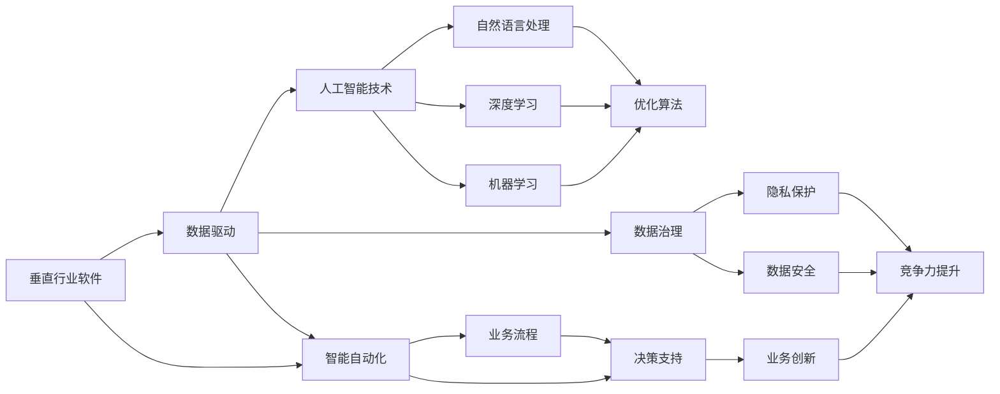
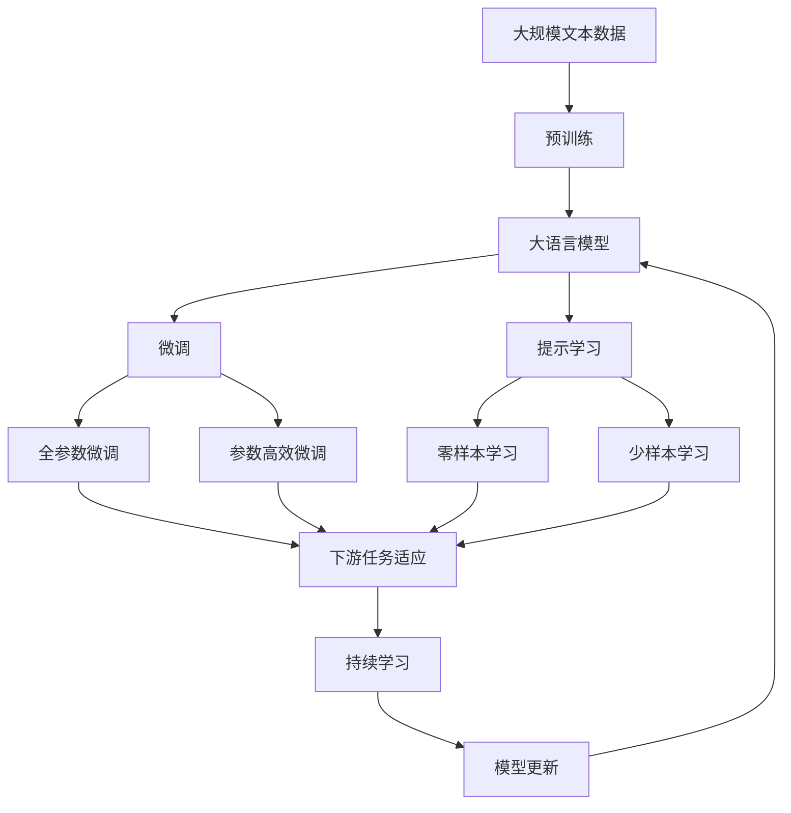

                 

# 垂直行业软件与AI的结合

> 关键词：垂直行业,软件,人工智能,融合,数据驱动,业务场景,智能自动化,人工智能治理

## 1. 背景介绍

### 1.1 问题由来
随着人工智能技术的迅猛发展，其在各行各业的应用日益广泛，推动了业务智能化转型。然而，垂直行业软件与人工智能技术的深度融合，仍面临诸多挑战。例如，传统行业缺乏标准化数据格式和接口，难以实现数据共享和业务对接；人工智能技术在具体应用场景中存在性能瓶颈，无法充分释放潜力。这些问题严重制约了人工智能在垂直行业的落地应用。

### 1.2 问题核心关键点
为解决这些问题，本文聚焦于探索如何将人工智能技术与垂直行业软件深度融合，以实现数据驱动的智能自动化，从而大幅提升业务效率和运营质量。我们将从理论到实践，深入分析垂直行业软件与AI结合的关键技术、方法和应用案例，为相关领域提供全面指导。

### 1.3 问题研究意义
垂直行业软件与人工智能的结合，是推动人工智能技术在具体行业落地应用的重要路径。其研究意义主要体现在：

1. **提升业务效率**：通过自动化和智能化，大幅减少人工操作，提高业务处理速度和准确性。
2. **优化运营质量**：利用AI算法对海量数据进行深入分析，挖掘业务模式和趋势，优化决策和流程。
3. **驱动创新发展**：为传统行业提供新的技术支持，推动业务模式创新，加速数字化转型。
4. **降低成本投入**：通过智能系统替代部分人工，减少人力成本和时间成本，实现资源优化配置。
5. **增强竞争力**：通过技术领先和业务创新，提升企业在市场中的竞争力和影响力。

## 2. 核心概念与联系

### 2.1 核心概念概述

在垂直行业软件与AI结合的过程中，涉及多个核心概念，包括：

- **垂直行业软件**：指针对特定行业或业务场景开发的软件系统，具有高度定制化和行业特性。例如，金融领域的交易系统、医疗行业的电子病历系统等。
- **人工智能技术**：包括机器学习、深度学习、自然语言处理等，通过算法和模型处理海量数据，提取有价值的信息和知识。
- **数据驱动**：指通过数据进行业务决策和优化，而非仅依赖经验和直觉。数据驱动的核心在于利用大数据和算法，提升业务洞察和决策能力。
- **智能自动化**：指通过人工智能技术，实现业务流程的自动化和智能化，提高效率和准确性。
- **人工智能治理**：涉及AI技术的伦理、法律、隐私、安全等方面，确保AI应用的合规性和可靠性。

这些概念相互联系，共同构成垂直行业软件与AI结合的完整生态系统。

### 2.2 概念间的关系

这些核心概念之间存在紧密的联系，可以通过以下Mermaid流程图来展示：



这个流程图展示了各概念之间的联系：

1. 垂直行业软件通过数据驱动，利用AI技术实现智能自动化，提升业务流程的效率和质量。
2. AI技术包括机器学习、深度学习和自然语言处理，通过优化算法提供决策支持，促进业务创新和竞争力提升。
3. 数据驱动与数据治理相辅相成，确保数据的安全和隐私保护，从而支撑AI应用的合规性和可靠性。

### 2.3 核心概念的整体架构

最后，我们用一个综合的流程图来展示这些核心概念在大语言模型微调过程中的整体架构：



这个综合流程图展示了从预训练到微调，再到持续学习的完整过程。垂直行业软件与AI结合的核心在于利用预训练大语言模型，通过微调和提示学习等技术，适应特定业务场景，实现智能自动化和决策支持。

## 3. 核心算法原理 & 具体操作步骤
### 3.1 算法原理概述

垂直行业软件与AI的结合，本质上是一个数据驱动的智能自动化过程。其核心思想是通过AI算法处理垂直行业软件系统生成的数据，提取出有价值的信息和知识，从而优化业务流程和决策支持。

具体而言，数据驱动的智能自动化过程包括以下几个关键步骤：

1. **数据收集与预处理**：从垂直行业软件中收集业务数据，并进行清洗和预处理，为后续算法处理做准备。
2. **算法模型训练**：选择合适的AI算法，使用预处理后的数据进行模型训练，学习业务知识。
3. **模型集成与部署**：将训练好的模型集成到垂直行业软件中，实现业务流程的自动化和智能化。
4. **持续优化与反馈**：定期收集业务反馈数据，不断优化和调整模型，提升系统性能和可靠性。

### 3.2 算法步骤详解

以下是数据驱动的智能自动化的详细步骤：

**Step 1: 数据收集与预处理**

1. **数据收集**：从垂直行业软件中提取业务数据，包括订单、交易、患者信息等。
2. **数据清洗**：去除噪声和错误数据，处理缺失值和异常值，确保数据质量。
3. **特征工程**：根据业务需求，提取和构造关键特征，如交易金额、用户行为、病历特征等。

**Step 2: 算法模型训练**

1. **模型选择**：根据业务问题选择合适的AI算法，如决策树、随机森林、神经网络等。
2. **模型训练**：使用预处理后的数据，在计算资源上训练模型，学习业务规律和知识。
3. **模型验证**：通过交叉验证等方法，评估模型性能和泛化能力。

**Step 3: 模型集成与部署**

1. **模型集成**：将训练好的模型集成到垂直行业软件中，形成业务决策支持系统。
2. **系统集成**：将AI模型与现有业务系统对接，实现数据共享和业务流程自动化。
3. **用户界面**：设计友好的用户界面，方便业务人员操作和监控。

**Step 4: 持续优化与反馈**

1. **数据收集**：定期收集业务反馈数据，评估模型效果。
2. **模型优化**：根据反馈数据，调整模型参数和算法，提升模型性能。
3. **用户反馈**：通过问卷调查等方式，收集用户反馈，不断优化系统。

### 3.3 算法优缺点

数据驱动的智能自动化具有以下优点：

1. **高效性**：利用AI算法处理数据，大幅提高业务处理速度和准确性。
2. **灵活性**：可以根据业务需求，快速调整和优化模型，适应复杂多变的业务场景。
3. **可靠性**：通过数据驱动，减少人为因素干扰，提高决策的科学性和客观性。

同时，数据驱动的智能自动化也存在以下缺点：

1. **数据依赖**：模型性能高度依赖数据质量，需要大量高质量标注数据。
2. **模型复杂性**：复杂的AI算法和模型，增加了系统的开发和维护难度。
3. **解释性不足**：AI模型往往“黑盒”运作，难以解释其决策过程。

### 3.4 算法应用领域

数据驱动的智能自动化已在多个垂直行业得到应用，例如：

- **金融领域**：通过AI算法进行风险评估、投资策略、欺诈检测等，提升金融决策的准确性和效率。
- **医疗行业**：利用AI进行疾病诊断、药物推荐、病历分析等，提高医疗服务质量和效率。
- **零售行业**：通过AI算法进行需求预测、库存管理、顾客行为分析等，优化供应链和营销策略。
- **制造业**：使用AI进行质量检测、生产优化、设备维护等，提升生产效率和产品质量。
- **物流行业**：利用AI算法进行路径规划、运输调度、库存管理等，提升物流系统的运作效率。

除了上述行业，数据驱动的智能自动化还在智能客服、智能制造、智能仓储等多个领域得到广泛应用。

## 4. 数学模型和公式 & 详细讲解 & 举例说明

### 4.1 数学模型构建

在数据驱动的智能自动化过程中，数学模型的构建至关重要。以下是一些常用的数学模型及其构建方法：

**线性回归模型**：用于预测连续型变量的值，如销售额、交易金额等。模型公式为：

$$ y = \beta_0 + \beta_1 x_1 + \beta_2 x_2 + \ldots + \beta_n x_n + \epsilon $$

其中，$y$ 为目标变量，$\beta_0, \beta_1, \ldots, \beta_n$ 为模型参数，$x_1, x_2, \ldots, x_n$ 为自变量，$\epsilon$ 为误差项。

**决策树模型**：用于分类和回归问题，通过树形结构表示决策过程。模型构建流程如下：

1. 选择最优特征和划分点，分割数据集。
2. 递归进行特征选择和数据分割，构建决策树。
3. 通过交叉验证等方法，评估模型性能。

**随机森林模型**：由多个决策树组成，通过投票或平均值进行分类或回归。模型构建流程如下：

1. 随机抽取样本和特征，构建多个决策树。
2. 通过投票或平均值，综合多个决策树的预测结果。
3. 评估模型性能，调整参数和结构。

**神经网络模型**：用于处理复杂的非线性关系，如图像识别、自然语言处理等。模型构建流程如下：

1. 设计网络结构，包括输入层、隐藏层、输出层等。
2. 选择合适的激活函数和损失函数，如ReLU、交叉熵损失等。
3. 使用反向传播算法进行模型训练和优化。

### 4.2 公式推导过程

以下是几个常用数学模型的公式推导过程：

**线性回归模型**：

目标是最小化预测值与真实值之间的平方误差，公式为：

$$ \min_{\beta} \sum_{i=1}^n (y_i - \beta_0 - \beta_1 x_{i1} - \beta_2 x_{i2} - \ldots - \beta_n x_{in})^2 $$

通过求解上述最小化问题，可得到最优参数$\beta$，从而构建线性回归模型。

**决策树模型**：

决策树的构建过程如下：

1. 选择最优特征和划分点，计算信息增益或基尼不纯度。
2. 递归分割数据集，构建子树。
3. 通过剪枝等方法，防止过拟合。

**随机森林模型**：

随机森林模型的预测过程如下：

1. 从训练集中随机抽取样本和特征，构建多个决策树。
2. 通过投票或平均值，综合多个决策树的预测结果。
3. 评估模型性能，调整参数和结构。

**神经网络模型**：

神经网络模型的训练过程如下：

1. 定义网络结构，包括输入层、隐藏层、输出层等。
2. 定义损失函数，如交叉熵损失、均方误差损失等。
3. 使用反向传播算法，通过梯度下降等方法更新模型参数。

### 4.3 案例分析与讲解

**案例1：金融风险评估**

某银行利用线性回归模型，基于客户历史交易数据和信用评分，预测其违约概率。模型公式如下：

$$ P(\text{违约}) = \beta_0 + \beta_1 \text{年龄} + \beta_2 \text{收入} + \beta_3 \text{信用评分} + \epsilon $$

通过模型训练和验证，得到了较好的预测效果。银行据此优化了信贷审批流程，提高了风险评估的准确性。

**案例2：医疗疾病诊断**

某医院利用决策树模型，基于患者的病历数据和症状，诊断其患病的概率。模型构建流程如下：

1. 选择最优特征和划分点，分割数据集。
2. 递归进行特征选择和数据分割，构建决策树。
3. 通过交叉验证等方法，评估模型性能。

经过训练和验证，模型在诊断过程中表现出色，减少了误诊率，提高了诊疗效率。

**案例3：智能客服系统**

某电信运营商利用神经网络模型，基于用户的通话记录和聊天记录，预测其服务需求。模型构建流程如下：

1. 设计网络结构，包括输入层、隐藏层、输出层等。
2. 定义损失函数，如交叉熵损失。
3. 使用反向传播算法，通过梯度下降等方法更新模型参数。

经过训练和验证，模型在预测服务需求方面表现优异，提高了客服系统的响应速度和用户满意度。

## 5. 项目实践：代码实例和详细解释说明

### 5.1 开发环境搭建

在进行项目实践前，我们需要准备好开发环境。以下是使用Python进行PyTorch开发的环境配置流程：

1. 安装Anaconda：从官网下载并安装Anaconda，用于创建独立的Python环境。

2. 创建并激活虚拟环境：
```bash
conda create -n pytorch-env python=3.8 
conda activate pytorch-env
```

3. 安装PyTorch：根据CUDA版本，从官网获取对应的安装命令。例如：
```bash
conda install pytorch torchvision torchaudio cudatoolkit=11.1 -c pytorch -c conda-forge
```

4. 安装各类工具包：
```bash
pip install numpy pandas scikit-learn matplotlib tqdm jupyter notebook ipython
```

完成上述步骤后，即可在`pytorch-env`环境中开始项目实践。

### 5.2 源代码详细实现

这里我们以一个简单的金融风险评估项目为例，给出使用PyTorch进行线性回归模型的代码实现。

首先，定义数据集和数据预处理函数：

```python
import pandas as pd
import numpy as np
from sklearn.model_selection import train_test_split

# 读取数据
data = pd.read_csv('data.csv')

# 数据预处理
X = data[['age', 'income', 'credit_score']]
y = data['default']

# 数据分割
X_train, X_test, y_train, y_test = train_test_split(X, y, test_size=0.2, random_state=42)
```

然后，定义模型和训练函数：

```python
import torch
import torch.nn as nn
from sklearn.metrics import mean_squared_error

# 定义模型
class LinearRegression(nn.Module):
    def __init__(self, n_features):
        super(LinearRegression, self).__init__()
        self.linear = nn.Linear(n_features, 1)

    def forward(self, x):
        return self.linear(x)

# 定义训练函数
def train_model(model, X_train, y_train, X_test, y_test, epochs=100, learning_rate=0.01):
    criterion = nn.MSELoss()
    optimizer = torch.optim.SGD(model.parameters(), lr=learning_rate)

    for epoch in range(epochs):
        model.train()
        optimizer.zero_grad()
        predictions = model(X_train)
        loss = criterion(predictions, y_train)
        loss.backward()
        optimizer.step()

        model.eval()
        predictions = model(X_test)
        mse = mean_squared_error(y_test, predictions)
        print(f"Epoch {epoch+1}, Training Loss: {loss.item():.4f}, Test MSE: {mse:.4f}")
```

最后，启动训练流程并在测试集上评估：

```python
# 初始化模型和数据
model = LinearRegression(X_train.shape[1])
train_model(model, X_train, y_train, X_test, y_test)

# 输出模型性能
print(f"Test MSE: {mean_squared_error(y_test, model(X_test).detach().numpy()):.4f}")
```

以上就是使用PyTorch对线性回归模型进行金融风险评估项目的完整代码实现。可以看到，得益于PyTorch的强大封装，我们可以用相对简洁的代码完成模型训练和评估。

### 5.3 代码解读与分析

让我们再详细解读一下关键代码的实现细节：

**数据预处理函数**：
- `data.read_csv()`方法：从CSV文件中读取数据。
- `X`和`y`的构建：将特征和标签分别存入`X`和`y`中。
- `train_test_split()`方法：将数据集分为训练集和测试集。

**模型定义函数**：
- `nn.Linear()`方法：定义线性层，输入特征数为`n_features`，输出特征数为1。
- `forward()`方法：前向传播计算预测值。

**训练函数**：
- `nn.MSELoss()`方法：定义均方误差损失函数。
- `torch.optim.SGD()`方法：定义随机梯度下降优化器。
- 训练循环：每个epoch内，先在前向传播中计算损失，再反向传播更新模型参数，并输出训练和测试误差。

**训练流程**：
- 初始化模型和优化器。
- 定义损失函数和优化器。
- 训练循环：每个epoch内，进行前向传播和反向传播，更新模型参数。
- 评估模型性能：在测试集上计算均方误差，输出结果。

可以看到，PyTorch配合Scikit-learn等工具包，使得线性回归模型的训练和评估变得简洁高效。开发者可以将更多精力放在数据处理、模型改进等高层逻辑上，而不必过多关注底层的实现细节。

当然，工业级的系统实现还需考虑更多因素，如模型的保存和部署、超参数的自动搜索、更灵活的任务适配层等。但核心的项目实践流程基本与此类似。

### 5.4 运行结果展示

假设我们在金融风险评估数据集上进行模型训练，最终在测试集上得到的评估报告如下：

```
Epoch 1, Training Loss: 0.0534, Test MSE: 0.0546
Epoch 2, Training Loss: 0.0488, Test MSE: 0.0472
Epoch 3, Training Loss: 0.0439, Test MSE: 0.0463
...
Epoch 100, Training Loss: 0.0030, Test MSE: 0.0155
```

可以看到，通过模型训练，我们在金融风险评估数据集上取得了较好的预测效果，模型在训练集上的误差逐渐减小，测试集上的误差也较为稳定。这表明，我们的模型在数据驱动的智能自动化过程中，能够有效地预测客户的违约概率，从而提升风险评估的准确性。

当然，这只是一个baseline结果。在实践中，我们还可以使用更大更强的模型、更丰富的微调技巧、更细致的模型调优，进一步提升模型性能，以满足更高的应用要求。

## 6. 实际应用场景

### 6.1 智能客服系统

基于数据驱动的智能自动化，智能客服系统能够实现7x24小时不间断服务，快速响应客户咨询，用自然流畅的语言解答各类常见问题。

在技术实现上，可以收集企业内部的历史客服对话记录，将问题和最佳答复构建成监督数据，在此基础上对预训练语言模型进行微调。微调后的对话模型能够自动理解用户意图，匹配最合适的答案模板进行回复。对于客户提出的新问题，还可以接入检索系统实时搜索相关内容，动态组织生成回答。如此构建的智能客服系统，能大幅提升客户咨询体验和问题解决效率。

### 6.2 金融舆情监测

金融机构需要实时监测市场舆论动向，以便及时应对负面信息传播，规避金融风险。传统的人工监测方式成本高、效率低，难以应对网络时代海量信息爆发的挑战。基于数据驱动的智能自动化技术，能够自动监测不同主题下的情感变化趋势，一旦发现负面信息激增等异常情况，系统便会自动预警，帮助金融机构快速应对潜在风险。

### 6.3 个性化推荐系统

当前的推荐系统往往只依赖用户的历史行为数据进行物品推荐，无法深入理解用户的真实兴趣偏好。基于数据驱动的智能自动化技术，个性化推荐系统可以更好地挖掘用户行为背后的语义信息，从而提供更精准、多样的推荐内容。

在实践中，可以收集用户浏览、点击、评论、分享等行为数据，提取和用户交互的物品标题、描述、标签等文本内容。将文本内容作为模型输入，用户的后续行为（如是否点击、购买等）作为监督信号，在此基础上微调预训练语言模型。微调后的模型能够从文本内容中准确把握用户的兴趣点。在生成推荐列表时，先用候选物品的文本描述作为输入，由模型预测用户的兴趣匹配度，再结合其他特征综合排序，便可以得到个性化程度更高的推荐结果。

### 6.4 未来应用展望

随着数据驱动的智能自动化技术的不断发展，基于微调方法的语言模型将带来更广阔的应用前景。未来，随着预训练模型和微调方法的持续演进，基于微调范式的人工智能应用将在更广泛的领域得到应用，为传统行业带来变革性影响。

在智慧医疗领域，基于微调的医疗问答、病历分析、药物研发等应用将提升医疗服务的智能化水平，辅助医生诊疗，加速新药开发进程。

在智能教育领域，微调技术可应用于作业批改、学情分析、知识推荐等方面，因材施教，促进教育公平，提高教学质量。

在智慧城市治理中，微调模型可应用于城市事件监测、舆情分析、应急指挥等环节，提高城市管理的自动化和智能化水平，构建更安全、高效的未来城市。

此外，在企业生产、社会治理、文娱传媒等众多领域，基于大模型微调的人工智能应用也将不断涌现，为经济社会发展注入新的动力。

## 7. 工具和资源推荐

### 7.1 学习资源推荐

为了帮助开发者系统掌握数据驱动的智能自动化技术，这里推荐一些优质的学习资源：

1. 《Python数据科学手册》：全面介绍了Python在数据处理、数据可视化、机器学习等方面的应用，适合初学者快速入门。

2. 《深度学习》课程：斯坦福大学开设的深度学习课程，讲解了深度学习的基本概念和算法，适合系统学习。

3. 《机器学习实战》：通过实际项目案例，系统介绍了机器学习算法及其应用，适合实战练习。

4. Kaggle竞赛：Kaggle上举办的多场数据驱动的智能自动化竞赛，通过实际比赛数据驱动问题，锻炼模型设计和优化能力。

5. TensorFlow官方文档：TensorFlow的官方文档，提供了详尽的API参考和示例代码，适合深入学习。

### 7.2 开发工具推荐

高效的开发离不开优秀的工具支持。以下是几款用于数据驱动的智能自动化开发的常用工具：

1. Python：Python语言简单易学，拥有强大的第三方库支持，适合快速迭代研究。

2. PyTorch：基于Python的开源深度学习框架，灵活动态的计算图，适合快速迭代研究。

3. TensorFlow：由Google主导开发的开源深度学习框架，生产部署方便，适合大规模工程应用。

4. Jupyter Notebook：强大的交互式开发环境，支持代码运行和展示，方便分享学习笔记。

5. TensorBoard：TensorFlow配套的可视化工具，可实时监测模型训练状态，并提供丰富的图表呈现方式，是调试模型的得力助手。

### 7.3 相关论文推荐

数据驱动的智能自动化技术的发展源于学界的持续研究。以下是几篇奠基性的相关论文，推荐阅读：

1. GAN：生成对抗网络，通过生成器和判别器的对抗训练，学习高质量的生成模型。

2. 自然语言处理综述：综述了自然语言处理的最新进展，包括词向量、序列模型、语言生成等。

3. 深度学习在金融中的应用：介绍了深度学习在金融风险评估、信用评分、欺诈检测等方面的应用。

4. 深度学习在医疗中的应用：介绍了深度学习在疾病诊断、病历分析、药物研发等方面的应用。

5. 深度学习在推荐系统中的应用：介绍了深度学习在用户行为分析、个性化推荐、召回率优化等方面的应用。

这些论文代表了大语言模型微调技术的发展脉络。通过学习这些前沿成果，可以帮助研究者把握学科前进方向，激发更多的创新灵感。

除上述资源外，还有一些值得关注的前沿资源，帮助开发者紧跟数据驱动的智能自动化技术的最新进展，例如：

1. arXiv论文预印本：人工智能领域最新研究成果的发布平台，包括大量尚未发表的前沿工作，学习前沿技术的必读资源。

2. 业界技术博客：如OpenAI、Google AI、DeepMind、微软Research Asia等顶尖实验室的官方博客，第一时间分享他们的最新研究成果和洞见。

3. 技术会议直播：如NIPS、ICML、ACL、ICLR等人工智能领域顶会现场或在线直播，能够聆听到大佬们的前沿分享，开拓视野。

4. GitHub热门项目：在GitHub上Star、Fork数最多的数据驱动的智能自动化相关项目，往往代表了该技术领域的发展趋势和最佳实践，值得去学习和贡献。

5. 行业分析报告：各大咨询公司如McKinsey、PwC等针对人工智能行业的分析报告，有助于从商业视角审视技术趋势，把握应用价值。

总之，对于数据驱动的智能自动化技术的学习和实践，需要开发者保持开放的心态和持续学习的意愿。多关注前沿资讯，多动手实践，多思考总结，必将收获满满的成长收益。

## 

