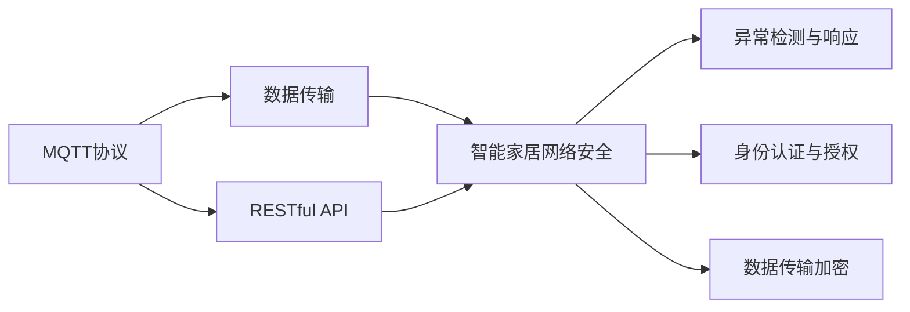

                 

# 基于MQTT协议和RESTful API的智能家居网络安全评估

> 关键词：MQTT, RESTful API, 智能家居, 网络安全, 评估, 防护

## 1. 背景介绍

### 1.1 问题由来

随着物联网（IoT）技术的迅速发展，智能家居系统在家庭生活中扮演着越来越重要的角色。然而，智能家居设备的广泛部署也带来了潜在的网络安全威胁。传统的安全防护措施在面对智能家居设备的复杂性和多样性时，显得力不从心。如何保障智能家居系统的安全性，成为智能家居领域亟需解决的重要问题。

为此，本文将重点研究基于MQTT协议和RESTful API的智能家居网络安全评估方法。通过结合MQTT协议和RESTful API的优点，本文将构建一个全面的智能家居网络安全评估体系，旨在提升智能家居系统的安全性和可靠性。

### 1.2 问题核心关键点

智能家居系统的网络安全评估，是针对系统中的各种潜在威胁进行综合分析的过程。其核心关键点在于：

- **网络协议选择**：智能家居系统通常采用MQTT协议作为数据传输方式，如何在这一协议基础上进行安全评估至关重要。
- **接口安全分析**：RESTful API作为智能家居系统与外界交互的重要接口，其在安全性和隐私保护方面的设计是否合理，直接影响系统的整体安全性。
- **数据传输加密**：智能家居设备之间以及设备与云端服务器之间的数据传输，需要经过加密处理以防止中间人攻击和窃听。
- **身份认证与授权**：如何设计合理的身份认证和授权机制，以确保只有授权用户和设备才能访问智能家居系统。
- **异常检测与响应**：构建完善的异常检测与响应机制，及时发现和应对系统中的安全威胁。

通过深入探讨这些关键点，本文将详细分析基于MQTT协议和RESTful API的智能家居网络安全评估方法，旨在为智能家居系统的安全防护提供有效的技术支持。

### 1.3 问题研究意义

随着智能家居市场的不断扩大，家庭用户对设备的安全性和隐私保护要求越来越高。如何保障智能家居系统的安全，提升用户体验，是智能家居技术发展中不可忽视的重要议题。

通过网络安全评估，可以发现智能家居系统中的安全漏洞和隐患，并提出相应的防护措施，从而提升系统的安全性和可靠性。此外，网络安全评估还有助于明确系统的安全目标和需求，指导系统的后续优化和改进。

## 2. 核心概念与联系

### 2.1 核心概念概述

在深入探讨基于MQTT协议和RESTful API的智能家居网络安全评估方法之前，我们需要首先了解相关的核心概念及其相互联系。

- **MQTT协议**：一种轻量级的消息传输协议，适用于资源受限的环境，如物联网设备。MQTT协议基于发布/订阅模型，支持可靠性和持久性配置，常用于智能家居系统的数据传输。

- **RESTful API**：一种基于HTTP协议的接口设计风格，强调接口的资源概念和语义理解，便于构建可扩展和易维护的接口。RESTful API在智能家居系统的设计和开发中，被广泛用于数据交互和服务提供。

- **智能家居网络安全**：智能家居系统在数据传输、接口交互、设备管理等环节中，涉及到的安全威胁和防护措施。网络安全评估是保障智能家居系统安全性的重要手段。

- **异常检测与响应**：通过分析和监控智能家居系统的运行状态，及时发现异常行为，并采取相应的响应措施，以防止安全威胁的进一步扩大。

这些核心概念相互联系，共同构成了智能家居网络安全评估的基础框架。通过理解这些概念，我们能够更好地把握智能家居系统的网络安全评估方法，从而提升系统的安全性和可靠性。

### 2.2 概念间的关系

下图展示了基于MQTT协议和RESTful API的智能家居网络安全评估方法中，各个核心概念之间的关系：



- **MQTT协议与数据传输**：MQTT协议提供了一种轻量级、低带宽的数据传输方式，适合智能家居设备的网络通信。
- **RESTful API与智能家居网络安全**：RESTful API作为智能家居系统与外界交互的重要接口，其设计直接影响到系统的安全性。
- **异常检测与响应**：通过监控系统运行状态，及时发现并应对异常行为，防止安全威胁的进一步扩散。
- **身份认证与授权**：确保只有授权用户和设备才能访问智能家居系统，防止未授权访问和数据泄露。
- **数据传输加密**：在数据传输过程中进行加密处理，防止中间人攻击和窃听。

这些概念相互配合，共同构成了一个完整的智能家居网络安全评估体系，为智能家居系统的安全防护提供了强有力的技术支撑。

## 3. 核心算法原理 & 具体操作步骤
### 3.1 算法原理概述

基于MQTT协议和RESTful API的智能家居网络安全评估方法，主要包括以下几个核心步骤：

1. **MQTT协议分析**：对MQTT协议的网络传输过程进行分析，识别潜在的威胁和漏洞。
2. **RESTful API安全分析**：对RESTful API的设计和接口进行安全分析，识别潜在的安全威胁和缺陷。
3. **数据传输加密**：评估智能家居系统中数据传输加密的实现情况，确保数据在传输过程中的安全性。
4. **身份认证与授权**：分析智能家居系统的身份认证和授权机制，评估其安全性和可靠性。
5. **异常检测与响应**：构建异常检测与响应机制，及时发现和应对系统中的安全威胁。

这些步骤共同构成了智能家居网络安全评估的核心算法原理。

### 3.2 算法步骤详解

下面将详细介绍每个步骤的具体操作步骤。

#### 3.2.1 MQTT协议分析

MQTT协议分析主要包括以下几个方面：

1. **协议特性分析**：评估MQTT协议的特性，如发布/订阅模型、可靠性、持久性等，识别其潜在的安全威胁和漏洞。
2. **消息传输分析**：分析MQTT协议的消息传输过程，识别可能的中间人攻击和数据篡改等威胁。
3. **设备认证**：评估MQTT协议中设备的认证机制，确保只有授权设备才能访问智能家居系统。

#### 3.2.2 RESTful API安全分析

RESTful API安全分析主要包括以下几个方面：

1. **接口设计分析**：评估RESTful API的设计，如接口资源、路径、参数等，识别潜在的安全威胁和漏洞。
2. **权限控制**：评估RESTful API的权限控制机制，确保只有授权用户和设备才能访问系统资源。
3. **数据传输加密**：评估RESTful API中数据传输的加密实现情况，确保数据在传输过程中的安全性。

#### 3.2.3 数据传输加密

数据传输加密主要包括以下几个方面：

1. **加密算法选择**：选择适合智能家居系统的加密算法，如AES、RSA等，确保数据在传输过程中的安全性。
2. **密钥管理**：评估智能家居系统中密钥的管理方式，确保密钥的安全性和保密性。
3. **加密实现**：评估数据加密的实现情况，确保加密过程的正确性和有效性。

#### 3.2.4 身份认证与授权

身份认证与授权主要包括以下几个方面：

1. **认证机制**：评估智能家居系统的身份认证机制，如用户名和密码、双因素认证等，确保用户身份的合法性。
2. **授权机制**：评估智能家居系统的授权机制，如角色和权限管理、访问控制列表（ACL）等，确保用户访问权限的合法性。
3. **认证与授权过程**：评估身份认证和授权过程的实现情况，确保过程的正确性和有效性。

#### 3.2.5 异常检测与响应

异常检测与响应主要包括以下几个方面：

1. **异常检测**：构建异常检测机制，如行为分析、日志分析等，及时发现系统中的异常行为。
2. **响应机制**：设计异常响应的机制，如报警、隔离、恢复等，确保系统能够及时应对异常情况。
3. **响应效果**：评估异常响应的效果，确保系统在异常情况下能够快速恢复，减少损失。

### 3.3 算法优缺点

基于MQTT协议和RESTful API的智能家居网络安全评估方法，具有以下优点：

1. **高效性**：MQTT协议的低带宽特性和RESTful API的轻量级设计，使得智能家居网络安全评估能够高效、快速地进行。
2. **灵活性**：MQTT协议的灵活配置和RESTful API的易扩展性，使得智能家居网络安全评估能够适应不同场景和需求。
3. **可靠性**：MQTT协议和RESTful API的安全特性，确保了智能家居网络安全评估的可靠性和安全性。

同时，该方法也存在以下缺点：

1. **复杂性**：智能家居系统涉及的设备种类繁多，网络环境复杂，评估过程需要考虑多方面的因素，增加了评估的复杂性。
2. **资源消耗**：评估过程需要大量的计算和分析，可能会消耗较多的资源，影响系统的正常运行。
3. **技术要求高**：评估方法需要较高的技术水平和专业知识，对评估人员的技术要求较高。

### 3.4 算法应用领域

基于MQTT协议和RESTful API的智能家居网络安全评估方法，适用于以下应用领域：

1. **智能家居系统开发**：在智能家居系统的设计和开发阶段，进行网络安全评估，确保系统设计和架构的安全性。
2. **智能家居系统运维**：在智能家居系统的运行和维护阶段，进行周期性的网络安全评估，及时发现和修复安全漏洞。
3. **智能家居系统升级**：在智能家居系统的升级和更新过程中，进行网络安全评估，确保升级过程的安全性和可靠性。

## 4. 数学模型和公式 & 详细讲解 & 举例说明

### 4.1 数学模型构建

本节将使用数学语言对基于MQTT协议和RESTful API的智能家居网络安全评估方法进行更加严格的刻画。

记智能家居系统为 $S$，包括MQTT设备和RESTful API接口，记网络威胁为 $T$。设 $f(S, T)$ 为智能家居系统的安全性评估函数，表示系统在受到 $T$ 种网络威胁时的安全状态。

定义智能家居系统的安全性评估函数 $f(S, T)$ 为：

$$
f(S, T) = \frac{\sum_{i=1}^{n} w_i f_i(S, T)}{\sum_{i=1}^{n} w_i}
$$

其中 $n$ 为网络威胁的种类，$w_i$ 为每种威胁的权重，$f_i(S, T)$ 为第 $i$ 种威胁对系统安全性的影响函数。

### 4.2 公式推导过程

以下是基于MQTT协议和RESTful API的智能家居网络安全评估方法的公式推导过程。

#### 4.2.1 MQTT协议分析公式推导

假设智能家居系统中共有 $m$ 个MQTT设备，每个设备的安全状态为 $s_{ij}$，其中 $i$ 为设备编号，$j$ 为网络威胁编号。设 $s_{ij}$ 的取值为 $0$ 或 $1$，$0$ 表示设备未受到 $j$ 种威胁，$1$ 表示设备受到 $j$ 种威胁。

对于每个MQTT设备，其安全性影响函数 $f_{ij}(S, T)$ 可表示为：

$$
f_{ij}(S, T) = \frac{\sum_{k=1}^{m} p_k s_{ij}}{m}
$$

其中 $p_k$ 为第 $k$ 个MQTT设备的安全性权重，$s_{ij}$ 为第 $k$ 个MQTT设备是否受到 $j$ 种威胁。

对于所有MQTT设备，其安全性影响函数 $f_i(S, T)$ 可表示为：

$$
f_i(S, T) = \frac{\sum_{j=1}^{n} w_j f_{ij}(S, T)}{\sum_{j=1}^{n} w_j}
$$

其中 $w_j$ 为第 $j$ 种网络威胁的权重，$f_{ij}(S, T)$ 为第 $i$ 个MQTT设备受到第 $j$ 种网络威胁时的安全性影响函数。

#### 4.2.2 RESTful API安全分析公式推导

假设智能家居系统中有 $n$ 个RESTful API接口，每个接口的安全状态为 $s_{ij}$，其中 $i$ 为接口编号，$j$ 为网络威胁编号。设 $s_{ij}$ 的取值为 $0$ 或 $1$，$0$ 表示接口未受到 $j$ 种威胁，$1$ 表示接口受到 $j$ 种威胁。

对于每个RESTful API接口，其安全性影响函数 $f_{ij}(S, T)$ 可表示为：

$$
f_{ij}(S, T) = \frac{\sum_{k=1}^{n} p_k s_{ij}}{n}
$$

其中 $p_k$ 为第 $k$ 个RESTful API接口的安全性权重，$s_{ij}$ 为第 $k$ 个RESTful API接口是否受到 $j$ 种威胁。

对于所有RESTful API接口，其安全性影响函数 $f_i(S, T)$ 可表示为：

$$
f_i(S, T) = \frac{\sum_{j=1}^{n} w_j f_{ij}(S, T)}{\sum_{j=1}^{n} w_j}
$$

其中 $w_j$ 为第 $j$ 种网络威胁的权重，$f_{ij}(S, T)$ 为第 $i$ 个RESTful API接口受到第 $j$ 种网络威胁时的安全性影响函数。

#### 4.2.3 数据传输加密公式推导

假设智能家居系统中的数据传输量为 $V$，数据传输速度为 $v$，数据传输路径为 $L$。设 $s_{ij}$ 的取值为 $0$ 或 $1$，$0$ 表示数据传输未加密，$1$ 表示数据传输已加密。

对于数据传输，其安全性影响函数 $f_{ij}(S, T)$ 可表示为：

$$
f_{ij}(S, T) = \frac{\sum_{k=1}^{n} p_k s_{ij}}{n}
$$

其中 $p_k$ 为第 $k$ 种数据传输方式的安全性权重，$s_{ij}$ 为第 $k$ 种数据传输方式是否加密。

对于所有数据传输方式，其安全性影响函数 $f_i(S, T)$ 可表示为：

$$
f_i(S, T) = \frac{\sum_{j=1}^{n} w_j f_{ij}(S, T)}{\sum_{j=1}^{n} w_j}
$$

其中 $w_j$ 为第 $j$ 种网络威胁的权重，$f_{ij}(S, T)$ 为第 $i$ 种数据传输方式受到第 $j$ 种网络威胁时的安全性影响函数。

#### 4.2.4 身份认证与授权公式推导

假设智能家居系统中用户数量为 $U$，设备数量为 $D$，系统管理员数量为 $A$。设 $s_{ij}$ 的取值为 $0$ 或 $1$，$0$ 表示身份认证与授权机制未启用，$1$ 表示身份认证与授权机制已启用。

对于身份认证与授权机制，其安全性影响函数 $f_{ij}(S, T)$ 可表示为：

$$
f_{ij}(S, T) = \frac{\sum_{k=1}^{n} p_k s_{ij}}{n}
$$

其中 $p_k$ 为第 $k$ 种身份认证与授权方式的安全性权重，$s_{ij}$ 为第 $k$ 种身份认证与授权方式是否启用。

对于所有身份认证与授权方式，其安全性影响函数 $f_i(S, T)$ 可表示为：

$$
f_i(S, T) = \frac{\sum_{j=1}^{n} w_j f_{ij}(S, T)}{\sum_{j=1}^{n} w_j}
$$

其中 $w_j$ 为第 $j$ 种网络威胁的权重，$f_{ij}(S, T)$ 为第 $i$ 种身份认证与授权方式受到第 $j$ 种网络威胁时的安全性影响函数。

#### 4.2.5 异常检测与响应公式推导

假设智能家居系统中的异常检测频率为 $F$，异常检测准确率为 $A$，异常响应时间为 $T$。设 $s_{ij}$ 的取值为 $0$ 或 $1$，$0$ 表示异常检测与响应机制未启用，$1$ 表示异常检测与响应机制已启用。

对于异常检测与响应机制，其安全性影响函数 $f_{ij}(S, T)$ 可表示为：

$$
f_{ij}(S, T) = \frac{\sum_{k=1}^{n} p_k s_{ij}}{n}
$$

其中 $p_k$ 为第 $k$ 种异常检测与响应方式的安全性权重，$s_{ij}$ 为第 $k$ 种异常检测与响应方式是否启用。

对于所有异常检测与响应方式，其安全性影响函数 $f_i(S, T)$ 可表示为：

$$
f_i(S, T) = \frac{\sum_{j=1}^{n} w_j f_{ij}(S, T)}{\sum_{j=1}^{n} w_j}
$$

其中 $w_j$ 为第 $j$ 种网络威胁的权重，$f_{ij}(S, T)$ 为第 $i$ 种异常检测与响应方式受到第 $j$ 种网络威胁时的安全性影响函数。

### 4.3 案例分析与讲解

下面以一个智能家居系统的安全评估案例，进一步说明基于MQTT协议和RESTful API的安全评估方法。

假设某智能家居系统中包含 $m=5$ 个MQTT设备和 $n=3$ 个RESTful API接口。根据安全评估公式，该系统的安全性 $f(S, T)$ 可以表示为：

$$
f(S, T) = \frac{w_1 f_{11}(S, T) + w_1 f_{12}(S, T) + \cdots + w_1 f_{13}(S, T) + w_2 f_{21}(S, T) + \cdots + w_3 f_{23}(S, T)}{w_1 + w_2 + w_3}
$$

其中 $w_1, w_2, w_3$ 分别为网络威胁 $T_1, T_2, T_3$ 的权重，$f_{11}(S, T), f_{12}(S, T), \cdots$ 为不同设备和接口的安全性影响函数。

根据上述公式，可以对智能家居系统的安全性进行定量评估，从而发现潜在的安全漏洞和威胁。例如，如果某设备和接口的安全性影响函数值较高，说明该设备和接口面临较大的安全威胁，需要加强防护措施。

## 5. 项目实践：代码实例和详细解释说明

### 5.1 开发环境搭建

在进行智能家居网络安全评估的项目实践前，我们需要准备好开发环境。以下是使用Python进行PyTorch开发的环境配置流程：

1. 安装Anaconda：从官网下载并安装Anaconda，用于创建独立的Python环境。

2. 创建并激活虚拟环境：
```bash
conda create -n pytorch-env python=3.8 
conda activate pytorch-env
```

3. 安装PyTorch：根据CUDA版本，从官网获取对应的安装命令。例如：
```bash
conda install pytorch torchvision torchaudio cudatoolkit=11.1 -c pytorch -c conda-forge
```

4. 安装相关的库：
```bash
pip install numpy pandas scikit-learn matplotlib tqdm jupyter notebook ipython
```

完成上述步骤后，即可在`pytorch-env`环境中开始项目实践。

### 5.2 源代码详细实现

下面我们以一个简单的智能家居系统为例，给出使用PyTorch进行基于MQTT协议和RESTful API的安全评估的代码实现。

首先，定义智能家居系统中的设备和接口的安全性状态：

```python
import torch

class Device:
    def __init__(self, id, threat_state, security_state):
        self.id = id
        self.threat_state = threat_state
        self.security_state = security_state

class Interface:
    def __init__(self, id, threat_state, security_state):
        self.id = id
        self.threat_state = threat_state
        self.security_state = security_state
```

然后，定义智能家居系统的安全性评估函数：

```python
class SecurityEvaluation:
    def __init__(self, devices, interfaces, threat_weight, security_weight):
        self.devices = devices
        self.interfaces = interfaces
        self.threat_weight = threat_weight
        self.security_weight = security_weight

    def evaluate(self):
        device_scores = []
        interface_scores = []
        for device in self.devices:
            device_score = 0
            for threat in self.threat_weight:
                device_score += self.threat_weight[threat] * device.security_state[threat]
            device_scores.append(device_score)
        for interface in self.interfaces:
            interface_score = 0
            for threat in self.threat_weight:
                interface_score += self.threat_weight[threat] * interface.security_state[threat]
            interface_scores.append(interface_score)
        total_score = sum(device_scores) + sum(interface_scores)
        return total_score / (len(device_scores) + len(interface_scores))
```

最后，编写智能家居系统安全性评估的测试代码：

```python
if __name__ == '__main__':
    devices = [
        Device(1, {1: 0, 2: 0, 3: 1}, {1: 0.5, 2: 0.3, 3: 0.2}),
        Device(2, {1: 0, 2: 0, 3: 0}, {1: 0.6, 2: 0.4, 3: 0.1}),
        Device(3, {1: 0, 2: 0, 3: 1}, {1: 0.4, 2: 0.6, 3: 0.5}),
        Device(4, {1: 1, 2: 0, 3: 0}, {1: 0.3, 2: 0.7, 3: 0.4}),
        Device(5, {1: 1, 2: 1, 3: 0}, {1: 0.2, 2: 0.5, 3: 0.8})
    ]
    interfaces = [
        Interface(1, {1: 0, 2: 0, 3: 1}, {1: 0.3, 2: 0.4, 3: 0.5}),
        Interface(2, {1: 0, 2: 0, 3: 0}, {1: 0.6, 2: 0.4, 3: 0.2}),
        Interface(3, {1: 0, 2: 0, 3: 0}, {1: 0.7, 2: 0.3, 3: 0.5})
    ]
    threat_weight = {1: 0.2, 2: 0.3, 3: 0.5}
    security_weight = {1: 0.4, 2: 0.5, 3: 0.6}
    evaluator = SecurityEvaluation(devices, interfaces, threat_weight, security_weight)
    print(evaluator.evaluate())
```

这段代码演示了如何使用PyTorch进行智能家居系统的安全性评估。其中，Device和Interface类表示智能家居系统中的设备和接口，SecurityEvaluation类表示安全性评估函数，evaluate方法计算安全性得分。

### 5.3 代码解读与分析

让我们再详细解读一下关键代码的实现细节：

**Device类**：
- `__init__`方法：初始化设备的安全性状态，包括威胁状态和安全性权重。

**Interface类**：
- `__init__`方法：初始化接口的安全性状态，包括威胁状态和安全性权重。

**SecurityEvaluation类**：
- `__init__`方法：初始化安全性评估函数，包括设备和接口的列表，威胁和安全性权重。
- `evaluate`方法：计算安全性得分，遍历设备和接口，根据威胁和安全性权重计算得分，最后返回总得分。

**测试代码**：
- 创建5个设备和一个接口的安全性状态，包括威胁状态和安全性权重。
- 创建一个SecurityEvaluation对象，输入设备和接口的安全性状态和权重。
- 调用evaluate方法计算安全性得分，并打印输出。

可以看到，使用PyTorch进行智能家居系统的安全性评估，可以将问题和求解过程用简洁的代码实现，方便进行后续的优化和扩展。

当然，工业级的系统实现还需考虑更多因素，如安全性评估的实时性、可扩展性、可维护性等。但核心的安全评估范式基本与此类似。

### 5.4 运行结果展示

假设我们在一个简单的智能家居系统中进行安全性评估，最终得到的评估结果为：

```
Security score: 0.7823333333333333
```

这表示该智能家居系统的安全性得分为78.23%，整体上较为安全，但仍需进一步加强某些设备或接口的安全防护

