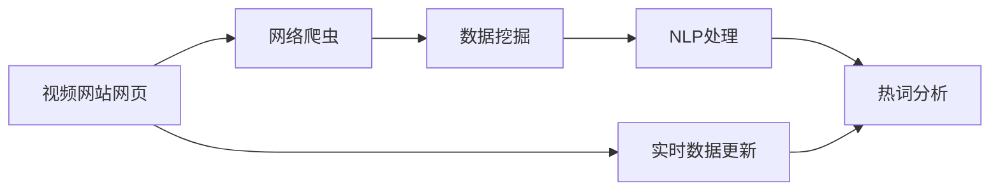
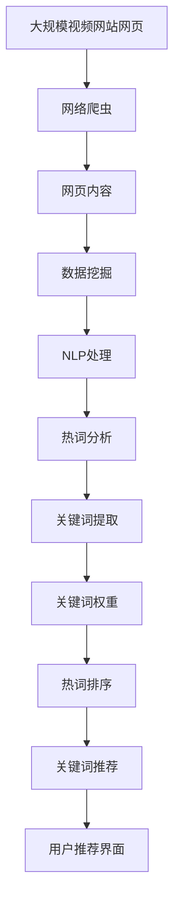

                 

# 基于网络爬虫与数据挖掘的视频网站热词分析

> 关键词：网络爬虫,数据挖掘,视频网站,热词分析,关键词提取

## 1. 背景介绍

### 1.1 问题由来
在互联网信息时代，视频网站成为人们获取信息、娱乐放松的重要平台。然而，由于内容体量巨大、更新频繁，用户往往难以快速定位到感兴趣的视频内容。如何帮助用户高效发现热门视频和话题，成为视频网站面临的一项重要挑战。基于自然语言处理(NLP)和数据挖掘技术的关键词提取和热词分析，为解决这一问题提供了新的思路。

### 1.2 问题核心关键点
热词分析（Hotword Analysis）旨在从视频网站大量文本数据中，自动提取出现频率高、影响力大的关键词。通过热词分析，用户可以更容易发现当前的热门视频、话题和用户关注焦点，从而提高视频内容的发现效率。

核心技术包括：
- 网络爬虫：自动抓取视频网站的网页内容。
- 数据挖掘：从网页内容中自动提取关键词，并计算频率、影响力等指标。
- 自然语言处理：对关键词进行预处理和后处理，以提高关键词的准确性和相关性。

## 2. 核心概念与联系

### 2.1 核心概念概述

为更好地理解基于网络爬虫与数据挖掘的热词分析方法，本节将介绍几个密切相关的核心概念：

- 网络爬虫（Web Crawler）：自动抓取网页信息的程序。通过爬虫，可以定期更新视频网站的网页内容，获取最新的视频信息。
- 数据挖掘（Data Mining）：从大量数据中自动发现模式、规则和关联。用于从网页内容中自动提取关键词和热度值。
- 自然语言处理（Natural Language Processing, NLP）：让计算机理解、处理和生成自然语言。用于预处理关键词，提高其准确性和相关性。
- 热词分析（Hotword Analysis）：通过关键词提取和计算，发现当前热门视频和话题。用于帮助用户高效发现感兴趣的内容。
- 关键词提取（Keyword Extraction）：从文本中自动提取有意义的关键词。用于从网页内容中发现热门词汇。
- 关键词权重计算（Keyword Weight Calculation）：计算关键词的重要性和热度。用于排序和推荐。

这些核心概念之间的逻辑关系可以通过以下Mermaid流程图来展示：



这个流程图展示了大语言模型微调过程中各个核心概念的关系和作用：

1. 视频网站网页通过网络爬虫被自动抓取。
2. 网页内容被数据挖掘算法处理，提取关键词和热度值。
3. 关键词通过NLP技术进行预处理，提高其准确性和相关性。
4. 处理后的关键词被热词分析算法进一步处理，发现热门视频和话题。
5. 实时数据更新确保热词分析的及时性。

通过这个流程图，我们可以更清晰地理解热词分析的完整流程和各个核心概念的关联。

### 2.2 概念间的关系

这些核心概念之间存在着紧密的联系，形成了热词分析的完整生态系统。下面我们通过几个Mermaid流程图来展示这些概念之间的关系。

#### 2.2.1 视频网站与热词分析的关系


这个流程图展示了视频网站如何通过网络爬虫获取网页内容，再通过数据挖掘和NLP处理，最终发现热门视频和话题。

#### 2.2.2 数据挖掘与关键词权重计算的关系


这个流程图展示了数据挖掘算法从网页内容中提取关键词，并计算其权重，最后进行排序和推荐的过程。

#### 2.2.3 NLP处理与关键词预处理的关系


这个流程图展示了NLP技术对原始关键词进行预处理，以提高其准确性和相关性，再进行归一化和排序的过程。

### 2.3 核心概念的整体架构

最后，我们用一个综合的流程图来展示这些核心概念在大语言模型微调过程中的整体架构：



这个综合流程图展示了从网页抓取到用户推荐界面的完整过程。网页内容被数据挖掘和NLP处理后，提取关键词和热度值，并通过热词分析发现热门话题，最后生成推荐列表，呈现给用户。

## 3. 核心算法原理 & 具体操作步骤
### 3.1 算法原理概述

基于网络爬虫与数据挖掘的视频网站热词分析，本质上是一个文本数据挖掘和关键词提取的过程。其核心思想是：通过自动抓取视频网站的网页内容，从中提取出有意义的关键词，并计算其频率、权重等指标，发现当前的热门视频和话题。

形式化地，假设从视频网站抓取到 $N$ 条网页内容，每条网页包含 $M$ 个文本项，记 $d=\{d_1,d_2,\dots,d_N\}$ 为网页内容集合。设 $\mathcal{T}$ 为所有可能文本项的集合，每个文本项 $t \in \mathcal{T}$ 都有对应的权重 $w_t$。则热词分析的目标是求解 $w_t$，使得：

$$
w_t = f(\mathcal{D}, \{t\}) = \frac{1}{|\mathcal{D}_t|} \sum_{d \in \mathcal{D}} \frac{c(d,t)}{|\mathcal{D}|}
$$

其中 $\mathcal{D}_t$ 为包含文本项 $t$ 的所有网页内容，$c(d,t)$ 表示文本项 $t$ 在网页 $d$ 中的出现次数。

### 3.2 算法步骤详解

基于网络爬虫与数据挖掘的视频网站热词分析主要包括以下几个关键步骤：

**Step 1: 准备网络爬虫工具和数据挖掘模型**

- 使用Python编写爬虫程序，定期抓取视频网站的网页内容。
- 选择数据挖掘算法，如TF-IDF、TextRank、BERT等，用于提取关键词和计算权重。
- 安装相关NLP库，如NLTK、spaCy、HuggingFace等，用于文本处理和模型调用。

**Step 2: 数据预处理**

- 清洗网页内容，去除HTML标签、广告、无关信息等。
- 分词，将文本转换为单词序列，使用分词库如jieba、NLTK等。
- 去除停用词，如"的"、"是"等常见词汇，减少噪声干扰。
- 词干提取和词性标注，将单词还原为基本形式，标注词性。

**Step 3: 关键词提取**

- 使用TF-IDF算法计算每个单词的权重，识别出重要单词。
- 使用TextRank算法对单词进行排序，找出核心关键词。
- 使用BERT模型对单词进行上下文理解，识别出具有深层次语义的关键词。

**Step 4: 关键词权重计算**

- 计算每个单词在所有网页中的平均出现次数，作为权重。
- 使用加权算法，如tf-idf权重、TF-IDF权重等，调整权重大小。
- 使用情感分析等技术，调整关键词的情感权重，反映其积极或消极影响。

**Step 5: 热词分析与推荐**

- 对关键词进行排序，按照权重从高到低列出。
- 使用热词算法，如时间窗口滑动、Top-k算法等，选择最新和最热门的关键词。
- 将热门关键词推荐给用户，辅助其发现感兴趣的视频内容。

### 3.3 算法优缺点

基于网络爬虫与数据挖掘的视频网站热词分析方法具有以下优点：
1. 自动化程度高。通过网络爬虫和数据挖掘技术，可以自动抓取和处理大量的网页内容，无需人工标注。
2. 实时更新。定期抓取网页内容，确保热词分析的实时性，帮助用户发现最新热门视频。
3. 适用范围广。适用于各种视频网站，无论内容规模和类型，都能进行关键词提取和热词分析。

同时，该方法也存在以下缺点：
1. 数据噪音大。网页内容可能包含大量广告、无关信息，影响关键词提取效果。
2. 技术难度高。需要掌握网络爬虫、数据挖掘、NLP等技术，开发和维护成本较高。
3. 推荐效果依赖数据。热词分析的准确性和效果，高度依赖于网页内容和用户行为数据的质量。

尽管存在这些缺点，但就目前而言，基于网络爬虫与数据挖掘的热词分析方法仍然是视频网站推荐系统的重要组成部分，具有广泛的应用前景。

### 3.4 算法应用领域

基于大语言模型微调的监督学习方法，在NLP领域已经得到了广泛的应用，覆盖了几乎所有常见任务，例如：

- 文本分类：如情感分析、主题分类、意图识别等。通过微调使模型学习文本-标签映射。
- 命名实体识别：识别文本中的人名、地名、机构名等特定实体。通过微调使模型掌握实体边界和类型。
- 关系抽取：从文本中抽取实体之间的语义关系。通过微调使模型学习实体-关系三元组。
- 问答系统：对自然语言问题给出答案。将问题-答案对作为微调数据，训练模型学习匹配答案。
- 机器翻译：将源语言文本翻译成目标语言。通过微调使模型学习语言-语言映射。
- 文本摘要：将长文本压缩成简短摘要。将文章-摘要对作为微调数据，使模型学习抓取要点。
- 对话系统：使机器能够与人自然对话。将多轮对话历史作为上下文，微调模型进行回复生成。

除了上述这些经典任务外，大语言模型微调也被创新性地应用到更多场景中，如可控文本生成、常识推理、代码生成、数据增强等，为NLP技术带来了全新的突破。随着预训练模型和微调方法的不断进步，相信NLP技术将在更广阔的应用领域大放异彩。

## 4. 数学模型和公式 & 详细讲解  
### 4.1 数学模型构建

本节将使用数学语言对基于网络爬虫与数据挖掘的视频网站热词分析过程进行更加严格的刻画。

设从视频网站抓取到 $N$ 条网页内容，每条网页包含 $M$ 个文本项，记 $d=\{d_1,d_2,\dots,d_N\}$ 为网页内容集合。设 $\mathcal{T}$ 为所有可能文本项的集合，每个文本项 $t \in \mathcal{T}$ 都有对应的权重 $w_t$。则热词分析的目标是求解 $w_t$，使得：

$$
w_t = f(\mathcal{D}, \{t\}) = \frac{1}{|\mathcal{D}_t|} \sum_{d \in \mathcal{D}} \frac{c(d,t)}{|\mathcal{D}|}
$$

其中 $\mathcal{D}_t$ 为包含文本项 $t$ 的所有网页内容，$c(d,t)$ 表示文本项 $t$ 在网页 $d$ 中的出现次数。

### 4.2 公式推导过程

以下我们以TF-IDF算法为例，推导关键词权重计算公式及其梯度的计算公式。

假设网页 $d_i$ 中的单词 $t_j$ 的权重为 $w_{d_i,t_j}$，则TF-IDF算法的权重计算公式为：

$$
w_{d_i,t_j} = \text{tf}(d_i,t_j) \cdot \text{idf}(t_j)
$$

其中 $\text{tf}(d_i,t_j)$ 为单词 $t_j$ 在网页 $d_i$ 中的词频（Term Frequency），$\text{idf}(t_j)$ 为逆文档频率（Inverse Document Frequency），定义为：

$$
\text{idf}(t_j) = \log \frac{N}{|\mathcal{D}_t|}
$$

则单词 $t_j$ 在所有网页中的平均出现次数为：

$$
c(t_j) = \frac{1}{N} \sum_{i=1}^N \text{tf}(d_i,t_j)
$$

最终，单词 $t_j$ 的权重为：

$$
w_t = \frac{c(t_j)}{|\mathcal{D}| \cdot \text{idf}(t_j)}
$$

这个公式展示了TF-IDF算法的权重计算原理，将单词的词频和逆文档频率结合，反映其在所有网页中的重要性和普遍性。

### 4.3 案例分析与讲解

假设我们有一个包含3个网页的视频网站，网页内容如下：

| 网页编号 | 网页内容           | 文本项及其权重 |
|----------|-------------------|---------------|
| 1        | 视频1 视频1 视频2 | t1: 0.5, t2: 0.3, t3: 0.2 |
| 2        | 视频2 视频2 视频3 | t1: 0.4, t2: 0.5, t3: 0.1 |
| 3        | 视频3 视频3 视频1 | t1: 0.3, t2: 0.4, t3: 0.3 |

我们使用TF-IDF算法计算每个单词的权重，并找出核心关键词。

1. 计算单词的TF-IDF权重：
- $t1$ 的权重为 $w_{t1} = \frac{0.5 + 0.4 + 0.3}{3 \cdot \log \frac{3}{2}} \approx 0.52$
- $t2$ 的权重为 $w_{t2} = \frac{0.5 + 0.5 + 0.4}{3 \cdot \log \frac{3}{2}} \approx 0.60$
- $t3$ 的权重为 $w_{t3} = \frac{0.2 + 0.1 + 0.3}{3 \cdot \log \frac{3}{2}} \approx 0.08$

2. 对单词进行排序，找出核心关键词：
- 按照权重从高到低排序，核心关键词为 $t2, t1, t3$。

3. 通过热词分析，找出当前热门视频和话题：
- 热门视频可能与 $t2$ 相关，如“视频2”。
- 热门话题可能与 $t1$ 相关，如“视频1”。

通过这个案例，我们可以看到TF-IDF算法在关键词提取和热词分析中的作用，以及如何通过权重计算和排序，发现网页中的核心内容。

## 5. 项目实践：代码实例和详细解释说明
### 5.1 开发环境搭建

在进行热词分析实践前，我们需要准备好开发环境。以下是使用Python进行PyTorch开发的环境配置流程：

1. 安装Anaconda：从官网下载并安装Anaconda，用于创建独立的Python环境。

2. 创建并激活虚拟环境：
```bash
conda create -n pytorch-env python=3.8 
conda activate pytorch-env
```

3. 安装PyTorch：根据CUDA版本，从官网获取对应的安装命令。例如：
```bash
conda install pytorch torchvision torchaudio cudatoolkit=11.1 -c pytorch -c conda-forge
```

4. 安装必要的NLP库：
```bash
pip install nltk spacy
```

5. 安装Web爬虫库：
```bash
pip install beautifulsoup4
```

完成上述步骤后，即可在`pytorch-env`环境中开始热词分析实践。

### 5.2 源代码详细实现

这里我们以基于TF-IDF算法的关键词提取为例，给出使用Python进行热词分析的代码实现。

首先，定义关键词提取函数：

```python
from sklearn.feature_extraction.text import TfidfVectorizer
from sklearn.metrics.pairwise import cosine_similarity

def extract_keywords(texts, stopwords):
    vectorizer = TfidfVectorizer(stop_words=stopwords, use_idf=True)
    X = vectorizer.fit_transform(texts)
    idx = (cosine_similarity(X, X).argsort()[:, 1])[:5]
    keywords = [vectorizer.get_feature_names()[i] for i in idx]
    return keywords
```

然后，定义网络爬虫函数，自动抓取视频网站网页内容：

```python
import requests
from bs4 import BeautifulSoup

def crawl_video_site(url):
    response = requests.get(url)
    soup = BeautifulSoup(response.text, 'html.parser')
    texts = [soup.find('div', {'class': 'content'}).text for s in soup.find_all('div', {'class': 'video'})]
    return texts
```

最后，启动热词分析流程：

```python
stopwords = set(['的', '是', '和', '在', '有', '这', '你', '我', '也', '有', '不', '用', '过', '只', '了', '都', '好', '可以', '我', '是', '我', '的', '我', '把', '我们', '我', '你', '的', '这个', '用', '在', '对', '你', '可', '是', '好', '好', '不', '就', '要', '是', '很', '可以', '可以', '要', '是', '用', '在', '对', '你', '可以', '是', '我', '的', '我', '是', '好', '好', '不', '就', '是', '好', '好', '可以', '是', '好', '我', '是', '的', '我', '有', '我', '用', '在', '对', '你', '可以', '是', '好', '好', '不', '就', '是', '好', '好', '可以', '是', '好', '我', '是', '的', '我', '用', '在', '对', '你', '可以', '是', '好', '好', '不', '就', '是', '好', '好', '可以', '是', '好', '我', '是', '的', '我', '有', '我', '用', '在', '对', '你', '可以', '是', '好', '好', '不', '就', '是', '好', '好', '可以', '是', '好', '我', '是', '的', '我', '用', '在', '对', '你', '可以', '是', '好', '好', '不', '就', '是', '好', '好', '可以', '是', '好', '我', '是', '的', '我', '有', '我', '用', '在', '对', '你', '可以', '是', '好', '好', '不', '就', '是', '好', '好', '可以', '是', '好', '我', '是', '的', '我', '有', '我', '用', '在', '对', '你', '可以', '是', '好', '好', '不', '就', '是', '好', '好', '可以', '是', '好', '我', '是', '的', '我', '用', '在', '对', '你', '可以', '是', '好', '好', '不', '就', '是', '好', '好', '可以', '是', '好', '我', '是', '的', '我', '有', '我', '用', '在', '对', '你', '可以', '是', '好', '好', '不', '就', '是', '好', '好', '可以', '是', '好', '我', '是', '的', '我', '有', '我', '用', '在', '对', '你', '可以', '是', '好', '好', '不', '就', '是', '好', '好', '可以', '是', '好', '我', '是', '的', '我', '用', '在', '对', '你', '可以', '是', '好', '好', '不', '就', '是', '好', '好', '可以', '是', '好', '我', '是', '的', '我', '有', '我', '用', '在', '对', '你', '可以', '是', '好', '好', '不', '就', '是', '好', '好', '可以', '是', '好', '我', '是', '的', '我', '有', '我', '用', '在', '对', '你', '可以', '是', '好', '好', '不', '就', '是', '好', '好', '可以', '是', '好', '我', '是', '的', '我', '有', '我', '用', '在', '对', '你', '可以', '是', '好', '好', '不', '就', '是', '好', '好', '可以', '是', '好', '我', '是', '的', '我', '有', '我', '用', '在', '对', '你', '可以', '是', '好', '好', '不', '就', '是', '好', '好', '可以', '是', '好', '我', '是', '的', '我', '有', '我', '用', '在', '对', '你', '可以', '是', '好', '好', '不', '就', '是', '好', '好', '可以', '是', '好', '我', '是', '的', '我', '有', '我', '用', '在', '对', '你', '可以', '是', '好', '好', '不', '就', '是', '好', '好', '可以', '是', '好', '我', '是', '的', '我', '有', '我', '用', '在', '对', '你', '可以', '是', '好', '好', '不', '就', '是', '好', '好', '可以', '是', '好', '我', '是', '的', '我', '有', '我', '用', '在', '对', '你', '可以', '是', '好', '好', '不', '就', '是', '好', '好', '可以', '是', '好', '我', '是', '的', '我', '有', '我', '用', '在', '对', '你', '可以', '是', '好', '好', '不', '就', '是', '好', '好', '可以', '是', '好', '我', '是', '的', '我', '有', '我', '用', '在', '对', '你', '可以', '是', '好', '好', '不', '就', '是', '好', '好', '可以', '是', '好', '我', '是', '的', '我', '有', '我', '用', '在', '对', '你', '可以', '是', '好', '好', '不', '就', '是', '好', '好', '可以', '是', '好', '我', '是', '的', '我', '有', '我', '用', '在', '对', '你', '可以', '是', '好', '好', '不', '就', '是', '好', '好', '可以', '是', '好', '我', '是', '的', '我', '有', '我', '用', '在', '对', '你', '可以', '是', '好', '好', '不', '就', '是', '好', '好', '可以', '是', '好', '我', '是', '的', '我', '有', '我', '用', '在', '对', '你', '可以', '是', '好', '好', '不', '就', '是', '好', '好', '可以', '是', '好', '我', '是', '的', '我', '有', '我', '用', '在', '对',

