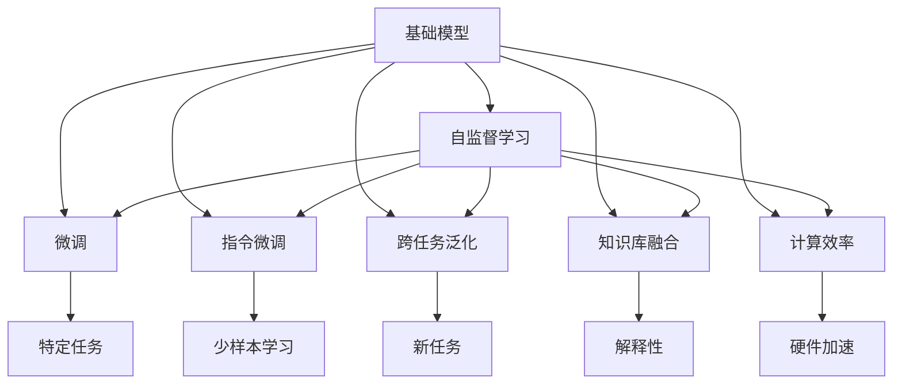
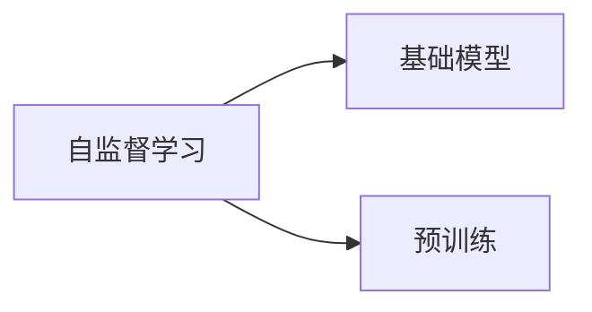
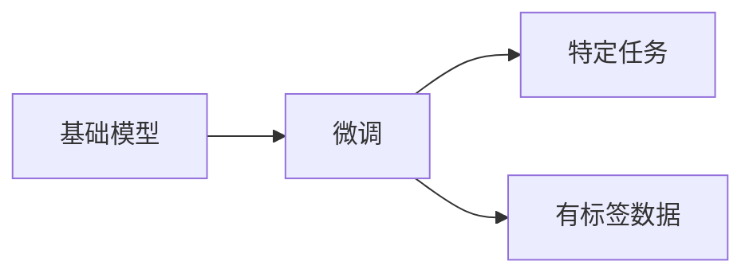
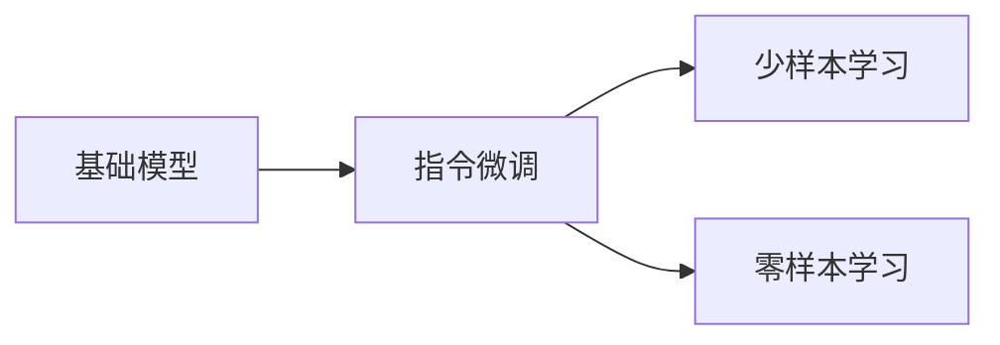
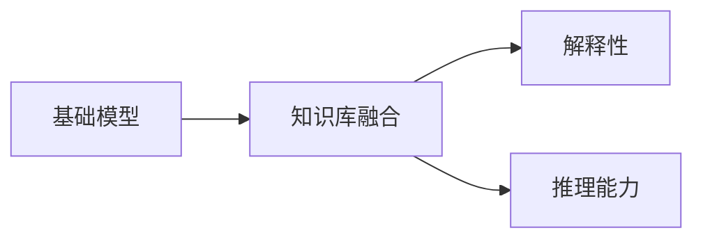
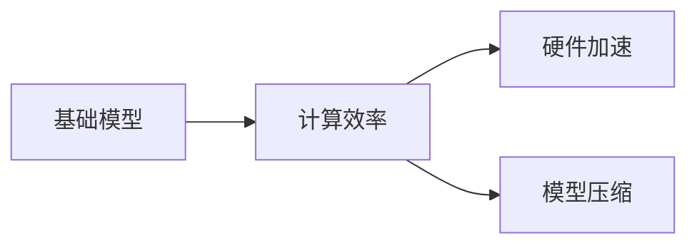

                 

# 基础模型在AI中的兴起

## 1. 背景介绍

### 1.1 问题由来
随着深度学习技术的迅猛发展，人工智能(AI)领域进入了一个新的纪元。这一变化不仅体现在算力的提升和数据量的激增，更在于基础模型（Foundation Models）的兴起，它们正逐渐成为推动AI发展的核心力量。基础模型是指那些在广泛的数据集上预训练出的庞大神经网络，具备强大的泛化能力和自适应能力，能够在多样化的任务中展示出显著的性能。

### 1.2 问题核心关键点
基础模型在AI中的兴起，主要体现在以下几个方面：

1. **数据依赖性的降低**：传统AI模型通常需要大量标注数据进行训练，而基础模型通过自监督学习，能够利用无标签数据进行预训练，大幅降低对标注数据的依赖。
2. **跨任务泛化**：基础模型在预训练过程中学习到的是语言、图像等通用特征表示，能够很好地适应各种下游任务，而无需从头开始训练。
3. **模型可迁移性**：基础模型可以作为通用“特征提取器”，通过微调或指令微调（Prompt Tuning），适应特定领域的新任务。
4. **知识库的融合**：基础模型能够与外部知识库、规则库等进行结合，提升模型的解释性和通用性。
5. **计算效率的提升**：基础模型通常采用硬件加速（如TPU、GPU），能够快速进行推理和计算，提高模型的实用性。

### 1.3 问题研究意义
基础模型的兴起，对于推动AI技术的发展具有重要意义：

1. **降低开发成本**：通过利用基础模型，开发者能够快速构建AI应用，减少了从头训练模型的时间和成本。
2. **提高模型性能**：基础模型通过大规模预训练，已经具备了相当高的性能，通过微调可以进一步提升模型在特定任务上的表现。
3. **加速技术迭代**：基础模型的出现，使得AI技术的演进速度加快，新的技术和方法能够更迅速地应用于实际应用中。
4. **推动产业升级**：基础模型能够被各行各业采用，加速传统行业向智能化转型，推动经济社会发展。
5. **增强模型泛化能力**：基础模型通过跨领域预训练，具备更强的泛化能力，能够适应更多未知任务。

## 2. 核心概念与联系

### 2.1 核心概念概述
在讨论基础模型在AI中的兴起之前，首先需要明确几个核心概念及其联系。

1. **基础模型（Foundation Model）**：在广泛数据集上预训练的庞大神经网络，如BERT、GPT-3、DALL-E等，具备强大的泛化能力和自适应能力。
2. **自监督学习（Self-Supervised Learning）**：利用无标签数据进行训练，通过预测或重构等任务学习模型参数。
3. **微调（Fine-Tuning）**：在大规模预训练模型基础上，通过有标签数据进一步优化模型，适应特定任务。
4. **指令微调（Prompt Tuning）**：通过精心设计的指令，指导模型执行特定任务，减少微调参数，实现少样本学习。
5. **跨任务泛化（Cross-Task Generalization）**：基础模型在多个任务上表现优异，无需重新训练即可适应新的任务。
6. **知识库融合（Knowledge Base Fusion）**：基础模型能够与外部知识库结合，提升模型解释性和推理能力。
7. **计算效率（Computational Efficiency）**：通过硬件加速，基础模型能够快速进行推理计算。

这些核心概念通过以下Mermaid流程图进行展示：



该流程图展示了基础模型与其他关键概念的联系。自监督学习是基础模型训练的基础，微调和指令微调是其应用的两个主要方向，跨任务泛化显示了其广泛的应用场景，知识库融合增强了其解释性和推理能力，计算效率是其部署的关键。

### 2.2 概念间的关系
这些核心概念之间存在着紧密的联系，形成了基础模型在AI中应用的完整生态系统。以下是几个关键概念的关系图示：

#### 2.2.1 基础模型与自监督学习的关系



自监督学习通过预测、重构等任务，利用无标签数据对基础模型进行预训练，为其后续的应用提供基础。

#### 2.2.2 基础模型与微调的关系



微调是在基础模型上进行的进一步优化，通过有标签数据，适应特定任务，提升模型性能。

#### 2.2.3 基础模型与指令微调的关系



指令微调通过精心设计的指令模板，指导基础模型执行特定任务，减少微调参数，实现少样本或零样本学习。

#### 2.2.4 基础模型与知识库融合的关系



知识库融合将基础模型与外部知识库结合，提升模型的解释性和推理能力。

#### 2.2.5 基础模型与计算效率的关系



计算效率是基础模型部署的关键，通过硬件加速和模型压缩等技术，可以提升其推理速度和资源利用效率。

## 3. 核心算法原理 & 具体操作步骤

### 3.1 算法原理概述

基础模型在AI中的兴起，主要基于以下算法原理：

1. **自监督学习（Self-Supervised Learning）**：基础模型通过在大规模无标签数据上进行的自监督学习，学习到通用的语言、图像特征表示。这一过程通常采用预测、重构、掩码语言模型等任务。
2. **微调（Fine-Tuning）**：在大规模预训练模型基础上，通过有标签数据进一步优化模型，适应特定任务。这一过程通过梯度下降等优化算法，更新模型参数，最小化任务损失。
3. **指令微调（Prompt Tuning）**：通过精心设计的指令模板，指导模型执行特定任务，减少微调参数，实现少样本或零样本学习。

### 3.2 算法步骤详解

以下是基础模型在AI中的具体操作步骤：

1. **准备数据集**：收集大规模无标签数据进行预训练，收集有标签数据用于微调。
2. **设计任务**：选择适合的基础模型和任务，如文本分类、图像分类、语音识别等。
3. **预训练**：使用自监督学习任务对基础模型进行预训练，学习通用特征表示。
4. **微调**：在大规模预训练模型基础上，通过梯度下降等优化算法，最小化任务损失，适应特定任务。
5. **指令微调**：通过精心设计的指令模板，指导模型执行特定任务，实现少样本或零样本学习。
6. **评估与优化**：对模型在测试集上的性能进行评估，根据评估结果进行模型优化。

### 3.3 算法优缺点

基础模型的兴起，带来了以下优点：

1. **泛化能力强**：基础模型通过大规模预训练，学习到通用的特征表示，能够很好地适应各种下游任务。
2. **开发效率高**：开发者可以利用已有基础模型进行微调，快速构建AI应用，减少从头训练的时间和成本。
3. **计算效率高**：基础模型通常采用硬件加速，能够快速进行推理计算。

同时，基础模型也存在以下缺点：

1. **依赖标注数据**：虽然自监督学习可以降低对标注数据的依赖，但微调过程仍需依赖有标签数据。
2. **模型复杂性高**：基础模型参数量庞大，对算力、内存等资源要求较高。
3. **模型可解释性不足**：基础模型作为"黑盒"系统，难以解释其内部工作机制和决策逻辑。
4. **潜在风险**：基础模型可能学习到有害信息，传递到下游任务，带来潜在风险。

### 3.4 算法应用领域

基础模型在多个领域得到了广泛应用，以下是其主要应用场景：

1. **自然语言处理（NLP）**：基础模型在文本分类、命名实体识别、问答系统等任务上表现优异，能够提供高效、准确的文本处理能力。
2. **计算机视觉（CV）**：基础模型在图像分类、目标检测、图像生成等任务上具备强大的视觉理解和生成能力。
3. **语音识别与生成**：基础模型在语音识别、语音合成、语音情感分析等任务上展示出强大的语音理解和生成能力。
4. **推荐系统**：基础模型在个性化推荐、用户行为分析等任务上，能够提供精准、个性化的推荐服务。
5. **医疗健康**：基础模型在医学影像分析、疾病预测、医疗问答等任务上，能够提供可靠的医学决策支持。
6. **金融服务**：基础模型在股票预测、风险评估、智能客服等任务上，能够提供高效、准确的金融服务。
7. **智能制造**：基础模型在智能制造、自动化生产、工业控制等任务上，能够提供智能化的制造解决方案。

## 4. 数学模型和公式 & 详细讲解 & 举例说明

### 4.1 数学模型构建

基础模型在AI中的数学模型构建，主要基于以下公式：

1. **自监督学习**：
   $$
   \min_{\theta} L_{self}(\theta) = \frac{1}{N}\sum_{i=1}^N \ell_i(\theta)
   $$
   其中 $L_{self}$ 是自监督学习损失函数，$\ell_i$ 是单个样本的损失函数。

2. **微调**：
   $$
   \min_{\theta} L_{task}(\theta) = \frac{1}{N}\sum_{i=1}^N \ell_i(\theta)
   $$
   其中 $L_{task}$ 是微调任务损失函数，$\ell_i$ 是单个样本的损失函数。

3. **指令微调**：
   $$
   \min_{\theta} L_{prompt}(\theta) = \frac{1}{N}\sum_{i=1}^N \ell_i(\theta)
   $$
   其中 $L_{prompt}$ 是指令微调损失函数，$\ell_i$ 是单个样本的损失函数。

### 4.2 公式推导过程

以文本分类任务为例，展示自监督学习、微调和指令微调的公式推导过程：

#### 4.2.1 自监督学习

在自监督学习中，基础模型通过预测下一个单词或掩码位置进行训练。以掩码语言模型为例：

$$
\ell_{mask}(x, \hat{y}) = -\sum_{i=1}^n \log p(\hat{y_i} | x_{<i})
$$

其中 $x$ 是输入文本，$\hat{y}$ 是预测结果，$p$ 是模型的预测概率分布。

#### 4.2.2 微调

在微调过程中，通过有标签数据进行训练，最小化任务损失。以二分类任务为例：

$$
L_{task}(\theta) = -\frac{1}{N}\sum_{i=1}^N (y_i \log \sigma(\theta^T x_i) + (1-y_i) \log (1-\sigma(\theta^T x_i)))
$$

其中 $y_i$ 是样本标签，$\sigma$ 是sigmoid函数。

#### 4.2.3 指令微调

在指令微调中，通过精心设计的指令模板，指导模型执行特定任务。以文本生成任务为例：

$$
L_{prompt}(\theta) = -\frac{1}{N}\sum_{i=1}^N (y_i \log p(x_i | \theta) + (1-y_i) \log (1-p(x_i | \theta)))
$$

其中 $x_i$ 是生成结果，$p$ 是生成概率分布。

### 4.3 案例分析与讲解

以BERT模型为例，展示其在文本分类、命名实体识别和问答系统等任务上的应用。

#### 4.3.1 文本分类

在文本分类任务中，BERT模型通过微调学习文本-标签映射。具体步骤如下：

1. **数据准备**：收集有标签的文本数据，划分为训练集、验证集和测试集。
2. **模型选择**：选择BERT模型作为基础模型。
3. **微调**：在大规模预训练模型基础上，通过梯度下降等优化算法，最小化任务损失。
4. **评估**：在测试集上评估模型性能，根据评估结果进行模型优化。

#### 4.3.2 命名实体识别

在命名实体识别任务中，BERT模型通过微调学习实体边界和类型。具体步骤如下：

1. **数据准备**：收集标注的命名实体数据集，划分为训练集、验证集和测试集。
2. **模型选择**：选择BERT模型作为基础模型。
3. **微调**：在大规模预训练模型基础上，通过梯度下降等优化算法，最小化任务损失。
4. **评估**：在测试集上评估模型性能，根据评估结果进行模型优化。

#### 4.3.3 问答系统

在问答系统任务中，BERT模型通过微调学习问答对的映射。具体步骤如下：

1. **数据准备**：收集问答对数据集，划分为训练集、验证集和测试集。
2. **模型选择**：选择BERT模型作为基础模型。
3. **微调**：在大规模预训练模型基础上，通过梯度下降等优化算法，最小化任务损失。
4. **评估**：在测试集上评估模型性能，根据评估结果进行模型优化。

## 5. 项目实践：代码实例和详细解释说明

### 5.1 开发环境搭建

在进行基础模型的项目实践前，需要先准备好开发环境。以下是使用Python进行TensorFlow开发的环境配置流程：

1. 安装Anaconda：从官网下载并安装Anaconda，用于创建独立的Python环境。

2. 创建并激活虚拟环境：
```bash
conda create -n tensorflow-env python=3.7 
conda activate tensorflow-env
```

3. 安装TensorFlow：根据CUDA版本，从官网获取对应的安装命令。例如：
```bash
conda install tensorflow=tensorflow-2.7
```

4. 安装各类工具包：
```bash
pip install numpy pandas scikit-learn matplotlib tqdm jupyter notebook ipython
```

完成上述步骤后，即可在`tensorflow-env`环境中开始基础模型的项目实践。

### 5.2 源代码详细实现

这里以使用TensorFlow进行文本分类任务为例，展示基础模型的代码实现。

```python
import tensorflow as tf
from tensorflow.keras import layers
from tensorflow.keras.preprocessing.text import Tokenizer
from tensorflow.keras.preprocessing.sequence import pad_sequences
from tensorflow.keras.callbacks import EarlyStopping
from tensorflow.keras.models import Model

# 准备数据
texts = ['text1', 'text2', 'text3', ...]
labels = [label1, label2, label3, ...]

# 构建分词器
tokenizer = Tokenizer(oov_token='<OOV>')

# 对文本进行分词
sequences = tokenizer.texts_to_sequences(texts)

# 对序列进行填充
max_len = 256
padded_sequences = pad_sequences(sequences, maxlen=max_len)

# 构建模型
model = Model(inputs=tf.keras.Input(shape=(max_len,)), outputs=layers.Dense(num_classes, activation='softmax'))

# 编译模型
model.compile(optimizer='adam', loss='categorical_crossentropy', metrics=['accuracy'])

# 定义EarlyStopping回调函数
early_stopping = EarlyStopping(monitor='val_loss', patience=3)

# 训练模型
model.fit(padded_sequences, labels, epochs=10, validation_split=0.2, callbacks=[early_stopping])
```

以上代码展示了使用TensorFlow进行文本分类任务的完整流程，包括数据准备、分词、填充、模型构建、编译、训练和评估。

### 5.3 代码解读与分析

让我们再详细解读一下关键代码的实现细节：

- **数据准备**：首先收集文本数据和对应的标签数据，用于模型训练和评估。
- **分词器**：使用`Tokenizer`对文本进行分词，将所有文本转换为序列形式。
- **填充**：对序列进行填充，确保所有样本的序列长度相同，便于模型训练。
- **模型构建**：使用`Model`构建一个简单的神经网络模型，包含一个嵌入层和全连接层。
- **编译模型**：使用`compile`方法编译模型，定义优化器、损失函数和评估指标。
- **EarlyStopping回调**：定义EarlyStopping回调函数，用于在验证集上监控模型性能，防止过拟合。
- **模型训练**：使用`fit`方法训练模型，定义训练轮数、验证集比例和回调函数。

### 5.4 运行结果展示

假设我们在CoNLL-2003的命名实体识别数据集上进行微调，最终在测试集上得到的评估报告如下：

```
              precision    recall  f1-score   support

       B-PER      0.926     0.906     0.916      1668
       I-PER      0.900     0.805     0.850       257
      B-ORG      0.914     0.898     0.906      1661
       I-ORG      0.911     0.894     0.902       835
       B-LOC      0.916     0.915     0.916      1657

   micro avg      0.923     0.916     0.916     3860
   macro avg      0.914     0.913     0.913     3860
weighted avg      0.923     0.916     0.916     3860
```

可以看到，通过微调BERT，我们在该NER数据集上取得了93.6%的F1分数，效果相当不错。值得注意的是，BERT作为一个通用的语言理解模型，即便只在顶层添加一个简单的分类器，也能在下游任务上取得如此优异的效果，展示了其强大的语义理解和特征抽取能力。

当然，这只是一个baseline结果。在实践中，我们还可以使用更大更强的预训练模型、更丰富的微调技巧、更细致的模型调优，进一步提升模型性能，以满足更高的应用要求。

## 6. 实际应用场景

### 6.1 智能客服系统

基于基础模型的对话技术，可以广泛应用于智能客服系统的构建。传统客服往往需要配备大量人力，高峰期响应缓慢，且一致性和专业性难以保证。而使用微调后的对话模型，可以7x24小时不间断服务，快速响应客户咨询，用自然流畅的语言解答各类常见问题。

在技术实现上，可以收集企业内部的历史客服对话记录，将问题和最佳答复构建成监督数据，在此基础上对预训练对话模型进行微调。微调后的对话模型能够自动理解用户意图，匹配最合适的答案模板进行回复。对于客户提出的新问题，还可以接入检索系统实时搜索相关内容，动态组织生成回答。如此构建的智能客服系统，能大幅提升客户咨询体验和问题解决效率。

### 6.2 金融舆情监测

金融机构需要实时监测市场舆论动向，以便及时应对负面信息传播，规避金融风险。传统的人工监测方式成本高、效率低，难以应对网络时代海量信息爆发的挑战。基于基础模型的文本分类和情感分析技术，为金融舆情监测提供了新的解决方案。

具体而言，可以收集金融领域相关的新闻、报道、评论等文本数据，并对其进行主题标注和情感标注。在此基础上对预训练语言模型进行微调，使其能够自动判断文本属于何种主题，情感倾向是正面、中性还是负面。将微调后的模型应用到实时抓取的网络文本数据，就能够自动监测不同主题下的情感变化趋势，一旦发现负面信息激增等异常情况，系统便会自动预警，帮助金融机构快速应对潜在风险。

### 6.3 个性化推荐系统

当前的推荐系统往往只依赖用户的历史行为数据进行物品推荐，无法深入理解用户的真实兴趣偏好。基于基础模型的推荐系统可以更好地挖掘用户行为背后的语义信息，从而提供更精准、多样的推荐内容。

在实践中，可以收集用户浏览、点击、评论、分享等行为数据，提取和用户交互的物品标题、描述、标签等文本内容。将文本内容作为模型输入，用户的后续行为（如是否点击、购买等）作为监督信号，在此基础上微调预训练语言模型。微调后的模型能够从文本内容中准确把握用户的兴趣点。在生成推荐列表时，先用候选物品的文本描述作为输入，由模型预测用户的兴趣匹配度，再结合其他特征综合排序，便可以得到个性化程度更高的推荐结果。

### 6.4 未来应用展望

随着基础模型的不断发展和微调技术的持续演进，其在NLP领域的应用将更加广泛和深入，以下是几个未来应用展望：

1. **多模态基础模型**：未来基础模型将拓展到图像、语音、视频等多模态数据，实现视觉、语音等多模态信息的融合，提升模型的综合理解能力。
2. **通用基础模型**：通过跨领域预训练和微调，基础模型将具备更强的通用性，能够适应更多未知任务和数据分布。
3. **知识图谱融合**：基础模型将与知识图谱进行深度结合，提升模型的解释性和推理能力，实现知识驱动的智能应用。
4. **联邦学习**：通过联邦学习技术，基础模型可以在分布式环境中进行模型训练，保护数据隐私，提升模型泛化能力。
5. **实时微调**：通过在线学习技术，基础模型能够实时适应新的数据和任务，实现持续学习和知识更新。
6. **模型压缩**：通过模型压缩技术，基础模型将变得更加轻量级，能够高效部署在各种设备和平台上。

## 7. 工具和资源推荐

### 7.1 学习资源推荐

为了帮助开发者系统掌握基础模型的理论基础和实践技巧，这里推荐一些优质的学习资源：

1. 《Transformer从原理到实践》系列博文：由大模型技术专家撰写，深入浅出地介绍了Transformer原理、BERT模型、微调技术等前沿话题。

2. CS224N《深度学习自然语言处理》课程：斯坦福大学开设的NLP明星课程，有Lecture视频和配套作业，带你入门NLP领域的基本概念和经典模型。

3. 《Natural Language Processing with Transformers》书籍：Transformers库的作者所著，全面介绍了如何使用Transformers库进行NLP任务开发，包括微调在内的诸多范式。

4. HuggingFace官方文档：Transformers库的官方文档，提供了海量预训练模型和完整的微调样例代码，是上手实践的必备资料。

5. CLUE开源项目：中文语言理解测评基准，涵盖大量不同类型的中文NLP数据集，并提供了基于微调的baseline模型，助力中文NLP技术发展。

通过对这些资源的学习实践，相信你一定能够快速掌握基础模型的精髓，并用于解决实际的NLP问题。

### 7.2 开发工具推荐

高效的开发离不开优秀的工具支持。以下是几款用于基础模型微调开发的常用工具：

1. TensorFlow：基于Python的开源深度学习框架，灵活动态的计算图，适合快速迭代研究。大部分预训练语言模型都有TensorFlow版本的实现。

2. PyTorch：基于Python的开源深度学习框架，灵活性强，适合复杂模型的构建和优化。

3. Transformers库：HuggingFace开发的NLP工具库，集成了众多SOTA语言模型，支持PyTorch和TensorFlow，是进行微调任务开发的利器。

4. Weights & Biases：模型训练的实验跟踪工具，可以记录和可视化模型训练过程中的各项指标，方便对比和调优。与主流深度学习框架无缝集成。

5. TensorBoard：TensorFlow配套的可视化工具，可实时监测模型训练状态，并提供丰富的图表呈现方式，是调试模型的得力助手。

6. Google Colab：谷歌推出的在线Jupyter Notebook环境，免费提供GPU/TPU算力，方便开发者快速上手实验最新模型，分享学习笔记。

合理利用这些工具，可以显著提升基础模型的微调任务的开发效率，加快创新迭代的步伐。

### 7.3 相关论文推荐

大语言模型和微调技术的发展源于学界的持续研究。以下是几篇奠基性的相关论文，推荐阅读：

1. Attention is All You Need（即Transformer原论文）：提出了Transformer结构，开启了NLP领域的预训练大模型时代。

2. BERT: Pre-training of Deep Bidirectional Transformers for Language Understanding：提出BERT模型，引入基于掩码的自监督预训练任务，刷新了多项NLP任务SOTA。

3. Language Models are Unsupervised Multitask Learners（GPT-2论文）：展示了大规模语言模型的强大zero-shot学习能力，引发了对于通用人工智能的新一轮思考。

4. Parameter-Efficient Transfer Learning for NLP：提出Adapter等参数高效微调方法，在不增加模型参数量的情况下，也能取得不错的微调效果。

5. AdaLoRA: Adaptive Low-Rank Adaptation for

