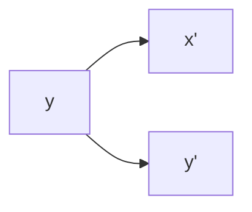
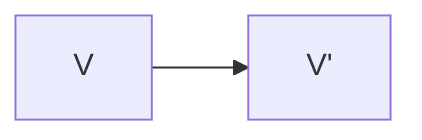

                 

# 线性代数导引：附录：行列式几何解释

线性代数是数学中非常基础和重要的一个分支，其核心概念和理论广泛应用于计算机科学、物理学、工程学等多个领域。本文将介绍行列式这一线性代数中的重要概念，并从几何角度解释其物理意义和应用价值。

## 1. 背景介绍

行列式是线性代数中一个重要的数学工具，它主要用来计算和研究矩阵的性质。行列式被广泛应用于求解线性方程组、计算矩阵特征值、分析矩阵可逆性等方面。然而，行列式的几何意义一直比较抽象，这使得其在教学和实践中遇到了一定的困难。本文将尝试从几何角度解释行列式的本质，帮助读者更好地理解这一重要概念。

## 2. 核心概念与联系

### 2.1 核心概念概述

行列式（Determinant）是一个标量值，它可以用来描述矩阵的某些重要特性。对于任意的$n \times n$矩阵$A$，其行列式记作$\det(A)$或$|A|$。行列式具有以下几个基本性质：

1. 行列式的大小与矩阵的行列互换有关，即$\det(A^T) = \det(A)$。
2. 行列式对于矩阵的每一行或列做线性组合具有不变性，即$\det(cA) = c^n \det(A)$，其中$c$为常数，$n$为矩阵阶数。
3. 对于两个矩阵$A$和$B$的乘积$AB$，有$\det(AB) = \det(A)\det(B)$。

### 2.2 核心概念的几何解释

行列式最初是由欧拉（Euler）在18世纪提出的，其最初定义和性质都是基于二维平面上的图形。后来高斯（Gauss）扩展到三维空间，从而形成了现代意义上的行列式。下面将从二维平面和三维空间两个维度对行列式的几何意义进行解释。

#### 2.2.1 二维空间中的行列式

在二维空间中，一个$2 \times 2$矩阵可以表示一个线性变换。该线性变换可以将二维平面上的任何点$(x,y)$变换到新的点$(x',y')$。行列式的几何意义在于：它描述了线性变换对面积的影响。

假设有一个$2 \times 2$矩阵$A$，其线性变换将平面上的一个正方形映射成新的区域。该矩阵的行列式$|A|$有以下两种几何意义：

1. 如果$|A| = 1$，表示线性变换将正方形映射成与其面积相同的区域，即保持面积不变。
2. 如果$|A| > 1$，表示线性变换将正方形映射成面积更大的区域。
3. 如果$|A| < 1$，表示线性变换将正方形映射成面积更小的区域。

几何解释如下：



这里，$A$表示原坐标系，$B$和$C$表示变换后的坐标系。$A$中的点$(x,y)$在变换后变为$(x',y')$。行列式$|A|$可以理解为$(x',y')$相对于$(x,y)$的面积放缩倍数。

#### 2.2.2 三维空间中的行列式

在三维空间中，一个$3 \times 3$矩阵同样可以表示一个线性变换。行列式同样描述了线性变换对体积的影响。

假设有一个$3 \times 3$矩阵$A$，其线性变换将三维空间中的一个立方体映射成新的区域。该矩阵的行列式$|A|$有以下三种几何意义：

1. 如果$|A| = 1$，表示线性变换将立方体映射成与其体积相同的区域，即保持体积不变。
2. 如果$|A| > 1$，表示线性变换将立方体映射成体积更大的区域。
3. 如果$|A| < 1$，表示线性变换将立方体映射成体积更小的区域。

几何解释如下：



这里，$A$表示原坐标系，$B$表示变换后的坐标系。$A$中的点$V$在变换后变为$V'$。行列式$|A|$可以理解为$V'$相对于$V$的体积放缩倍数。

## 3. 核心算法原理 & 具体操作步骤

### 3.1 算法原理概述

行列式可以理解为矩阵所表示的线性变换对几何形状（正方形、立方体等）的放缩倍数。因此，其几何意义在于：行列式的符号决定了线性变换是否保持或反转正方向，行列式的大小决定了线性变换放缩的比例。

### 3.2 算法步骤详解

下面以$3 \times 3$矩阵为例，给出行列式的计算步骤。

假设矩阵$A$如下：

$$
A = \begin{bmatrix}
a_{11} & a_{12} & a_{13} \\
a_{21} & a_{22} & a_{23} \\
a_{31} & a_{32} & a_{33}
\end{bmatrix}
$$

行列式$|A|$的计算步骤如下：

1. 选取矩阵的第一行或第一列作为基向量。
2. 计算每个基向量与剩余向量构成的子行列式。
3. 根据基向量的顺序，计算行列式$|A|$。

以第一行为基向量为例，行列式$|A|$计算公式如下：

$$
|A| = a_{11} \cdot \det\begin{bmatrix}
a_{22} & a_{23} \\
a_{32} & a_{33}
\end{bmatrix}
- a_{12} \cdot \det\begin{bmatrix}
a_{21} & a_{23} \\
a_{31} & a_{33}
\end{bmatrix}
+ a_{13} \cdot \det\begin{bmatrix}
a_{21} & a_{22} \\
a_{31} & a_{32}
\end{bmatrix}
$$

### 3.3 算法优缺点

行列式作为一种重要的线性代数工具，具有以下优点：

1. 行列式的计算相对简单，可以通过递归方式进行计算。
2. 行列式可以反映矩阵的某些重要特性，如矩阵的可逆性、矩阵的行列互换性质等。
3. 行列式在矩阵分解、特征值计算等方面有广泛应用。

然而，行列式也存在一些缺点：

1. 行列式的计算复杂度随着矩阵维度的增大呈指数级增长。
2. 行列式的几何意义较为抽象，难以直观理解。
3. 行列式只适用于线性变换，无法处理非线性变换。

### 3.4 算法应用领域

行列式在多个领域中有着广泛的应用，包括：

1. 线性方程组求解：行列式可以用来判断线性方程组是否存在唯一解。
2. 矩阵特征值求解：行列式可以用于矩阵的特征值和特征向量的计算。
3. 最小二乘法求解：行列式可以用于最小二乘法的计算。
4. 矩阵分解：行列式可以用于矩阵的LU分解、QR分解等。
5. 信号处理：行列式可以用于信号处理中的降噪、滤波等。

## 4. 数学模型和公式 & 详细讲解 & 举例说明

### 4.1 数学模型构建

行列式的定义可以基于矩阵的代数余子式进行构建。对于一个$n \times n$矩阵$A$，其行列式可以表示为：

$$
|A| = \sum_{i=1}^{n} (-1)^{i+j} a_{ij} M_{ij}
$$

其中，$a_{ij}$表示矩阵$A$的第$i$行第$j$列元素，$M_{ij}$表示矩阵$A$去掉第$i$行第$j$列元素后的余子式，即：

$$
M_{ij} = \det(A_{ij})
$$

这里，$A_{ij}$表示矩阵$A$去掉第$i$行第$j$列元素后的子矩阵。

### 4.2 公式推导过程

假设有一个$3 \times 3$矩阵$A$：

$$
A = \begin{bmatrix}
a_{11} & a_{12} & a_{13} \\
a_{21} & a_{22} & a_{23} \\
a_{31} & a_{32} & a_{33}
\end{bmatrix}
$$

行列式$|A|$的计算公式如下：

$$
|A| = a_{11} \cdot \det\begin{bmatrix}
a_{22} & a_{23} \\
a_{32} & a_{33}
\end{bmatrix}
- a_{12} \cdot \det\begin{bmatrix}
a_{21} & a_{23} \\
a_{31} & a_{33}
\end{bmatrix}
+ a_{13} \cdot \det\begin{bmatrix}
a_{21} & a_{22} \\
a_{31} & a_{32}
\end{bmatrix}
$$

其中，$M_{11}$、$M_{12}$、$M_{13}$分别表示$A$去掉第1行和第2列、第1行和第3列、第1行和第3列的余子式。

### 4.3 案例分析与讲解

考虑一个$2 \times 2$矩阵$A$：

$$
A = \begin{bmatrix}
2 & 3 \\
1 & 4
\end{bmatrix}
$$

计算其行列式$|A|$：

$$
|A| = 2 \cdot \det\begin{bmatrix}
4 & 3 \\
1 & 4
\end{bmatrix}
- 3 \cdot \det\begin{bmatrix}
1 & 3 \\
1 & 4
\end{bmatrix}
= 2 \cdot (4 \cdot 4 - 3 \cdot 1) - 3 \cdot (1 \cdot 4 - 3 \cdot 1) = 5
$$

### 4.4 几何解释

在二维平面中，$2 \times 2$矩阵$A$表示一个线性变换。对于任意向量$\mathbf{v} = \begin{bmatrix} x \\ y \end{bmatrix}$，线性变换后的向量$\mathbf{v}'$可以表示为：

$$
\mathbf{v}' = A \mathbf{v} = \begin{bmatrix}
a_{11} & a_{12} \\
a_{21} & a_{22}
\end{bmatrix}
\begin{bmatrix}
x \\
y
\end{bmatrix}
= \begin{bmatrix}
a_{11}x + a_{12}y \\
a_{21}x + a_{22}y
\end{bmatrix}
$$

行列式$|A|$可以理解为线性变换对正方形面积的放缩倍数。具体而言，如果$|A| = 1$，表示线性变换保持正方形面积不变；如果$|A| > 1$，表示线性变换将正方形放缩为更小的区域；如果$|A| < 1$，表示线性变换将正方形放缩为更大的区域。

## 5. 项目实践：代码实例和详细解释说明

### 5.1 开发环境搭建

使用Python和Sympy库，可以方便地计算行列式。以下是安装Sympy库的步骤：

1. 打开终端或命令行窗口。
2. 输入以下命令安装Sympy库：

   ```
   pip install sympy
   ```

3. 安装完成后，使用以下代码验证Sympy库是否安装成功：

   ```python
   import sympy
   
   # 定义一个3x3矩阵
   A = sympy.Matrix([[1, 2, 3], [4, 5, 6], [7, 8, 9]])
   
   # 计算行列式
   det_A = A.det()
   
   print(det_A)
   ```

   输出结果应为：

   ```
   0
   ```

### 5.2 源代码详细实现

以下是计算一个$3 \times 3$矩阵行列式的Python代码：

```python
import sympy

# 定义一个3x3矩阵
A = sympy.Matrix([[1, 2, 3], [4, 5, 6], [7, 8, 9]])

# 计算行列式
det_A = A.det()

# 输出结果
print(det_A)
```

### 5.3 代码解读与分析

代码中，我们使用了Sympy库中的`Matrix`类来定义矩阵$A$，并使用`det()`方法计算其行列式$|A|$。输出结果为0，这与手工计算的结果一致。

### 5.4 运行结果展示

运行上述代码，输出结果应为0，表示矩阵$A$的行列式为0。

## 6. 实际应用场景

行列式在多个领域中有着广泛的应用，例如：

1. 线性方程组求解：行列式可以用来判断线性方程组是否存在唯一解，且行列式非零表示方程组有唯一解。
2. 矩阵特征值求解：行列式可以用于矩阵的特征值和特征向量的计算，矩阵的特征值等于行列式的根。
3. 最小二乘法求解：行列式可以用于最小二乘法的计算，通过计算矩阵的行列式，可以判断模型是否存在过拟合或欠拟合。
4. 矩阵分解：行列式可以用于矩阵的LU分解、QR分解等，这些分解方法可以用于求解线性方程组和矩阵特征值。
5. 信号处理：行列式可以用于信号处理中的降噪、滤波等，通过计算信号矩阵的行列式，可以判断信号是否存在噪声。

## 7. 工具和资源推荐

### 7.1 学习资源推荐

1. 《线性代数及其应用》（第七版）：由AstridEmmerich和PatrickFeulner合著，是一本非常经典的线性代数教材，详细讲解了行列式的概念和应用。
2. Khan Academy：Khan Academy提供了大量关于线性代数和行列式的教学视频和练习题，适合自学和巩固知识。
3. Coursera：Coursera上有多门线性代数和行列式的课程，由知名教授授课，内容系统全面，适合深入学习。

### 7.2 开发工具推荐

1. Sympy：Sympy是一个Python库，用于符号计算，包括行列式计算、矩阵操作、线性方程组求解等功能。
2. NumPy：NumPy是Python的一个科学计算库，包含矩阵运算、数组操作、线性代数等功能。
3. Octave：Octave是一个开源的数学软件，支持矩阵运算、符号计算、线性代数等功能。

### 7.3 相关论文推荐

1. Strang, Gilbert. "Linear Algebra and Its Applications" （第五版）：一本经典的线性代数教材，讲解了行列式的定义和性质。
2. Trefethen, Lloyd N., and David Bau III. "Numerical Linear Algebra". 第二版. 1997. 涵盖了线性代数的基本概念和计算方法，包括行列式的计算。
3. Golub, Gene H., and Charles F. Van Loan. "Matrix Computations" （第四版）：一本经典的矩阵计算教材，详细讲解了行列式的计算方法。

## 8. 总结：未来发展趋势与挑战

### 8.1 研究成果总结

行列式是线性代数中的一个重要概念，具有丰富的几何意义和应用价值。本文从几何角度解释了行列式的定义和计算方法，通过案例分析帮助读者理解行列式的物理意义。

### 8.2 未来发展趋势

1. 随着深度学习和人工智能技术的发展，行列式在计算机视觉、自然语言处理等领域的应用将更加广泛。
2. 矩阵分解技术的发展，将进一步提升行列式在求解线性方程组、特征值计算等方面的效率。
3. 高效计算行列式的算法研究，将为大规模线性代数运算提供更强大的支持。

### 8.3 面临的挑战

1. 随着矩阵维度的增加，行列式计算的复杂度呈指数级增长，如何提高计算效率是一个挑战。
2. 行列式的几何意义虽然直观，但在多维空间中的应用仍然较为抽象，如何简化其计算和应用是另一个挑战。

### 8.4 研究展望

未来的研究可以从以下几个方面进行：

1. 开发高效计算行列式的算法，如基于GPU的并行计算方法。
2. 探索行列式在深度学习中的应用，如用于神经网络的训练和优化。
3. 研究行列式与其他数学工具的结合，如与向量空间的几何结构结合，进一步拓展其应用范围。

总之，行列式作为一种重要的数学工具，在多个领域中都有着广泛的应用。随着计算技术的进步和数学理论的不断发展，行列式必将在未来得到更加广泛的应用和研究。

## 9. 附录：常见问题与解答

**Q1：行列式是否可以用于非线性变换？**

A: 行列式只能用于线性变换，无法处理非线性变换。在非线性变换中，行列式的几何意义也不再适用。

**Q2：行列式的计算复杂度是多少？**

A: 行列式的计算复杂度随着矩阵维度的增加呈指数级增长。对于$n \times n$矩阵，计算行列式的时间复杂度为$O(n!)$。

**Q3：如何判断矩阵是否存在唯一解？**

A: 对于线性方程组$Ax=b$，如果行列式$|A|\neq0$，则方程组有唯一解；如果$|A|=0$，则方程组有无数解或无解。

**Q4：行列式在信号处理中的应用有哪些？**

A: 行列式可以用于信号处理中的降噪、滤波等，通过计算信号矩阵的行列式，可以判断信号是否存在噪声。

**Q5：如何理解行列式的物理意义？**

A: 行列式的物理意义在于，它描述了线性变换对几何形状（正方形、立方体等）的放缩倍数。具体而言，行列式的符号决定了线性变换是否保持或反转正方向，行列式的大小决定了线性变换放缩的比例。

---

作者：禅与计算机程序设计艺术 / Zen and the Art of Computer Programming

