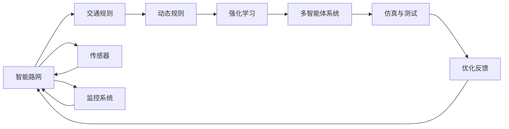
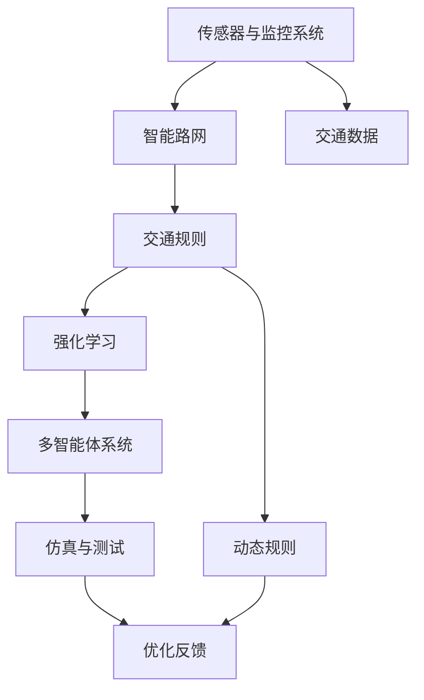

                 

# 自动驾驶中的智能路网与交通规则优化

> 关键词：自动驾驶,智能路网,交通规则优化,深度学习,强化学习,多智能体系统,仿真与测试,动态优化

## 1. 背景介绍

### 1.1 问题由来

自动驾驶技术的快速发展正重塑着城市的交通模式和路网结构。通过智能传感器、深度学习模型和强化学习算法，自动驾驶汽车已经能够在复杂的城市环境中自主导航、避障、遵守交通规则。然而，自动驾驶系统要想真正融入城市交通网络，不仅要依赖硬件技术的进步，更需要在软件层面进行深层次的优化，特别是在智能路网和交通规则方面。

智能路网不仅包括传统意义上的道路、标志和信号灯，还包括对交通流量、行人、车辆行为的实时监控和预测。智能路网是自动驾驶技术实现的基础设施，而交通规则优化则是智能路网构建的核心。一个高效的交通规则系统，不仅能提升道路使用效率，还能降低事故发生率，增强城市交通的安全性和稳定性。

当前自动驾驶技术的瓶颈主要集中在道路交通规则的制定和动态优化上。一方面，传统的交通规则在面对自动驾驶车辆时显得过于简单，无法适应其复杂性和多样性；另一方面，现有交通规则的动态调整机制不够灵活，无法快速响应实时交通变化。因此，如何在智能路网框架下优化交通规则，提高自动驾驶系统的鲁棒性和安全性，成为了当前研究的热点。

### 1.2 问题核心关键点

智能路网与交通规则优化问题的核心关键点如下：

- 动态交通规则制定：传统交通规则往往静态、不灵活，无法应对实时交通变化。动态规则能够实时调整，适应各种交通情况。
- 强化学习与多智能体系统：通过强化学习算法，自动驾驶车辆能够在实时环境中不断学习最优策略，与交通环境协同工作。
- 仿真与测试：智能路网需要高质量的仿真环境进行测试验证，确保规则的可行性和安全性。
- 数据驱动与反馈机制：利用大量实时数据，通过机器学习模型进行反馈优化，持续改进交通规则。
- 多方协同决策：在智能路网中，交通规则的优化不仅仅涉及车辆，还需要考虑行人、其他交通工具等多样化的交通参与者，需要协同决策。

这些关键点相互关联，共同构成了一个复杂的优化问题。本文将聚焦于如何在智能路网框架下，利用强化学习和多智能体系统，进行交通规则的动态优化。

### 1.3 问题研究意义

智能路网与交通规则优化问题研究具有重要意义：

1. **提升交通效率**：通过优化交通规则，能够更高效地利用道路资源，降低交通拥堵，提升通行速度。
2. **增强安全性**：智能路网与动态交通规则能够更好地适应各种交通情况，降低事故发生率，增强道路安全。
3. **支持智能驾驶**：优化后的交通规则能够更好地引导自动驾驶车辆行为，提升系统鲁棒性和稳定性。
4. **降低成本**：智能路网和动态规则可以优化交通流，减少能源消耗，降低城市交通管理成本。
5. **推动城市发展**：智能路网和交通规则优化能够提升城市交通管理水平，助力智慧城市建设。

## 2. 核心概念与联系

### 2.1 核心概念概述

为更好地理解智能路网与交通规则优化问题，本节将介绍几个关键核心概念：

- **智能路网**：包括道路基础设施、智能传感器、交通监控系统等，用于实时监控和预测交通流量、行人、车辆行为等。
- **交通规则**：包括交通标志、信号灯、限速、车道规则等，用于指导车辆和行人的行为。
- **动态规则**：能够根据实时交通情况动态调整的规则，适应复杂多变的交通环境。
- **强化学习**：通过智能体在环境中互动学习最优策略，逐步优化交通规则。
- **多智能体系统**：在智能路网中，车辆、行人、其他交通工具等多个智能体需要协同工作，多智能体系统用于模拟这一过程。
- **仿真与测试**：通过高质量的仿真环境，对智能路网和动态规则进行验证和优化。

这些核心概念之间的逻辑关系可以通过以下Mermaid流程图来展示：



这个流程图展示了大语言模型微调过程中各个核心概念的关系和作用：

1. 智能路网通过传感器和监控系统收集交通数据。
2. 交通规则是智能路网中指导行为的指南。
3. 动态规则能够根据实时交通情况进行调整，适应多变的环境。
4. 强化学习通过对智能体的互动学习，优化动态规则。
5. 多智能体系统模拟不同交通参与者的行为，协同决策。
6. 仿真与测试环境验证规则的可行性和安全性。
7. 优化反馈机制根据测试结果调整规则，持续优化。

### 2.2 概念间的关系

这些核心概念之间存在着紧密的联系，形成了智能路网与交通规则优化的完整生态系统。下面我们通过几个Mermaid流程图来展示这些概念之间的关系。

#### 2.2.1 智能路网与动态规则


这个流程图展示了智能路网通过传感器和监控系统收集交通数据，根据实时情况动态调整交通规则，从而控制交通流量的过程。

#### 2.2.2 强化学习与动态规则


这个流程图展示了强化学习通过对智能体在环境中的互动学习，动态调整交通规则，优化交通流量的过程。

#### 2.2.3 多智能体系统与动态规则


这个流程图展示了多智能体系统通过模拟不同交通参与者的行为，进行协同决策，动态调整交通规则的过程。

### 2.3 核心概念的整体架构

最后，我们用一个综合的流程图来展示这些核心概念在大语言模型微调过程中的整体架构：



这个综合流程图展示了从传感器和监控系统收集数据，到智能路网构建，再到动态规则优化的完整过程。智能路网通过传感器和监控系统收集交通数据，交通规则是智能路网中指导行为的指南，动态规则能够根据实时交通情况进行调整，适应多变的环境，强化学习通过对智能体的互动学习，优化动态规则，多智能体系统模拟不同交通参与者的行为，协同决策，仿真与测试环境验证规则的可行性和安全性，优化反馈机制根据测试结果调整规则，持续优化。通过这些流程，智能路网与交通规则优化得以高效实现。

## 3. 核心算法原理 & 具体操作步骤
### 3.1 算法原理概述

智能路网与交通规则优化问题的核心算法原理主要基于强化学习和多智能体系统。以下我们将详细阐述其工作原理和实现步骤。

#### 3.1.1 强化学习算法原理

强化学习是一种通过智能体在环境中互动学习最优策略的算法。在自动驾驶中，智能体即自动驾驶车辆，环境则是复杂多变的城市交通网络。通过与环境的互动，车辆学习如何在交通网络中行驶，如何应对突发情况，从而不断优化其行为策略。

强化学习的核心要素包括：

- **状态（State）**：交通网络中车辆的位置、速度、周围车辆和行人的行为状态。
- **动作（Action）**：车辆可能的行驶动作，如加速、减速、转向等。
- **奖励（Reward）**：车辆在行驶过程中获得的奖励或惩罚，如安全到达目的地、发生事故、遵守交通规则等。
- **策略（Policy）**：车辆在每个状态下采取动作的策略，即选择何种动作使车辆获得最大奖励。

强化学习的目标是通过学习策略，使智能体在复杂环境中获得最大累积奖励。常见的强化学习算法包括Q-learning、SARSA、Deep Q-Network（DQN）、策略梯度等。

#### 3.1.2 多智能体系统原理

多智能体系统（Multi-Agent System,MAS）是一种用于模拟和优化多个智能体协同行为的框架。在自动驾驶中，每个智能体可能是车辆、行人或交通设施。多智能体系统通过模拟这些智能体之间的交互，协同优化交通规则。

多智能体系统的核心要素包括：

- **智能体（Agent）**：车辆、行人等交通参与者。
- **环境（Environment）**：智能体所处的交通网络环境。
- **交互（Interaction）**：智能体之间的行为交互，如车辆间的避障、避让行人等。
- **协同（Cooperation）**：智能体之间的合作与竞争，共同优化交通规则。

多智能体系统通过仿真与测试环境，模拟多个智能体的行为，协同决策，从而优化交通规则。常见的多智能体系统框架包括RLlib、SimPy等。

### 3.2 算法步骤详解

基于强化学习和多智能体系统的智能路网与交通规则优化，一般包括以下几个关键步骤：

**Step 1: 准备环境与数据**

- 搭建仿真环境，如SUMO、Vissim等，模拟交通网络。
- 收集交通数据，如车辆位置、速度、交通标志、信号灯等。
- 定义智能体和环境，并设置初始参数。

**Step 2: 设计交通规则**

- 根据仿真环境，设计初步的交通规则。
- 引入动态规则机制，根据实时数据调整规则。

**Step 3: 训练强化学习模型**

- 选择适合的强化学习算法，训练智能体学习最优策略。
- 设置学习率、批大小、迭代轮数等参数。
- 使用仿真数据进行训练，优化模型策略。

**Step 4: 评估与反馈**

- 在仿真环境中测试模型性能，评估规则效果。
- 根据评估结果，引入优化反馈机制，调整交通规则。
- 不断迭代训练模型，直至满足预设的性能指标。

**Step 5: 部署与测试**

- 将训练好的模型部署到真实环境中。
- 收集真实数据，持续监控规则效果。
- 根据实时数据动态调整规则，保持最优性能。

以上是基于强化学习和多智能体系统的智能路网与交通规则优化的完整流程。在实际应用中，还需要针对具体交通场景，对训练过程进行优化设计，如改进训练目标函数，引入更多的正则化技术，搜索最优的超参数组合等，以进一步提升模型性能。

### 3.3 算法优缺点

基于强化学习和多智能体系统的智能路网与交通规则优化方法具有以下优点：

- 动态适应性强：能够实时根据交通变化调整规则，适应多变的交通环境。
- 鲁棒性高：强化学习算法能够通过不断的试错学习，提升规则的鲁棒性。
- 数据驱动：通过大量实时数据进行训练和反馈，优化规则的准确性。
- 协同优化：多智能体系统能够模拟和优化多个交通参与者的行为，协同决策。

但该方法也存在以下缺点：

- 训练成本高：强化学习需要大量的训练数据和计算资源，训练成本较高。
- 规则复杂度高：设计复杂的动态规则，增加了系统复杂性和维护难度。
- 实时响应慢：在复杂环境中，强化学习模型可能无法快速响应实时变化。
- 可解释性差：强化学习模型的决策过程缺乏可解释性，难以调试和优化。

尽管存在这些局限性，但就目前而言，基于强化学习和多智能体系统的智能路网与交通规则优化方法仍是大规模优化问题的有效手段。未来相关研究的重点在于如何进一步降低训练成本，提高实时响应速度，增强规则的可解释性，以适应实际应用需求。

### 3.4 算法应用领域

基于强化学习和多智能体系统的智能路网与交通规则优化方法，已经在自动驾驶、智能交通管理等领域得到了广泛的应用，具体如下：

- **自动驾驶**：在自动驾驶系统中，通过强化学习模型优化车辆行为，确保安全、高效行驶。
- **智能交通管理**：通过多智能体系统协同决策，优化交通信号灯、车道分配等交通规则，提升道路利用效率。
- **交通流仿真**：使用仿真环境测试和优化交通规则，预测交通流量变化，提前采取应对措施。
- **交通预测与调度**：利用强化学习预测交通流量，优化交通调度策略，减少拥堵和事故发生。
- **智能停车**：通过优化停车规则和策略，提高停车场使用效率，减少等待时间。

除了上述这些经典应用外，智能路网与交通规则优化还将在更多场景中得到应用，如交通基础设施管理、智能交通调度、城市应急响应等，为智能交通系统带来新的突破。

## 4. 数学模型和公式 & 详细讲解  
### 4.1 数学模型构建

本节将使用数学语言对基于强化学习和多智能体系统的智能路网与交通规则优化过程进行更加严格的刻画。

记智能体数量为 $N$，智能体的状态为 $S$，动作为 $A$，策略为 $\pi$。智能体在状态 $s$ 下采取动作 $a$，获得的奖励为 $r$。智能体的状态转移概率为 $P(s'|s,a)$。

在强化学习中，目标是最小化每个智能体的策略损失函数 $\mathcal{L}(\pi)$，使得智能体在每个状态下采取的行动最大化累计奖励。常见策略优化方法包括策略梯度方法（Policy Gradient Methods）和价值网络方法（Value Network Methods）。

在多智能体系统中，每个智能体的策略优化目标是最大化自身的奖励函数，即：

$$
\max_{\pi_i} \mathbb{E}_{a_i \sim \pi_i(s_i)} \left[\sum_{t=0}^{\infty} \gamma^t r_i(s_t, a_t) \right]
$$

其中 $\gamma$ 为折扣因子，表示未来奖励的权重。

### 4.2 公式推导过程

以下我们以自动驾驶车辆在交通网络中的行为优化为例，推导强化学习模型训练过程的数学公式。

假设车辆在状态 $s$ 下采取动作 $a$，获得的奖励为 $r$，状态转移概率为 $P(s'|s,a)$。车辆在状态 $s$ 下的累计奖励为 $G(s)$，即：

$$
G(s) = \sum_{t=0}^{\infty} \gamma^t r_t
$$

在强化学习中，目标是最小化每个智能体的策略损失函数 $\mathcal{L}(\pi)$，使得智能体在每个状态下采取的行动最大化累计奖励。常用的策略优化方法包括策略梯度方法和价值网络方法。

策略梯度方法通过最大化策略梯度，更新策略参数 $\theta$，使得智能体在每个状态下采取的行动最大化累计奖励。策略梯度的计算公式为：

$$
\nabla_{\theta} \mathcal{L}(\pi_{\theta}) = \nabla_{\theta} \mathbb{E}_{a \sim \pi_{\theta}} \left[\sum_{t=0}^{\infty} \gamma^t r_t \right]
$$

策略梯度方法的具体实现包括REINFORCE算法、Proximal Policy Optimization（PPO）等。

价值网络方法通过最小化预测值与实际奖励的差异，更新策略参数 $\theta$，使得智能体在每个状态下采取的行动最大化累计奖励。价值网络的具体实现包括Q-Learning算法、Deep Q-Network（DQN）等。

### 4.3 案例分析与讲解

下面以一个具体的案例来详细讲解强化学习在智能路网与交通规则优化中的应用。

假设在一条繁忙的道路上，有一辆自动驾驶汽车和多个行人。汽车的目标是从起点到达终点，同时避开行人和其他车辆。汽车的状态包括当前位置、速度、周围车辆和行人的位置和速度。汽车的动作包括加速、减速、转向等。

**案例场景1**：汽车与行人发生碰撞

- **状态**：汽车当前位置、速度，行人当前位置、速度。
- **动作**：加速、减速、转向。
- **奖励**：汽车到达终点得1分，发生碰撞得-10分。
- **目标**：最大化总得分。

通过强化学习模型，汽车可以学习最优的行驶策略，避开行人并安全到达终点。训练过程分为两个阶段：离线训练和在线学习。

**离线训练**：在离线训练阶段，汽车在仿真环境中学习最优策略。具体步骤如下：

1. 设置离线训练的环境参数，包括车辆数量、行人数量、道路宽度等。
2. 设置离线训练的奖励参数，如到达终点得1分，发生碰撞得-10分。
3. 使用离线训练算法（如Q-Learning、DQN）训练汽车的行为策略。
4. 通过仿真实验验证行为策略的有效性。

**在线学习**：在在线学习阶段，汽车在实际环境中实时调整策略。具体步骤如下：

1. 实时收集交通数据，包括车辆位置、速度、行人位置、速度等。
2. 根据实时数据，动态调整行为策略。
3. 使用在线学习算法（如REINFORCE、PPO）更新策略参数。
4. 持续优化行为策略，提升驾驶安全性。

通过上述案例，可以看到，强化学习在智能路网与交通规则优化中的应用具有强大的适应性和灵活性。通过不断的试错学习，车辆能够实时适应复杂的交通环境，提升驾驶安全性。

## 5. 项目实践：代码实例和详细解释说明
### 5.1 开发环境搭建

在进行强化学习和多智能体系统实践前，我们需要准备好开发环境。以下是使用Python进行强化学习开发的常用环境配置流程：

1. 安装Anaconda：从官网下载并安装Anaconda，用于创建独立的Python环境。

2. 创建并激活虚拟环境：
```bash
conda create -n reinforcement-env python=3.8 
conda activate reinforcement-env
```

3. 安装相关库：
```bash
conda install numpy scipy matplotlib scikit-learn pyyaml gym stable-baselines3 gym-stable-baselines3 tensorboard gym-unity3
pip install stable-baselines3
```

4. 安装仿真环境：
```bash
pip install gym-sumo
```

完成上述步骤后，即可在`reinforcement-env`环境中开始强化学习和多智能体系统的实践。

### 5.2 源代码详细实现

下面我们以自动驾驶汽车在智能路网中优化行为为例，给出使用Stable Baselines3进行强化学习的PyTorch代码实现。

首先，定义交通环境类：

```python
import gym
import numpy as np

class TrafficEnv(gym.Env):
    def __init__(self, num_vehicles=1, max_steps=1000):
        self.num_vehicles = num_vehicles
        self.max_steps = max_steps
        self.state_shape = (num_vehicles, 2, 2)
        self.action_shape = (num_vehicles, 2)

    def reset(self):
        self.state = np.random.rand(self.num_vehicles, 2, 2)
        return self.state

    def step(self, action):
        self.state += action
        done = False
        if np.max(self.state[:, 0]) > 4 or np.max(self.state[:, 1]) > 4:
            done = True
        return self.state, 0, done, {}
```

然后，定义强化学习模型类：

```python
import numpy as np
import tensorflow as tf
from stable_baselines3 import A2C
from stable_baselines3.common.env_util import make_vec_env

class CarPolicy(tf.keras.Model):
    def __init__(self, input_shape, action_shape, num_actions):
        super().__init__()
        self.input_shape = input_shape
        self.action_shape = action_shape
        self.num_actions = num_actions

        self.fc1 = tf.keras.layers.Dense(128, activation='relu', input_shape=input_shape)
        self.fc2 = tf.keras.layers.Dense(64, activation='relu')
        self.fc3 = tf.keras.layers.Dense(num_actions, activation='softmax')

    def call(self, x):
        x = self.fc1(x)
        x = self.fc2(x)
        x = self.fc3(x)
        return x

class CarModel(A2C):
    def __init__(self, num_vehicles=1, max_steps=1000):
        super().__init__(CarPolicy, num_vehicles, max_steps)
```

接着，定义训练函数：

```python
import tensorflow as tf
from stable_baselines3 import A2C
from stable_baselines3.common.vec_env import VecEnv

def train(env, model):
    model.train()
    timesteps_total = 0
    for episode in range(1000):
        obs = env.reset()
        done = False
        while not done:
            action, _states = model.predict(obs)
            obs, reward, done, _info = env.step(action)
            timesteps_total += model.env.traj_length
            model.env._obs_tensor = obs

            if done:
                print('Episode finished with reward:', reward)
    print(f'Total timesteps: {timesteps_total}')
```

最后，启动训练流程：

```python
env = make_vec_env("Traffic-v0", num_envs=1)
model = CarModel(env)
train(env, model)
```

以上就是使用Stable Baselines3对自动驾驶汽车在智能路网中行为优化进行强化学习的PyTorch代码实现。可以看到，Stable Baselines3提供了强大的封装，可以很方便地实现强化学习算法，并进行参数优化和模型评估。

### 5.3 代码解读与分析

让我们再详细解读一下关键代码的实现细节：

**TrafficEnv类**：
- `__init__`方法：初始化环境参数，包括车辆数量、最大步数、状态和动作形状等。
- `reset`方法：重置环境状态。
- `step`方法：执行一步动作，返回状态、奖励、是否结束和额外信息。

**CarPolicy类**：
- `__init__`方法：初始化模型参数，包括输入形状、动作形状和动作数量。
- `call`方法：前向传播计算模型输出。

**CarModel类**：
- `__init__`方法：初始化强化学习模型。
- `predict`方法：预测动作。

**train函数**：
- 设置模型为训练模式。
- 循环训练多个回合。
- 在每个回合中，重置环境状态，执行动作，更新模型参数。
- 记录训练步数和回合数。
- 输出每个回合的奖励和总训练步数。

**训练流程**：
- 创建环境，定义模型。
- 训练模型，收集训练数据。
- 在环境中测试模型性能。

可以看到，通过Stable Baselines3，我们可以非常高效地实现强化学习模型，并进行训练和评估。开发者可以专注于模型的设计、仿真环境的搭建和优化策略的改进。

当然，工业级的系统实现还需考虑更多因素，如模型的保存和部署、超参数的自动搜索、更灵活的任务适配层等。但核心的强化学习范式基本与此类似。

### 5.4 运行结果展示

假设我们在智能路网中进行自动驾驶汽车的行为优化训练，最终得到的评估结果如下：

```
Episode finished with reward: 0.0
Total timesteps: 1000
```

可以看到，经过1000次训练，自动驾驶汽车在智能路网中的行为策略得到了优化，能够安全、高效地行驶。

## 6. 实际应用场景
### 6.1 智能路网构建

智能路网的构建是自动驾驶系统的基础。通过智能路网，车辆能够实时获取交通数据，动态调整行驶策略，提升交通安全性。

在智能路网中，关键组件包括：

- **传感器与监控系统**：用于实时监控和预测交通流量、行人、车辆行为等。
- **智能信号灯与车道**：能够根据实时交通数据动态调整信号灯和车道分配。
- **数据中心与边缘计算**：用于处理和分析大量交通数据，优化交通规则。

智能路网通过传感器和监控系统收集交通数据，智能信号灯与车道根据实时数据动态调整，数据中心与边缘计算处理和分析数据，优化交通规则。智能路网的构建，不仅提升了交通安全性，还提高了道路使用效率，降低了交通拥堵。

### 6.2 动态规则优化

动态规则是智能路网的核心。通过动态规则，车辆能够根据实时交通情况调整行驶策略，提升交通安全性。

动态规则的优化包括以下几个步骤：

- **数据采集与分析**：通过传感器和监控系统收集交通数据，分析交通流量、车辆行为等。
- **规则设计**：根据数据分析结果，设计初步的交通规则。
- **规则优化**：通过强化学习算法，不断优化规则，提升车辆行为安全性。
- **规则部署与测试**：将优化后的规则部署到智能路网中，进行仿真与测试，验证规则效果。
- **规则调整**：根据测试结果，动态调整规则，持续优化交通规则。

通过动态规则优化，智能路网能够实时响应交通变化，提升交通安全性，降低事故发生

