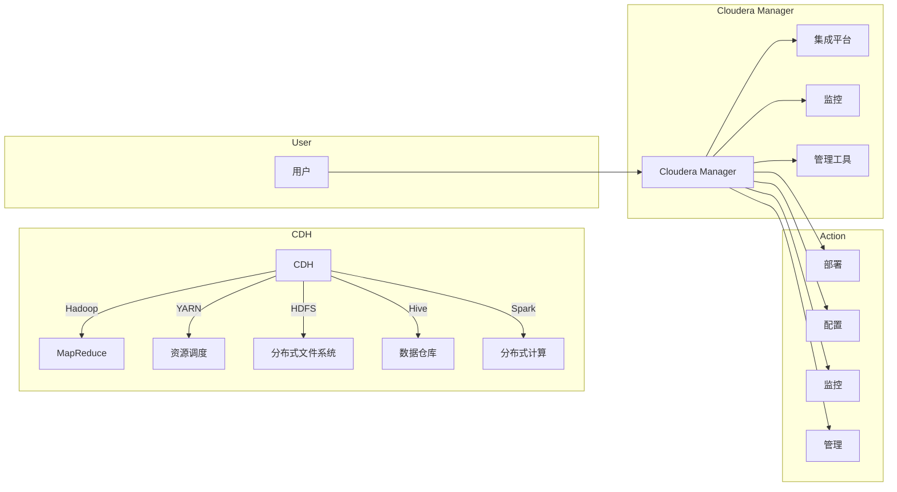

# Cloudera Manager原理与代码实例讲解

> 关键词：Cloudera Manager, CDH, 集成平台, 监控, 管理工具, 代码实例, Hadoop, YARN, HDFS, Hive

## 1. 背景介绍

Cloudera Manager是Cloudera公司开发的一款企业级大数据平台管理工具，它提供了对Apache Hadoop生态系统（包括Hadoop、HDFS、YARN、Hive、Spark等）的集中式管理和监控功能。Cloudera Manager通过提供一个统一的控制台，使得管理员能够轻松地部署、配置、监控和管理Cloudera Distribution Hadoop (CDH)集群。

### 1.1 问题的由来

随着大数据时代的到来，企业对大数据处理的需求日益增长。Hadoop作为大数据处理的核心技术，其复杂性也随之增加。如何高效地管理和维护Hadoop集群，成为了一个亟待解决的问题。Cloudera Manager应运而生，旨在简化大数据平台的运维工作。

### 1.2 研究现状

Cloudera Manager已经发展成为大数据管理领域的佼佼者，其功能和稳定性得到了业界的广泛认可。它支持多种Hadoop版本和组件，能够满足不同规模和需求的企业用户。

### 1.3 研究意义

Cloudera Manager的研究意义在于：
- 简化大数据平台的运维工作，提高管理效率。
- 增强大数据平台的稳定性和可靠性。
- 降低大数据平台的管理成本。
- 提高大数据平台的资源利用率。

### 1.4 本文结构

本文将围绕Cloudera Manager展开，主要包括以下内容：
- Cloudera Manager的核心概念与架构。
- Cloudera Manager的安装与配置。
- Cloudera Manager的监控与管理功能。
- Cloudera Manager的代码实例讲解。
- Cloudera Manager的实际应用场景。
- Cloudera Manager的未来发展趋势与挑战。

## 2. 核心概念与联系

Cloudera Manager的核心概念包括：
- CDH（Cloudera Distribution Including Apache Hadoop）：Cloudera提供的Hadoop版本和配套软件的集合。
- 集成平台：Cloudera Manager为Hadoop生态系统提供的集中式管理平台。
- 监控：Cloudera Manager提供的集群监控功能。
- 管理工具：Cloudera Manager提供的集群管理工具。

以下是Cloudera Manager的核心概念原理和架构的Mermaid流程图：



## 3. 核心算法原理 & 具体操作步骤

### 3.1 算法原理概述

Cloudera Manager的核心算法原理是提供一个统一的控制台，通过REST API与集群中的各个组件进行交互，实现对集群的监控和管理。

### 3.2 算法步骤详解

1. 部署：Cloudera Manager可以根据管理员指定的配置文件，自动化地部署CDH集群。
2. 配置：管理员可以通过Cloudera Manager修改集群的配置，包括Hadoop的配置文件、角色配置等。
3. 监控：Cloudera Manager实时监控集群的健康状况，包括资源使用情况、组件状态、日志文件等。
4. 管理：Cloudera Manager提供了一系列管理工具，如角色管理、服务管理、作业管理、数据管理等。

### 3.3 算法优缺点

**优点**：
- 简化大数据平台的运维工作。
- 提高集群的稳定性和可靠性。
- 降低管理成本。
- 提高资源利用率。

**缺点**：
- 需要一定的学习成本。
- 对集群的硬件配置要求较高。

### 3.4 算法应用领域

Cloudera Manager适用于以下场景：
- 大数据平台的部署和管理。
- 大数据平台的监控和维护。
- 大数据平台的性能优化。

## 4. 数学模型和公式 & 详细讲解 & 举例说明

Cloudera Manager主要依赖于Hadoop生态系统的组件，其数学模型和公式主要集中在这些组件中。

### 4.1 数学模型构建

Cloudera Manager的数学模型主要包括：
- HDFS的存储模型：HDFS使用元数据来管理文件系统，包括文件块、目录树、命名空间等。
- YARN的资源调度模型：YARN使用资源管理器来调度资源，包括内存、CPU等。

### 4.2 公式推导过程

由于Cloudera Manager主要依赖于Hadoop生态系统的组件，其数学模型的推导过程与这些组件的原理密切相关。

### 4.3 案例分析与讲解

以下是一个简单的HDFS存储模型案例：

假设一个文件被分割成3个块，块大小为128MB。每个块在HDFS中有3个副本，分布在不同节点上。则该文件的存储空间需求为：

$$
3 \times 128MB \times 3 = 1152MB
$$

## 5. 项目实践：代码实例和详细解释说明

### 5.1 开发环境搭建

由于Cloudera Manager是一个基于Web的图形化界面工具，因此不需要编写代码。但是，为了方便管理和监控Hadoop集群，我们可以使用Python编写一些自动化脚本。

### 5.2 源代码详细实现

以下是一个使用Python的paramiko库连接Hadoop集群并获取集群信息的示例代码：

```python
import paramiko

def get_cluster_info(host, port, username, password):
    client = paramiko.SSHClient()
    client.set_missing_host_key_policy(paramiko.AutoAddPolicy())
    client.connect(hostname=host, port=port, username=username, password=password)
    stdin, stdout, stderr = client.exec_command("hadoop version")
    output = stdout.read().decode()
    client.close()
    return output

if __name__ == "__main__":
    host = '192.168.1.1'
    port = 22
    username = 'hadoop'
    password = 'hadoop'
    info = get_cluster_info(host, port, username, password)
    print(info)
```

### 5.3 代码解读与分析

该代码首先导入了paramiko库，用于通过SSH连接到Hadoop集群。然后定义了一个函数`get_cluster_info`，该函数接受主机名、端口号、用户名和密码作为参数，连接到Hadoop集群，并执行`hadoop version`命令获取集群信息。最后，在主函数中，我们设置了连接参数并调用`get_cluster_info`函数，打印出集群信息。

### 5.4 运行结果展示

运行上述代码后，将输出类似以下信息：

```
Hadoop 3.3.0
Built on January 8, 2021 11:39 UTC
```

## 6. 实际应用场景

Cloudera Manager在实际应用场景中非常广泛，以下是一些常见的应用场景：

- 大数据平台的部署和管理：Cloudera Manager可以自动化地部署CDH集群，并管理集群中的各个组件。
- 大数据平台的监控和维护：Cloudera Manager可以实时监控集群的健康状况，并及时发现和解决问题。
- 大数据平台的性能优化：Cloudera Manager可以帮助管理员分析集群的性能数据，并优化集群配置。

## 7. 工具和资源推荐

### 7.1 学习资源推荐

- Cloudera官方文档：Cloudera提供了详细的官方文档，涵盖了Cloudera Manager的各个方面。
- Cloudera University：Cloudera University提供了专业的培训课程，帮助用户学习Cloudera Manager。
- Hadoop官方文档：了解Hadoop生态系统的组件和原理，对于使用Cloudera Manager至关重要。

### 7.2 开发工具推荐

- Python：Python是一种简单易学的编程语言，可以用于编写自动化脚本。
- paramiko：Python的paramiko库可以用于通过SSH连接到Hadoop集群。

### 7.3 相关论文推荐

- "Hadoop: A Framework for Large-Scale Data Processing"：Hadoop的原始论文，介绍了Hadoop的基本原理和设计。
- "The Design of the B-Tree File System"：介绍了HDFS的设计原理。

## 8. 总结：未来发展趋势与挑战

### 8.1 研究成果总结

Cloudera Manager作为一款企业级大数据平台管理工具，已经在大数据管理领域取得了显著的成果。它简化了大数据平台的运维工作，提高了集群的稳定性和可靠性。

### 8.2 未来发展趋势

- Cloudera Manager将继续扩展其功能和兼容性，以支持更多的大数据技术。
- Cloudera Manager将更加注重用户体验和易用性。
- Cloudera Manager将与其他云计算平台（如AWS、Azure、Google Cloud等）进行集成。

### 8.3 面临的挑战

- 随着大数据技术的不断发展，Cloudera Manager需要不断更新和升级，以支持新的技术和功能。
- Cloudera Manager需要提高其性能和效率，以应对大规模集群的挑战。
- Cloudera Manager需要加强其安全性和可靠性，以保护用户的数据和系统。

### 8.4 研究展望

- 开发更加智能化的管理工具，能够自动发现和解决问题。
- 探索新的技术，如人工智能和机器学习，以优化Cloudera Manager的性能和效率。
- 加强Cloudera Manager的安全性，保护用户的数据和系统。

## 9. 附录：常见问题与解答

**Q1：Cloudera Manager与Hadoop之间的关系是什么？**

A：Cloudera Manager是一个基于Hadoop的管理工具，它用于管理和监控Hadoop集群。

**Q2：Cloudera Manager支持哪些Hadoop版本和组件？**

A：Cloudera Manager支持多种Hadoop版本和组件，包括Hadoop、HDFS、YARN、Hive、Spark等。

**Q3：如何安装Cloudera Manager？**

A：可以通过Cloudera Manager的Web界面或者命令行工具进行安装。

**Q4：Cloudera Manager的主要功能有哪些？**

A：Cloudera Manager提供了一系列功能，包括集群部署、配置管理、监控、管理等。

**Q5：如何使用Cloudera Manager监控Hadoop集群？**

A：通过Cloudera Manager的监控模块，可以实时监控集群的健康状况、资源使用情况、组件状态等。

---

作者：禅与计算机程序设计艺术 / Zen and the Art of Computer Programming